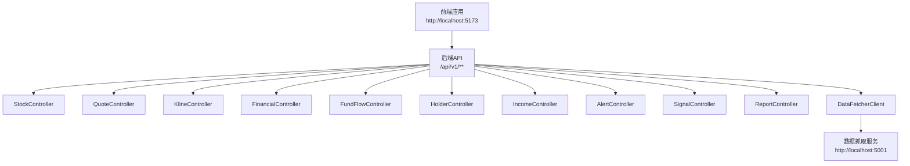
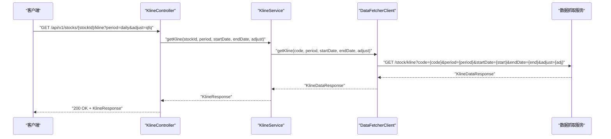
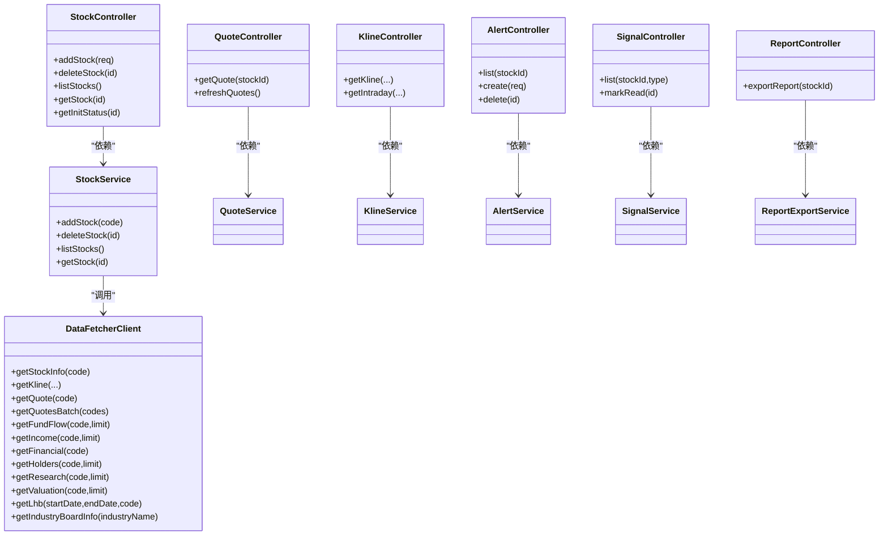

# API接口文档

<cite>
**本文引用的文件**
- [application.yml](file://backend/src/main/resources/application.yml)
- [WebConfig.java](file://backend/src/main/java/com/stock/config/WebConfig.java)
- [RestTemplateConfig.java](file://backend/src/main/java/com/stock/config/RestTemplateConfig.java)
- [DataFetcherClient.java](file://backend/src/main/java/com/stock/client/DataFetcherClient.java)
- [StockController.java](file://backend/src/main/java/com/stock/controller/StockController.java)
- [QuoteController.java](file://backend/src/main/java/com/stock/controller/QuoteController.java)
- [KlineController.java](file://backend/src/main/java/com/stock/controller/KlineController.java)
- [FinancialController.java](file://backend/src/main/java/com/stock/controller/FinancialController.java)
- [FundFlowController.java](file://backend/src/main/java/com/stock/controller/FundFlowController.java)
- [HolderController.java](file://backend/src/main/java/com/stock/controller/HolderController.java)
- [IncomeController.java](file://backend/src/main/java/com/stock/controller/IncomeController.java)
- [AlertController.java](file://backend/src/main/java/com/stock/controller/AlertController.java)
- [SignalController.java](file://backend/src/main/java/com/stock/controller/SignalController.java)
- [ReportController.java](file://backend/src/main/java/com/stock/controller/ReportController.java)
- [AddStockRequest.java](file://backend/src/main/java/com/stock/dto/request/AddStockRequest.java)
- [AlertRequest.java](file://backend/src/main/java/com/stock/dto/request/AlertRequest.java)
- [GlobalExceptionHandler.java](file://backend/src/main/java/com/stock/exception/GlobalExceptionHandler.java)
- [ErrorResponse.java](file://backend/src/main/java/com/stock/exception/ErrorResponse.java)
- [StockService.java](file://backend/src/main/java/com/stock/service/StockService.java)
</cite>

## 目录
1. [简介](#简介)
2. [项目结构](#项目结构)
3. [核心组件](#核心组件)
4. [架构总览](#架构总览)
5. [详细接口说明](#详细接口说明)
6. [依赖关系分析](#依赖关系分析)
7. [性能与可用性](#性能与可用性)
8. [故障排查指南](#故障排查指南)
9. [结论](#结论)
10. [附录](#附录)

## 简介
本文件为股票交易系统后端的REST API接口文档，覆盖所有公开接口的HTTP方法、URL模式、请求参数、响应格式与错误响应。文档同时说明认证授权机制、请求头设置、参数校验规则、版本管理策略、速率限制与缓存策略现状，并提供最佳实践与常见问题解决方案。

## 项目结构
后端采用Spring MVC + Spring Boot实现，API统一在版本化路径下提供（/api/v1），跨域策略限定于本地前端开发环境。数据来源通过内部数据抓取服务客户端访问，具备超时与重试策略。

图表来源
- [WebConfig.java:8-13](file://backend/src/main/java/com/stock/config/WebConfig.java#L8-L13)
- [StockController.java:18](file://backend/src/main/java/com/stock/controller/StockController.java#L18)
- [QuoteController.java:9](file://backend/src/main/java/com/stock/controller/QuoteController.java#L9)
- [KlineController.java:11](file://backend/src/main/java/com/stock/controller/KlineController.java#L11)
- [DataFetcherClient.java:19](file://backend/src/main/java/com/stock/client/DataFetcherClient.java#L19)

章节来源
- [application.yml:1-28](file://backend/src/main/resources/application.yml#L1-L28)
- [WebConfig.java:8-13](file://backend/src/main/java/com/stock/config/WebConfig.java#L8-L13)

## 核心组件
- 版本管理：所有接口位于 /api/v1 命名空间，便于未来演进与多版本共存。
- 跨域配置：仅允许来自 http://localhost:5173 的跨域请求，支持 GET/POST/PUT/DELETE 方法与通配符请求头。
- 数据抓取客户端：统一访问 http://localhost:5001 的数据抓取服务，内置超时控制与异常包装。
- 全局异常处理：对业务异常、参数校验异常、数据抓取异常进行标准化错误响应。

章节来源
- [application.yml:19-22](file://backend/src/main/resources/application.yml#L19-L22)
- [WebConfig.java:8-13](file://backend/src/main/java/com/stock/config/WebConfig.java#L8-L13)
- [RestTemplateConfig.java:10-16](file://backend/src/main/java/com/stock/config/RestTemplateConfig.java#L10-L16)
- [DataFetcherClient.java:19](file://backend/src/main/java/com/stock/client/DataFetcherClient.java#L19)
- [GlobalExceptionHandler.java:9-31](file://backend/src/main/java/com/stock/exception/GlobalExceptionHandler.java#L9-L31)

## 架构总览
以下序列图展示典型“获取K线”流程：前端调用后端接口，后端通过DataFetcherClient访问数据抓取服务，返回标准化数据。

图表来源
- [KlineController.java:20-27](file://backend/src/main/java/com/stock/controller/KlineController.java#L20-L27)
- [DataFetcherClient.java:31-35](file://backend/src/main/java/com/stock/client/DataFetcherClient.java#L31-L35)

## 详细接口说明

### 认证与授权
- 当前未实现鉴权中间件或安全拦截器，所有 /api/v1/** 接口均为开放访问。
- 若需启用鉴权，请在网关或全局过滤器中添加认证逻辑，并在控制器上标注相应注解。

章节来源
- [WebConfig.java:8-13](file://backend/src/main/java/com/stock/config/WebConfig.java#L8-L13)

### 请求头与内容类型
- 默认使用 application/json；部分接口明确声明 produces="text/html"（如报告导出）。
- 跨域请求允许携带任意请求头（由 CORS 配置决定）。

章节来源
- [ReportController.java:19](file://backend/src/main/java/com/stock/controller/ReportController.java#L19)
- [WebConfig.java:12](file://backend/src/main/java/com/stock/config/WebConfig.java#L12)

### 参数校验规则
- 所有请求体参数均使用 Jakarta Bean Validation 注解进行校验。
- DTO 层定义了必填、长度、格式等约束，违反时触发全局参数校验异常处理器。

章节来源
- [AddStockRequest.java:7-9](file://backend/src/main/java/com/stock/dto/request/AddStockRequest.java#L7-L9)
- [AlertRequest.java:6-10](file://backend/src/main/java/com/stock/dto/request/AlertRequest.java#L6-L10)
- [GlobalExceptionHandler.java:25-31](file://backend/src/main/java/com/stock/exception/GlobalExceptionHandler.java#L25-L31)

### 接口清单与规范

#### 股票管理
- 新增股票
  - 方法与路径：POST /api/v1/stocks
  - 请求体：AddStockRequest（字段：code，必填，6位数字）
  - 成功响应：201 Created + StockResponse
  - 失败响应：400/409/404（见“错误响应”）
  - 示例
    - 请求示例：{"code":"000001"}
    - 响应示例：包含新增股票的完整信息
    - 错误示例：{"code":400,"message":"字段校验失败描述","timestamp":"..."}
- 删除股票
  - 方法与路径：DELETE /api/v1/stocks/{id}
  - 路径参数：id（Long）
  - 成功响应：204 No Content
  - 失败响应：404
- 股票列表
  - 方法与路径：GET /api/v1/stocks
  - 成功响应：200 + 股票列表项数组（包含基础信息与完成度）
- 获取单只股票详情
  - 方法与路径：GET /api/v1/stocks/{id}
  - 路径参数：id（Long）
  - 成功响应：200 + 股票详情
- 获取初始化状态
  - 方法与路径：GET /api/v1/stocks/{id}/init-status
  - 路径参数：id（Long）
  - 成功响应：200 + 初始化状态对象

章节来源
- [StockController.java:29-55](file://backend/src/main/java/com/stock/controller/StockController.java#L29-L55)
- [AddStockRequest.java:7-9](file://backend/src/main/java/com/stock/dto/request/AddStockRequest.java#L7-L9)
- [StockService.java:94-163](file://backend/src/main/java/com/stock/service/StockService.java#L94-L163)

#### 实时行情
- 获取实时报价
  - 方法与路径：GET /api/v1/quotes/{stockId}
  - 路径参数：stockId（Long）
  - 成功响应：200 + QuoteResponse
- 刷新全部报价
  - 方法与路径：POST /api/v1/quotes/refresh
  - 成功响应：200 + RefreshResultResponse

章节来源
- [QuoteController.java:18-26](file://backend/src/main/java/com/stock/controller/QuoteController.java#L18-L26)

#### K线数据
- 日线/周线/月线等
  - 方法与路径：GET /api/v1/stocks/{stockId}/kline
  - 查询参数：
    - period：周期，默认 daily
    - startDate：开始日期（ISO日期）
    - endDate：结束日期（ISO日期）
    - adjust：复权方式，默认 qfq
  - 成功响应：200 + KlineResponse
- 当日分时
  - 方法与路径：GET /api/v1/stocks/{stockId}/kline/intraday
  - 查询参数：
    - period：分时粒度，默认 1 分钟
    - date：日期（ISO日期，可选）

章节来源
- [KlineController.java:20-34](file://backend/src/main/java/com/stock/controller/KlineController.java#L20-L34)
- [DataFetcherClient.java:31-41](file://backend/src/main/java/com/stock/client/DataFetcherClient.java#L31-L41)

#### 财务指标
- 获取财务数据
  - 方法与路径：GET /api/v1/stocks/{stockId}/financial
  - 查询参数：limit（默认 8）
  - 成功响应：200 + FinancialResponse

章节来源
- [FinancialController.java:17-21](file://backend/src/main/java/com/stock/controller/FinancialController.java#L17-L21)
- [DataFetcherClient.java:71-75](file://backend/src/main/java/com/stock/client/DataFetcherClient.java#L71-L75)

#### 资金流
- 获取资金流向
  - 方法与路径：GET /api/v1/stocks/{stockId}/fund-flow
  - 查询参数：startDate、endDate（ISO日期，可选）
  - 成功响应：200 + FundFlowResponse

章节来源
- [FundFlowController.java:20-25](file://backend/src/main/java/com/stock/controller/FundFlowController.java#L20-L25)
- [DataFetcherClient.java:59-63](file://backend/src/main/java/com/stock/client/DataFetcherClient.java#L59-L63)

#### 股东结构
- 获取股东数据
  - 方法与路径：GET /api/v1/stocks/{stockId}/holders
  - 查询参数：limit（默认 8）
  - 成功响应：200 + HolderResponse

章节来源
- [HolderController.java:17-21](file://backend/src/main/java/com/stock/controller/HolderController.java#L17-L21)
- [DataFetcherClient.java:77-81](file://backend/src/main/java/com/stock/client/DataFetcherClient.java#L77-L81)

#### 收入数据
- 获取收入数据
  - 方法与路径：GET /api/v1/stocks/{stockId}/income
  - 查询参数：limit（默认 8）
  - 成功响应：200 + IncomeResponse

章节来源
- [IncomeController.java:17-21](file://backend/src/main/java/com/stock/controller/IncomeController.java#L17-L21)
- [DataFetcherClient.java:65-69](file://backend/src/main/java/com/stock/client/DataFetcherClient.java#L65-L69)

#### 价格提醒
- 查询提醒
  - 方法与路径：GET /api/v1/alerts
  - 查询参数：stockId（可选）
  - 成功响应：200 + 提醒列表
- 创建提醒
  - 方法与路径：POST /api/v1/alerts
  - 请求体：AlertRequest（字段：stockId、type、threshold）
  - 成功响应：201 + AlertResponse
- 删除提醒
  - 方法与路径：DELETE /api/v1/alerts/{id}
  - 路径参数：id（Long）
  - 成功响应：204

章节来源
- [AlertController.java:23-38](file://backend/src/main/java/com/stock/controller/AlertController.java#L23-L38)
- [AlertRequest.java:6-10](file://backend/src/main/java/com/stock/dto/request/AlertRequest.java#L6-L10)

#### 信号管理
- 查询信号
  - 方法与路径：GET /api/v1/signals
  - 查询参数：stockId（可选）、type（可选）
  - 成功响应：200 + 信号列表
- 标记已读
  - 方法与路径：PUT /api/v1/signals/{id}/read
  - 路径参数：id（Long）
  - 成功响应：200 + SignalResponse

章节来源
- [SignalController.java:19-28](file://backend/src/main/java/com/stock/controller/SignalController.java#L19-L28)

#### 报告导出
- 导出HTML报告
  - 方法与路径：GET /api/v1/stocks/{stockId}/report
  - 查询参数：无
  - 成功响应：200 + HTML内容（以附件形式下载）
  - 响应头：Content-Disposition: attachment; filename=report_{stockId}.html

章节来源
- [ReportController.java:19-25](file://backend/src/main/java/com/stock/controller/ReportController.java#L19-L25)

### 错误响应
- 统一错误模型：包含 code、message、timestamp 字段
- 常见HTTP状态码
  - 400：参数校验失败或非法请求
  - 404：资源不存在
  - 409：资源冲突（如重复添加）
  - 503：上游数据抓取服务不可用
- 异常映射
  - MethodArgumentNotValidException → 400
  - StockNotFoundException → 404
  - DuplicateStockException → 409
  - InvalidStockCodeException → 400
  - DataFetchException → 503

章节来源
- [GlobalExceptionHandler.java:9-31](file://backend/src/main/java/com/stock/exception/GlobalExceptionHandler.java#L9-L31)
- [ErrorResponse.java:3](file://backend/src/main/java/com/stock/exception/ErrorResponse.java#L3-L7)

## 依赖关系分析

图表来源
- [StockController.java:24-26](file://backend/src/main/java/com/stock/controller/StockController.java#L24-L26)
- [QuoteController.java:14](file://backend/src/main/java/com/stock/controller/QuoteController.java#L14)
- [KlineController.java:16](file://backend/src/main/java/com/stock/controller/KlineController.java#L16)
- [AlertController.java:19](file://backend/src/main/java/com/stock/controller/AlertController.java#L19)
- [SignalController.java:15](file://backend/src/main/java/com/stock/controller/SignalController.java#L15)
- [ReportController.java:15](file://backend/src/main/java/com/stock/controller/ReportController.java#L15)
- [StockService.java:51-91](file://backend/src/main/java/com/stock/service/StockService.java#L51-L91)
- [DataFetcherClient.java:26-105](file://backend/src/main/java/com/stock/client/DataFetcherClient.java#L26-L105)

## 性能与可用性
- 连接与读取超时：数据抓取客户端连接超时 5 秒，读取超时 15 秒。
- 并发与批量：批量获取报价接口支持一次性传入多个股票代码，减少往返次数。
- 缓存策略：当前未实现应用层缓存；建议对高频查询（如实时行情、K线）引入Redis缓存与合理TTL。
- 速率限制：当前未实现全局限流；建议在网关或全局过滤器中加入基于IP/用户维度的限流策略。
- 可用性：数据抓取服务不可用时返回 503，前端应具备重试与降级策略。

章节来源
- [RestTemplateConfig.java:12-15](file://backend/src/main/java/com/stock/config/RestTemplateConfig.java#L12-L15)
- [DataFetcherClient.java:48-57](file://backend/src/main/java/com/stock/client/DataFetcherClient.java#L48-L57)
- [GlobalExceptionHandler.java:21-23](file://backend/src/main/java/com/stock/exception/GlobalExceptionHandler.java#L21-L23)

## 故障排查指南
- 400 参数校验失败
  - 检查请求体字段是否符合 DTO 规则（如股票代码必须为6位数字）。
  - 查看错误响应中的具体字段与提示。
- 404 资源不存在
  - 确认路径参数 id 是否正确，或相关数据是否已初始化。
- 409 冲突
  - 重复添加已存在的股票代码。
- 503 数据抓取服务不可用
  - 检查数据抓取服务地址与连通性，确认超时时间设置是否合理。
- 跨域问题
  - 确认前端运行在 http://localhost:5173，且后端CORS配置允许该来源。

章节来源
- [GlobalExceptionHandler.java:9-31](file://backend/src/main/java/com/stock/exception/GlobalExceptionHandler.java#L9-L31)
- [WebConfig.java:8-13](file://backend/src/main/java/com/stock/config/WebConfig.java#L8-L13)
- [application.yml:19-22](file://backend/src/main/resources/application.yml#L19-L22)

## 结论
本API以清晰的版本化路径组织，覆盖股票、行情、K线、财务、资金流、股东、收入、提醒、信号与报告导出等核心能力。当前未内置鉴权与限流，建议在网关层或全局过滤器中补齐；同时建议引入缓存与限流策略以提升性能与稳定性。

## 附录

### API版本管理
- 版本号：v1
- 命名空间：/api/v1
- 升级策略：保持向后兼容；新增接口在新路径下提供，旧接口保留直至迁移完成。

章节来源
- [StockController.java:18](file://backend/src/main/java/com/stock/controller/StockController.java#L18)
- [QuoteController.java:9](file://backend/src/main/java/com/stock/controller/QuoteController.java#L9)
- [KlineController.java:11](file://backend/src/main/java/com/stock/controller/KlineController.java#L11)

### 最佳实践
- 使用批量接口减少网络开销（如批量获取报价）。
- 对高频查询结果进行本地缓存，设置合理的过期时间。
- 在网关层实现统一限流与熔断，避免雪崩效应。
- 明确错误分类与重试策略，保证用户体验与系统稳定。

### 常见问题
- Q：如何扩展新的数据类型接口？
  - A：在对应控制器中新增端点，调用相应的Service，必要时在DataFetcherClient中补充数据抓取方法。
- Q：如何接入鉴权？
  - A：在全局过滤器或网关中实现鉴权，或在控制器上添加相应注解。