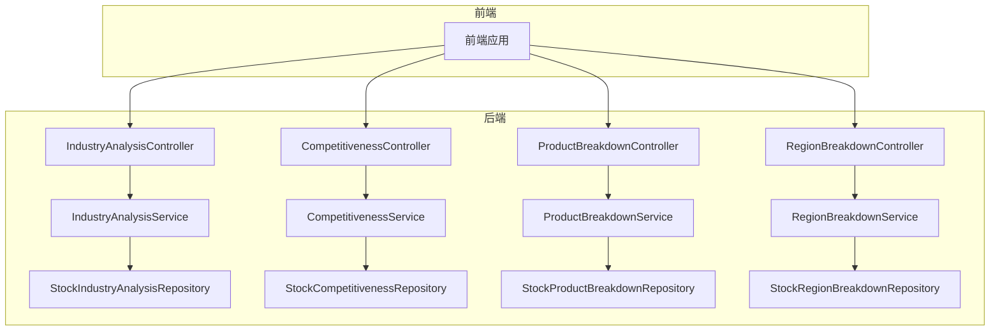
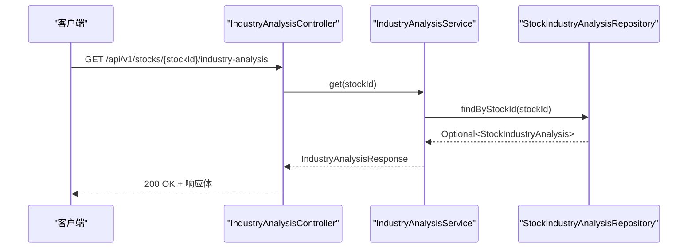
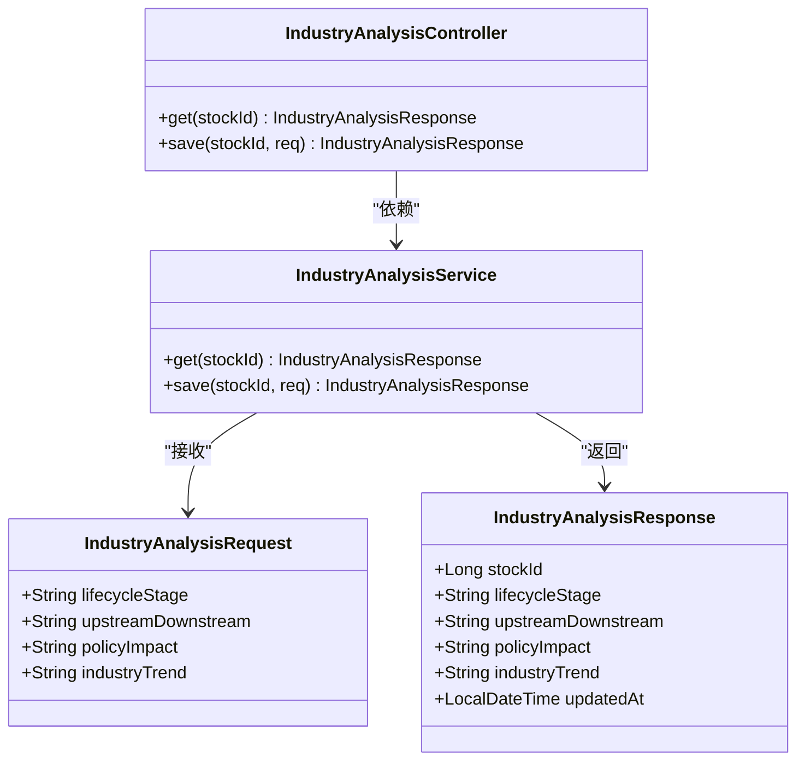
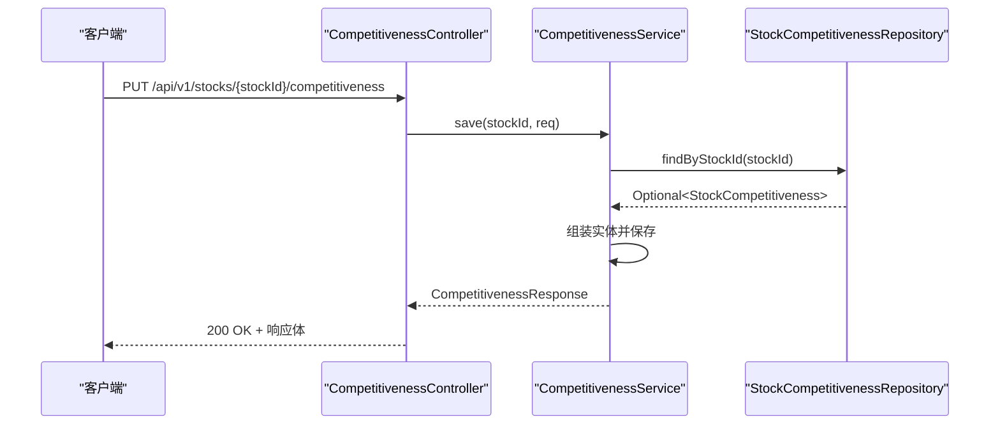
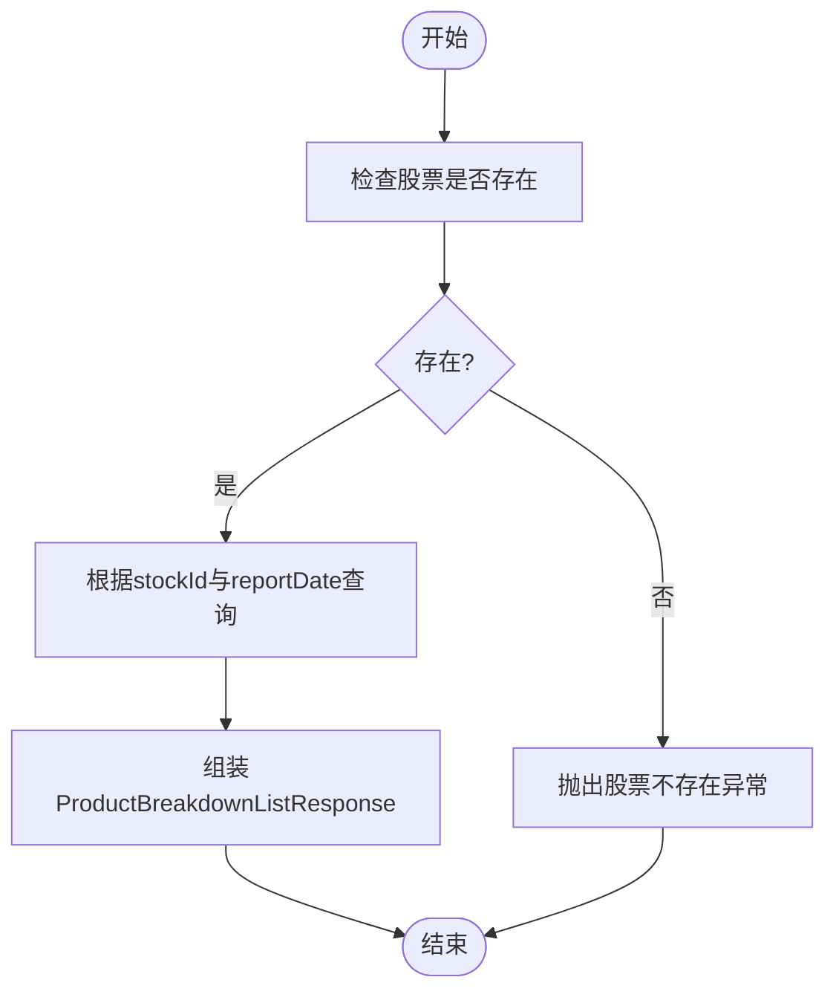
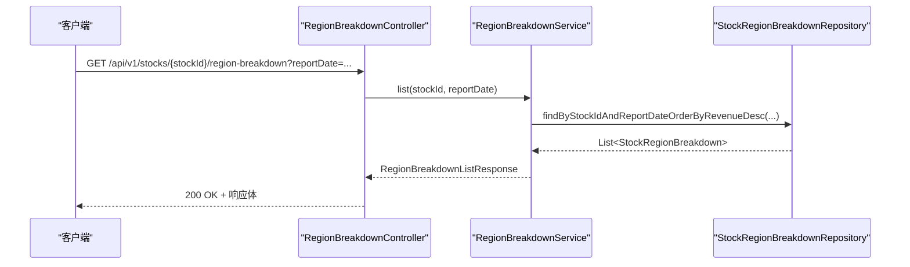
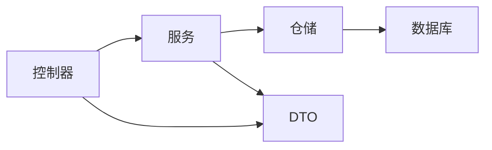

# 分析模块API

<cite>
**本文档引用的文件**
- [IndustryAnalysisController.java](file://backend/src/main/java/com/stock/controller/IndustryAnalysisController.java)
- [IndustryAnalysisRequest.java](file://backend/src/main/java/com/stock/dto/request/IndustryAnalysisRequest.java)
- [IndustryAnalysisResponse.java](file://backend/src/main/java/com/stock/dto/response/IndustryAnalysisResponse.java)
- [IndustryAnalysisService.java](file://backend/src/main/java/com/stock/service/IndustryAnalysisService.java)
- [CompetitivenessController.java](file://backend/src/main/java/com/stock/controller/CompetitivenessController.java)
- [CompetitivenessRequest.java](file://backend/src/main/java/com/stock/dto/request/CompetitivenessRequest.java)
- [CompetitivenessResponse.java](file://backend/src/main/java/com/stock/dto/response/CompetitivenessResponse.java)
- [CompetitivenessService.java](file://backend/src/main/java/com/stock/service/CompetitivenessService.java)
- [ProductBreakdownController.java](file://backend/src/main/java/com/stock/controller/ProductBreakdownController.java)
- [ProductBreakdownRequest.java](file://backend/src/main/java/com/stock/dto/request/ProductBreakdownRequest.java)
- [ProductBreakdownResponse.java](file://backend/src/main/java/com/stock/dto/response/ProductBreakdownResponse.java)
- [ProductBreakdownService.java](file://backend/src/main/java/com/stock/service/ProductBreakdownService.java)
- [RegionBreakdownController.java](file://backend/src/main/java/com/stock/controller/RegionBreakdownController.java)
- [RegionBreakdownRequest.java](file://backend/src/main/java/com/stock/dto/request/RegionBreakdownRequest.java)
- [RegionBreakdownResponse.java](file://backend/src/main/java/com/stock/dto/response/RegionBreakdownResponse.java)
- [RegionBreakdownService.java](file://backend/src/main/java/com/stock/service/RegionBreakdownService.java)
</cite>

## 目录
1. [简介](#简介)
2. [项目结构](#项目结构)
3. [核心组件](#核心组件)
4. [架构总览](#架构总览)
5. [详细组件分析](#详细组件分析)
6. [依赖关系分析](#依赖关系分析)
7. [性能考虑](#性能考虑)
8. [故障排除指南](#故障排除指南)
9. [结论](#结论)
10. [附录](#附录)

## 简介
本文件系统性梳理分析模块API，覆盖行业分析、竞争力评估、产品构成、地区分布四大核心能力。文档面向开发者与业务人员，提供接口定义、数据模型、调用流程、参数约束、错误处理与最佳实践，并给出分析维度选择、时间范围设置、对比基准配置的策略建议，以及结果解读与决策支持指引。

## 项目结构
分析模块采用标准的分层架构：控制器（Controller）负责HTTP端点与请求校验；服务（Service）封装业务逻辑与事务控制；DTO负责请求/响应数据结构；Repository负责数据持久化；异常处理统一由全局异常处理器接管。

图表来源
- [IndustryAnalysisController.java:1-30](file://backend/src/main/java/com/stock/controller/IndustryAnalysisController.java#L1-L30)
- [CompetitivenessController.java:1-30](file://backend/src/main/java/com/stock/controller/CompetitivenessController.java#L1-L30)
- [ProductBreakdownController.java:1-52](file://backend/src/main/java/com/stock/controller/ProductBreakdownController.java#L1-L52)
- [RegionBreakdownController.java:1-52](file://backend/src/main/java/com/stock/controller/RegionBreakdownController.java#L1-L52)
- [IndustryAnalysisService.java:1-61](file://backend/src/main/java/com/stock/service/IndustryAnalysisService.java#L1-L61)
- [CompetitivenessService.java:1-64](file://backend/src/main/java/com/stock/service/CompetitivenessService.java#L1-L64)
- [ProductBreakdownService.java:1-102](file://backend/src/main/java/com/stock/service/ProductBreakdownService.java#L1-L102)
- [RegionBreakdownService.java:1-98](file://backend/src/main/java/com/stock/service/RegionBreakdownService.java#L1-L98)

章节来源
- [IndustryAnalysisController.java:1-30](file://backend/src/main/java/com/stock/controller/IndustryAnalysisController.java#L1-L30)
- [CompetitivenessController.java:1-30](file://backend/src/main/java/com/stock/controller/CompetitivenessController.java#L1-L30)
- [ProductBreakdownController.java:1-52](file://backend/src/main/java/com/stock/controller/ProductBreakdownController.java#L1-L52)
- [RegionBreakdownController.java:1-52](file://backend/src/main/java/com/stock/controller/RegionBreakdownController.java#L1-L52)

## 核心组件
- 行业分析：提供生命周期阶段、上下游影响、政策影响、行业趋势等信息的查询与保存。
- 竞争力评估：提供市场份额、评估年份、优势、劣势、护城河等级与备注等信息的查询与保存。
- 产品构成：按报告期聚合产品维度的收入与毛利率，支持新增、更新、删除与列表查询。
- 地区分布：按报告期聚合地区维度的收入占比，支持新增、更新、删除与列表查询。

章节来源
- [IndustryAnalysisResponse.java:1-13](file://backend/src/main/java/com/stock/dto/response/IndustryAnalysisResponse.java#L1-L13)
- [CompetitivenessResponse.java:1-16](file://backend/src/main/java/com/stock/dto/response/CompetitivenessResponse.java#L1-L16)
- [ProductBreakdownResponse.java:1-15](file://backend/src/main/java/com/stock/dto/response/ProductBreakdownResponse.java#L1-L15)
- [RegionBreakdownResponse.java:1-14](file://backend/src/main/java/com/stock/dto/response/RegionBreakdownResponse.java#L1-L14)

## 架构总览
以下序列图展示典型“行业分析”GET请求的端到端流程，其他模块遵循相同模式（控制器→服务→仓储→数据库）。

图表来源
- [IndustryAnalysisController.java:19-22](file://backend/src/main/java/com/stock/controller/IndustryAnalysisController.java#L19-L22)
- [IndustryAnalysisService.java:27-35](file://backend/src/main/java/com/stock/service/IndustryAnalysisService.java#L27-L35)
- [IndustryAnalysisResponse.java:1-13](file://backend/src/main/java/com/stock/dto/response/IndustryAnalysisResponse.java#L1-L13)

## 详细组件分析

### 行业分析模块
- 接口定义
  - GET /api/v1/stocks/{stockId}/industry-analysis：查询行业分析结果
  - PUT /api/v1/stocks/{stockId}/industry-analysis：保存行业分析结果
- 请求参数
  - lifecycleStage：必填，字符串，生命周期阶段
  - upstreamDownstream：可选，字符串，描述上下游关系
  - policyImpact：可选，字符串，政策影响
  - industryTrend：可选，字符串，行业趋势
- 响应字段
  - stockId、lifecycleStage、upstreamDownstream、policyImpact、industryTrend、updatedAt
- 业务要点
  - 查询不存在股票时返回空值或默认值
  - 保存时对文本进行安全净化，防止XSS
  - 更新时间自动记录

图表来源
- [IndustryAnalysisController.java:1-30](file://backend/src/main/java/com/stock/controller/IndustryAnalysisController.java#L1-L30)
- [IndustryAnalysisService.java:1-61](file://backend/src/main/java/com/stock/service/IndustryAnalysisService.java#L1-L61)
- [IndustryAnalysisRequest.java:1-12](file://backend/src/main/java/com/stock/dto/request/IndustryAnalysisRequest.java#L1-L12)
- [IndustryAnalysisResponse.java:1-13](file://backend/src/main/java/com/stock/dto/response/IndustryAnalysisResponse.java#L1-L13)

章节来源
- [IndustryAnalysisController.java:19-28](file://backend/src/main/java/com/stock/controller/IndustryAnalysisController.java#L19-L28)
- [IndustryAnalysisRequest.java:6-11](file://backend/src/main/java/com/stock/dto/request/IndustryAnalysisRequest.java#L6-L11)
- [IndustryAnalysisResponse.java:5-12](file://backend/src/main/java/com/stock/dto/response/IndustryAnalysisResponse.java#L5-L12)
- [IndustryAnalysisService.java:27-59](file://backend/src/main/java/com/stock/service/IndustryAnalysisService.java#L27-L59)

### 竞争力评估模块
- 接口定义
  - GET /api/v1/stocks/{stockId}/competitiveness：查询竞争力结果
  - PUT /api/v1/stocks/{stockId}/competitiveness：保存竞争力结果
- 请求参数
  - marketShare：0~100之间的数值，市场份额
  - marketShareYear：2000~2100之间的整数，评估年份
  - advantage/disadvantage：可选，描述优劣势
  - moatLevel：护城河等级
  - moatNote：可选，护城河备注
- 响应字段
  - stockId、marketShare、marketShareYear、advantage、disadvantage、moatLevel、moatNote、updatedAt
- 业务要点
  - 参数范围严格校验
  - 文本字段安全净化
  - 自动更新时间戳

图表来源
- [CompetitivenessController.java:24-28](file://backend/src/main/java/com/stock/controller/CompetitivenessController.java#L24-L28)
- [CompetitivenessService.java:38-62](file://backend/src/main/java/com/stock/service/CompetitivenessService.java#L38-L62)
- [CompetitivenessRequest.java:6-13](file://backend/src/main/java/com/stock/dto/request/CompetitivenessRequest.java#L6-L13)
- [CompetitivenessResponse.java:6-15](file://backend/src/main/java/com/stock/dto/response/CompetitivenessResponse.java#L6-L15)

章节来源
- [CompetitivenessController.java:19-28](file://backend/src/main/java/com/stock/controller/CompetitivenessController.java#L19-L28)
- [CompetitivenessRequest.java:6-13](file://backend/src/main/java/com/stock/dto/request/CompetitivenessRequest.java#L6-L13)
- [CompetitivenessResponse.java:6-15](file://backend/src/main/java/com/stock/dto/response/CompetitivenessResponse.java#L6-L15)
- [CompetitivenessService.java:27-62](file://backend/src/main/java/com/stock/service/CompetitivenessService.java#L27-L62)

### 产品构成模块
- 接口定义
  - GET /api/v1/stocks/{stockId}/product-breakdown?reportDate=YYYY-MM-DD：查询产品构成列表
  - POST /api/v1/stocks/{stockId}/product-breakdown：新增产品构成
  - PUT /api/v1/stocks/{stockId}/product-breakdown/{id}：更新产品构成
  - DELETE /api/v1/stocks/{stockId}/product-breakdown/{id}：删除产品构成
- 请求参数
  - reportDate：必填，报告期
  - productName：必填，产品名称
  - revenue：必填，收入（整数）
  - revenueRatio：0~100之间的数值，收入占比
  - grossMargin：-100~100之间的数值，毛利率
- 响应字段
  - id、stockId、reportDate、productName、revenue、revenueRatio、grossMargin
- 业务要点
  - 列表查询支持指定报告期或自动取最新报告期
  - 收入占比与毛利率自动校验范围
  - 新增/更新时自动记录创建/更新时间

图表来源
- [ProductBreakdownController.java:25-29](file://backend/src/main/java/com/stock/controller/ProductBreakdownController.java#L25-L29)
- [ProductBreakdownService.java:31-56](file://backend/src/main/java/com/stock/service/ProductBreakdownService.java#L31-L56)
- [ProductBreakdownRequest.java:7-13](file://backend/src/main/java/com/stock/dto/request/ProductBreakdownRequest.java#L7-L13)
- [ProductBreakdownResponse.java:6-14](file://backend/src/main/java/com/stock/dto/response/ProductBreakdownResponse.java#L6-L14)

章节来源
- [ProductBreakdownController.java:25-50](file://backend/src/main/java/com/stock/controller/ProductBreakdownController.java#L25-L50)
- [ProductBreakdownRequest.java:7-13](file://backend/src/main/java/com/stock/dto/request/ProductBreakdownRequest.java#L7-L13)
- [ProductBreakdownResponse.java:6-14](file://backend/src/main/java/com/stock/dto/response/ProductBreakdownResponse.java#L6-L14)
- [ProductBreakdownService.java:31-95](file://backend/src/main/java/com/stock/service/ProductBreakdownService.java#L31-L95)

### 地区分布模块
- 接口定义
  - GET /api/v1/stocks/{stockId}/region-breakdown?reportDate=YYYY-MM-DD：查询地区分布列表
  - POST /api/v1/stocks/{stockId}/region-breakdown：新增地区分布
  - PUT /api/v1/stocks/{stockId}/region-breakdown/{id}：更新地区分布
  - DELETE /api/v1/stocks/{stockId}/region-breakdown/{id}：删除地区分布
- 请求参数
  - reportDate：必填，报告期
  - regionName：必填，地区名称
  - revenue：必填，收入（整数）
  - revenueRatio：0~100之间的数值，收入占比
- 响应字段
  - id、stockId、reportDate、regionName、revenue、revenueRatio
- 业务要点
  - 列表查询支持指定报告期或自动取最新报告期
  - 收入占比自动校验范围
  - 新增/更新时自动记录创建/更新时间

图表来源
- [RegionBreakdownController.java:25-29](file://backend/src/main/java/com/stock/controller/RegionBreakdownController.java#L25-L29)
- [RegionBreakdownService.java:30-54](file://backend/src/main/java/com/stock/service/RegionBreakdownService.java#L30-L54)
- [RegionBreakdownRequest.java:7-12](file://backend/src/main/java/com/stock/dto/request/RegionBreakdownRequest.java#L7-L12)
- [RegionBreakdownResponse.java:6-13](file://backend/src/main/java/com/stock/dto/response/RegionBreakdownResponse.java#L6-L13)

章节来源
- [RegionBreakdownController.java:25-50](file://backend/src/main/java/com/stock/controller/RegionBreakdownController.java#L25-L50)
- [RegionBreakdownRequest.java:7-12](file://backend/src/main/java/com/stock/dto/request/RegionBreakdownRequest.java#L7-L12)
- [RegionBreakdownResponse.java:6-13](file://backend/src/main/java/com/stock/dto/response/RegionBreakdownResponse.java#L6-L13)
- [RegionBreakdownService.java:30-91](file://backend/src/main/java/com/stock/service/RegionBreakdownService.java#L30-L91)

## 依赖关系分析
- 控制器层仅负责路由与参数绑定，不直接操作数据
- 服务层承担业务规则、事务控制与数据转换
- DTO层隔离请求/响应结构，避免与实体耦合
- 仓储层负责数据存取，确保查询与更新的原子性
- 异常处理在全局层面统一拦截，保证错误信息一致

图表来源
- [IndustryAnalysisController.java:1-30](file://backend/src/main/java/com/stock/controller/IndustryAnalysisController.java#L1-L30)
- [CompetitivenessController.java:1-30](file://backend/src/main/java/com/stock/controller/CompetitivenessController.java#L1-L30)
- [ProductBreakdownController.java:1-52](file://backend/src/main/java/com/stock/controller/ProductBreakdownController.java#L1-L52)
- [RegionBreakdownController.java:1-52](file://backend/src/main/java/com/stock/controller/RegionBreakdownController.java#L1-L52)
- [IndustryAnalysisService.java:1-61](file://backend/src/main/java/com/stock/service/IndustryAnalysisService.java#L1-L61)
- [CompetitivenessService.java:1-64](file://backend/src/main/java/com/stock/service/CompetitivenessService.java#L1-L64)
- [ProductBreakdownService.java:1-102](file://backend/src/main/java/com/stock/service/ProductBreakdownService.java#L1-L102)
- [RegionBreakdownService.java:1-98](file://backend/src/main/java/com/stock/service/RegionBreakdownService.java#L1-L98)

## 性能考虑
- 列表查询默认按收入降序返回，减少前端二次排序开销
- 未指定报告期时，服务层自动筛选最新报告期，避免全量扫描
- DTO映射在服务层完成，避免在控制器中执行复杂逻辑
- 对于高频查询，可在仓储层增加复合索引（如stockId+reportDate），以优化过滤与排序性能

## 故障排除指南
- 股票不存在
  - 触发条件：查询或写入时股票ID无效
  - 处理方式：服务层抛出“股票不存在”异常，控制器返回相应状态码
- 数据范围校验失败
  - 触发条件：市场份额、收入占比、毛利率超出允许范围
  - 处理方式：请求参数校验失败，返回参数错误提示
- 数据不存在
  - 触发条件：更新或删除时目标ID不存在
  - 处理方式：服务层抛出“数据不存在”异常，控制器返回相应状态码

章节来源
- [IndustryAnalysisService.java:28-30](file://backend/src/main/java/com/stock/service/IndustryAnalysisService.java#L28-L30)
- [CompetitivenessService.java:28-30](file://backend/src/main/java/com/stock/service/CompetitivenessService.java#L28-L30)
- [ProductBreakdownService.java:79-81](file://backend/src/main/java/com/stock/service/ProductBreakdownService.java#L79-L81)
- [RegionBreakdownService.java:76-78](file://backend/src/main/java/com/stock/service/RegionBreakdownService.java#L76-L78)

## 结论
分析模块API围绕“行业分析、竞争力评估、产品构成、地区分布”四大主题构建，具备清晰的分层架构与严格的参数校验机制。通过标准化的请求/响应DTO与事务化的服务层，确保了数据一致性与安全性。建议在实际使用中结合报告期选择与维度配置，充分利用最新报告期的数据进行深度分析，并基于结果制定投资策略与风险控制措施。

## 附录

### 接口一览与参数说明
- 行业分析
  - GET /api/v1/stocks/{stockId}/industry-analysis
  - PUT /api/v1/stocks/{stockId}/industry-analysis
  - 请求体字段：lifecycleStage、upstreamDownstream、policyImpact、industryTrend
- 竞争力评估
  - GET /api/v1/stocks/{stockId}/competitiveness
  - PUT /api/v1/stocks/{stockId}/competitiveness
  - 请求体字段：marketShare、marketShareYear、advantage、disadvantage、moatLevel、moatNote
- 产品构成
  - GET /api/v1/stocks/{stockId}/product-breakdown?reportDate=YYYY-MM-DD
  - POST /api/v1/stocks/{stockId}/product-breakdown
  - PUT /api/v1/stocks/{stockId}/product-breakdown/{id}
  - DELETE /api/v1/stocks/{stockId}/product-breakdown/{id}
  - 请求体字段：reportDate、productName、revenue、revenueRatio、grossMargin
- 地区分布
  - GET /api/v1/stocks/{stockId}/region-breakdown?reportDate=YYYY-MM-DD
  - POST /api/v1/stocks/{stockId}/region-breakdown
  - PUT /api/v1/stocks/{stockId}/region-breakdown/{id}
  - DELETE /api/v1/stocks/{stockId}/region-breakdown/{id}
  - 请求体字段：reportDate、regionName、revenue、revenueRatio

### 分析维度选择与时间范围设置
- 维度选择
  - 行业分析：生命周期阶段、上下游关系、政策影响、行业趋势
  - 竞争力评估：市场份额、评估年份、护城河等级与备注
  - 产品构成：按产品线拆分收入与毛利率
  - 地区分布：按地理区域拆分收入占比
- 时间范围设置
  - 支持按报告期精确查询
  - 不传报告期时，默认取最新报告期
- 对比基准配置
  - 可将多个股票的竞争力指标进行横向对比
  - 产品构成与地区分布可按不同报告期进行纵向对比

### 结果解读与决策支持建议
- 行业分析
  - 关注生命周期阶段与行业趋势，判断企业所处周期位置
  - 上下游关系与政策影响决定短期波动与长期机会
- 竞争力评估
  - 市场份额与护城河等级反映竞争地位
  - 年份数据用于观察趋势变化
- 产品构成
  - 高毛利率产品线通常更具盈利能力
  - 收入占比高的产品线需关注其增长潜力与风险
- 地区分布
  - 收入占比高的地区需关注区域经济与政策变化
  - 毛利率差异反映不同市场的定价能力与成本控制水平