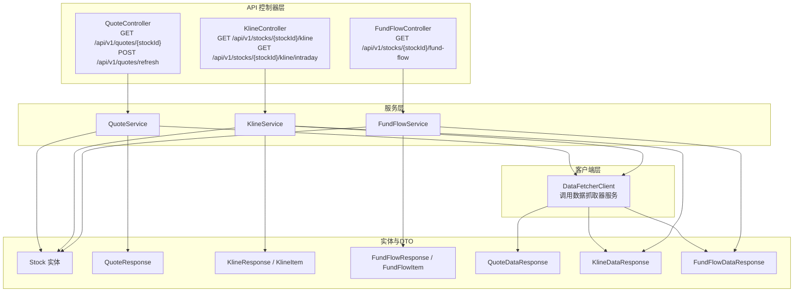
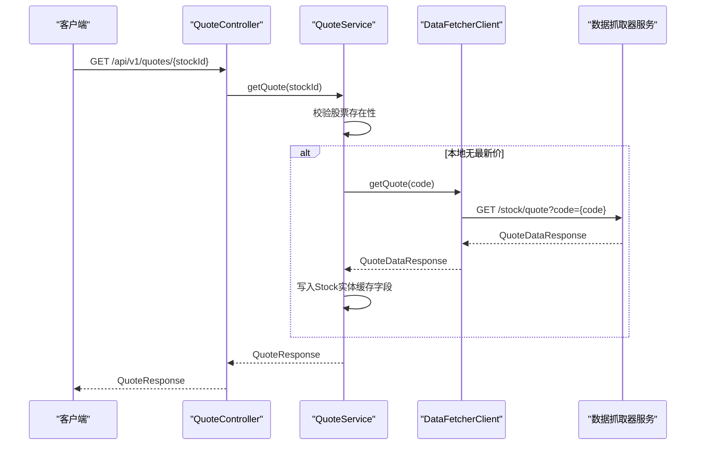
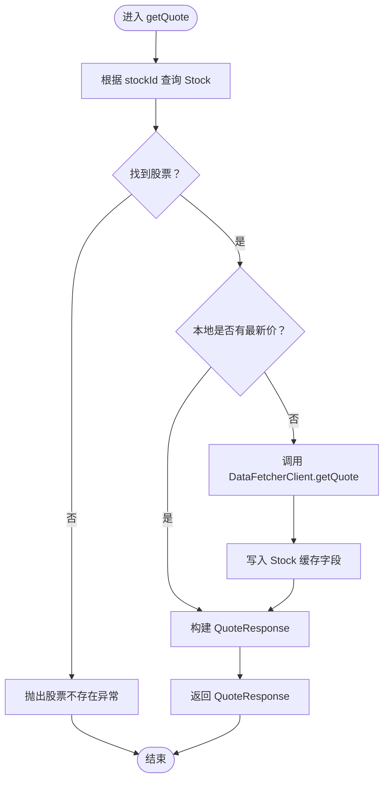
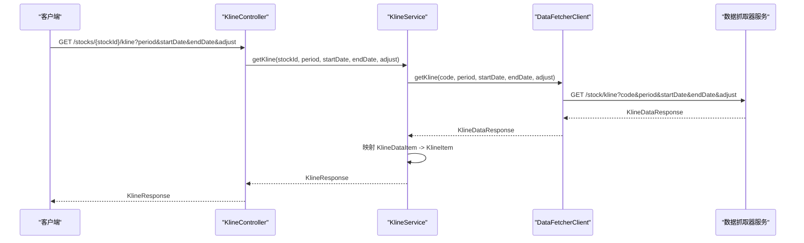
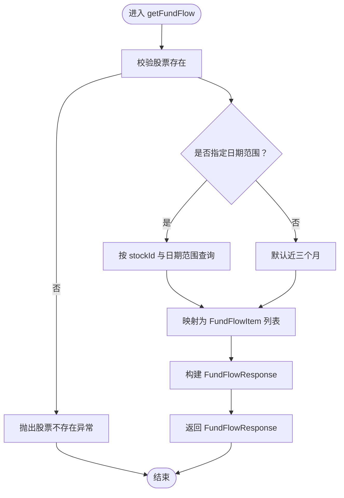
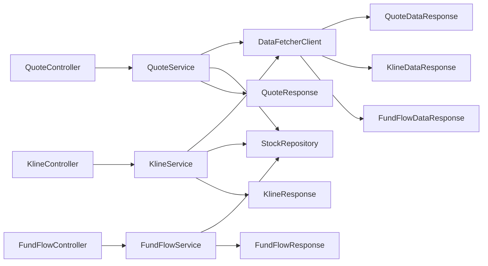

# 市场数据API

<cite>
**本文引用的文件**
- [DataFetcherClient.java](file://backend/src/main/java/com/stock/client/DataFetcherClient.java)
- [QuoteController.java](file://backend/src/main/java/com/stock/controller/QuoteController.java)
- [KlineController.java](file://backend/src/main/java/com/stock/controller/KlineController.java)
- [FundFlowController.java](file://backend/src/main/java/com/stock/controller/FundFlowController.java)
- [QuoteService.java](file://backend/src/main/java/com/stock/service/QuoteService.java)
- [KlineService.java](file://backend/src/main/java/com/stock/service/KlineService.java)
- [FundFlowService.java](file://backend/src/main/java/com/stock/service/FundFlowService.java)
- [QuoteResponse.java](file://backend/src/main/java/com/stock/dto/response/QuoteResponse.java)
- [KlineResponse.java](file://backend/src/main/java/com/stock/dto/response/KlineResponse.java)
- [KlineItem.java](file://backend/src/main/java/com/stock/dto/response/KlineItem.java)
- [FundFlowResponse.java](file://backend/src/main/java/com/stock/dto/response/FundFlowResponse.java)
- [FundFlowItem.java](file://backend/src/main/java/com/stock/dto/response/FundFlowItem.java)
- [QuoteDataResponse.java](file://backend/src/main/java/com/stock/dto/fetcher/QuoteDataResponse.java)
- [KlineDataResponse.java](file://backend/src/main/java/com/stock/dto/fetcher/KlineDataResponse.java)
- [FundFlowDataResponse.java](file://backend/src/main/java/com/stock/dto/fetcher/FundFlowDataResponse.java)
- [Stock.java](file://backend/src/main/java/com/stock/entity/Stock.java)
</cite>

## 目录
1. [简介](#简介)
2. [项目结构](#项目结构)
3. [核心组件](#核心组件)
4. [架构总览](#架构总览)
5. [详细组件分析](#详细组件分析)
6. [依赖分析](#依赖分析)
7. [性能考虑](#性能考虑)
8. [故障排查指南](#故障排查指南)
9. [结论](#结论)
10. [附录](#附录)

## 简介
本文件为市场数据API的权威技术文档，覆盖实时报价、K线数据、资金流向等核心接口。内容包括：
- 实时报价：单只股票报价查询与批量刷新
- K线数据：日线、周线、月线及分时数据获取
- 资金流向：主力资金与散户资金流向历史数据
- 数据模型：QuoteResponse、KlineResponse、FundFlowResponse 字段说明
- 时间与粒度：日期范围、复权方式、分时周期
- 更新频率与延迟：基于后端定时任务与数据源拉取策略
- 数据质量：缓存一致性、异常处理与回退机制

## 项目结构
后端采用Spring Boot分层架构，API控制器负责请求映射，服务层编排业务逻辑，客户端封装对“数据抓取器”服务的调用，DTO用于前后端数据传输。

图表来源
- [QuoteController.java:10-27](file://backend/src/main/java/com/stock/controller/QuoteController.java#L10-L27)
- [KlineController.java:11-35](file://backend/src/main/java/com/stock/controller/KlineController.java#L11-L35)
- [FundFlowController.java:11-26](file://backend/src/main/java/com/stock/controller/FundFlowController.java#L11-L26)
- [QuoteService.java:20-98](file://backend/src/main/java/com/stock/service/QuoteService.java#L20-L98)
- [KlineService.java:18-67](file://backend/src/main/java/com/stock/service/KlineService.java#L18-L67)
- [FundFlowService.java:15-51](file://backend/src/main/java/com/stock/service/FundFlowService.java#L15-L51)
- [DataFetcherClient.java:15-126](file://backend/src/main/java/com/stock/client/DataFetcherClient.java#L15-L126)
- [Stock.java:17-85](file://backend/src/main/java/com/stock/entity/Stock.java#L17-L85)
- [QuoteResponse.java:6-21](file://backend/src/main/java/com/stock/dto/response/QuoteResponse.java#L6-L21)
- [KlineResponse.java:5-10](file://backend/src/main/java/com/stock/dto/response/KlineResponse.java#L5-L10)
- [KlineItem.java:5-17](file://backend/src/main/java/com/stock/dto/response/KlineItem.java#L5-L17)
- [FundFlowResponse.java:5-8](file://backend/src/main/java/com/stock/dto/response/FundFlowResponse.java#L5-L8)
- [FundFlowItem.java:5-19](file://backend/src/main/java/com/stock/dto/response/FundFlowItem.java#L5-L19)
- [QuoteDataResponse.java:7-21](file://backend/src/main/java/com/stock/dto/fetcher/QuoteDataResponse.java#L7-L21)
- [KlineDataResponse.java:7-9](file://backend/src/main/java/com/stock/dto/fetcher/KlineDataResponse.java#L7-L9)
- [FundFlowDataResponse.java:7-9](file://backend/src/main/java/com/stock/dto/fetcher/FundFlowDataResponse.java#L7-L9)

章节来源
- [QuoteController.java:10-27](file://backend/src/main/java/com/stock/controller/QuoteController.java#L10-L27)
- [KlineController.java:11-35](file://backend/src/main/java/com/stock/controller/KlineController.java#L11-L35)
- [FundFlowController.java:11-26](file://backend/src/main/java/com/stock/controller/FundFlowController.java#L11-L26)

## 核心组件
- 实时报价接口
  - 单只股票报价：GET /api/v1/quotes/{stockId}
  - 全量刷新：POST /api/v1/quotes/refresh
- K线接口
  - 日线/周线/月线：GET /api/v1/stocks/{stockId}/kline?period=&startDate=&endDate=&adjust=
  - 分时：GET /api/v1/stocks/{stockId}/kline/intraday?period=&date=
- 资金流向接口
  - 主力与散户流向：GET /api/v1/stocks/{stockId}/fund-flow?startDate=&endDate=

章节来源
- [QuoteController.java:18-26](file://backend/src/main/java/com/stock/controller/QuoteController.java#L18-L26)
- [KlineController.java:20-34](file://backend/src/main/java/com/stock/controller/KlineController.java#L20-L34)
- [FundFlowController.java:20-25](file://backend/src/main/java/com/stock/controller/FundFlowController.java#L20-L25)

## 架构总览
下图展示从API到数据抓取器的整体调用链路与数据转换过程。

图表来源
- [QuoteController.java:18-21](file://backend/src/main/java/com/stock/controller/QuoteController.java#L18-L21)
- [QuoteService.java:30-61](file://backend/src/main/java/com/stock/service/QuoteService.java#L30-L61)
- [DataFetcherClient.java:43-46](file://backend/src/main/java/com/stock/client/DataFetcherClient.java#L43-L46)
- [QuoteDataResponse.java:7-21](file://backend/src/main/java/com/stock/dto/fetcher/QuoteDataResponse.java#L7-L21)
- [QuoteResponse.java:6-21](file://backend/src/main/java/com/stock/dto/response/QuoteResponse.java#L6-L21)

## 详细组件分析

### 实时报价接口
- 接口定义
  - GET /api/v1/quotes/{stockId}：返回单只股票的最新报价
  - POST /api/v1/quotes/refresh：全量刷新所有活跃股票的报价
- 数据模型
  - 输入：StockRepository 查询股票是否存在
  - 输出：QuoteResponse（包含价格、涨跌额、涨跌幅、成交量、成交额、振幅、换手率、更新时间、是否陈旧）
- 处理流程
  - 若本地未缓存最新价，则调用数据抓取器获取并写入Stock实体对应字段
  - 返回包含updatedAt与isStale标记的响应，便于前端判断新鲜度
- 错误处理
  - 股票不存在抛出业务异常
  - 刷新失败记录失败明细并继续处理其他股票

图表来源
- [QuoteService.java:30-61](file://backend/src/main/java/com/stock/service/QuoteService.java#L30-L61)
- [DataFetcherClient.java:43-46](file://backend/src/main/java/com/stock/client/DataFetcherClient.java#L43-L46)
- [Stock.java:62-78](file://backend/src/main/java/com/stock/entity/Stock.java#L62-L78)
- [QuoteResponse.java:6-21](file://backend/src/main/java/com/stock/dto/response/QuoteResponse.java#L6-L21)

章节来源
- [QuoteController.java:18-26](file://backend/src/main/java/com/stock/controller/QuoteController.java#L18-L26)
- [QuoteService.java:30-98](file://backend/src/main/java/com/stock/service/QuoteService.java#L30-L98)
- [QuoteResponse.java:6-21](file://backend/src/main/java/com/stock/dto/response/QuoteResponse.java#L6-L21)
- [QuoteDataResponse.java:7-21](file://backend/src/main/java/com/stock/dto/fetcher/QuoteDataResponse.java#L7-L21)
- [Stock.java:62-78](file://backend/src/main/java/com/stock/entity/Stock.java#L62-L78)

### K线数据接口
- 接口定义
  - GET /api/v1/stocks/{stockId}/kline：获取日线/周线/月线
    - 参数：period（日/周/月）、startDate、endDate、adjust（复权方式，默认前复权）
  - GET /api/v1/stocks/{stockId}/kline/intraday：获取分时数据
    - 参数：period（分钟数，默认1）、date（默认今日）
- 数据模型
  - KlineResponse：包含stockId、period、adjust与KlineItem列表
  - KlineItem：包含日期、开盘/收盘/最高/最低、成交量/成交额、振幅、涨跌幅、涨跌额、换手率
- 处理流程
  - 通过DataFetcherClient调用数据抓取器的/kline或/intraday接口
  - 将KlineDataResponse中的KlineDataItem映射为KlineItem
  - 返回KlineResponse
- 默认值与边界
  - 未传startDate默认一年前，未传endDate默认今天
  - adjust默认前复权

图表来源
- [KlineController.java:20-27](file://backend/src/main/java/com/stock/controller/KlineController.java#L20-L27)
- [KlineService.java:30-44](file://backend/src/main/java/com/stock/service/KlineService.java#L30-L44)
- [DataFetcherClient.java:31-35](file://backend/src/main/java/com/stock/client/DataFetcherClient.java#L31-L35)
- [KlineDataResponse.java:7-9](file://backend/src/main/java/com/stock/dto/fetcher/KlineDataResponse.java#L7-L9)
- [KlineResponse.java:5-10](file://backend/src/main/java/com/stock/dto/response/KlineResponse.java#L5-L10)
- [KlineItem.java:5-17](file://backend/src/main/java/com/stock/dto/response/KlineItem.java#L5-L17)

章节来源
- [KlineController.java:20-34](file://backend/src/main/java/com/stock/controller/KlineController.java#L20-L34)
- [KlineService.java:30-67](file://backend/src/main/java/com/stock/service/KlineService.java#L30-L67)
- [KlineResponse.java:5-10](file://backend/src/main/java/com/stock/dto/response/KlineResponse.java#L5-L10)
- [KlineItem.java:5-17](file://backend/src/main/java/com/stock/dto/response/KlineItem.java#L5-L17)
- [DataFetcherClient.java:31-35](file://backend/src/main/java/com/stock/client/DataFetcherClient.java#L31-L35)

### 资金流向接口
- 接口定义
  - GET /api/v1/stocks/{stockId}/fund-flow：获取主力与散户资金流向
    - 参数：startDate、endDate（可选，不传则默认近三个月）
- 数据模型
  - FundFlowResponse：包含stockId与FundFlowItem列表
  - FundFlowItem：包含交易日期、收盘价、涨跌幅、主力净流入金额/占比、大单/中单/小单净流入金额/占比
- 处理流程
  - 根据stockId与日期范围查询StockFundFlowRepository
  - 将实体映射为FundFlowItem并组装FundFlowResponse
- 默认范围
  - 未指定日期范围时，默认查询最近三个月

图表来源
- [FundFlowController.java:20-25](file://backend/src/main/java/com/stock/controller/FundFlowController.java#L20-L25)
- [FundFlowService.java:25-49](file://backend/src/main/java/com/stock/service/FundFlowService.java#L25-L49)
- [FundFlowResponse.java:5-8](file://backend/src/main/java/com/stock/dto/response/FundFlowResponse.java#L5-L8)
- [FundFlowItem.java:5-19](file://backend/src/main/java/com/stock/dto/response/FundFlowItem.java#L5-L19)

章节来源
- [FundFlowController.java:20-25](file://backend/src/main/java/com/stock/controller/FundFlowController.java#L20-L25)
- [FundFlowService.java:25-51](file://backend/src/main/java/com/stock/service/FundFlowService.java#L25-L51)
- [FundFlowResponse.java:5-8](file://backend/src/main/java/com/stock/dto/response/FundFlowResponse.java#L5-L8)
- [FundFlowItem.java:5-19](file://backend/src/main/java/com/stock/dto/response/FundFlowItem.java#L5-L19)

## 依赖分析
- 控制器依赖服务层，服务层依赖仓库与DataFetcherClient
- DataFetcherClient封装对数据抓取器服务的HTTP调用，并统一异常包装
- DTO在服务层进行实体与外部响应之间的转换

图表来源
- [QuoteController.java:10-27](file://backend/src/main/java/com/stock/controller/QuoteController.java#L10-L27)
- [KlineController.java:11-35](file://backend/src/main/java/com/stock/controller/KlineController.java#L11-L35)
- [FundFlowController.java:11-26](file://backend/src/main/java/com/stock/controller/FundFlowController.java#L11-L26)
- [QuoteService.java:20-98](file://backend/src/main/java/com/stock/service/QuoteService.java#L20-L98)
- [KlineService.java:18-67](file://backend/src/main/java/com/stock/service/KlineService.java#L18-L67)
- [FundFlowService.java:15-51](file://backend/src/main/java/com/stock/service/FundFlowService.java#L15-L51)
- [DataFetcherClient.java:15-126](file://backend/src/main/java/com/stock/client/DataFetcherClient.java#L15-L126)

章节来源
- [QuoteService.java:20-98](file://backend/src/main/java/com/stock/service/QuoteService.java#L20-L98)
- [KlineService.java:18-67](file://backend/src/main/java/com/stock/service/KlineService.java#L18-L67)
- [FundFlowService.java:15-51](file://backend/src/main/java/com/stock/service/FundFlowService.java#L15-L51)
- [DataFetcherClient.java:15-126](file://backend/src/main/java/com/stock/client/DataFetcherClient.java#L15-L126)

## 性能考虑
- 缓存策略
  - QuoteService优先使用Stock实体中的最新价与相关指标，减少重复抓取
  - KlineService直接透传数据抓取器结果，避免重复计算
- 批量刷新
  - QuoteService.refreshAll支持批量刷新并聚合结果，降低网络开销
- 异常隔离
  - DataFetcherClient对抓取器异常进行统一包装，避免上游级联失败
- 建议
  - 前端合理设置轮询间隔，结合QuoteResponse.isStale与updatedAt判断是否需要刷新
  - 对高频访问的股票可考虑增加本地二级缓存（如Redis）以进一步降低数据库压力

## 故障排查指南
- 常见问题
  - 股票不存在：检查stockId或股票代码是否正确
  - 抓取器返回空：确认数据抓取器服务可用且参数正确
  - 刷新失败：查看刷新结果详情，定位具体股票与错误信息
- 关键定位点
  - QuoteService.refreshAll返回的RefreshResultResponse，包含每只股票的成功/失败状态
  - DataFetcherClient.call方法对异常的包装与日志输出
- 建议操作
  - 检查application.yml中数据抓取器URL配置
  - 核对K线与资金流接口的日期格式（ISO-8601）

章节来源
- [QuoteService.java:64-82](file://backend/src/main/java/com/stock/service/QuoteService.java#L64-L82)
- [DataFetcherClient.java:112-124](file://backend/src/main/java/com/stock/client/DataFetcherClient.java#L112-L124)

## 结论
本API体系以清晰的分层设计实现了从实时报价到K线与资金流向的完整数据能力。通过本地缓存与批量刷新机制，兼顾了实时性与性能；通过统一的异常处理与默认参数，提升了稳定性与易用性。建议在生产环境中配合缓存与限流策略，确保高并发下的稳定表现。

## 附录

### 数据模型与字段说明

- QuoteResponse（实时报价）
  - 字段：stockId、price、yesterdayClose、change、changePercent、open、high、low、volume、amount、amplitude、turnoverRate、updatedAt、isStale
  - 说明：包含当日关键价格与成交量指标，isStale指示数据是否来自抓取器而非缓存

- KlineResponse（K线数据）
  - 字段：stockId、period、adjust、data（KlineItem列表）
  - 说明：period为日/周/月，adjust为复权方式（如前复权），data为K线条目序列

- KlineItem（K线条目）
  - 字段：date、open、close、high、low、volume、amount、amplitude、changePercent、changeAmount、turnoverRate
  - 说明：单根K线的OHLCV与统计指标

- FundFlowResponse（资金流向）
  - 字段：stockId、data（FundFlowItem列表）
  - 说明：包含主力与各规模散户的资金净流入/占比

- FundFlowItem（资金流向条目）
  - 字段：date、closePrice、changePercent、mainNetAmount、mainNetPercent、hugeNetAmount、hugeNetPercent、bigNetAmount、bigNetPercent、midNetAmount、midNetPercent、smallNetAmount、smallNetPercent
  - 说明：主力与大/中/小单资金流向，单位通常为元或万元级别

章节来源
- [QuoteResponse.java:6-21](file://backend/src/main/java/com/stock/dto/response/QuoteResponse.java#L6-L21)
- [KlineResponse.java:5-10](file://backend/src/main/java/com/stock/dto/response/KlineResponse.java#L5-L10)
- [KlineItem.java:5-17](file://backend/src/main/java/com/stock/dto/response/KlineItem.java#L5-L17)
- [FundFlowResponse.java:5-8](file://backend/src/main/java/com/stock/dto/response/FundFlowResponse.java#L5-L8)
- [FundFlowItem.java:5-19](file://backend/src/main/java/com/stock/dto/response/FundFlowItem.java#L5-L19)

### 时间戳与数据粒度
- 时间戳格式
  - 日期参数采用ISO-8601（yyyy-MM-dd）
  - QuoteResponse.updatedAt为服务端生成的时间戳
- 数据粒度
  - K线：period支持日/周/月
  - 分时：period为分钟数（默认1分钟）
- 复权方式
  - adjust默认前复权（qfq），可按需调整

章节来源
- [KlineController.java:22-33](file://backend/src/main/java/com/stock/controller/KlineController.java#L22-L33)
- [KlineService.java:34-37](file://backend/src/main/java/com/stock/service/KlineService.java#L34-L37)

### 更新频率与延迟
- 更新频率
  - QuoteService.refreshAll支持全量刷新，适合定时任务驱动
- 延迟说明
  - 若本地无最新价，会触发抓取器拉取，延迟取决于抓取器响应速度
  - QuoteResponse.isStale可用于前端提示数据新鲜度
- 数据质量保证
  - 统一异常包装与日志记录
  - 默认参数保障基本可用性
  - 日期范围默认值避免用户遗漏参数导致查询过大

章节来源
- [QuoteService.java:64-98](file://backend/src/main/java/com/stock/service/QuoteService.java#L64-L98)
- [QuoteResponse.java:19-20](file://backend/src/main/java/com/stock/dto/response/QuoteResponse.java#L19-L20)