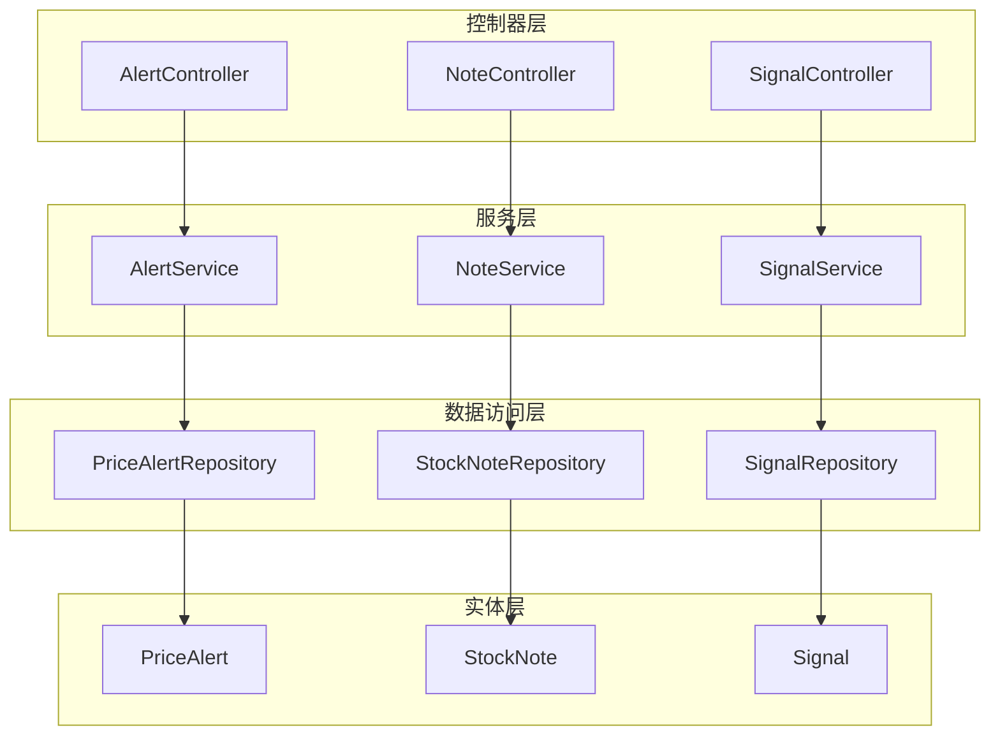
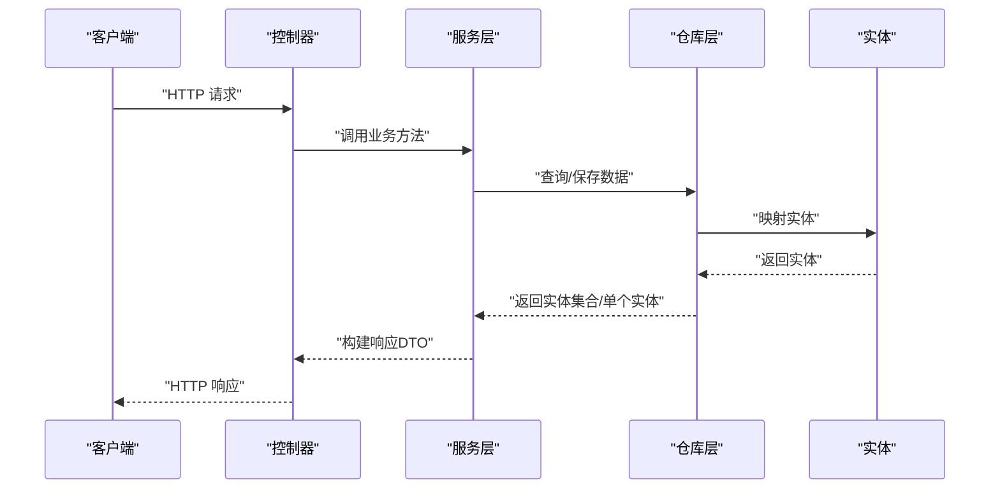
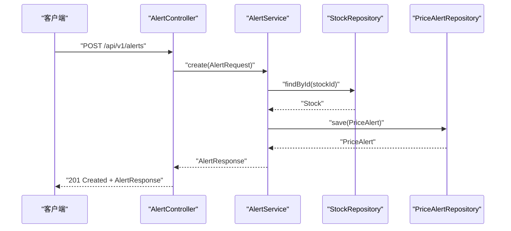
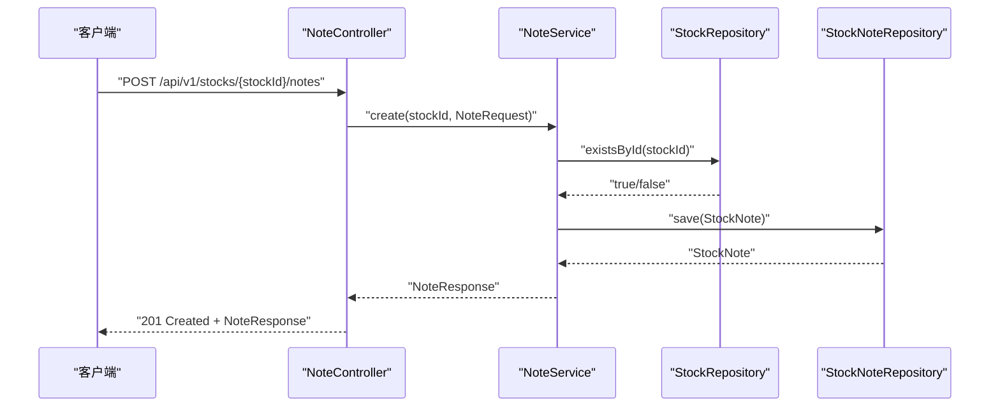
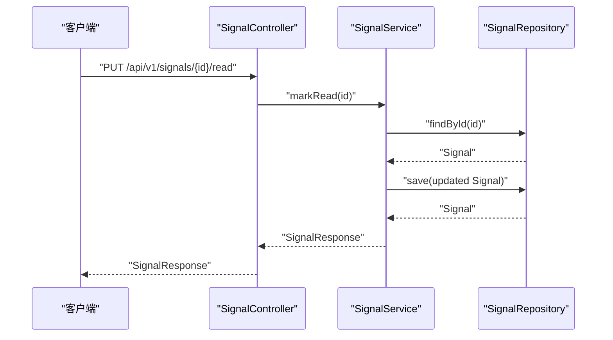
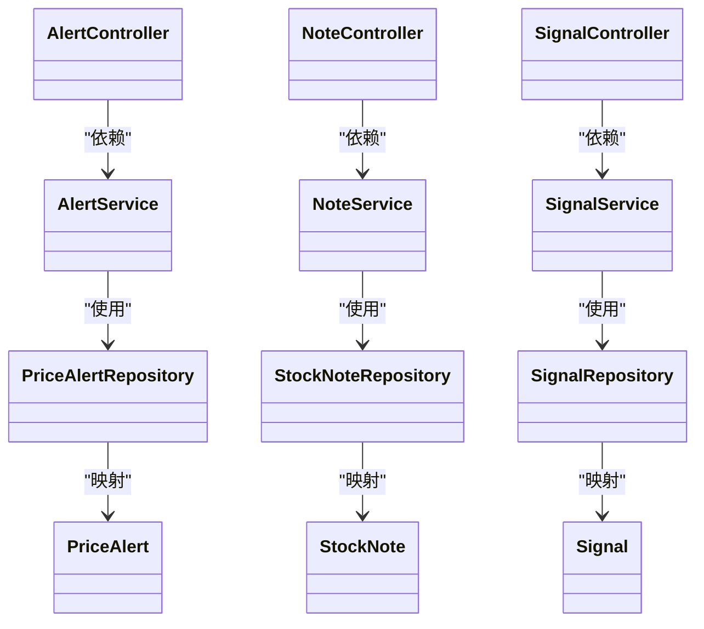

# 用户交互API

<cite>
**本文档引用的文件**
- [AlertController.java](file://backend/src/main/java/com/stock/controller/AlertController.java)
- [NoteController.java](file://backend/src/main/java/com/stock/controller/NoteController.java)
- [SignalController.java](file://backend/src/main/java/com/stock/controller/SignalController.java)
- [AlertRequest.java](file://backend/src/main/java/com/stock/dto/request/AlertRequest.java)
- [AlertResponse.java](file://backend/src/main/java/com/stock/dto/response/AlertResponse.java)
- [NoteRequest.java](file://backend/src/main/java/com/stock/dto/request/NoteRequest.java)
- [NoteUpdateRequest.java](file://backend/src/main/java/com/stock/dto/request/NoteUpdateRequest.java)
- [NoteResponse.java](file://backend/src/main/java/com/stock/dto/response/NoteResponse.java)
- [SignalResponse.java](file://backend/src/main/java/com/stock/dto/response/SignalResponse.java)
- [AlertService.java](file://backend/src/main/java/com/stock/service/AlertService.java)
- [NoteService.java](file://backend/src/main/java/com/stock/service/NoteService.java)
- [SignalService.java](file://backend/src/main/java/com/stock/service/SignalService.java)
- [PriceAlert.java](file://backend/src/main/java/com/stock/entity/PriceAlert.java)
- [StockNote.java](file://backend/src/main/java/com/stock/entity/StockNote.java)
- [Signal.java](file://backend/src/main/java/com/stock/entity/Signal.java)
- [PriceAlertRepository.java](file://backend/src/main/java/com/stock/repository/PriceAlertRepository.java)
- [StockNoteRepository.java](file://backend/src/main/java/com/stock/repository/StockNoteRepository.java)
- [SignalRepository.java](file://backend/src/main/java/com/stock/repository/SignalRepository.java)
</cite>

## 目录
1. [简介](#简介)
2. [项目结构](#项目结构)
3. [核心组件](#核心组件)
4. [架构总览](#架构总览)
5. [详细组件分析](#详细组件分析)
6. [依赖关系分析](#依赖关系分析)
7. [性能考虑](#性能考虑)
8. [故障排除指南](#故障排除指南)
9. [结论](#结论)
10. [附录](#附录)

## 简介
本文件面向用户交互API，聚焦以下功能域：
- 价格预警：创建、查询、删除预警；支持按股票过滤；预警状态与最新股价联动展示
- 笔记管理：为指定股票创建、查询、更新、删除笔记；支持按分类过滤；内容自动HTML净化
- 交易信号：查询信号列表；标记已读

本文档提供接口定义、数据模型、处理流程、最佳实践与个性化配置建议，并通过图示帮助理解系统架构与调用路径。

## 项目结构
后端采用Spring Boot分层架构：
- 控制器层：暴露REST接口
- DTO层：请求/响应数据传输对象
- 服务层：业务逻辑编排
- 实体与仓库层：数据持久化与查询
- 调度器：定时任务（如预警检查、信号生成等）

图表来源
- [AlertController.java:1-40](file://backend/src/main/java/com/stock/controller/AlertController.java#L1-L40)
- [NoteController.java:1-51](file://backend/src/main/java/com/stock/controller/NoteController.java#L1-L51)
- [SignalController.java:1-30](file://backend/src/main/java/com/stock/controller/SignalController.java#L1-L30)
- [AlertService.java:1-63](file://backend/src/main/java/com/stock/service/AlertService.java#L1-L63)
- [NoteService.java:1-79](file://backend/src/main/java/com/stock/service/NoteService.java#L1-L79)
- [SignalService.java:1-51](file://backend/src/main/java/com/stock/service/SignalService.java#L1-L51)
- [PriceAlertRepository.java:1-17](file://backend/src/main/java/com/stock/repository/PriceAlertRepository.java#L1-L17)
- [StockNoteRepository.java:1-17](file://backend/src/main/java/com/stock/repository/StockNoteRepository.java#L1-L17)
- [SignalRepository.java:1-21](file://backend/src/main/java/com/stock/repository/SignalRepository.java#L1-L21)
- [PriceAlert.java:1-37](file://backend/src/main/java/com/stock/entity/PriceAlert.java#L1-L37)
- [StockNote.java:1-37](file://backend/src/main/java/com/stock/entity/StockNote.java#L1-L37)
- [Signal.java:1-36](file://backend/src/main/java/com/stock/entity/Signal.java#L1-L36)

章节来源
- [AlertController.java:1-40](file://backend/src/main/java/com/stock/controller/AlertController.java#L1-L40)
- [NoteController.java:1-51](file://backend/src/main/java/com/stock/controller/NoteController.java#L1-L51)
- [SignalController.java:1-30](file://backend/src/main/java/com/stock/controller/SignalController.java#L1-L30)

## 核心组件
本节概述三大用户交互模块及其职责：
- 价格预警：基于阈值触发条件，记录预警状态与关联股票信息
- 笔记管理：围绕股票的个人笔记，支持分类与内容管理
- 交易信号：记录与展示各类交易信号，支持标记已读

章节来源
- [AlertService.java:1-63](file://backend/src/main/java/com/stock/service/AlertService.java#L1-L63)
- [NoteService.java:1-79](file://backend/src/main/java/com/stock/service/NoteService.java#L1-L79)
- [SignalService.java:1-51](file://backend/src/main/java/com/stock/service/SignalService.java#L1-L51)

## 架构总览
用户交互API遵循经典的MVC+服务层模式：
- 控制器接收HTTP请求，参数校验由DTO完成
- 服务层执行业务逻辑，必要时进行事务控制
- 仓库层负责数据库访问
- 实体层映射表结构

图表来源
- [AlertController.java:23-38](file://backend/src/main/java/com/stock/controller/AlertController.java#L23-L38)
- [NoteController.java:24-49](file://backend/src/main/java/com/stock/controller/NoteController.java#L24-L49)
- [SignalController.java:19-28](file://backend/src/main/java/com/stock/controller/SignalController.java#L19-L28)
- [AlertService.java:26-61](file://backend/src/main/java/com/stock/service/AlertService.java#L26-L61)
- [NoteService.java:28-72](file://backend/src/main/java/com/stock/service/NoteService.java#L28-L72)
- [SignalService.java:21-43](file://backend/src/main/java/com/stock/service/SignalService.java#L21-L43)

## 详细组件分析

### 价格预警模块

#### 接口定义
- 列出预警
  - 方法：GET
  - 路径：/api/v1/alerts
  - 查询参数：stockId（可选）
  - 返回：预警列表（AlertResponse数组）
- 创建预警
  - 方法：POST
  - 路径：/api/v1/alerts
  - 请求体：AlertRequest
  - 返回：新建预警（AlertResponse），状态码201
- 删除预警
  - 方法：DELETE
  - 路径：/api/v1/alerts/{id}
  - 返回：204 No Content

章节来源
- [AlertController.java:23-38](file://backend/src/main/java/com/stock/controller/AlertController.java#L23-L38)

#### 数据模型与验证
- 请求模型 AlertRequest
  - 字段：stockId（必填，非空）、type（必填，非空白）、threshold（必填，最小0.01）
- 响应模型 AlertResponse
  - 字段：id、stockId、stockName、type、threshold、isTriggered、latestPrice

章节来源
- [AlertRequest.java:6-10](file://backend/src/main/java/com/stock/dto/request/AlertRequest.java#L6-L10)
- [AlertResponse.java:5-13](file://backend/src/main/java/com/stock/dto/response/AlertResponse.java#L5-L13)

#### 处理流程
- 列表查询：根据stockId过滤或全量查询，组装响应DTO
- 创建预警：校验股票存在性，写入默认未触发状态，返回包含最新股价的响应
- 删除预警：直接删除对应ID

图表来源
- [AlertController.java:28-32](file://backend/src/main/java/com/stock/controller/AlertController.java#L28-L32)
- [AlertService.java:41-56](file://backend/src/main/java/com/stock/service/AlertService.java#L41-L56)

章节来源
- [AlertService.java:26-61](file://backend/src/main/java/com/stock/service/AlertService.java#L26-L61)

#### 预警规则设置与最佳实践
- 预警类型（type）：用于区分上涨/下跌/突破等条件，建议在前端进行枚举约束
- 阈值（threshold）：最小值0.01，避免过小数值引发频繁误报
- 触发状态（isTriggered）：由后台调度器或业务逻辑更新，前端仅展示
- 个性化配置建议：
  - 同一股票可设置多条不同类型的预警
  - 结合最新股价（latestPrice）与阈值进行对比，避免静态阈值失效
  - 定期清理已触发且不再关注的预警

### 笔记管理模块

#### 接口定义
- 列出笔记
  - 方法：GET
  - 路径：/api/v1/stocks/{stockId}/notes
  - 查询参数：category（可选）
  - 返回：笔记列表（NoteResponse数组）
- 创建笔记
  - 方法：POST
  - 路径：/api/v1/stocks/{stockId}/notes
  - 请求体：NoteRequest
  - 返回：新建笔记（NoteResponse），状态码201
- 更新笔记
  - 方法：PUT
  - 路径：/api/v1/stocks/{stockId}/notes/{id}
  - 请求体：NoteUpdateRequest
  - 返回：更新后的笔记（NoteResponse）
- 删除笔记
  - 方法：DELETE
  - 路径：/api/v1/stocks/{stockId}/notes/{id}
  - 返回：204 No Content

章节来源
- [NoteController.java:24-49](file://backend/src/main/java/com/stock/controller/NoteController.java#L24-L49)

#### 数据模型与验证
- 请求模型 NoteRequest
  - 字段：category（必填，非空白，长度限制）、content（必填，1-10000字符）
- 请求模型 NoteUpdateRequest
  - 字段：content（必填，1-10000字符）
- 响应模型 NoteResponse
  - 字段：id、stockId、category、content、createdAt、updatedAt

章节来源
- [NoteRequest.java:6-9](file://backend/src/main/java/com/stock/dto/request/NoteRequest.java#L6-L9)
- [NoteUpdateRequest.java:6-8](file://backend/src/main/java/com/stock/dto/request/NoteUpdateRequest.java#L6-L8)
- [NoteResponse.java:5-12](file://backend/src/main/java/com/stock/dto/response/NoteResponse.java#L5-L12)

#### 处理流程
- 列出：支持按股票与分类过滤，按更新时间倒序
- 创建：校验股票存在性，内容经HTML净化后保存
- 更新：校验笔记存在性，内容净化后更新
- 删除：直接删除

图表来源
- [NoteController.java:30-35](file://backend/src/main/java/com/stock/controller/NoteController.java#L30-L35)
- [NoteService.java:40-55](file://backend/src/main/java/com/stock/service/NoteService.java#L40-L55)

章节来源
- [NoteService.java:28-72](file://backend/src/main/java/com/stock/service/NoteService.java#L28-L72)

#### 笔记分类管理与最佳实践
- 分类（category）：建议统一维护分类字典，前端下拉选择
- 内容（content）：自动HTML净化，防止XSS；建议提供Markdown渲染能力
- 版本与变更：利用createdAt/updatedAt追踪修改历史
- 性能优化：列表按更新时间倒序，避免一次性加载过多数据

### 交易信号模块

#### 接口定义
- 列出信号
  - 方法：GET
  - 路径：/api/v1/signals
  - 查询参数：stockId（可选）、type（可选）
  - 返回：信号列表（SignalResponse数组）
- 标记已读
  - 方法：PUT
  - 路径：/api/v1/signals/{id}/read
  - 返回：更新后的信号（SignalResponse）

章节来源
- [SignalController.java:19-28](file://backend/src/main/java/com/stock/controller/SignalController.java#L19-L28)

#### 数据模型
- 响应模型 SignalResponse
  - 字段：id、stockId、type、date、description、isRead

章节来源
- [SignalResponse.java:5-12](file://backend/src/main/java/com/stock/dto/response/SignalResponse.java#L5-L12)

#### 处理流程
- 列表查询：支持按股票、类型或全局查询，按交易日期倒序
- 标记已读：将isRead置为true并保存

图表来源
- [SignalController.java:25-28](file://backend/src/main/java/com/stock/controller/SignalController.java#L25-L28)
- [SignalService.java:36-43](file://backend/src/main/java/com/stock/service/SignalService.java#L36-L43)

章节来源
- [SignalService.java:21-43](file://backend/src/main/java/com/stock/service/SignalService.java#L21-L43)

#### 信号算法说明与个性化配置
- 信号类型（type）：建议在前端维护类型枚举，如“买入”、“卖出”、“关注”
- 交易日期（date）：按交易日排序，便于回溯分析
- 已读状态（isRead）：前端可据此高亮未读信号，提升交互体验
- 个性化：支持按股票与类型筛选，便于构建“我的信号”视图

## 依赖关系分析

图表来源
- [AlertController.java:1-40](file://backend/src/main/java/com/stock/controller/AlertController.java#L1-L40)
- [NoteController.java:1-51](file://backend/src/main/java/com/stock/controller/NoteController.java#L1-L51)
- [SignalController.java:1-30](file://backend/src/main/java/com/stock/controller/SignalController.java#L1-L30)
- [AlertService.java:1-63](file://backend/src/main/java/com/stock/service/AlertService.java#L1-L63)
- [NoteService.java:1-79](file://backend/src/main/java/com/stock/service/NoteService.java#L1-L79)
- [SignalService.java:1-51](file://backend/src/main/java/com/stock/service/SignalService.java#L1-L51)
- [PriceAlertRepository.java:1-17](file://backend/src/main/java/com/stock/repository/PriceAlertRepository.java#L1-L17)
- [StockNoteRepository.java:1-17](file://backend/src/main/java/com/stock/repository/StockNoteRepository.java#L1-L17)
- [SignalRepository.java:1-21](file://backend/src/main/java/com/stock/repository/SignalRepository.java#L1-L21)
- [PriceAlert.java:1-37](file://backend/src/main/java/com/stock/entity/PriceAlert.java#L1-L37)
- [StockNote.java:1-37](file://backend/src/main/java/com/stock/entity/StockNote.java#L1-L37)
- [Signal.java:1-36](file://backend/src/main/java/com/stock/entity/Signal.java#L1-L36)

章节来源
- [AlertController.java:1-40](file://backend/src/main/java/com/stock/controller/AlertController.java#L1-L40)
- [NoteController.java:1-51](file://backend/src/main/java/com/stock/controller/NoteController.java#L1-L51)
- [SignalController.java:1-30](file://backend/src/main/java/com/stock/controller/SignalController.java#L1-L30)

## 性能考虑
- 查询优化
  - 列表接口均按时间倒序，建议在数据库层面建立复合索引以加速排序与过滤
  - 对高频查询（如信号列表）可考虑缓存策略，降低数据库压力
- 写入优化
  - 批量创建/更新时注意事务边界，避免长事务阻塞
- 前端交互
  - 使用分页或懒加载减少初始渲染压力
  - 对未读信号进行视觉突出，提高响应效率

## 故障排除指南
- 股票不存在
  - 现象：创建预警/笔记时报错
  - 处理：确认stockId是否正确；若股票已退市，需先同步状态
- 笔记不存在
  - 现象：更新/删除笔记时报错
  - 处理：确认笔记ID是否存在；检查是否已被删除
- 信号不存在
  - 现象：标记已读时报错
  - 处理：确认信号ID；检查信号是否被清理

章节来源
- [AlertService.java:43-44](file://backend/src/main/java/com/stock/service/AlertService.java#L43-L44)
- [NoteService.java:59-60](file://backend/src/main/java/com/stock/service/NoteService.java#L59-L60)
- [SignalService.java:38-39](file://backend/src/main/java/com/stock/service/SignalService.java#L38-L39)

## 结论
用户交互API围绕价格预警、笔记管理与交易信号三大场景，提供了清晰的REST接口与稳健的数据模型。通过合理的参数校验、事务控制与仓储查询，系统能够稳定支撑用户日常操作。建议结合前端个性化配置与缓存策略，进一步提升用户体验与系统性能。

## 附录

### API汇总与字段说明

- 价格预警
  - GET /api/v1/alerts?stockId={id}
    - 返回：AlertResponse[]
  - POST /api/v1/alerts
    - 请求体：AlertRequest
    - 返回：AlertResponse（201）
  - DELETE /api/v1/alerts/{id}
    - 返回：204

- 笔记管理
  - GET /api/v1/stocks/{stockId}/notes?category={name}
    - 返回：NoteResponse[]
  - POST /api/v1/stocks/{stockId}/notes
    - 请求体：NoteRequest
    - 返回：NoteResponse（201）
  - PUT /api/v1/stocks/{stockId}/notes/{id}
    - 请求体：NoteUpdateRequest
    - 返回：NoteResponse
  - DELETE /api/v1/stocks/{stockId}/notes/{id}
    - 返回：204

- 交易信号
  - GET /api/v1/signals?stockId={id}&type={type}
    - 返回：SignalResponse[]
  - PUT /api/v1/signals/{id}/read
    - 返回：SignalResponse

- 数据模型字段说明
  - AlertResponse：id、stockId、stockName、type、threshold、isTriggered、latestPrice
  - NoteResponse：id、stockId、category、content、createdAt、updatedAt
  - SignalResponse：id、stockId、type、date、description、isRead

章节来源
- [AlertController.java:23-38](file://backend/src/main/java/com/stock/controller/AlertController.java#L23-L38)
- [NoteController.java:24-49](file://backend/src/main/java/com/stock/controller/NoteController.java#L24-L49)
- [SignalController.java:19-28](file://backend/src/main/java/com/stock/controller/SignalController.java#L19-L28)
- [AlertResponse.java:5-13](file://backend/src/main/java/com/stock/dto/response/AlertResponse.java#L5-L13)
- [NoteResponse.java:5-12](file://backend/src/main/java/com/stock/dto/response/NoteResponse.java#L5-L12)
- [SignalResponse.java:5-12](file://backend/src/main/java/com/stock/dto/response/SignalResponse.java#L5-L12)