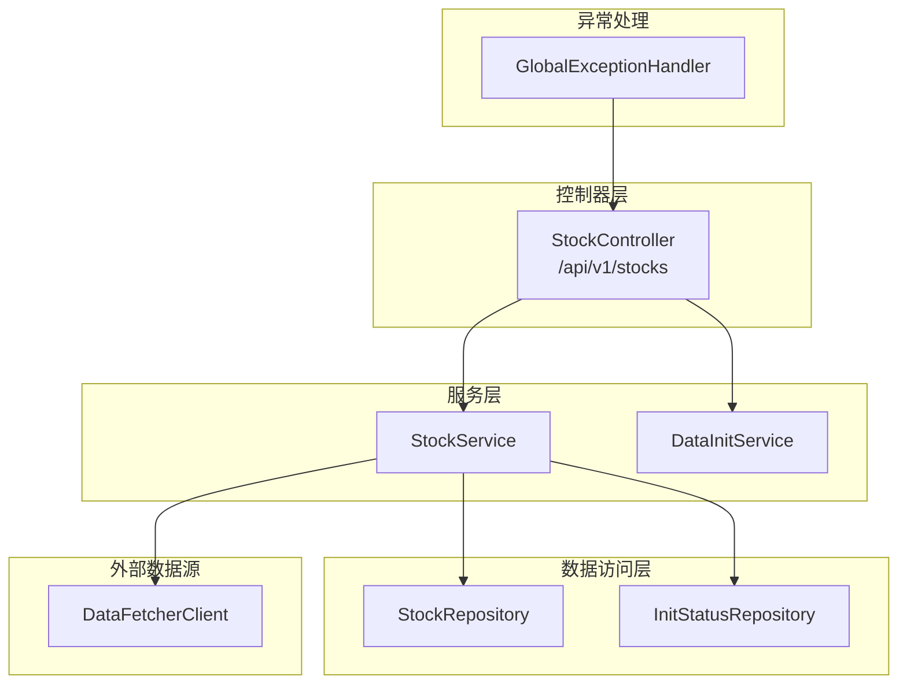
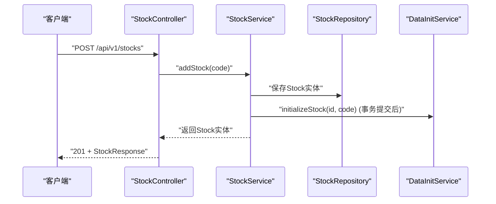
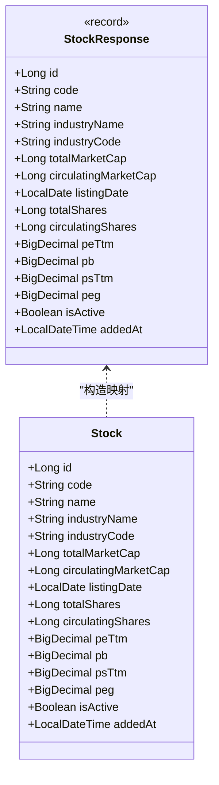
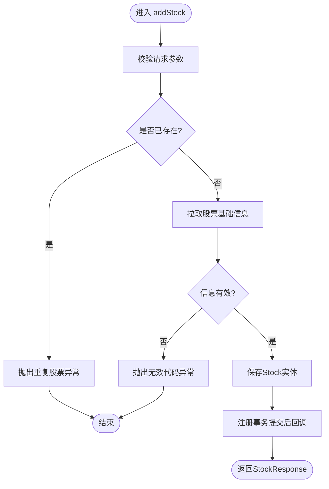
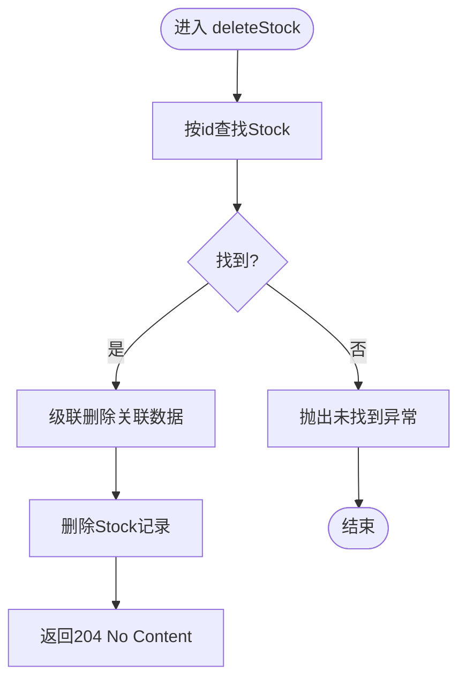
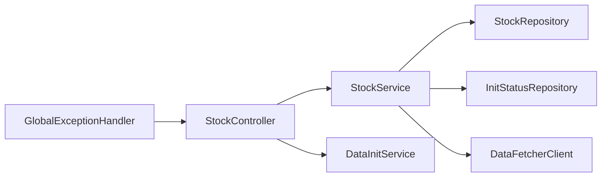

# 股票管理API

<cite>
**本文引用的文件**
- [StockController.java](file://backend/src/main/java/com/stock/controller/StockController.java)
- [StockService.java](file://backend/src/main/java/com/stock/service/StockService.java)
- [AddStockRequest.java](file://backend/src/main/java/com/stock/dto/request/AddStockRequest.java)
- [StockResponse.java](file://backend/src/main/java/com/stock/dto/response/StockResponse.java)
- [StockListItemResponse.java](file://backend/src/main/java/com/stock/dto/response/StockListItemResponse.java)
- [InitStatusResponse.java](file://backend/src/main/java/com/stock/dto/response/InitStatusResponse.java)
- [StepStatus.java](file://backend/src/main/java/com/stock/dto/response/StepStatus.java)
- [Stock.java](file://backend/src/main/java/com/stock/entity/Stock.java)
- [StockInfoResponse.java](file://backend/src/main/java/com/stock/dto/fetcher/StockInfoResponse.java)
- [GlobalExceptionHandler.java](file://backend/src/main/java/com/stock/exception/GlobalExceptionHandler.java)
- [StockNotFoundException.java](file://backend/src/main/java/com/stock/exception/StockNotFoundException.java)
- [DuplicateStockException.java](file://backend/src/main/java/com/stock/exception/DuplicateStockException.java)
- [InvalidStockCodeException.java](file://backend/src/main/java/com/stock/exception/InvalidStockCodeException.java)
</cite>

## 目录
1. [简介](#简介)
2. [项目结构](#项目结构)
3. [核心组件](#核心组件)
4. [架构总览](#架构总览)
5. [详细组件分析](#详细组件分析)
6. [依赖关系分析](#依赖关系分析)
7. [性能考虑](#性能考虑)
8. [故障排查指南](#故障排查指南)
9. [结论](#结论)
10. [附录](#附录)

## 简介
本文件为“股票管理API”的权威技术文档，覆盖股票的增删查改（CRUD）能力与初始化状态查询接口。内容包括：
- 接口清单：新增股票、删除股票、查询股票列表、获取股票详情、查询初始化状态
- 请求与响应模型：AddStockRequest、StockResponse、StockListItemResponse、InitStatusResponse 及其字段说明
- 错误处理与状态码：统一异常映射到标准HTTP状态码
- 参数校验规则、事务与异步初始化流程、最佳实践建议

## 项目结构
后端采用Spring Boot分层架构，股票管理API位于控制器层，业务逻辑在服务层，数据访问通过仓库层完成。

图表来源
- [StockController.java:17-56](file://backend/src/main/java/com/stock/controller/StockController.java#L17-L56)
- [StockService.java:28-91](file://backend/src/main/java/com/stock/service/StockService.java#L28-L91)

章节来源
- [StockController.java:17-56](file://backend/src/main/java/com/stock/controller/StockController.java#L17-L56)
- [StockService.java:28-91](file://backend/src/main/java/com/stock/service/StockService.java#L28-L91)

## 核心组件
- 控制器 StockController：暴露REST接口，负责路由与响应封装
- 服务 StockService：实现业务逻辑，包含新增、删除、查询、初始化触发等
- 数据模型
  - AddStockRequest：新增股票请求体
  - StockResponse/StockListItemResponse：股票详情与列表项响应体
  - InitStatusResponse/StepStatus：初始化状态聚合响应
  - Stock：数据库实体
- 异常与全局处理器：统一错误响应与HTTP状态码映射

章节来源
- [StockController.java:29-55](file://backend/src/main/java/com/stock/controller/StockController.java#L29-L55)
- [StockService.java:93-242](file://backend/src/main/java/com/stock/service/StockService.java#L93-L242)
- [AddStockRequest.java:7-9](file://backend/src/main/java/com/stock/dto/request/AddStockRequest.java#L7-L9)
- [StockResponse.java:7-24](file://backend/src/main/java/com/stock/dto/response/StockResponse.java#L7-L24)
- [StockListItemResponse.java:6-22](file://backend/src/main/java/com/stock/dto/response/StockListItemResponse.java#L6-L22)
- [InitStatusResponse.java:5-11](file://backend/src/main/java/com/stock/dto/response/InitStatusResponse.java#L5-L11)
- [StepStatus.java:3](file://backend/src/main/java/com/stock/dto/response/StepStatus.java#L3)
- [Stock.java:17-84](file://backend/src/main/java/com/stock/entity/Stock.java#L17-L84)
- [GlobalExceptionHandler.java:7-32](file://backend/src/main/java/com/stock/exception/GlobalExceptionHandler.java#L7-L32)

## 架构总览
以下序列图展示“新增股票”从请求到落库与初始化的整体流程。

图表来源
- [StockController.java:29-34](file://backend/src/main/java/com/stock/controller/StockController.java#L29-L34)
- [StockService.java:93-163](file://backend/src/main/java/com/stock/service/StockService.java#L93-L163)

## 详细组件分析

### 接口一览与规范
- 新增股票
  - 方法与路径：POST /api/v1/stocks
  - 请求体：AddStockRequest
  - 响应：201 Created + StockResponse
- 删除股票
  - 方法与路径：DELETE /api/v1/stocks/{id}
  - 路径参数：id（Long）
  - 响应：204 No Content
- 查询股票列表
  - 方法与路径：GET /api/v1/stocks
  - 响应：200 OK + StockListItemResponse数组
- 获取股票详情
  - 方法与路径：GET /api/v1/stocks/{id}
  - 路径参数：id（Long）
  - 响应：200 OK + StockResponse
- 查询初始化状态
  - 方法与路径：GET /api/v1/stocks/{id}/init-status
  - 路径参数：id（Long）
  - 响应：200 OK + InitStatusResponse

章节来源
- [StockController.java:29-55](file://backend/src/main/java/com/stock/controller/StockController.java#L29-L55)

### 请求体与响应体模型

#### AddStockRequest
- 字段
  - code: String（必填；长度6；必须为纯数字；示例：123456）
- 校验规则
  - 非空且长度为6
  - 正则匹配6位数字
- 示例
  - 成功：{"code":"600036"}
  - 失败：{"code":"abc"} 或 {"code":"123"}

章节来源
- [AddStockRequest.java:7-9](file://backend/src/main/java/com/stock/dto/request/AddStockRequest.java#L7-L9)

#### StockResponse（股票详情）
- 字段
  - id: Long
  - code: String
  - name: String
  - industryName: String
  - industryCode: String
  - totalMarketCap: Long
  - circulatingMarketCap: Long
  - listingDate: LocalDate
  - totalShares: Long
  - circulatingShares: Long
  - peTtm: BigDecimal
  - pb: BigDecimal
  - psTtm: BigDecimal
  - peg: BigDecimal
  - isActive: Boolean
  - addedAt: LocalDateTime

章节来源
- [StockResponse.java:7-24](file://backend/src/main/java/com/stock/dto/response/StockResponse.java#L7-L24)

#### StockListItemResponse（股票列表项）
- 字段
  - id: Long
  - code: String
  - name: String
  - industryName: String
  - totalMarketCap: Long
  - latestPrice: BigDecimal
  - changePercent: BigDecimal
  - changeAmount: BigDecimal
  - volume: Long
  - turnoverRate: BigDecimal
  - amplitude: BigDecimal
  - peTtm: BigDecimal
  - pb: BigDecimal
  - analysisCompleteness: int
  - addedAt: LocalDateTime

章节来源
- [StockListItemResponse.java:6-22](file://backend/src/main/java/com/stock/dto/response/StockListItemResponse.java#L6-L22)

#### InitStatusResponse（初始化状态聚合）
- 字段
  - stockId: Long
  - code: String
  - steps: StepStatus[]
  - completedCount: long
  - totalCount: long
- StepStatus
  - step: String
  - status: String

章节来源
- [InitStatusResponse.java:5-11](file://backend/src/main/java/com/stock/dto/response/InitStatusResponse.java#L5-L11)
- [StepStatus.java:3](file://backend/src/main/java/com/stock/dto/response/StepStatus.java#L3)

### 数据模型与实体映射
Stock实体与StockResponse字段一一对应，用于对外输出标准化的股票详情。

图表来源
- [Stock.java:17-84](file://backend/src/main/java/com/stock/entity/Stock.java#L17-L84)
- [StockResponse.java:7-24](file://backend/src/main/java/com/stock/dto/response/StockResponse.java#L7-L24)

章节来源
- [Stock.java:17-84](file://backend/src/main/java/com/stock/entity/Stock.java#L17-L84)
- [StockResponse.java:7-24](file://backend/src/main/java/com/stock/dto/response/StockResponse.java#L7-L24)

### 业务流程与控制流

#### 新增股票流程
- 输入校验：AddStockRequest.code
- 业务校验：StockService.addStock中对代码格式、唯一性与外部数据有效性进行检查
- 数据持久化：保存Stock实体
- 初始化触发：事务提交后异步调用DataInitService.initializeStock
- 返回：StockResponse

图表来源
- [StockService.java:93-163](file://backend/src/main/java/com/stock/service/StockService.java#L93-L163)
- [AddStockRequest.java:7-9](file://backend/src/main/java/com/stock/dto/request/AddStockRequest.java#L7-L9)

章节来源
- [StockService.java:93-163](file://backend/src/main/java/com/stock/service/StockService.java#L93-L163)
- [StockController.java:29-34](file://backend/src/main/java/com/stock/controller/StockController.java#L29-L34)

#### 删除股票流程
- 查找：StockService.deleteStock根据id查询
- 级联清理：删除该股票相关的多张表数据
- 删除：删除Stock记录

图表来源
- [StockService.java:165-189](file://backend/src/main/java/com/stock/service/StockService.java#L165-L189)

章节来源
- [StockService.java:165-189](file://backend/src/main/java/com/stock/service/StockService.java#L165-L189)
- [StockController.java:36-40](file://backend/src/main/java/com/stock/controller/StockController.java#L36-L40)

#### 查询列表与详情
- 列表：StockService.listStocks过滤活跃股票并计算分析完整度
- 详情：StockService.getStock按id查询并组装StockResponse

章节来源
- [StockService.java:191-236](file://backend/src/main/java/com/stock/service/StockService.java#L191-L236)
- [StockController.java:42-50](file://backend/src/main/java/com/stock/controller/StockController.java#L42-L50)

#### 初始化状态查询
- 控制器：StockController.getInitStatus委托DataInitService.getInitStatus
- 返回：InitStatusResponse（包含步骤列表、完成数、总数）

章节来源
- [StockController.java:52-55](file://backend/src/main/java/com/stock/controller/StockController.java#L52-L55)

### 错误处理与状态码
- 全局异常映射
  - 股票未找到：404 Not Found
  - 重复股票：409 Conflict
  - 无效股票代码：400 Bad Request
  - 数据拉取失败：503 Service Unavailable
  - 参数校验失败：400 Bad Request（字段名+默认消息拼接）
- 异常类
  - StockNotFoundException
  - DuplicateStockException
  - InvalidStockCodeException
  - DataFetchException（由全局处理器映射）

章节来源
- [GlobalExceptionHandler.java:7-32](file://backend/src/main/java/com/stock/exception/GlobalExceptionHandler.java#L7-L32)
- [StockNotFoundException.java:1-6](file://backend/src/main/java/com/stock/exception/StockNotFoundException.java#L1-L6)
- [DuplicateStockException.java:1-5](file://backend/src/main/java/com/stock/exception/DuplicateStockException.java#L1-L5)
- [InvalidStockCodeException.java:1-5](file://backend/src/main/java/com/stock/exception/InvalidStockCodeException.java#L1-L5)

## 依赖关系分析
- 控制器依赖服务层与初始化服务
- 服务层依赖多个仓库与DataFetcherClient
- 全局异常处理器统一拦截并转换为标准错误响应

图表来源
- [StockController.java:21-27](file://backend/src/main/java/com/stock/controller/StockController.java#L21-L27)
- [StockService.java:51-91](file://backend/src/main/java/com/stock/service/StockService.java#L51-L91)
- [GlobalExceptionHandler.java:7-32](file://backend/src/main/java/com/stock/exception/GlobalExceptionHandler.java#L7-L32)

章节来源
- [StockController.java:21-27](file://backend/src/main/java/com/stock/controller/StockController.java#L21-L27)
- [StockService.java:51-91](file://backend/src/main/java/com/stock/service/StockService.java#L51-L91)
- [GlobalExceptionHandler.java:7-32](file://backend/src/main/java/com/stock/exception/GlobalExceptionHandler.java#L7-L32)

## 性能考虑
- 新增股票时，外部数据拉取与初始化采用异步触发，避免阻塞主事务
- 列表查询对活跃股票过滤，减少无关数据扫描
- 建议
  - 对高频查询使用缓存（如股票基础信息）
  - 分页与筛选列表数据
  - 控制初始化步骤数量，避免过长的初始化链路

## 故障排查指南
- 新增失败返回400或409
  - 检查请求体code是否为6位纯数字
  - 若提示重复，确认数据库中是否已存在该代码
- 删除失败返回404
  - 确认id是否存在
- 初始化状态为空或不完整
  - 检查DataInitService任务队列与调度器状态
- 参数校验失败返回400
  - 关注字段名与默认校验消息，修正请求体

章节来源
- [GlobalExceptionHandler.java:7-32](file://backend/src/main/java/com/stock/exception/GlobalExceptionHandler.java#L7-L32)
- [StockController.java:29-55](file://backend/src/main/java/com/stock/controller/StockController.java#L29-L55)

## 结论
本API以清晰的REST设计与严格的参数校验为基础，结合服务层的事务与异步初始化机制，提供了稳定可靠的股票管理能力。配合统一异常处理与明确的状态码语义，便于前端与集成方快速定位问题并正确消费接口。

## 附录

### 请求与响应示例

- 新增股票
  - 请求
    - 方法：POST
    - 路径：/api/v1/stocks
    - 请求体：{"code":"600036"}
  - 响应
    - 状态：201 Created
    - 响应体：StockResponse（包含id、code、name、指标等字段）

- 删除股票
  - 请求
    - 方法：DELETE
    - 路径：/api/v1/stocks/{id}
  - 响应
    - 状态：204 No Content

- 查询股票列表
  - 请求
    - 方法：GET
    - 路径：/api/v1/stocks
  - 响应
    - 状态：200 OK
    - 响应体：StockListItemResponse数组

- 获取股票详情
  - 请求
    - 方法：GET
    - 路径：/api/v1/stocks/{id}
  - 响应
    - 状态：200 OK
    - 响应体：StockResponse

- 查询初始化状态
  - 请求
    - 方法：GET
    - 路径：/api/v1/stocks/{id}/init-status
  - 响应
    - 状态：200 OK
    - 响应体：InitStatusResponse（包含steps、completedCount、totalCount）

章节来源
- [StockController.java:29-55](file://backend/src/main/java/com/stock/controller/StockController.java#L29-L55)
- [StockService.java:191-236](file://backend/src/main/java/com/stock/service/StockService.java#L191-L236)

### 参数验证规则
- 新增股票
  - code：非空、长度6、仅数字
- 其他接口
  - GET /api/v1/stocks/{id}：id为Long类型路径参数
  - DELETE /api/v1/stocks/{id}：id为Long类型路径参数

章节来源
- [AddStockRequest.java:7-9](file://backend/src/main/java/com/stock/dto/request/AddStockRequest.java#L7-L9)
- [StockController.java:36-50](file://backend/src/main/java/com/stock/controller/StockController.java#L36-L50)

### 权限控制与最佳实践
- 权限控制
  - 当前控制器未显式声明安全注解，建议在生产环境增加基于角色的访问控制（RBAC）与认证中间件
- 最佳实践
  - 对外响应统一使用标准化DTO，避免直接暴露实体
  - 新增股票后立即触发初始化，确保后续分析可用
  - 列表接口支持分页与筛选，提升大列表场景下的性能
  - 对外部数据拉取失败进行重试与降级策略设计