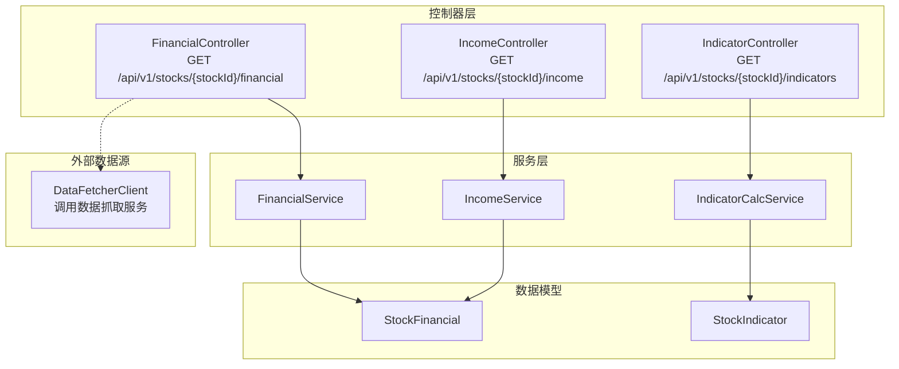
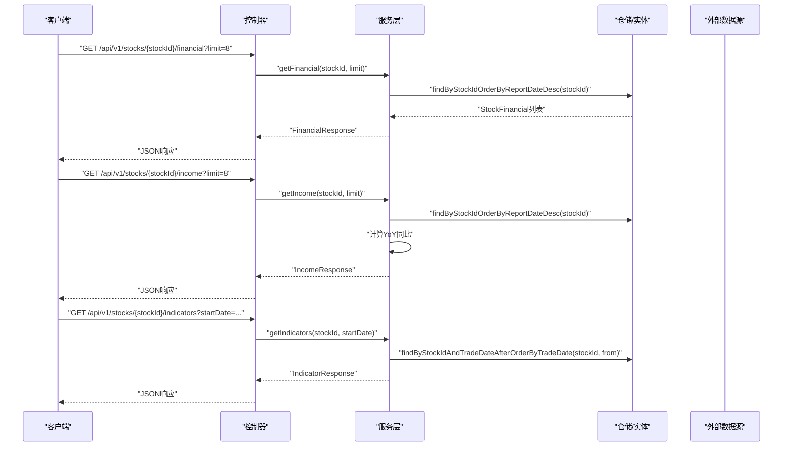
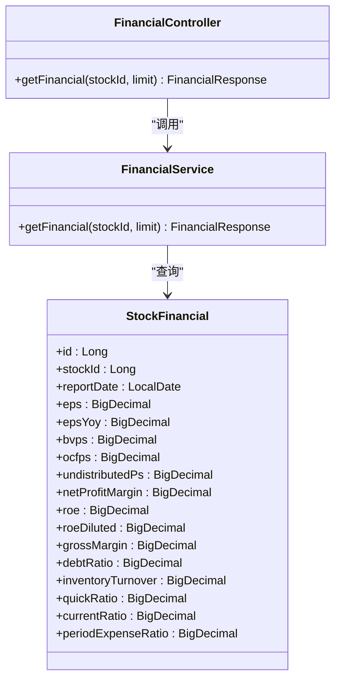
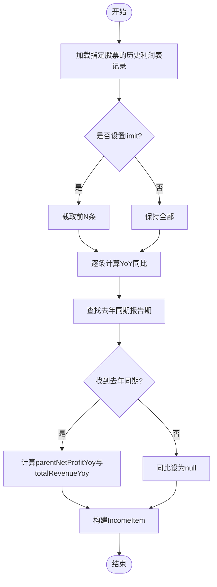
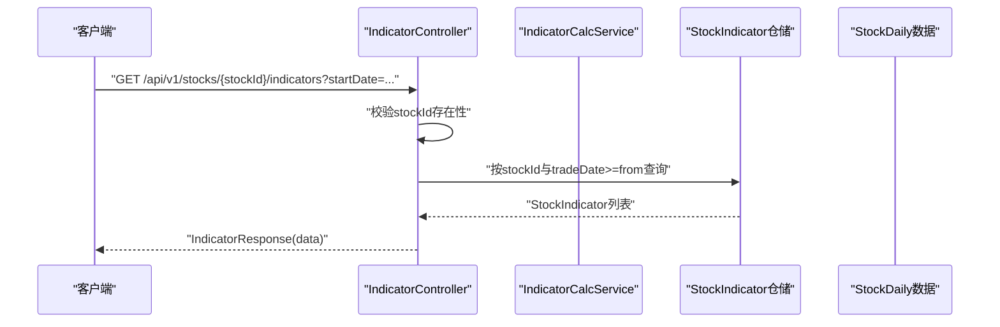
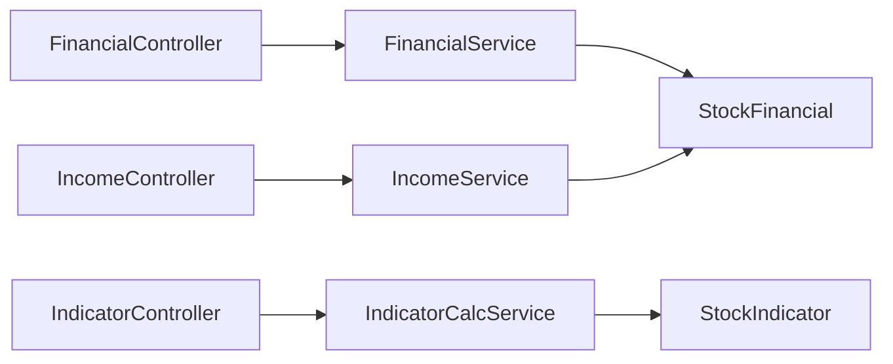

# 财务分析API

<cite>
**本文引用的文件**
- [backend/src/main/java/com/stock/controller/FinancialController.java](file://backend/src/main/java/com/stock/controller/FinancialController.java)
- [backend/src/main/java/com/stock/controller/IncomeController.java](file://backend/src/main/java/com/stock/controller/IncomeController.java)
- [backend/src/main/java/com/stock/controller/IndicatorController.java](file://backend/src/main/java/com/stock/controller/IndicatorController.java)
- [backend/src/main/java/com/stock/service/FinancialService.java](file://backend/src/main/java/com/stock/service/FinancialService.java)
- [backend/src/main/java/com/stock/service/IncomeService.java](file://backend/src/main/java/com/stock/service/IncomeService.java)
- [backend/src/main/java/com/stock/service/IndicatorCalcService.java](file://backend/src/main/java/com/stock/service/IndicatorCalcService.java)
- [backend/src/main/java/com/stock/dto/response/FinancialResponse.java](file://backend/src/main/java/com/stock/dto/response/FinancialResponse.java)
- [backend/src/main/java/com/stock/dto/response/IncomeResponse.java](file://backend/src/main/java/com/stock/dto/response/IncomeResponse.java)
- [backend/src/main/java/com/stock/dto/response/IndicatorResponse.java](file://backend/src/main/java/com/stock/dto/response/IndicatorResponse.java)
- [backend/src/main/java/com/stock/dto/response/FinancialItem.java](file://backend/src/main/java/com/stock/dto/response/FinancialItem.java)
- [backend/src/main/java/com/stock/dto/response/IncomeItem.java](file://backend/src/main/java/com/stock/dto/response/IncomeItem.java)
- [backend/src/main/java/com/stock/dto/response/IndicatorItem.java](file://backend/src/main/java/com/stock/dto/response/IndicatorItem.java)
- [backend/src/main/java/com/stock/entity/StockFinancial.java](file://backend/src/main/java/com/stock/entity/StockFinancial.java)
- [backend/src/main/java/com/stock/entity/StockIndicator.java](file://backend/src/main/java/com/stock/entity/StockIndicator.java)
- [backend/src/main/java/com/stock/client/DataFetcherClient.java](file://backend/src/main/java/com/stock/client/DataFetcherClient.java)
</cite>

## 目录
1. [简介](#简介)
2. [项目结构](#项目结构)
3. [核心组件](#核心组件)
4. [架构总览](#架构总览)
5. [详细组件分析](#详细组件分析)
6. [依赖分析](#依赖分析)
7. [性能考虑](#性能考虑)
8. [故障排查指南](#故障排查指南)
9. [结论](#结论)
10. [附录](#附录)

## 简介
本文件为“财务分析API”的权威技术文档，覆盖财务数据查询、收入分析、技术指标计算等核心能力。重点说明以下接口与能力：
- 财务报表数据获取：按报告期返回关键财务指标，支持限制返回条数
- 利润表查询：返回母公司净利润、营业收入、运营成本及同比变化
- 技术指标计算：移动平均线(MA)、MACD、RSI、KDJ、布林带(BOLL)
- 响应数据结构：统一使用Record DTO封装，便于前端消费与扩展

同时，文档给出请求参数说明、响应字段定义、时间序列格式、指标计算方法、数据更新频率建议以及最佳实践与解读指导。

## 项目结构
后端采用Spring Boot分层架构，控制器(Controller)负责HTTP路由与参数解析，服务(Service)实现业务逻辑，实体(Entity)映射数据库表，DTO用于跨层传输。

图表来源
- [backend/src/main/java/com/stock/controller/FinancialController.java:1-23](file://backend/src/main/java/com/stock/controller/FinancialController.java#L1-L23)
- [backend/src/main/java/com/stock/controller/IncomeController.java:1-23](file://backend/src/main/java/com/stock/controller/IncomeController.java#L1-L23)
- [backend/src/main/java/com/stock/controller/IndicatorController.java:1-48](file://backend/src/main/java/com/stock/controller/IndicatorController.java#L1-L48)
- [backend/src/main/java/com/stock/service/FinancialService.java:1-45](file://backend/src/main/java/com/stock/service/FinancialService.java#L1-L45)
- [backend/src/main/java/com/stock/service/IncomeService.java:1-71](file://backend/src/main/java/com/stock/service/IncomeService.java#L1-L71)
- [backend/src/main/java/com/stock/service/IndicatorCalcService.java:1-210](file://backend/src/main/java/com/stock/service/IndicatorCalcService.java#L1-L210)
- [backend/src/main/java/com/stock/entity/StockFinancial.java:1-72](file://backend/src/main/java/com/stock/entity/StockFinancial.java#L1-L72)
- [backend/src/main/java/com/stock/entity/StockIndicator.java:1-72](file://backend/src/main/java/com/stock/entity/StockIndicator.java#L1-L72)
- [backend/src/main/java/com/stock/client/DataFetcherClient.java:1-126](file://backend/src/main/java/com/stock/client/DataFetcherClient.java#L1-L126)

章节来源
- [backend/src/main/java/com/stock/controller/FinancialController.java:1-23](file://backend/src/main/java/com/stock/controller/FinancialController.java#L1-L23)
- [backend/src/main/java/com/stock/controller/IncomeController.java:1-23](file://backend/src/main/java/com/stock/controller/IncomeController.java#L1-L23)
- [backend/src/main/java/com/stock/controller/IndicatorController.java:1-48](file://backend/src/main/java/com/stock/controller/IndicatorController.java#L1-L48)

## 核心组件
- 财务报表接口：按股票ID查询财务指标，支持限制返回条数
- 利润表接口：按股票ID查询利润表，自动计算同比
- 技术指标接口：按股票ID查询技术指标，支持起始日期过滤
- 数据模型：财务指标与技术指标的持久化实体
- DTO：统一的响应结构体，便于前后端契约稳定

章节来源
- [backend/src/main/java/com/stock/service/FinancialService.java:1-45](file://backend/src/main/java/com/stock/service/FinancialService.java#L1-L45)
- [backend/src/main/java/com/stock/service/IncomeService.java:1-71](file://backend/src/main/java/com/stock/service/IncomeService.java#L1-L71)
- [backend/src/main/java/com/stock/service/IndicatorCalcService.java:1-210](file://backend/src/main/java/com/stock/service/IndicatorCalcService.java#L1-L210)
- [backend/src/main/java/com/stock/entity/StockFinancial.java:1-72](file://backend/src/main/java/com/stock/entity/StockFinancial.java#L1-L72)
- [backend/src/main/java/com/stock/entity/StockIndicator.java:1-72](file://backend/src/main/java/com/stock/entity/StockIndicator.java#L1-L72)
- [backend/src/main/java/com/stock/dto/response/FinancialResponse.java:1-9](file://backend/src/main/java/com/stock/dto/response/FinancialResponse.java#L1-L9)
- [backend/src/main/java/com/stock/dto/response/IncomeResponse.java:1-9](file://backend/src/main/java/com/stock/dto/response/IncomeResponse.java#L1-L9)
- [backend/src/main/java/com/stock/dto/response/IndicatorResponse.java:1-9](file://backend/src/main/java/com/stock/dto/response/IndicatorResponse.java#L1-L9)

## 架构总览
财务分析API通过REST控制器暴露接口，服务层负责数据聚合与计算，实体层映射数据库表，DTO作为对外响应载体。技术指标由日线数据计算生成，财务与利润表数据来自历史报表。

图表来源
- [backend/src/main/java/com/stock/controller/FinancialController.java:17-21](file://backend/src/main/java/com/stock/controller/FinancialController.java#L17-L21)
- [backend/src/main/java/com/stock/controller/IncomeController.java:17-21](file://backend/src/main/java/com/stock/controller/IncomeController.java#L17-L21)
- [backend/src/main/java/com/stock/controller/IndicatorController.java:27-46](file://backend/src/main/java/com/stock/controller/IndicatorController.java#L27-L46)
- [backend/src/main/java/com/stock/service/FinancialService.java:24-43](file://backend/src/main/java/com/stock/service/FinancialService.java#L24-L43)
- [backend/src/main/java/com/stock/service/IncomeService.java:27-69](file://backend/src/main/java/com/stock/service/IncomeService.java#L27-L69)
- [backend/src/main/java/com/stock/service/IndicatorCalcService.java:15-64](file://backend/src/main/java/com/stock/service/IndicatorCalcService.java#L15-L64)

## 详细组件分析

### 财务报表接口
- 接口路径：GET /api/v1/stocks/{stockId}/financial
- 请求参数
  - 路径参数：stockId（Long）
  - 查询参数：limit（默认8，可选）
- 响应结构：FinancialResponse
  - stockId：Long
  - data：List<FinancialItem>
- FinancialItem字段
  - reportDate：String（YYYY-MM-DD）
  - eps、epsYoy：BigDecimal
  - bvps、ocfps、undistributedPs：BigDecimal
  - netProfitMargin、roe、roeDiluted：BigDecimal
  - grossMargin、debtRatio：BigDecimal
  - inventoryTurnover、quickRatio、currentRatio、periodExpenseRatio：BigDecimal
- 时间序列：按reportDate降序排列
- 数据来源：StockFinancial实体，按报告期存储

图表来源
- [backend/src/main/java/com/stock/controller/FinancialController.java:17-21](file://backend/src/main/java/com/stock/controller/FinancialController.java#L17-L21)
- [backend/src/main/java/com/stock/service/FinancialService.java:24-43](file://backend/src/main/java/com/stock/service/FinancialService.java#L24-L43)
- [backend/src/main/java/com/stock/entity/StockFinancial.java:18-71](file://backend/src/main/java/com/stock/entity/StockFinancial.java#L18-L71)

章节来源
- [backend/src/main/java/com/stock/controller/FinancialController.java:17-21](file://backend/src/main/java/com/stock/controller/FinancialController.java#L17-L21)
- [backend/src/main/java/com/stock/service/FinancialService.java:24-43](file://backend/src/main/java/com/stock/service/FinancialService.java#L24-L43)
- [backend/src/main/java/com/stock/dto/response/FinancialResponse.java:5-8](file://backend/src/main/java/com/stock/dto/response/FinancialResponse.java#L5-L8)
- [backend/src/main/java/com/stock/dto/response/FinancialItem.java:5-21](file://backend/src/main/java/com/stock/dto/response/FinancialItem.java#L5-L21)
- [backend/src/main/java/com/stock/entity/StockFinancial.java:18-71](file://backend/src/main/java/com/stock/entity/StockFinancial.java#L18-L71)

### 利润表接口
- 接口路径：GET /api/v1/stocks/{stockId}/income
- 请求参数
  - 路径参数：stockId（Long）
  - 查询参数：limit（默认8，可选）
- 响应结构：IncomeResponse
  - stockId：Long
  - data：List<IncomeItem>
- IncomeItem字段
  - reportDate：String（YYYY-MM-DD）
  - reportType：String（报告类型标识）
  - parentNetProfit、totalRevenue、operatingCost：Long
  - parentNetProfitYoy、totalRevenueYoy：BigDecimal（同比百分比）
- 同比计算逻辑：在同月度下寻找去年对应报告期，计算同比增长率；若无匹配则为null
- 时间序列：按reportDate降序排列

图表来源
- [backend/src/main/java/com/stock/service/IncomeService.java:37-66](file://backend/src/main/java/com/stock/service/IncomeService.java#L37-L66)

章节来源
- [backend/src/main/java/com/stock/controller/IncomeController.java:17-21](file://backend/src/main/java/com/stock/controller/IncomeController.java#L17-L21)
- [backend/src/main/java/com/stock/service/IncomeService.java:27-69](file://backend/src/main/java/com/stock/service/IncomeService.java#L27-L69)
- [backend/src/main/java/com/stock/dto/response/IncomeResponse.java:5-8](file://backend/src/main/java/com/stock/dto/response/IncomeResponse.java#L5-L8)
- [backend/src/main/java/com/stock/dto/response/IncomeItem.java:5-13](file://backend/src/main/java/com/stock/dto/response/IncomeItem.java#L5-L13)

### 技术指标接口
- 接口路径：GET /api/v1/stocks/{stockId}/indicators
- 请求参数
  - 路径参数：stockId（Long）
  - 查询参数：startDate（ISO日期，可选，默认近6个月）
- 响应结构：IndicatorResponse
  - stockId：Long
  - data：List<IndicatorItem>
- IndicatorItem字段
  - date：String（YYYY-MM-DD）
  - ma5、ma10、ma20、ma60：BigDecimal
  - macd、signal、hist：BigDecimal
  - rsi：BigDecimal
  - kdjK、kdjD、kdjJ：BigDecimal
  - bollUpper、bollMid、bollLower：BigDecimal
- 计算来源：基于日线数据批量计算，输出与日线对齐的时间序列
- 默认时间范围：若未传startDate，则从当前日期回溯6个月

图表来源
- [backend/src/main/java/com/stock/controller/IndicatorController.java:27-46](file://backend/src/main/java/com/stock/controller/IndicatorController.java#L27-L46)
- [backend/src/main/java/com/stock/service/IndicatorCalcService.java:15-64](file://backend/src/main/java/com/stock/service/IndicatorCalcService.java#L15-L64)

章节来源
- [backend/src/main/java/com/stock/controller/IndicatorController.java:27-46](file://backend/src/main/java/com/stock/controller/IndicatorController.java#L27-L46)
- [backend/src/main/java/com/stock/service/IndicatorCalcService.java:15-64](file://backend/src/main/java/com/stock/service/IndicatorCalcService.java#L15-L64)
- [backend/src/main/java/com/stock/dto/response/IndicatorResponse.java:5-8](file://backend/src/main/java/com/stock/dto/response/IndicatorResponse.java#L5-L8)
- [backend/src/main/java/com/stock/dto/response/IndicatorItem.java:5-21](file://backend/src/main/java/com/stock/dto/response/IndicatorItem.java#L5-L21)
- [backend/src/main/java/com/stock/entity/StockIndicator.java:18-71](file://backend/src/main/java/com/stock/entity/StockIndicator.java#L18-L71)

### 外部数据抓取客户端
- DataFetcherClient提供对数据抓取服务的HTTP调用封装，包括：
  - 股票信息、K线、盘中、报价、资金流、利润表、财务报表、股东、研报、估值、龙虎榜、行业板块等接口
- 在控制器或服务层可通过该客户端拉取原始数据，再进行二次加工或直接透传

章节来源
- [backend/src/main/java/com/stock/client/DataFetcherClient.java:26-99](file://backend/src/main/java/com/stock/client/DataFetcherClient.java#L26-L99)

## 依赖分析
- 控制器到服务：各控制器仅依赖对应服务，职责清晰
- 服务到仓储/实体：财务与利润表依赖StockFinancial，技术指标依赖StockIndicator
- 指标计算独立于控制器与服务：IndicatorCalcService接收日线数据，输出技术指标集合
- DTO与实体解耦：控制器与服务通过DTO对外输出，避免直接暴露实体

图表来源
- [backend/src/main/java/com/stock/controller/FinancialController.java:11-15](file://backend/src/main/java/com/stock/controller/FinancialController.java#L11-L15)
- [backend/src/main/java/com/stock/controller/IncomeController.java:11-15](file://backend/src/main/java/com/stock/controller/IncomeController.java#L11-L15)
- [backend/src/main/java/com/stock/controller/IndicatorController.java:19-25](file://backend/src/main/java/com/stock/controller/IndicatorController.java#L19-L25)
- [backend/src/main/java/com/stock/service/FinancialService.java:16-22](file://backend/src/main/java/com/stock/service/FinancialService.java#L16-L22)
- [backend/src/main/java/com/stock/service/IncomeService.java:19-25](file://backend/src/main/java/com/stock/service/IncomeService.java#L19-L25)
- [backend/src/main/java/com/stock/service/IndicatorCalcService.java:15-18](file://backend/src/main/java/com/stock/service/IndicatorCalcService.java#L15-L18)
- [backend/src/main/java/com/stock/entity/StockFinancial.java:18-71](file://backend/src/main/java/com/stock/entity/StockFinancial.java#L18-L71)
- [backend/src/main/java/com/stock/entity/StockIndicator.java:18-71](file://backend/src/main/java/com/stock/entity/StockIndicator.java#L18-L71)

## 性能考虑
- 分页与限制：接口默认限制返回条数，避免一次性返回过多历史数据导致内存压力
- 查询优化：按stockId与时间条件建立索引，提升排序与范围查询效率
- 批量计算：技术指标计算以日线数组为输入，避免重复扫描，时间复杂度O(n*p)，p为指标数量
- 缓存策略：对高频查询结果（如最近N期财务数据）可引入缓存，降低数据库压力
- 异步处理：对于大规模指标重算或历史回测，建议异步执行并落库，避免阻塞请求

## 故障排查指南
- 股票不存在：当stockId无效时，指标接口会抛出“股票不存在”异常
- 数据为空：若未找到对应记录，接口返回空列表或空响应体
- 参数错误：startDate格式不正确会导致解析失败，需确保为ISO日期格式
- 同比计算缺失：若无去年同期报告期，YoY字段将为null，属正常现象
- 外部数据异常：DataFetcherClient在调用外部服务失败时会抛出统一异常，需检查服务连通性与鉴权配置

章节来源
- [backend/src/main/java/com/stock/controller/IndicatorController.java:30-32](file://backend/src/main/java/com/stock/controller/IndicatorController.java#L30-L32)
- [backend/src/main/java/com/stock/service/IncomeService.java:47-61](file://backend/src/main/java/com/stock/service/IncomeService.java#L47-L61)
- [backend/src/main/java/com/stock/client/DataFetcherClient.java:112-124](file://backend/src/main/java/com/stock/client/DataFetcherClient.java#L112-L124)

## 结论
财务分析API围绕“财务报表、利润表、技术指标”三大主题，提供简洁稳定的REST接口与一致的响应结构。通过服务层与仓储层的清晰分离，配合独立的技术指标计算模块，既能满足日常分析需求，又具备良好的扩展性与维护性。建议结合缓存与索引策略进一步提升性能，并在生产环境完善监控与告警机制。

## 附录

### 请求参数与响应字段速查
- GET /api/v1/stocks/{stockId}/financial
  - 查询参数：limit（默认8）
  - 响应：FinancialResponse，data为FinancialItem列表
- GET /api/v1/stocks/{stockId}/income
  - 查询参数：limit（默认8）
  - 响应：IncomeResponse，data为IncomeItem列表
- GET /api/v1/stocks/{stockId}/indicators
  - 查询参数：startDate（可选，默认近6个月）
  - 响应：IndicatorResponse，data为IndicatorItem列表

### 时间序列与数据更新频率建议
- 财务报表：按季度/年度报告期更新，接口默认返回最近N期
- 利润表：按报告期更新，YoY基于去年同期报告期计算
- 技术指标：基于日线数据计算，建议每日更新一次
- 建议：根据业务需要设置定时任务同步外部数据源，并在指标计算完成后入库

### 指标计算公式与方法说明
- 移动平均线(MA)
  - 计算方式：对N日收盘价求均值，前N-1日为null
  - 参考实现：[IndicatorCalcService.calcMA:66-80](file://backend/src/main/java/com/stock/service/IndicatorCalcService.java#L66-L80)
- MACD
  - 计算方式：EMA(12)、EMA(26)、DIF、DEA、柱状值
  - 参考实现：[IndicatorCalcService.calcMACD:82-108](file://backend/src/main/java/com/stock/service/IndicatorCalcService.java#L82-L108)
- RSI
  - 计算方式：14日相对强弱指数，平滑处理
  - 参考实现：[IndicatorCalcService.calcRSI:110-144](file://backend/src/main/java/com/stock/service/IndicatorCalcService.java#L110-L144)
- KDJ
  - 计算方式：基于周期最高/最低与RSV，K/D平滑，J=3K-2D
  - 参考实现：[IndicatorCalcService.calcKDJ:146-175](file://backend/src/main/java/com/stock/service/IndicatorCalcService.java#L146-L175)
- 布林带(BOLL)
  - 计算方式：20日均线与2倍标准差上下轨，前19日为null
  - 参考实现：[IndicatorCalcService.calcBOLL:177-204](file://backend/src/main/java/com/stock/service/IndicatorCalcService.java#L177-L204)

### 财务数据解读与最佳实践
- 财务比率解读
  - ROE：衡量净资产回报，关注趋势与行业对比
  - 毛利率/净利率：反映盈利能力与成本控制
  - 资产负债率：评估偿债风险
  - 应收/存货周转：评估运营效率
- 利润表解读
  - 同比增长：关注收入与净利润的匹配度
  - 运营成本：识别成本上升压力
- 技术指标应用
  - MA：多头/空头排列与金叉死叉
  - MACD：柱状图零轴上下与快慢线交叉
  - RSI：超买/超卖区域与背离信号
  - KDJ：超买/超卖与金叉死叉
  - 布林带：价格突破通道与缩张/扩张