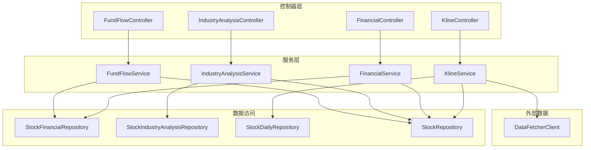
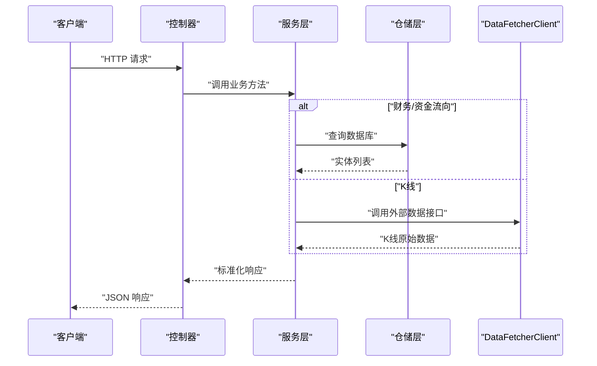
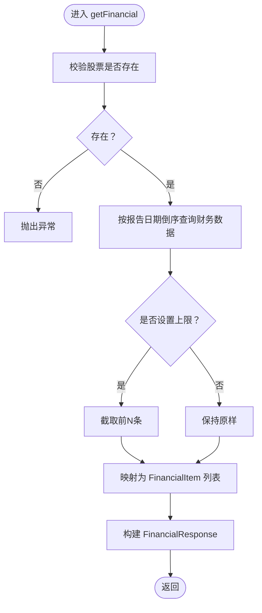
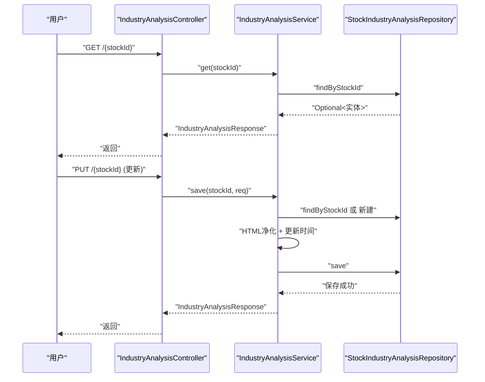
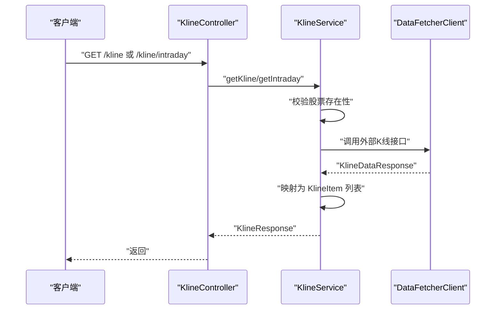
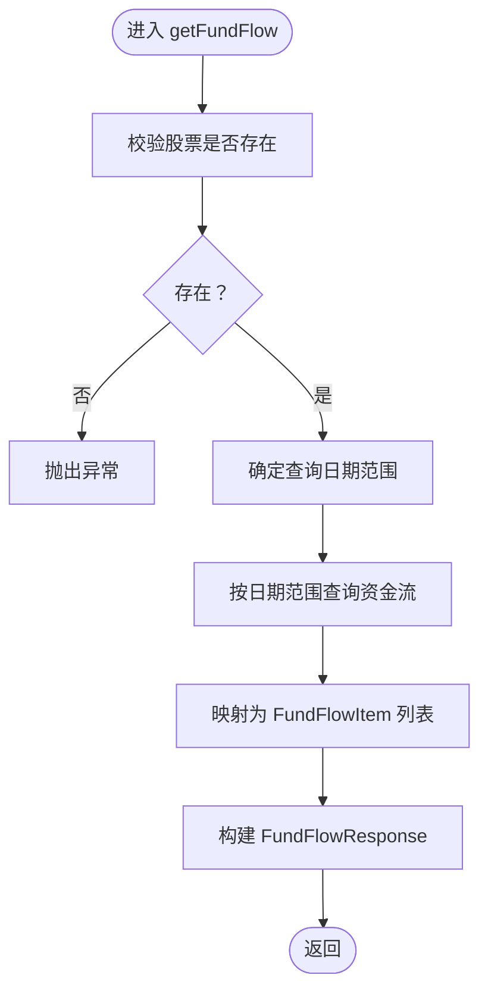
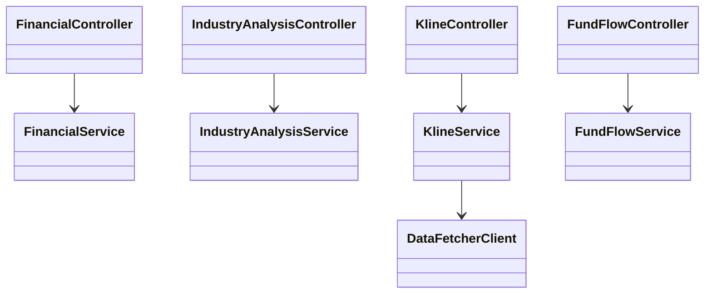

# 分析功能模块

<cite>
**本文引用的文件**
- [backend/src/main/java/com/stock/controller/FinancialController.java](file://backend/src/main/java/com/stock/controller/FinancialController.java)
- [backend/src/main/java/com/stock/controller/IndustryAnalysisController.java](file://backend/src/main/java/com/stock/controller/IndustryAnalysisController.java)
- [backend/src/main/java/com/stock/controller/KlineController.java](file://backend/src/main/java/com/stock/controller/KlineController.java)
- [backend/src/main/java/com/stock/controller/FundFlowController.java](file://backend/src/main/java/com/stock/controller/FundFlowController.java)
- [backend/src/main/java/com/stock/service/FinancialService.java](file://backend/src/main/java/com/stock/service/FinancialService.java)
- [backend/src/main/java/com/stock/service/IndustryAnalysisService.java](file://backend/src/main/java/com/stock/service/IndustryAnalysisService.java)
- [backend/src/main/java/com/stock/service/KlineService.java](file://backend/src/main/java/com/stock/service/KlineService.java)
- [backend/src/main/java/com/stock/service/FundFlowService.java](file://backend/src/main/java/com/stock/service/FundFlowService.java)
- [backend/src/main/java/com/stock/entity/StockFinancial.java](file://backend/src/main/java/com/stock/entity/StockFinancial.java)
- [backend/src/main/java/com/stock/entity/StockIndustryAnalysis.java](file://backend/src/main/java/com/stock/entity/StockIndustryAnalysis.java)
- [backend/src/main/java/com/stock/dto/fetcher/KlineDataItem.java](file://backend/src/main/java/com/stock/dto/fetcher/KlineDataItem.java)
- [backend/src/main/java/com/stock/dto/response/KlineItem.java](file://backend/src/main/java/com/stock/dto/response/KlineItem.java)
- [backend/src/main/java/com/stock/dto/response/FinancialItem.java](file://backend/src/main/java/com/stock/dto/response/FinancialItem.java)
- [backend/src/main/java/com/stock/dto/response/FundFlowItem.java](file://backend/src/main/java/com/stock/dto/response/FundFlowItem.java)
- [backend/src/main/java/com/stock/client/DataFetcherClient.java](file://backend/src/main/java/com/stock/client/DataFetcherClient.java)
</cite>

## 目录
1. [简介](#简介)
2. [项目结构](#项目结构)
3. [核心组件](#核心组件)
4. [架构总览](#架构总览)
5. [详细组件分析](#详细组件分析)
6. [依赖关系分析](#依赖关系分析)
7. [性能考虑](#性能考虑)
8. [故障排查指南](#故障排查指南)
9. [结论](#结论)
10. [附录](#附录)

## 简介
本文件面向“分析功能模块”，系统化梳理后端服务中与财务分析、行业分析、K线与资金流向分析相关的能力边界、数据来源、处理流程、接口定义与展示建议。文档同时给出数据结构说明、图表展示方案以及质量保障与精度评估要点，帮助开发者与产品人员快速理解与扩展分析能力。

## 项目结构
分析功能模块主要由以下层次构成：
- 控制器层：暴露REST接口，接收参数并返回标准化响应。
- 服务层：封装业务逻辑，协调仓储与外部数据源。
- 实体与DTO：定义持久化模型与对外传输模型。
- 客户端：统一调用数据抓取服务（data-fetcher）。

图示来源
- [backend/src/main/java/com/stock/controller/FinancialController.java:1-23](file://backend/src/main/java/com/stock/controller/FinancialController.java#L1-L23)
- [backend/src/main/java/com/stock/controller/IndustryAnalysisController.java:1-30](file://backend/src/main/java/com/stock/controller/IndustryAnalysisController.java#L1-L30)
- [backend/src/main/java/com/stock/controller/KlineController.java:1-36](file://backend/src/main/java/com/stock/controller/KlineController.java#L1-L36)
- [backend/src/main/java/com/stock/controller/FundFlowController.java:1-27](file://backend/src/main/java/com/stock/controller/FundFlowController.java#L1-L27)
- [backend/src/main/java/com/stock/service/FinancialService.java:1-45](file://backend/src/main/java/com/stock/service/FinancialService.java#L1-L45)
- [backend/src/main/java/com/stock/service/IndustryAnalysisService.java:1-61](file://backend/src/main/java/com/stock/service/IndustryAnalysisService.java#L1-L61)
- [backend/src/main/java/com/stock/service/KlineService.java:1-67](file://backend/src/main/java/com/stock/service/KlineService.java#L1-L67)
- [backend/src/main/java/com/stock/service/FundFlowService.java:1-51](file://backend/src/main/java/com/stock/service/FundFlowService.java#L1-L51)
- [backend/src/main/java/com/stock/client/DataFetcherClient.java:1-126](file://backend/src/main/java/com/stock/client/DataFetcherClient.java#L1-L126)

章节来源
- [backend/src/main/java/com/stock/controller/FinancialController.java:1-23](file://backend/src/main/java/com/stock/controller/FinancialController.java#L1-L23)
- [backend/src/main/java/com/stock/controller/IndustryAnalysisController.java:1-30](file://backend/src/main/java/com/stock/controller/IndustryAnalysisController.java#L1-L30)
- [backend/src/main/java/com/stock/controller/KlineController.java:1-36](file://backend/src/main/java/com/stock/controller/KlineController.java#L1-L36)
- [backend/src/main/java/com/stock/controller/FundFlowController.java:1-27](file://backend/src/main/java/com/stock/controller/FundFlowController.java#L1-L27)

## 核心组件
本节从“财务分析”“行业分析”“K线数据”“资金流向”四个维度，说明接口职责、数据来源、处理逻辑与输出格式。

- 财务分析
  - 接口：GET /api/v1/stocks/{stockId}/financial?limit=N
  - 数据来源：StockFinancialRepository按报告日期倒序查询；若limit>0则截断。
  - 输出：FinancialResponse，包含多个FinancialItem，字段覆盖EPS、ROE、毛利率、资产负债率等关键财务指标。
  - 展示建议：时间序列折线图或柱状图展示EPS、ROE趋势；表格对比多期财务比率。

- 行业分析
  - 接口：GET /api/v1/stocks/{stockId}/industry-analysis；PUT 更新生命周期、上下游影响、政策影响、行业趋势等。
  - 数据来源：StockIndustryAnalysisRepository按stockId读取或新建；保存时进行HTML净化。
  - 输出：IndustryAnalysisResponse，包含生命周期阶段、上下游、政策影响、行业趋势及更新时间。
  - 展示建议：富文本编辑器支持；以卡片形式呈现生命周期阶段与趋势摘要。

- K线数据
  - 接口：GET /api/v1/stocks/{stockId}/kline?period=&startDate=&endDate=&adjust=
  - 接口：GET /api/v1/stocks/{stockId}/kline/intraday?period=&date=
  - 数据来源：DataFetcherClient转发到数据抓取服务；KlineService负责映射为KlineItem。
  - 输出：KlineResponse，包含周期、复权因子与KlineItem列表。
  - 展示建议：蜡烛图（OHLC）、成交量柱状图叠加；支持日/周/月周期切换与复权调整。

- 资金流向
  - 接口：GET /api/v1/stocks/{stockId}/fund-flow?startDate=&endDate=
  - 数据来源：StockFundFlowRepository按交易日范围查询；默认近3个月。
  - 输出：FundFlowResponse，包含主力净流入/占比、大单、中单、小单等分层级资金流。
  - 展示建议：面积图或柱状图展示主力/大单资金流；叠加涨跌幅对比分析。

章节来源
- [backend/src/main/java/com/stock/controller/FinancialController.java:17-21](file://backend/src/main/java/com/stock/controller/FinancialController.java#L17-L21)
- [backend/src/main/java/com/stock/service/FinancialService.java:24-43](file://backend/src/main/java/com/stock/service/FinancialService.java#L24-L43)
- [backend/src/main/java/com/stock/dto/response/FinancialItem.java:1-22](file://backend/src/main/java/com/stock/dto/response/FinancialItem.java#L1-L22)
- [backend/src/main/java/com/stock/controller/IndustryAnalysisController.java:19-28](file://backend/src/main/java/com/stock/controller/IndustryAnalysisController.java#L19-L28)
- [backend/src/main/java/com/stock/service/IndustryAnalysisService.java:27-59](file://backend/src/main/java/com/stock/service/IndustryAnalysisService.java#L27-L59)
- [backend/src/main/java/com/stock/dto/response/IndustryAnalysisResponse.java:1-200](file://backend/src/main/java/com/stock/dto/response/IndustryAnalysisResponse.java#L1-L200)
- [backend/src/main/java/com/stock/controller/KlineController.java:20-34](file://backend/src/main/java/com/stock/controller/KlineController.java#L20-L34)
- [backend/src/main/java/com/stock/service/KlineService.java:30-59](file://backend/src/main/java/com/stock/service/KlineService.java#L30-L59)
- [backend/src/main/java/com/stock/dto/fetcher/KlineDataItem.java:1-20](file://backend/src/main/java/com/stock/dto/fetcher/KlineDataItem.java#L1-L20)
- [backend/src/main/java/com/stock/dto/response/KlineItem.java:1-18](file://backend/src/main/java/com/stock/dto/response/KlineItem.java#L1-L18)
- [backend/src/main/java/com/stock/controller/FundFlowController.java:20-25](file://backend/src/main/java/com/stock/controller/FundFlowController.java#L20-L25)
- [backend/src/main/java/com/stock/service/FundFlowService.java:25-49](file://backend/src/main/java/com/stock/service/FundFlowService.java#L25-L49)
- [backend/src/main/java/com/stock/dto/response/FundFlowItem.java:1-20](file://backend/src/main/java/com/stock/dto/response/FundFlowItem.java#L1-L20)

## 架构总览
下图展示分析功能模块在系统中的交互关系：控制器接收请求，服务层编排数据，仓储层访问数据库，客户端转发至数据抓取服务。

图示来源
- [backend/src/main/java/com/stock/controller/FinancialController.java:1-23](file://backend/src/main/java/com/stock/controller/FinancialController.java#L1-L23)
- [backend/src/main/java/com/stock/controller/KlineController.java:1-36](file://backend/src/main/java/com/stock/controller/KlineController.java#L1-L36)
- [backend/src/main/java/com/stock/controller/FundFlowController.java:1-27](file://backend/src/main/java/com/stock/controller/FundFlowController.java#L1-L27)
- [backend/src/main/java/com/stock/service/FinancialService.java:1-45](file://backend/src/main/java/com/stock/service/FinancialService.java#L1-L45)
- [backend/src/main/java/com/stock/service/KlineService.java:1-67](file://backend/src/main/java/com/stock/service/KlineService.java#L1-L67)
- [backend/src/main/java/com/stock/service/FundFlowService.java:1-51](file://backend/src/main/java/com/stock/service/FundFlowService.java#L1-L51)
- [backend/src/main/java/com/stock/client/DataFetcherClient.java:1-126](file://backend/src/main/java/com/stock/client/DataFetcherClient.java#L1-L126)

## 详细组件分析

### 财务分析组件
- 处理逻辑
  - 校验股票存在性。
  - 按报告日期倒序查询财务数据，限制条数。
  - 将实体映射为FinancialItem，构造FinancialResponse。
- 关键字段说明
  - EPS、EPS同比、BVPS、OCFPS、未分配利润、销售净利率、ROE、ROE摊薄、毛利率、资产负债率、存货周转率、速动比率、流动比率、期间费用率。
- 展示建议
  - 折线图：EPS、ROE、毛利率、销售净利率。
  - 柱状图：期间费用率、存货周转率。
  - 表格：多期对比，支持排序与筛选。

图示来源
- [backend/src/main/java/com/stock/service/FinancialService.java:24-43](file://backend/src/main/java/com/stock/service/FinancialService.java#L24-L43)
- [backend/src/main/java/com/stock/dto/response/FinancialItem.java:1-22](file://backend/src/main/java/com/stock/dto/response/FinancialItem.java#L1-L22)

章节来源
- [backend/src/main/java/com/stock/service/FinancialService.java:1-45](file://backend/src/main/java/com/stock/service/FinancialService.java#L1-L45)
- [backend/src/main/java/com/stock/entity/StockFinancial.java:1-72](file://backend/src/main/java/com/stock/entity/StockFinancial.java#L1-L72)
- [backend/src/main/java/com/stock/dto/response/FinancialItem.java:1-22](file://backend/src/main/java/com/stock/dto/response/FinancialItem.java#L1-L22)

### 行业分析组件
- 处理逻辑
  - GET：按stockId查询，不存在则返回空内容。
  - PUT：若记录不存在则新建；对输入进行HTML净化；更新时间戳；保存并返回最新结果。
- 关键字段说明
  - 生命周期阶段、上下游关系、政策影响、行业趋势、更新时间。
- 展示建议
  - 富文本卡片：生命周期阶段+趋势摘要。
  - 文本域：上下游与政策影响的结构化呈现。

图示来源
- [backend/src/main/java/com/stock/controller/IndustryAnalysisController.java:19-28](file://backend/src/main/java/com/stock/controller/IndustryAnalysisController.java#L19-L28)
- [backend/src/main/java/com/stock/service/IndustryAnalysisService.java:27-59](file://backend/src/main/java/com/stock/service/IndustryAnalysisService.java#L27-L59)
- [backend/src/main/java/com/stock/entity/StockIndustryAnalysis.java:1-44](file://backend/src/main/java/com/stock/entity/StockIndustryAnalysis.java#L1-L44)

章节来源
- [backend/src/main/java/com/stock/service/IndustryAnalysisService.java:1-61](file://backend/src/main/java/com/stock/service/IndustryAnalysisService.java#L1-L61)
- [backend/src/main/java/com/stock/entity/StockIndustryAnalysis.java:1-44](file://backend/src/main/java/com/stock/entity/StockIndustryAnalysis.java#L1-L44)

### K线数据组件
- 处理逻辑
  - 校验股票存在性。
  - 调用DataFetcherClient获取K线或分时数据。
  - 将原始KlineDataItem映射为KlineItem，构造KlineResponse。
- 参数与默认值
  - 周期period、起止日期startDate/endDate、复权adjust（日线），或date+period（分时）。
- 展示建议
  - 蜡烛图：开盘/最高/最低/收盘价。
  - 成交量：柱状图叠加。
  - 支持复权（前复权/后复权）切换与周期切换。

图示来源
- [backend/src/main/java/com/stock/controller/KlineController.java:20-34](file://backend/src/main/java/com/stock/controller/KlineController.java#L20-L34)
- [backend/src/main/java/com/stock/service/KlineService.java:30-59](file://backend/src/main/java/com/stock/service/KlineService.java#L30-L59)
- [backend/src/main/java/com/stock/dto/fetcher/KlineDataItem.java:1-20](file://backend/src/main/java/com/stock/dto/fetcher/KlineDataItem.java#L1-L20)
- [backend/src/main/java/com/stock/dto/response/KlineItem.java:1-18](file://backend/src/main/java/com/stock/dto/response/KlineItem.java#L1-L18)
- [backend/src/main/java/com/stock/client/DataFetcherClient.java:31-41](file://backend/src/main/java/com/stock/client/DataFetcherClient.java#L31-L41)

章节来源
- [backend/src/main/java/com/stock/service/KlineService.java:1-67](file://backend/src/main/java/com/stock/service/KlineService.java#L1-L67)
- [backend/src/main/java/com/stock/client/DataFetcherClient.java:1-126](file://backend/src/main/java/com/stock/client/DataFetcherClient.java#L1-L126)

### 资金流向组件
- 处理逻辑
  - 校验股票存在性。
  - 按交易日范围查询资金流数据，默认近3个月。
  - 映射为FundFlowItem，构造FundFlowResponse。
- 关键字段说明
  - 收盘价、涨跌幅、主力净流入/占比、超大单、大单、中单、小单净流入/占比。
- 展示建议
  - 面积图/柱状图：主力/大单资金流。
  - 叠加涨跌幅：观察资金流与价格走势的关系。

图示来源
- [backend/src/main/java/com/stock/service/FundFlowService.java:25-49](file://backend/src/main/java/com/stock/service/FundFlowService.java#L25-L49)
- [backend/src/main/java/com/stock/dto/response/FundFlowItem.java:1-20](file://backend/src/main/java/com/stock/dto/response/FundFlowItem.java#L1-L20)

章节来源
- [backend/src/main/java/com/stock/service/FundFlowService.java:1-51](file://backend/src/main/java/com/stock/service/FundFlowService.java#L1-L51)

## 依赖关系分析
- 控制器与服务：控制器仅负责参数绑定与响应封装，业务逻辑集中在服务层。
- 服务与仓储：服务层通过仓储访问数据库；财务与资金流向使用专用仓储，K线通过DataFetcherClient访问外部服务。
- 服务与客户端：K线服务直接依赖DataFetcherClient；财务/资金流服务依赖仓储。
- 异常处理：服务层对“股票不存在”抛出领域异常；客户端包装外部调用异常。

图示来源
- [backend/src/main/java/com/stock/controller/FinancialController.java:1-23](file://backend/src/main/java/com/stock/controller/FinancialController.java#L1-L23)
- [backend/src/main/java/com/stock/controller/IndustryAnalysisController.java:1-30](file://backend/src/main/java/com/stock/controller/IndustryAnalysisController.java#L1-L30)
- [backend/src/main/java/com/stock/controller/KlineController.java:1-36](file://backend/src/main/java/com/stock/controller/KlineController.java#L1-L36)
- [backend/src/main/java/com/stock/controller/FundFlowController.java:1-27](file://backend/src/main/java/com/stock/controller/FundFlowController.java#L1-L27)
- [backend/src/main/java/com/stock/service/FinancialService.java:1-45](file://backend/src/main/java/com/stock/service/FinancialService.java#L1-L45)
- [backend/src/main/java/com/stock/service/IndustryAnalysisService.java:1-61](file://backend/src/main/java/com/stock/service/IndustryAnalysisService.java#L1-L61)
- [backend/src/main/java/com/stock/service/KlineService.java:1-67](file://backend/src/main/java/com/stock/service/KlineService.java#L1-L67)
- [backend/src/main/java/com/stock/service/FundFlowService.java:1-51](file://backend/src/main/java/com/stock/service/FundFlowService.java#L1-L51)
- [backend/src/main/java/com/stock/client/DataFetcherClient.java:1-126](file://backend/src/main/java/com/stock/client/DataFetcherClient.java#L1-L126)

章节来源
- [backend/src/main/java/com/stock/client/DataFetcherClient.java:1-126](file://backend/src/main/java/com/stock/client/DataFetcherClient.java#L1-L126)

## 性能考虑
- 查询优化
  - 财务/资金流向：确保按stock_id与日期范围建立索引，避免全表扫描。
  - K线：优先使用外部数据源缓存；服务层做轻量映射，减少ORM开销。
- 分页与限制
  - 财务接口支持limit参数；资金流向默认近3个月范围，避免无界查询。
- 并发与事务
  - 行业分析保存使用事务，确保一致性；注意并发写入的锁竞争。
- 序列化与网络
  - DTO字段尽量扁平化；客户端统一异常包装，避免重复错误处理。

## 故障排查指南
- 常见异常
  - 股票不存在：服务层抛出StockNotFoundException；控制器返回404。
  - 外部数据为空：DataFetcherClient包装为DataFetchException。
- 排查步骤
  - 核对stockId与数据库记录；确认外部数据服务可用与URL配置正确。
  - 检查日期范围与默认值逻辑；验证DTO映射字段是否一致。
- 日志与监控
  - 记录请求参数与响应大小；对异常调用进行告警。

章节来源
- [backend/src/main/java/com/stock/service/FinancialService.java:24-27](file://backend/src/main/java/com/stock/service/FinancialService.java#L24-L27)
- [backend/src/main/java/com/stock/service/FundFlowService.java:25-28](file://backend/src/main/java/com/stock/service/FundFlowService.java#L25-L28)
- [backend/src/main/java/com/stock/service/KlineService.java:30-32](file://backend/src/main/java/com/stock/service/KlineService.java#L30-L32)
- [backend/src/main/java/com/stock/client/DataFetcherClient.java:112-124](file://backend/src/main/java/com/stock/client/DataFetcherClient.java#L112-L124)

## 结论
分析功能模块以清晰的分层设计实现了财务、行业、K线与资金流向的核心分析能力。通过标准化的DTO与统一的外部数据客户端，系统具备良好的可扩展性与可维护性。建议后续在指标体系完善、图表渲染与实时数据接入方面持续迭代。

## 附录

### 数据结构说明（摘要）
- 财务数据项（FinancialItem）
  - 报告日期、EPS、EPS同比、BVPS、OCFPS、未分配利润、销售净利率、ROE、ROE摊薄、毛利率、资产负债率、存货周转率、速动比率、流动比率、期间费用率。
- 行业分析（IndustryAnalysisResponse）
  - 生命周期阶段、上下游关系、政策影响、行业趋势、更新时间。
- K线数据项（KlineItem）
  - 日期、开盘、收盘、最高、最低、成交量、成交额、振幅、涨跌幅、涨跌额、换手率。
- 资金流向（FundFlowItem）
  - 日期、收盘价、涨跌幅、主力净流入/占比、超大单、大单、中单、小单净流入/占比。

章节来源
- [backend/src/main/java/com/stock/dto/response/FinancialItem.java:1-22](file://backend/src/main/java/com/stock/dto/response/FinancialItem.java#L1-L22)
- [backend/src/main/java/com/stock/dto/response/IndustryAnalysisResponse.java:1-200](file://backend/src/main/java/com/stock/dto/response/IndustryAnalysisResponse.java#L1-L200)
- [backend/src/main/java/com/stock/dto/response/KlineItem.java:1-18](file://backend/src/main/java/com/stock/dto/response/KlineItem.java#L1-L18)
- [backend/src/main/java/com/stock/dto/response/FundFlowItem.java:1-20](file://backend/src/main/java/com/stock/dto/response/FundFlowItem.java#L1-L20)