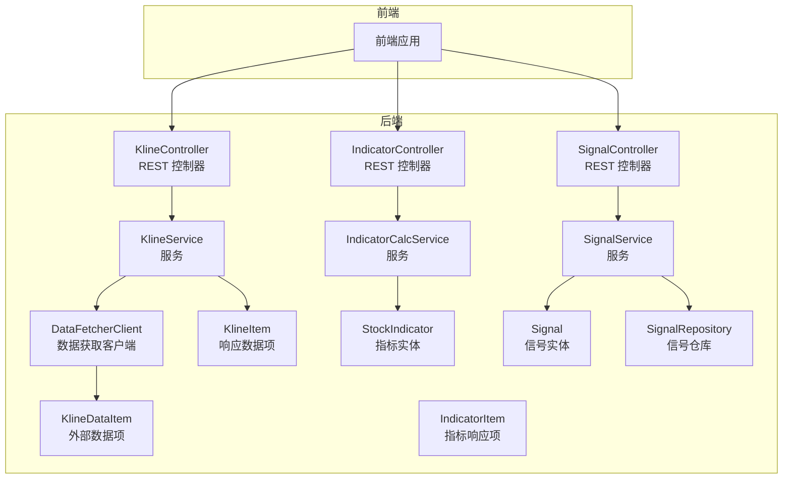
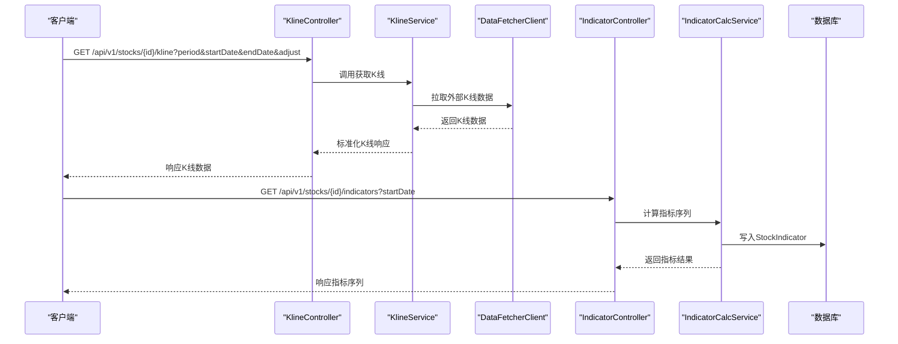
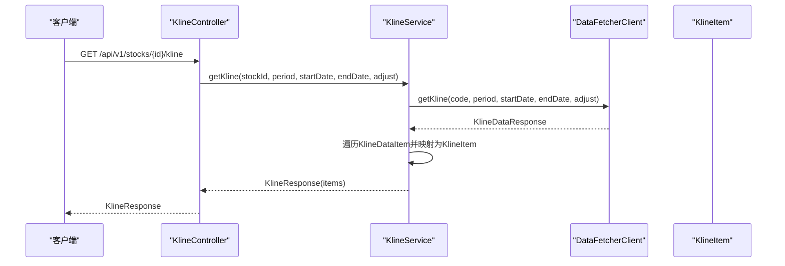
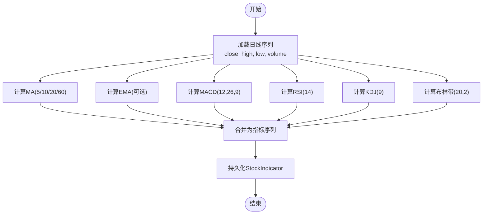
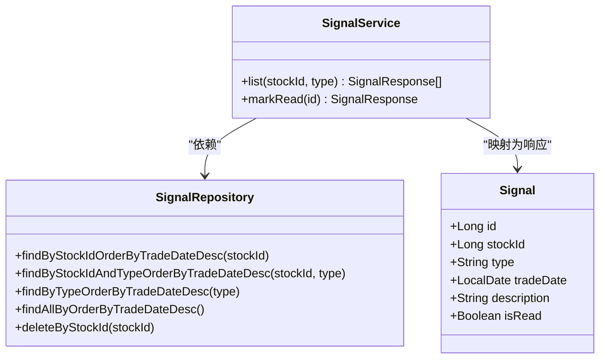
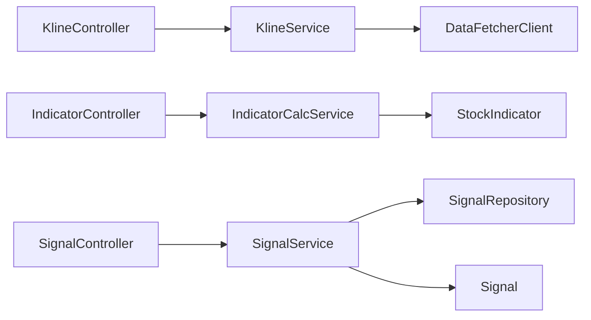

# 技术分析

<cite>
**本文引用的文件**
- [DataFetcherClient.java](file://backend/src/main/java/com/stock/client/DataFetcherClient.java)
- [KlineController.java](file://backend/src/main/java/com/stock/controller/KlineController.java)
- [KlineService.java](file://backend/src/main/java/com/stock/service/KlineService.java)
- [KlineDataItem.java](file://backend/src/main/java/com/stock/dto/fetcher/KlineDataItem.java)
- [KlineItem.java](file://backend/src/main/java/com/stock/dto/response/KlineItem.java)
- [IndicatorController.java](file://backend/src/main/java/com/stock/controller/IndicatorController.java)
- [IndicatorCalcService.java](file://backend/src/main/java/com/stock/service/IndicatorCalcService.java)
- [IndicatorItem.java](file://backend/src/main/java/com/stock/dto/response/IndicatorItem.java)
- [StockIndicator.java](file://backend/src/main/java/com/stock/entity/StockIndicator.java)
- [SignalController.java](file://backend/src/main/java/com/stock/controller/SignalController.java)
- [SignalService.java](file://backend/src/main/java/com/stock/service/SignalService.java)
- [Signal.java](file://backend/src/main/java/com/stock/entity/Signal.java)
- [SignalRepository.java](file://backend/src/main/java/com/stock/repository/SignalRepository.java)
- [IndicatorCalcServiceTest.java](file://backend/src/test/java/com/stock/service/IndicatorCalcServiceTest.java)
</cite>

## 目录
1. [简介](#简介)
2. [项目结构](#项目结构)
3. [核心组件](#核心组件)
4. [架构总览](#架构总览)
5. [详细组件分析](#详细组件分析)
6. [依赖分析](#依赖分析)
7. [性能考虑](#性能考虑)
8. [故障排查指南](#故障排查指南)
9. [结论](#结论)
10. [附录](#附录)

## 简介
本文件面向技术分析功能，系统化阐述K线数据获取与标准化、技术指标计算（MA、EMA、MACD、KDJ、RSI、布林带）的实现细节与参数配置，并给出买卖信号生成、过滤与确认机制、图表绘制建议、历史回测方法与性能评估指标，以及有效性验证与持续优化策略。文档以后端Java服务为核心，结合数据获取客户端、控制器与服务层，确保读者从接口到算法再到数据库模型的全链路理解。

## 项目结构
后端采用Spring Boot分层架构：控制器负责HTTP请求映射与参数解析；服务层封装业务逻辑；数据访问层通过JPA仓库持久化；客户端封装外部数据源调用。技术分析相关模块包括：
- K线数据：控制器接收请求，服务层调用数据获取客户端，返回标准化K线响应DTO
- 指标计算：服务层聚合日线数据，计算多指标序列，写入指标实体并持久化
- 信号管理：控制器与服务层提供信号查询与标记已读能力

**图示来源**
- [KlineController.java:10-35](file://backend/src/main/java/com/stock/controller/KlineController.java#L10-L35)
- [IndicatorController.java:15-47](file://backend/src/main/java/com/stock/controller/IndicatorController.java#L15-L47)
- [SignalController.java:9-29](file://backend/src/main/java/com/stock/controller/SignalController.java#L9-L29)
- [KlineService.java:17-66](file://backend/src/main/java/com/stock/service/KlineService.java#L17-L66)
- [IndicatorCalcService.java:12-64](file://backend/src/main/java/com/stock/service/IndicatorCalcService.java#L12-L64)
- [SignalService.java:12-50](file://backend/src/main/java/com/stock/service/SignalService.java#L12-L50)
- [DataFetcherClient.java:14-125](file://backend/src/main/java/com/stock/client/DataFetcherClient.java#L14-L125)
- [KlineDataItem.java:6-19](file://backend/src/main/java/com/stock/dto/fetcher/KlineDataItem.java#L6-L19)
- [KlineItem.java:5-17](file://backend/src/main/java/com/stock/dto/response/KlineItem.java#L5-L17)
- [IndicatorItem.java:5-21](file://backend/src/main/java/com/stock/dto/response/IndicatorItem.java#L5-L21)
- [StockIndicator.java:14-71](file://backend/src/main/java/com/stock/entity/StockIndicator.java#L14-L71)
- [Signal.java:14-35](file://backend/src/main/java/com/stock/entity/Signal.java#L14-L35)
- [SignalRepository.java:9-20](file://backend/src/main/java/com/stock/repository/SignalRepository.java#L9-L20)

**章节来源**
- [KlineController.java:10-35](file://backend/src/main/java/com/stock/controller/KlineController.java#L10-L35)
- [IndicatorController.java:15-47](file://backend/src/main/java/com/stock/controller/IndicatorController.java#L15-L47)
- [SignalController.java:9-29](file://backend/src/main/java/com/stock/controller/SignalController.java#L9-L29)
- [KlineService.java:17-66](file://backend/src/main/java/com/stock/service/KlineService.java#L17-L66)
- [IndicatorCalcService.java:12-64](file://backend/src/main/java/com/stock/service/IndicatorCalcService.java#L12-L64)
- [SignalService.java:12-50](file://backend/src/main/java/com/stock/service/SignalService.java#L12-L50)
- [DataFetcherClient.java:14-125](file://backend/src/main/java/com/stock/client/DataFetcherClient.java#L14-L125)

## 核心组件
- 数据获取客户端：封装对外数据源的HTTP调用，统一异常处理，支持日K、分时、行情等接口
- K线服务：根据股票ID与周期参数拉取K线，进行数据项映射与标准化响应
- 指标计算服务：基于日线序列批量计算MA/EMA、MACD、RSI、KDJ、布林带，输出指标序列并持久化
- 信号服务：提供信号列表查询与标记已读，支撑后续信号过滤与确认

**章节来源**
- [DataFetcherClient.java:14-125](file://backend/src/main/java/com/stock/client/DataFetcherClient.java#L14-L125)
- [KlineService.java:17-66](file://backend/src/main/java/com/stock/service/KlineService.java#L17-L66)
- [IndicatorCalcService.java:12-64](file://backend/src/main/java/com/stock/service/IndicatorCalcService.java#L12-L64)
- [SignalService.java:12-50](file://backend/src/main/java/com/stock/service/SignalService.java#L12-L50)

## 架构总览
下图展示从请求到指标入库的关键交互路径，涵盖K线获取、指标计算与存储。

**图示来源**
- [KlineController.java:20-27](file://backend/src/main/java/com/stock/controller/KlineController.java#L20-L27)
- [KlineService.java:30-44](file://backend/src/main/java/com/stock/service/KlineService.java#L30-L44)
- [DataFetcherClient.java:31-35](file://backend/src/main/java/com/stock/client/DataFetcherClient.java#L31-L35)
- [IndicatorController.java:27-46](file://backend/src/main/java/com/stock/controller/IndicatorController.java#L27-L46)
- [IndicatorCalcService.java:15-64](file://backend/src/main/java/com/stock/service/IndicatorCalcService.java#L15-L64)

## 详细组件分析

### K线数据获取与标准化
- 接口职责：控制器接收周期、日期范围与复权方式，服务层调用数据获取客户端，将外部K线数据映射为内部响应项
- 参数与默认值：周期默认“日线”，起止日期默认近一年，复权默认前复权
- 映射规则：日期、开盘价、收盘价、最高价、最低价、成交量、成交额、振幅、涨跌幅、涨跌额、换手率

**图示来源**
- [KlineController.java:20-27](file://backend/src/main/java/com/stock/controller/KlineController.java#L20-L27)
- [KlineService.java:30-44](file://backend/src/main/java/com/stock/service/KlineService.java#L30-L44)
- [DataFetcherClient.java:31-35](file://backend/src/main/java/com/stock/client/DataFetcherClient.java#L31-L35)
- [KlineDataItem.java:6-19](file://backend/src/main/java/com/stock/dto/fetcher/KlineDataItem.java#L6-L19)
- [KlineItem.java:5-17](file://backend/src/main/java/com/stock/dto/response/KlineItem.java#L5-L17)

**章节来源**
- [KlineController.java:20-27](file://backend/src/main/java/com/stock/controller/KlineController.java#L20-L27)
- [KlineService.java:30-44](file://backend/src/main/java/com/stock/service/KlineService.java#L30-L44)
- [DataFetcherClient.java:31-35](file://backend/src/main/java/com/stock/client/DataFetcherClient.java#L31-L35)
- [KlineDataItem.java:6-19](file://backend/src/main/java/com/stock/dto/fetcher/KlineDataItem.java#L6-L19)
- [KlineItem.java:5-17](file://backend/src/main/java/com/stock/dto/response/KlineItem.java#L5-L17)

### 技术指标计算与参数配置
- 输入：按交易日排序的日线序列（开盘、最高、最低、收盘、成交量）
- 输出：指标序列（MA5/10/20/60、MACD、信号线、柱状、RSI、KDJ、布林带上中下轨）
- 计算要点与参数：
  - MA：简单移动平均，窗口长度分别为5、10、20、60
  - EMA：指数移动平均（在当前实现中未直接使用EMA，但可扩展）
  - MACD：短期EMA(12)、长期EMA(26)、信号线EMA(9)，柱状=差离值-信号线
  - RSI：平滑RS，周期14，初始平滑值按前14日均值处理
  - KDJ：周期9，K与D采用平滑权重2/3，窗口内高低价极值
  - 布林带：中轨MA(20)，标准差2倍，窗口20

**图示来源**
- [IndicatorCalcService.java:15-64](file://backend/src/main/java/com/stock/service/IndicatorCalcService.java#L15-L64)
- [IndicatorCalcService.java:66-80](file://backend/src/main/java/com/stock/service/IndicatorCalcService.java#L66-L80)
- [IndicatorCalcService.java:82-108](file://backend/src/main/java/com/stock/service/IndicatorCalcService.java#L82-L108)
- [IndicatorCalcService.java:110-144](file://backend/src/main/java/com/stock/service/IndicatorCalcService.java#L110-L144)
- [IndicatorCalcService.java:146-175](file://backend/src/main/java/com/stock/service/IndicatorCalcService.java#L146-L175)
- [IndicatorCalcService.java:177-204](file://backend/src/main/java/com/stock/service/IndicatorCalcService.java#L177-L204)

**章节来源**
- [IndicatorCalcService.java:15-64](file://backend/src/main/java/com/stock/service/IndicatorCalcService.java#L15-L64)
- [IndicatorCalcService.java:66-80](file://backend/src/main/java/com/stock/service/IndicatorCalcService.java#L66-L80)
- [IndicatorCalcService.java:82-108](file://backend/src/main/java/com/stock/service/IndicatorCalcService.java#L82-L108)
- [IndicatorCalcService.java:110-144](file://backend/src/main/java/com/stock/service/IndicatorCalcService.java#L110-L144)
- [IndicatorCalcService.java:146-175](file://backend/src/main/java/com/stock/service/IndicatorCalcService.java#L146-L175)
- [IndicatorCalcService.java:177-204](file://backend/src/main/java/com/stock/service/IndicatorCalcService.java#L177-L204)

### 买卖信号生成、过滤与确认
- 信号来源：由指标序列与规则引擎共同生成（当前仓库未包含规则引擎实现，可在Signal实体基础上扩展）
- 信号字段：类型、交易日期、描述、是否已读
- 查询与管理：支持按股票与类型过滤，支持标记已读
- 过滤与确认建议：
  - 多指标共振：例如MACD金叉+RSI低位+布林中轨上穿
  - 时间窗口确认：连续N日满足条件
  - 成交量配合：放量突破或缩量回调
  - 回撤幅度：入场后设定最大回撤阈值

**图示来源**
- [Signal.java:14-35](file://backend/src/main/java/com/stock/entity/Signal.java#L14-L35)
- [SignalService.java:12-50](file://backend/src/main/java/com/stock/service/SignalService.java#L12-L50)
- [SignalRepository.java:9-20](file://backend/src/main/java/com/stock/repository/SignalRepository.java#L9-L20)

**章节来源**
- [SignalController.java:19-28](file://backend/src/main/java/com/stock/controller/SignalController.java#L19-L28)
- [SignalService.java:21-43](file://backend/src/main/java/com/stock/service/SignalService.java#L21-L43)
- [Signal.java:14-35](file://backend/src/main/java/com/stock/entity/Signal.java#L14-L35)
- [SignalRepository.java:9-20](file://backend/src/main/java/com/stock/repository/SignalRepository.java#L9-L20)

### 技术分析图表绘制方案
- X轴：交易日期（按时间升序）
- Y轴：价格序列（K线）与指标叠加（MACD柱状、RSI、KDJ、布林带）
- 绘制建议：
  - 使用Canvas/SVG或专业库（如ECharts/Chart.js）渲染
  - 支持双轴：左侧价格，右侧MACD/RSI
  - 标注买卖点位：金叉死叉、超买超卖、突破位置

### 历史回测方法与性能评估
- 回测框架：
  - 按交易日滚动：每日基于历史数据生成信号
  - 交易成本：手续费、滑点、最大回撤
  - 资产曲线：净值曲线、区间收益、年化收益、波动率
- 评估指标：
  - 收益率、夏普比率、胜率、盈亏比、最大回撤、卡玛比率
  - 分阶段评估：牛市/熊市/震荡市分别验证

### 有效性验证与持续优化
- 单指标有效性检验：对每个指标在不同周期下的胜率与收益分布进行统计
- 多因子组合：逐步加入过滤条件，观察指标稳定性与收益提升
- 在线学习：引入增量更新与自适应参数调整（EMA平滑系数、RSI周期等）

## 依赖分析
- 控制器依赖服务：KlineController依赖KlineService；IndicatorController依赖指标计算服务；SignalController依赖SignalService
- 服务依赖数据源：KlineService依赖DataFetcherClient；IndicatorCalcService依赖StockDaily数据；SignalService依赖SignalRepository
- 实体与仓库：StockIndicator与Signal实体分别对应指标与信号的持久化

**图示来源**
- [KlineController.java:14-18](file://backend/src/main/java/com/stock/controller/KlineController.java#L14-L18)
- [IndicatorController.java:19-24](file://backend/src/main/java/com/stock/controller/IndicatorController.java#L19-L24)
- [SignalController.java:13-17](file://backend/src/main/java/com/stock/controller/SignalController.java#L13-L17)
- [KlineService.java:20-28](file://backend/src/main/java/com/stock/service/KlineService.java#L20-L28)
- [IndicatorCalcService.java:12-13](file://backend/src/main/java/com/stock/service/IndicatorCalcService.java#L12-L13)
- [SignalService.java:15-19](file://backend/src/main/java/com/stock/service/SignalService.java#L15-L19)
- [DataFetcherClient.java:14-24](file://backend/src/main/java/com/stock/client/DataFetcherClient.java#L14-L24)
- [SignalRepository.java:9-20](file://backend/src/main/java/com/stock/repository/SignalRepository.java#L9-L20)
- [StockIndicator.java:14-71](file://backend/src/main/java/com/stock/entity/StockIndicator.java#L14-L71)
- [Signal.java:14-35](file://backend/src/main/java/com/stock/entity/Signal.java#L14-L35)

**章节来源**
- [KlineController.java:14-18](file://backend/src/main/java/com/stock/controller/KlineController.java#L14-L18)
- [IndicatorController.java:19-24](file://backend/src/main/java/com/stock/controller/IndicatorController.java#L19-L24)
- [SignalController.java:13-17](file://backend/src/main/java/com/stock/controller/SignalController.java#L13-L17)
- [KlineService.java:20-28](file://backend/src/main/java/com/stock/service/KlineService.java#L20-L28)
- [IndicatorCalcService.java:12-13](file://backend/src/main/java/com/stock/service/IndicatorCalcService.java#L12-L13)
- [SignalService.java:15-19](file://backend/src/main/java/com/stock/service/SignalService.java#L15-L19)
- [DataFetcherClient.java:14-24](file://backend/src/main/java/com/stock/client/DataFetcherClient.java#L14-L24)
- [SignalRepository.java:9-20](file://backend/src/main/java/com/stock/repository/SignalRepository.java#L9-L20)
- [StockIndicator.java:14-71](file://backend/src/main/java/com/stock/entity/StockIndicator.java#L14-L71)
- [Signal.java:14-35](file://backend/src/main/java/com/stock/entity/Signal.java#L14-L35)

## 性能考虑
- 批量计算：将日线数组转为原生数组，减少装箱开销，提高循环效率
- 平滑参数：EMA/RSI/KDJ平滑权重与周期需平衡灵敏度与噪声
- 存储与索引：StockIndicator按stock_id与trade_date建立唯一索引，加速查询
- 缓存策略：高频查询的指标序列可缓存于内存，结合失效策略
- 异步与批处理：大规模回测可拆分为任务队列，分批执行

## 故障排查指南
- 数据为空：检查外部数据源URL配置、参数拼接与时间范围
- 计算异常：核对输入序列长度、空值处理与精度设置
- 信号缺失：确认信号表是否存在记录、查询条件是否正确
- 异常处理：统一捕获外部调用异常并转换为业务异常

**章节来源**
- [DataFetcherClient.java:112-124](file://backend/src/main/java/com/stock/client/DataFetcherClient.java#L112-L124)
- [KlineService.java:31-32](file://backend/src/main/java/com/stock/service/KlineService.java#L31-L32)
- [SignalService.java:37-42](file://backend/src/main/java/com/stock/service/SignalService.java#L37-L42)

## 结论
本系统提供了完整的K线数据获取与标准化、多技术指标计算与持久化、信号查询与管理能力。通过明确的参数配置、稳健的算法实现与清晰的依赖关系，能够支撑进一步的信号规则引擎集成、可视化图表与历史回测平台建设。建议在现有基础上扩展规则引擎与回测框架，持续优化指标参数与过滤策略，以提升策略有效性与鲁棒性。

## 附录

### 指标计算函数与参数速查
- MA(n)：窗口n，缺省前n-1个值为空
- EMA(p)：可选扩展，平滑系数α=2/(p+1)
- MACD(p,s,a)：p=12, s=26, a=9；差离值=EMA(p)-EMA(s)，信号线=EMA(a)，柱状=差离值-信号线
- RSI(p)：周期p=14，初始平滑按前p日均值
- KDJ(n)：n=9，K/D平滑权重2/3，窗口内高低价极值
- 布林带(n,m)：n=20，m=2，中轨MA(n)，上下轨=中轨±m×标准差

**章节来源**
- [IndicatorCalcService.java:66-80](file://backend/src/main/java/com/stock/service/IndicatorCalcService.java#L66-L80)
- [IndicatorCalcService.java:82-108](file://backend/src/main/java/com/stock/service/IndicatorCalcService.java#L82-L108)
- [IndicatorCalcService.java:110-144](file://backend/src/main/java/com/stock/service/IndicatorCalcService.java#L110-L144)
- [IndicatorCalcService.java:146-175](file://backend/src/main/java/com/stock/service/IndicatorCalcService.java#L146-L175)
- [IndicatorCalcService.java:177-204](file://backend/src/main/java/com/stock/service/IndicatorCalcService.java#L177-L204)

### 测试用例要点
- 输入为空：返回空指标列表
- 数据充足：覆盖MA可用起始点、布林带可用起始点
- MA准确性：验证MA5在第n个窗口非空且为正值

**章节来源**
- [IndicatorCalcServiceTest.java:41-80](file://backend/src/test/java/com/stock/service/IndicatorCalcServiceTest.java#L41-L80)