# 行业分析

<cite>
**本文引用的文件**
- [IndustryAnalysisController.java](file://backend/src/main/java/com/stock/controller/IndustryAnalysisController.java)
- [IndustryAnalysisService.java](file://backend/src/main/java/com/stock/service/IndustryAnalysisService.java)
- [IndustryAnalysisRequest.java](file://backend/src/main/java/com/stock/dto/request/IndustryAnalysisRequest.java)
- [IndustryAnalysisResponse.java](file://backend/src/main/java/com/stock/dto/response/IndustryAnalysisResponse.java)
- [StockIndustryAnalysis.java](file://backend/src/main/java/com/stock/entity/StockIndustryAnalysis.java)
- [StockIndustryAnalysisRepository.java](file://backend/src/main/java/com/stock/repository/StockIndustryAnalysisRepository.java)
- [DataFetcherClient.java](file://backend/src/main/java/com/stock/client/DataFetcherClient.java)
- [industry.py](file://data-fetcher/routers/industry.py)
- [IndustryTab.vue](file://frontend/src/views/tabs/IndustryTab.vue)
- [manual.ts](file://frontend/src/api/manual.ts)
- [IndustryAnalysisServiceTest.java](file://backend/src/test/java/com/stock/service/IndustryAnalysisServiceTest.java)
- [SKILL.md](file://system-planner/SKILL.md)
- [high-level-design.md](file://system-planner/high-level-design.md)
- [ReportExportService.java](file://backend/src/main/java/com/stock/service/ReportExportService.java)
</cite>

## 目录
1. [简介](#简介)
2. [项目结构](#项目结构)
3. [核心组件](#核心组件)
4. [架构总览](#架构总览)
5. [详细组件分析](#详细组件分析)
6. [依赖分析](#依赖分析)
7. [性能考虑](#性能考虑)
8. [故障排查指南](#故障排查指南)
9. [结论](#结论)
10. [附录](#附录)

## 简介
本文件围绕“行业分析”功能进行全面技术文档化，涵盖行业分类体系、行业对比分析算法、行业动态监测机制、景气度指数计算、行业轮动分析模型、同行业公司对比方法、行业数据获取与处理流程、分类标准与权重分配机制、趋势预测算法、结果可视化与报告生成、投资建议生成逻辑，以及准确性评估与持续优化策略。当前系统采用“自动+手动混合”的行业分析模式：自动获取行业识别与行业板块行情，手动补充生命周期、上下游关系、政策影响、行业趋势与行业估值中位数等信息。

## 项目结构
行业分析功能涉及后端控制器、服务层、数据传输对象、实体与仓储、数据获取客户端、数据抓取器路由、前端视图与API封装，以及系统规划文档与测试用例。下图给出与行业分析相关的核心文件与交互关系：

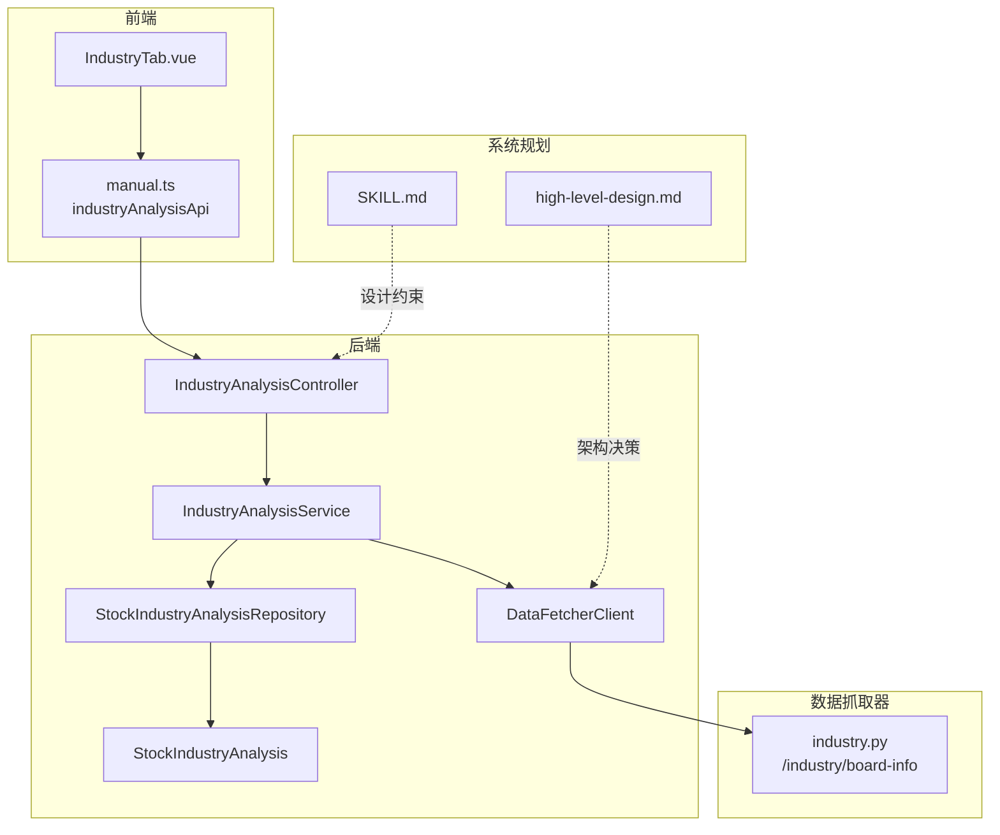

**图表来源**
- [IndustryAnalysisController.java:1-30](file://backend/src/main/java/com/stock/controller/IndustryAnalysisController.java#L1-L30)
- [IndustryAnalysisService.java:1-61](file://backend/src/main/java/com/stock/service/IndustryAnalysisService.java#L1-L61)
- [StockIndustryAnalysisRepository.java:1-13](file://backend/src/main/java/com/stock/repository/StockIndustryAnalysisRepository.java#L1-L13)
- [StockIndustryAnalysis.java:1-44](file://backend/src/main/java/com/stock/entity/StockIndustryAnalysis.java#L1-L44)
- [DataFetcherClient.java:1-126](file://backend/src/main/java/com/stock/client/DataFetcherClient.java#L1-L126)
- [industry.py:1-59](file://data-fetcher/routers/industry.py#L1-L59)
- [IndustryTab.vue:1-81](file://frontend/src/views/tabs/IndustryTab.vue#L1-L81)
- [manual.ts:132-135](file://frontend/src/api/manual.ts#L132-L135)
- [SKILL.md:130-144](file://system-planner/SKILL.md#L130-L144)
- [high-level-design.md:419-426](file://system-planner/high-level-design.md#L419-L426)

**章节来源**
- [IndustryAnalysisController.java:1-30](file://backend/src/main/java/com/stock/controller/IndustryAnalysisController.java#L1-L30)
- [IndustryAnalysisService.java:1-61](file://backend/src/main/java/com/stock/service/IndustryAnalysisService.java#L1-L61)
- [StockIndustryAnalysisRepository.java:1-13](file://backend/src/main/java/com/stock/repository/StockIndustryAnalysisRepository.java#L1-L13)
- [StockIndustryAnalysis.java:1-44](file://backend/src/main/java/com/stock/entity/StockIndustryAnalysis.java#L1-L44)
- [DataFetcherClient.java:1-126](file://backend/src/main/java/com/stock/client/DataFetcherClient.java#L1-L126)
- [industry.py:1-59](file://data-fetcher/routers/industry.py#L1-L59)
- [IndustryTab.vue:1-81](file://frontend/src/views/tabs/IndustryTab.vue#L1-L81)
- [manual.ts:132-135](file://frontend/src/api/manual.ts#L132-L135)
- [SKILL.md:130-144](file://system-planner/SKILL.md#L130-L144)
- [high-level-design.md:419-426](file://system-planner/high-level-design.md#L419-L426)

## 核心组件
- 控制器：提供REST接口，暴露行业分析的查询与保存能力，路径为“/api/v1/stocks/{stockId}/industry-analysis”，GET用于读取，PUT用于保存。
- 服务层：校验股票存在性，加载或创建行业分析实体，持久化并返回响应；同时对富文本字段进行安全净化。
- DTO：请求体包含生命周期阶段、上下游分析、政策影响、行业趋势；响应体包含上述字段与更新时间。
- 实体与仓储：以stock_id唯一约束存储行业分析记录，支持按stockId查询。
- 数据抓取客户端：封装对数据抓取器的调用，包括行业板块行情接口。
- 数据抓取器路由：提供行业板块行情查询，返回最新价、涨跌幅、主力净流入、换手率等。
- 前端组件：提供生命周期阶段选择、富文本输入框、保存按钮与更新时间展示，并通过API封装调用后端。

**章节来源**
- [IndustryAnalysisController.java:19-28](file://backend/src/main/java/com/stock/controller/IndustryAnalysisController.java#L19-L28)
- [IndustryAnalysisService.java:27-59](file://backend/src/main/java/com/stock/service/IndustryAnalysisService.java#L27-L59)
- [IndustryAnalysisRequest.java:6-11](file://backend/src/main/java/com/stock/dto/request/IndustryAnalysisRequest.java#L6-L11)
- [IndustryAnalysisResponse.java:5-12](file://backend/src/main/java/com/stock/dto/response/IndustryAnalysisResponse.java#L5-L12)
- [StockIndustryAnalysis.java:14-42](file://backend/src/main/java/com/stock/entity/StockIndustryAnalysis.java#L14-L42)
- [StockIndustryAnalysisRepository.java:11-11](file://backend/src/main/java/com/stock/repository/StockIndustryAnalysisRepository.java#L11-L11)
- [DataFetcherClient.java:101-105](file://backend/src/main/java/com/stock/client/DataFetcherClient.java#L101-L105)
- [industry.py:9-38](file://data-fetcher/routers/industry.py#L9-L38)
- [IndustryTab.vue:6-28](file://frontend/src/views/tabs/IndustryTab.vue#L6-L28)
- [manual.ts:132-135](file://frontend/src/api/manual.ts#L132-L135)

## 架构总览
行业分析的端到端流程如下：
- 前端用户在行业分析标签页填写生命周期阶段与富文本分析，点击保存。
- 前端通过API封装调用后端PUT接口。
- 控制器将请求转发给服务层，服务层校验股票存在性，加载或创建行业分析实体，写入数据库并返回响应。
- 后端可通过数据抓取客户端调用数据抓取器的行业板块行情接口，获取行业整体涨跌趋势、主力资金流向等辅助信息，用于动态监测与趋势判断。

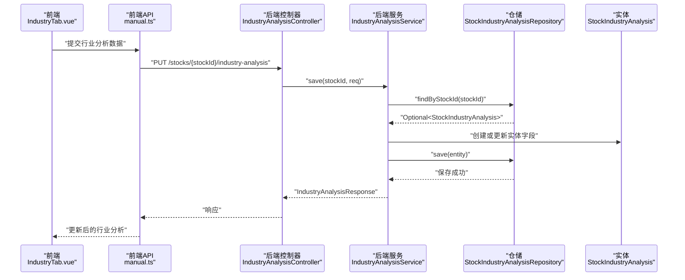

**图表来源**
- [IndustryAnalysisController.java:24-28](file://backend/src/main/java/com/stock/controller/IndustryAnalysisController.java#L24-L28)
- [IndustryAnalysisService.java:37-59](file://backend/src/main/java/com/stock/service/IndustryAnalysisService.java#L37-L59)
- [StockIndustryAnalysisRepository.java:11-11](file://backend/src/main/java/com/stock/repository/StockIndustryAnalysisRepository.java#L11-L11)
- [StockIndustryAnalysis.java:23-42](file://backend/src/main/java/com/stock/entity/StockIndustryAnalysis.java#L23-L42)
- [IndustryTab.vue:63-79](file://frontend/src/views/tabs/IndustryTab.vue#L63-L79)
- [manual.ts:132-135](file://frontend/src/api/manual.ts#L132-L135)

## 详细组件分析

### 行业分类体系
- 行业识别：系统通过利润表接口返回的行业名称（如“白酒Ⅱ”）进行行业识别，作为后续行业分析的基础。
- 行业板块行情：通过行业板块行情接口获取行业整体涨跌趋势、主力资金流向、换手率等，用于动态监测与景气度判断。
- 行业生命周期：用户在前端选择生命周期阶段（导入期/成长期/成熟期/衰退期），作为行业所处阶段的主观判断依据。

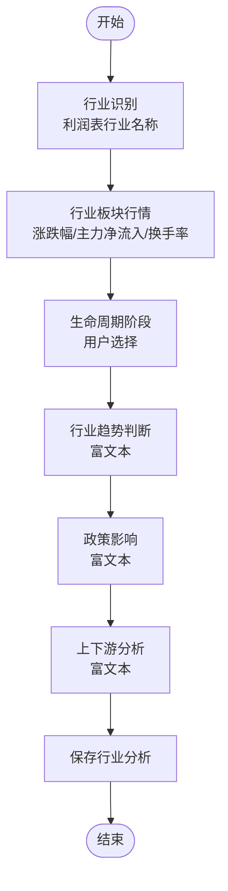

**图表来源**
- [SKILL.md:132-144](file://system-planner/SKILL.md#L132-L144)
- [industry.py:9-38](file://data-fetcher/routers/industry.py#L9-L38)
- [IndustryTab.vue:6-28](file://frontend/src/views/tabs/IndustryTab.vue#L6-L28)

**章节来源**
- [SKILL.md:132-144](file://system-planner/SKILL.md#L132-L144)
- [industry.py:9-38](file://data-fetcher/routers/industry.py#L9-L38)
- [IndustryTab.vue:6-28](file://frontend/src/views/tabs/IndustryTab.vue#L6-L28)

### 行业对比分析算法
- 同行业公司对比：系统支持手动添加竞品股票，通过竞品列表获取竞品的行情与财务数据，进行PE/PB/ROE等指标对比，形成竞争力分析。
- 对比维度：估值水平（PE/PB/PS与行业平均对比）、盈利能力（ROE/净利率与同行对比）、市值排位（在同行业中的相对位置）。
- 注意：当前系统未提供自动的行业估值中位数，需用户手动录入PE/PB中位数。

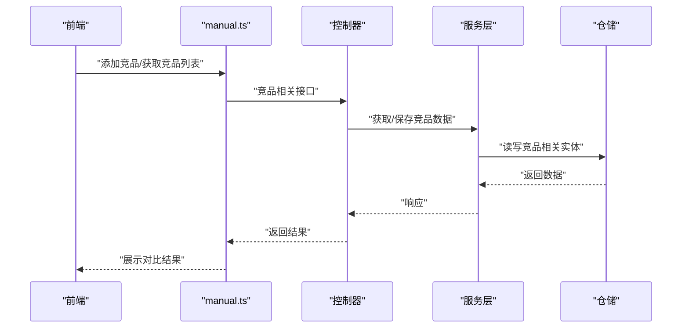

**图表来源**
- [SKILL.md:166-171](file://system-planner/SKILL.md#L166-L171)
- [high-level-design.md:419-426](file://system-planner/high-level-design.md#L419-L426)

**章节来源**
- [SKILL.md:166-171](file://system-planner/SKILL.md#L166-L171)
- [high-level-design.md:419-426](file://system-planner/high-level-design.md#L419-L426)

### 行业动态监测机制
- 行业板块行情接口：定期调用数据抓取器的行业板块行情接口，获取最新价、涨跌幅、主力净流入、换手率等，用于监测行业景气度与资金流向变化。
- 动态更新：前端展示上次更新时间，服务层在保存时更新updated_at字段，便于追踪分析时效性。

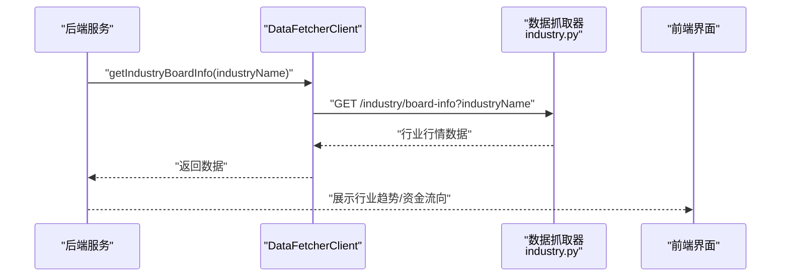

**图表来源**
- [DataFetcherClient.java:101-105](file://backend/src/main/java/com/stock/client/DataFetcherClient.java#L101-L105)
- [industry.py:9-38](file://data-fetcher/routers/industry.py#L9-L38)
- [IndustryAnalysisService.java:52-52](file://backend/src/main/java/com/stock/service/IndustryAnalysisService.java#L52-L52)

**章节来源**
- [DataFetcherClient.java:101-105](file://backend/src/main/java/com/stock/client/DataFetcherClient.java#L101-L105)
- [industry.py:9-38](file://data-fetcher/routers/industry.py#L9-L38)
- [IndustryAnalysisService.java:52-52](file://backend/src/main/java/com/stock/service/IndustryAnalysisService.java#L52-L52)

### 行业景气度指数计算
- 指数构建思路：基于行业板块行情数据，综合涨跌幅、主力净流入、换手率等指标，设计加权评分函数，形成景气度指数。具体权重可根据业务需求调整。
- 数据来源：行业板块行情接口返回的最新价、涨跌幅、主力净流入、换手率。
- 更新频率：结合定时任务或用户触发，定期刷新景气度指数。

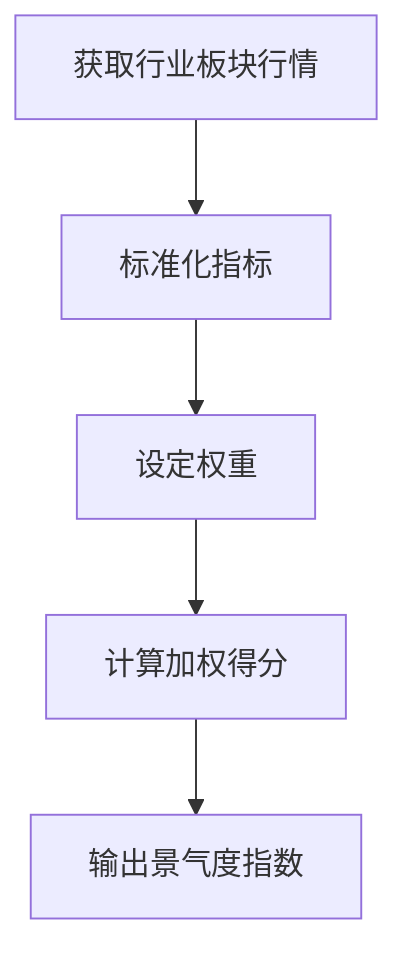

[此图为概念性流程图，不对应具体源码文件]

### 行业轮动分析模型
- 模型思路：基于多个行业的景气度指数，结合宏观事件与政策影响，建立轮动打分模型，筛选具备轮动潜力的行业。
- 输入：各行业景气度指数、政策影响因子、宏观经济指标。
- 输出：轮动优先级排序与配置建议。

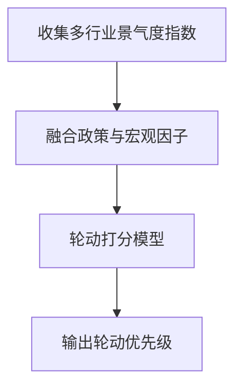

[此图为概念性流程图，不对应具体源码文件]

### 同行业公司对比分析方法
- 方法概述：通过手动添加竞品，系统拉取竞品的行情与财务数据，进行估值与盈利能力对比，形成竞争力报告。
- 关键步骤：确定竞品列表、获取竞品数据、计算对比指标、生成对比报告。

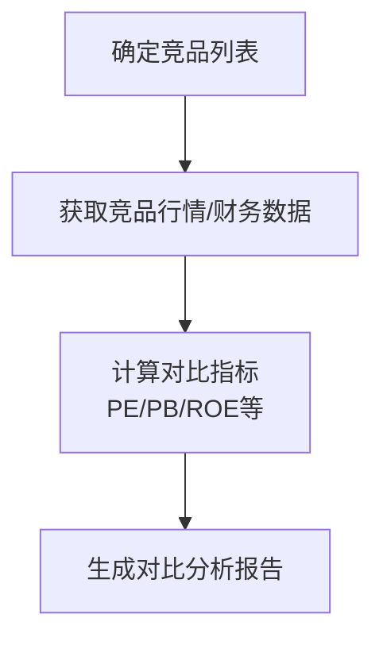

[此图为概念性流程图，不对应具体源码文件]

### 行业数据获取与处理流程
- 数据抓取器：提供行业板块行情接口，返回行业整体行情数据。
- 后端客户端：封装HTTP调用，统一异常处理与空响应检查。
- 前端集成：通过API封装调用后端控制器，完成数据展示与保存。

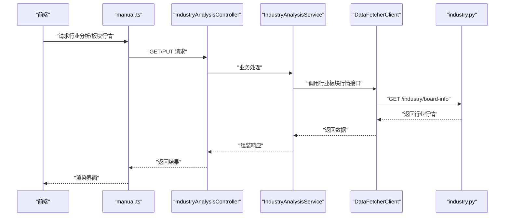

**图表来源**
- [manual.ts:132-135](file://frontend/src/api/manual.ts#L132-L135)
- [IndustryAnalysisController.java:19-28](file://backend/src/main/java/com/stock/controller/IndustryAnalysisController.java#L19-L28)
- [IndustryAnalysisService.java:37-59](file://backend/src/main/java/com/stock/service/IndustryAnalysisService.java#L37-L59)
- [DataFetcherClient.java:101-105](file://backend/src/main/java/com/stock/client/DataFetcherClient.java#L101-L105)
- [industry.py:9-38](file://data-fetcher/routers/industry.py#L9-L38)

**章节来源**
- [manual.ts:132-135](file://frontend/src/api/manual.ts#L132-L135)
- [IndustryAnalysisController.java:19-28](file://backend/src/main/java/com/stock/controller/IndustryAnalysisController.java#L19-L28)
- [IndustryAnalysisService.java:37-59](file://backend/src/main/java/com/stock/service/IndustryAnalysisService.java#L37-L59)
- [DataFetcherClient.java:101-105](file://backend/src/main/java/com/stock/client/DataFetcherClient.java#L101-L105)
- [industry.py:9-38](file://data-fetcher/routers/industry.py#L9-L38)

### 行业分类标准与权重分配机制
- 分类标准：以利润表行业名称为基准，结合行业板块行情进行动态校准。
- 权重分配：根据业务目标设定景气度指数的权重（涨跌幅、主力净流入、换手率），并支持动态调整。

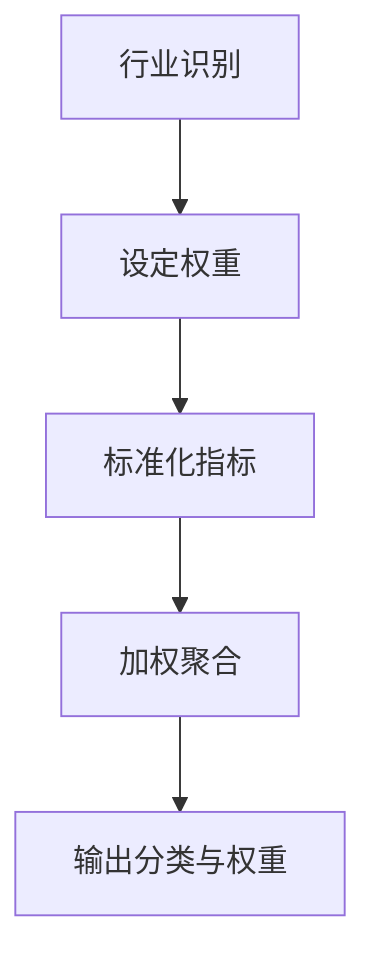

[此图为概念性流程图，不对应具体源码文件]

### 行业趋势预测算法
- 算法思路：基于历史行业行情序列，采用移动平均、指数平滑或机器学习方法进行趋势预测。
- 输入：时间序列的涨跌幅、主力净流入、换手率等。
- 输出：短期/中期趋势预测与置信区间。

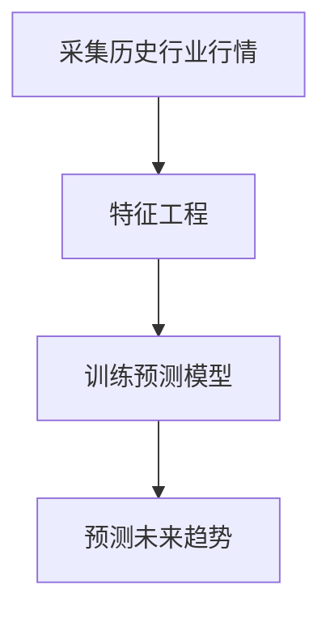

[此图为概念性流程图，不对应具体源码文件]

### 结果可视化展示方案
- 前端展示：行业分析标签页提供生命周期阶段选择、富文本输入与保存按钮；展示上次更新时间。
- 图表建议：结合行业板块行情数据绘制趋势图、资金流向图与轮动对比图。

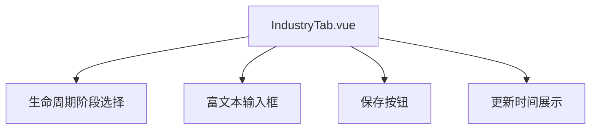

**图表来源**
- [IndustryTab.vue:6-28](file://frontend/src/views/tabs/IndustryTab.vue#L6-L28)

**章节来源**
- [IndustryTab.vue:6-28](file://frontend/src/views/tabs/IndustryTab.vue#L6-L28)

### 行业报告生成流程
- 报告内容：汇总标的概览、产业分析、财务数据、竞争力、行情与资金流向、投资笔记等模块的关键数据。
- 触发方式：标的详情页右上角“导出分析报告”按钮。
- 输出格式：HTML（浏览器直接打开，可打印为PDF）。

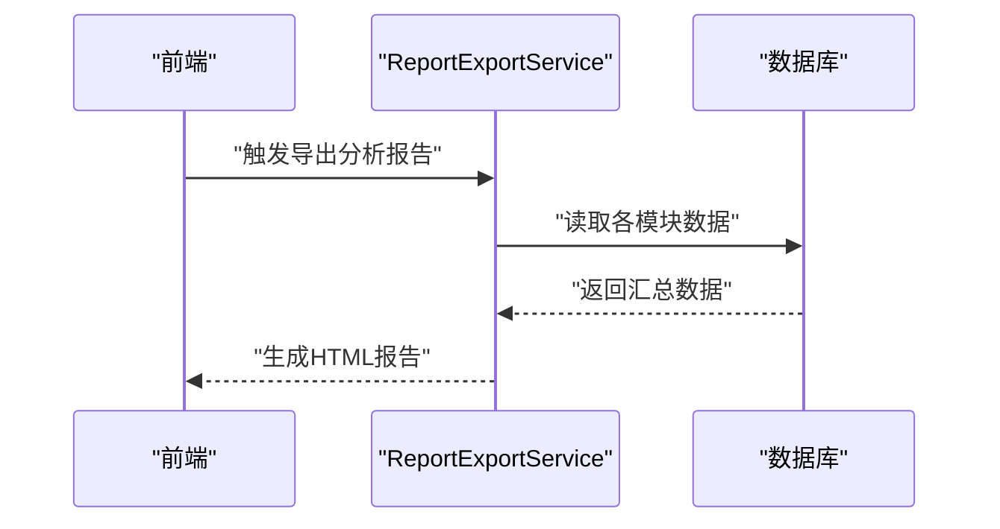

**图表来源**
- [ReportExportService.java:1-32](file://backend/src/main/java/com/stock/service/ReportExportService.java#L1-L32)
- [SKILL.md:623-635](file://system-planner/SKILL.md#L623-L635)

**章节来源**
- [ReportExportService.java:1-32](file://backend/src/main/java/com/stock/service/ReportExportService.java#L1-L32)
- [SKILL.md:623-635](file://system-planner/SKILL.md#L623-L635)

### 投资建议生成逻辑
- 逻辑框架：结合行业景气度指数、行业轮动优先级、个股估值与财务健康度，生成投资建议。
- 输出形式：建议持有/增持/减持/空仓及理由。

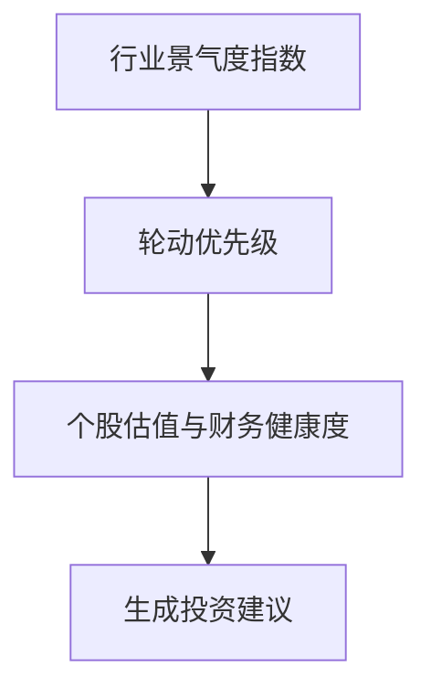

[此图为概念性流程图，不对应具体源码文件]

## 依赖分析
- 控制器依赖服务层，服务层依赖仓储与股票仓储，同时通过数据抓取客户端访问外部数据抓取器。
- 前端通过API封装调用后端控制器，实现行业分析的读取与保存。
- 系统规划文档明确了行业估值中位数降级为手动录入的设计决策，以及PUT语义用于1对1关系的约定。

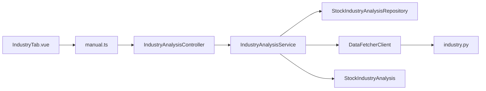

**图表来源**
- [IndustryAnalysisController.java:1-30](file://backend/src/main/java/com/stock/controller/IndustryAnalysisController.java#L1-L30)
- [IndustryAnalysisService.java:1-61](file://backend/src/main/java/com/stock/service/IndustryAnalysisService.java#L1-L61)
- [StockIndustryAnalysisRepository.java:1-13](file://backend/src/main/java/com/stock/repository/StockIndustryAnalysisRepository.java#L1-L13)
- [StockIndustryAnalysis.java:1-44](file://backend/src/main/java/com/stock/entity/StockIndustryAnalysis.java#L1-L44)
- [DataFetcherClient.java:1-126](file://backend/src/main/java/com/stock/client/DataFetcherClient.java#L1-L126)
- [industry.py:1-59](file://data-fetcher/routers/industry.py#L1-L59)
- [IndustryTab.vue:1-81](file://frontend/src/views/tabs/IndustryTab.vue#L1-L81)
- [manual.ts:132-135](file://frontend/src/api/manual.ts#L132-L135)

**章节来源**
- [IndustryAnalysisController.java:1-30](file://backend/src/main/java/com/stock/controller/IndustryAnalysisController.java#L1-L30)
- [IndustryAnalysisService.java:1-61](file://backend/src/main/java/com/stock/service/IndustryAnalysisService.java#L1-L61)
- [StockIndustryAnalysisRepository.java:1-13](file://backend/src/main/java/com/stock/repository/StockIndustryAnalysisRepository.java#L1-L13)
- [StockIndustryAnalysis.java:1-44](file://backend/src/main/java/com/stock/entity/StockIndustryAnalysis.java#L1-L44)
- [DataFetcherClient.java:1-126](file://backend/src/main/java/com/stock/client/DataFetcherClient.java#L1-L126)
- [industry.py:1-59](file://data-fetcher/routers/industry.py#L1-L59)
- [IndustryTab.vue:1-81](file://frontend/src/views/tabs/IndustryTab.vue#L1-L81)
- [manual.ts:132-135](file://frontend/src/api/manual.ts#L132-L135)
- [SKILL.md:130-144](file://system-planner/SKILL.md#L130-L144)
- [high-level-design.md:402-408](file://system-planner/high-level-design.md#L402-L408)

## 性能考虑
- 后端计算与存储：技术指标采用后端计算并存储，避免前端重复计算，提升响应效率。
- 数据抓取顺序优化：初始化时交叉调用不同数据源，利用限流独立性减少总等待时间。
- PUT语义：对1对1关系（如行业分析）使用PUT，简化保存流程，降低耦合。

**章节来源**
- [high-level-design.md:391-401](file://system-planner/high-level-design.md#L391-L401)
- [high-level-design.md:410-418](file://system-planner/high-level-design.md#L410-L418)
- [high-level-design.md:402-408](file://system-planner/high-level-design.md#L402-L408)

## 故障排查指南
- 股票不存在：保存行业分析时若股票不存在，抛出“股票不存在”异常；前端捕获错误并提示。
- 数据抓取异常：数据抓取器返回空响应或异常时，统一抛出数据获取异常；后端客户端包装异常并向上抛出。
- 富文本安全：服务层对富文本字段进行安全净化，防止XSS等风险。

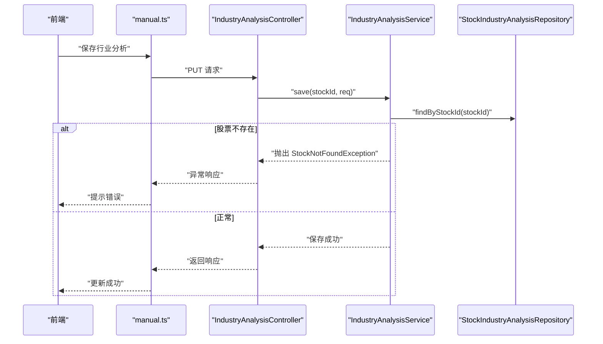

**图表来源**
- [IndustryAnalysisService.java:38-41](file://backend/src/main/java/com/stock/service/IndustryAnalysisService.java#L38-L41)
- [IndustryAnalysisServiceTest.java:55-59](file://backend/src/test/java/com/stock/service/IndustryAnalysisServiceTest.java#L55-L59)
- [IndustryTab.vue:74-78](file://frontend/src/views/tabs/IndustryTab.vue#L74-L78)

**章节来源**
- [IndustryAnalysisService.java:38-41](file://backend/src/main/java/com/stock/service/IndustryAnalysisService.java#L38-L41)
- [IndustryAnalysisServiceTest.java:55-59](file://backend/src/test/java/com/stock/service/IndustryAnalysisServiceTest.java#L55-L59)
- [IndustryTab.vue:74-78](file://frontend/src/views/tabs/IndustryTab.vue#L74-L78)

## 结论
本系统实现了“自动+手动混合”的行业分析能力：自动获取行业识别与行业板块行情，手动补充生命周期、上下游关系、政策影响、行业趋势与行业估值中位数。通过控制器-服务层-仓储-数据抓取器的清晰分层，配合前端的直观交互与报告导出能力，形成了完整的行业分析闭环。未来可在景气度指数、轮动模型与趋势预测算法方面引入更多自动化与智能化手段，持续优化行业分析的准确性与实用性。

## 附录
- 系统规划要点：行业估值中位数降级为手动录入，1对1关系使用PUT语义，技术指标后端计算并存储，初始化时交叉调用数据源以优化等待时间。
- 测试覆盖：单元测试覆盖了查询无数据返回空响应、保存成功与股票不存在异常场景。

**章节来源**
- [SKILL.md:130-144](file://system-planner/SKILL.md#L130-L144)
- [SKILL.md:166-171](file://system-planner/SKILL.md#L166-L171)
- [SKILL.md:623-635](file://system-planner/SKILL.md#L623-L635)
- [high-level-design.md:419-426](file://system-planner/high-level-design.md#L419-L426)
- [high-level-design.md:402-408](file://system-planner/high-level-design.md#L402-L408)
- [high-level-design.md:391-401](file://system-planner/high-level-design.md#L391-L401)
- [IndustryAnalysisServiceTest.java:31-59](file://backend/src/test/java/com/stock/service/IndustryAnalysisServiceTest.java#L31-L59)