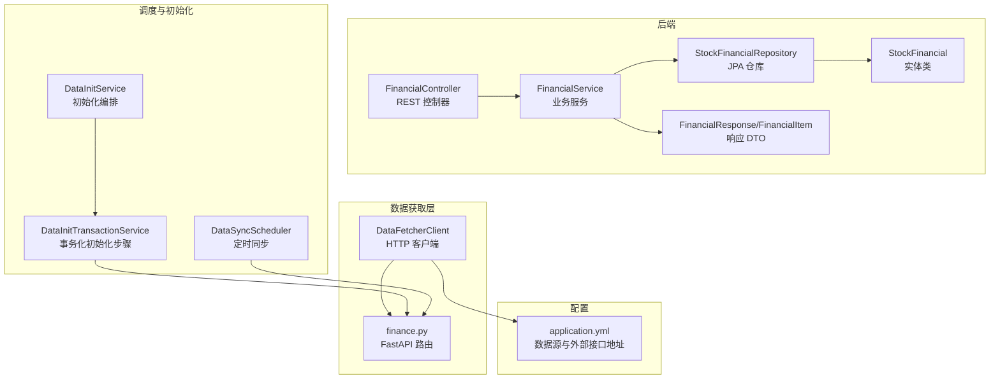
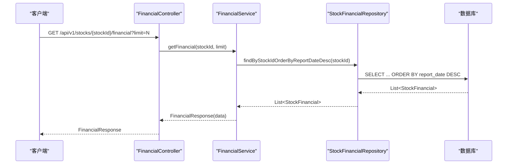
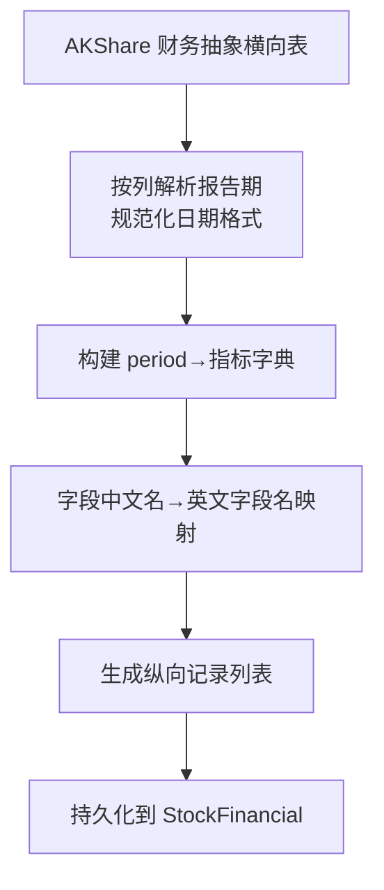
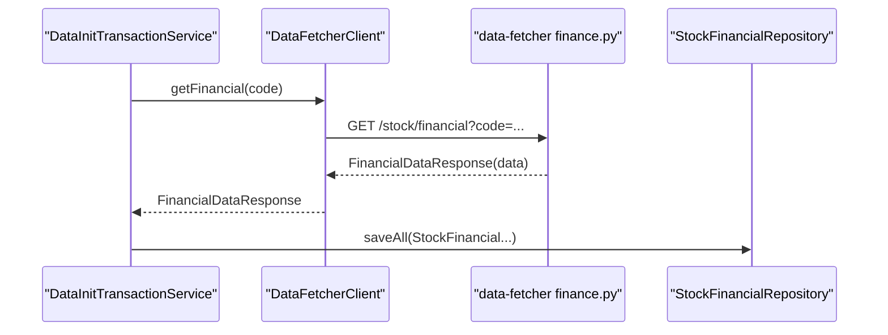
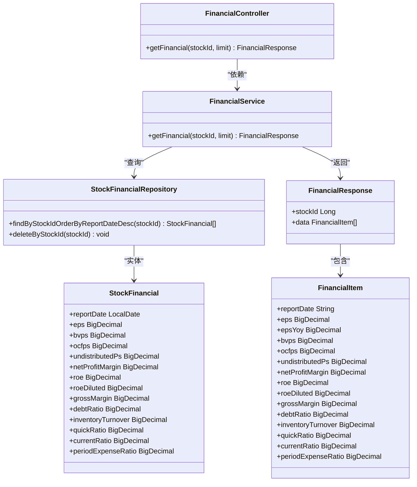
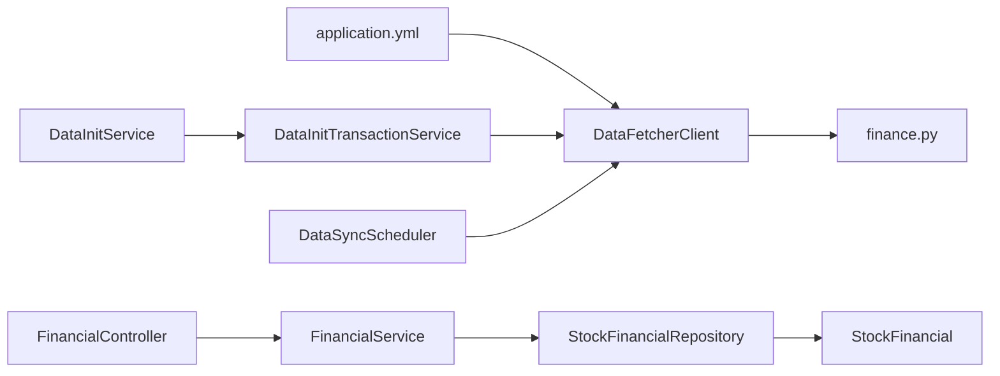

# 财务分析

<cite>
**本文引用的文件**
- [FinancialController.java](file://backend/src/main/java/com/stock/controller/FinancialController.java)
- [FinancialService.java](file://backend/src/main/java/com/stock/service/FinancialService.java)
- [StockFinancialRepository.java](file://backend/src/main/java/com/stock/repository/StockFinancialRepository.java)
- [StockFinancial.java](file://backend/src/main/java/com/stock/entity/StockFinancial.java)
- [FinancialResponse.java](file://backend/src/main/java/com/stock/dto/response/FinancialResponse.java)
- [FinancialItem.java](file://backend/src/main/java/com/stock/dto/response/FinancialItem.java)
- [FinancialDataResponse.java](file://backend/src/main/java/com/stock/dto/fetcher/FinancialDataResponse.java)
- [FinancialDataItem.java](file://backend/src/main/java/com/stock/dto/fetcher/FinancialDataItem.java)
- [DataFetcherClient.java](file://backend/src/main/java/com/stock/client/DataFetcherClient.java)
- [finance.py](file://data-fetcher/routers/finance.py)
- [application.yml](file://backend/src/main/resources/application.yml)
- [DataInitTransactionService.java](file://backend/src/main/java/com/stock/service/DataInitTransactionService.java)
- [DataSyncScheduler.java](file://backend/src/main/java/com/stock/scheduler/DataSyncScheduler.java)
- [DataInitService.java](file://backend/src/main/java/com/stock/service/DataInitService.java)
</cite>

## 目录
1. [简介](#简介)
2. [项目结构](#项目结构)
3. [核心组件](#核心组件)
4. [架构总览](#架构总览)
5. [详细组件分析](#详细组件分析)
6. [依赖关系分析](#依赖关系分析)
7. [性能考虑](#性能考虑)
8. [故障排查指南](#故障排查指南)
9. [结论](#结论)
10. [附录](#附录)

## 简介
本文件系统性梳理了该股票交易系统中的财务分析能力，覆盖财务数据的采集、入库、查询与展示全流程。重点说明财务指标字段的来源与映射关系，阐述资产负债表、利润表、现金流量表相关指标在系统中的落地方式；给出财务健康度评估的可扩展思路与趋势分析的实现路径；并提供数据质量保障与精度评估建议。

## 项目结构
财务分析功能由“前端控制器 → 服务层 → 数据访问层 → 数据源”四层构成，同时配合初始化与定时同步任务完成数据的全生命周期管理。

图示来源
- [FinancialController.java:1-23](file://backend/src/main/java/com/stock/controller/FinancialController.java#L1-L23)
- [FinancialService.java:1-45](file://backend/src/main/java/com/stock/service/FinancialService.java#L1-L45)
- [StockFinancialRepository.java:1-15](file://backend/src/main/java/com/stock/repository/StockFinancialRepository.java#L1-L15)
- [StockFinancial.java:1-72](file://backend/src/main/java/com/stock/entity/StockFinancial.java#L1-L72)
- [FinancialResponse.java:1-9](file://backend/src/main/java/com/stock/dto/response/FinancialResponse.java#L1-L9)
- [FinancialItem.java:1-22](file://backend/src/main/java/com/stock/dto/response/FinancialItem.java#L1-L22)
- [DataFetcherClient.java:1-126](file://backend/src/main/java/com/stock/client/DataFetcherClient.java#L1-L126)
- [finance.py:1-148](file://data-fetcher/routers/finance.py#L1-L148)
- [application.yml:1-28](file://backend/src/main/resources/application.yml#L1-L28)
- [DataInitService.java:1-58](file://backend/src/main/java/com/stock/service/DataInitService.java#L1-L58)
- [DataInitTransactionService.java:1-114](file://backend/src/main/java/com/stock/service/DataInitTransactionService.java#L1-L114)
- [DataSyncScheduler.java:1-238](file://backend/src/main/java/com/stock/scheduler/DataSyncScheduler.java#L1-L238)

章节来源
- [FinancialController.java:1-23](file://backend/src/main/java/com/stock/controller/FinancialController.java#L1-L23)
- [DataFetcherClient.java:1-126](file://backend/src/main/java/com/stock/client/DataFetcherClient.java#L1-L126)
- [finance.py:1-148](file://data-fetcher/routers/finance.py#L1-L148)
- [application.yml:1-28](file://backend/src/main/resources/application.yml#L1-L28)

## 核心组件
- 控制器：对外提供 REST 接口，接收股票 ID 与条数限制，调用服务层返回财务数据。
- 服务层：校验股票存在性，按报告日期倒序查询财务记录，映射为响应 DTO。
- 数据访问层：基于 JPA 的仓库接口，支持按股票 ID 查询并排序。
- 实体层：持久化财务指标字段，统一精度与小数位。
- 数据获取层：通过 DataFetcherClient 统一调用 data-fetcher 服务；data-fetcher 将 AKShare 横向表转为纵向报告期记录，并进行字段映射。
- 初始化与调度：DataInitService 编排各模块初始化；DataSyncScheduler 周期性拉取并替换入库。

章节来源
- [FinancialController.java:1-23](file://backend/src/main/java/com/stock/controller/FinancialController.java#L1-L23)
- [FinancialService.java:1-45](file://backend/src/main/java/com/stock/service/FinancialService.java#L1-L45)
- [StockFinancialRepository.java:1-15](file://backend/src/main/java/com/stock/repository/StockFinancialRepository.java#L1-L15)
- [StockFinancial.java:1-72](file://backend/src/main/java/com/stock/entity/StockFinancial.java#L1-L72)
- [FinancialResponse.java:1-9](file://backend/src/main/java/com/stock/dto/response/FinancialResponse.java#L1-L9)
- [FinancialItem.java:1-22](file://backend/src/main/java/com/stock/dto/response/FinancialItem.java#L1-L22)
- [DataFetcherClient.java:1-126](file://backend/src/main/java/com/stock/client/DataFetcherClient.java#L1-L126)
- [finance.py:1-148](file://data-fetcher/routers/finance.py#L1-L148)
- [DataInitService.java:1-58](file://backend/src/main/java/com/stock/service/DataInitService.java#L1-L58)
- [DataInitTransactionService.java:1-114](file://backend/src/main/java/com/stock/service/DataInitTransactionService.java#L1-L114)
- [DataSyncScheduler.java:1-238](file://backend/src/main/java/com/stock/scheduler/DataSyncScheduler.java#L1-L238)

## 架构总览
财务数据从 data-fetcher 的财务路由抓取，经 DataFetcherClient 转换为后端 DTO，再写入数据库实体 StockFinancial。查询时由 FinancialController 调用 FinancialService，按报告日期降序返回指定条数的财务指标。

图示来源
- [FinancialController.java:1-23](file://backend/src/main/java/com/stock/controller/FinancialController.java#L1-L23)
- [FinancialService.java:1-45](file://backend/src/main/java/com/stock/service/FinancialService.java#L1-L45)
- [StockFinancialRepository.java:1-15](file://backend/src/main/java/com/stock/repository/StockFinancialRepository.java#L1-L15)

## 详细组件分析

### 财务数据字段与来源映射
系统中财务指标字段来自 data-fetcher 的财务抽象接口，经 AKShare 返回横向表后转换为纵向记录，并将中文指标名映射到英文字段名，最终持久化到 StockFinancial。

- 字段映射要点
  - 基本每股收益 → eps
  - 每股净资产_最新股数 → bvps
  - 每股经营现金流 → ocfps
  - 每股未分配利润 → undistributedPs
  - 销售净利率 → netProfitMargin
  - 净资产收益率(ROE) → roe
  - 摊薄净资产收益率 → roeDiluted
  - 毛利率 → grossMargin
  - 资产负债率 → debtRatio
  - 存货周转率 → inventoryTurnover
  - 速动比率 → quickRatio
  - 流动比率 → currentRatio
  - 期间费用率 → periodExpenseRatio
  - 归属母公司净利润增长率 → epsYoy

图示来源
- [finance.py:43-118](file://data-fetcher/routers/finance.py#L43-L118)
- [DataInitTransactionService.java:96-109](file://backend/src/main/java/com/stock/service/DataInitTransactionService.java#L96-L109)
- [DataSyncScheduler.java:182-195](file://backend/src/main/java/com/stock/scheduler/DataSyncScheduler.java#L182-L195)

章节来源
- [finance.py:43-118](file://data-fetcher/routers/finance.py#L43-L118)
- [DataInitTransactionService.java:96-109](file://backend/src/main/java/com/stock/service/DataInitTransactionService.java#L96-L109)
- [DataSyncScheduler.java:182-195](file://backend/src/main/java/com/stock/scheduler/DataSyncScheduler.java#L182-L195)

### 数据获取与清洗流程
- 获取：DataFetcherClient 通过配置的 baseUrl 调用 data-fetcher 的 /stock/financial 接口。
- 清洗：finance.py 对返回的横向表进行转置，过滤非日期列，规范化日期格式，跳过空值与占位符，仅保留“常用指标”首次出现的指标值。
- 标准化：将中文指标名映射为统一的英文字段名，确保后续入库字段一致。
- 异常处理：对空响应或异常进行捕获并抛出统一错误类型，便于上层处理。

图示来源
- [DataFetcherClient.java:71-75](file://backend/src/main/java/com/stock/client/DataFetcherClient.java#L71-L75)
- [finance.py:43-118](file://data-fetcher/routers/finance.py#L43-L118)
- [DataInitTransactionService.java:96-109](file://backend/src/main/java/com/stock/service/DataInitTransactionService.java#L96-L109)

章节来源
- [DataFetcherClient.java:1-126](file://backend/src/main/java/com/stock/client/DataFetcherClient.java#L1-L126)
- [finance.py:1-148](file://data-fetcher/routers/finance.py#L1-L148)
- [DataInitTransactionService.java:1-114](file://backend/src/main/java/com/stock/service/DataInitTransactionService.java#L1-L114)

### 查询与展示
- 控制器：接收 stockId 与 limit 参数，调用服务层。
- 服务层：校验股票存在性，按报告日期降序查询，截断至 limit 条，映射为 FinancialItem 列表。
- 响应：FinancialResponse 包含 stockId 与 data 列表。

图示来源
- [FinancialController.java:1-23](file://backend/src/main/java/com/stock/controller/FinancialController.java#L1-L23)
- [FinancialService.java:1-45](file://backend/src/main/java/com/stock/service/FinancialService.java#L1-L45)
- [StockFinancialRepository.java:1-15](file://backend/src/main/java/com/stock/repository/StockFinancialRepository.java#L1-L15)
- [StockFinancial.java:1-72](file://backend/src/main/java/com/stock/entity/StockFinancial.java#L1-L72)
- [FinancialResponse.java:1-9](file://backend/src/main/java/com/stock/dto/response/FinancialResponse.java#L1-L9)
- [FinancialItem.java:1-22](file://backend/src/main/java/com/stock/dto/response/FinancialItem.java#L1-L22)

章节来源
- [FinancialController.java:1-23](file://backend/src/main/java/com/stock/controller/FinancialController.java#L1-L23)
- [FinancialService.java:1-45](file://backend/src/main/java/com/stock/service/FinancialService.java#L1-L45)
- [StockFinancialRepository.java:1-15](file://backend/src/main/java/com/stock/repository/StockFinancialRepository.java#L1-L15)
- [StockFinancial.java:1-72](file://backend/src/main/java/com/stock/entity/StockFinancial.java#L1-L72)
- [FinancialResponse.java:1-9](file://backend/src/main/java/com/stock/dto/response/FinancialResponse.java#L1-L9)
- [FinancialItem.java:1-22](file://backend/src/main/java/com/stock/dto/response/FinancialItem.java#L1-L22)

### 财务报表与指标说明
- 利润表相关
  - 营业收入、营业成本、归属母公司净利润、销售净利率、毛利率、期间费用率等，均来自 data-fetcher 的收入接口；财务指标中包含销售净利率、毛利率、期间费用率等。
- 资产负债表相关
  - 资产负债率、流动比率、速动比率等直接来自财务抽象接口映射。
- 现金流量表相关
  - 每股经营现金流（ocfps）来自财务抽象接口映射，可作为现金流指标使用。

章节来源
- [finance.py:14-41](file://data-fetcher/routers/finance.py#L14-L41)
- [finance.py:43-118](file://data-fetcher/routers/finance.py#L43-L118)
- [DataInitTransactionService.java:96-109](file://backend/src/main/java/com/stock/service/DataInitTransactionService.java#L96-L109)
- [DataSyncScheduler.java:182-195](file://backend/src/main/java/com/stock/scheduler/DataSyncScheduler.java#L182-L195)

### 趋势分析与健康度评估
- 趋势分析
  - 通过 FinancialService 查询多期数据（limit 控制），按 reportDate 降序排列，即可进行同比、环比趋势观察。
  - 可结合日线与技术指标进行复合分析（系统已具备日线与指标计算能力）。
- 财务健康度评估
  - 可基于以下指标构建评分或等级模型：
    - 盈利能力：ROE、ROA（可由 EPS、BVPS 计算）、销售净利率、毛利率
    - 偿债能力：资产负债率、流动比率、速动比率
    - 运营效率：存货周转率
    - 成长能力：EPS 同比
  - 建议采用加权打分或规则阈值法，结合行业对比与时间序列稳定性进行综合判断。

[本节为概念性说明，不直接分析具体文件，故无章节来源]

### 结果数据结构与展示
- 响应结构
  - FinancialResponse：包含 stockId 与 data 列表
  - FinancialItem：包含报告期与各项财务指标
- 展示建议
  - 图表：折线图（趋势）、柱状图（结构占比）、雷达图（多维指标对比）
  - 业务解读：以 ROE、资产负债率、毛利率为核心，结合行业均值与历史区间进行解读

章节来源
- [FinancialResponse.java:1-9](file://backend/src/main/java/com/stock/dto/response/FinancialResponse.java#L1-L9)
- [FinancialItem.java:1-22](file://backend/src/main/java/com/stock/dto/response/FinancialItem.java#L1-L22)

### 数据质量与精度保障
- 数据质量
  - 字段精度：StockFinancial 中所有财务指标均定义为固定精度与小数位，避免浮点误差累积。
  - 空值处理：data-fetcher 在映射阶段跳过空值与占位符，保证入库数据可用性。
- 精度评估
  - 内部一致性：同一报告期不同指标间逻辑校验（如 ROE 与 EPS/BVPS 的数量级关系）
  - 外部一致性：与行业均值、前后期对比进行合理性检查
  - 更新策略：通过 DataSyncScheduler 周期性替换入库，确保数据新鲜度

章节来源
- [StockFinancial.java:1-72](file://backend/src/main/java/com/stock/entity/StockFinancial.java#L1-L72)
- [finance.py:66-95](file://data-fetcher/routers/finance.py#L66-L95)
- [DataSyncScheduler.java:163-214](file://backend/src/main/java/com/stock/scheduler/DataSyncScheduler.java#L163-L214)

## 依赖关系分析
- 外部依赖
  - data-fetcher：提供财务抽象接口，负责指标字段映射与清洗
  - AKShare：提供财务抽象数据源
- 内部依赖
  - DataFetcherClient 依赖 application.yml 中的 baseUrl 配置
  - FinancialController 依赖 FinancialService
  - FinancialService 依赖 StockFinancialRepository 与 StockRepository
  - DataInitService/ DataSyncScheduler 依赖 DataFetcherClient 与 StockFinancialRepository

图示来源
- [application.yml:19-22](file://backend/src/main/resources/application.yml#L19-L22)
- [DataFetcherClient.java:1-126](file://backend/src/main/java/com/stock/client/DataFetcherClient.java#L1-L126)
- [finance.py:1-148](file://data-fetcher/routers/finance.py#L1-L148)
- [DataInitService.java:1-58](file://backend/src/main/java/com/stock/service/DataInitService.java#L1-L58)
- [DataInitTransactionService.java:1-114](file://backend/src/main/java/com/stock/service/DataInitTransactionService.java#L1-L114)
- [DataSyncScheduler.java:1-238](file://backend/src/main/java/com/stock/scheduler/DataSyncScheduler.java#L1-L238)
- [FinancialController.java:1-23](file://backend/src/main/java/com/stock/controller/FinancialController.java#L1-L23)
- [FinancialService.java:1-45](file://backend/src/main/java/com/stock/service/FinancialService.java#L1-L45)
- [StockFinancialRepository.java:1-15](file://backend/src/main/java/com/stock/repository/StockFinancialRepository.java#L1-L15)
- [StockFinancial.java:1-72](file://backend/src/main/java/com/stock/entity/StockFinancial.java#L1-L72)

章节来源
- [application.yml:1-28](file://backend/src/main/resources/application.yml#L1-L28)
- [DataFetcherClient.java:1-126](file://backend/src/main/java/com/stock/client/DataFetcherClient.java#L1-L126)
- [finance.py:1-148](file://data-fetcher/routers/finance.py#L1-L148)
- [DataInitService.java:1-58](file://backend/src/main/java/com/stock/service/DataInitService.java#L1-L58)
- [DataInitTransactionService.java:1-114](file://backend/src/main/java/com/stock/service/DataInitTransactionService.java#L1-L114)
- [DataSyncScheduler.java:1-238](file://backend/src/main/java/com/stock/scheduler/DataSyncScheduler.java#L1-L238)
- [FinancialController.java:1-23](file://backend/src/main/java/com/stock/controller/FinancialController.java#L1-L23)
- [FinancialService.java:1-45](file://backend/src/main/java/com/stock/service/FinancialService.java#L1-L45)
- [StockFinancialRepository.java:1-15](file://backend/src/main/java/com/stock/repository/StockFinancialRepository.java#L1-L15)
- [StockFinancial.java:1-72](file://backend/src/main/java/com/stock/entity/StockFinancial.java#L1-L72)

## 性能考虑
- 查询性能
  - StockFinancial 表对 (stock_id, report_date) 建有唯一约束，查询按 report_date 降序可利用索引
- 写入性能
  - 批量保存：DataInitTransactionService 与 DataSyncScheduler 使用 saveAll 批量写入
- 网络与超时
  - DataFetcherClient 统一超时控制，避免阻塞
- 并发与事务
  - 初始化与同步在事务内执行，防止脏写

[本节提供通用指导，不直接分析具体文件，故无章节来源]

## 故障排查指南
- 常见问题
  - 股票不存在：FinancialService 在校验失败时抛出异常
  - 数据为空：DataFetcherClient 对空响应抛出统一异常
  - 外部接口异常：finance.py 捕获异常并返回 HTTP 503
- 定位步骤
  - 检查 application.yml 中 data-fetcher 地址与超时配置
  - 查看 DataFetcherClient 的调用链路与异常栈
  - 核对 data-fetcher 返回的字段映射是否完整
- 建议
  - 增加重试与熔断策略
  - 记录关键指标缺失情况，辅助健康度评估

章节来源
- [FinancialService.java:24-27](file://backend/src/main/java/com/stock/service/FinancialService.java#L24-L27)
- [DataFetcherClient.java:112-124](file://backend/src/main/java/com/stock/client/DataFetcherClient.java#L112-L124)
- [finance.py:116-118](file://data-fetcher/routers/finance.py#L116-L118)
- [application.yml:19-22](file://backend/src/main/resources/application.yml#L19-L22)

## 结论
该系统已完整实现财务数据的采集、清洗、入库与查询能力，核心财务指标字段齐备，支持按报告期趋势分析。建议在现有基础上扩展财务健康度评估模型与异常检测机制，并完善指标缺失与异常值处理策略，以进一步提升财务分析的准确性与可解释性。

[本节为总结性内容，不直接分析具体文件，故无章节来源]

## 附录
- 关键接口与字段
  - 接口：GET /api/v1/stocks/{stockId}/financial?limit=N
  - 字段：eps、epsYoy、bvps、ocfps、undistributedPs、netProfitMargin、roe、roeDiluted、grossMargin、debtRatio、inventoryTurnover、quickRatio、currentRatio、periodExpenseRatio
- 初始化与同步
  - 初始化步骤包含 FINANCIAL 步骤
  - 周期性同步在每周日执行，替换入库

章节来源
- [FinancialController.java:1-23](file://backend/src/main/java/com/stock/controller/FinancialController.java#L1-L23)
- [DataInitService.java:23-32](file://backend/src/main/java/com/stock/service/DataInitService.java#L23-L32)
- [DataSyncScheduler.java:163-214](file://backend/src/main/java/com/stock/scheduler/DataSyncScheduler.java#L163-L214)