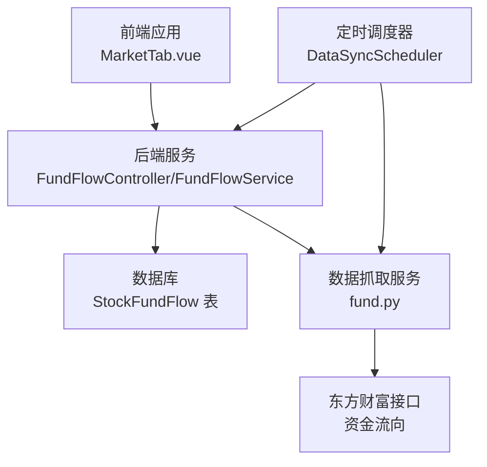
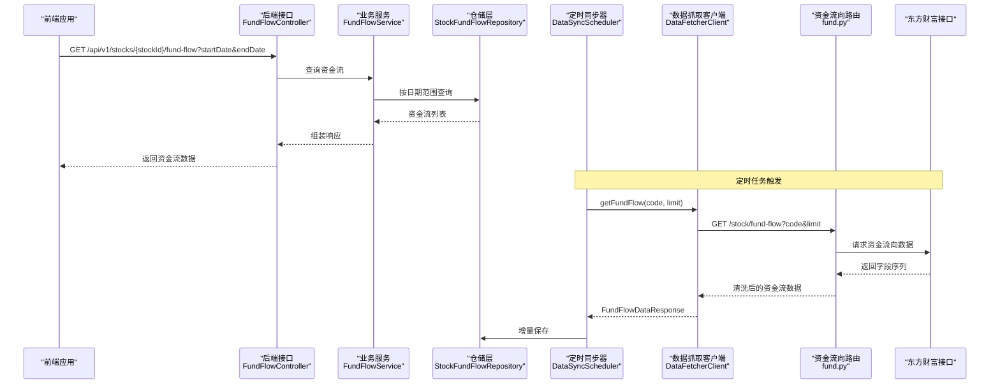
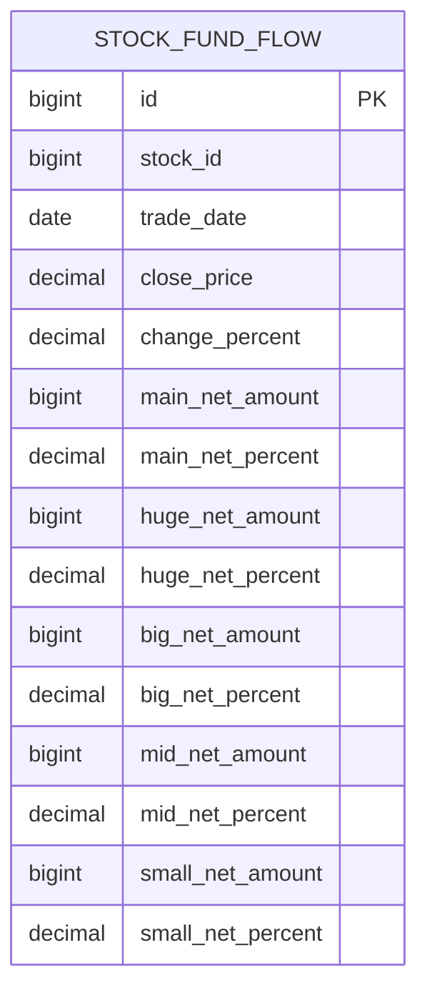
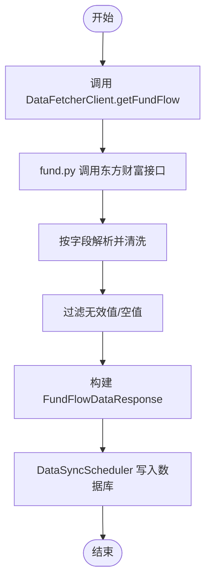
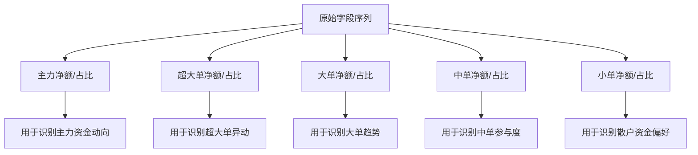
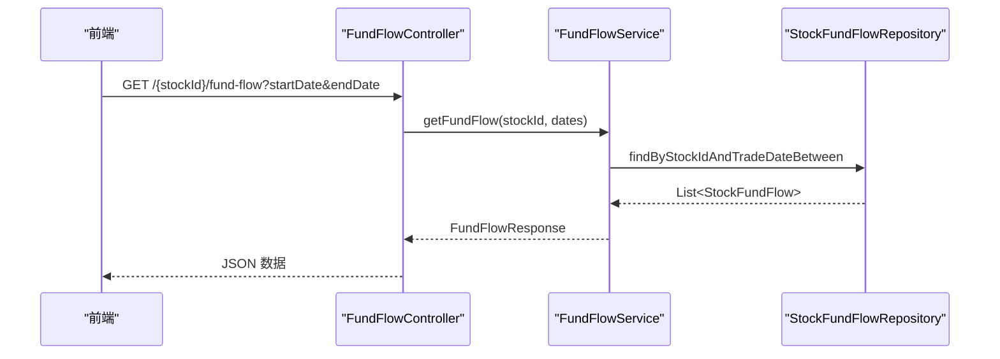
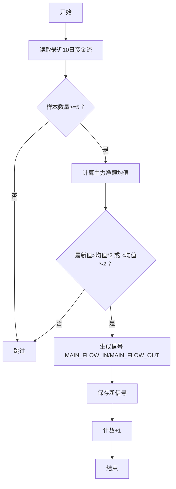
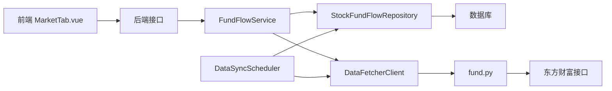

# 资金流向分析

<cite>
**本文引用的文件**   
- [DataFetcherClient.java](file://backend/src/main/java/com/stock/client/DataFetcherClient.java)
- [FundFlowController.java](file://backend/src/main/java/com/stock/controller/FundFlowController.java)
- [FundFlowService.java](file://backend/src/main/java/com/stock/service/FundFlowService.java)
- [FundFlowDataItem.java](file://backend/src/main/java/com/stock/dto/fetcher/FundFlowDataItem.java)
- [FundFlowDataResponse.java](file://backend/src/main/java/com/stock/dto/fetcher/FundFlowDataResponse.java)
- [FundFlowResponse.java](file://backend/src/main/java/com/stock/dto/response/FundFlowResponse.java)
- [FundFlowItem.java](file://backend/src/main/java/com/stock/dto/response/FundFlowItem.java)
- [StockFundFlow.java](file://backend/src/main/java/com/stock/entity/StockFundFlow.java)
- [StockFundFlowRepository.java](file://backend/src/main/java/com/stock/repository/StockFundFlowRepository.java)
- [DataSyncScheduler.java](file://backend/src/main/java/com/stock/scheduler/DataSyncScheduler.java)
- [application.yml](file://backend/src/main/resources/application.yml)
- [app.py](file://data-fetcher/app.py)
- [fund.py](file://data-fetcher/routers/fund.py)
- [config.py](file://data-fetcher/core/config.py)
- [SignalScheduler.java](file://backend/src/main/java/com/stock/scheduler/SignalScheduler.java)
- [MarketTab.vue](file://frontend/src/views/tabs/MarketTab.vue)
- [data-source-verification.md](file://system-planner/data-source-verification.md)
- [SKILL.md](file://system-planner/SKILL.md)
</cite>

## 目录
1. [简介](#简介)
2. [项目结构](#项目结构)
3. [核心组件](#核心组件)
4. [架构总览](#架构总览)
5. [详细组件分析](#详细组件分析)
6. [依赖分析](#依赖分析)
7. [性能考虑](#性能考虑)
8. [故障排查指南](#故障排查指南)
9. [结论](#结论)
10. [附录](#附录)

## 简介
本文件围绕资金流向分析功能进行系统化说明，覆盖数据来源、采集与同步、存储模型、指标计算、趋势与活跃度分析、可视化与预警、以及准确性与可靠性评估。系统采用“前端应用 + 后端服务 + 数据抓取服务”的三层架构，资金流向数据由后端定时任务从数据抓取服务拉取并入库，前端通过后端接口展示。

## 项目结构
- 后端 Spring Boot 应用负责业务逻辑、数据访问与对外接口；
- 数据抓取服务基于 FastAPI，提供资金流向等数据接口；
- 前端 Vue 应用负责展示资金流向表格与图表；
- 定时调度器负责增量同步与指标重算。

**图示来源**
- [FundFlowController.java:10-26](file://backend/src/main/java/com/stock/controller/FundFlowController.java#L10-L26)
- [FundFlowService.java:25-49](file://backend/src/main/java/com/stock/service/FundFlowService.java#L25-L49)
- [DataSyncScheduler.java:84-117](file://backend/src/main/java/com/stock/scheduler/DataSyncScheduler.java#L84-L117)
- [fund.py:9-49](file://data-fetcher/routers/fund.py#L9-L49)
- [StockFundFlow.java:18-65](file://backend/src/main/java/com/stock/entity/StockFundFlow.java#L18-L65)

**章节来源**
- [application.yml:19-27](file://backend/src/main/resources/application.yml#L19-L27)
- [app.py:1-31](file://data-fetcher/app.py#L1-L31)

## 核心组件
- 资金流向控制器：提供 REST 接口，按日期范围查询资金流数据。
- 资金流向服务：封装查询逻辑，组装响应 DTO。
- 数据抓取客户端：统一调用数据抓取服务，屏蔽底层差异。
- 数据抓取路由：对接东方财富资金流向接口，解析并清洗字段。
- 定时同步器：按策略增量拉取并入库，避免重复与越界。
- 实体与仓库：定义资金流表结构与查询能力。
- 前端展示：资金流向表格与可视化基础。

**章节来源**
- [FundFlowController.java:20-25](file://backend/src/main/java/com/stock/controller/FundFlowController.java#L20-L25)
- [FundFlowService.java:25-49](file://backend/src/main/java/com/stock/service/FundFlowService.java#L25-L49)
- [DataFetcherClient.java:59-63](file://backend/src/main/java/com/stock/client/DataFetcherClient.java#L59-L63)
- [fund.py:9-49](file://data-fetcher/routers/fund.py#L9-L49)
- [DataSyncScheduler.java:84-117](file://backend/src/main/java/com/stock/scheduler/DataSyncScheduler.java#L84-L117)
- [StockFundFlow.java:18-65](file://backend/src/main/java/com/stock/entity/StockFundFlow.java#L18-L65)
- [StockFundFlowRepository.java:12-20](file://backend/src/main/java/com/stock/repository/StockFundFlowRepository.java#L12-L20)
- [MarketTab.vue:1-24](file://frontend/src/views/tabs/MarketTab.vue#L1-L24)

## 架构总览
资金流向分析的端到端流程如下：

**图示来源**
- [FundFlowController.java:20-25](file://backend/src/main/java/com/stock/controller/FundFlowController.java#L20-L25)
- [FundFlowService.java:25-49](file://backend/src/main/java/com/stock/service/FundFlowService.java#L25-L49)
- [StockFundFlowRepository.java:14-17](file://backend/src/main/java/com/stock/repository/StockFundFlowRepository.java#L14-L17)
- [DataSyncScheduler.java:84-117](file://backend/src/main/java/com/stock/scheduler/DataSyncScheduler.java#L84-L117)
- [DataFetcherClient.java:59-63](file://backend/src/main/java/com/stock/client/DataFetcherClient.java#L59-L63)
- [fund.py:9-49](file://data-fetcher/routers/fund.py#L9-L49)

## 详细组件分析

### 数据模型与实体
资金流向数据模型映射到数据库表，包含主力、超大单、大单、中单、小单的净额与净占比，以及当日收盘价与涨跌幅。

**图示来源**
- [StockFundFlow.java:18-65](file://backend/src/main/java/com/stock/entity/StockFundFlow.java#L18-L65)

**章节来源**
- [StockFundFlow.java:18-65](file://backend/src/main/java/com/stock/entity/StockFundFlow.java#L18-L65)

### 数据获取与清洗
- 后端通过 DataFetcherClient 统一调用数据抓取服务的资金流向接口。
- 数据抓取服务将东方财富返回的逗号分隔字段映射为结构化 JSON，并进行安全转换（整型/浮点），过滤无效值。
- 后端定时同步器按最大交易日增量拉取，避免重复写入。

**图示来源**
- [DataFetcherClient.java:59-63](file://backend/src/main/java/com/stock/client/DataFetcherClient.java#L59-L63)
- [fund.py:9-49](file://data-fetcher/routers/fund.py#L9-L49)
- [config.py:41-78](file://data-fetcher/core/config.py#L41-L78)
- [DataSyncScheduler.java:84-117](file://backend/src/main/java/com/stock/scheduler/DataSyncScheduler.java#L84-L117)

**章节来源**
- [DataFetcherClient.java:59-63](file://backend/src/main/java/com/stock/client/DataFetcherClient.java#L59-L63)
- [fund.py:9-49](file://data-fetcher/routers/fund.py#L9-L49)
- [config.py:80-100](file://data-fetcher/core/config.py#L80-L100)

### 指标定义与计算
根据数据源验证文档，资金流向字段含义如下（单位：元；主力/超大单/大单/中单/小单均为“净额”与“净占比”）：
- 日期、主力净流入、小单净流入、中单净流入、大单净流入、超大单净流入、主力净占比、小单净占比、中单净占比、大单净占比、超大单净占比、收盘价、涨跌幅

**图示来源**
- [data-source-verification.md:113-133](file://system-planner/data-source-verification.md#L113-L133)

**章节来源**
- [data-source-verification.md:113-133](file://system-planner/data-source-verification.md#L113-L133)

### 资金流向数据获取流程
- 后端接口层接收请求，校验股票存在性，按日期范围查询资金流记录。
- 将实体映射为响应 DTO，包含日期、收盘价、涨跌幅及各单边净额与占比。
- 前端渲染表格，按主力净额正负显示颜色。

**图示来源**
- [FundFlowController.java:20-25](file://backend/src/main/java/com/stock/controller/FundFlowController.java#L20-L25)
- [FundFlowService.java:25-49](file://backend/src/main/java/com/stock/service/FundFlowService.java#L25-L49)
- [StockFundFlowRepository.java:14-17](file://backend/src/main/java/com/stock/repository/StockFundFlowRepository.java#L14-L17)
- [FundFlowResponse.java:5-8](file://backend/src/main/java/com/stock/dto/response/FundFlowResponse.java#L5-L8)
- [FundFlowItem.java:5-19](file://backend/src/main/java/com/stock/dto/response/FundFlowItem.java#L5-L19)
- [MarketTab.vue:4-20](file://frontend/src/views/tabs/MarketTab.vue#L4-L20)

**章节来源**
- [FundFlowController.java:20-25](file://backend/src/main/java/com/stock/controller/FundFlowController.java#L20-L25)
- [FundFlowService.java:25-49](file://backend/src/main/java/com/stock/service/FundFlowService.java#L25-L49)
- [StockFundFlowRepository.java:14-17](file://backend/src/main/java/com/stock/repository/StockFundFlowRepository.java#L14-L17)
- [FundFlowResponse.java:5-8](file://backend/src/main/java/com/stock/dto/response/FundFlowResponse.java#L5-L8)
- [FundFlowItem.java:5-19](file://backend/src/main/java/com/stock/dto/response/FundFlowItem.java#L5-L19)
- [MarketTab.vue:4-20](file://frontend/src/views/tabs/MarketTab.vue#L4-L20)

### 资金趋势分析模型
- 移动平均：对主力净额、超大单净额等序列计算短期与长期移动平均，识别拐点。
- 偏差检测：当近期主力净额偏离均值超过阈值倍标准差时，视为异常信号。
- 趋势强度：以最近 N 日主力净额累计值与历史分位比较，衡量趋势强度。
- 涨跌联动：计算主力净额与涨跌幅的滚动相关系数，评估资金与价格的联动关系。

（本节为概念性说明，不直接分析具体文件）

### 资金活跃度评估算法
- 活跃度指标：统计主力净额绝对值的滚动均值与标准差，结合换手率进行归一化评分。
- 异动阈值：设定“显著流入/流出”阈值，结合成交量放大因子识别异常活跃日。
- 单边占比：主力/超大单占比持续高于阈值，判定为主力主导型活跃。

（本节为概念性说明，不直接分析具体文件）

### 资金流向与股价关系的关联分析
- 价格滞后：对主力净额序列做滞后分析，观察对次日涨跌幅的影响。
- 分位对比：将主力净额分位与涨跌幅分位进行对比，识别资金领先性。
- 区间统计：按涨跌幅区间统计主力净额分布，绘制箱线图或密度图。

（本节为概念性说明，不直接分析具体文件）

### 可视化展示方案
- 表格：前端 MarketTab 展示近30天资金流明细，按主力净额颜色区分流入/流出。
- 折线图：展示主力/超大单/大单净额的时间序列与收盘价叠加。
- 柱状图：展示主力净额与涨跌幅散点，标注显著异动日期。
- 热力图：按涨跌幅分箱统计主力净额分布。

**章节来源**
- [MarketTab.vue:4-20](file://frontend/src/views/tabs/MarketTab.vue#L4-L20)

### 资金动向预警机制
- 触发条件：最近10日主力净额出现连续大幅流入/流出，且幅度超过历史均值2倍以上。
- 信号生成：由信号调度器检测并落库，前端轮询或订阅推送。
- 通知策略：邮件/站内信/短信（依据业务扩展）。

**图示来源**
- [SignalScheduler.java:84-109](file://backend/src/main/java/com/stock/scheduler/SignalScheduler.java#L84-L109)

**章节来源**
- [SignalScheduler.java:84-109](file://backend/src/main/java/com/stock/scheduler/SignalScheduler.java#L84-L109)

### 投资决策支持功能
- 条件筛选：按主力净额方向、占比阈值、涨跌幅区间筛选候选池。
- 组合评分：综合活跃度、趋势强度、资金与价格联动系数给出综合评分。
- 回测框架：基于历史资金流与价格序列回测策略收益与胜率。

（本节为概念性说明，不直接分析具体文件）

## 依赖分析
- 后端依赖数据抓取服务提供资金流向数据，抓取服务依赖东方财富接口。
- 后端定时同步器依赖数据库仓储层进行增量写入。
- 前端依赖后端接口返回结构化数据进行展示。

**图示来源**
- [FundFlowController.java:20-25](file://backend/src/main/java/com/stock/controller/FundFlowController.java#L20-L25)
- [FundFlowService.java:25-49](file://backend/src/main/java/com/stock/service/FundFlowService.java#L25-L49)
- [StockFundFlowRepository.java:14-17](file://backend/src/main/java/com/stock/repository/StockFundFlowRepository.java#L14-L17)
- [DataFetcherClient.java:59-63](file://backend/src/main/java/com/stock/client/DataFetcherClient.java#L59-L63)
- [fund.py:9-49](file://data-fetcher/routers/fund.py#L9-L49)
- [DataSyncScheduler.java:84-117](file://backend/src/main/java/com/stock/scheduler/DataSyncScheduler.java#L84-L117)

**章节来源**
- [application.yml:19-27](file://backend/src/main/resources/application.yml#L19-L27)
- [app.py:1-31](file://data-fetcher/app.py#L1-L31)

## 性能考虑
- 增量同步：按最大交易日增量拉取，减少重复与网络压力。
- 批量写入：一次性保存多条记录，降低事务开销。
- 字段清洗：在抓取阶段完成安全转换与过滤，减轻后端负担。
- 并发控制：抓取服务内置最小请求间隔，避免被目标站点限流。
- 缓存与索引：建议在数据库层面为 stock_id 与 trade_date 建立复合索引以优化查询。

（本节为通用建议，不直接分析具体文件）

## 故障排查指南
- 数据为空：检查定时同步是否成功执行、股票是否存在、日期范围是否合理。
- 字段异常：确认抓取服务的字段解析顺序与清洗逻辑，关注 -1 值处理。
- 接口失败：核对数据抓取服务健康状态、CORS 配置、请求头 Referer。
- 速率限制：若出现连接错误，确认抓取服务的重试与退避策略是否生效。

**章节来源**
- [DataSyncScheduler.java:84-117](file://backend/src/main/java/com/stock/scheduler/DataSyncScheduler.java#L84-L117)
- [config.py:80-100](file://data-fetcher/core/config.py#L80-L100)
- [app.py:7-12](file://data-fetcher/app.py#L7-L12)

## 结论
该系统通过定时同步与标准化的数据模型，实现了主力资金、散户资金的识别与追踪；结合前端可视化与预警机制，可为投资决策提供及时、可靠的参考。后续可在指标体系、联动分析与回测框架方面进一步完善。

## 附录

### 数据准确性验证与可靠性评估
- 数据源验证：资金流向接口来自东方财富，字段与 AKShare 对应接口交叉验证一致。
- 数值约定：价格字段需除以100，这是东方财富的数值精度约定，抓取阶段已处理。
- 异常检测：对 -1、空值与异常波动进行过滤与标记，保证入库数据质量。
- 一致性校验：通过字段数量与类型校验，确保解析稳定性。

**章节来源**
- [data-source-verification.md:113-133](file://system-planner/data-source-verification.md#L113-L133)
- [SKILL.md:46-74](file://system-planner/SKILL.md#L46-L74)
- [config.py:41-78](file://data-fetcher/core/config.py#L41-L78)