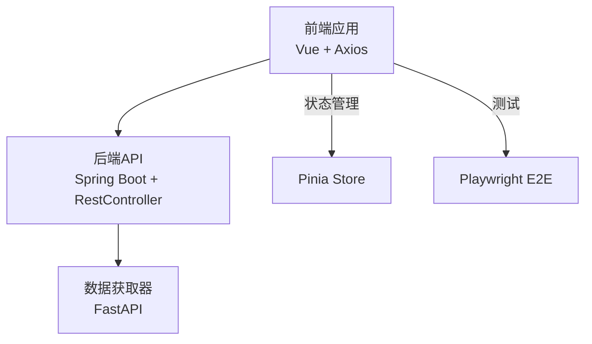
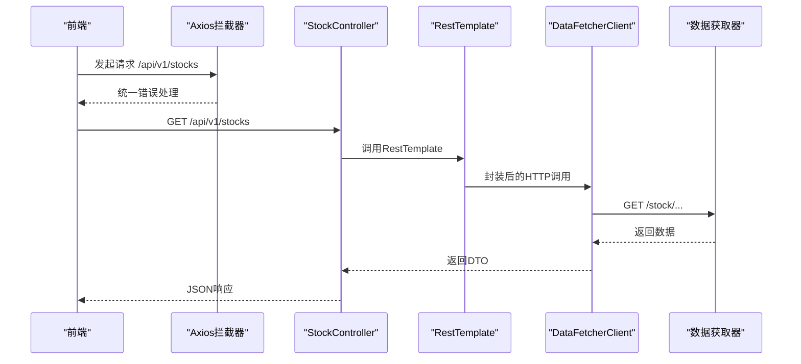
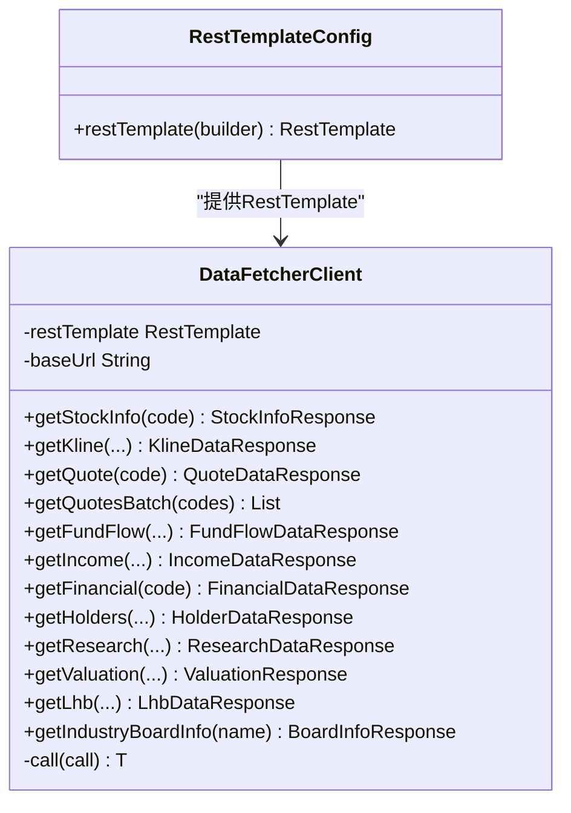
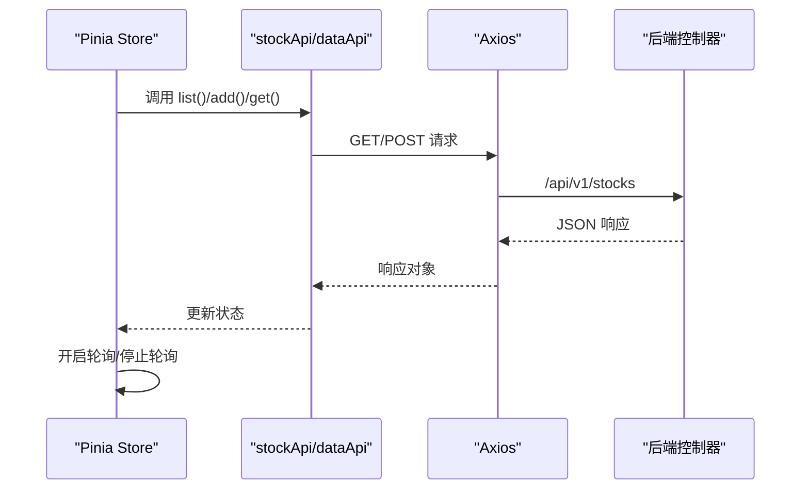
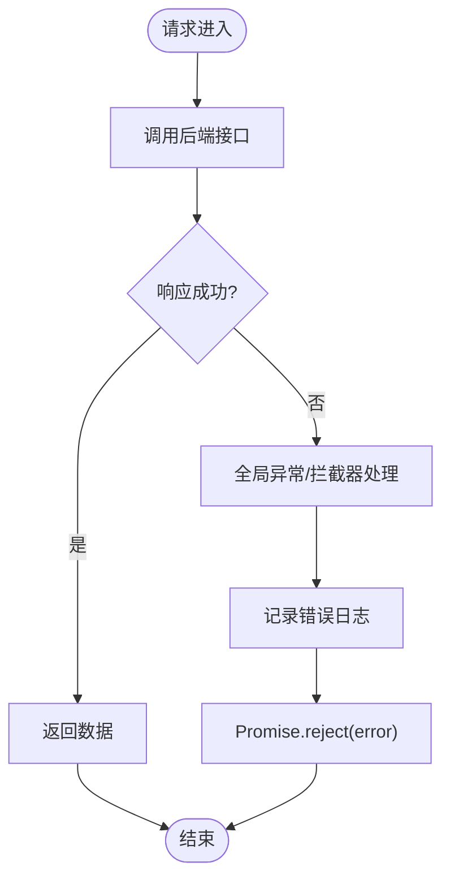
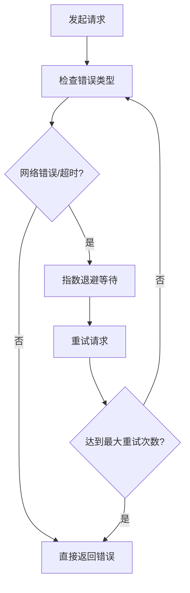
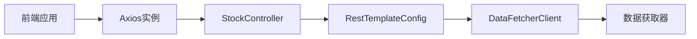

# API集成

<cite>
**本文引用的文件**
- [DataFetcherClient.java](file://backend/src/main/java/com/stock/client/DataFetcherClient.java)
- [RestTemplateConfig.java](file://backend/src/main/java/com/stock/config/RestTemplateConfig.java)
- [WebConfig.java](file://backend/src/main/java/com/stock/config/WebConfig.java)
- [application.yml](file://backend/src/main/resources/application.yml)
- [GlobalExceptionHandler.java](file://backend/src/main/java/com/stock/exception/GlobalExceptionHandler.java)
- [StockController.java](file://backend/src/main/java/com/stock/controller/StockController.java)
- [StockControllerTest.java](file://backend/src/test/java/com/stock/controller/StockControllerTest.java)
- [index.ts](file://frontend/src/api/index.ts)
- [stock.ts](file://frontend/src/stores/stock.ts)
- [stock.ts（前端API封装）](file://frontend/src/api/stock.ts)
- [data.ts（前端API封装）](file://frontend/src/api/data.ts)
- [app.py（数据获取器入口）](file://data-fetcher/app.py)
- [config.py（数据获取器核心配置）](file://data-fetcher/core/config.py)
- [playwright.config.ts](file://frontend/playwright.config.ts)
- [package.json（前端依赖）](file://frontend/package.json)
- [api-design.md（API设计文档）](file://system-planner/api-design.md)
</cite>

## 目录
1. [简介](#简介)
2. [项目结构](#项目结构)
3. [核心组件](#核心组件)
4. [架构总览](#架构总览)
5. [详细组件分析](#详细组件分析)
6. [依赖分析](#依赖分析)
7. [性能考虑](#性能考虑)
8. [故障排查指南](#故障排查指南)
9. [结论](#结论)
10. [附录](#附录)

## 简介
本文件面向API集成场景，系统性梳理后端Spring Boot与前端Vue应用之间的HTTP通信链路，涵盖HTTP客户端配置、请求/响应拦截器、API封装、错误处理、重试机制、认证与版本管理、缓存策略、测试与Mock、以及网络异常处理与性能优化建议。目标是帮助开发者快速理解并安全高效地扩展API集成能力。

## 项目结构
- 后端采用Spring Boot，通过RestTemplate进行HTTP调用，并以@Controller暴露REST接口；前端使用Axios进行HTTP请求，Pinia做状态管理。
- 数据获取器为独立的FastAPI服务，负责对接第三方行情与财务数据源。
- 前端通过Playwright进行端到端测试，使用Vite构建与开发。

**图表来源**
- [StockController.java:17-56](file://backend/src/main/java/com/stock/controller/StockController.java#L17-L56)
- [index.ts:1-18](file://frontend/src/api/index.ts#L1-L18)
- [stock.ts:1-80](file://frontend/src/stores/stock.ts#L1-L80)
- [app.py（数据获取器入口）:1-31](file://data-fetcher/app.py#L1-L31)

**章节来源**
- [StockController.java:17-56](file://backend/src/main/java/com/stock/controller/StockController.java#L17-L56)
- [index.ts:1-18](file://frontend/src/api/index.ts#L1-L18)
- [stock.ts:1-80](file://frontend/src/stores/stock.ts#L1-L80)
- [app.py（数据获取器入口）:1-31](file://data-fetcher/app.py#L1-L31)

## 核心组件
- 后端HTTP客户端与配置
  - RestTemplate配置：连接超时、读取超时设置，确保网络稳定性与资源占用平衡。
  - DataFetcherClient：对数据获取器的统一封装，集中处理异常与空结果校验。
- 前端HTTP客户端与拦截器
  - Axios实例：基础URL、超时时间统一配置。
  - 响应拦截器：统一错误日志输出与错误透传。
- 错误处理与全局异常
  - 全局异常处理器：将业务异常映射为标准HTTP状态码与错误体。
- API版本管理与跨域
  - 版本前缀：/api/v1
  - CORS：限定来源、方法与头部，保障开发环境安全。
- 测试与Mock
  - 后端：MockMvc测试控制器行为。
  - 前端：Playwright端到端测试，Vite开发服务器自动启动。

**章节来源**
- [RestTemplateConfig.java:9-16](file://backend/src/main/java/com/stock/config/RestTemplateConfig.java#L9-L16)
- [DataFetcherClient.java:14-126](file://backend/src/main/java/com/stock/client/DataFetcherClient.java#L14-L126)
- [index.ts:1-18](file://frontend/src/api/index.ts#L1-L18)
- [GlobalExceptionHandler.java:7-32](file://backend/src/main/java/com/stock/exception/GlobalExceptionHandler.java#L7-L32)
- [WebConfig.java:5-14](file://backend/src/main/java/com/stock/config/WebConfig.java#L5-L14)
- [StockControllerTest.java:30-115](file://backend/src/test/java/com/stock/controller/StockControllerTest.java#L30-L115)
- [playwright.config.ts:1-25](file://frontend/playwright.config.ts#L1-L25)

## 架构总览
后端作为聚合层，对外暴露/api/v1版本化接口；内部通过RestTemplate访问数据获取器服务；前端通过Axios访问后端接口，并在Pinia中维护加载态与轮询状态。

**图表来源**
- [StockController.java:42-50](file://backend/src/main/java/com/stock/controller/StockController.java#L42-L50)
- [DataFetcherClient.java:26-46](file://backend/src/main/java/com/stock/client/DataFetcherClient.java#L26-L46)
- [index.ts:1-18](file://frontend/src/api/index.ts#L1-L18)

## 详细组件分析

### 后端HTTP客户端与配置
- RestTemplate配置要点
  - 连接超时与读取超时：避免线程长时间阻塞，提升吞吐。
  - 可扩展：可注入拦截器、自定义编解码器、SSL等。
- DataFetcherClient封装
  - 集中式调用：统一拼接URL与参数，减少重复逻辑。
  - 异常处理：捕获底层异常并转换为业务异常，保证上层可控。
  - 空值校验：返回空时抛出明确异常，便于前端与上层处理。
- 应用配置
  - 数据获取器地址与超时：集中管理外部服务地址，便于切换与测试。

**图表来源**
- [RestTemplateConfig.java:9-16](file://backend/src/main/java/com/stock/config/RestTemplateConfig.java#L9-L16)
- [DataFetcherClient.java:14-126](file://backend/src/main/java/com/stock/client/DataFetcherClient.java#L14-L126)

**章节来源**
- [RestTemplateConfig.java:9-16](file://backend/src/main/java/com/stock/config/RestTemplateConfig.java#L9-L16)
- [DataFetcherClient.java:14-126](file://backend/src/main/java/com/stock/client/DataFetcherClient.java#L14-L126)
- [application.yml:19-22](file://backend/src/main/resources/application.yml#L19-L22)

### 前端HTTP客户端与拦截器
- Axios实例
  - 基础URL指向后端/api/v1，统一超时时间。
  - 响应拦截器：记录错误日志并透传错误，便于UI层统一提示。
- API封装
  - stock.ts：封装列表、新增、删除、详情、初始化状态查询等。
  - data.ts：封装资金流、收入、财务、股东、研报、指标等数据API。
- 状态管理与轮询
  - Pinia Store：维护加载态、当前股票、初始化状态、定时轮询刷新。

**图表来源**
- [stock.ts:12-78](file://frontend/src/stores/stock.ts#L12-L78)
- [stock.ts（前端API封装）:53-60](file://frontend/src/api/stock.ts#L53-L60)
- [data.ts（前端API封装）:136-168](file://frontend/src/api/data.ts#L136-L168)
- [index.ts:1-18](file://frontend/src/api/index.ts#L1-L18)

**章节来源**
- [index.ts:1-18](file://frontend/src/api/index.ts#L1-L18)
- [stock.ts（前端API封装）:53-60](file://frontend/src/api/stock.ts#L53-L60)
- [data.ts（前端API封装）:136-168](file://frontend/src/api/data.ts#L136-L168)
- [stock.ts:1-80](file://frontend/src/stores/stock.ts#L1-L80)

### 错误处理策略
- 后端
  - 全局异常处理器：将特定业务异常映射为标准HTTP状态码与错误体，便于前端识别与展示。
  - 数据获取器异常：统一包装为服务不可用状态，提示上游重试或降级。
- 前端
  - 响应拦截器：记录错误信息并拒绝Promise，便于组件层统一处理。
  - 控制器测试：验证不同场景下的HTTP状态码与响应内容。

**图表来源**
- [GlobalExceptionHandler.java:7-32](file://backend/src/main/java/com/stock/exception/GlobalExceptionHandler.java#L7-L32)
- [index.ts:8-15](file://frontend/src/api/index.ts#L8-L15)

**章节来源**
- [GlobalExceptionHandler.java:7-32](file://backend/src/main/java/com/stock/exception/GlobalExceptionHandler.java#L7-L32)
- [StockControllerTest.java:51-114](file://backend/src/test/java/com/stock/controller/StockControllerTest.java#L51-L114)
- [index.ts:8-15](file://frontend/src/api/index.ts#L8-L15)

### 认证机制、API版本管理与缓存策略
- 认证机制
  - 当前代码未发现显式认证逻辑（如JWT、OAuth）。若需增强安全性，可在拦截器中注入令牌或在网关层统一鉴权。
- API版本管理
  - 后端使用/api/v1前缀，便于未来演进与向后兼容。
- 缓存策略
  - 当前未见服务端缓存实现。建议在后端对热点数据（如行情）增加Redis缓存，并在前端对相同查询参数的结果进行本地缓存，避免重复请求。

**章节来源**
- [WebConfig.java:8-13](file://backend/src/main/java/com/stock/config/WebConfig.java#L8-L13)
- [StockController.java:17-27](file://backend/src/main/java/com/stock/controller/StockController.java#L17-L27)

### 请求重试机制
- 后端数据获取器
  - 数据获取器对第三方接口实现了指数退避重试与速率限制，降低被封禁风险并提升成功率。
- 前端
  - 当前未见自动重试逻辑。建议在Axios拦截器中针对网络错误与特定HTTP状态码实现有限次数的重试与抖动，避免雪崩效应。

**图表来源**
- [config.py（数据获取器核心配置）:80-100](file://data-fetcher/core/config.py#L80-L100)

**章节来源**
- [config.py（数据获取器核心配置）:80-100](file://data-fetcher/core/config.py#L80-L100)

### API测试方法、Mock数据与网络异常处理
- 后端
  - 使用MockMvc对控制器进行单元测试，覆盖增删改查与初始化状态查询等场景。
- 前端
  - Playwright端到端测试，自动启动Vite开发服务器，支持截图与失败重试配置。
- Mock数据
  - 建议在前端引入Mock.js或MSW，在开发阶段模拟后端响应，提升联调效率。

**章节来源**
- [StockControllerTest.java:30-115](file://backend/src/test/java/com/stock/controller/StockControllerTest.java#L30-L115)
- [playwright.config.ts:1-25](file://frontend/playwright.config.ts#L1-L25)
- [package.json（前端依赖）:11-25](file://frontend/package.json#L11-L25)

## 依赖分析
- 组件耦合
  - DataFetcherClient依赖RestTemplate，受RestTemplateConfig提供的Bean影响。
  - StockController依赖StockService与DataInitService，对外暴露/api/v1/stocks接口。
  - 前端Axios实例与拦截器独立于后端，通过CORS允许前端域名访问。
- 外部依赖
  - 数据获取器：FastAPI服务，提供多路由模块与健康检查端点。
  - 第三方数据源：通过速率限制与重试机制保障稳定性。

**图表来源**
- [RestTemplateConfig.java:9-16](file://backend/src/main/java/com/stock/config/RestTemplateConfig.java#L9-L16)
- [DataFetcherClient.java:14-24](file://backend/src/main/java/com/stock/client/DataFetcherClient.java#L14-L24)
- [StockController.java:21-27](file://backend/src/main/java/com/stock/controller/StockController.java#L21-L27)
- [index.ts:1-18](file://frontend/src/api/index.ts#L1-L18)

**章节来源**
- [RestTemplateConfig.java:9-16](file://backend/src/main/java/com/stock/config/RestTemplateConfig.java#L9-L16)
- [DataFetcherClient.java:14-24](file://backend/src/main/java/com/stock/client/DataFetcherClient.java#L14-L24)
- [StockController.java:21-27](file://backend/src/main/java/com/stock/controller/StockController.java#L21-L27)
- [index.ts:1-18](file://frontend/src/api/index.ts#L1-L18)

## 性能考虑
- 连接与超时
  - 合理设置连接与读取超时，避免长连接占用线程池资源。
- 批量请求
  - 前端可合并多次请求为批量请求，减少往返次数。
- 缓存
  - 对高频查询结果进行缓存，设置合理的TTL与失效策略。
- 并发控制
  - 限制并发请求数，避免触发下游限流。
- 前端渲染优化
  - 使用虚拟滚动、懒加载与防抖，减少不必要的重新渲染。

## 故障排查指南
- 常见问题定位
  - 后端：查看全局异常处理器映射的状态码与错误消息，确认业务异常类型。
  - 前端：检查响应拦截器日志，定位具体请求与错误原因。
- 网络异常
  - 检查CORS配置是否允许前端域名访问。
  - 核对数据获取器地址与超时配置，确保可达性。
- 单元与端到端测试
  - 利用MockMvc与Playwright快速验证接口行为与UI交互。

**章节来源**
- [GlobalExceptionHandler.java:7-32](file://backend/src/main/java/com/stock/exception/GlobalExceptionHandler.java#L7-L32)
- [index.ts:8-15](file://frontend/src/api/index.ts#L8-L15)
- [WebConfig.java:8-13](file://backend/src/main/java/com/stock/config/WebConfig.java#L8-L13)
- [application.yml:19-22](file://backend/src/main/resources/application.yml#L19-L22)
- [StockControllerTest.java:51-114](file://backend/src/test/java/com/stock/controller/StockControllerTest.java#L51-L114)
- [playwright.config.ts:18-23](file://frontend/playwright.config.ts#L18-L23)

## 结论
该系统在前后端分离架构下，通过Axios与RestTemplate分别承担前端与后端HTTP通信职责，配合统一的错误处理与版本化接口，具备良好的可维护性。建议后续在认证、缓存、重试与Mock方面进一步完善，以提升安全性、稳定性与开发效率。

## 附录
- API设计参考
  - 行情、K线、指标等接口设计与字段说明可参考系统规划文档中的API设计部分。

**章节来源**
- [api-design.md（API设计文档）:100-152](file://system-planner/api-design.md#L100-L152)