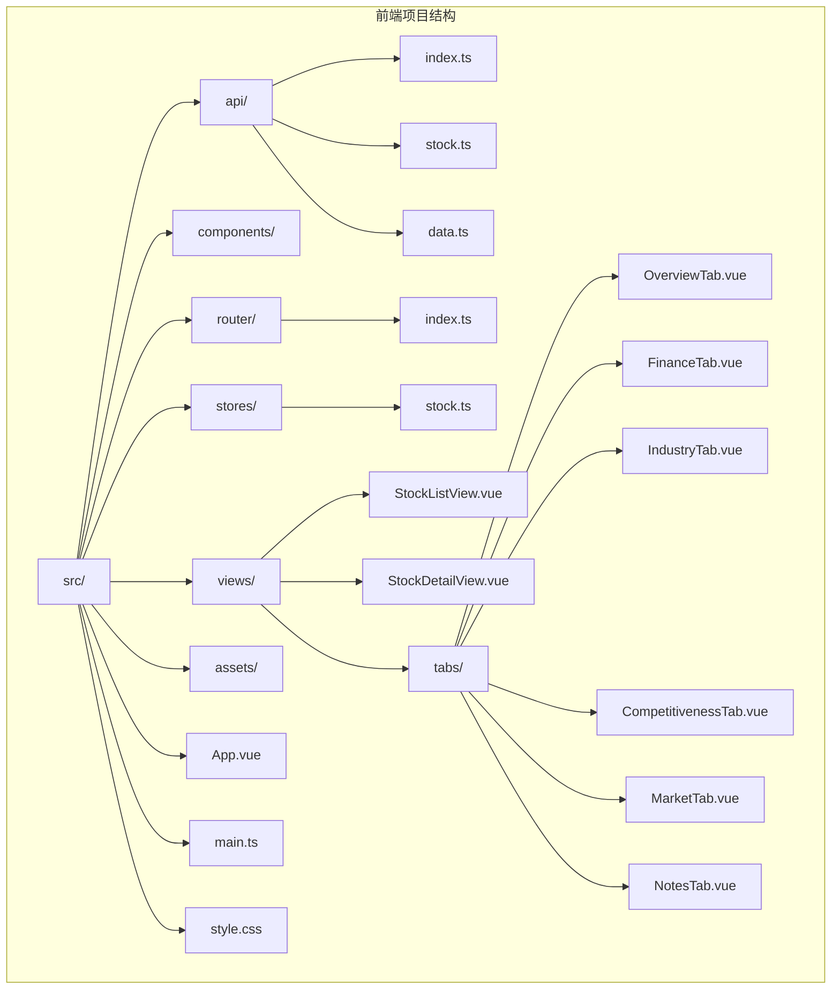
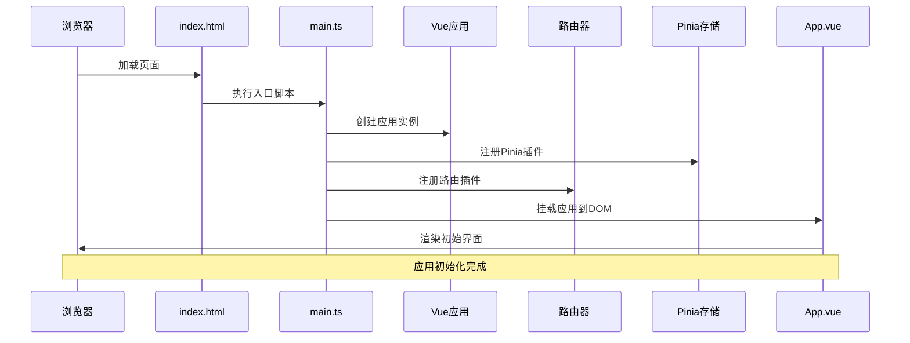
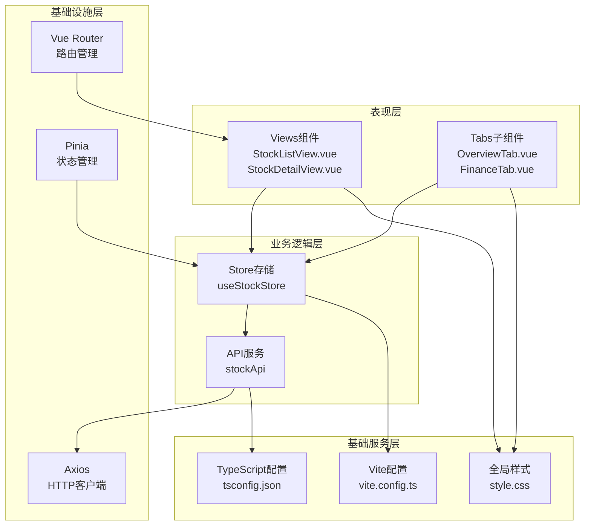
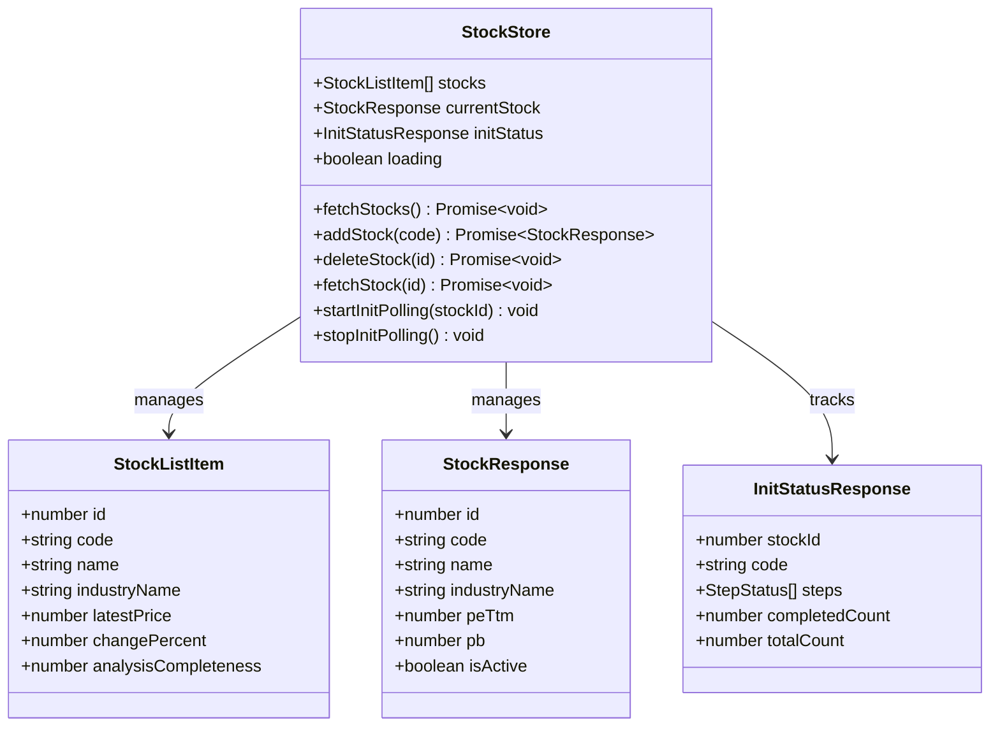
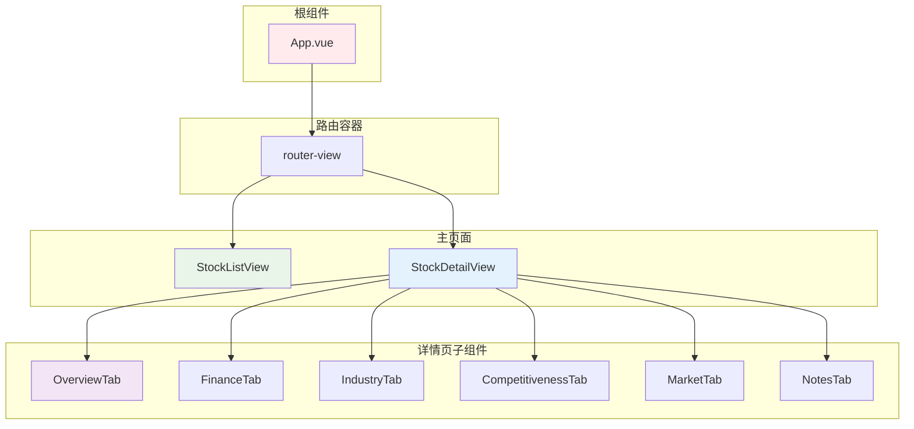
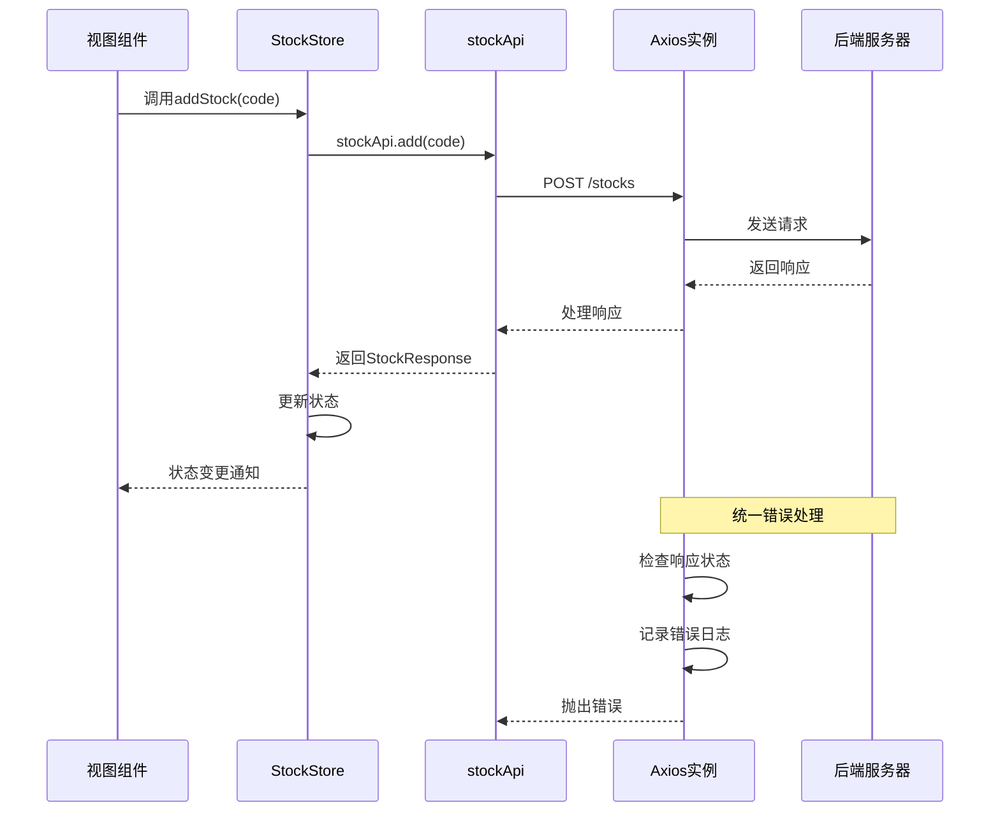

# Vue应用架构

<cite>
**本文档引用的文件**
- [main.ts](file://frontend/src/main.ts)
- [App.vue](file://frontend/src/App.vue)
- [router/index.ts](file://frontend/src/router/index.ts)
- [stores/stock.ts](file://frontend/src/stores/stock.ts)
- [style.css](file://frontend/src/style.css)
- [vite.config.ts](file://frontend/vite.config.ts)
- [package.json](file://frontend/package.json)
- [StockListView.vue](file://frontend/src/views/StockListView.vue)
- [StockDetailView.vue](file://frontend/src/views/StockDetailView.vue)
- [tabs/OverviewTab.vue](file://frontend/src/views/tabs/OverviewTab.vue)
- [tabs/FinanceTab.vue](file://frontend/src/views/tabs/FinanceTab.vue)
- [api/stock.ts](file://frontend/src/api/stock.ts)
- [api/index.ts](file://frontend/src/api/index.ts)
- [components/HelloWorld.vue](file://frontend/src/components/HelloWorld.vue)
- [tsconfig.json](file://frontend/tsconfig.json)
- [index.html](file://frontend/index.html)
</cite>

## 目录
1. [简介](#简介)
2. [项目结构](#项目结构)
3. [核心组件](#核心组件)
4. [架构概览](#架构概览)
5. [详细组件分析](#详细组件分析)
6. [依赖关系分析](#依赖关系分析)
7. [性能考虑](#性能考虑)
8. [故障排除指南](#故障排除指南)
9. [结论](#结论)
10. [附录](#附录)

## 简介

这是一个基于Vue 3构建的股票交易分析系统的前端应用。该应用采用现代前端技术栈，包括Vue 3 Composition API、Pinia状态管理、Vue Router路由管理、Vite构建工具和TypeScript类型支持。应用实现了完整的SPA（单页应用）架构，提供股票列表查看、详情分析、财务数据展示等功能。

## 项目结构

前端项目采用模块化组织结构，主要分为以下几个核心目录：



**图表来源**
- [main.ts:1-11](file://frontend/src/main.ts#L1-L11)
- [router/index.ts:1-28](file://frontend/src/router/index.ts#L1-L28)
- [stores/stock.ts:1-80](file://frontend/src/stores/stock.ts#L1-L80)

**章节来源**
- [main.ts:1-11](file://frontend/src/main.ts#L1-L11)
- [package.json:1-27](file://frontend/package.json#L1-L27)

## 核心组件

### 应用初始化流程

应用的启动过程遵循标准的Vue 3 SPA初始化模式：



**图表来源**
- [main.ts:7-10](file://frontend/src/main.ts#L7-L10)
- [App.vue:1-4](file://frontend/src/App.vue#L1-L4)

### 插件注册机制

应用采用插件化架构，通过Vue的use()方法注册各种功能插件：

**章节来源**
- [main.ts:7-10](file://frontend/src/main.ts#L7-L10)

## 架构概览

应用采用分层架构设计，各层职责明确：



**图表来源**
- [StockListView.vue:50-102](file://frontend/src/views/StockListView.vue#L50-L102)
- [StockDetailView.vue:47-82](file://frontend/src/views/StockDetailView.vue#L47-L82)
- [stores/stock.ts:5-80](file://frontend/src/stores/stock.ts#L5-L80)
- [api/stock.ts:53-61](file://frontend/src/api/stock.ts#L53-L61)

## 详细组件分析

### 股票状态管理

应用使用Pinia实现响应式状态管理，核心状态包括股票列表、当前选中股票和初始化状态：



**图表来源**
- [stores/stock.ts:5-80](file://frontend/src/stores/stock.ts#L5-L80)
- [api/stock.ts:3-51](file://frontend/src/api/stock.ts#L3-L51)

**章节来源**
- [stores/stock.ts:1-80](file://frontend/src/stores/stock.ts#L1-L80)

### 路由系统设计

应用采用嵌套路由设计，支持股票详情页及其子标签页：

```mermaid
flowchart TD
A[/] --> B[StockListView<br/>股票列表]
C[/stocks/:id] --> D[StockDetailView<br/>股票详情]
D --> E[OverviewTab<br/>总览]
D --> F[IndustryTab<br/>产业分析]
D --> G[FinanceTab<br/>财务数据]
D --> H[CompetitivenessTab<br/>竞争力]
D --> I[MarketTab<br/>市场行情]
D --> J[NotesTab<br/>投资笔记]
style A fill:#e1f5fe
style C fill:#f3e5f5
style E fill:#e8f5e8
style F fill:#fff3e0
style G fill:#fce4ec
```

**图表来源**
- [router/index.ts:5-24](file://frontend/src/router/index.ts#L5-L24)

**章节来源**
- [router/index.ts:1-28](file://frontend/src/router/index.ts#L1-L28)

### 组件树结构

应用的核心组件层次结构如下：



**图表来源**
- [App.vue:1-4](file://frontend/src/App.vue#L1-L4)
- [StockListView.vue:1-102](file://frontend/src/views/StockListView.vue#L1-L102)
- [StockDetailView.vue:1-82](file://frontend/src/views/StockDetailView.vue#L1-L82)

**章节来源**
- [StockListView.vue:1-102](file://frontend/src/views/StockListView.vue#L1-L102)
- [StockDetailView.vue:1-82](file://frontend/src/views/StockDetailView.vue#L1-L82)

### API通信层

应用使用Axios封装HTTP请求，提供统一的错误处理机制：



**图表来源**
- [stores/stock.ts:22-28](file://frontend/src/stores/stock.ts#L22-L28)
- [api/stock.ts:53-61](file://frontend/src/api/stock.ts#L53-L61)
- [api/index.ts:9-15](file://frontend/src/api/index.ts#L9-L15)

**章节来源**
- [api/stock.ts:1-61](file://frontend/src/api/stock.ts#L1-L61)
- [api/index.ts:1-18](file://frontend/src/api/index.ts#L1-L18)

## 依赖关系分析

应用的技术栈依赖关系如下：

```mermaid
graph TB
subgraph "运行时依赖"
A[vue@^3.5.32]
B[vue-router@^4.6.4]
C[pinia@^3.0.4]
D[axios@^1.15.0]
end
subgraph "开发时依赖"
E[vite@^8.0.4]
F[@vitejs/plugin-vue@^6.0.5]
G[typescript@~6.0.2]
H[@types/node@^24.12.2]
end
subgraph "应用层"
I[main.ts]
J[App.vue]
K[router/index.ts]
L[stores/stock.ts]
M[views/]
end
I --> A
I --> B
I --> C
J --> A
K --> B
L --> C
M --> A
M --> B
M --> C
I --> E
I --> F
I --> G
I --> H
```

**图表来源**
- [package.json:11-25](file://frontend/package.json#L11-L25)
- [main.ts:1-5](file://frontend/src/main.ts#L1-L5)

**章节来源**
- [package.json:1-27](file://frontend/package.json#L1-L27)

## 性能考虑

### 响应式数据管理

应用采用Vue 3的Composition API和Pinia进行状态管理，具有以下性能优势：

1. **细粒度响应式更新**：使用ref和reactive实现精确的状态追踪
2. **Tree-shaking支持**：按需导入减少包体积
3. **组合式函数复用**：避免重复代码提高维护效率

### 路由懒加载

应用使用动态导入实现路由级别的代码分割：

**章节来源**
- [router/index.ts:9-22](file://frontend/src/router/index.ts#L9-L22)

### 全局样式优化

应用采用CSS自定义属性实现主题定制，支持快速的主题切换：

**章节来源**
- [style.css:1-163](file://frontend/src/style.css#L1-L163)

## 故障排除指南

### 常见问题诊断

1. **API请求失败**
   - 检查后端服务是否正常运行
   - 验证CORS配置
   - 查看浏览器开发者工具Network面板

2. **路由跳转异常**
   - 确认路由配置正确性
   - 检查参数传递是否完整
   - 验证路由守卫逻辑

3. **状态更新不生效**
   - 确认使用storeToRefs正确解构
   - 检查响应式数据的引用关系
   - 验证Pinia插件注册顺序

**章节来源**
- [api/index.ts:9-15](file://frontend/src/api/index.ts#L9-L15)
- [stores/stock.ts:43-65](file://frontend/src/stores/stock.ts#L43-L65)

## 结论

该Vue.js应用架构设计合理，采用了现代前端开发的最佳实践：

1. **清晰的分层架构**：表现层、业务逻辑层、基础设施层职责分离
2. **现代化技术栈**：Vue 3 + TypeScript + Vite + Pinia + Vue Router
3. **良好的可扩展性**：模块化设计便于功能扩展
4. **优秀的开发体验**：完善的TypeScript支持和热重载

应用在股票数据分析场景下提供了完整的解决方案，具备良好的性能表现和用户体验。

## 附录

### 构建配置

应用使用Vite作为构建工具，配置简洁高效：

**章节来源**
- [vite.config.ts:1-8](file://frontend/vite.config.ts#L1-L8)
- [tsconfig.json:1-8](file://frontend/tsconfig.json#L1-L8)
- [index.html:1-14](file://frontend/index.html#L1-L14)

### 组件开发规范

1. **Composition API使用**：优先使用<script setup>语法糖
2. **类型安全**：为所有props和返回值提供TypeScript类型定义
3. **响应式设计**：合理使用ref、reactive和computed
4. **错误处理**：统一的错误捕获和用户提示机制