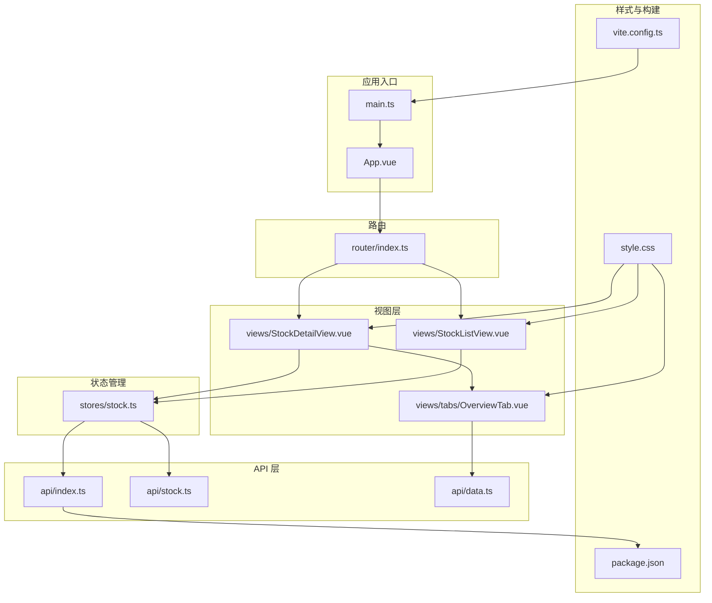
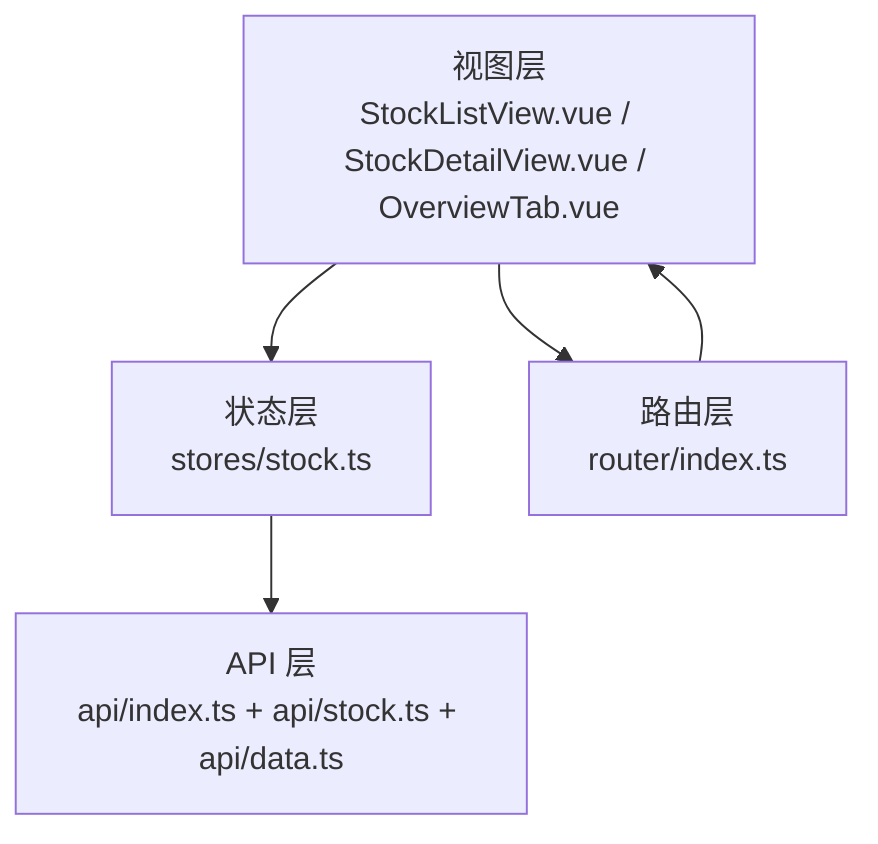
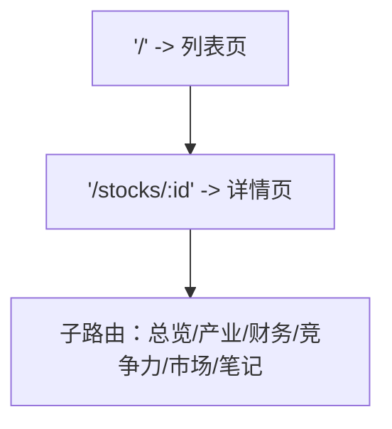
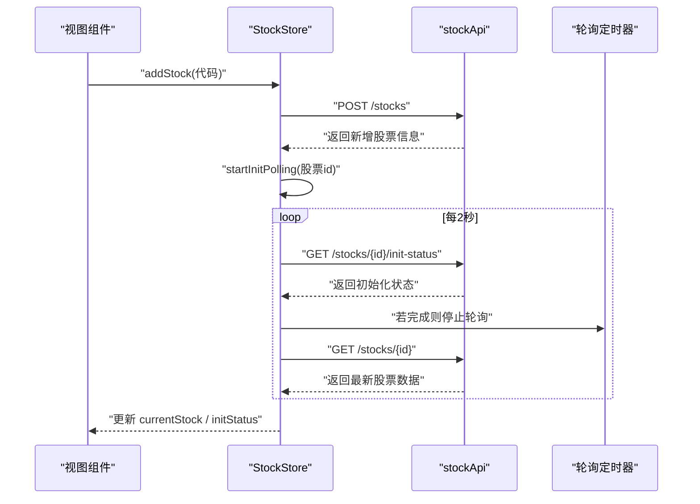
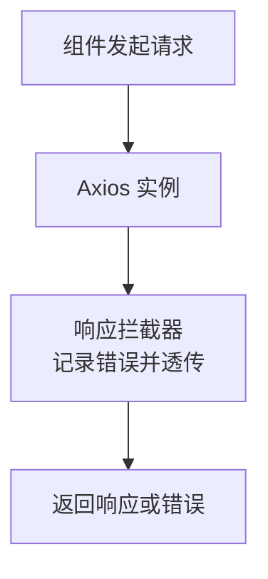
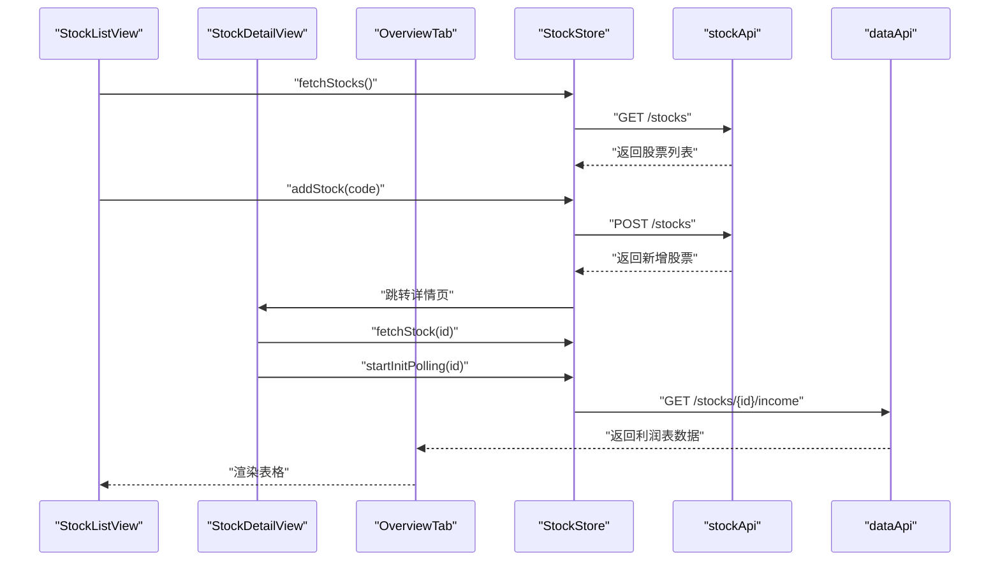
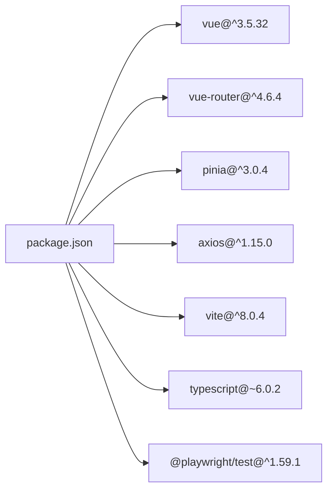

# 前端应用详解

<cite>
**本文引用的文件**
- [main.ts](file://frontend/src/main.ts)
- [App.vue](file://frontend/src/App.vue)
- [router/index.ts](file://frontend/src/router/index.ts)
- [stores/stock.ts](file://frontend/src/stores/stock.ts)
- [api/index.ts](file://frontend/src/api/index.ts)
- [api/stock.ts](file://frontend/src/api/stock.ts)
- [api/data.ts](file://frontend/src/api/data.ts)
- [views/StockListView.vue](file://frontend/src/views/StockListView.vue)
- [views/StockDetailView.vue](file://frontend/src/views/StockDetailView.vue)
- [views/tabs/OverviewTab.vue](file://frontend/src/views/tabs/OverviewTab.vue)
- [style.css](file://frontend/src/style.css)
- [vite.config.ts](file://frontend/vite.config.ts)
- [package.json](file://frontend/package.json)
- [README.md](file://frontend/README.md)
- [e2e/stock.spec.ts](file://frontend/e2e/stock.spec.ts)
</cite>

## 目录
1. [简介](#简介)
2. [项目结构](#项目结构)
3. [核心组件](#核心组件)
4. [架构总览](#架构总览)
5. [详细组件分析](#详细组件分析)
6. [依赖分析](#依赖分析)
7. [性能考虑](#性能考虑)
8. [故障排查指南](#故障排查指南)
9. [结论](#结论)
10. [附录](#附录)

## 简介
本项目是一个基于 Vue 3 + TypeScript 的单页应用（SPA），采用 Composition API、Pinia 状态管理和 Vue Router 路由系统，围绕“股票标的深度分析”场景构建。应用通过 Axios 封装的 API 客户端与后端交互，支持标的列表管理、详情页多标签页展示、初始化进度轮询、以及基础的数据表格展示与格式化。

## 项目结构
前端工程采用按功能域划分的目录组织方式：
- 入口与根组件：应用挂载入口、根组件负责路由视图渲染
- 路由：集中定义页面级路由与嵌套路由
- 状态管理：Pinia Store 集中式管理股票列表、当前选中股票、初始化状态与加载态
- 视图层：页面与标签页组件，使用 Composition API 与模板语法
- API 层：统一的 Axios 实例与各业务模块 API 模块
- 样式：CSS 变量与通用样式类，支持主题色与卡片布局
- 构建：Vite 配置与 TypeScript 支持

图表来源
- [main.ts:1-11](file://frontend/src/main.ts#L1-L11)
- [App.vue:1-4](file://frontend/src/App.vue#L1-L4)
- [router/index.ts:1-28](file://frontend/src/router/index.ts#L1-L28)
- [stores/stock.ts:1-80](file://frontend/src/stores/stock.ts#L1-L80)
- [api/index.ts:1-18](file://frontend/src/api/index.ts#L1-L18)
- [api/stock.ts:1-61](file://frontend/src/api/stock.ts#L1-L61)
- [api/data.ts:1-169](file://frontend/src/api/data.ts#L1-L169)
- [views/StockListView.vue:1-102](file://frontend/src/views/StockListView.vue#L1-L102)
- [views/StockDetailView.vue:1-82](file://frontend/src/views/StockDetailView.vue#L1-L82)
- [views/tabs/OverviewTab.vue:1-86](file://frontend/src/views/tabs/OverviewTab.vue#L1-L86)
- [style.css:1-163](file://frontend/src/style.css#L1-L163)
- [vite.config.ts:1-8](file://frontend/vite.config.ts#L1-L8)
- [package.json:1-27](file://frontend/package.json#L1-L27)

章节来源
- [main.ts:1-11](file://frontend/src/main.ts#L1-L11)
- [router/index.ts:1-28](file://frontend/src/router/index.ts#L1-L28)
- [package.json:1-27](file://frontend/package.json#L1-L27)

## 核心组件
- 应用入口与挂载：创建 Vue 应用实例，注册 Pinia 与路由，挂载到 DOM
- 根组件：提供单一出口，交由路由渲染对应视图
- 路由系统：定义首页列表与股票详情页及其子标签页的懒加载路由
- 状态管理：集中维护股票列表、当前股票、初始化状态与加载标志，并提供增删查与轮询控制方法
- API 客户端：统一的 Axios 实例，设置基础地址与超时，全局响应拦截器用于日志与错误透传
- 视图组件：列表页负责新增、删除与展示；详情页负责初始化进度条与标签页导航；标签页负责具体数据展示

章节来源
- [main.ts:1-11](file://frontend/src/main.ts#L1-L11)
- [App.vue:1-4](file://frontend/src/App.vue#L1-L4)
- [router/index.ts:1-28](file://frontend/src/router/index.ts#L1-L28)
- [stores/stock.ts:1-80](file://frontend/src/stores/stock.ts#L1-L80)
- [api/index.ts:1-18](file://frontend/src/api/index.ts#L1-L18)

## 架构总览
应用采用“视图-状态-API”的分层架构：
- 视图层：使用 Composition API 编写逻辑，模板负责渲染
- 状态层：Pinia Store 提供响应式状态与副作用（如轮询）
- API 层：Axios 实例封装请求与错误处理，业务模块导出 API 方法
- 路由层：集中管理页面与嵌套路由，支持动态参数与子视图切换

图表来源
- [views/StockListView.vue:1-102](file://frontend/src/views/StockListView.vue#L1-L102)
- [views/StockDetailView.vue:1-82](file://frontend/src/views/StockDetailView.vue#L1-L82)
- [views/tabs/OverviewTab.vue:1-86](file://frontend/src/views/tabs/OverviewTab.vue#L1-L86)
- [stores/stock.ts:1-80](file://frontend/src/stores/stock.ts#L1-L80)
- [api/index.ts:1-18](file://frontend/src/api/index.ts#L1-L18)
- [api/stock.ts:1-61](file://frontend/src/api/stock.ts#L1-L61)
- [api/data.ts:1-169](file://frontend/src/api/data.ts#L1-L169)
- [router/index.ts:1-28](file://frontend/src/router/index.ts#L1-L28)

## 详细组件分析

### 应用入口与根组件
- 入口文件负责创建应用实例、安装 Pinia 与路由，并挂载到 DOM
- 根组件仅包含一个路由出口，交由路由系统决定渲染内容

章节来源
- [main.ts:1-11](file://frontend/src/main.ts#L1-L11)
- [App.vue:1-4](file://frontend/src/App.vue#L1-L4)

### 路由系统
- 首页路由指向列表视图，详情路由带参数 id，并在详情页内嵌套多个标签页
- 使用动态导入实现路由级别的代码分割，提升首屏性能

图表来源
- [router/index.ts:1-28](file://frontend/src/router/index.ts#L1-L28)

章节来源
- [router/index.ts:1-28](file://frontend/src/router/index.ts#L1-L28)

### 状态管理（Pinia Store）
- 状态：股票列表、当前股票、初始化状态、加载标志
- 行为：获取列表、新增股票、删除股票、获取单只股票、启动/停止初始化轮询
- 轮询机制：定时器轮询初始化状态，完成后刷新数据并重定向当前标签页

图表来源
- [stores/stock.ts:22-78](file://frontend/src/stores/stock.ts#L22-L78)
- [api/stock.ts:53-60](file://frontend/src/api/stock.ts#L53-L60)

章节来源
- [stores/stock.ts:1-80](file://frontend/src/stores/stock.ts#L1-L80)
- [api/stock.ts:1-61](file://frontend/src/api/stock.ts#L1-L61)

### API 客户端与错误处理
- Axios 实例：设置基础地址与超时
- 响应拦截器：统一记录错误并透传错误对象，便于上层捕获与提示
- 业务 API：按领域拆分，如股票、资金流、财务、指标等

图表来源
- [api/index.ts:1-18](file://frontend/src/api/index.ts#L1-L18)
- [api/stock.ts:53-60](file://frontend/src/api/stock.ts#L53-L60)
- [api/data.ts:145-168](file://frontend/src/api/data.ts#L145-L168)

章节来源
- [api/index.ts:1-18](file://frontend/src/api/index.ts#L1-L18)
- [api/stock.ts:1-61](file://frontend/src/api/stock.ts#L1-L61)
- [api/data.ts:1-169](file://frontend/src/api/data.ts#L1-L169)

### 视图组件与数据展示
- 列表页：输入框与按钮添加新股票，表格展示字段并格式化显示；删除确认与错误提示
- 详情页：展示股票基础信息与估值指标，初始化进度条与标签页导航；监听初始化完成事件刷新数据并强制当前标签页重新渲染
- 标签页：如总览页从财务 API 获取最近利润表数据并格式化展示

图表来源
- [views/StockListView.vue:50-102](file://frontend/src/views/StockListView.vue#L50-L102)
- [views/StockDetailView.vue:47-82](file://frontend/src/views/StockDetailView.vue#L47-L82)
- [views/tabs/OverviewTab.vue:45-86](file://frontend/src/views/tabs/OverviewTab.vue#L45-L86)
- [stores/stock.ts:12-41](file://frontend/src/stores/stock.ts#L12-L41)
- [api/stock.ts:53-60](file://frontend/src/api/stock.ts#L53-L60)
- [api/data.ts:145-147](file://frontend/src/api/data.ts#L145-L147)

章节来源
- [views/StockListView.vue:1-102](file://frontend/src/views/StockListView.vue#L1-L102)
- [views/StockDetailView.vue:1-82](file://frontend/src/views/StockDetailView.vue#L1-L82)
- [views/tabs/OverviewTab.vue:1-86](file://frontend/src/views/tabs/OverviewTab.vue#L1-L86)

### 组件设计原则
- 单一职责：每个组件聚焦于特定页面或标签页的功能
- 组合优先：使用 Composition API 抽取可复用逻辑（如格式化函数）
- 响应式优先：通过 ref 与 storeToRefs 将状态暴露给模板
- 懒加载路由：减少首屏资源体积
- 类型安全：接口定义清晰的数据结构，增强可维护性

章节来源
- [views/StockListView.vue:50-102](file://frontend/src/views/StockListView.vue#L50-L102)
- [views/StockDetailView.vue:47-82](file://frontend/src/views/StockDetailView.vue#L47-L82)
- [views/tabs/OverviewTab.vue:45-86](file://frontend/src/views/tabs/OverviewTab.vue#L45-L86)
- [api/stock.ts:3-38](file://frontend/src/api/stock.ts#L3-L38)
- [api/data.ts:25-99](file://frontend/src/api/data.ts#L25-L99)

### 样式管理方案
- CSS 变量：定义主题色、背景、边框、圆角等，统一风格
- 语义化类名：卡片、按钮、标签、表格等通用样式
- 响应式与网格：卡片标题、表格对齐、正负颜色等

章节来源
- [style.css:1-163](file://frontend/src/style.css#L1-L163)

## 依赖分析
- 运行时依赖：Vue 3、Vue Router、Pinia、Axios
- 开发依赖：Vite、@vitejs/plugin-vue、TypeScript、Playwright 测试工具
- 构建配置：Vite 插件启用 Vue 单文件组件支持

图表来源
- [package.json:1-27](file://frontend/package.json#L1-L27)

章节来源
- [package.json:1-27](file://frontend/package.json#L1-L27)
- [vite.config.ts:1-8](file://frontend/vite.config.ts#L1-L8)

## 性能考虑
- 代码分割：路由懒加载减少初始包体
- 组件懒加载：通过动态导入按需加载视图与标签页
- 轮询节流：初始化轮询间隔 2 秒，避免频繁请求
- 列表渲染优化：使用 v-for 与 key，避免不必要的重排
- 样式复用：CSS 变量与通用类减少重复样式

章节来源
- [router/index.ts:9,14,17,20,21](file://frontend/src/router/index.ts#L9,L14,L17,L20,L21)
- [stores/stock.ts:43-58](file://frontend/src/stores/stock.ts#L43-L58)
- [views/StockListView.vue:28,42](file://frontend/src/views/StockListView.vue#L28,L42)

## 故障排查指南
- 请求失败：检查响应拦截器输出的日志，定位后端错误信息
- 初始化未完成：确认轮询是否启动与停止，检查初始化状态接口返回
- 页面空白或路由不生效：确认路由懒加载路径与命名路由一致
- E2E 失败：使用 Playwright 测试脚本验证路由与交互行为

章节来源
- [api/index.ts:8-15](file://frontend/src/api/index.ts#L8-L15)
- [stores/stock.ts:43-65](file://frontend/src/stores/stock.ts#L43-L65)
- [e2e/stock.spec.ts:1-67](file://frontend/e2e/stock.spec.ts#L1-L67)

## 结论
该前端应用以 Vue 3 Composition API 为核心，结合 Pinia 实现清晰的状态管理，配合 Vue Router 的嵌套路由与懒加载，构建了可扩展的单页应用。通过统一的 API 客户端与类型化接口，提升了开发效率与可维护性。建议后续引入更完善的错误边界、加载骨架与缓存策略，进一步提升用户体验与性能表现。

## 附录
- 开发与运行：使用 Vite 启动开发服务器，构建产物位于 dist 目录
- 测试：Playwright 脚本覆盖列表页、详情页与标签页的基本交互

章节来源
- [README.md:1-6](file://frontend/README.md#L1-L6)
- [vite.config.ts:1-8](file://frontend/vite.config.ts#L1-L8)
- [e2e/stock.spec.ts:1-67](file://frontend/e2e/stock.spec.ts#L1-L67)