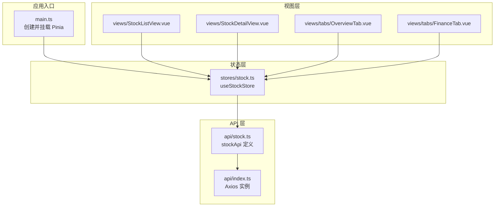
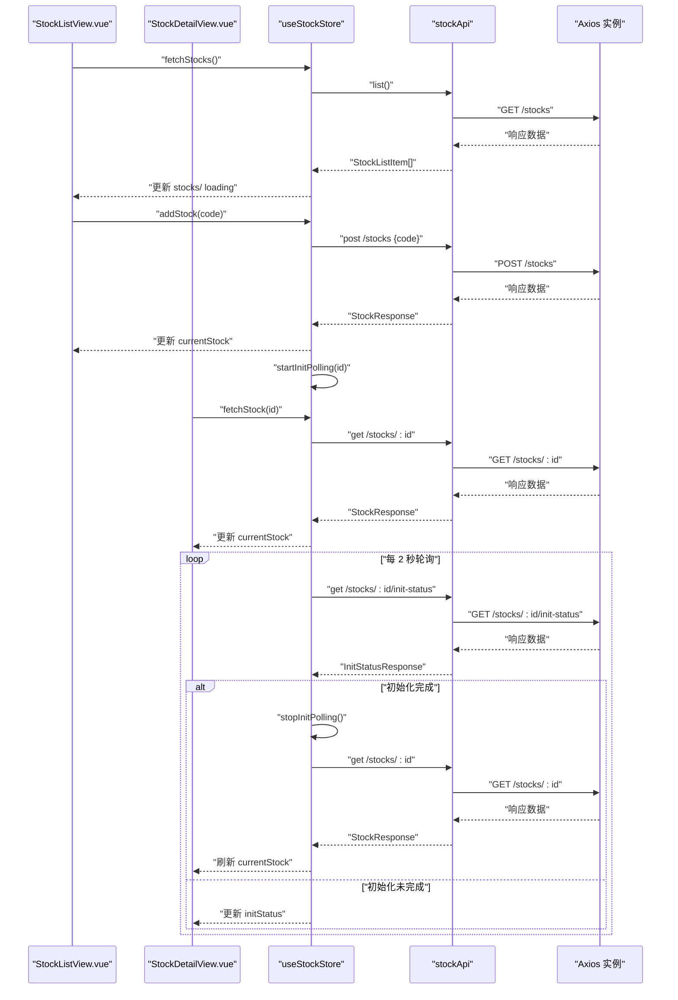
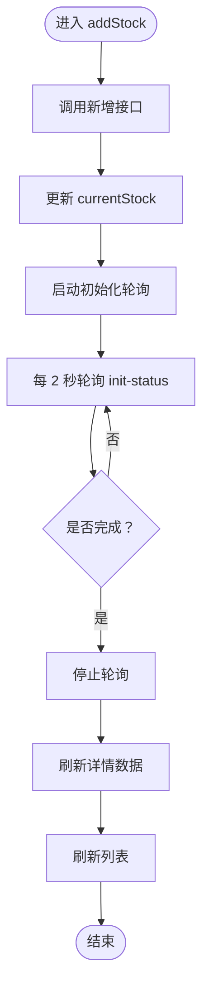
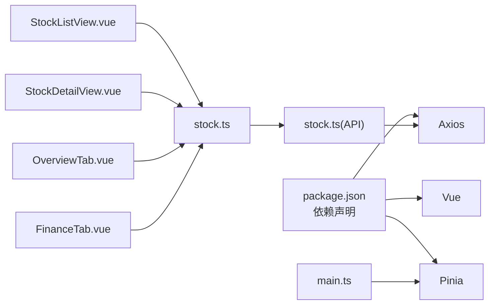

# 状态管理

<cite>
**本文引用的文件**
- [frontend/src/main.ts](file://frontend/src/main.ts)
- [frontend/package.json](file://frontend/package.json)
- [frontend/src/stores/stock.ts](file://frontend/src/stores/stock.ts)
- [frontend/src/api/index.ts](file://frontend/src/api/index.ts)
- [frontend/src/api/stock.ts](file://frontend/src/api/stock.ts)
- [frontend/src/views/StockListView.vue](file://frontend/src/views/StockListView.vue)
- [frontend/src/views/StockDetailView.vue](file://frontend/src/views/StockDetailView.vue)
- [frontend/src/views/tabs/OverviewTab.vue](file://frontend/src/views/tabs/OverviewTab.vue)
- [frontend/src/views/tabs/FinanceTab.vue](file://frontend/src/views/tabs/FinanceTab.vue)
</cite>

## 目录
1. [引言](#引言)
2. [项目结构](#项目结构)
3. [核心组件](#核心组件)
4. [架构总览](#架构总览)
5. [详细组件分析](#详细组件分析)
6. [依赖分析](#依赖分析)
7. [性能考虑](#性能考虑)
8. [故障排查指南](#故障排查指南)
9. [结论](#结论)
10. [附录](#附录)

## 引言
本文件围绕前端项目中的 Pinia 状态管理进行系统化说明，涵盖状态管理模式、Store 设计原则、状态持久化策略、状态定义与 Getter 计算属性、Action 异步操作、状态模块化组织、跨组件状态共享、状态调试工具使用、状态与 API 的数据同步、状态更新优化、状态回滚机制以及最佳实践与性能优化建议。本文以现有代码为依据，结合仓库中的 Store、API 层与视图组件，给出可操作的指导。

## 项目结构
前端采用 Vue 3 + Pinia 架构，状态集中在 stores 目录，API 请求封装在 api 目录，页面通过 views 与 tabs 组织，路由驱动页面切换。Pinia 在入口处初始化并挂载到应用实例上，全局生效。

图表来源
- [frontend/src/main.ts:1-11](file://frontend/src/main.ts#L1-L11)
- [frontend/src/stores/stock.ts:1-80](file://frontend/src/stores/stock.ts#L1-L80)
- [frontend/src/api/index.ts:1-18](file://frontend/src/api/index.ts#L1-L18)
- [frontend/src/api/stock.ts:1-61](file://frontend/src/api/stock.ts#L1-L61)
- [frontend/src/views/StockListView.vue:1-102](file://frontend/src/views/StockListView.vue#L1-L102)
- [frontend/src/views/StockDetailView.vue:1-82](file://frontend/src/views/StockDetailView.vue#L1-L82)
- [frontend/src/views/tabs/OverviewTab.vue:1-86](file://frontend/src/views/tabs/OverviewTab.vue#L1-L86)
- [frontend/src/views/tabs/FinanceTab.vue:1-77](file://frontend/src/views/tabs/FinanceTab.vue#L1-L77)

章节来源
- [frontend/src/main.ts:1-11](file://frontend/src/main.ts#L1-L11)
- [frontend/package.json:1-27](file://frontend/package.json#L1-L27)

## 核心组件
- Pinia 初始化：在应用入口创建并注册 Pinia，确保全局可用。
- 股票状态 Store（useStockStore）：集中管理股票列表、当前选中股票、初始化进度、加载状态，并提供增删查、轮询初始化状态等 Action。
- API 封装：统一的 Axios 实例与 stockApi 接口，屏蔽底层细节，便于调用与测试。
- 视图组件：列表页、详情页与多个标签页组件通过 Store 进行状态读取与交互。

章节来源
- [frontend/src/stores/stock.ts:1-80](file://frontend/src/stores/stock.ts#L1-L80)
- [frontend/src/api/stock.ts:1-61](file://frontend/src/api/stock.ts#L1-L61)
- [frontend/src/api/index.ts:1-18](file://frontend/src/api/index.ts#L1-L18)
- [frontend/src/views/StockListView.vue:1-102](file://frontend/src/views/StockListView.vue#L1-L102)
- [frontend/src/views/StockDetailView.vue:1-82](file://frontend/src/views/StockDetailView.vue#L1-L82)
- [frontend/src/views/tabs/OverviewTab.vue:1-86](file://frontend/src/views/tabs/OverviewTab.vue#L1-L86)
- [frontend/src/views/tabs/FinanceTab.vue:1-77](file://frontend/src/views/tabs/FinanceTab.vue#L1-L77)

## 架构总览
下图展示从视图到状态再到 API 的端到端流程，包括初始化轮询与数据刷新的关键路径。

图表来源
- [frontend/src/views/StockListView.vue:50-80](file://frontend/src/views/StockListView.vue#L50-L80)
- [frontend/src/views/StockDetailView.vue:47-80](file://frontend/src/views/StockDetailView.vue#L47-L80)
- [frontend/src/stores/stock.ts:12-78](file://frontend/src/stores/stock.ts#L12-L78)
- [frontend/src/api/stock.ts:53-60](file://frontend/src/api/stock.ts#L53-L60)
- [frontend/src/api/index.ts:1-18](file://frontend/src/api/index.ts#L1-L18)

## 详细组件分析

### 状态模式与 Store 设计原则
- 函数式 Store：使用 defineStore 返回一个组合式函数，内部通过 ref 声明响应式状态，返回方法作为 Actions，符合 Composition API 的可组合性与逻辑复用。
- 单一职责：Stock Store 聚焦于“股票集合、当前股票、初始化状态、加载状态”的管理，避免状态分散。
- 明确边界：API 请求通过独立模块封装，Store 仅负责状态与调度，不直接处理网络细节。

章节来源
- [frontend/src/stores/stock.ts:1-80](file://frontend/src/stores/stock.ts#L1-L80)

### 状态定义与 Getter 计算属性
- 状态字段
  - 股票列表：用于列表页展示与筛选。
  - 当前股票：用于详情页与各标签页渲染。
  - 初始化状态：用于展示初始化进度与步骤。
  - 加载状态：用于 UI 阻塞与提示。
- Getter 计算属性
  - 当前组件中未显式定义 Getter；如需派生状态（例如基于 stocks 的过滤或聚合），可在 Store 内部以 computed 形式提供，保持与响应式状态的联动。

章节来源
- [frontend/src/stores/stock.ts:5-10](file://frontend/src/stores/stock.ts#L5-L10)
- [frontend/src/views/StockListView.vue:50-56](file://frontend/src/views/StockListView.vue#L50-L56)
- [frontend/src/views/StockDetailView.vue:47-56](file://frontend/src/views/StockDetailView.vue#L47-L56)

### Action 异步操作
- 列表加载：fetchStocks 发起请求后设置 loading 并更新 stocks。
- 新增标的：addStock 调用接口后更新 currentStock，并启动初始化轮询，随后刷新列表。
- 删除标的：deleteStock 调用接口后从本地列表移除并清理当前选中项。
- 获取详情：fetchStock 更新 currentStock。
- 初始化轮询：startInitPolling 每 2 秒查询初始化状态，完成后停止轮询并刷新详情数据。
- 停止轮询：stopInitPolling 清理定时器，避免内存泄漏与重复轮询。

图表来源
- [frontend/src/stores/stock.ts:22-65](file://frontend/src/stores/stock.ts#L22-L65)

章节来源
- [frontend/src/stores/stock.ts:12-78](file://frontend/src/stores/stock.ts#L12-L78)

### 状态模块化组织
- 文件级模块：每个 Store 放置于独立文件，按领域划分（如 stock.ts），便于维护与测试。
- 组件内局部状态：视图组件仍保留自身局部状态（如输入框、按钮禁用标志），与全局状态解耦，避免 Store 过载。
- API 模块化：API 请求按资源分组（如 stock.ts），统一通过 Axios 实例发送，便于拦截与错误处理。

章节来源
- [frontend/src/stores/stock.ts:1-80](file://frontend/src/stores/stock.ts#L1-L80)
- [frontend/src/api/stock.ts:1-61](file://frontend/src/api/stock.ts#L1-L61)
- [frontend/src/views/StockListView.vue:50-80](file://frontend/src/views/StockListView.vue#L50-L80)

### 跨组件状态共享
- 全局 Store：通过 Pinia 提供的全局状态，列表页、详情页与各标签页共享同一份状态，保证数据一致性。
- 组件间通信：通过 storeToRefs 将 Store 状态转为可响应的 refs，供模板与逻辑使用，减少 props 传递层级。

章节来源
- [frontend/src/views/StockListView.vue:50-56](file://frontend/src/views/StockListView.vue#L50-L56)
- [frontend/src/views/StockDetailView.vue:47-56](file://frontend/src/views/StockDetailView.vue#L47-L56)
- [frontend/src/views/tabs/OverviewTab.vue:45-54](file://frontend/src/views/tabs/OverviewTab.vue#L45-L54)
- [frontend/src/views/tabs/FinanceTab.vue:57-65](file://frontend/src/views/tabs/FinanceTab.vue#L57-L65)

### 状态调试工具使用
- 浏览器扩展：安装 Vue DevTools 与 Pinia Devtools，可在开发阶段观察 Store 的状态变更、Action 调用与时间旅行。
- 控制台日志：Axios 拦截器输出错误信息，便于定位网络问题；Store 中可增加必要的日志记录辅助定位。
- 断点调试：在关键 Action（如轮询、刷新）与 watch 回调中设置断点，观察状态变化轨迹。

章节来源
- [frontend/src/api/index.ts:8-15](file://frontend/src/api/index.ts#L8-L15)
- [frontend/src/stores/stock.ts:43-65](file://frontend/src/stores/stock.ts#L43-L65)

### 状态与 API 的数据同步
- 同步策略
  - 列表页：首次进入时拉取列表，后续通过新增/删除动作触发刷新。
  - 详情页：进入时拉取详情，初始化完成后轮询更新，完成后再次拉取以获取最新数据。
  - 标签页：各自独立发起 API 请求，不依赖 Store，避免 Store 过度膨胀。
- 错误处理：Axios 拦截器统一处理错误，Store 在关键位置捕获异常并停止轮询，防止死循环。

章节来源
- [frontend/src/views/StockListView.vue:60-62](file://frontend/src/views/StockListView.vue#L60-L62)
- [frontend/src/views/StockDetailView.vue:61-69](file://frontend/src/views/StockDetailView.vue#L61-L69)
- [frontend/src/views/tabs/OverviewTab.vue:58-64](file://frontend/src/views/tabs/OverviewTab.vue#L58-L64)
- [frontend/src/views/tabs/FinanceTab.vue:67-72](file://frontend/src/views/tabs/FinanceTab.vue#L67-L72)
- [frontend/src/api/index.ts:8-15](file://frontend/src/api/index.ts#L8-L15)

### 状态更新优化
- 批量更新：在新增成功后先更新 currentStock，再统一刷新列表，减少多次渲染。
- 条件刷新：初始化完成后才刷新详情与标签页，避免不必要的重渲染。
- 轮询节流：固定间隔 2 秒，避免过于频繁的请求；在组件卸载时及时停止轮询。
- 局部状态：列表页与详情页各自维护局部状态，降低全局状态变更频率。

章节来源
- [frontend/src/stores/stock.ts:22-28](file://frontend/src/stores/stock.ts#L22-L28)
- [frontend/src/stores/stock.ts:43-65](file://frontend/src/stores/stock.ts#L43-L65)
- [frontend/src/views/StockDetailView.vue:71-80](file://frontend/src/views/StockDetailView.vue#L71-L80)

### 状态回滚机制
- 现状：当前代码未实现显式的“撤销/回滚”功能。
- 建议方案
  - 时间旅行：借助 Pinia Devtools 的时间旅行能力，在开发阶段快速回退到历史状态。
  - 自定义回滚：在 Store 中维护状态快照数组，提供 undo/redo 方法；仅对关键字段（如新增/删除）启用。
  - 乐观更新 + 失败回滚：在 Action 中先本地更新，若请求失败则恢复到上次快照。

章节来源
- [frontend/src/stores/stock.ts:12-78](file://frontend/src/stores/stock.ts#L12-L78)

## 依赖分析
- 外部依赖
  - Vue 3：组合式 API 与响应式系统。
  - Pinia：状态管理库，提供 Store 与 Devtools 支持。
  - Axios：HTTP 客户端，统一拦截与错误处理。
- 内部依赖
  - main.ts 注入 Pinia。
  - views 依赖 stores 与 api。
  - stores 依赖 api。

图表来源
- [frontend/package.json:11-25](file://frontend/package.json#L11-L25)
- [frontend/src/main.ts:1-11](file://frontend/src/main.ts#L1-L11)
- [frontend/src/stores/stock.ts:1-80](file://frontend/src/stores/stock.ts#L1-L80)
- [frontend/src/api/stock.ts:1-61](file://frontend/src/api/stock.ts#L1-L61)
- [frontend/src/api/index.ts:1-18](file://frontend/src/api/index.ts#L1-L18)

章节来源
- [frontend/package.json:1-27](file://frontend/package.json#L1-L27)
- [frontend/src/main.ts:1-11](file://frontend/src/main.ts#L1-L11)

## 性能考虑
- 渲染优化
  - 使用 storeToRefs 将 Store 状态转为 refs，避免不必要的响应式开销。
  - 列表渲染使用 v-for 与稳定 key，减少 DOM 重排。
- 网络优化
  - 合理设置超时与重试策略，避免长时间阻塞 UI。
  - 对高频轮询（如初始化进度）采用固定间隔与及时停止。
- 内存管理
  - 组件卸载时务必停止轮询与定时器，防止内存泄漏。
- 缓存策略
  - 对静态数据（如基础信息）可考虑短期缓存，减少重复请求。
  - 对实时数据（如行情）遵循“按需拉取”，避免过度缓存导致过期。

章节来源
- [frontend/src/views/StockListView.vue:50-56](file://frontend/src/views/StockListView.vue#L50-L56)
- [frontend/src/views/StockDetailView.vue:67-69](file://frontend/src/views/StockDetailView.vue#L67-L69)
- [frontend/src/api/index.ts:3-6](file://frontend/src/api/index.ts#L3-L6)

## 故障排查指南
- 网络错误
  - 现象：接口报错或无响应。
  - 排查：检查 Axios 拦截器输出、后端服务连通性、请求参数与权限。
- 初始化轮询异常
  - 现象：轮询卡住或重复执行。
  - 排查：确认 startInitPolling 与 stopInitPolling 的配对调用；在组件卸载时停止轮询。
- 数据不一致
  - 现象：新增后列表未刷新或详情未更新。
  - 排查：确认 Action 中的刷新顺序与条件判断；检查 watch 回调触发逻辑。
- 开发调试
  - 使用 Pinia Devtools 观察状态变化；在关键位置设置断点定位问题。

章节来源
- [frontend/src/api/index.ts:8-15](file://frontend/src/api/index.ts#L8-L15)
- [frontend/src/stores/stock.ts:43-65](file://frontend/src/stores/stock.ts#L43-L65)
- [frontend/src/views/StockDetailView.vue:71-80](file://frontend/src/views/StockDetailView.vue#L71-L80)

## 结论
本项目采用函数式 Pinia Store 与组合式 API，实现了清晰的状态定义、完善的异步 Action 与良好的跨组件共享机制。通过统一的 API 封装与轮询策略，保障了状态与后端数据的同步。建议在生产环境中引入更完善的错误处理、缓存与回滚机制，并持续利用调试工具提升可观测性与稳定性。

## 附录
- 状态持久化策略
  - 开发阶段：可借助浏览器扩展或插件进行状态持久化与导入导出。
  - 生产阶段：根据业务需求选择合适的持久化方案（如本地存储、IndexedDB 或服务端会话），注意敏感数据的安全与合规。
- 最佳实践清单
  - 将 Store 作为单一事实来源，避免在组件内重复维护相同状态。
  - 对高频轮询与长连接进行节流与清理。
  - 使用类型化 API 定义，提升可维护性与 IDE 支持。
  - 为关键 Action 添加日志与监控，便于问题追踪。