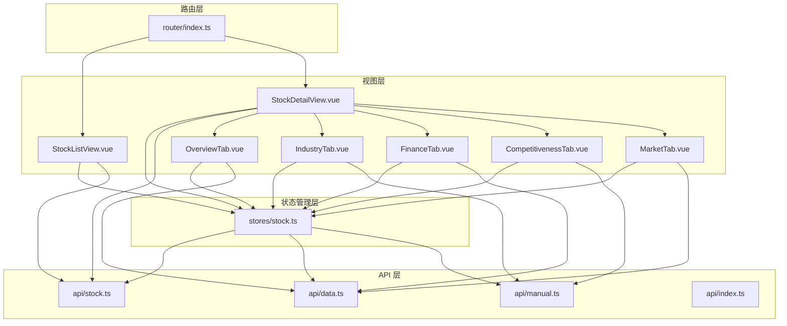
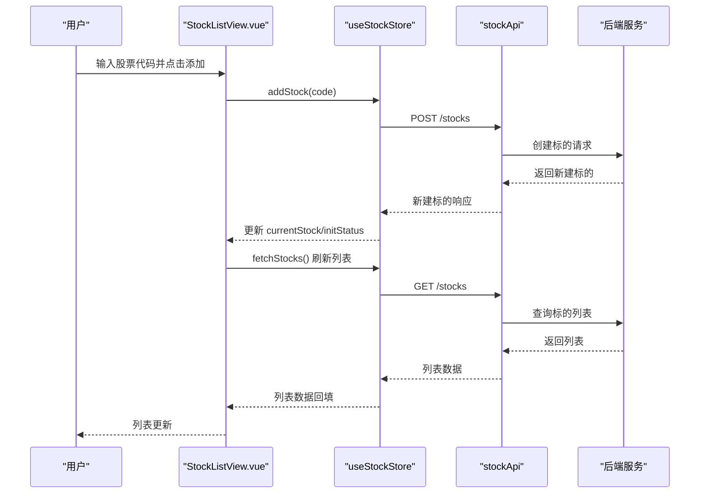
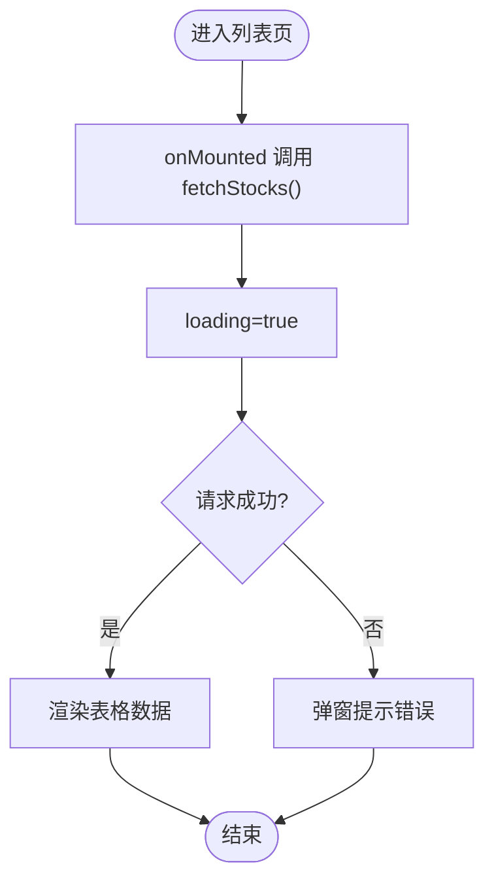
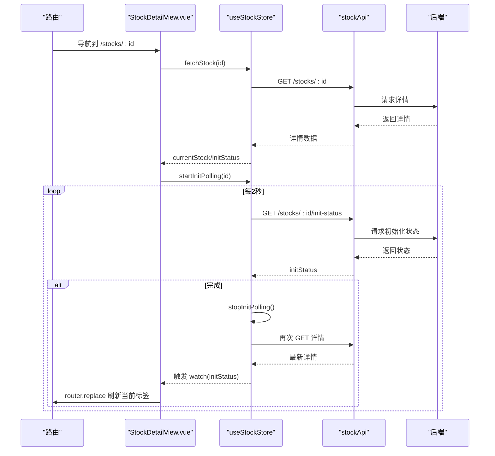
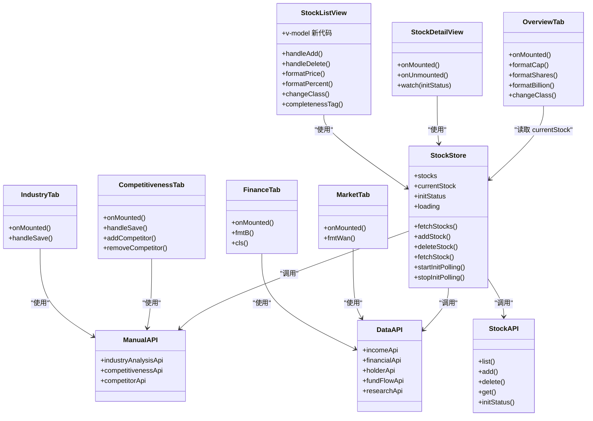

# 业务组件

<cite>
**本文引用的文件**
- [StockListView.vue](file://frontend/src/views/StockListView.vue)
- [StockDetailView.vue](file://frontend/src/views/StockDetailView.vue)
- [OverviewTab.vue](file://frontend/src/views/tabs/OverviewTab.vue)
- [IndustryTab.vue](file://frontend/src/views/tabs/IndustryTab.vue)
- [FinanceTab.vue](file://frontend/src/views/tabs/FinanceTab.vue)
- [CompetitivenessTab.vue](file://frontend/src/views/tabs/CompetitivenessTab.vue)
- [MarketTab.vue](file://frontend/src/views/tabs/MarketTab.vue)
- [stock.ts](file://frontend/src/stores/stock.ts)
- [index.ts（路由）](file://frontend/src/router/index.ts)
- [stock.ts（API）](file://frontend/src/api/stock.ts)
- [data.ts（API）](file://frontend/src/api/data.ts)
- [manual.ts（API）](file://frontend/src/api/manual.ts)
- [index.ts（API 基础）](file://frontend/src/api/index.ts)
- [main.ts](file://frontend/src/main.ts)
- [App.vue](file://frontend/src/App.vue)
- [package.json](file://frontend/package.json)
</cite>

## 目录
1. [简介](#简介)
2. [项目结构](#项目结构)
3. [核心组件](#核心组件)
4. [架构总览](#架构总览)
5. [详细组件分析](#详细组件分析)
6. [依赖关系分析](#依赖关系分析)
7. [性能考虑](#性能考虑)
8. [故障排查指南](#故障排查指南)
9. [结论](#结论)
10. [附录：使用示例与扩展指南](#附录使用示例与扩展指南)

## 简介
本文件聚焦于股票交易系统的业务组件，围绕“股票列表组件”“股票详情组件”“分析标签页组件”展开，系统阐述组件的数据绑定、状态管理、事件处理机制；解释组件与 Pinia 的集成方式、API 数据的获取与展示逻辑；说明组件间通信模式、路由集成以及错误处理策略，并提供可操作的使用示例与扩展建议。

## 项目结构
前端采用 Vue 3 + TypeScript + Pinia + Vue Router 架构，业务组件位于 views 与 views/tabs 下，状态管理集中在 stores 中，API 层按领域拆分在 api 目录下。

图表来源
- [StockListView.vue:1-102](file://frontend/src/views/StockListView.vue#L1-L102)
- [StockDetailView.vue:1-82](file://frontend/src/views/StockDetailView.vue#L1-L82)
- [OverviewTab.vue:1-86](file://frontend/src/views/tabs/OverviewTab.vue#L1-L86)
- [IndustryTab.vue:1-81](file://frontend/src/views/tabs/IndustryTab.vue#L1-L81)
- [FinanceTab.vue:1-77](file://frontend/src/views/tabs/FinanceTab.vue#L1-L77)
- [CompetitivenessTab.vue:1-139](file://frontend/src/views/tabs/CompetitivenessTab.vue#L1-L139)
- [MarketTab.vue:1-55](file://frontend/src/views/tabs/MarketTab.vue#L1-L55)
- [stock.ts:1-80](file://frontend/src/stores/stock.ts#L1-L80)
- [index.ts（路由）:1-28](file://frontend/src/router/index.ts#L1-L28)
- [stock.ts（API）:1-61](file://frontend/src/api/stock.ts#L1-L61)
- [data.ts（API）:1-169](file://frontend/src/api/data.ts#L1-L169)
- [manual.ts（API）:1-196](file://frontend/src/api/manual.ts#L1-L196)
- [index.ts（API 基础）:1-18](file://frontend/src/api/index.ts#L1-L18)

章节来源
- [main.ts:1-11](file://frontend/src/main.ts#L1-L11)
- [App.vue:1-4](file://frontend/src/App.vue#L1-L4)
- [package.json:1-27](file://frontend/package.json#L1-L27)

## 核心组件
- 股票列表组件：负责展示标的列表、新增/删除标的、格式化价格/百分比、完成度标签样式等。
- 股票详情组件：负责渲染股票基础信息、初始化进度条、切换子标签页、监听初始化完成后的刷新与重载。
- 分析标签页组件：总览、产业分析、财务数据、竞争力、市场行情等，分别从不同 API 获取数据并进行格式化展示。

章节来源
- [StockListView.vue:1-102](file://frontend/src/views/StockListView.vue#L1-L102)
- [StockDetailView.vue:1-82](file://frontend/src/views/StockDetailView.vue#L1-L82)
- [OverviewTab.vue:1-86](file://frontend/src/views/tabs/OverviewTab.vue#L1-L86)
- [IndustryTab.vue:1-81](file://frontend/src/views/tabs/IndustryTab.vue#L1-L81)
- [FinanceTab.vue:1-77](file://frontend/src/views/tabs/FinanceTab.vue#L1-L77)
- [CompetitivenessTab.vue:1-139](file://frontend/src/views/tabs/CompetitivenessTab.vue#L1-L139)
- [MarketTab.vue:1-55](file://frontend/src/views/tabs/MarketTab.vue#L1-L55)

## 架构总览
系统采用“视图层-状态层-路由层-API 层”的清晰分层，组件通过 Pinia Store 统一管理状态，路由负责页面级导航与子标签页嵌套，API 层以模块化方式封装不同领域的数据访问。

图表来源
- [StockListView.vue:64-80](file://frontend/src/views/StockListView.vue#L64-L80)
- [stock.ts:22-28](file://frontend/src/stores/stock.ts#L22-L28)
- [stock.ts（API）:53-60](file://frontend/src/api/stock.ts#L53-L60)

## 详细组件分析

### 股票列表组件（StockListView）
- 数据绑定
  - 使用 storeToRefs 将 stocks、loading 暴露给模板，实现响应式显示。
  - 表格列包含代码、名称、行业、最新价、涨跌幅、PE(TTM)、PB、完成度等字段。
- 状态管理
  - onMounted 时调用 store.fetchStocks() 初始化列表。
  - 添加标的时设置 adding 并调用 store.addStock，异常时弹窗提示。
  - 删除标的时 confirm 确认后调用 store.deleteStock。
- 事件处理
  - 输入框回车触发 handleAdd。
  - 删除按钮触发 handleDelete。
- 格式化
  - 价格保留两位小数，百分比带符号与百分号，完成度按阈值映射到不同标签样式。
- 错误处理
  - 异步调用捕获异常并提示消息；loading 控制加载态。

图表来源
- [StockListView.vue:60-62](file://frontend/src/views/StockListView.vue#L60-L62)
- [StockListView.vue:64-80](file://frontend/src/views/StockListView.vue#L64-L80)
- [stock.ts:12-20](file://frontend/src/stores/stock.ts#L12-L20)

章节来源
- [StockListView.vue:1-102](file://frontend/src/views/StockListView.vue#L1-L102)
- [stock.ts:1-80](file://frontend/src/stores/stock.ts#L1-L80)

### 股票详情组件（StockDetailView）
- 数据绑定
  - 通过 storeToRefs 获取 currentStock、initStatus，用于标题、行业标签与初始化进度条。
- 生命周期
  - onMounted 解析路由参数 id，调用 store.fetchStock(id)，并启动初始化轮询。
  - onUnmounted 停止轮询。
- 事件与联动
  - watch(initStatus) 当初始化完成后，刷新当前股票数据并通过 router.replace 强制当前标签页重新渲染。
- 子标签页
  - 通过路由 children 定义多个分析标签页，使用 router-view 嵌入。

图表来源
- [StockDetailView.vue:61-79](file://frontend/src/views/StockDetailView.vue#L61-L79)
- [stock.ts:38-65](file://frontend/src/stores/stock.ts#L38-L65)
- [stock.ts（API）:53-60](file://frontend/src/api/stock.ts#L53-L60)

章节来源
- [StockDetailView.vue:1-82](file://frontend/src/views/StockDetailView.vue#L1-L82)
- [stock.ts:1-80](file://frontend/src/stores/stock.ts#L1-L80)
- [index.ts（路由）:1-28](file://frontend/src/router/index.ts#L1-L28)

### 分析标签页组件

#### 总览标签页（OverviewTab）
- 数据绑定
  - 读取 store.currentStock，展示基本信息与估值指标。
  - 通过 incomeApi 获取最近利润表数据并渲染。
- 事件与格式化
  - onMounted 时根据路由参数 id 获取数据。
  - 提供市值/股本/利润等格式化函数与涨跌样式类名。

章节来源
- [OverviewTab.vue:1-86](file://frontend/src/views/tabs/OverviewTab.vue#L1-L86)
- [stock.ts（API）:53-60](file://frontend/src/api/stock.ts#L53-L60)
- [data.ts（API）:145-147](file://frontend/src/api/data.ts#L145-L147)

#### 产业分析标签页（IndustryTab）
- 数据绑定
  - 使用 reactive 绑定生命周期、上下游、政策影响、行业趋势等表单字段。
  - onMounted 从 industryAnalysisApi 获取已有数据并回填。
- 事件处理
  - handleSave 调用 industryAnalysisApi.save 保存，异常时弹窗提示。

章节来源
- [IndustryTab.vue:1-81](file://frontend/src/views/tabs/IndustryTab.vue#L1-L81)
- [manual.ts（API）:132-135](file://frontend/src/api/manual.ts#L132-L135)

#### 财务数据标签页（FinanceTab）
- 数据绑定
  - 同时拉取利润表、财务摘要、股东数据三类数据，分别渲染表格。
- 事件与格式化
  - onMounted 并行或串行发起三次 API 请求，失败静默处理。
  - 提供金额单位换算与涨跌样式类名。

章节来源
- [FinanceTab.vue:1-77](file://frontend/src/views/tabs/FinanceTab.vue#L1-L77)
- [data.ts（API）:136-160](file://frontend/src/api/data.ts#L136-L160)

#### 竞争力标签页（CompetitivenessTab）
- 数据绑定
  - 使用 reactive 绑定市场份额、年份、护城河等级、优势/劣势/说明等字段。
  - 使用 ref 绑定竞品列表，支持添加/移除竞品。
- 事件处理
  - handleSave 保存竞争力评估；addCompetitor 添加竞品；removeCompetitor 移除竞品。
  - onMounted 同时加载竞争力数据与竞品列表。

章节来源
- [CompetitivenessTab.vue:1-139](file://frontend/src/views/tabs/CompetitivenessTab.vue#L1-L139)
- [manual.ts（API）:157-166](file://frontend/src/api/manual.ts#L157-L166)

#### 市场行情标签页（MarketTab）
- 数据绑定
  - 资金流向与研报数据分别渲染。
- 事件与格式化
  - onMounted 获取近 30 天资金流与最近 5 篇研报。
  - 提供万元单位换算函数。

章节来源
- [MarketTab.vue:1-55](file://frontend/src/views/tabs/MarketTab.vue#L1-L55)
- [data.ts（API）:136-160](file://frontend/src/api/data.ts#L136-L160)

### 组件间通信与路由集成
- 路由嵌套
  - 股票详情页作为父路由，子标签页通过 children 注册，使用 router-view 嵌入。
- 参数传递
  - 所有标签页通过 useRoute().params.id 获取当前股票标识，保证数据一致性。
- 刷新策略
  - 初始化完成后，StockDetailView 通过 router.replace 强制当前标签页重新渲染，确保数据同步。

章节来源
- [index.ts（路由）:1-28](file://frontend/src/router/index.ts#L1-L28)
- [StockDetailView.vue:72-80](file://frontend/src/views/StockDetailView.vue#L72-L80)

## 依赖关系分析

图表来源
- [StockListView.vue:50-100](file://frontend/src/views/StockListView.vue#L50-L100)
- [StockDetailView.vue:47-81](file://frontend/src/views/StockDetailView.vue#L47-L81)
- [OverviewTab.vue:45-85](file://frontend/src/views/tabs/OverviewTab.vue#L45-L85)
- [IndustryTab.vue:33-80](file://frontend/src/views/tabs/IndustryTab.vue#L33-L80)
- [FinanceTab.vue:57-76](file://frontend/src/views/tabs/FinanceTab.vue#L57-L76)
- [CompetitivenessTab.vue:64-138](file://frontend/src/views/tabs/CompetitivenessTab.vue#L64-L138)
- [MarketTab.vue:35-54](file://frontend/src/views/tabs/MarketTab.vue#L35-L54)
- [stock.ts:1-80](file://frontend/src/stores/stock.ts#L1-L80)
- [stock.ts（API）:53-60](file://frontend/src/api/stock.ts#L53-L60)
- [data.ts（API）:136-160](file://frontend/src/api/data.ts#L136-L160)
- [manual.ts（API）:132-166](file://frontend/src/api/manual.ts#L132-L166)

章节来源
- [stock.ts:1-80](file://frontend/src/stores/stock.ts#L1-L80)
- [stock.ts（API）:1-61](file://frontend/src/api/stock.ts#L1-L61)
- [data.ts（API）:1-169](file://frontend/src/api/data.ts#L1-L169)
- [manual.ts（API）:1-196](file://frontend/src/api/manual.ts#L1-L196)

## 性能考虑
- 列表与详情数据分离：列表仅展示必要字段，详情按需加载子标签页数据，避免一次性拉取过多数据。
- 轮询控制：初始化轮询间隔固定且在完成/卸载时停止，防止资源浪费。
- 静默失败：部分标签页在获取数据失败时不阻断整体渲染，提升用户体验。
- 前端缓存：当前实现未引入本地缓存，可在 store 中增加缓存策略以减少重复请求。

## 故障排查指南
- API 请求失败
  - 全局拦截器会打印错误日志，组件内也存在局部错误提示与回退逻辑。
  - 参考路径：[index.ts（API 基础）:8-15](file://frontend/src/api/index.ts#L8-L15)
- 添加/删除标的失败
  - 列表组件在异常时弹窗提示，检查后端返回的消息体。
  - 参考路径：[StockListView.vue:70-74](file://frontend/src/views/StockListView.vue#L70-L74)
- 初始化未完成导致数据不全
  - 详情页会轮询初始化状态并在完成后刷新数据，若长时间未完成，检查后端任务执行情况。
  - 参考路径：[StockDetailView.vue:61-79](file://frontend/src/views/StockDetailView.vue#L61-L79), [stock.ts:43-65](file://frontend/src/stores/stock.ts#L43-L65)
- 标签页数据为空
  - 部分标签页已做空数据占位处理，若仍异常，检查对应 API 是否返回数据。
  - 参考路径：[OverviewTab.vue:28-41](file://frontend/src/views/tabs/OverviewTab.vue#L28-L41), [FinanceTab.vue:4-18](file://frontend/src/views/tabs/FinanceTab.vue#L4-L18)

章节来源
- [index.ts（API 基础）:8-15](file://frontend/src/api/index.ts#L8-L15)
- [StockListView.vue:70-74](file://frontend/src/views/StockListView.vue#L70-L74)
- [StockDetailView.vue:61-79](file://frontend/src/views/StockDetailView.vue#L61-L79)
- [stock.ts:43-65](file://frontend/src/stores/stock.ts#L43-L65)
- [OverviewTab.vue:28-41](file://frontend/src/views/tabs/OverviewTab.vue#L28-L41)
- [FinanceTab.vue:4-18](file://frontend/src/views/tabs/FinanceTab.vue#L4-L18)

## 结论
该系统通过清晰的分层设计与 Pinia 状态管理，实现了股票列表、详情与多维度分析标签页的高效协作。组件间通过路由与 store 协同工作，API 层按领域拆分便于维护与扩展。建议后续引入缓存与统一错误处理策略，进一步提升性能与稳定性。

## 附录：使用示例与扩展指南

### 使用示例
- 进入列表页查看标的并添加新标的
  - 步骤：在输入框输入代码，点击“添加标的”，等待列表刷新。
  - 参考路径：[StockListView.vue:64-80](file://frontend/src/views/StockListView.vue#L64-L80)
- 查看某只股票的详细信息与分析
  - 步骤：点击列表中的股票链接进入详情页，等待初始化完成自动刷新。
  - 参考路径：[StockDetailView.vue:61-79](file://frontend/src/views/StockDetailView.vue#L61-L79)
- 在总览/财务/市场等标签页查看数据
  - 步骤：在详情页顶部标签栏选择相应标签，查看对应数据。
  - 参考路径：[OverviewTab.vue:58-64](file://frontend/src/views/tabs/OverviewTab.vue#L58-L64), [FinanceTab.vue:67-72](file://frontend/src/views/tabs/FinanceTab.vue#L67-L72), [MarketTab.vue:44-48](file://frontend/src/views/tabs/MarketTab.vue#L44-L48)

### 扩展指南
- 新增标签页
  - 在路由中注册子路由，在 views/tabs 下创建组件，按需引入对应 API。
  - 参考路径：[index.ts（路由）:15-22](file://frontend/src/router/index.ts#L15-L22)
- 新增领域 API
  - 在 api 目录下新增模块文件，导出方法并被组件或 store 调用。
  - 参考路径：[data.ts（API）:136-160](file://frontend/src/api/data.ts#L136-L160), [manual.ts（API）:132-166](file://frontend/src/api/manual.ts#L132-L166)
- 状态管理扩展
  - 在 store 中新增状态与方法，保持与组件的解耦。
  - 参考路径：[stock.ts:1-80](file://frontend/src/stores/stock.ts#L1-L80)
- 错误处理增强
  - 在全局拦截器与组件内增加统一错误提示与重试机制。
  - 参考路径：[index.ts（API 基础）:8-15](file://frontend/src/api/index.ts#L8-L15)