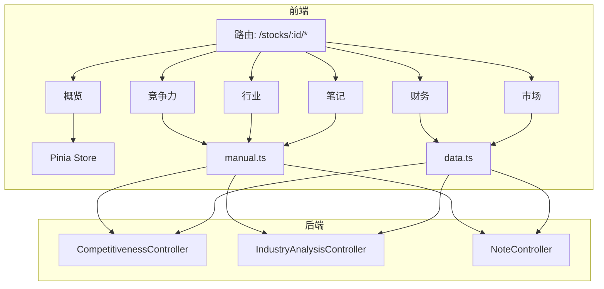
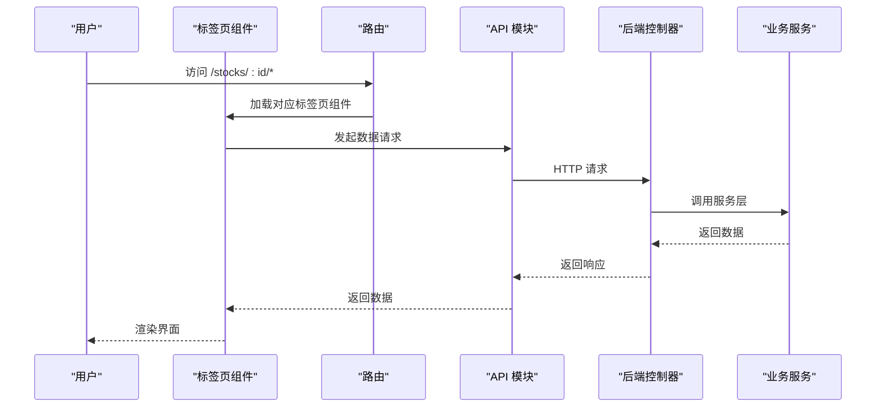
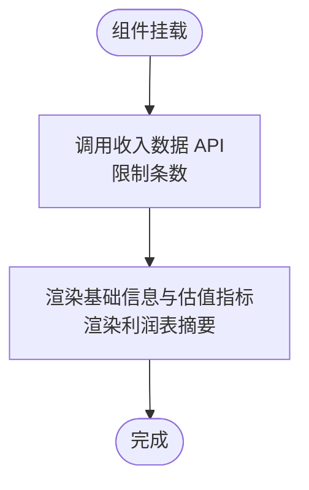
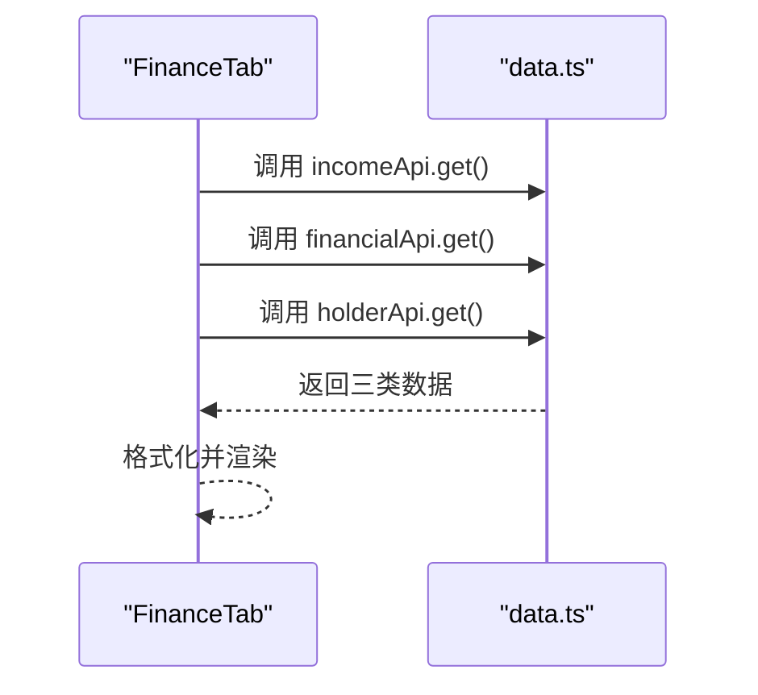
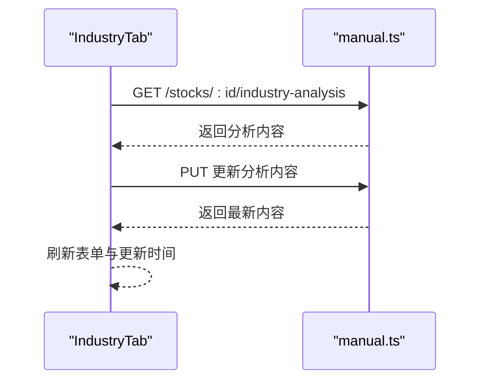
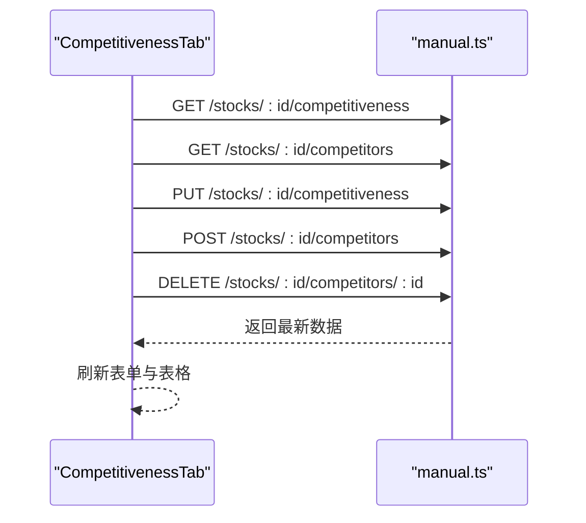
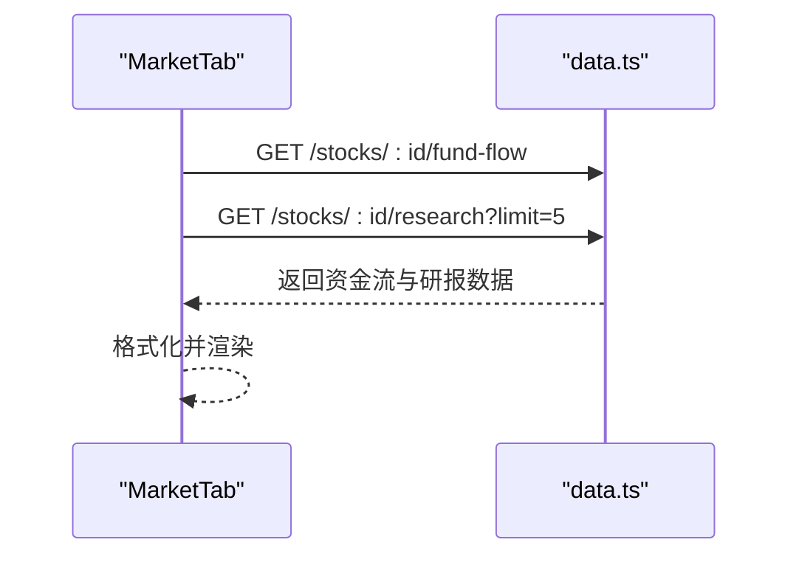
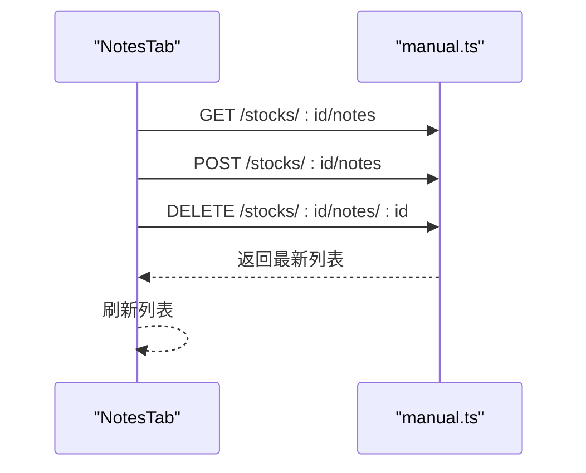
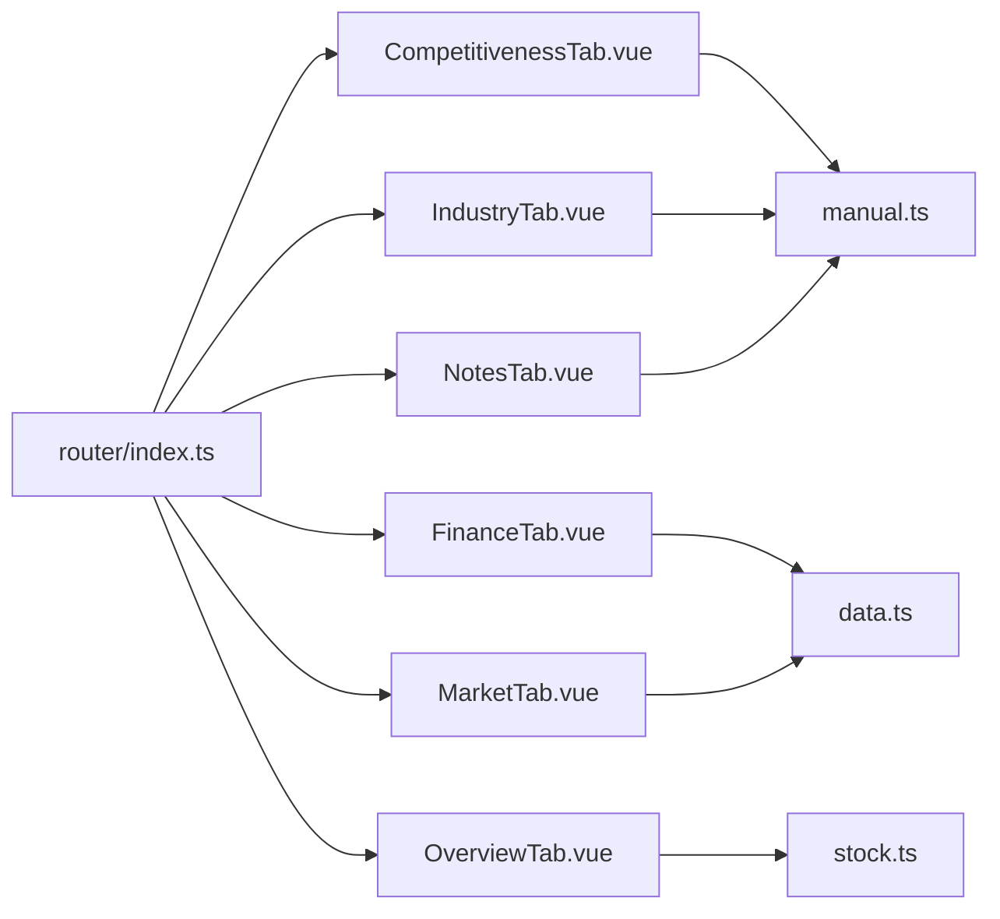

# 分析标签页组件

<cite>
**本文引用的文件**
- [CompetitivenessTab.vue](file://frontend/src/views/tabs/CompetitivenessTab.vue)
- [FinanceTab.vue](file://frontend/src/views/tabs/FinanceTab.vue)
- [IndustryTab.vue](file://frontend/src/views/tabs/IndustryTab.vue)
- [MarketTab.vue](file://frontend/src/views/tabs/MarketTab.vue)
- [NotesTab.vue](file://frontend/src/views/tabs/NotesTab.vue)
- [OverviewTab.vue](file://frontend/src/views/tabs/OverviewTab.vue)
- [index.ts（前端路由）](file://frontend/src/router/index.ts)
- [stock.ts（Pinia Store）](file://frontend/src/stores/stock.ts)
- [index.ts（API 基础）](file://frontend/src/api/index.ts)
- [manual.ts（手动型 API）](file://frontend/src/api/manual.ts)
- [data.ts（数据型 API）](file://frontend/src/api/data.ts)
- [CompetitivenessController.java](file://backend/src/main/java/com/stock/controller/CompetitivenessController.java)
- [IndustryAnalysisController.java](file://backend/src/main/java/com/stock/controller/IndustryAnalysisController.java)
- [NoteController.java](file://backend/src/main/java/com/stock/controller/NoteController.java)
</cite>

## 目录
1. [简介](#简介)
2. [项目结构](#项目结构)
3. [核心组件](#核心组件)
4. [架构总览](#架构总览)
5. [详细组件分析](#详细组件分析)
6. [依赖分析](#依赖分析)
7. [性能考虑](#性能考虑)
8. [故障排查指南](#故障排查指南)
9. [结论](#结论)
10. [附录：扩展与优化指南](#附录扩展与优化指南)

## 简介
本文件聚焦于“分析标签页组件群”的实现与使用，覆盖竞争力分析、财务分析、行业分析、市场分析、笔记管理、概览展示六个标签页。文档从功能定位、数据展示方式、交互逻辑入手，解析各标签页的实现差异；进一步阐述标签页间的数据共享机制、状态同步策略与懒加载优化；最后给出图表组件集成、数据格式转换与响应式适配建议，并提供扩展开发与性能优化指南。

## 项目结构
前端采用 Vue 3 + TypeScript + Pinia + Vue Router 的组合，标签页作为“股票详情页”的子路由存在，通过路由懒加载按需加载各标签页组件。数据访问通过两类 API 模块区分：
- 手动型 API：用于可编辑的人工录入类数据（如竞争力、行业分析、笔记）
- 数据型 API：用于只读的历史/实时数据（如财务、资金流、研究）

**图示来源**
- [index.ts（前端路由）:1-28](file://frontend/src/router/index.ts#L1-L28)
- [stock.ts（Pinia Store）:1-80](file://frontend/src/stores/stock.ts#L1-L80)
- [manual.ts（手动型 API）:1-196](file://frontend/src/api/manual.ts#L1-L196)
- [data.ts（数据型 API）:1-169](file://frontend/src/api/data.ts#L1-L169)
- [CompetitivenessController.java:1-30](file://backend/src/main/java/com/stock/controller/CompetitivenessController.java#L1-L30)
- [IndustryAnalysisController.java:1-30](file://backend/src/main/java/com/stock/controller/IndustryAnalysisController.java#L1-L30)
- [NoteController.java:1-51](file://backend/src/main/java/com/stock/controller/NoteController.java#L1-L51)

**章节来源**
- [index.ts（前端路由）:1-28](file://frontend/src/router/index.ts#L1-L28)
- [stock.ts（Pinia Store）:1-80](file://frontend/src/stores/stock.ts#L1-L80)
- [index.ts（API 基础）:1-18](file://frontend/src/api/index.ts#L1-L18)

## 核心组件
- 概览（OverviewTab）：展示股票基础信息与估值指标，同时展示近期利润表摘要；依赖全局 Pinia Store 提供当前股票对象。
- 财务（FinanceTab）：展示利润表、财务摘要、股东数据三张表格，分别调用数据型 API 获取历史数据。
- 行业（IndustryTab）：展示并编辑行业生命周期、上下游、政策影响、行业趋势等人工分析内容。
- 竞争力（CompetitivenessTab）：展示并编辑市场份额、护城河等级与说明，支持添加/移除竞品对比项。
- 市场（MarketTab）：展示近30天资金流向与最近5篇研报，分别调用数据型 API。
- 笔记（NotesTab）：对某股票进行分类笔记的增删查，支持快捷键提交。

**章节来源**
- [OverviewTab.vue:1-86](file://frontend/src/views/tabs/OverviewTab.vue#L1-L86)
- [FinanceTab.vue:1-77](file://frontend/src/views/tabs/FinanceTab.vue#L1-L77)
- [IndustryTab.vue:1-81](file://frontend/src/views/tabs/IndustryTab.vue#L1-L81)
- [CompetitivenessTab.vue:1-139](file://frontend/src/views/tabs/CompetitivenessTab.vue#L1-L139)
- [MarketTab.vue:1-55](file://frontend/src/views/tabs/MarketTab.vue#L1-L55)
- [NotesTab.vue:1-80](file://frontend/src/views/tabs/NotesTab.vue#L1-L80)

## 架构总览
从前端到后端的数据流遵循“路由 → 组件 → API → 控制器 → 服务 → 存储/外部数据源”的链路。手动型 API 与数据型 API 在职责上清晰分离：前者负责可编辑的人工录入数据，后者负责只读的历史/实时数据。

**图示来源**
- [index.ts（前端路由）:1-28](file://frontend/src/router/index.ts#L1-L28)
- [manual.ts（手动型 API）:1-196](file://frontend/src/api/manual.ts#L1-L196)
- [data.ts（数据型 API）:1-169](file://frontend/src/api/data.ts#L1-L169)
- [CompetitivenessController.java:1-30](file://backend/src/main/java/com/stock/controller/CompetitivenessController.java#L1-L30)
- [IndustryAnalysisController.java:1-30](file://backend/src/main/java/com/stock/controller/IndustryAnalysisController.java#L1-L30)
- [NoteController.java:1-51](file://backend/src/main/java/com/stock/controller/NoteController.java#L1-L51)

## 详细组件分析

### 概览（OverviewTab）
- 功能定位：提供股票基础信息与估值指标概览，以及最近若干期利润表摘要。
- 数据来源：通过 Pinia Store 获取当前股票对象；利润表摘要通过数据型 API 获取。
- 展示方式：两列卡片布局，基础信息与估值指标分列；利润表以表格形式展示关键字段。
- 交互逻辑：组件挂载时仅拉取利润表数据，不涉及用户输入。
- 性能要点：使用 Pinia 全局状态减少重复请求；利润表限制条数避免大数据量渲染。

**图示来源**
- [OverviewTab.vue:58-64](file://frontend/src/views/tabs/OverviewTab.vue#L58-L64)

**章节来源**
- [OverviewTab.vue:1-86](file://frontend/src/views/tabs/OverviewTab.vue#L1-L86)
- [stock.ts（Pinia Store）:1-80](file://frontend/src/stores/stock.ts#L1-L80)

### 财务（FinanceTab）
- 功能定位：展示利润表、财务摘要、股东数据三类财务报表维度。
- 数据来源：分别调用利润表、财务摘要、股东数据 API。
- 展示方式：三张表格，分别显示不同财务指标；数值单位与正负方向有专门格式化函数。
- 交互逻辑：只读展示，无用户输入。
- 性能要点：三路请求并行或串行均可，建议在组件挂载时并发发起以缩短首屏时间。

**图示来源**
- [FinanceTab.vue:67-72](file://frontend/src/views/tabs/FinanceTab.vue#L67-L72)
- [data.ts（数据型 API）:145-155](file://frontend/src/api/data.ts#L145-L155)

**章节来源**
- [FinanceTab.vue:1-77](file://frontend/src/views/tabs/FinanceTab.vue#L1-L77)
- [data.ts（数据型 API）:1-169](file://frontend/src/api/data.ts#L1-L169)

### 行业（IndustryTab）
- 功能定位：记录并编辑行业生命周期、上下游、政策影响、行业趋势等人工分析内容。
- 数据来源：手动型 API 的行业分析 GET/PUT。
- 展示方式：下拉选择 + 多行文本框，底部带保存按钮与更新时间提示。
- 交互逻辑：表单双向绑定，保存成功后刷新本地缓存。
- 性能要点：表单字段较少，保存时仅 PUT 当前分析内容。

**图示来源**
- [IndustryTab.vue:49-61](file://frontend/src/views/tabs/IndustryTab.vue#L49-L61)
- [manual.ts（手动型 API）:132-135](file://frontend/src/api/manual.ts#L132-L135)

**章节来源**
- [IndustryTab.vue:1-81](file://frontend/src/views/tabs/IndustryTab.vue#L1-L81)
- [IndustryAnalysisController.java:1-30](file://backend/src/main/java/com/stock/controller/IndustryAnalysisController.java#L1-L30)

### 竞争力（CompetitivenessTab）
- 功能定位：记录市场份额、年份、护城河等级与说明；维护竞品对比列表（代码、名称、最新价、涨跌幅、PE、PB 等）。
- 数据来源：手动型 API 的竞争力 GET/PUT；竞品列表 GET/POST/DELETE。
- 展示方式：两块卡片：竞争力表单与竞品表格；表格支持移除竞品。
- 交互逻辑：表单保存、添加竞品、移除竞品；错误统一弹窗提示。
- 性能要点：竞品列表按需渲染，移除后即时从本地数组剔除，避免二次请求。

**图示来源**
- [CompetitivenessTab.vue:83-100](file://frontend/src/views/tabs/CompetitivenessTab.vue#L83-L100)
- [manual.ts（手动型 API）:157-166](file://frontend/src/api/manual.ts#L157-L166)

**章节来源**
- [CompetitivenessTab.vue:1-139](file://frontend/src/views/tabs/CompetitivenessTab.vue#L1-L139)
- [CompetitivenessController.java:1-30](file://backend/src/main/java/com/stock/controller/CompetitivenessController.java#L1-L30)

### 市场（MarketTab）
- 功能定位：展示近30天资金流向与最近5篇研报。
- 数据来源：数据型 API 的资金流与研报。
- 展示方式：资金流向表格（含主力净流入、各级别单量）；研报列表卡片式展示。
- 交互逻辑：只读展示，无用户输入。
- 性能要点：资金流与研报分别请求，注意单位换算与颜色标识。

**图示来源**
- [MarketTab.vue:44-48](file://frontend/src/views/tabs/MarketTab.vue#L44-L48)
- [data.ts（数据型 API）:136-160](file://frontend/src/api/data.ts#L136-L160)

**章节来源**
- [MarketTab.vue:1-55](file://frontend/src/views/tabs/MarketTab.vue#L1-L55)
- [data.ts（数据型 API）:1-169](file://frontend/src/api/data.ts#L1-L169)

### 笔记（NotesTab）
- 功能定位：对某股票进行分类笔记的增删查，支持快捷键提交。
- 数据来源：手动型 API 的笔记列表/创建/删除。
- 展示方式：分类选择 + 输入框 + 列表卡片；每条笔记包含分类标签、内容与更新时间。
- 交互逻辑：新增后清空输入并重新拉取列表；删除后从本地数组剔除。
- 性能要点：列表按需渲染，删除后立即更新视图，避免多余请求。

**图示来源**
- [NotesTab.vue:39-49](file://frontend/src/views/tabs/NotesTab.vue#L39-L49)
- [manual.ts（手动型 API）:168-176](file://frontend/src/api/manual.ts#L168-L176)

**章节来源**
- [NotesTab.vue:1-80](file://frontend/src/views/tabs/NotesTab.vue#L1-L80)
- [NoteController.java:1-51](file://backend/src/main/java/com/stock/controller/NoteController.java#L1-L51)

## 依赖分析
- 组件与路由：各标签页作为“股票详情”子路由存在，通过动态导入实现懒加载。
- 组件与 API：手动型与数据型 API 明确分工；手动型用于可编辑数据，数据型用于只读数据。
- 组件与状态：概览依赖 Pinia Store 的当前股票对象；其他标签页主要依赖各自 API。
- 后端控制器：手动型与数据型 API 对应后端控制器，职责清晰。

**图示来源**
- [index.ts（前端路由）:15-22](file://frontend/src/router/index.ts#L15-L22)
- [manual.ts（手动型 API）:1-196](file://frontend/src/api/manual.ts#L1-L196)
- [data.ts（数据型 API）:1-169](file://frontend/src/api/data.ts#L1-L169)
- [stock.ts（Pinia Store）:1-80](file://frontend/src/stores/stock.ts#L1-L80)

**章节来源**
- [index.ts（前端路由）:1-28](file://frontend/src/router/index.ts#L1-L28)
- [manual.ts（手动型 API）:1-196](file://frontend/src/api/manual.ts#L1-L196)
- [data.ts（数据型 API）:1-169](file://frontend/src/api/data.ts#L1-L169)
- [stock.ts（Pinia Store）:1-80](file://frontend/src/stores/stock.ts#L1-L80)

## 性能考虑
- 懒加载与路由：使用动态导入按需加载标签页组件，降低初始包体与首屏渲染压力。
- 并发请求：财务与市场等页面可并发发起多个 API 请求，缩短等待时间。
- 本地状态与缓存：概览使用 Pinia Store 缓存当前股票对象，减少重复请求；手动型数据保存后可局部刷新列表。
- 渲染优化：表格数据按需渲染，避免一次性渲染大量历史数据；对数值进行格式化与颜色标记，提升可读性。
- 错误处理：统一拦截器输出错误日志，组件内捕获异常并提示，避免页面崩溃。
- 单位换算：资金流与财务数据涉及单位换算（如万元、亿元），应在组件内统一格式化函数，减少重复计算。

[本节为通用性能建议，无需特定文件引用]

## 故障排查指南
- 接口错误：统一响应拦截器会打印错误信息，可在控制台查看具体错误内容与状态码。
- 保存失败：手动型 API 的保存/更新失败会在组件内弹窗提示，检查后端返回的消息字段。
- 数据为空：部分标签页在无数据时显示提示文案，确认后端数据是否已初始化或参数是否正确。
- 路由跳转：确认路由路径与参数（如 :id）是否正确传递，避免空参数导致请求失败。

**章节来源**
- [index.ts（API 基础）:8-15](file://frontend/src/api/index.ts#L8-L15)
- [CompetitivenessTab.vue:114-118](file://frontend/src/views/tabs/CompetitivenessTab.vue#L114-L118)
- [IndustryTab.vue:74-77](file://frontend/src/views/tabs/IndustryTab.vue#L74-L77)
- [NotesTab.vue:58-60](file://frontend/src/views/tabs/NotesTab.vue#L58-L60)

## 结论
分析标签页组件群围绕“可编辑的人工分析 + 只读的历史/实时数据”两条主线构建，职责清晰、耦合度低。通过 Pinia 共享当前股票状态、通过手动型与数据型 API 分离读写场景、结合懒加载与格式化渲染，整体具备良好的可维护性与用户体验。后续可在图表集成、响应式适配与性能优化方面持续增强。

## 附录：扩展与优化指南

### 标签页扩展开发指南
- 新增标签页步骤
  - 在路由中注册新子路由，使用动态导入实现懒加载。
  - 创建新组件，明确数据来源（手动型或数据型）。
  - 如需共享状态，优先使用 Pinia Store；若仅局部使用，可直接在组件内维护。
  - 设计统一的错误处理与加载状态，保证一致的用户体验。
- 数据模型与 API
  - 手动型：适合可编辑的人工分析数据；后端提供 GET/PUT 或 GET/POST/DELETE。
  - 数据型：适合历史/实时数据；后端提供 GET，必要时支持分页/筛选参数。
- 响应式与可访问性
  - 使用语义化表格与标题，确保屏幕阅读器友好。
  - 针对移动端优化表格滚动与字体大小，必要时采用横向滚动容器或折叠展示。

### 图表组件集成方式
- 建议使用轻量级图表库（如基于 Canvas 的库或 SVG 库），避免引入重型框架。
- 将数据预处理与格式化放在组件内，图表仅负责渲染。
- 对于高频更新的数据（如资金流），采用防抖/节流策略，减少重绘次数。
- 图表尺寸自适应容器宽度，结合媒体查询在小屏设备上调整字号与边距。

### 数据格式转换与单位换算
- 金额与规模：统一转换为“亿元”“万股”等单位，保留两位小数并加单位后缀。
- 百分比：统一保留一位或两位小数，正负值使用颜色区分。
- 时间：统一格式化为“YYYY-MM-DD”，避免跨时区问题。
- 数组长度：对长列表设置上限，避免一次性渲染过多节点。

### 状态同步策略
- 全局状态：Pinia Store 中的当前股票对象用于概览等需要全局信息的标签页。
- 局部状态：手动型数据保存后，优先在本地数组中更新，再触发一次刷新，减少网络往返。
- 脏检查：对于可编辑表单，提供撤销/恢复能力，提升容错体验。

### 懒加载优化
- 路由级别懒加载：使用动态导入，按需加载标签页组件。
- 组件内部懒加载：对大型图表或复杂表格，可在首次进入可视区域时再初始化。
- 预取策略：在用户即将切换标签页时，提前发起轻量请求，缩短切换延迟。