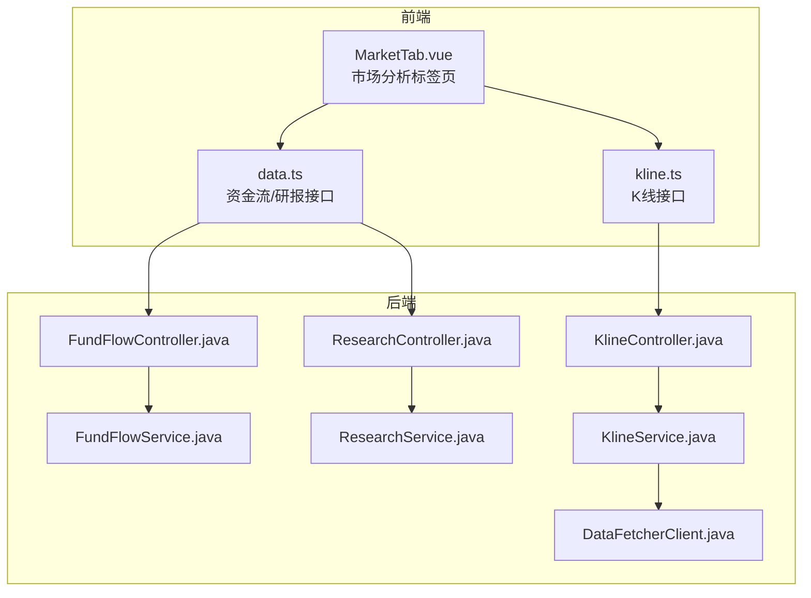
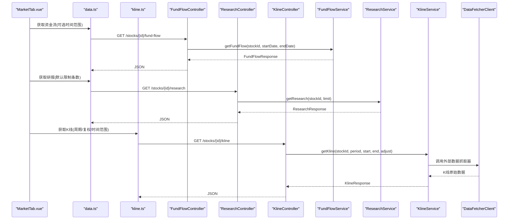
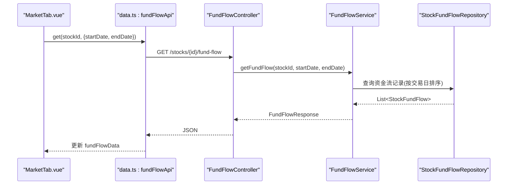
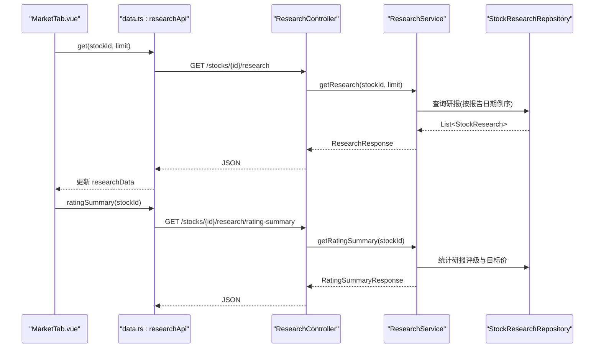
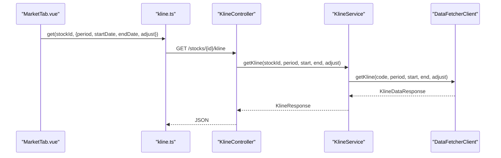
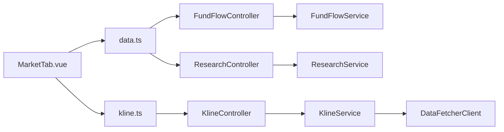

# 市场分析标签页

<cite>
**本文引用的文件**
- [MarketTab.vue](file://frontend/src/views/tabs/MarketTab.vue)
- [data.ts](file://frontend/src/api/data.ts)
- [kline.ts](file://frontend/src/api/kline.ts)
- [FundFlowController.java](file://backend/src/main/java/com/stock/controller/FundFlowController.java)
- [ResearchController.java](file://backend/src/main/java/com/stock/controller/ResearchController.java)
- [KlineController.java](file://backend/src/main/java/com/stock/controller/KlineController.java)
- [FundFlowService.java](file://backend/src/main/java/com/stock/service/FundFlowService.java)
- [ResearchService.java](file://backend/src/main/java/com/stock/service/ResearchService.java)
- [KlineService.java](file://backend/src/main/java/com/stock/service/KlineService.java)
- [FundFlowResponse.java](file://backend/src/main/java/com/stock/dto/response/FundFlowResponse.java)
- [ResearchResponse.java](file://backend/src/main/java/com/stock/dto/response/ResearchResponse.java)
- [DataFetcherClient.java](file://backend/src/main/java/com/stock/client/DataFetcherClient.java)
</cite>

## 目录
1. [简介](#简介)
2. [项目结构](#项目结构)
3. [核心组件](#核心组件)
4. [架构总览](#架构总览)
5. [详细组件分析](#详细组件分析)
6. [依赖分析](#依赖分析)
7. [性能考虑](#性能考虑)
8. [故障排查指南](#故障排查指南)
9. [结论](#结论)
10. [附录](#附录)

## 简介
本文件面向“市场分析标签页”组件，系统化梳理前端展示与后端数据服务的协作方式，覆盖以下能力：
- 大盘走势：通过K线数据接口获取日线/复权行情，支持时间段筛选与前复权调整。
- 资金流向：按日期展示主力及各量级净流入、占比，并以表格形式呈现。
- 研报与评级汇总：展示机构研报摘要与评级统计，辅助市场情绪判断。
- 实时更新机制：前端在挂载时拉取所需数据；后端提供灵活的时间范围查询。
- 图表渲染优化：建议采用虚拟滚动、分页加载与懒渲染策略（概念性指导）。
- 多维度分析视图：结合K线、资金流、研报形成“价格—资金—情绪”的综合视角。
- 指标计算与数据源：K线由外部数据抓取器提供；资金流与研报来自数据库映射。
- 异常监控：统一异常处理与参数校验，保障接口稳定性。
- 扩展与回测：提供接口扩展点与历史数据回看能力（概念性指导）。

## 项目结构
市场分析标签页位于前端路由视图层，使用Vue 3 Composition API组织页面逻辑；后端通过REST控制器暴露数据接口，服务层负责业务逻辑与数据转换。

**图表来源**
- [MarketTab.vue:1-55](file://frontend/src/views/tabs/MarketTab.vue#L1-L55)
- [data.ts:136-169](file://frontend/src/api/data.ts#L136-L169)
- [kline.ts:24-37](file://frontend/src/api/kline.ts#L24-L37)
- [FundFlowController.java:10-27](file://backend/src/main/java/com/stock/controller/FundFlowController.java#L10-L27)
- [ResearchController.java:8-29](file://backend/src/main/java/com/stock/controller/ResearchController.java#L8-L29)
- [KlineController.java:10-36](file://backend/src/main/java/com/stock/controller/KlineController.java#L10-L36)
- [FundFlowService.java:14-51](file://backend/src/main/java/com/stock/service/FundFlowService.java#L14-L51)
- [ResearchService.java:16-88](file://backend/src/main/java/com/stock/service/ResearchService.java#L16-L88)
- [KlineService.java:17-67](file://backend/src/main/java/com/stock/service/KlineService.java#L17-L67)
- [DataFetcherClient.java](file://backend/src/main/java/com/stock/client/DataFetcherClient.java)

**章节来源**
- [MarketTab.vue:1-55](file://frontend/src/views/tabs/MarketTab.vue#L1-L55)
- [data.ts:1-169](file://frontend/src/api/data.ts#L1-L169)
- [kline.ts:1-37](file://frontend/src/api/kline.ts#L1-L37)
- [FundFlowController.java:1-27](file://backend/src/main/java/com/stock/controller/FundFlowController.java#L1-L27)
- [ResearchController.java:1-29](file://backend/src/main/java/com/stock/controller/ResearchController.java#L1-L29)
- [KlineController.java:1-36](file://backend/src/main/java/com/stock/controller/KlineController.java#L1-L36)
- [FundFlowService.java:1-51](file://backend/src/main/java/com/stock/service/FundFlowService.java#L1-L51)
- [ResearchService.java:1-88](file://backend/src/main/java/com/stock/service/ResearchService.java#L1-L88)
- [KlineService.java:1-67](file://backend/src/main/java/com/stock/service/KlineService.java#L1-L67)

## 核心组件
- 前端组件：MarketTab.vue负责渲染资金流表格与研报列表，并在挂载时发起数据请求。
- 接口封装：data.ts提供资金流、研报、指标等接口；kline.ts提供K线与分时接口。
- 后端控制器：FundFlowController、ResearchController、KlineController分别暴露REST端点。
- 服务层：FundFlowService、ResearchService、KlineService实现业务逻辑与数据转换。
- 数据传输对象：FundFlowResponse、ResearchResponse等用于前后端契约。

**章节来源**
- [MarketTab.vue:35-54](file://frontend/src/views/tabs/MarketTab.vue#L35-L54)
- [data.ts:136-169](file://frontend/src/api/data.ts#L136-L169)
- [kline.ts:24-37](file://frontend/src/api/kline.ts#L24-L37)
- [FundFlowController.java:10-27](file://backend/src/main/java/com/stock/controller/FundFlowController.java#L10-L27)
- [ResearchController.java:8-29](file://backend/src/main/java/com/stock/controller/ResearchController.java#L8-L29)
- [KlineController.java:10-36](file://backend/src/main/java/com/stock/controller/KlineController.java#L10-L36)
- [FundFlowService.java:25-49](file://backend/src/main/java/com/stock/service/FundFlowService.java#L25-L49)
- [ResearchService.java:27-46](file://backend/src/main/java/com/stock/service/ResearchService.java#L27-L46)
- [KlineService.java:30-59](file://backend/src/main/java/com/stock/service/KlineService.java#L30-L59)
- [FundFlowResponse.java:1-9](file://backend/src/main/java/com/stock/dto/response/FundFlowResponse.java#L1-L9)
- [ResearchResponse.java:1-9](file://backend/src/main/java/com/stock/dto/response/ResearchResponse.java#L1-L9)

## 架构总览
从前端到后端的数据流如下：MarketTab.vue调用data.ts与kline.ts接口，控制器接收参数并委派给对应服务层，服务层访问仓库或外部客户端获取数据，最终返回DTO响应。

**图表来源**
- [MarketTab.vue:44-48](file://frontend/src/views/tabs/MarketTab.vue#L44-L48)
- [data.ts:136-169](file://frontend/src/api/data.ts#L136-L169)
- [kline.ts:24-37](file://frontend/src/api/kline.ts#L24-L37)
- [FundFlowController.java:20-25](file://backend/src/main/java/com/stock/controller/FundFlowController.java#L20-L25)
- [ResearchController.java:18-22](file://backend/src/main/java/com/stock/controller/ResearchController.java#L18-L22)
- [KlineController.java:20-27](file://backend/src/main/java/com/stock/controller/KlineController.java#L20-L27)
- [FundFlowService.java:25-49](file://backend/src/main/java/com/stock/service/FundFlowService.java#L25-L49)
- [ResearchService.java:27-46](file://backend/src/main/java/com/stock/service/ResearchService.java#L27-L46)
- [KlineService.java:30-59](file://backend/src/main/java/com/stock/service/KlineService.java#L30-L59)
- [DataFetcherClient.java](file://backend/src/main/java/com/stock/client/DataFetcherClient.java)

## 详细组件分析

### 资金流向模块
- 前端职责：在挂载时根据路由参数获取股票ID，调用资金流接口并渲染近30天的主力与各量级净流入数据。
- 后端职责：控制器接收可选的起止日期参数，服务层按条件查询数据库，映射为前端所需的字段集合。
- 关键点：
  - 时间范围默认为近3个月，可通过startDate/endDate覆盖。
  - 字段包含日期、收盘价、涨跌幅以及主力与各量级净流入/占比。
  - 前端对数值进行单位换算显示（例如以“万元”计）。

**图表来源**
- [MarketTab.vue:44-48](file://frontend/src/views/tabs/MarketTab.vue#L44-L48)
- [data.ts:136-143](file://frontend/src/api/data.ts#L136-L143)
- [FundFlowController.java:20-25](file://backend/src/main/java/com/stock/controller/FundFlowController.java#L20-L25)
- [FundFlowService.java:25-49](file://backend/src/main/java/com/stock/service/FundFlowService.java#L25-L49)

**章节来源**
- [MarketTab.vue:4-20](file://frontend/src/views/tabs/MarketTab.vue#L4-L20)
- [data.ts:4-24](file://frontend/src/api/data.ts#L4-L24)
- [FundFlowController.java:20-25](file://backend/src/main/java/com/stock/controller/FundFlowController.java#L20-L25)
- [FundFlowService.java:25-49](file://backend/src/main/java/com/stock/service/FundFlowService.java#L25-L49)
- [FundFlowResponse.java:5-8](file://backend/src/main/java/com/stock/dto/response/FundFlowResponse.java#L5-L8)

### 研报与评级汇总模块
- 前端职责：渲染最近N篇研报标题、机构、评级与报告日期；同时可请求评级汇总（买入/增持/中性/减持/卖出数量与共识目标价）。
- 后端职责：研报接口返回研报列表；评级汇总接口统计研报中的评级词并计算共识目标价。
- 关键点：
  - 评级词识别基于字符串匹配规则，支持多种表达（如“买入/强烈推荐”、“优于大市/推荐”等）。
  - 共识目标价基于PE预测与EPS预测的加权平均。

**图表来源**
- [MarketTab.vue:23-31](file://frontend/src/views/tabs/MarketTab.vue#L23-L31)
- [data.ts:157-160](file://frontend/src/api/data.ts#L157-L160)
- [ResearchController.java:18-27](file://backend/src/main/java/com/stock/controller/ResearchController.java#L18-L27)
- [ResearchService.java:27-86](file://backend/src/main/java/com/stock/service/ResearchService.java#L27-L86)

**章节来源**
- [MarketTab.vue:23-31](file://frontend/src/views/tabs/MarketTab.vue#L23-L31)
- [data.ts:81-110](file://frontend/src/api/data.ts#L81-L110)
- [ResearchController.java:18-27](file://backend/src/main/java/com/stock/controller/ResearchController.java#L18-L27)
- [ResearchService.java:27-86](file://backend/src/main/java/com/stock/service/ResearchService.java#L27-L86)
- [ResearchResponse.java:5-8](file://backend/src/main/java/com/stock/dto/response/ResearchResponse.java#L5-L8)

### K线与市场走势模块
- 前端职责：提供日线与复权参数配置，支持时间段筛选与前复权（qfq）调整。
- 后端职责：K线控制器接收周期、日期范围与复权类型，服务层调用外部数据抓取器获取原始K线，再映射为前端K线项。
- 关键点：
  - 默认周期为日线，时间范围默认一年；可按需传入startDate/endDate。
  - 分时接口支持指定周期与日期，默认当日。

**图表来源**
- [kline.ts:24-31](file://frontend/src/api/kline.ts#L24-L31)
- [KlineController.java:20-27](file://backend/src/main/java/com/stock/controller/KlineController.java#L20-L27)
- [KlineService.java:30-44](file://backend/src/main/java/com/stock/service/KlineService.java#L30-L44)
- [DataFetcherClient.java](file://backend/src/main/java/com/stock/client/DataFetcherClient.java)

**章节来源**
- [kline.ts:24-37](file://frontend/src/api/kline.ts#L24-L37)
- [KlineController.java:20-34](file://backend/src/main/java/com/stock/controller/KlineController.java#L20-L34)
- [KlineService.java:30-59](file://backend/src/main/java/com/stock/service/KlineService.java#L30-L59)

### 指标与多维度分析视图
- 当前标签页未直接展示指标数据；但接口已准备，可在后续扩展中接入MACD、KDJ、布林带、RSI等技术指标。
- 建议在MarketTab.vue中增加指标API调用与可视化渲染，形成“价格—指标—资金—情绪”的综合分析面板。

**章节来源**
- [data.ts:112-135](file://frontend/src/api/data.ts#L112-L135)
- [MarketTab.vue:35-54](file://frontend/src/views/tabs/MarketTab.vue#L35-L54)

## 依赖分析
- 前端依赖：MarketTab.vue依赖data.ts与kline.ts提供的API；data.ts内部依赖通用api实例。
- 后端依赖：控制器依赖对应服务；服务层依赖仓库与外部数据抓取客户端；DTO作为跨层契约。
- 外部依赖：K线服务依赖DataFetcherClient获取原始数据。

**图表来源**
- [MarketTab.vue:35-54](file://frontend/src/views/tabs/MarketTab.vue#L35-L54)
- [data.ts:136-169](file://frontend/src/api/data.ts#L136-L169)
- [kline.ts:24-37](file://frontend/src/api/kline.ts#L24-L37)
- [FundFlowController.java:14-18](file://backend/src/main/java/com/stock/controller/FundFlowController.java#L14-L18)
- [ResearchController.java:12-16](file://backend/src/main/java/com/stock/controller/ResearchController.java#L12-L16)
- [KlineController.java:14-18](file://backend/src/main/java/com/stock/controller/KlineController.java#L14-L18)
- [FundFlowService.java:17-23](file://backend/src/main/java/com/stock/service/FundFlowService.java#L17-L23)
- [ResearchService.java:19-25](file://backend/src/main/java/com/stock/service/ResearchService.java#L19-L25)
- [KlineService.java:20-28](file://backend/src/main/java/com/stock/service/KlineService.java#L20-L28)
- [DataFetcherClient.java](file://backend/src/main/java/com/stock/client/DataFetcherClient.java)

**章节来源**
- [MarketTab.vue:35-54](file://frontend/src/views/tabs/MarketTab.vue#L35-L54)
- [data.ts:136-169](file://frontend/src/api/data.ts#L136-L169)
- [kline.ts:24-37](file://frontend/src/api/kline.ts#L24-L37)
- [FundFlowController.java:14-18](file://backend/src/main/java/com/stock/controller/FundFlowController.java#L14-L18)
- [ResearchController.java:12-16](file://backend/src/main/java/com/stock/controller/ResearchController.java#L12-L16)
- [KlineController.java:14-18](file://backend/src/main/java/com/stock/controller/KlineController.java#L14-L18)
- [FundFlowService.java:17-23](file://backend/src/main/java/com/stock/service/FundFlowService.java#L17-L23)
- [ResearchService.java:19-25](file://backend/src/main/java/com/stock/service/ResearchService.java#L19-L25)
- [KlineService.java:20-28](file://backend/src/main/java/com/stock/service/KlineService.java#L20-L28)

## 性能考虑
- 前端渲染优化
  - 虚拟滚动：对长列表（如资金流、研报）启用虚拟滚动，减少DOM节点数量。
  - 懒加载：仅在标签激活时请求数据，避免不必要的网络开销。
  - 缓存策略：对相同时间范围的请求结果进行缓存，降低重复请求频率。
- 后端性能优化
  - 分页与限制：研报接口默认限制条数，避免一次性返回过多数据。
  - 索引优化：资金流查询按交易日区间与股票ID组合索引，提升查询效率。
  - 外部调用限流：对DataFetcherClient的调用设置超时与重试策略，防止阻塞。
- 图表渲染优化
  - 数据采样：对长时间K线数据进行采样，减少渲染点数。
  - 渲染分离：将主图与副图（成交量、指标）分离渲染，按需更新。
- 内存与并发
  - 避免在组件销毁后仍保留订阅；及时清理定时器与事件监听。
  - 控制并发请求数，避免同时触发多个大数据量请求。

## 故障排查指南
- 常见问题
  - 股票ID无效：后端抛出“股票不存在”异常，前端应提示用户检查ID或选择有效股票。
  - 参数格式错误：日期参数需符合ISO日期格式，否则控制器无法绑定。
  - 网络超时：K线外部抓取器可能超时，建议增加重试与降级策略。
- 定位步骤
  - 检查路由参数是否正确传递至API调用。
  - 查看后端控制器日志，确认参数解析与服务调用链路。
  - 核对数据库中是否存在对应股票与数据记录。
- 建议措施
  - 在前端增加输入校验与错误提示。
  - 对关键接口增加熔断与降级逻辑，保证用户体验。
  - 记录请求ID与时间戳，便于跨服务追踪。

**章节来源**
- [FundFlowService.java:26-28](file://backend/src/main/java/com/stock/service/FundFlowService.java#L26-L28)
- [ResearchService.java:28-30](file://backend/src/main/java/com/stock/service/ResearchService.java#L28-L30)
- [KlineService.java:31-32](file://backend/src/main/java/com/stock/service/KlineService.java#L31-L32)
- [FundFlowController.java:22-24](file://backend/src/main/java/com/stock/controller/FundFlowController.java#L22-L24)
- [ResearchController.java:19-21](file://backend/src/main/java/com/stock/controller/ResearchController.java#L19-L21)
- [KlineController.java:21-26](file://backend/src/main/java/com/stock/controller/KlineController.java#L21-L26)

## 结论
市场分析标签页通过资金流、研报与K线三大模块，构建了“价格—资金—情绪”的基础分析框架。前端以轻量组件实现数据展示，后端以清晰的控制器-服务-仓库分层支撑数据获取与转换。未来可在现有基础上扩展指标面板、自定义分析模板与历史回测能力，进一步完善多维度分析体系。

## 附录
- 扩展建议
  - 新增指标面板：接入indicatorApi，渲染MACD、KDJ、布林带等常用技术指标。
  - 自定义分析模板：在前端提供模板保存与分享能力，后端持久化模板配置。
  - 历史回测：提供回测参数配置与结果可视化，结合K线与资金流进行策略验证。
- 最佳实践
  - 保持接口契约稳定，逐步演进字段与行为。
  - 加强异常监控与告警，确保关键路径的可观测性。
  - 对高频数据采用缓存与增量更新策略，平衡实时性与性能。