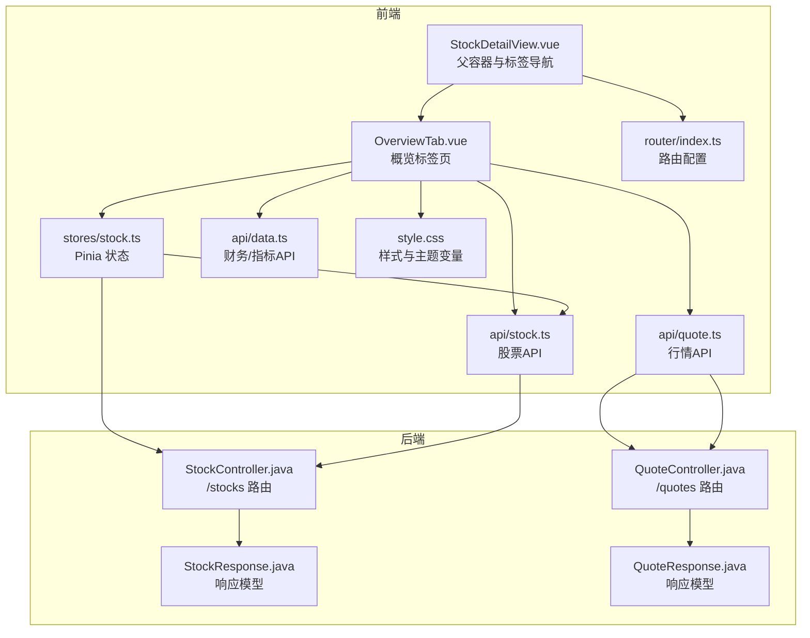
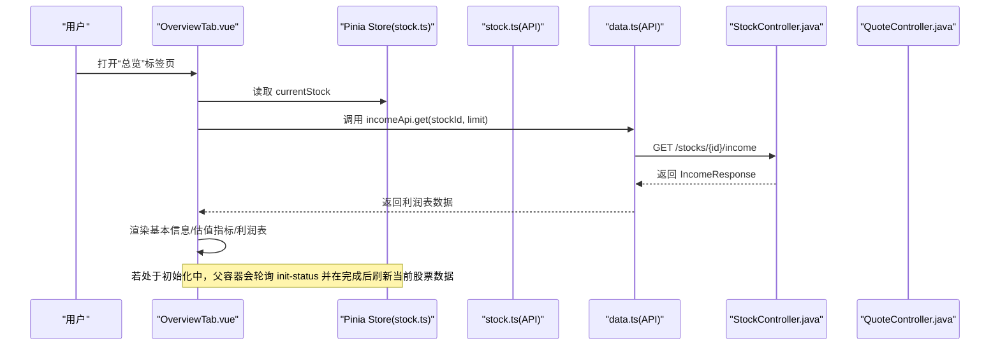
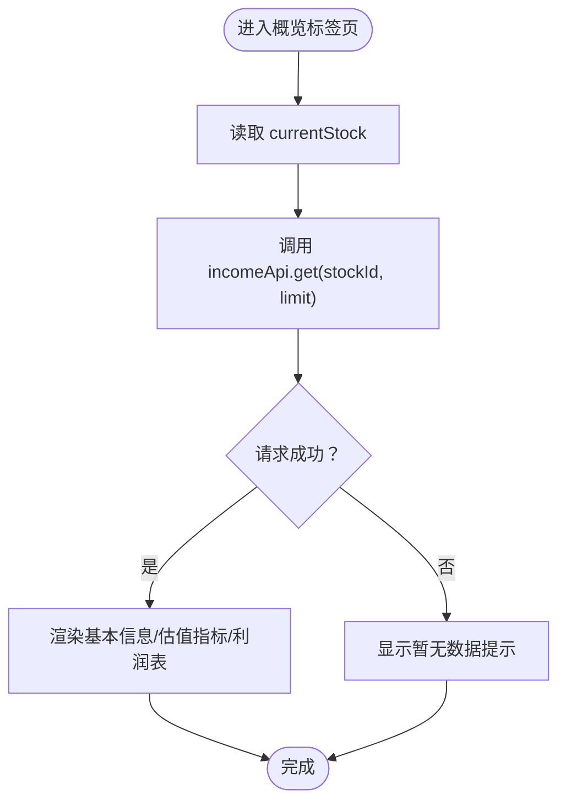
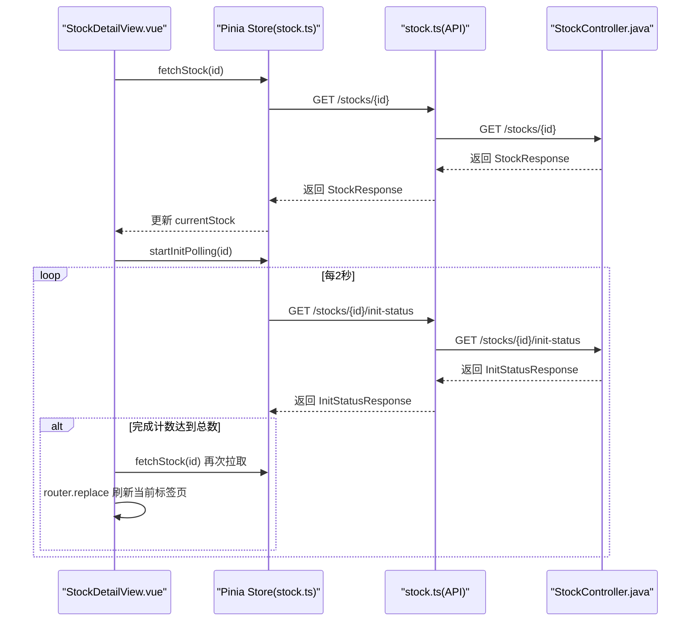
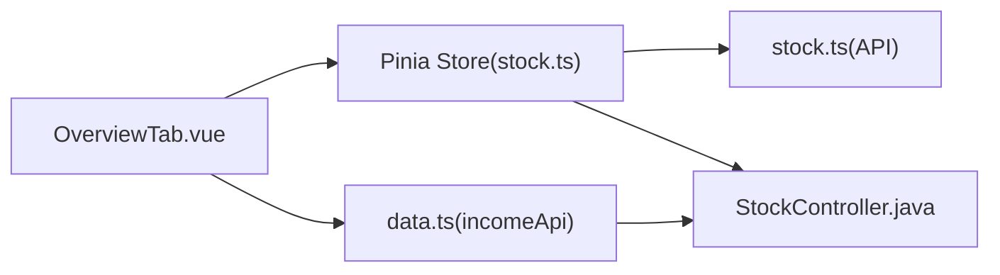

# 概览标签页

<cite>
**本文引用的文件**
- [OverviewTab.vue](file://frontend/src/views/tabs/OverviewTab.vue)
- [StockDetailView.vue](file://frontend/src/views/StockDetailView.vue)
- [stock.ts](file://frontend/src/stores/stock.ts)
- [stock.ts（API）](file://frontend/src/api/stock.ts)
- [quote.ts](file://frontend/src/api/quote.ts)
- [data.ts](file://frontend/src/api/data.ts)
- [router/index.ts](file://frontend/src/router/index.ts)
- [style.css](file://frontend/src/style.css)
- [FinanceTab.vue](file://frontend/src/views/tabs/FinanceTab.vue)
- [MarketTab.vue](file://frontend/src/views/tabs/MarketTab.vue)
- [IndustryTab.vue](file://frontend/src/views/tabs/IndustryTab.vue)
- [StockController.java](file://backend/src/main/java/com/stock/controller/StockController.java)
- [QuoteController.java](file://backend/src/main/java/com/stock/controller/QuoteController.java)
- [StockResponse.java](file://backend/src/main/java/com/stock/dto/response/StockResponse.java)
- [QuoteResponse.java](file://backend/src/main/java/com/stock/dto/response/QuoteResponse.java)
</cite>

## 目录
1. [简介](#简介)
2. [项目结构](#项目结构)
3. [核心组件](#核心组件)
4. [架构总览](#架构总览)
5. [详细组件分析](#详细组件分析)
6. [依赖分析](#依赖分析)
7. [性能考虑](#性能考虑)
8. [故障排查指南](#故障排查指南)
9. [结论](#结论)
10. [附录](#附录)

## 简介
本文件面向“概览标签页”组件，系统性阐述其整体布局设计、核心信息展示区域与关键指标汇总展示方式；并深入解析股票基本信息卡片、实时行情展示、技术指标概览、财务摘要等组件的实现思路与数据流。文档同时覆盖数据绑定策略、响应式布局适配、加载状态处理、组件间通信机制、数据流转过程、错误处理策略，并提供样式定制指南与性能优化建议。

## 项目结构
概览标签页位于股票详情页的子路由中，作为多个标签页之一，负责呈现基础财务与近期利润表数据。其与全局状态管理、路由、API 层以及后端控制器形成清晰分层。

图表来源
- [StockDetailView.vue:1-82](file://frontend/src/views/StockDetailView.vue#L1-L82)
- [OverviewTab.vue:1-86](file://frontend/src/views/tabs/OverviewTab.vue#L1-L86)
- [router/index.ts:1-28](file://frontend/src/router/index.ts#L1-L28)
- [stock.ts:1-80](file://frontend/src/stores/stock.ts#L1-L80)
- [stock.ts（API）:1-61](file://frontend/src/api/stock.ts#L1-L61)
- [quote.ts:1-24](file://frontend/src/api/quote.ts#L1-L24)
- [data.ts:1-169](file://frontend/src/api/data.ts#L1-L169)
- [style.css:1-163](file://frontend/src/style.css#L1-L163)
- [StockController.java:1-57](file://backend/src/main/java/com/stock/controller/StockController.java#L1-L57)
- [QuoteController.java:1-28](file://backend/src/main/java/com/stock/controller/QuoteController.java#L1-L28)
- [StockResponse.java:1-25](file://backend/src/main/java/com/stock/dto/response/StockResponse.java#L1-L25)
- [QuoteResponse.java:1-22](file://backend/src/main/java/com/stock/dto/response/QuoteResponse.java#L1-L22)

章节来源
- [router/index.ts:1-28](file://frontend/src/router/index.ts#L1-L28)
- [StockDetailView.vue:1-82](file://frontend/src/views/StockDetailView.vue#L1-L82)
- [OverviewTab.vue:1-86](file://frontend/src/views/tabs/OverviewTab.vue#L1-L86)

## 核心组件
- 概览标签页（OverviewTab.vue）
  - 布局：两列卡片网格 + 最近利润表卡片
  - 数据：从 Pinia store 获取当前股票对象，通过 incomeApi 获取最近利润表数据
  - 展示：行业、市值、股本、上市日期等基本信息；PE/PB/PS/PEG 等估值指标；最近若干期利润表
  - 格式化：市值/股本/利润以亿或亿股为单位格式化；同比变化按正负使用不同样式类
- 股票详情容器（StockDetailView.vue）
  - 提供标签页导航（总览/产业分析/财务数据/竞争力/市场行情/投资笔记）
  - 初始化状态轮询与刷新逻辑，配合概览标签页在数据初始化完成后自动刷新
- Pinia 状态（stock.ts）
  - 维护当前股票、股票列表、初始化状态、加载标志
  - 提供添加/删除/查询股票与初始化轮询控制方法
- API 层
  - 股票 API（stock.ts（API））：/stocks 列表、/stocks/{id} 查询、/stocks/{id}/init-status
  - 行情 API（quote.ts）：/quotes/{stockId} 查询、/quotes/refresh 刷新
  - 财务/指标 API（data.ts）：/stocks/{id}/income、/stocks/{id}/financial、/stocks/{id}/indicators 等
- 后端控制器
  - 股票控制器（StockController.java）：提供新增、删除、查询、初始化状态查询
  - 行情控制器（QuoteController.java）：提供按股票查询行情与全量刷新

章节来源
- [OverviewTab.vue:1-86](file://frontend/src/views/tabs/OverviewTab.vue#L1-L86)
- [StockDetailView.vue:1-82](file://frontend/src/views/StockDetailView.vue#L1-L82)
- [stock.ts:1-80](file://frontend/src/stores/stock.ts#L1-L80)
- [stock.ts（API）:1-61](file://frontend/src/api/stock.ts#L1-L61)
- [quote.ts:1-24](file://frontend/src/api/quote.ts#L1-L24)
- [data.ts:1-169](file://frontend/src/api/data.ts#L1-L169)
- [StockController.java:1-57](file://backend/src/main/java/com/stock/controller/StockController.java#L1-L57)
- [QuoteController.java:1-28](file://backend/src/main/java/com/stock/controller/QuoteController.java#L1-L28)

## 架构总览
概览标签页的数据流自下而上分为三层：UI 视图层（OverviewTab.vue）、状态管理层（Pinia store）、API 层与后端控制器。路由层负责将用户引导至股票详情页并嵌套路由到各标签页。

图表来源
- [OverviewTab.vue:58-64](file://frontend/src/views/tabs/OverviewTab.vue#L58-L64)
- [stock.ts:43-58](file://frontend/src/stores/stock.ts#L43-L58)
- [stock.ts（API）:53-60](file://frontend/src/api/stock.ts#L53-L60)
- [data.ts:145-147](file://frontend/src/api/data.ts#L145-L147)
- [StockController.java:42-50](file://backend/src/main/java/com/stock/controller/StockController.java#L42-L50)

## 详细组件分析

### 概览标签页（OverviewTab.vue）
- 布局设计
  - 使用 CSS Grid 将“基本信息”和“估值指标”并排为两列卡片，下方为“最近利润表”
  - 卡片采用统一的圆角、阴影与标题分隔线风格，符合全局样式规范
- 数据绑定与格式化
  - 从 Pinia store 的 currentStock 读取股票对象，使用可选链与占位符处理空值
  - 收盘价/市值/股本/利润等数值通过专用格式化函数转换为“亿/亿股”单位
  - 同比变化字段根据正负值应用 positive/negative 样式类
- 生命周期与数据获取
  - 组件挂载时从路由参数提取 stockId，调用 incomeApi 获取最近若干期利润表
  - 异常捕获避免页面崩溃，空数据时显示“暂无数据”
- 与其他组件的关系
  - 与父容器（StockDetailView.vue）共享 currentStock，确保数据一致性
  - 与 Pinia store 的初始化轮询机制联动，在数据初始化完成后触发父容器刷新，从而带动当前标签页重新渲染

图表来源
- [OverviewTab.vue:58-64](file://frontend/src/views/tabs/OverviewTab.vue#L58-L64)
- [OverviewTab.vue:66-84](file://frontend/src/views/tabs/OverviewTab.vue#L66-L84)

章节来源
- [OverviewTab.vue:1-86](file://frontend/src/views/tabs/OverviewTab.vue#L1-L86)
- [style.css:34-50](file://frontend/src/style.css#L34-L50)

### 股票详情容器（StockDetailView.vue）
- 标签页导航
  - 提供“总览/产业分析/财务数据/竞争力/市场行情/投资笔记”六个标签页入口
  - 当前激活标签页通过路由高亮样式区分
- 初始化状态与刷新
  - 组件挂载时拉取当前股票并启动初始化轮询
  - 当初始化完成且未重复刷新时，再次拉取当前股票并强制刷新当前标签页，确保概览标签页展示最新数据

图表来源
- [StockDetailView.vue:61-80](file://frontend/src/views/StockDetailView.vue#L61-L80)
- [stock.ts:43-58](file://frontend/src/stores/stock.ts#L43-L58)
- [stock.ts（API）:57-58](file://frontend/src/api/stock.ts#L57-L58)
- [StockController.java:52-55](file://backend/src/main/java/com/stock/controller/StockController.java#L52-L55)

章节来源
- [StockDetailView.vue:1-82](file://frontend/src/views/StockDetailView.vue#L1-L82)
- [router/index.ts:15-23](file://frontend/src/router/index.ts#L15-L23)

### Pinia 状态（stock.ts）
- 关键职责
  - 维护 stocks、currentStock、initStatus、loading 等状态
  - 提供 fetchStocks/addStock/deleteStock/fetchStock 等方法
  - 提供初始化轮询 startInitPolling/stopInitPolling，轮询间隔 2 秒
- 与概览标签页的协作
  - 概览标签页读取 currentStock，父容器在初始化完成后通过 fetchStock 刷新
  - 轮询结果 initStatus 用于父容器进度条与状态提示

章节来源
- [stock.ts:1-80](file://frontend/src/stores/stock.ts#L1-L80)

### API 层（stock.ts（API）、quote.ts、data.ts）
- 股票 API
  - 列表、新增、删除、查询、初始化状态查询
- 行情 API
  - 按股票 ID 查询行情、全量刷新
- 财务/指标 API
  - 利润表、财务摘要、股东数据、资金流向、研报、技术指标等

章节来源
- [stock.ts（API）:53-60](file://frontend/src/api/stock.ts#L53-L60)
- [quote.ts:20-23](file://frontend/src/api/quote.ts#L20-L23)
- [data.ts:145-168](file://frontend/src/api/data.ts#L145-L168)

### 后端控制器（StockController.java、QuoteController.java）
- 股票控制器
  - 提供 /stocks、/stocks/{id}、/stocks/{id}/init-status 等接口
- 行情控制器
  - 提供 /quotes/{stockId}、/quotes/refresh 接口

章节来源
- [StockController.java:18-56](file://backend/src/main/java/com/stock/controller/StockController.java#L18-L56)
- [QuoteController.java:9-27](file://backend/src/main/java/com/stock/controller/QuoteController.java#L9-L27)

### 数据模型（StockResponse.java、QuoteResponse.java）
- 股票响应模型
  - 包含代码、名称、行业、总市值、流通市值、总股本、流通股本、PE/TTM、PB、PS(TTM)、PEG 等
- 行情响应模型
  - 包含价格、昨收、涨跌、涨跌幅、开盘、最高、最低、成交量、成交额、换手率、更新时间、是否过期等

章节来源
- [StockResponse.java:7-24](file://backend/src/main/java/com/stock/dto/response/StockResponse.java#L7-L24)
- [QuoteResponse.java:6-21](file://backend/src/main/java/com/stock/dto/response/QuoteResponse.java#L6-L21)

### 其他标签页对比参考
- 财务标签页（FinanceTab.vue）
  - 展示利润表、财务摘要、股东数据三块内容，与概览标签页的“最近利润表”形成互补
- 市场标签页（MarketTab.vue）
  - 展示资金流向与研报，强调市场层面的动态信息
- 产业分析标签页（IndustryTab.vue）
  - 手动维护行业分析内容，与概览标签页的客观财务数据形成主观分析补充

章节来源
- [FinanceTab.vue:1-77](file://frontend/src/views/tabs/FinanceTab.vue#L1-L77)
- [MarketTab.vue:1-55](file://frontend/src/views/tabs/MarketTab.vue#L1-L55)
- [IndustryTab.vue:1-81](file://frontend/src/views/tabs/IndustryTab.vue#L1-L81)

## 依赖分析
- 组件耦合
  - 概览标签页对 Pinia store 的依赖集中在 currentStock 读取与 incomeApi 的利润表请求
  - 与父容器（StockDetailView.vue）存在生命周期联动：初始化完成后由父容器触发刷新
- 外部依赖
  - API 层封装了后端接口，提供统一的请求与参数传递
  - 后端控制器提供稳定的 REST 接口，保证前后端契约一致

图表来源
- [OverviewTab.vue:45-64](file://frontend/src/views/tabs/OverviewTab.vue#L45-L64)
- [stock.ts:12-41](file://frontend/src/stores/stock.ts#L12-L41)
- [data.ts:145-147](file://frontend/src/api/data.ts#L145-L147)
- [StockController.java:42-50](file://backend/src/main/java/com/stock/controller/StockController.java#L42-L50)

章节来源
- [OverviewTab.vue:45-64](file://frontend/src/views/tabs/OverviewTab.vue#L45-L64)
- [stock.ts:12-41](file://frontend/src/stores/stock.ts#L12-L41)

## 性能考虑
- 请求合并与并发
  - 当前概览标签页仅请求利润表，若未来扩展实时行情或技术指标，建议在父容器统一发起多路请求并在完成后一次性渲染，减少重绘次数
- 轮询策略
  - 初始化轮询间隔为 2 秒，建议在后台任务完成时立即停止轮询，避免不必要的网络开销
- 渲染优化
  - 利润表表格使用 v-for 渲染，建议为长列表增加虚拟滚动或分页，降低 DOM 节点数量
- 缓存策略
  - 对于不频繁变动的基础信息（如行业、总股本），可在 Pinia 中缓存并设置失效策略，避免重复请求

## 故障排查指南
- 数据为空
  - 概览标签页对空数据有显式提示；检查 incomeApi 请求是否成功返回，确认后端 /stocks/{id}/income 是否可用
- 初始化未完成
  - 若处于初始化中，父容器会显示进度条；确认 /stocks/{id}/init-status 返回已完成计数与总数
- 格式化异常
  - 格式化函数对空值返回占位符；若出现异常，检查传入数值类型与单位换算逻辑
- 路由跳转问题
  - 切换标签页或刷新当前标签页时，确保路由命名与参数正确传递

章节来源
- [OverviewTab.vue:29, 60-64](file://frontend/src/views/tabs/OverviewTab.vue#L29,L60-L64)
- [StockDetailView.vue:71-80](file://frontend/src/views/StockDetailView.vue#L71-L80)

## 结论
概览标签页以简洁清晰的布局呈现股票基础信息与近期利润表，结合 Pinia 状态与 API 层实现稳定的数据绑定与刷新机制。通过与父容器的初始化轮询联动，确保在数据初始化完成后自动刷新，提升用户体验。未来可在请求并发、渲染优化与缓存策略方面进一步增强性能与稳定性。

## 附录

### 样式定制指南
- 主题变量
  - 使用 :root 中的变量（如 --primary、--danger、--success、--bg、--card-bg）统一风格
- 卡片与表格
  - 卡片采用圆角与阴影，表格使用细边框与右对齐数值列，提升可读性
- 状态颜色
  - positive/negative 类分别映射涨跌颜色，建议保持与业务语义一致

章节来源
- [style.css:1-163](file://frontend/src/style.css#L1-L163)