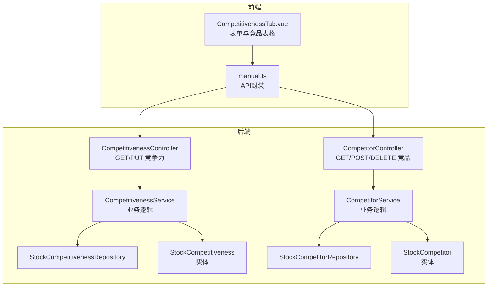
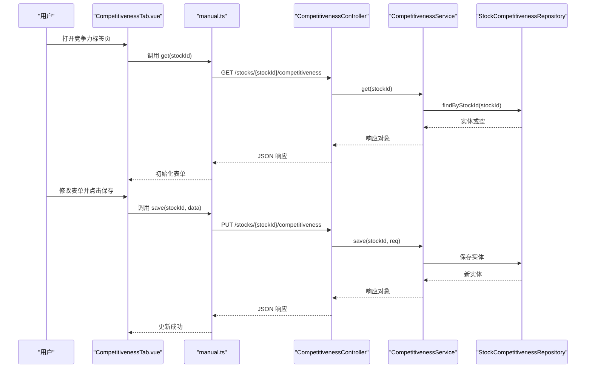
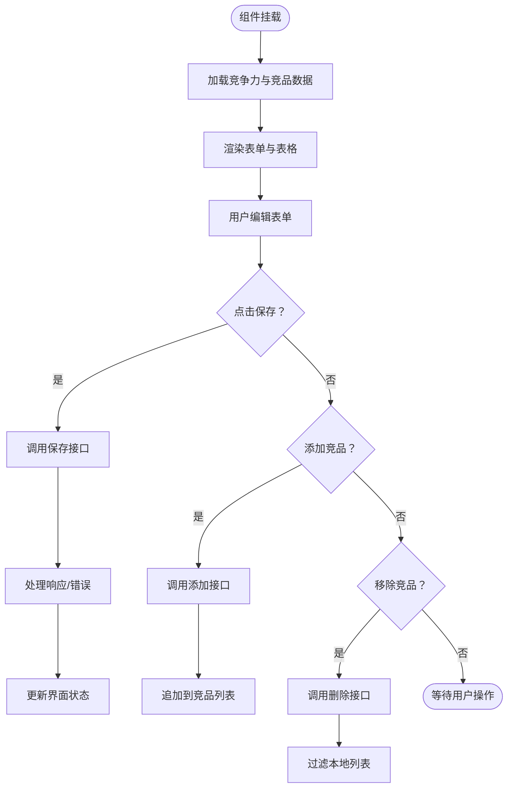
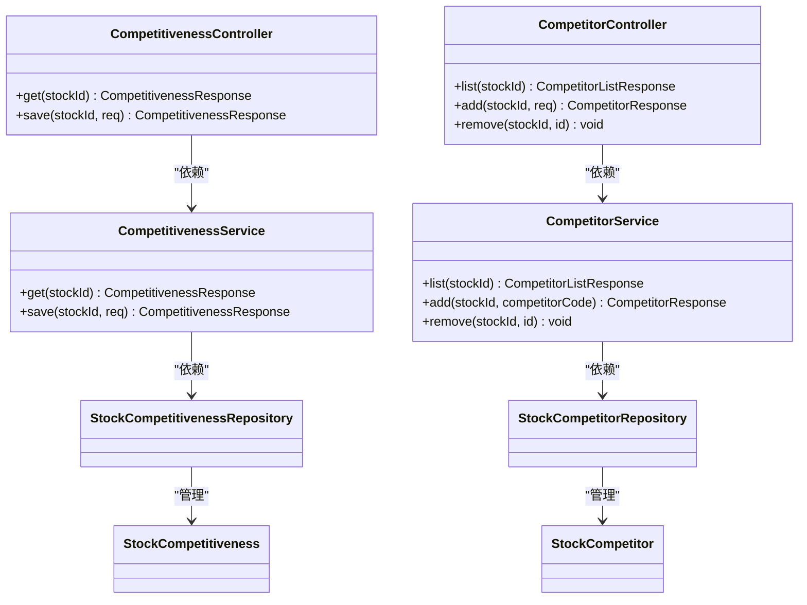
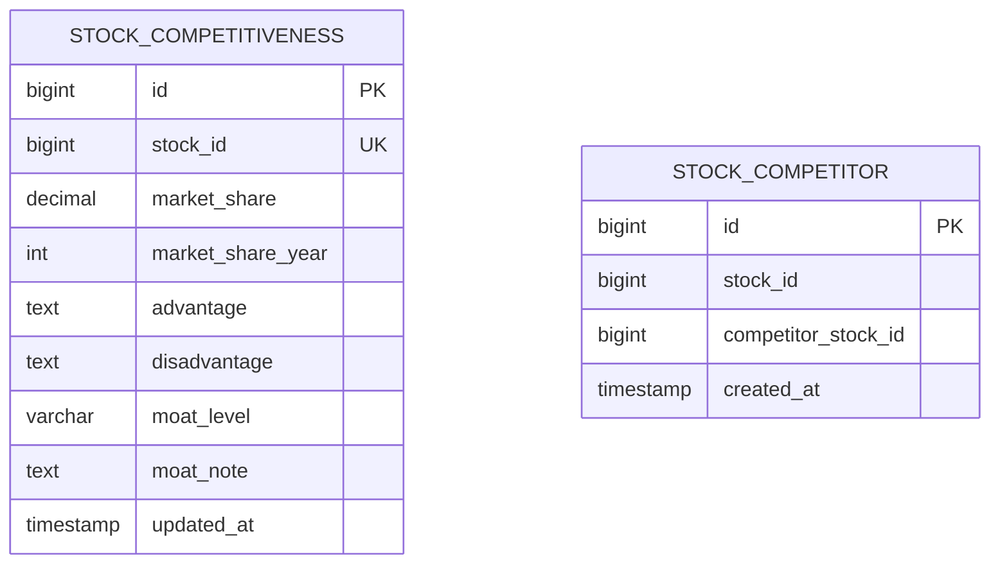
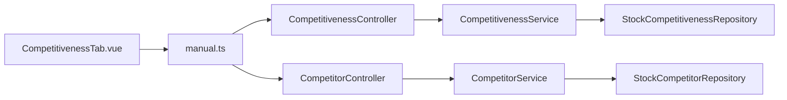

# 竞争力分析标签页

<cite>
**本文引用的文件**
- [CompetitivenessTab.vue](file://frontend/src/views/tabs/CompetitivenessTab.vue)
- [manual.ts](file://frontend/src/api/manual.ts)
- [CompetitivenessController.java](file://backend/src/main/java/com/stock/controller/CompetitivenessController.java)
- [CompetitorController.java](file://backend/src/main/java/com/stock/controller/CompetitorController.java)
- [CompetitivenessRequest.java](file://backend/src/main/java/com/stock/dto/request/CompetitivenessRequest.java)
- [AddCompetitorRequest.java](file://backend/src/main/java/com/stock/dto/request/AddCompetitorRequest.java)
- [CompetitivenessService.java](file://backend/src/main/java/com/stock/service/CompetitivenessService.java)
- [CompetitorService.java](file://backend/src/main/java/com/stock/service/CompetitorService.java)
- [CompetitivenessResponse.java](file://backend/src/main/java/com/stock/dto/response/CompetitivenessResponse.java)
- [CompetitorListResponse.java](file://backend/src/main/java/com/stock/dto/response/CompetitorListResponse.java)
- [StockCompetitiveness.java](file://backend/src/main/java/com/stock/entity/StockCompetitiveness.java)
- [StockCompetitor.java](file://backend/src/main/java/com/stock/entity/StockCompetitor.java)
- [StockCompetitivenessRepository.java](file://backend/src/main/java/com/stock/repository/StockCompetitivenessRepository.java)
- [StockCompetitorRepository.java](file://backend/src/main/java/com/stock/repository/StockCompetitorRepository.java)
</cite>

## 目录
1. [简介](#简介)
2. [项目结构](#项目结构)
3. [核心组件](#核心组件)
4. [架构总览](#架构总览)
5. [详细组件分析](#详细组件分析)
6. [依赖分析](#依赖分析)
7. [性能考虑](#性能考虑)
8. [故障排除指南](#故障排除指南)
9. [结论](#结论)
10. [附录：表单扩展开发指南](#附录表单扩展开发指南)

## 简介
本文件面向“竞争力分析标签页”组件，系统性阐述前端表单设计与实现、后端接口与业务逻辑、数据模型与持久化策略，并提供API调用方式、错误处理机制、用户体验优化建议以及可扩展的开发指南。重点覆盖以下能力：
- 竞争力评估表单：市场份额输入、年份输入、护城河等级选择、竞争优势/劣势文本编辑、护城河说明编辑
- 竞品管理：添加竞品（支持自动补齐缺失股票）、删除竞品、表格展示竞品关键指标
- 表单数据绑定与验证：双向绑定、类型约束、空值处理、保存状态管理
- API调用与错误处理：前后端接口契约、异常捕获与提示
- 用户体验优化：加载态、禁用态、格式化显示、颜色标识涨跌
- 扩展开发：字段扩展、校验规则扩展、新增竞品来源与联动

## 项目结构
该功能由前端Vue组件与后端Spring Boot控制器/服务/仓储组成，采用前后端分离架构：
- 前端：使用Composition API组织逻辑，通过手动封装的API模块调用后端REST接口
- 后端：提供REST接口，接收请求体参数，进行参数校验，调用服务层处理业务，返回响应对象

图表来源
- [CompetitivenessTab.vue:1-139](file://frontend/src/views/tabs/CompetitivenessTab.vue#L1-L139)
- [manual.ts:157-166](file://frontend/src/api/manual.ts#L157-L166)
- [CompetitivenessController.java:19-28](file://backend/src/main/java/com/stock/controller/CompetitivenessController.java#L19-L28)
- [CompetitorController.java:22-39](file://backend/src/main/java/com/stock/controller/CompetitorController.java#L22-L39)
- [CompetitivenessService.java:27-62](file://backend/src/main/java/com/stock/service/CompetitivenessService.java#L27-L62)
- [CompetitorService.java:33-82](file://backend/src/main/java/com/stock/service/CompetitorService.java#L33-L82)
- [StockCompetitiveness.java:18-50](file://backend/src/main/java/com/stock/entity/StockCompetitiveness.java#L18-L50)
- [StockCompetitor.java:17-31](file://backend/src/main/java/com/stock/entity/StockCompetitor.java#L17-L31)

章节来源
- [CompetitivenessTab.vue:1-139](file://frontend/src/views/tabs/CompetitivenessTab.vue#L1-L139)
- [manual.ts:157-166](file://frontend/src/api/manual.ts#L157-L166)
- [CompetitivenessController.java:19-28](file://backend/src/main/java/com/stock/controller/CompetitivenessController.java#L19-L28)
- [CompetitorController.java:22-39](file://backend/src/main/java/com/stock/controller/CompetitorController.java#L22-L39)

## 核心组件
- 前端组件：负责表单渲染、数据绑定、用户交互、API调用与错误提示
- API封装：统一管理REST接口路径、请求参数与响应类型
- 控制器：暴露REST端点，接收路由参数与请求体，调用服务层
- 服务层：执行业务逻辑，包含参数校验、数据清洗、事务控制
- 仓储层：基于JPA访问数据库，提供查询与持久化能力
- 实体模型：映射数据库表结构，定义字段精度与约束

章节来源
- [CompetitivenessTab.vue:64-139](file://frontend/src/views/tabs/CompetitivenessTab.vue#L64-L139)
- [manual.ts:56-88](file://frontend/src/api/manual.ts#L56-L88)
- [CompetitivenessController.java:19-28](file://backend/src/main/java/com/stock/controller/CompetitivenessController.java#L19-L28)
- [CompetitorController.java:22-39](file://backend/src/main/java/com/stock/controller/CompetitorController.java#L22-L39)
- [CompetitivenessService.java:27-62](file://backend/src/main/java/com/stock/service/CompetitivenessService.java#L27-L62)
- [CompetitorService.java:33-82](file://backend/src/main/java/com/stock/service/CompetitorService.java#L33-L82)
- [StockCompetitiveness.java:18-50](file://backend/src/main/java/com/stock/entity/StockCompetitiveness.java#L18-L50)
- [StockCompetitor.java:17-31](file://backend/src/main/java/com/stock/entity/StockCompetitor.java#L17-L31)

## 架构总览
下图展示了从用户在前端填写表单到后端持久化的完整流程：

图表来源
- [CompetitivenessTab.vue:83-119](file://frontend/src/views/tabs/CompetitivenessTab.vue#L83-L119)
- [manual.ts:157-160](file://frontend/src/api/manual.ts#L157-L160)
- [CompetitivenessController.java:19-28](file://backend/src/main/java/com/stock/controller/CompetitivenessController.java#L19-L28)
- [CompetitivenessService.java:27-62](file://backend/src/main/java/com/stock/service/CompetitivenessService.java#L27-L62)
- [StockCompetitivenessRepository.java:11](file://backend/src/main/java/com/stock/repository/StockCompetitivenessRepository.java#L11)

## 详细组件分析

### 前端表单组件（CompetitivenessTab.vue）
- 数据绑定
  - 使用响应式对象承载表单字段，支持数字类型与字符串类型双向绑定
  - 通过v-model.number确保数值字段正确解析为数字
- 渲染结构
  - 市场份额与年份：两列网格布局，便于对齐与阅读
  - 护城河等级：下拉选择框，枚举值为强/中/弱
  - 文本域：竞争优势、竞争劣势、护城河说明
  - 保存按钮：禁用态随保存状态变化
- 竞品表格
  - 展示字段：代码、名称、最新价、涨跌幅、PE、PB
  - 涨跌幅使用正负样式区分
  - 提供“添加竞品”和“移除”操作
- 生命周期
  - 组件挂载时加载竞争力数据与竞品列表
- API调用
  - 保存：调用竞争力保存接口
  - 添加竞品：提交股票代码，成功后追加到列表
  - 删除竞品：按ID删除，同步更新本地列表

图表来源
- [CompetitivenessTab.vue:83-137](file://frontend/src/views/tabs/CompetitivenessTab.vue#L83-L137)

章节来源
- [CompetitivenessTab.vue:1-139](file://frontend/src/views/tabs/CompetitivenessTab.vue#L1-L139)

### API封装（manual.ts）
- 竞争力接口
  - get：获取指定股票的竞争力数据
  - save：保存竞争力数据
- 竞品接口
  - list：获取竞品列表
  - add：添加竞品（传入股票代码）
  - remove：按ID删除竞品
- 类型定义
  - 定义了竞争力与竞品的请求/响应接口，确保类型安全

章节来源
- [manual.ts:56-88](file://frontend/src/api/manual.ts#L56-L88)
- [manual.ts:157-166](file://frontend/src/api/manual.ts#L157-L166)

### 后端控制器与服务
- 竞争力控制器
  - GET：根据股票ID获取竞争力数据
  - PUT：保存竞争力数据，参数由请求体提供
- 竞品控制器
  - GET：列出竞品
  - POST：添加竞品（传入股票代码），返回新建关系
  - DELETE：按ID删除竞品关系
- 服务层职责
  - 竞争力服务：校验股票存在性，读取/保存实体，时间戳更新，HTML内容清洗
  - 竞品服务：校验股票存在性与自引用限制，自动补齐缺失竞品股票，去重检查，创建/删除关系

图表来源
- [CompetitivenessController.java:19-28](file://backend/src/main/java/com/stock/controller/CompetitivenessController.java#L19-L28)
- [CompetitorController.java:22-39](file://backend/src/main/java/com/stock/controller/CompetitorController.java#L22-L39)
- [CompetitivenessService.java:27-62](file://backend/src/main/java/com/stock/service/CompetitivenessService.java#L27-L62)
- [CompetitorService.java:33-82](file://backend/src/main/java/com/stock/service/CompetitorService.java#L33-L82)
- [StockCompetitivenessRepository.java:11](file://backend/src/main/java/com/stock/repository/StockCompetitivenessRepository.java#L11)
- [StockCompetitorRepository.java:11](file://backend/src/main/java/com/stock/repository/StockCompetitorRepository.java#L11)
- [StockCompetitiveness.java:18-50](file://backend/src/main/java/com/stock/entity/StockCompetitiveness.java#L18-L50)
- [StockCompetitor.java:17-31](file://backend/src/main/java/com/stock/entity/StockCompetitor.java#L17-L31)

章节来源
- [CompetitivenessController.java:19-28](file://backend/src/main/java/com/stock/controller/CompetitivenessController.java#L19-L28)
- [CompetitorController.java:22-39](file://backend/src/main/java/com/stock/controller/CompetitorController.java#L22-L39)
- [CompetitivenessService.java:27-62](file://backend/src/main/java/com/stock/service/CompetitivenessService.java#L27-L62)
- [CompetitorService.java:33-82](file://backend/src/main/java/com/stock/service/CompetitorService.java#L33-L82)

### 数据模型与持久化
- 竞争力实体
  - 字段：stockId、marketShare（精度10,小数4）、marketShareYear、advantage/disadvantage/moatNote（TEXT）
  - 约束：stock_id唯一
- 竞品实体
  - 字段：stock_id、competitor_stock_id、created_at
  - 约束：(stock_id, competitor_stock_id)唯一
- 仓储接口
  - 提供按stock_id查询、存在性检查、批量删除等方法

图表来源
- [StockCompetitiveness.java:18-50](file://backend/src/main/java/com/stock/entity/StockCompetitiveness.java#L18-L50)
- [StockCompetitor.java:17-31](file://backend/src/main/java/com/stock/entity/StockCompetitor.java#L17-L31)

章节来源
- [StockCompetitiveness.java:18-50](file://backend/src/main/java/com/stock/entity/StockCompetitiveness.java#L18-L50)
- [StockCompetitor.java:17-31](file://backend/src/main/java/com/stock/entity/StockCompetitor.java#L17-L31)
- [StockCompetitivenessRepository.java:11](file://backend/src/main/java/com/stock/repository/StockCompetitivenessRepository.java#L11)
- [StockCompetitorRepository.java:11](file://backend/src/main/java/com/stock/repository/StockCompetitorRepository.java#L11)

### 表单数据绑定、验证与保存状态
- 数据绑定
  - 数字输入使用v-model.number，确保类型正确
  - 文本域使用v-model，支持多行编辑
- 验证规则
  - 市场份额：0-100范围
  - 年份：2000-2100范围
  - 文本长度：优势/劣势最大10000字符，护城河说明最大5000字符
  - 竞品代码：非空且必须为6位
- 保存状态管理
  - 保存过程中禁用按钮，避免重复提交
  - 异常时弹窗提示具体错误消息

章节来源
- [CompetitivenessRequest.java:6-13](file://backend/src/main/java/com/stock/dto/request/CompetitivenessRequest.java#L6-L13)
- [AddCompetitorRequest.java:6-8](file://backend/src/main/java/com/stock/dto/request/AddCompetitorRequest.java#L6-L8)
- [CompetitivenessTab.vue:102-119](file://frontend/src/views/tabs/CompetitivenessTab.vue#L102-L119)

### 竞品管理交互逻辑
- 添加竞品
  - 输入6位股票代码，调用添加接口
  - 成功后将新竞品追加到本地列表
  - 失败时弹窗提示错误信息
- 删除竞品
  - 调用删除接口，按ID移除本地列表项
- 列表展示
  - 展示竞品代码、名称及关键指标
  - 未设置数据时显示提示文案

章节来源
- [CompetitivenessTab.vue:121-137](file://frontend/src/views/tabs/CompetitivenessTab.vue#L121-L137)
- [manual.ts:162-166](file://frontend/src/api/manual.ts#L162-L166)
- [CompetitorController.java:27-39](file://backend/src/main/java/com/stock/controller/CompetitorController.java#L27-L39)
- [CompetitorService.java:49-82](file://backend/src/main/java/com/stock/service/CompetitorService.java#L49-L82)

## 依赖分析
- 前端依赖
  - 组件依赖API封装模块，API模块依赖通用HTTP客户端
- 后端依赖
  - 控制器依赖服务层；服务层依赖仓储层与实体；仓储层依赖JPA
- 关键耦合点
  - 前后端通过DTO契约解耦，前端仅依赖接口签名与类型定义
  - 服务层承担业务规则与事务边界，控制器仅做参数转发

图表来源
- [CompetitivenessTab.vue:67](file://frontend/src/views/tabs/CompetitivenessTab.vue#L67)
- [manual.ts:157-166](file://frontend/src/api/manual.ts#L157-L166)
- [CompetitivenessController.java:15](file://backend/src/main/java/com/stock/controller/CompetitivenessController.java#L15)
- [CompetitorController.java:18](file://backend/src/main/java/com/stock/controller/CompetitorController.java#L18)
- [CompetitivenessService.java:22](file://backend/src/main/java/com/stock/service/CompetitivenessService.java#L22)
- [CompetitorService.java:25](file://backend/src/main/java/com/stock/service/CompetitorService.java#L25)

章节来源
- [CompetitivenessTab.vue:64-139](file://frontend/src/views/tabs/CompetitivenessTab.vue#L64-L139)
- [manual.ts:157-166](file://frontend/src/api/manual.ts#L157-L166)
- [CompetitivenessController.java:15-17](file://backend/src/main/java/com/stock/controller/CompetitivenessController.java#L15-L17)
- [CompetitorController.java:18-20](file://backend/src/main/java/com/stock/controller/CompetitorController.java#L18-L20)

## 性能考虑
- 前端
  - 使用响应式对象集中管理状态，减少不必要的重渲染
  - 保存按钮禁用态避免重复提交，提升交互稳定性
- 后端
  - 查询使用按stock_id索引的唯一约束，保证O(1)查找
  - 事务边界明确，仅在写入时开启，降低锁持有时间
- 网络
  - 接口粒度清晰，避免一次性传输冗余数据
  - 错误信息包含具体message，便于前端快速反馈

## 故障排除指南
- 常见问题
  - 保存失败：检查网络连接与后端服务状态；查看弹窗中的错误消息
  - 添加竞品失败：确认股票代码为6位；避免添加自身为竞品；检查是否已存在竞品关系
  - 竞品列表为空：确认该股票是否存在竞品关系；检查后端查询逻辑
- 排查步骤
  - 前端：打开浏览器开发者工具，查看Network面板的请求与响应
  - 后端：查看日志中是否有StockNotFoundException、InvalidStockCodeException、DuplicateStockException等异常
- 错误处理机制
  - 前端：捕获异常并弹窗提示，保留原有数据
  - 后端：控制器与服务层抛出明确异常，由全局异常处理器统一返回

章节来源
- [CompetitivenessTab.vue:114-118](file://frontend/src/views/tabs/CompetitivenessTab.vue#L114-L118)
- [CompetitorService.java:54-67](file://backend/src/main/java/com/stock/service/CompetitorService.java#L54-L67)
- [CompetitivenessService.java:28-30](file://backend/src/main/java/com/stock/service/CompetitivenessService.java#L28-L30)

## 结论
竞争力分析标签页以简洁的表单与表格为核心，结合前后端清晰的接口契约与严格的参数校验，实现了从数据录入到竞品管理的完整闭环。通过HTML清洗、事务控制与错误提示机制，保障了数据质量与用户体验。后续可在字段扩展、校验增强与竞品来源联动等方面持续演进。

## 附录：表单扩展开发指南
- 字段扩展
  - 在前端：新增响应式字段与模板绑定，保持v-model与类型一致
  - 在后端：DTO增加字段与校验注解，服务层读写实体对应字段
- 校验规则扩展
  - 在后端：利用jakarta.validation注解组合复杂规则
  - 在前端：结合v-model与计算属性实现动态校验提示
- 新增竞品来源
  - 可扩展为从行业/板块/指数等维度批量导入竞品
  - 建议引入“竞品池”概念，支持筛选与预览后再添加
- 用户体验优化
  - 表单分步保存：支持草稿保存与离线缓存
  - 图表联动：在表格中嵌入趋势图或关键指标对比
  - 快捷键：支持回车保存、快捷删除等操作