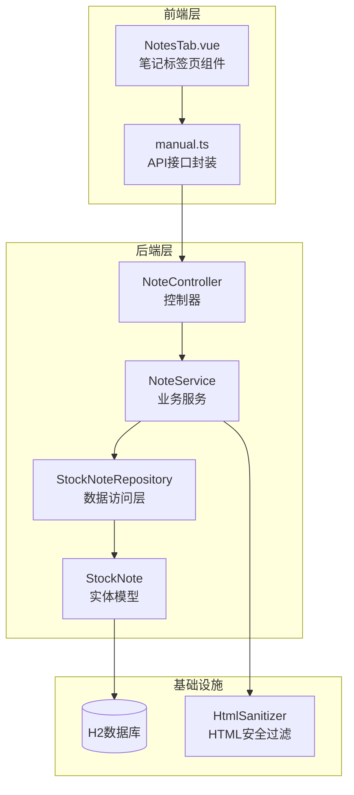
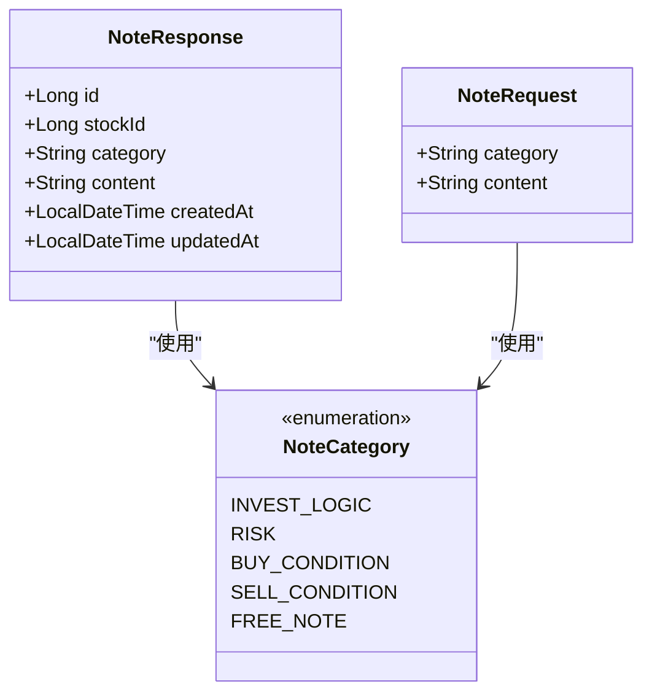
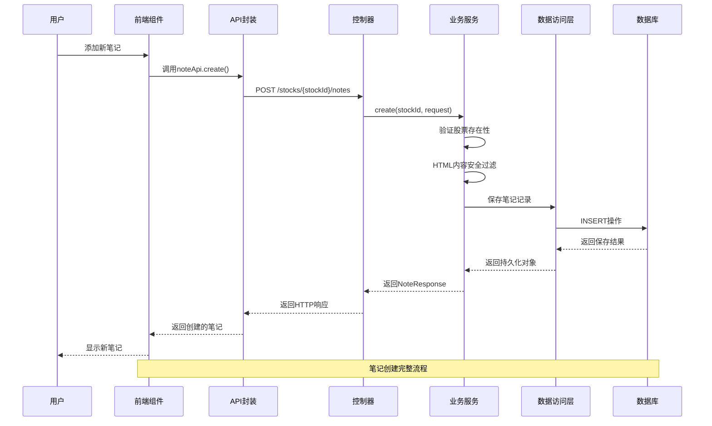
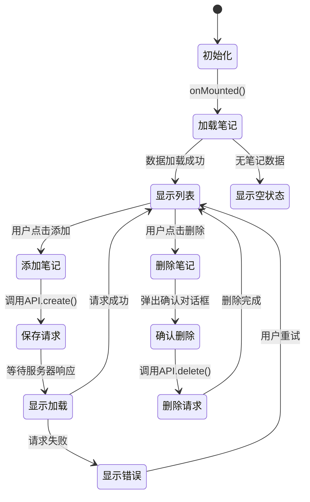
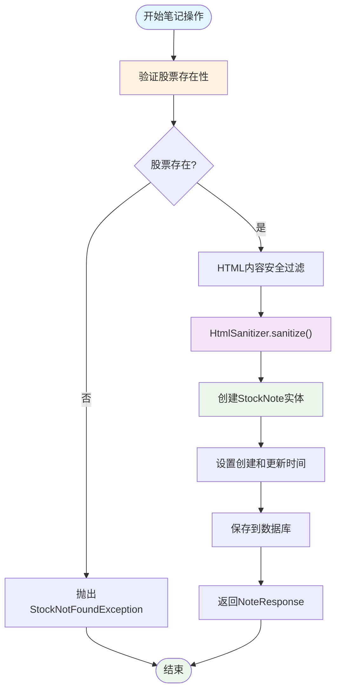
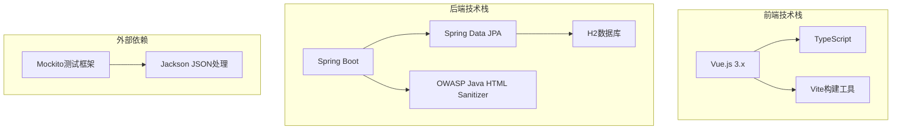
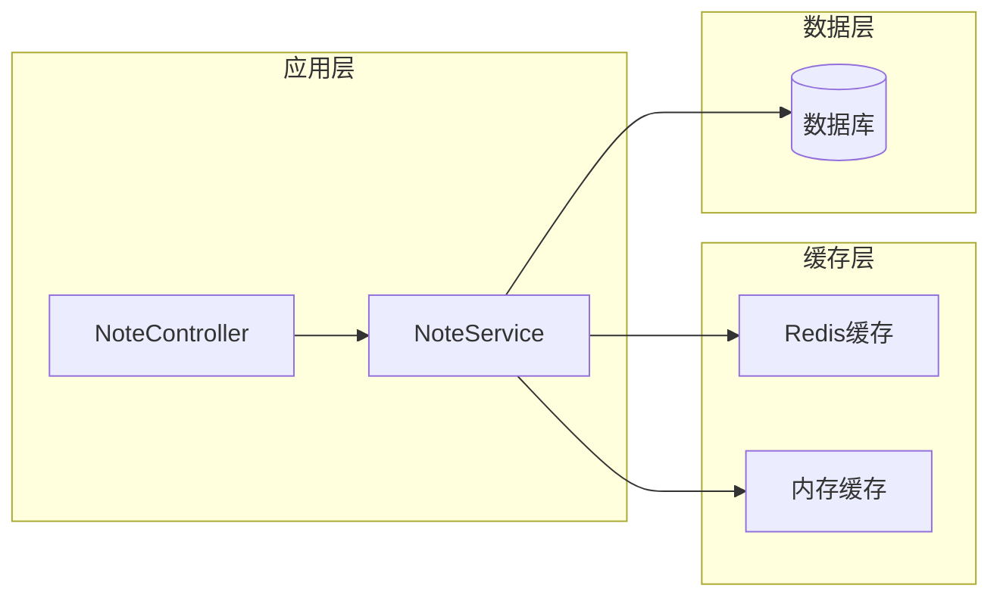
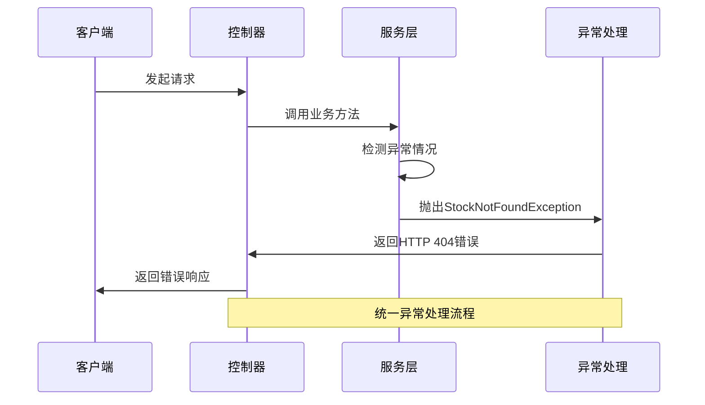
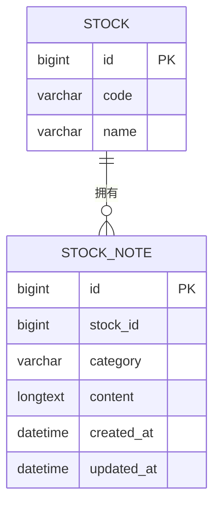

# 笔记管理标签页

<cite>
**本文档引用的文件**
- [NoteController.java](file://backend/src/main/java/com/stock/controller/NoteController.java)
- [NoteService.java](file://backend/src/main/java/com/stock/service/NoteService.java)
- [StockNote.java](file://backend/src/main/java/com/stock/entity/StockNote.java)
- [StockNoteRepository.java](file://backend/src/main/java/com/stock/repository/StockNoteRepository.java)
- [NoteRequest.java](file://backend/src/main/java/com/stock/dto/request/NoteRequest.java)
- [NoteUpdateRequest.java](file://backend/src/main/java/com/stock/dto/request/NoteUpdateRequest.java)
- [NoteResponse.java](file://backend/src/main/java/com/stock/dto/response/NoteResponse.java)
- [HtmlSanitizer.java](file://backend/src/main/java/com/stock/util/HtmlSanitizer.java)
- [NotesTab.vue](file://frontend/src/views/tabs/NotesTab.vue)
- [manual.ts](file://frontend/src/api/manual.ts)
- [application.yml](file://backend/src/main/resources/application.yml)
- [NoteControllerTest.java](file://backend/src/test/java/com/stock/controller/NoteControllerTest.java)
- [NoteServiceTest.java](file://backend/src/test/java/com/stock/service/NoteServiceTest.java)
</cite>

## 目录
1. [简介](#简介)
2. [项目结构](#项目结构)
3. [核心组件](#核心组件)
4. [架构概览](#架构概览)
5. [详细组件分析](#详细组件分析)
6. [依赖关系分析](#依赖关系分析)
7. [性能考虑](#性能考虑)
8. [故障排除指南](#故障排除指南)
9. [结论](#结论)
10. [附录](#附录)

## 简介

笔记管理标签页是股票交易系统中的重要功能模块，为用户提供投资笔记的创建、编辑、分类和管理能力。该模块采用前后端分离架构，后端基于Spring Boot提供RESTful API服务，前端使用Vue.js构建用户界面。

本系统支持多种笔记分类类型，包括投资逻辑、风险点、买入条件、卖出条件和自由笔记，为用户提供灵活的投资记录方式。所有笔记内容均经过HTML安全过滤处理，确保系统安全性。

## 项目结构

笔记功能在整体项目架构中的位置如下：

**图表来源**
- [NotesTab.vue:1-80](file://frontend/src/views/tabs/NotesTab.vue#L1-L80)
- [NoteController.java:14-50](file://backend/src/main/java/com/stock/controller/NoteController.java#L14-L50)
- [NoteService.java:17-78](file://backend/src/main/java/com/stock/service/NoteService.java#L17-L78)

**章节来源**
- [NotesTab.vue:1-80](file://frontend/src/views/tabs/NotesTab.vue#L1-L80)
- [NoteController.java:14-50](file://backend/src/main/java/com/stock/controller/NoteController.java#L14-L50)
- [NoteService.java:17-78](file://backend/src/main/java/com/stock/service/NoteService.java#L17-L78)

## 核心组件

### 数据模型设计

笔记系统采用简洁高效的数据模型设计，主要包含以下核心字段：

| 字段名 | 类型 | 约束 | 描述 |
|--------|------|------|------|
| id | Long | 主键, 自增 | 笔记唯一标识符 |
| stock_id | Long | 非空 | 关联的股票标识符 |
| category | String | 非空, 长度20 | 笔记分类类型 |
| content | TEXT | 非空, 大字段 | 笔记内容，支持富文本 |
| created_at | LocalDateTime | 可空 | 创建时间 |
| updated_at | LocalDateTime | 可空 | 更新时间 |

### 笔记分类体系

系统支持五种预定义的笔记分类：

**图表来源**
- [NoteResponse.java:5-12](file://backend/src/main/java/com/stock/dto/response/NoteResponse.java#L5-L12)
- [NoteRequest.java:6-9](file://backend/src/main/java/com/stock/dto/request/NoteRequest.java#L6-L9)

**章节来源**
- [StockNote.java:15-36](file://backend/src/main/java/com/stock/entity/StockNote.java#L15-L36)
- [NoteResponse.java:5-12](file://backend/src/main/java/com/stock/dto/response/NoteResponse.java#L5-L12)
- [NoteRequest.java:6-9](file://backend/src/main/java/com/stock/dto/request/NoteRequest.java#L6-L9)

## 架构概览

笔记功能采用经典的三层架构模式，实现了清晰的关注点分离：

**图表来源**
- [NotesTab.vue:51-61](file://frontend/src/views/tabs/NotesTab.vue#L51-L61)
- [manual.ts:168-176](file://frontend/src/api/manual.ts#L168-L176)
- [NoteController.java:30-35](file://backend/src/main/java/com/stock/controller/NoteController.java#L30-L35)
- [NoteService.java:40-55](file://backend/src/main/java/com/stock/service/NoteService.java#L40-L55)

## 详细组件分析

### 前端组件实现

NotesTab.vue是笔记功能的用户界面组件，提供了直观的交互体验：

#### 组件功能特性

| 功能特性 | 实现方式 | 用户体验 |
|----------|----------|----------|
| 笔记分类选择 | 下拉菜单选择预定义分类 | 直观易用，避免输入错误 |
| 富文本编辑 | 文本输入框支持换行显示 | 支持多行内容编辑 |
| 实时列表展示 | Vue响应式数据绑定 | 即时反映数据变化 |
| 删除确认 | 确认对话框防止误操作 | 提高操作安全性 |

#### 组件状态管理

**图表来源**
- [NotesTab.vue:39-67](file://frontend/src/views/tabs/NotesTab.vue#L39-L67)

**章节来源**
- [NotesTab.vue:1-80](file://frontend/src/views/tabs/NotesTab.vue#L1-L80)
- [manual.ts:168-176](file://frontend/src/api/manual.ts#L168-L176)

### 后端服务实现

NoteService是笔记功能的核心业务逻辑层，负责处理所有业务规则和数据验证。

#### 业务流程设计

**图表来源**
- [NoteService.java:40-55](file://backend/src/main/java/com/stock/service/NoteService.java#L40-L55)
- [HtmlSanitizer.java:10-13](file://backend/src/main/java/com/stock/util/HtmlSanitizer.java#L10-L13)

#### 安全防护机制

系统实现了多层次的安全防护措施：

1. **输入验证**: 使用Jakarta Validation注解确保数据完整性
2. **HTML过滤**: 通过OWASP HTML Sanitizer过滤潜在危险内容
3. **异常处理**: 统一的异常处理机制提供友好的错误信息

**章节来源**
- [NoteService.java:17-78](file://backend/src/main/java/com/stock/service/NoteService.java#L17-L78)
- [HtmlSanitizer.java:1-15](file://backend/src/main/java/com/stock/util/HtmlSanitizer.java#L1-15)

### 数据访问层设计

StockNoteRepository继承自JpaRepository，提供了高效的数据库操作能力：

#### 查询策略优化

| 查询场景 | 方法名称 | 性能特点 | 使用场景 |
|----------|----------|----------|----------|
| 按股票ID查询 | findByStockIdOrderByUpdatedAtDesc | 索引优化 | 获取股票所有笔记 |
| 按分类过滤 | findByStockIdAndCategoryOrderByUpdatedAtDesc | 复合索引 | 分类筛选笔记 |
| 批量删除 | deleteByStockId | 原生SQL优化 | 清理关联数据 |

**章节来源**
- [StockNoteRepository.java:9-16](file://backend/src/main/java/com/stock/repository/StockNoteRepository.java#L9-L16)

## 依赖关系分析

### 技术栈依赖

**图表来源**
- [application.yml:4-17](file://backend/src/main/resources/application.yml#L4-L17)
- [NoteControllerTest.java:8-37](file://backend/src/test/java/com/stock/controller/NoteControllerTest.java#L8-L37)

### 测试覆盖分析

系统具备完善的测试体系，确保代码质量：

| 测试类型 | 覆盖范围 | 测试方法 |
|----------|----------|----------|
| 单元测试 | 业务逻辑 | Mockito模拟对象 |
| 集成测试 | 控制器层 | MockMvc测试框架 |
| 数据验证 | 输入参数 | Spring Validation |

**章节来源**
- [NoteControllerTest.java:22-59](file://backend/src/test/java/com/stock/controller/NoteControllerTest.java#L22-L59)
- [NoteServiceTest.java:24-81](file://backend/src/test/java/com/stock/service/NoteServiceTest.java#L24-L81)

## 性能考虑

### 数据库性能优化

1. **索引策略**: 在`stock_id`和`category`字段上建立适当的索引
2. **查询优化**: 使用投影查询减少不必要的数据传输
3. **连接池配置**: 合理配置HikariCP连接池参数

### 缓存策略

虽然当前实现未包含缓存层，但建议在生产环境中考虑：

### 并发处理

系统采用Spring事务管理确保数据一致性：

- **事务边界**: 在NoteService方法上使用@Transactional注解
- **隔离级别**: 默认的READ_COMMITTED隔离级别
- **并发控制**: 数据库层面的行级锁机制

## 故障排除指南

### 常见问题诊断

| 问题症状 | 可能原因 | 解决方案 |
|----------|----------|----------|
| 笔记无法保存 | 股票ID不存在 | 验证股票ID有效性 |
| 内容显示异常 | HTML标签被过滤 | 检查HtmlSanitizer配置 |
| 列表为空 | 数据库连接问题 | 检查H2数据库状态 |
| API调用失败 | CORS跨域问题 | 配置CORS允许策略 |

### 错误处理机制

系统实现了统一的异常处理：

**图表来源**
- [NoteService.java:42-44](file://backend/src/main/java/com/stock/service/NoteService.java#L42-L44)

**章节来源**
- [NoteService.java:42-44](file://backend/src/main/java/com/stock/service/NoteService.java#L42-L44)

## 结论

笔记管理标签页组件展现了良好的软件工程实践，具有以下优势：

1. **架构清晰**: 采用分层架构，职责分离明确
2. **安全性强**: 实现了多层次的安全防护机制
3. **扩展性强**: 模块化设计便于功能扩展
4. **测试完备**: 具备完善的单元和集成测试

该组件为股票交易系统提供了重要的知识管理能力，支持用户进行有效的投资记录和分析。

## 附录

### API接口规范

| 接口名称 | HTTP方法 | 路径 | 功能描述 |
|----------|----------|------|----------|
| 获取笔记列表 | GET | `/api/v1/stocks/{stockId}/notes` | 获取指定股票的所有笔记 |
| 创建笔记 | POST | `/api/v1/stocks/{stockId}/notes` | 为股票创建新笔记 |
| 更新笔记 | PUT | `/api/v1/stocks/{stockId}/notes/{id}` | 更新现有笔记内容 |
| 删除笔记 | DELETE | `/api/v1/stocks/{stockId}/notes/{id}` | 删除指定笔记 |

### 数据库设计

**图表来源**
- [StockNote.java:14-36](file://backend/src/main/java/com/stock/entity/StockNote.java#L14-L36)

### 安全配置

系统安全配置要点：

1. **HTML内容过滤**: 仅允许安全的HTML标签
2. **输入长度限制**: 最大支持10000字符内容
3. **路径参数验证**: 所有路径参数进行类型检查
4. **异常信息脱敏**: 避免泄露敏感系统信息