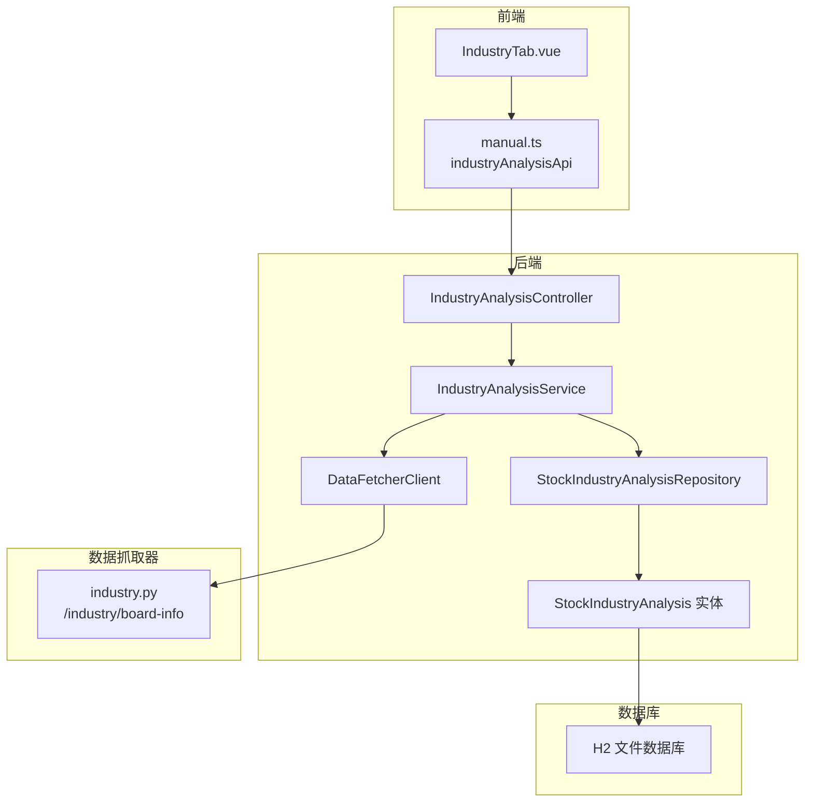
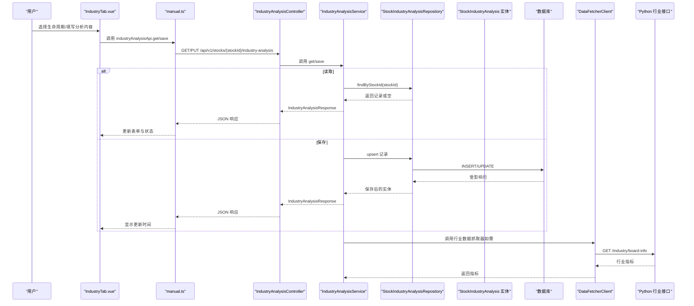
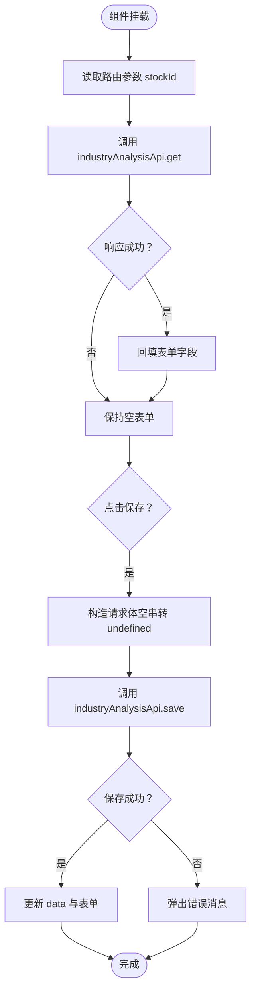
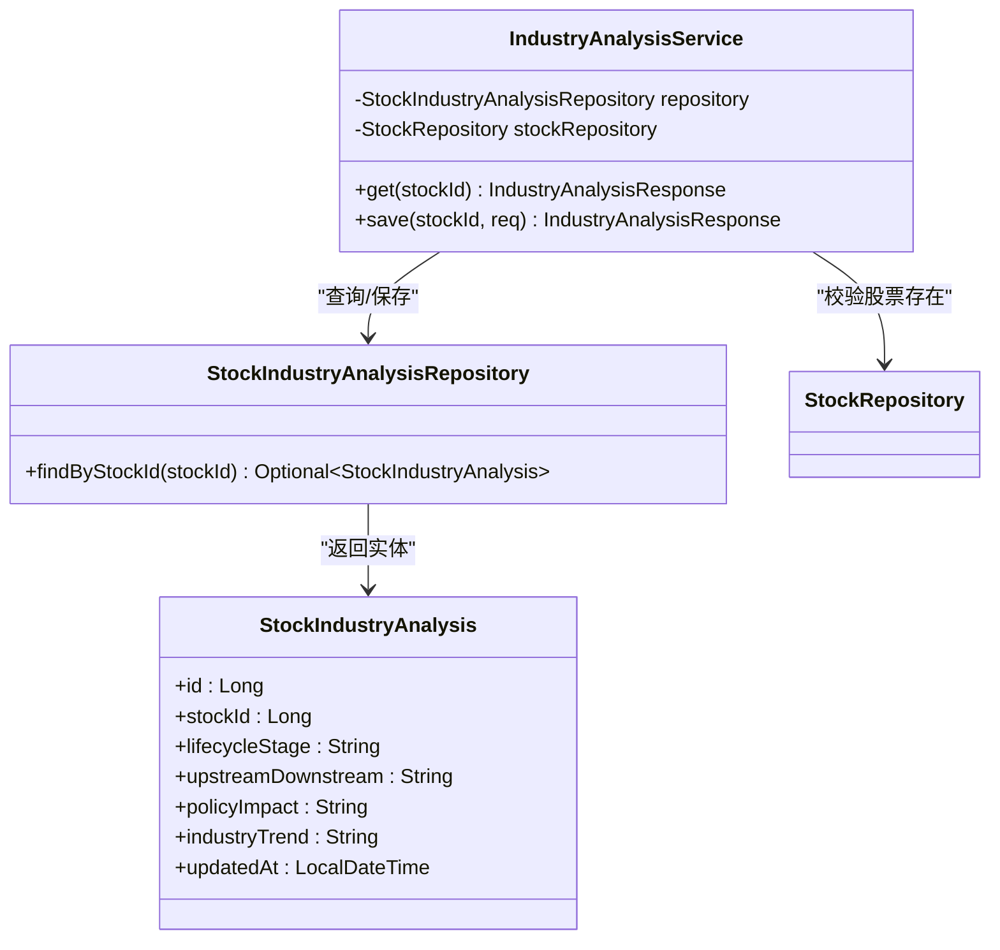
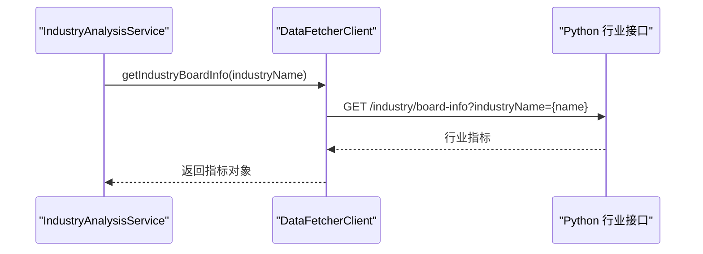
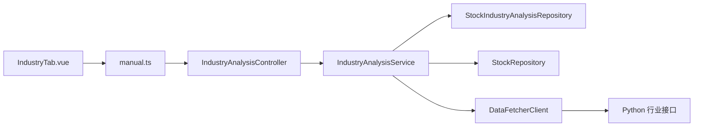

# 行业分析标签页

<cite>
**本文引用的文件**
- [IndustryAnalysisController.java](file://backend/src/main/java/com/stock/controller/IndustryAnalysisController.java)
- [IndustryAnalysisService.java](file://backend/src/main/java/com/stock/service/IndustryAnalysisService.java)
- [IndustryAnalysisRequest.java](file://backend/src/main/java/com/stock/dto/request/IndustryAnalysisRequest.java)
- [IndustryAnalysisResponse.java](file://backend/src/main/java/com/stock/dto/response/IndustryAnalysisResponse.java)
- [StockIndustryAnalysis.java](file://backend/src/main/java/com/stock/entity/StockIndustryAnalysis.java)
- [StockIndustryAnalysisRepository.java](file://backend/src/main/java/com/stock/repository/StockIndustryAnalysisRepository.java)
- [IndustryTab.vue](file://frontend/src/views/tabs/IndustryTab.vue)
- [manual.ts](file://frontend/src/api/manual.ts)
- [DataFetcherClient.java](file://backend/src/main/java/com/stock/client/DataFetcherClient.java)
- [industry.py](file://data-fetcher/routers/industry.py)
- [application.yml](file://backend/src/main/resources/application.yml)
- [IndustryAnalysisServiceTest.java](file://backend/src/test/java/com/stock/service/IndustryAnalysisServiceTest.java)
</cite>

## 目录
1. [简介](#简介)
2. [项目结构](#项目结构)
3. [核心组件](#核心组件)
4. [架构总览](#架构总览)
5. [详细组件分析](#详细组件分析)
6. [依赖分析](#依赖分析)
7. [性能考虑](#性能考虑)
8. [故障排查指南](#故障排查指南)
9. [结论](#结论)
10. [附录](#附录)

## 简介
本文件面向“行业分析标签页”组件，系统性阐述行业数据的展示与交互方式，涵盖行业分类、行业对比、行业趋势分析等能力。文档重点说明行业数据的获取与处理流程、行业指数计算、行业轮动分析的实现思路；解释行业分类体系、对比维度设置、时间范围选择；给出行业数据可视化方案、交互式图表实现与动态数据更新策略；并提供行业分析功能定制指南与数据源扩展方法。

## 项目结构
行业分析标签页由前端 Vue 组件、后端 Spring 控制器与服务层、数据库实体与仓库、以及数据抓取器（Python FastAPI）共同组成。前端通过 API 封装调用后端接口，后端通过 DataFetcherClient 访问 Python 数据抓取器，最终将行业分析结果持久化到数据库。

**图表来源**
- [IndustryTab.vue:1-81](file://frontend/src/views/tabs/IndustryTab.vue#L1-L81)
- [manual.ts:132-135](file://frontend/src/api/manual.ts#L132-L135)
- [IndustryAnalysisController.java:1-30](file://backend/src/main/java/com/stock/controller/IndustryAnalysisController.java#L1-L30)
- [IndustryAnalysisService.java:1-61](file://backend/src/main/java/com/stock/service/IndustryAnalysisService.java#L1-L61)
- [StockIndustryAnalysisRepository.java:1-13](file://backend/src/main/java/com/stock/repository/StockIndustryAnalysisRepository.java#L1-L13)
- [StockIndustryAnalysis.java:1-44](file://backend/src/main/java/com/stock/entity/StockIndustryAnalysis.java#L1-L44)
- [DataFetcherClient.java:1-126](file://backend/src/main/java/com/stock/client/DataFetcherClient.java#L1-L126)
- [industry.py:1-59](file://data-fetcher/routers/industry.py#L1-L59)
- [application.yml:19-22](file://backend/src/main/resources/application.yml#L19-L22)

**章节来源**
- [IndustryTab.vue:1-81](file://frontend/src/views/tabs/IndustryTab.vue#L1-L81)
- [manual.ts:132-135](file://frontend/src/api/manual.ts#L132-L135)
- [IndustryAnalysisController.java:1-30](file://backend/src/main/java/com/stock/controller/IndustryAnalysisController.java#L1-L30)
- [IndustryAnalysisService.java:1-61](file://backend/src/main/java/com/stock/service/IndustryAnalysisService.java#L1-L61)
- [StockIndustryAnalysisRepository.java:1-13](file://backend/src/main/java/com/stock/repository/StockIndustryAnalysisRepository.java#L1-L13)
- [StockIndustryAnalysis.java:1-44](file://backend/src/main/java/com/stock/entity/StockIndustryAnalysis.java#L1-L44)
- [DataFetcherClient.java:1-126](file://backend/src/main/java/com/stock/client/DataFetcherClient.java#L1-L126)
- [industry.py:1-59](file://data-fetcher/routers/industry.py#L1-L59)
- [application.yml:19-22](file://backend/src/main/resources/application.yml#L19-L22)

## 核心组件
- 前端标签页组件：IndustryTab.vue 提供生命周期阶段选择、上下游分析、政策影响、行业趋势等富文本输入与保存交互。
- 后端控制器：IndustryAnalysisController 提供 GET/PUT 接口，绑定路径参数 stockId，返回/保存行业分析结果。
- 服务层：IndustryAnalysisService 负责校验股票存在性、读取/写入行业分析记录，并进行富文本安全处理。
- 数据模型：StockIndustryAnalysis 实体映射数据库表 stock_industry_analysis，包含生命周期、上下游、政策影响、行业趋势与更新时间。
- 数据访问：StockIndustryAnalysisRepository 提供按 stockId 查询的能力。
- 数据抓取器：DataFetcherClient 通过 RestTemplate 调用 Python FastAPI 的行业板块信息接口。
- 行业数据源：Python FastAPI 路由 industry.py 提供 /industry/board-info 接口，返回行业最新价格、涨跌幅、主力净流入、换手率等指标。

**章节来源**
- [IndustryTab.vue:1-81](file://frontend/src/views/tabs/IndustryTab.vue#L1-L81)
- [IndustryAnalysisController.java:1-30](file://backend/src/main/java/com/stock/controller/IndustryAnalysisController.java#L1-L30)
- [IndustryAnalysisService.java:1-61](file://backend/src/main/java/com/stock/service/IndustryAnalysisService.java#L1-L61)
- [StockIndustryAnalysis.java:1-44](file://backend/src/main/java/com/stock/entity/StockIndustryAnalysis.java#L1-L44)
- [StockIndustryAnalysisRepository.java:1-13](file://backend/src/main/java/com/stock/repository/StockIndustryAnalysisRepository.java#L1-L13)
- [DataFetcherClient.java:1-126](file://backend/src/main/java/com/stock/client/DataFetcherClient.java#L1-L126)
- [industry.py:1-59](file://data-fetcher/routers/industry.py#L1-L59)

## 架构总览
下图展示了从用户操作到数据持久化的完整链路，以及行业数据抓取器的外部集成。

**图表来源**
- [IndustryTab.vue:33-81](file://frontend/src/views/tabs/IndustryTab.vue#L33-L81)
- [manual.ts:132-135](file://frontend/src/api/manual.ts#L132-L135)
- [IndustryAnalysisController.java:19-28](file://backend/src/main/java/com/stock/controller/IndustryAnalysisController.java#L19-L28)
- [IndustryAnalysisService.java:27-59](file://backend/src/main/java/com/stock/service/IndustryAnalysisService.java#L27-L59)
- [StockIndustryAnalysisRepository.java:11-11](file://backend/src/main/java/com/stock/repository/StockIndustryAnalysisRepository.java#L11-L11)
- [DataFetcherClient.java:101-105](file://backend/src/main/java/com/stock/client/DataFetcherClient.java#L101-L105)
- [industry.py:9-38](file://data-fetcher/routers/industry.py#L9-L38)

## 详细组件分析

### 前端组件：IndustryTab.vue
- 功能要点
  - 生命周期阶段选择：提供导入期/成长期/成熟期/衰退期的中文枚举值，支持双向绑定。
  - 富文本输入：上下游分析、政策影响、行业趋势使用 textarea，支持多行文本。
  - 保存与加载：首次挂载时根据路由参数 stockId 调用后端接口获取数据并填充表单；点击保存时提交表单至后端。
  - 状态反馈：保存按钮禁用态与错误提示；显示最近更新时间。
- 交互流程
  - onMounted：读取路由参数 id，调用 industryAnalysisApi.get 获取数据并回填表单。
  - handleSave：构造请求体（空字符串转 undefined），调用 industryAnalysisApi.save，成功后刷新 data 并更新表单字段。

**图表来源**
- [IndustryTab.vue:49-81](file://frontend/src/views/tabs/IndustryTab.vue#L49-L81)
- [manual.ts:132-135](file://frontend/src/api/manual.ts#L132-L135)

**章节来源**
- [IndustryTab.vue:1-81](file://frontend/src/views/tabs/IndustryTab.vue#L1-L81)
- [manual.ts:132-135](file://frontend/src/api/manual.ts#L132-L135)

### 后端控制器：IndustryAnalysisController
- 路径与方法
  - GET /api/v1/stocks/{stockId}/industry-analysis：查询某只股票的行业分析。
  - PUT /api/v1/stocks/{stockId}/industry-analysis：保存行业分析内容。
- 参数绑定
  - 路径变量 stockId：Long 类型。
  - 请求体 IndustryAnalysisRequest：包含生命周期、上下游、政策影响、行业趋势。
- 返回值
  - IndustryAnalysisResponse：包含 stockId、生命周期、上下游、政策影响、行业趋势、updatedAt。

**章节来源**
- [IndustryAnalysisController.java:1-30](file://backend/src/main/java/com/stock/controller/IndustryAnalysisController.java#L1-L30)
- [IndustryAnalysisRequest.java:1-12](file://backend/src/main/java/com/stock/dto/request/IndustryAnalysisRequest.java#L1-L12)
- [IndustryAnalysisResponse.java:1-13](file://backend/src/main/java/com/stock/dto/response/IndustryAnalysisResponse.java#L1-L13)

### 服务层：IndustryAnalysisService
- 校验与读取
  - 校验 stockId 对应的股票是否存在；若不存在抛出 StockNotFoundException。
  - 通过 StockIndustryAnalysisRepository 按 stockId 查询记录，不存在则返回空字段的响应。
- 保存逻辑
  - 若记录不存在则新建；否则更新生命周期、上下游、政策影响、行业趋势字段。
  - 使用 HtmlSanitizer.sanitize 对富文本字段进行安全处理。
  - 设置 updatedAt 为当前时间，保存后返回最新响应。
- 事务性
  - 保存方法标注 @Transactional，确保数据库一致性。

**图表来源**
- [IndustryAnalysisService.java:1-61](file://backend/src/main/java/com/stock/service/IndustryAnalysisService.java#L1-L61)
- [StockIndustryAnalysisRepository.java:1-13](file://backend/src/main/java/com/stock/repository/StockIndustryAnalysisRepository.java#L1-L13)
- [StockIndustryAnalysis.java:1-44](file://backend/src/main/java/com/stock/entity/StockIndustryAnalysis.java#L1-L44)

**章节来源**
- [IndustryAnalysisService.java:1-61](file://backend/src/main/java/com/stock/service/IndustryAnalysisService.java#L1-L61)
- [StockIndustryAnalysisRepository.java:1-13](file://backend/src/main/java/com/stock/repository/StockIndustryAnalysisRepository.java#L1-L13)
- [StockIndustryAnalysis.java:1-44](file://backend/src/main/java/com/stock/entity/StockIndustryAnalysis.java#L1-L44)

### 数据模型与持久化
- 实体映射
  - 表名：stock_industry_analysis
  - 主键：id（自增）
  - 唯一约束：stock_id 唯一
  - 字段：stock_id、lifecycle_stage（长度 20）、upstream_downstream/policy_impact/industry_trend（TEXT）、updated_at
- 仓库接口
  - findByStockId(stockId)：按股票 ID 查询唯一记录。

**章节来源**
- [StockIndustryAnalysis.java:1-44](file://backend/src/main/java/com/stock/entity/StockIndustryAnalysis.java#L1-L44)
- [StockIndustryAnalysisRepository.java:1-13](file://backend/src/main/java/com/stock/repository/StockIndustryAnalysisRepository.java#L1-L13)

### 数据抓取器与行业指数
- 行业板块信息接口
  - 路由：GET /industry/board-info
  - 输入：industryName（行业名称）
  - 输出：行业名称、最新价、涨跌幅、主力净流入、换手率（数值类型做安全转换）
- 后端客户端调用
  - DataFetcherClient.getIndustryBoardInfo(industryName)：封装 REST 调用，统一异常处理。
- 配置
  - application.yml 中配置 data-fetcher 服务地址为 http://localhost:5001。

**图表来源**
- [DataFetcherClient.java:101-105](file://backend/src/main/java/com/stock/client/DataFetcherClient.java#L101-L105)
- [industry.py:9-38](file://data-fetcher/routers/industry.py#L9-L38)
- [application.yml:19-22](file://backend/src/main/resources/application.yml#L19-L22)

**章节来源**
- [industry.py:1-59](file://data-fetcher/routers/industry.py#L1-L59)
- [DataFetcherClient.java:1-126](file://backend/src/main/java/com/stock/client/DataFetcherClient.java#L1-L126)
- [application.yml:19-22](file://backend/src/main/resources/application.yml#L19-L22)

### 测试验证
- get_withNoData_returnsEmptyResponse：当未找到记录时返回空字段响应。
- save_createsAndReturnsResponse：保存新记录并断言生命周期字段正确。
- save_stockNotFound_throwsException：股票不存在时抛出 StockNotFoundException。

**章节来源**
- [IndustryAnalysisServiceTest.java:1-61](file://backend/src/test/java/com/stock/service/IndustryAnalysisServiceTest.java#L1-L61)

## 依赖分析
- 前端依赖
  - manual.ts 定义了 industryAnalysisApi 的 get/save 方法，绑定后端接口路径。
  - IndustryTab.vue 通过该 API 进行数据读取与保存。
- 后端依赖
  - IndustryAnalysisController 依赖 IndustryAnalysisService。
  - IndustryAnalysisService 依赖 StockIndustryAnalysisRepository 与 StockRepository。
  - DataFetcherClient 依赖 RestTemplate 与 application.yml 中的 data-fetcher 地址配置。
- 外部依赖
  - Python FastAPI 提供 /industry/board-info 接口，返回行业指标。

**图表来源**
- [IndustryTab.vue:36-36](file://frontend/src/views/tabs/IndustryTab.vue#L36-L36)
- [manual.ts:132-135](file://frontend/src/api/manual.ts#L132-L135)
- [IndustryAnalysisController.java:13-17](file://backend/src/main/java/com/stock/controller/IndustryAnalysisController.java#L13-L17)
- [IndustryAnalysisService.java:19-25](file://backend/src/main/java/com/stock/service/IndustryAnalysisService.java#L19-L25)
- [StockIndustryAnalysisRepository.java:9-12](file://backend/src/main/java/com/stock/repository/StockIndustryAnalysisRepository.java#L9-L12)
- [DataFetcherClient.java:19-24](file://backend/src/main/java/com/stock/client/DataFetcherClient.java#L19-L24)
- [industry.py:9-38](file://data-fetcher/routers/industry.py#L9-L38)

**章节来源**
- [manual.ts:132-135](file://frontend/src/api/manual.ts#L132-L135)
- [IndustryAnalysisController.java:1-30](file://backend/src/main/java/com/stock/controller/IndustryAnalysisController.java#L1-L30)
- [IndustryAnalysisService.java:1-61](file://backend/src/main/java/com/stock/service/IndustryAnalysisService.java#L1-L61)
- [StockIndustryAnalysisRepository.java:1-13](file://backend/src/main/java/com/stock/repository/StockIndustryAnalysisRepository.java#L1-L13)
- [DataFetcherClient.java:1-126](file://backend/src/main/java/com/stock/client/DataFetcherClient.java#L1-L126)
- [industry.py:1-59](file://data-fetcher/routers/industry.py#L1-L59)

## 性能考虑
- 前端
  - 表单字段使用 v-model 双向绑定，避免不必要的重渲染；保存按钮禁用态减少重复提交。
  - 富文本字段采用 textarea，建议在保存前进行长度与字符集限制，防止超长内容导致后端入库失败。
- 后端
  - 读取接口按 stockId 查询，仓库已提供 findByStockId，查询复杂度低。
  - 保存接口使用 @Transactional，确保原子性；富文本安全处理在服务层集中执行，降低 XSS 风险。
- 数据抓取器
  - Python 接口对数值字段做安全转换，避免空值与异常类型导致解析失败。
  - 后端 DataFetcherClient 统一封装异常，便于前端统一处理。

[本节为通用性能建议，不涉及具体文件分析]

## 故障排查指南
- 常见问题
  - 股票不存在：保存时若 stockId 对应股票不存在，会抛出 StockNotFoundException。请确认 stockId 是否正确。
  - 富文本过长：后端对富文本字段设置了最大长度限制，超出将导致保存失败。请控制输入长度。
  - 数据抓取器不可达：检查 application.yml 中 data-fetcher.url 配置是否正确，以及 Python 服务是否启动。
  - CORS 问题：Python 服务已启用 CORS，若仍出现跨域，请检查浏览器网络面板与后端日志。
- 建议排查步骤
  - 前端：确认 industryAnalysisApi.get/save 的路径与参数正确，查看浏览器网络面板与控制台错误。
  - 后端：查看日志中是否有 DataFetchException 或 StockNotFoundException；检查数据库连接与表结构。
  - Python：访问 /health 检查服务健康状态；访问 /industry/board-info 验证行业数据接口可用性。

**章节来源**
- [IndustryAnalysisService.java:28-30](file://backend/src/main/java/com/stock/service/IndustryAnalysisService.java#L28-L30)
- [IndustryAnalysisRequest.java:7-11](file://backend/src/main/java/com/stock/dto/request/IndustryAnalysisRequest.java#L7-L11)
- [application.yml:19-22](file://backend/src/main/resources/application.yml#L19-L22)
- [DataFetcherClient.java:112-124](file://backend/src/main/java/com/stock/client/DataFetcherClient.java#L112-L124)
- [industry.py:23-26](file://data-fetcher/routers/industry.py#L23-L26)

## 结论
行业分析标签页通过前后端清晰的职责划分与一致的数据模型，实现了行业生命周期、上下游关系、政策影响与行业趋势的结构化管理。结合 Python 数据抓取器提供的行业板块指标，可进一步拓展行业指数计算与轮动分析能力。后续可在现有基础上增加行业对比维度、时间范围选择与可视化图表，以满足更复杂的行业分析需求。

[本节为总结性内容，不涉及具体文件分析]

## 附录

### 行业数据可视化方案与交互式图表实现
- 建议采用折线图展示行业指数（如最新价、涨跌幅、换手率）随时间的变化；柱状图展示主力净流入的分布。
- 交互设计
  - 时间范围选择：提供近1个月、近3个月、近1年等快捷选项，支持自定义起止日期。
  - 对比维度：支持与行业均值、前N名行业对比，或与特定行业进行横向对比。
  - 动态更新：定时轮询 Python 接口，自动刷新行业指标，前端图表实时更新。
- 技术选型
  - 图表库：推荐使用开源图表库（如 ECharts、Chart.js），支持响应式与移动端适配。
  - 数据流：后端 DataFetcherClient 调用 Python 接口，返回标准化指标，前端统一渲染。

[本节为概念性建议，不涉及具体文件分析]

### 行业分析功能定制指南
- 生命周期阶段：可根据行业特点扩展更多阶段（如复苏、滞胀），并在前端提供对应枚举值。
- 富文本字段：可引入富文本编辑器（如 Quill、TinyMCE），增强分析内容的格式化与多媒体支持。
- 权限与审计：为行业分析添加操作人与版本控制，记录每次修改的 updatedAt 与操作者。

[本节为概念性建议，不涉及具体文件分析]

### 数据源扩展方法
- 新增行业指标：在 Python 路由中新增接口，返回所需行业指标；在后端 DataFetcherClient 中新增方法；在前端 manual.ts 中新增 API 封装。
- 多行业对比：在后端新增批量查询接口，按行业名称列表返回指标集合；前端提供多选框与对比视图。
- 自动化同步：通过调度器定期调用行业接口，将关键指标写入数据库，供前端异步加载。

[本节为概念性建议，不涉及具体文件分析]