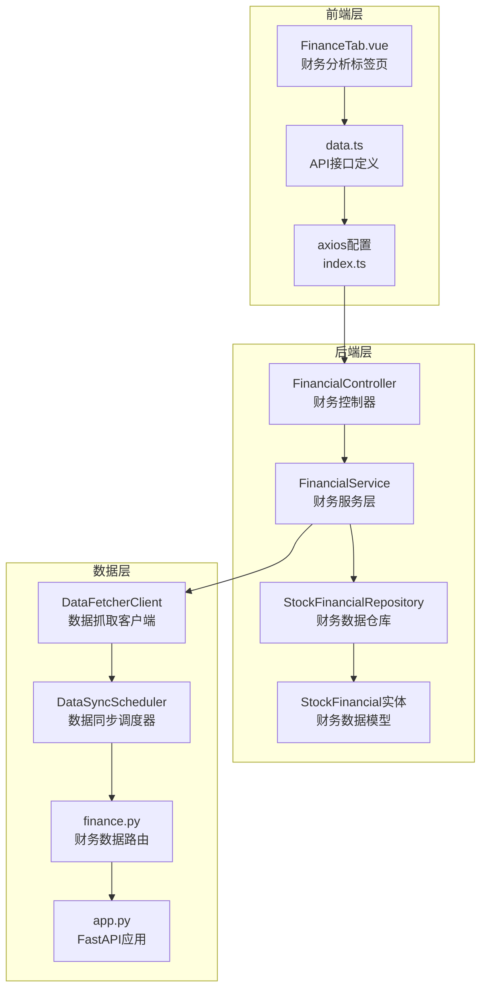
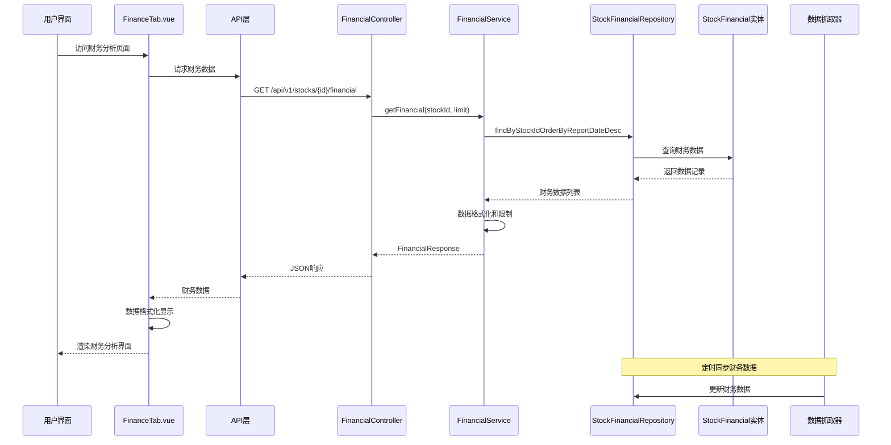
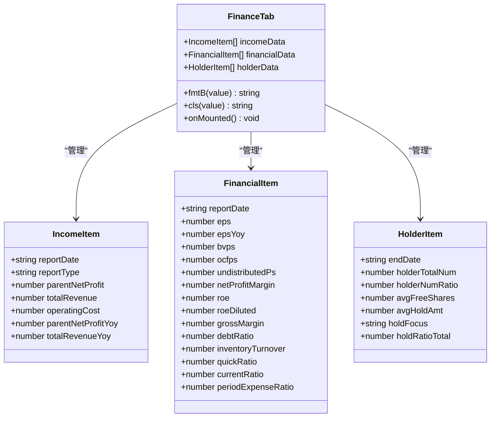
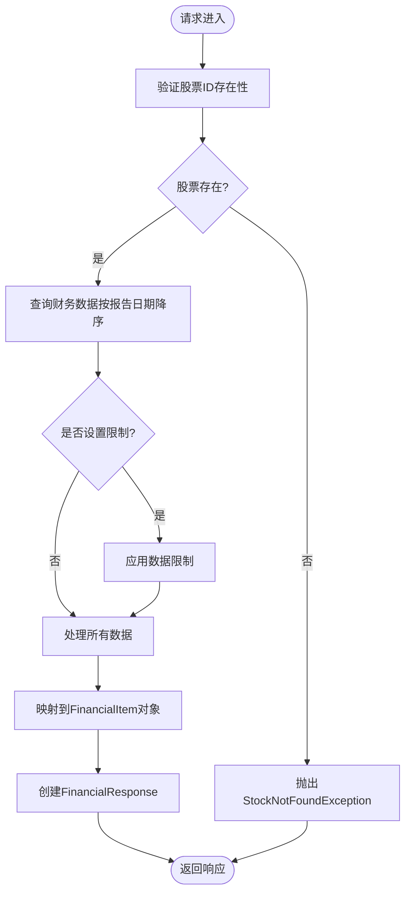
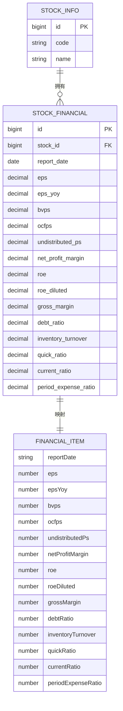
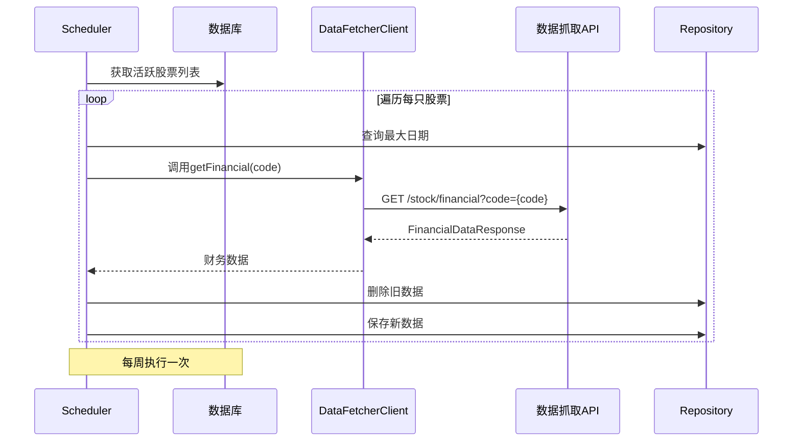
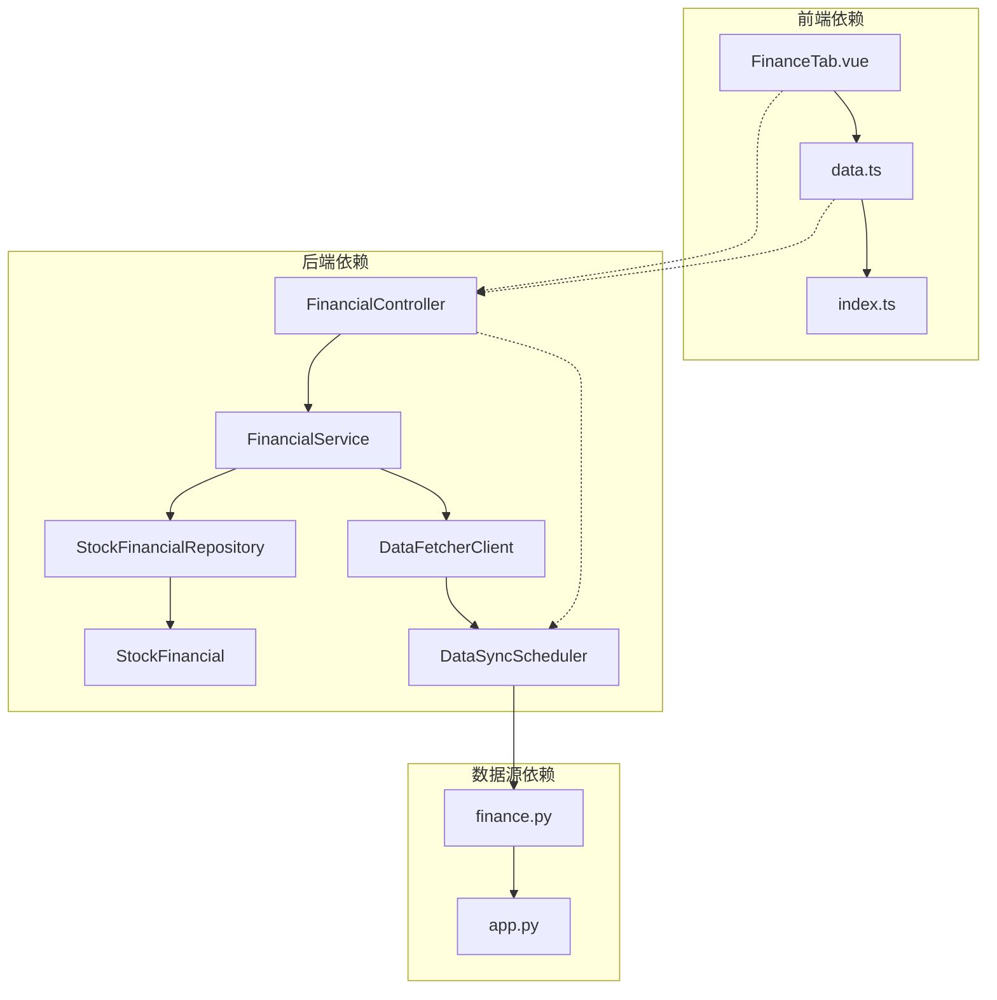

# 财务分析标签页

<cite>
**本文档引用的文件**
- [FinanceTab.vue](file://frontend/src/views/tabs/FinanceTab.vue)
- [data.ts](file://frontend/src/api/data.ts)
- [index.ts](file://frontend/src/api/index.ts)
- [FinancialController.java](file://backend/src/main/java/com/stock/controller/FinancialController.java)
- [FinancialService.java](file://backend/src/main/java/com/stock/service/FinancialService.java)
- [FinancialItem.java](file://backend/src/main/java/com/stock/dto/response/FinancialItem.java)
- [FinancialResponse.java](file://backend/src/main/java/com/stock/dto/response/FinancialResponse.java)
- [FinancialDataItem.java](file://backend/src/main/java/com/stock/dto/fetcher/FinancialDataItem.java)
- [FinancialDataResponse.java](file://backend/src/main/java/com/stock/dto/fetcher/FinancialDataResponse.java)
- [StockFinancial.java](file://backend/src/main/java/com/stock/entity/StockFinancial.java)
- [StockFinancialRepository.java](file://backend/src/main/java/com/stock/repository/StockFinancialRepository.java)
- [DataSyncScheduler.java](file://backend/src/main/java/com/stock/scheduler/DataSyncScheduler.java)
- [DataFetcherClient.java](file://backend/src/main/java/com/stock/client/DataFetcherClient.java)
- [finance.py](file://data-fetcher/routers/finance.py)
- [app.py](file://data-fetcher/app.py)
- [application.yml](file://backend/src/main/resources/application.yml)
</cite>

## 目录
1. [简介](#简介)
2. [项目结构](#项目结构)
3. [核心组件](#核心组件)
4. [架构概览](#架构概览)
5. [详细组件分析](#详细组件分析)
6. [依赖关系分析](#依赖关系分析)
7. [性能考虑](#性能考虑)
8. [故障排除指南](#故障排除指南)
9. [结论](#结论)
10. [附录](#附录)

## 简介

财务分析标签页是股票交易系统中的重要功能模块，负责展示和分析股票的财务数据。该组件提供了三大核心财务数据展示区域：利润表、财务摘要和股东数据，支持财务报表、财务指标图表和趋势分析功能。

本组件采用前后端分离架构，前端使用Vue.js构建用户界面，后端基于Spring Boot提供RESTful API服务，数据通过独立的数据抓取器从第三方数据源获取并存储到数据库中。

## 项目结构

财务分析标签页涉及三个主要层次：



**图表来源**
- [FinanceTab.vue:1-77](file://frontend/src/views/tabs/FinanceTab.vue#L1-L77)
- [data.ts:1-169](file://frontend/src/api/data.ts#L1-L169)
- [index.ts:1-18](file://frontend/src/api/index.ts#L1-L18)
- [FinancialController.java:1-23](file://backend/src/main/java/com/stock/controller/FinancialController.java#L1-L23)
- [DataSyncScheduler.java:1-238](file://backend/src/main/java/com/stock/scheduler/DataSyncScheduler.java#L1-L238)

**章节来源**
- [FinanceTab.vue:1-77](file://frontend/src/views/tabs/FinanceTab.vue#L1-L77)
- [data.ts:1-169](file://frontend/src/api/data.ts#L1-L169)
- [FinancialController.java:1-23](file://backend/src/main/java/com/stock/controller/FinancialController.java#L1-L23)

## 核心组件

### 前端财务分析标签页

FinanceTab.vue是财务分析的核心UI组件，负责展示三大财务数据区域：

1. **利润表区域**：展示收入、净利润、营收等关键财务指标
2. **财务摘要区域**：展示EPS、ROE、毛利率、净利率等核心财务比率
3. **股东数据区域**：展示股东户数、户均持股、筹码集中度等股东结构信息

组件采用响应式设计，支持数据格式化显示和颜色标识（正负值区分）。

### 后端财务服务层

FinancialService提供财务数据的业务逻辑处理，包括数据验证、转换和限制返回数量等功能。

### 数据同步机制

DataSyncScheduler负责定期从数据抓取器获取最新的财务数据，并存储到数据库中，确保前端展示的数据是最新的。

**章节来源**
- [FinanceTab.vue:57-77](file://frontend/src/views/tabs/FinanceTab.vue#L57-L77)
- [FinancialService.java:24-44](file://backend/src/main/java/com/stock/service/FinancialService.java#L24-L44)
- [DataSyncScheduler.java:163-214](file://backend/src/main/java/com/stock/scheduler/DataSyncScheduler.java#L163-L214)

## 架构概览

财务分析系统的整体架构采用分层设计，确保了良好的可维护性和扩展性：



**图表来源**
- [FinanceTab.vue:67-72](file://frontend/src/views/tabs/FinanceTab.vue#L67-L72)
- [FinancialController.java:17-21](file://backend/src/main/java/com/stock/controller/FinancialController.java#L17-L21)
- [FinancialService.java:24-43](file://backend/src/main/java/com/stock/service/FinancialService.java#L24-L43)
- [DataSyncScheduler.java:182-194](file://backend/src/main/java/com/stock/scheduler/DataSyncScheduler.java#L182-L194)

## 详细组件分析

### 前端组件分析

#### FinanceTab.vue 组件结构



**图表来源**
- [FinanceTab.vue:58-77](file://frontend/src/views/tabs/FinanceTab.vue#L58-L77)
- [data.ts:26-79](file://frontend/src/api/data.ts#L26-L79)

#### 数据格式化函数

组件提供了两个关键的数据格式化函数：

1. **fmtB函数**：将数值转换为"亿"单位显示
2. **cls函数**：根据数值正负性返回CSS类名

**章节来源**
- [FinanceTab.vue:74-75](file://frontend/src/views/tabs/FinanceTab.vue#L74-L75)

### 后端服务层分析

#### FinancialService 业务逻辑



**图表来源**
- [FinancialService.java:24-43](file://backend/src/main/java/com/stock/service/FinancialService.java#L24-L43)

#### 数据模型设计



**图表来源**
- [StockFinancial.java:18-71](file://backend/src/main/java/com/stock/entity/StockFinancial.java#L18-L71)
- [FinancialItem.java:5-21](file://backend/src/main/java/com/stock/dto/response/FinancialItem.java#L5-L21)

**章节来源**
- [FinancialService.java:14-44](file://backend/src/main/java/com/stock/service/FinancialService.java#L14-L44)
- [StockFinancial.java:18-71](file://backend/src/main/java/com/stock/entity/StockFinancial.java#L18-L71)

### 数据获取与同步机制

#### 数据同步调度流程



**图表来源**
- [DataSyncScheduler.java:163-214](file://backend/src/main/java/com/stock/scheduler/DataSyncScheduler.java#L163-L214)
- [DataFetcherClient.java:71-75](file://backend/src/main/java/com/stock/client/DataFetcherClient.java#L71-L75)

#### 数据抓取器实现

数据抓取器使用AKShare库获取财务摘要数据，支持多种财务指标的自动识别和映射：

**章节来源**
- [DataSyncScheduler.java:182-194](file://backend/src/main/java/com/stock/scheduler/DataSyncScheduler.java#L182-L194)
- [finance.py:43-118](file://data-fetcher/routers/finance.py#L43-L118)

## 依赖关系分析

### 组件间依赖关系



**图表来源**
- [FinanceTab.vue:60](file://frontend/src/views/tabs/FinanceTab.vue#L60)
- [FinancialController.java:13-15](file://backend/src/main/java/com/stock/controller/FinancialController.java#L13-L15)
- [DataSyncScheduler.java:32-51](file://backend/src/main/java/com/stock/scheduler/DataSyncScheduler.java#L32-L51)

### 外部依赖分析

系统依赖的关键外部组件：

1. **AKShare库**：用于获取财务摘要数据
2. **Eastmoney数据中心**：提供收入报表和估值数据
3. **H2数据库**：本地开发数据库
4. **FastAPI**：数据抓取器服务

**章节来源**
- [finance.py:47-48](file://data-fetcher/routers/finance.py#L47-L48)
- [application.yml:6-16](file://backend/src/main/resources/application.yml#L6-L16)

## 性能考虑

### 数据缓存策略

当前实现采用以下缓存策略：

1. **前端缓存**：Vue响应式数据在组件生命周期内保持
2. **后端缓存**：Spring Boot默认缓存机制
3. **数据库缓存**：JPA二级缓存配置

### 性能优化建议

1. **分页查询**：限制返回数据量，避免大数据集传输
2. **索引优化**：在report_date和stock_id字段建立索引
3. **批量操作**：使用批量插入和删除减少数据库往返
4. **异步处理**：对于大量数据的计算任务使用异步处理

### 内存管理

- 合理设置limit参数控制数据量
- 及时清理不再使用的数据引用
- 使用虚拟滚动处理大量表格数据

## 故障排除指南

### 常见问题及解决方案

#### 数据获取失败

**症状**：财务数据显示为空或加载超时
**原因**：
1. 数据抓取器服务不可用
2. 网络连接问题
3. 股票代码无效

**解决方法**：
1. 检查数据抓取器服务状态
2. 验证网络连接
3. 确认股票代码格式正确

#### 数据格式错误

**症状**：财务数据显示异常或格式不正确
**原因**：
1. 数据源格式变化
2. 数值转换异常
3. 缺失数据处理不当

**解决方法**：
1. 检查数据抓取器日志
2. 验证数据转换逻辑
3. 实施数据验证和清理

#### 性能问题

**症状**：页面加载缓慢或内存占用过高
**原因**：
1. 数据量过大
2. 查询效率低
3. 前端渲染压力大

**解决方法**：
1. 实施分页和懒加载
2. 优化数据库查询
3. 使用虚拟滚动

**章节来源**
- [DataFetcherClient.java:112-124](file://backend/src/main/java/com/stock/client/DataFetcherClient.java#L112-L124)
- [FinancialService.java:25-27](file://backend/src/main/java/com/stock/service/FinancialService.java#L25-L27)

## 结论

财务分析标签页组件成功实现了股票财务数据的完整展示功能，具有以下特点：

1. **模块化设计**：前后端分离，职责清晰
2. **数据完整性**：涵盖利润表、财务摘要、股东数据三大维度
3. **实时性**：通过定时同步机制保证数据新鲜度
4. **可扩展性**：支持图表集成和趋势分析功能扩展
5. **健壮性**：完善的异常处理和数据验证机制

该组件为用户提供了一个全面、准确、易用的财务分析工具，能够满足专业投资者和普通用户的多样化需求。

## 附录

### 扩展功能指南

#### 图表组件集成

1. **引入图表库**：推荐使用Chart.js或ECharts
2. **数据适配**：将财务数据转换为图表所需的格式
3. **交互设计**：添加时间范围选择、指标切换等交互功能

#### 数据精度控制

1. **数值格式化**：统一小数位数和千分位分隔符
2. **异常值检测**：实现数据质量监控和异常值标记
3. **精度配置**：提供用户自定义精度的配置选项

#### 数据准确性保障

1. **多源数据对比**：从多个数据源获取相同指标进行交叉验证
2. **数据版本控制**：记录数据更新时间和版本信息
3. **质量评分系统**：为不同数据源提供质量评分和可信度标识

### 配置参考

#### 应用配置

```yaml
stock:
  data-fetcher:
    url: http://localhost:5001
    timeout: 15000
  scheduler:
    kline-sync-cron: "0 30 15 * * MON-FRI"
    fund-flow-sync-cron: "0 0 16 * * MON-FRI"
    weekly-data-sync: "0 0 2 ? * SUN"
```

**章节来源**
- [application.yml:19-28](file://backend/src/main/resources/application.yml#L19-L28)