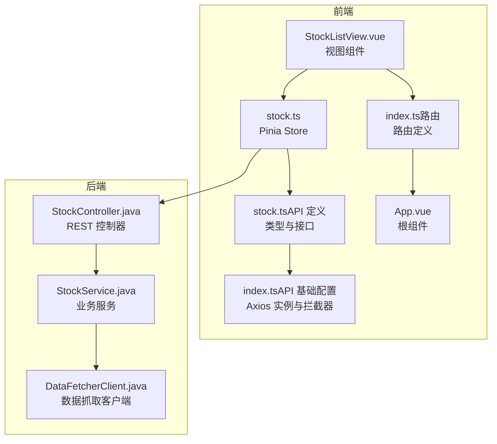
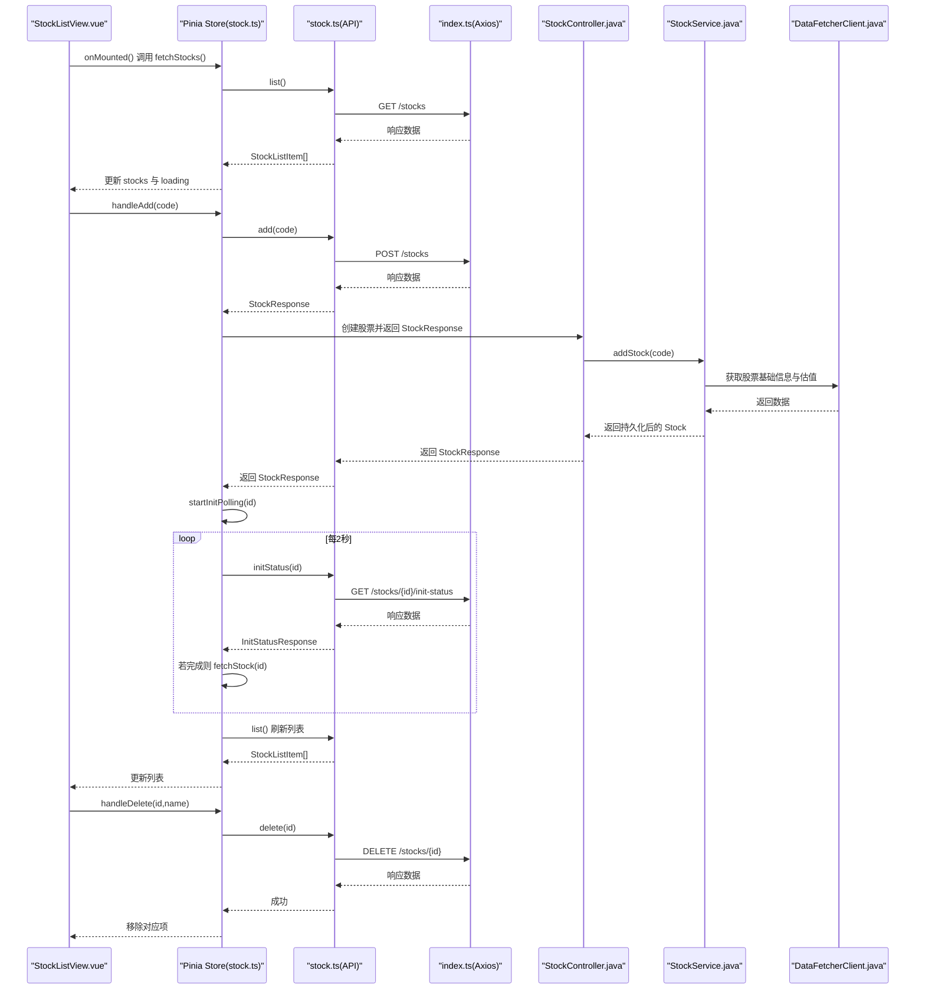
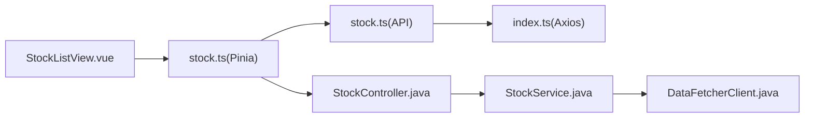

# 股票列表视图

<cite>
**本文引用的文件**
- [StockListView.vue](file://frontend/src/views/StockListView.vue)
- [stock.ts](file://frontend/src/stores/stock.ts)
- [stock.ts（API 定义）](file://frontend/src/api/stock.ts)
- [index.ts（API 基础配置）](file://frontend/src/api/index.ts)
- [StockController.java](file://backend/src/main/java/com/stock/controller/StockController.java)
- [StockService.java](file://backend/src/main/java/com/stock/service/StockService.java)
- [StockListItemResponse.java](file://backend/src/main/java/com/stock/dto/response/StockListItemResponse.java)
- [StockResponse.java](file://backend/src/main/java/com/stock/dto/response/StockResponse.java)
- [DataFetcherClient.java](file://backend/src/main/java/com/stock/client/DataFetcherClient.java)
- [index.ts（路由）](file://frontend/src/router/index.ts)
- [App.vue](file://frontend/src/App.vue)
</cite>

## 目录
1. [简介](#简介)
2. [项目结构](#项目结构)
3. [核心组件](#核心组件)
4. [架构总览](#架构总览)
5. [详细组件分析](#详细组件分析)
6. [依赖分析](#依赖分析)
7. [性能考虑](#性能考虑)
8. [故障排查指南](#故障排查指南)
9. [结论](#结论)
10. [附录：使用示例与最佳实践](#附录使用示例与最佳实践)

## 简介
本文件面向“股票列表视图”组件，系统性阐述其展示逻辑、数据绑定机制、状态管理集成、数据获取流程、表格渲染与排序筛选能力、Pinia 状态管理的使用方式、API 调用时机与错误处理策略，以及股票添加/删除功能的实现细节、用户交互反馈与加载状态处理。同时提供使用示例与性能优化建议，帮助开发者快速理解与扩展该组件。

## 项目结构
前端采用 Vue 3 + TypeScript + Pinia 架构；后端采用 Spring Boot REST 接口。股票列表视图位于前端 views 层，通过 Pinia store 管理状态，通过 API 模块访问后端接口；后端控制器负责接收请求、调用服务层，服务层整合数据源客户端进行数据抓取与初始化。

图表来源
- [StockListView.vue:1-102](file://frontend/src/views/StockListView.vue#L1-L102)
- [stock.ts:1-80](file://frontend/src/stores/stock.ts#L1-L80)
- [stock.ts（API 定义）:1-61](file://frontend/src/api/stock.ts#L1-L61)
- [index.ts（API 基础配置）:1-18](file://frontend/src/api/index.ts#L1-L18)
- [index.ts（路由）:1-28](file://frontend/src/router/index.ts#L1-L28)
- [App.vue:1-4](file://frontend/src/App.vue#L1-L4)
- [StockController.java:1-57](file://backend/src/main/java/com/stock/controller/StockController.java#L1-L57)
- [StockService.java:1-243](file://backend/src/main/java/com/stock/service/StockService.java#L1-L243)
- [DataFetcherClient.java:1-126](file://backend/src/main/java/com/stock/client/DataFetcherClient.java#L1-L126)

章节来源
- [StockListView.vue:1-102](file://frontend/src/views/StockListView.vue#L1-L102)
- [stock.ts:1-80](file://frontend/src/stores/stock.ts#L1-L80)
- [stock.ts（API 定义）:1-61](file://frontend/src/api/stock.ts#L1-L61)
- [index.ts（API 基础配置）:1-18](file://frontend/src/api/index.ts#L1-L18)
- [index.ts（路由）:1-28](file://frontend/src/router/index.ts#L1-L28)
- [App.vue:1-4](file://frontend/src/App.vue#L1-L4)
- [StockController.java:1-57](file://backend/src/main/java/com/stock/controller/StockController.java#L1-L57)
- [StockService.java:1-243](file://backend/src/main/java/com/stock/service/StockService.java#L1-L243)
- [DataFetcherClient.java:1-126](file://backend/src/main/java/com/stock/client/DataFetcherClient.java#L1-L126)

## 核心组件
- 视图组件：负责模板渲染、用户交互事件绑定、格式化显示与加载态展示。
- Pinia Store：集中管理股票列表、当前股票、初始化状态、加载标志等，封装 API 调用与轮询逻辑。
- API 模块：定义前后端交互的数据结构与方法，统一基地址与错误拦截。
- 后端控制器与服务：提供增删查、初始化状态查询等接口，服务层负责数据抓取与异步初始化。

章节来源
- [StockListView.vue:50-101](file://frontend/src/views/StockListView.vue#L50-L101)
- [stock.ts:5-79](file://frontend/src/stores/stock.ts#L5-L79)
- [stock.ts（API 定义）:53-60](file://frontend/src/api/stock.ts#L53-L60)
- [StockController.java:29-55](file://backend/src/main/java/com/stock/controller/StockController.java#L29-L55)
- [StockService.java:93-163](file://backend/src/main/java/com/stock/service/StockService.java#L93-L163)

## 架构总览
从前端到后端的数据流如下：组件挂载时触发拉取列表；新增股票时调用添加接口并启动初始化轮询；删除股票时调用删除接口并更新本地状态；后端控制器将请求委派给服务层，服务层通过数据抓取客户端从外部数据源获取信息并触发异步初始化任务。

图表来源
- [StockListView.vue:60-80](file://frontend/src/views/StockListView.vue#L60-L80)
- [stock.ts:12-28](file://frontend/src/stores/stock.ts#L12-L28)
- [stock.ts:43-58](file://frontend/src/stores/stock.ts#L43-L58)
- [stock.ts（API 定义）:54-58](file://frontend/src/api/stock.ts#L54-L58)
- [index.ts（API 基础配置）:3-6](file://frontend/src/api/index.ts#L3-L6)
- [StockController.java:29-55](file://backend/src/main/java/com/stock/controller/StockController.java#L29-L55)
- [StockService.java:93-163](file://backend/src/main/java/com/stock/service/StockService.java#L93-L163)
- [DataFetcherClient.java:26-93](file://backend/src/main/java/com/stock/client/DataFetcherClient.java#L26-L93)

## 详细组件分析

### 视图组件：StockListView.vue
- 数据绑定与渲染
  - 使用响应式引用维护新代码输入与添加按钮禁用状态。
  - 通过 Pinia store 的 refs 将 stocks 与 loading 绑定到模板，实现条件渲染与表格展示。
  - 表格列涵盖代码、名称、行业、最新价、涨跌幅、PE(TTM)、PB、完成度等关键指标，并提供跳转详情页的链接。
- 用户交互
  - 输入框支持回车触发添加；点击“添加标的”触发异步添加流程；点击“删除”弹出确认并执行删除。
  - 提供价格与百分比格式化函数，以及涨跌颜色与完成度标签样式映射。
- 加载与空态
  - loading 控制加载提示；当 stocks 非空时渲染表格，否则显示“暂无标的”的提示。

章节来源
- [StockListView.vue:1-48](file://frontend/src/views/StockListView.vue#L1-L48)
- [StockListView.vue:64-101](file://frontend/src/views/StockListView.vue#L64-L101)

### 状态管理：Pinia Store（stock.ts）
- 状态字段
  - stocks：股票列表数组，用于视图渲染。
  - currentStock：当前选中股票详情，用于后续页面或联动。
  - initStatus：初始化进度状态，用于轮询展示。
  - loading：全局加载标志，控制视图加载态。
- 核心方法
  - fetchStocks：发起 GET /stocks，成功后写入 stocks，finally 中关闭 loading。
  - addStock：发起 POST /stocks，保存返回的 StockResponse 并启动初始化轮询；随后刷新列表。
  - deleteStock：发起 DELETE /stocks/{id}，移除本地匹配项；若删除的是当前选中股票则清空 currentStock。
  - fetchStock：获取单只股票详情并写入 currentStock。
  - startInitPolling/stopInitPolling：以 2 秒间隔轮询 /stocks/{id}/init-status，完成后停止轮询并刷新详情。
- 错误处理
  - 轮询过程中异常会停止轮询，避免资源泄露。
  - 组件侧对添加失败进行提示，捕获响应消息。

章节来源
- [stock.ts:5-79](file://frontend/src/stores/stock.ts#L5-L79)

### API 定义与基础配置
- 类型与接口
  - 定义了 StockListItem、StockResponse、InitStatusResponse 等数据结构，确保前后端契约一致。
- API 方法
  - list、add、delete、get、initStatus、completeness 等方法分别映射后端接口路径。
- Axios 基础配置
  - 统一 baseURL 与超时时间；全局响应拦截器打印错误并透传错误对象，便于组件侧统一处理。

章节来源
- [stock.ts（API 定义）:3-60](file://frontend/src/api/stock.ts#L3-L60)
- [index.ts（API 基础配置）:3-15](file://frontend/src/api/index.ts#L3-L15)

### 后端控制器与服务
- 控制器
  - 提供 /stocks（POST 新增、DELETE 删除、GET 列表）、/stocks/{id}（GET 详情、GET 初始化状态）等接口。
- 服务层
  - 新增股票时校验代码格式与唯一性，抓取基础信息与估值数据，持久化后通过事务提交后触发异步初始化。
  - 删除股票时级联清理多类数据与中间表，保证数据一致性。
  - 列表与详情接口返回标准化 DTO，供前端直接消费。

章节来源
- [StockController.java:29-55](file://backend/src/main/java/com/stock/controller/StockController.java#L29-L55)
- [StockService.java:93-163](file://backend/src/main/java/com/stock/service/StockService.java#L93-L163)
- [StockService.java:191-213](file://backend/src/main/java/com/stock/service/StockService.java#L191-L213)
- [StockService.java:215-236](file://backend/src/main/java/com/stock/service/StockService.java#L215-L236)
- [StockListItemResponse.java:6-22](file://backend/src/main/java/com/stock/dto/response/StockListItemResponse.java#L6-L22)
- [StockResponse.java:7-24](file://backend/src/main/java/com/stock/dto/response/StockResponse.java#L7-L24)

### 数据抓取客户端
- 通过 RestTemplate 调用外部数据源，封装多种数据接口（行情、K线、资金流、财务、股东、研报、估值、龙虎榜等），并对异常进行统一包装，便于上层处理。

章节来源
- [DataFetcherClient.java:26-93](file://backend/src/main/java/com/stock/client/DataFetcherClient.java#L26-L93)

### 路由与入口
- 路由将根路径指向股票列表视图，详情页路由包含多个子标签页，形成统一的导航结构。
- 根组件仅包含路由出口，保持结构简洁。

章节来源
- [index.ts（路由）:6-23](file://frontend/src/router/index.ts#L6-L23)
- [App.vue:1-4](file://frontend/src/App.vue#L1-L4)

## 依赖分析
- 组件耦合
  - 视图组件仅依赖 Pinia store 的 refs，低耦合高内聚。
  - store 通过 API 模块与后端解耦，便于替换或扩展。
- 外部依赖
  - Axios 提供网络请求与错误拦截。
  - 后端通过 DataFetcherClient 访问外部数据源，服务层承担数据整合与初始化调度。
- 可能的循环依赖
  - 当前模块划分清晰，未见循环依赖迹象。

图表来源
- [StockListView.vue:50-56](file://frontend/src/views/StockListView.vue#L50-L56)
- [stock.ts:12-28](file://frontend/src/stores/stock.ts#L12-L28)
- [stock.ts（API 定义）:54-58](file://frontend/src/api/stock.ts#L54-L58)
- [index.ts（API 基础配置）:3-6](file://frontend/src/api/index.ts#L3-L6)
- [StockController.java:29-55](file://backend/src/main/java/com/stock/controller/StockController.java#L29-L55)
- [StockService.java:93-163](file://backend/src/main/java/com/stock/service/StockService.java#L93-L163)
- [DataFetcherClient.java:26-93](file://backend/src/main/java/com/stock/client/DataFetcherClient.java#L26-L93)

## 性能考虑
- 列表渲染
  - 使用 v-for 渲染，建议为每行提供稳定 key（组件已使用 stock.id）。
  - 对数值字段进行格式化输出，避免重复计算可使用计算属性替代。
- 异步初始化轮询
  - 轮询间隔固定为 2 秒，建议根据实际初始化耗时动态调整或允许取消。
  - 轮询异常时及时停止，避免资源浪费。
- 网络请求
  - 统一超时时间与错误拦截，建议在 store 中增加重试与节流策略。
  - 批量数据获取可结合后端分页或批量接口减少请求次数。
- 内存与状态
  - 删除股票后及时清理 currentStock，避免内存泄漏。
  - 长列表场景可考虑虚拟滚动或分页加载。

## 故障排查指南
- 添加失败
  - 现象：弹窗提示错误消息。
  - 排查：检查后端新增接口是否抛出业务异常（如代码格式错误、重复添加），查看响应体 message 字段。
- 初始化卡住
  - 现象：初始化进度未完成且无更新。
  - 排查：确认 /stocks/{id}/init-status 是否返回完成计数与总数，检查轮询逻辑与异常处理。
- 列表不刷新
  - 现象：新增/删除后列表未更新。
  - 排查：确认 store 在 addStock 与 deleteStock 后是否调用了 list 刷新；检查后端 list 接口返回数据。
- 网络错误
  - 现象：控制台出现 API Error 日志。
  - 排查：检查 baseURL 与跨域设置、后端服务可用性、超时时间配置。

章节来源
- [StockListView.vue:64-75](file://frontend/src/views/StockListView.vue#L64-L75)
- [stock.ts:43-58](file://frontend/src/stores/stock.ts#L43-L58)
- [index.ts（API 基础配置）:9-15](file://frontend/src/api/index.ts#L9-L15)
- [StockController.java:29-55](file://backend/src/main/java/com/stock/controller/StockController.java#L29-L55)
- [StockService.java:93-163](file://backend/src/main/java/com/stock/service/StockService.java#L93-L163)

## 结论
股票列表视图通过清晰的组件职责划分与 Pinia 状态管理，实现了稳定的数据显示、交互与生命周期管理。后端控制器与服务层提供了完善的新增、删除、查询与初始化能力，并通过数据抓取客户端对接外部数据源。整体架构具备良好的扩展性与可维护性，适合进一步引入排序、筛选、分页与虚拟滚动等优化手段。

## 附录：使用示例与最佳实践
- 使用示例
  - 访问根路径进入股票列表视图，输入 6 位数字代码并点击“添加标的”，等待初始化完成后可在列表中看到新股票。
  - 点击“删除”按钮可移除股票及其关联数据。
- 最佳实践
  - 在 store 中增加请求去重与防抖，避免重复请求。
  - 对于长列表，建议引入分页或虚拟滚动提升性能。
  - 将格式化函数抽取为计算属性，减少重复渲染开销。
  - 对轮询逻辑增加最大重试次数与手动停止按钮，提升用户体验。
  - 在路由守卫中加入鉴权与权限校验，确保安全访问。