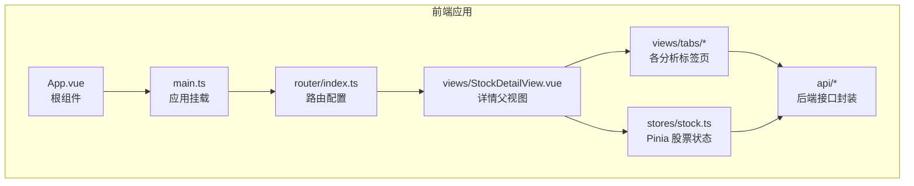
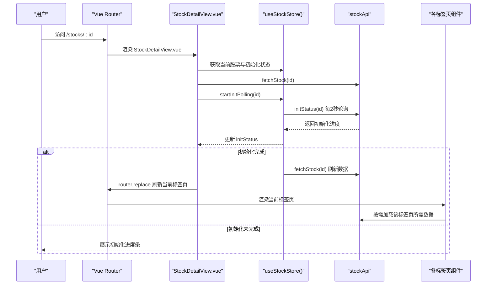
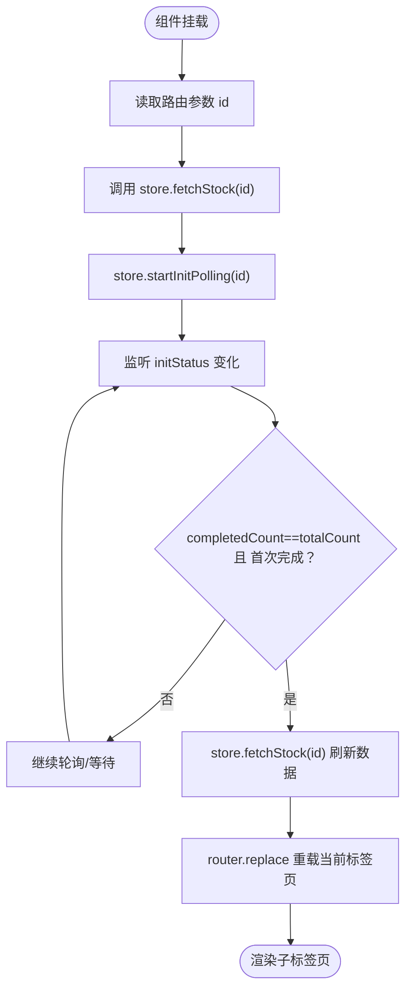
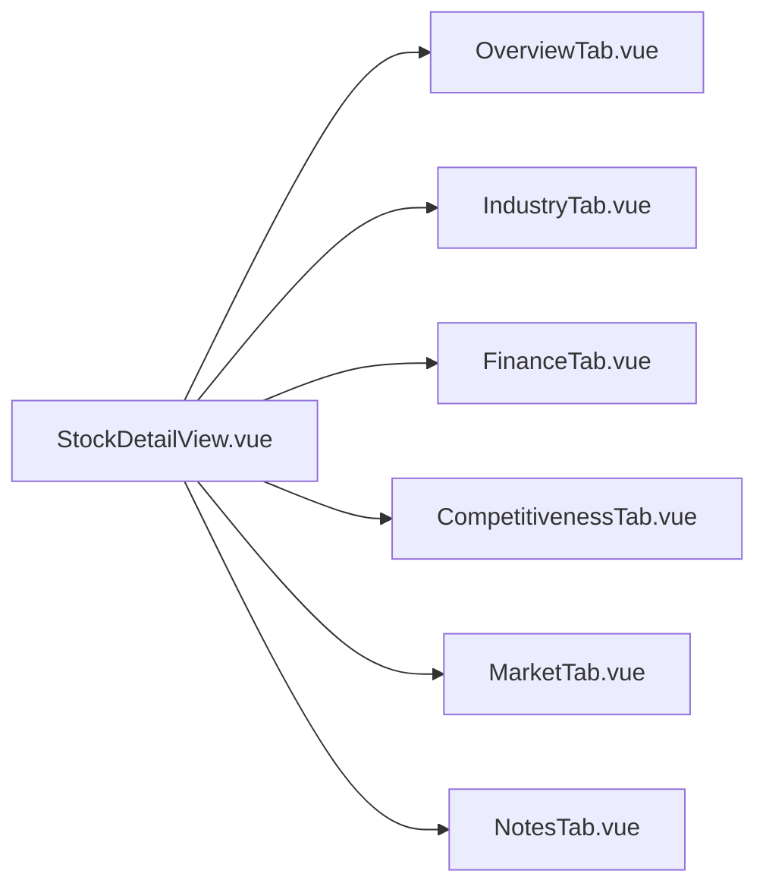
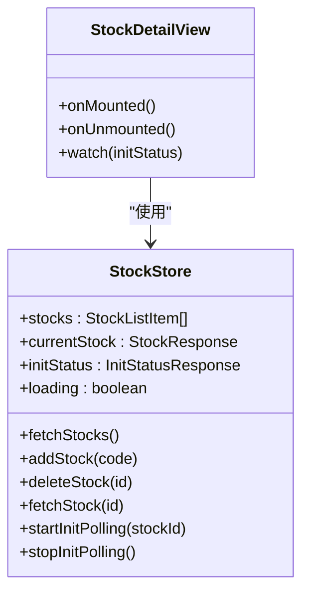
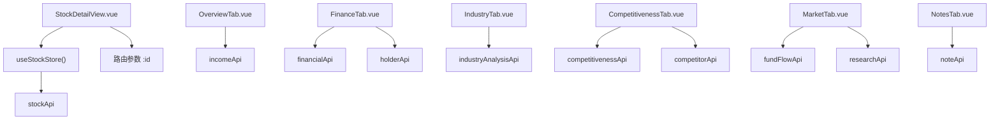

# 股票详情视图

<cite>
**本文引用的文件**
- [StockDetailView.vue](file://frontend/src/views/StockDetailView.vue)
- [stock.ts（Pinia 状态）](file://frontend/src/stores/stock.ts)
- [路由配置](file://frontend/src/router/index.ts)
- [API 定义：stock.ts](file://frontend/src/api/stock.ts)
- [API 定义：data.ts](file://frontend/src/api/data.ts)
- [API 定义：manual.ts](file://frontend/src/api/manual.ts)
- [API 定义：kline.ts](file://frontend/src/api/kline.ts)
- [OverviewTab.vue](file://frontend/src/views/tabs/OverviewTab.vue)
- [FinanceTab.vue](file://frontend/src/views/tabs/FinanceTab.vue)
- [IndustryTab.vue](file://frontend/src/views/tabs/IndustryTab.vue)
- [CompetitivenessTab.vue](file://frontend/src/views/tabs/CompetitivenessTab.vue)
- [MarketTab.vue](file://frontend/src/views/tabs/MarketTab.vue)
- [NotesTab.vue](file://frontend/src/views/tabs/NotesTab.vue)
- [main.ts](file://frontend/src/main.ts)
- [App.vue](file://frontend/src/App.vue)
</cite>

## 目录
1. [简介](#简介)
2. [项目结构](#项目结构)
3. [核心组件](#核心组件)
4. [架构总览](#架构总览)
5. [详细组件分析](#详细组件分析)
6. [依赖关系分析](#依赖关系分析)
7. [性能考虑](#性能考虑)
8. [故障排查指南](#故障排查指南)
9. [结论](#结论)
10. [附录](#附录)

## 简介
本文件面向“股票详情视图”组件，系统性阐述其整体布局、标签页导航、数据展示区域与交互流程；深入解析各分析标签页的数据加载机制、图表渲染与数据更新策略；解释组件与 Pinia 状态管理的深度集成、路由参数处理、页面生命周期管理；并提供标签页切换逻辑、数据缓存策略、错误边界处理、组件扩展指南与最佳实践。

## 项目结构
前端采用 Vue 3 + TypeScript + Pinia + Vue Router 架构，股票详情页通过嵌套路由组织多个分析标签页，统一在父级详情视图中进行布局与状态管理。

**图表来源**
- [App.vue:1-4](file://frontend/src/App.vue#L1-L4)
- [main.ts:1-11](file://frontend/src/main.ts#L1-L11)
- [路由配置:1-28](file://frontend/src/router/index.ts#L1-L28)
- [StockDetailView.vue:1-82](file://frontend/src/views/StockDetailView.vue#L1-L82)
- [stock.ts（Pinia 状态）:1-80](file://frontend/src/stores/stock.ts#L1-L80)
- [API 定义：stock.ts:1-61](file://frontend/src/api/stock.ts#L1-L61)
- [API 定义：data.ts:1-169](file://frontend/src/api/data.ts#L1-L169)
- [API 定义：manual.ts:1-196](file://frontend/src/api/manual.ts#L1-L196)

**章节来源**
- [App.vue:1-4](file://frontend/src/App.vue#L1-L4)
- [main.ts:1-11](file://frontend/src/main.ts#L1-L11)
- [路由配置:1-28](file://frontend/src/router/index.ts#L1-L28)

## 核心组件
- 股票详情父视图：负责标题栏、初始化进度条、标签页导航与子路由渲染，并在生命周期内拉取当前股票信息与启动初始化轮询。
- 各分析标签页：按需加载对应数据，展示表格或交互式表单，部分标签页支持编辑与保存。
- Pinia 股票状态：集中管理当前股票、列表、初始化状态与加载标志，并提供轮询控制方法。
- 路由：定义详情页与各标签页的嵌套关系，使用动态路由参数传递股票 ID。
- API 封装：按模块划分数据类接口（财务、资金流、指标等）与手动录入接口（产业分析、竞争力、笔记等）。

**章节来源**
- [StockDetailView.vue:1-82](file://frontend/src/views/StockDetailView.vue#L1-L82)
- [stock.ts（Pinia 状态）:1-80](file://frontend/src/stores/stock.ts#L1-L80)
- [路由配置:1-28](file://frontend/src/router/index.ts#L1-L28)
- [API 定义：stock.ts:1-61](file://frontend/src/api/stock.ts#L1-L61)
- [API 定义：data.ts:1-169](file://frontend/src/api/data.ts#L1-L169)
- [API 定义：manual.ts:1-196](file://frontend/src/api/manual.ts#L1-L196)

## 架构总览
下图展示了从用户进入详情页到各标签页数据加载的关键交互路径，以及状态与路由的协作方式。

**图表来源**
- [StockDetailView.vue:61-80](file://frontend/src/views/StockDetailView.vue#L61-L80)
- [stock.ts（Pinia 状态）:43-65](file://frontend/src/stores/stock.ts#L43-L65)
- [API 定义：stock.ts:53-60](file://frontend/src/api/stock.ts#L53-L60)
- [路由配置:11-23](file://frontend/src/router/index.ts#L11-L23)

## 详细组件分析

### 股票详情父视图（StockDetailView.vue）
- 布局与信息展示
  - 展示股票名称、代码、所属行业标签与估值指标（PE、PB 等）。
  - 当存在初始化状态时，显示进度条与步骤状态。
- 生命周期与路由参数
  - 在挂载时读取路由参数中的股票 ID，调用状态管理拉取当前股票信息，并启动初始化轮询。
  - 组件卸载时停止轮询，避免内存泄漏。
- 初始化完成后的刷新与标签页重载
  - 监听初始化状态变化，当全部完成且首次触发后，再次拉取当前股票数据，并通过路由 replace 强制重新渲染当前标签页，确保子组件能拿到最新数据。

**图表来源**
- [StockDetailView.vue:61-80](file://frontend/src/views/StockDetailView.vue#L61-L80)
- [stock.ts（Pinia 状态）:43-65](file://frontend/src/stores/stock.ts#L43-L65)

**章节来源**
- [StockDetailView.vue:1-82](file://frontend/src/views/StockDetailView.vue#L1-L82)
- [stock.ts（Pinia 状态）:1-80](file://frontend/src/stores/stock.ts#L1-L80)

### 标签页导航与路由集成
- 路由嵌套
  - 详情页路由为父级，子路由分别对应各分析标签页，使用动态参数 :id 传递股票标识。
- 导航行为
  - 使用 router-link 进行标签页切换，保持在同一父视图内渲染子视图。
- 页面生命周期
  - 子组件各自在 mounted 中按需发起数据请求，避免父组件一次性加载所有数据。

**图表来源**
- [路由配置:11-23](file://frontend/src/router/index.ts#L11-L23)
- [StockDetailView.vue:34-43](file://frontend/src/views/StockDetailView.vue#L34-L43)

**章节来源**
- [路由配置:1-28](file://frontend/src/router/index.ts#L1-L28)
- [StockDetailView.vue:34-43](file://frontend/src/views/StockDetailView.vue#L34-L43)

### 各分析标签页数据加载与渲染

#### 总览（OverviewTab.vue）
- 数据来源
  - 最近利润表数据通过 incomeApi 拉取，限制最近若干期。
- 展示逻辑
  - 基本信息与估值指标卡片化展示；利润表表格按列格式化数值与涨跌颜色。
- 错误处理
  - 请求异常时静默忽略，避免阻塞其他标签页渲染。

**章节来源**
- [OverviewTab.vue:1-86](file://frontend/src/views/tabs/OverviewTab.vue#L1-L86)
- [API 定义：data.ts:25-39](file://frontend/src/api/data.ts#L25-L39)
- [API 定义：data.ts:145-147](file://frontend/src/api/data.ts#L145-L147)

#### 财务数据（FinanceTab.vue）
- 数据来源
  - 利润表、财务摘要、股东数据分别通过 incomeApi、financialApi、holderApi 拉取。
- 展示逻辑
  - 表格分三块展示，数值单位统一转换为“亿/百分比”，涨跌使用正负样式区分。
- 错误处理
  - 每个接口独立 try/catch，互不影响。

**章节来源**
- [FinanceTab.vue:1-77](file://frontend/src/views/tabs/FinanceTab.vue#L1-L77)
- [API 定义：data.ts:25-39](file://frontend/src/api/data.ts#L25-L39)
- [API 定义：data.ts:41-63](file://frontend/src/api/data.ts#L41-L63)
- [API 定义：data.ts:65-79](file://frontend/src/api/data.ts#L65-L79)

#### 产业分析（IndustryTab.vue）
- 功能特性
  - 支持生命周期阶段、上下游、政策影响、行业趋势等字段编辑与保存。
- 数据加载与保存
  - 首次进入加载已有数据并填充表单；保存时提交到后端并更新本地数据。
- 错误处理
  - 保存失败弹窗提示具体消息。

**章节来源**
- [IndustryTab.vue:1-81](file://frontend/src/views/tabs/IndustryTab.vue#L1-L81)
- [API 定义：manual.ts:132-135](file://frontend/src/api/manual.ts#L132-L135)

#### 竞争力（CompetitivenessTab.vue）
- 功能特性
  - 竞争力评估表单（市场份额、护城河等级、优劣势等）与保存。
  - 竞品管理：添加/移除竞品，展示竞品报价与估值指标。
- 数据加载与保存
  - 加载评估数据与竞品列表；保存评估数据；新增/删除竞品。
- 错误处理
  - 添加/保存失败弹窗提示。

**章节来源**
- [CompetitivenessTab.vue:1-139](file://frontend/src/views/tabs/CompetitivenessTab.vue#L1-L139)
- [API 定义：manual.ts:157-166](file://frontend/src/api/manual.ts#L157-L166)

#### 市场行情（MarketTab.vue）
- 数据来源
  - 资金流向（近30天）与研报（最近N篇）。
- 展示逻辑
  - 资金流向表格按金额单位“万元”转换；研报列表卡片化展示标题与评级信息。
- 错误处理
  - 请求异常时静默忽略。

**章节来源**
- [MarketTab.vue:1-55](file://frontend/src/views/tabs/MarketTab.vue#L1-L55)
- [API 定义：data.ts:136-143](file://frontend/src/api/data.ts#L136-L143)
- [API 定义：data.ts:81-99](file://frontend/src/api/data.ts#L81-L99)
- [API 定义：data.ts:157-160](file://frontend/src/api/data.ts#L157-L160)

#### 投资笔记（NotesTab.vue）
- 功能特性
  - 笔记分类选择、内容输入、添加与删除；按时间倒序展示。
- 数据加载与保存
  - 首次进入加载笔记列表；添加后刷新列表。
- 错误处理
  - 添加失败弹窗提示。

**章节来源**
- [NotesTab.vue:1-80](file://frontend/src/views/tabs/NotesTab.vue#L1-L80)
- [API 定义：manual.ts:168-176](file://frontend/src/api/manual.ts#L168-L176)

### 图表渲染与数据更新策略
- 当前实现
  - 各标签页主要以表格与表单展示静态数据，未直接引入可视化库。
- 建议扩展
  - 对于 K 线与技术指标，可引入轻量图表库（如基于 Canvas 的小型库），在单独的子组件中渲染。
  - K 线数据可通过 klineApi 获取，支持周期与复权参数；指标数据通过 indicatorApi 获取。
- 更新策略
  - 使用虚拟滚动或分页加载长序列数据；对高频更新场景（如实时行情）采用节流/去抖策略。

**章节来源**
- [API 定义：kline.ts:1-37](file://frontend/src/api/kline.ts#L1-L37)
- [API 定义：data.ts:112-134](file://frontend/src/api/data.ts#L112-L134)

### 组件与 Pinia 状态管理的深度集成
- 状态模型
  - currentStock：当前股票详情对象。
  - initStatus：初始化进度（steps、完成计数、总数）。
  - loading：列表加载状态。
- 方法
  - fetchStocks/fetchStock：拉取列表与详情。
  - startInitPolling/stopInitPolling：启动/停止初始化轮询。
  - addStock/deleteStock：新增/删除关注股票并联动列表与轮询。
- 与父视图协作
  - 父视图在挂载时调用 fetchStock 并启动轮询；轮询成功后刷新详情并强制重载当前标签页。

**图表来源**
- [stock.ts（Pinia 状态）:1-80](file://frontend/src/stores/stock.ts#L1-L80)
- [StockDetailView.vue:47-80](file://frontend/src/views/StockDetailView.vue#L47-L80)

**章节来源**
- [stock.ts（Pinia 状态）:1-80](file://frontend/src/stores/stock.ts#L1-L80)
- [StockDetailView.vue:47-80](file://frontend/src/views/StockDetailView.vue#L47-L80)

### 路由参数处理与页面生命周期管理
- 参数处理
  - 通过 useRoute().params.id 获取股票标识，转换为数字后用于 API 调用。
- 生命周期
  - 父视图在 onMounted 中拉取数据并启动轮询；onUnmounted 停止轮询。
  - 子标签页在 onMounted 中按需拉取自身数据，避免重复请求与耦合。

**章节来源**
- [StockDetailView.vue:61-80](file://frontend/src/views/StockDetailView.vue#L61-L80)
- [OverviewTab.vue:58-64](file://frontend/src/views/tabs/OverviewTab.vue#L58-L64)
- [FinanceTab.vue:67-72](file://frontend/src/views/tabs/FinanceTab.vue#L67-L72)
- [IndustryTab.vue:49-61](file://frontend/src/views/tabs/IndustryTab.vue#L49-L61)
- [CompetitivenessTab.vue:83-100](file://frontend/src/views/tabs/CompetitivenessTab.vue#L83-L100)
- [MarketTab.vue:44-48](file://frontend/src/views/tabs/MarketTab.vue#L44-L48)
- [NotesTab.vue:39-49](file://frontend/src/views/tabs/NotesTab.vue#L39-L49)

### 标签页切换逻辑
- 切换方式
  - 使用 router-link 导航至同父级的不同子路由，保持父视图不变，仅替换子视图。
- 刷新策略
  - 初始化完成后，通过 router.replace 以相同 name 与 params 触发当前标签页重新渲染，确保数据一致性。

**章节来源**
- [StockDetailView.vue:34-43](file://frontend/src/views/StockDetailView.vue#L34-L43)
- [StockDetailView.vue:71-80](file://frontend/src/views/StockDetailView.vue#L71-L80)

### 数据缓存策略
- 当前策略
  - 子组件在 mounted 中按需请求一次数据；未实现跨组件共享缓存。
- 建议
  - 在 Pinia 中为每个标签页维护独立的响应式缓存对象，设置过期时间与失效策略。
  - 对高频访问数据（如财务摘要）启用本地存储（localStorage/sessionStorage）作为降级缓存。
  - 使用防抖/节流减少重复请求。

[本节为通用建议，不直接分析具体文件]

### 错误边界处理
- 组件内错误处理
  - 大多数组件对单个 API 请求使用 try/catch，失败时静默处理，避免阻断整体渲染。
  - 表单保存类组件在失败时弹窗提示具体错误信息。
- 建议增强
  - 统一的全局错误拦截器与错误边界组件，记录错误日志并提供重试按钮。
  - 对网络异常与服务端错误进行分类提示。

**章节来源**
- [OverviewTab.vue:60-64](file://frontend/src/views/tabs/OverviewTab.vue#L60-L64)
- [FinanceTab.vue:67-72](file://frontend/src/views/tabs/FinanceTab.vue#L67-L72)
- [IndustryTab.vue:74-78](file://frontend/src/views/tabs/IndustryTab.vue#L74-L78)
- [CompetitivenessTab.vue:114-118](file://frontend/src/views/tabs/CompetitivenessTab.vue#L114-L118)
- [MarketTab.vue:44-48](file://frontend/src/views/tabs/MarketTab.vue#L44-L48)
- [NotesTab.vue:54-61](file://frontend/src/views/tabs/NotesTab.vue#L54-L61)

## 依赖关系分析
- 组件间依赖
  - StockDetailView.vue 依赖 useStockStore 与路由；各标签页依赖对应 API 模块。
- 状态与路由耦合
  - 股票 ID 通过路由参数传递，状态管理负责数据拉取与轮询；父视图协调初始化完成后的刷新。
- 外部依赖
  - Vue Router 提供嵌套路由；Pinia 提供状态持久化与响应式能力；Axios 封装在 api/index.ts 中。

**图表来源**
- [StockDetailView.vue:47-56](file://frontend/src/views/StockDetailView.vue#L47-L56)
- [stock.ts（Pinia 状态）:1-80](file://frontend/src/stores/stock.ts#L1-L80)
- [API 定义：stock.ts:53-60](file://frontend/src/api/stock.ts#L53-L60)
- [API 定义：data.ts:136-160](file://frontend/src/api/data.ts#L136-L160)
- [API 定义：manual.ts:132-176](file://frontend/src/api/manual.ts#L132-L176)

**章节来源**
- [StockDetailView.vue:47-56](file://frontend/src/views/StockDetailView.vue#L47-L56)
- [stock.ts（Pinia 状态）:1-80](file://frontend/src/stores/stock.ts#L1-L80)
- [API 定义：stock.ts:53-60](file://frontend/src/api/stock.ts#L53-L60)
- [API 定义：data.ts:136-160](file://frontend/src/api/data.ts#L136-L160)
- [API 定义：manual.ts:132-176](file://frontend/src/api/manual.ts#L132-L176)

## 性能考虑
- 请求合并与并发
  - 同步加载多个标签页数据时，可考虑并发请求并统一错误处理，缩短首屏时间。
- 渲染优化
  - 对长列表使用虚拟滚动；对频繁更新的单元格采用浅比较与计算属性缓存。
- 轮询策略
  - 初始化轮询间隔固定为 2 秒；可根据业务需求动态调整或在后台标签页降低频率。
- 缓存与懒加载
  - 为高频数据增加内存缓存与本地缓存；对非关键数据采用懒加载策略。

[本节提供通用指导，不直接分析具体文件]

## 故障排查指南
- 初始化进度条不消失
  - 检查后端初始化任务是否正常推进；确认 store.initStatus 是否被正确更新。
- 切换标签页后数据未刷新
  - 确认父视图在初始化完成后执行了 router.replace；检查子组件是否在 mounted 中重新拉取数据。
- 表单保存失败
  - 查看控制台错误与后端返回的消息；确认必填字段与格式校验。
- 网络请求异常
  - 检查 api 封装与拦截器；确认路由参数 id 是否正确传入。

**章节来源**
- [StockDetailView.vue:71-80](file://frontend/src/views/StockDetailView.vue#L71-L80)
- [IndustryTab.vue:74-78](file://frontend/src/views/tabs/IndustryTab.vue#L74-L78)
- [CompetitivenessTab.vue:114-118](file://frontend/src/views/tabs/CompetitivenessTab.vue#L114-L118)
- [NotesTab.vue:54-61](file://frontend/src/views/tabs/NotesTab.vue#L54-L61)

## 结论
股票详情视图通过清晰的父-子组件分工、Pinia 状态与路由的协同，实现了稳定的初始化流程与灵活的标签页切换。当前以表格与表单为主的数据展示满足基础需求，后续可在图表渲染与缓存策略上进一步优化，提升用户体验与性能表现。

## 附录
- 扩展建议
  - 新增 K 线与技术指标标签页：基于 klineApi 与 indicatorApi 构建可视化组件。
  - 增加全局错误边界与统一提示：提升稳定性与可维护性。
  - 实施标签页数据缓存：减少重复请求，改善首屏与切换性能。
- 最佳实践
  - 子组件按需加载、独立错误处理；父组件只负责协调与刷新。
  - 使用响应式引用与计算属性减少不必要的重渲染。
  - 对高频轮询与网络请求进行节流/去抖与重试策略设计。

[本节为总结性内容，不直接分析具体文件]