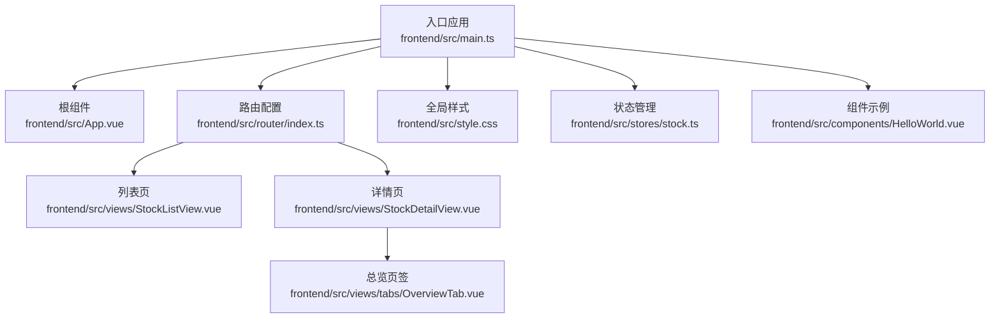
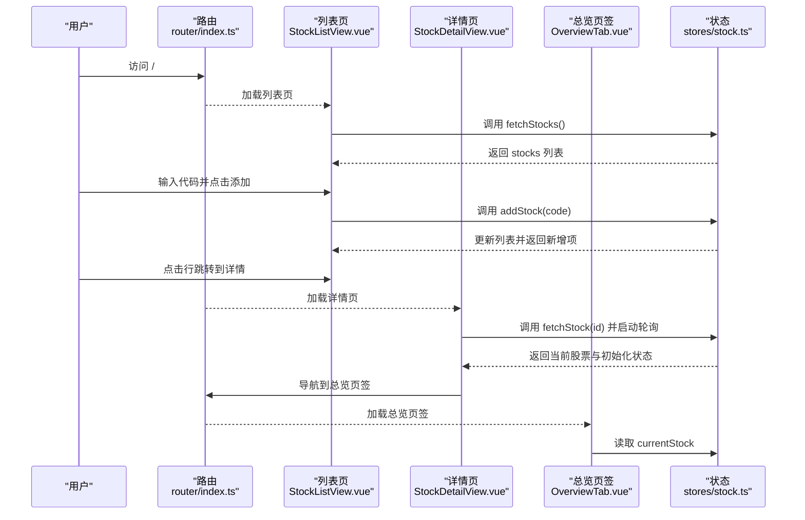
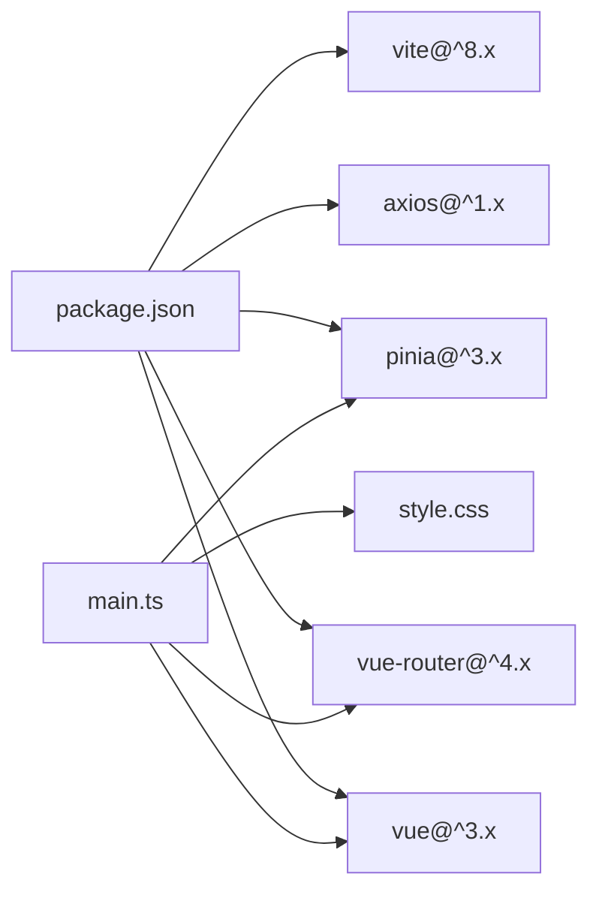

# 基础组件

<cite>
**本文引用的文件**
- [frontend/src/main.ts](file://frontend/src/main.ts)
- [frontend/src/App.vue](file://frontend/src/App.vue)
- [frontend/src/style.css](file://frontend/src/style.css)
- [frontend/src/components/HelloWorld.vue](file://frontend/src/components/HelloWorld.vue)
- [frontend/src/router/index.ts](file://frontend/src/router/index.ts)
- [frontend/src/views/StockListView.vue](file://frontend/src/views/StockListView.vue)
- [frontend/src/views/StockDetailView.vue](file://frontend/src/views/StockDetailView.vue)
- [frontend/src/views/tabs/OverviewTab.vue](file://frontend/src/views/tabs/OverviewTab.vue)
- [frontend/src/stores/stock.ts](file://frontend/src/stores/stock.ts)
- [frontend/package.json](file://frontend/package.json)
- [frontend/vite.config.ts](file://frontend/vite.config.ts)
</cite>

## 目录
1. [简介](#简介)
2. [项目结构](#项目结构)
3. [核心组件](#核心组件)
4. [架构总览](#架构总览)
5. [组件详解](#组件详解)
6. [依赖关系分析](#依赖关系分析)
7. [性能考量](#性能考量)
8. [故障排查指南](#故障排查指南)
9. [结论](#结论)
10. [附录](#附录)

## 简介
本文件面向Vue.js基础组件的设计与实现，结合仓库中的现有组件与页面，系统阐述通用UI组件（按钮、输入框、表格、标签）的设计原则、实现方式与最佳实践。内容涵盖：
- 组件的props设计、事件处理与插槽使用
- 样式封装策略、CSS变量与主题定制
- 使用示例与复用模式、性能优化技巧

说明：当前仓库未包含独立的可复用基础组件库文件，本文基于现有页面与样式进行归纳总结，并给出可直接落地到项目的组件化改造建议。

## 项目结构
前端采用Vue 3 + Vite + Pinia + Vue Router的现代组合，基础样式集中于全局样式文件，页面组件通过路由组织，状态通过Pinia管理。

**图表来源**
- [frontend/src/main.ts:1-11](file://frontend/src/main.ts#L1-L11)
- [frontend/src/App.vue:1-4](file://frontend/src/App.vue#L1-L4)
- [frontend/src/router/index.ts:1-28](file://frontend/src/router/index.ts#L1-L28)
- [frontend/src/style.css:1-163](file://frontend/src/style.css#L1-L163)
- [frontend/src/views/StockListView.vue:1-102](file://frontend/src/views/StockListView.vue#L1-L102)
- [frontend/src/views/StockDetailView.vue:1-82](file://frontend/src/views/StockDetailView.vue#L1-L82)
- [frontend/src/views/tabs/OverviewTab.vue:1-86](file://frontend/src/views/tabs/OverviewTab.vue#L1-L86)
- [frontend/src/stores/stock.ts:1-80](file://frontend/src/stores/stock.ts#L1-L80)
- [frontend/src/components/HelloWorld.vue:1-94](file://frontend/src/components/HelloWorld.vue#L1-L94)

**章节来源**
- [frontend/src/main.ts:1-11](file://frontend/src/main.ts#L1-L11)
- [frontend/src/router/index.ts:1-28](file://frontend/src/router/index.ts#L1-L28)
- [frontend/src/style.css:1-163](file://frontend/src/style.css#L1-L163)

## 核心组件
本节从“按钮、输入框、表格、标签”四个通用UI元素出发，结合现有页面中的使用方式，总结其设计原则与实现要点。

- 按钮
  - 设计原则：统一尺寸、颜色语义、悬停反馈；支持禁用态与尺寸变体
  - 实现要点：通过类名组合实现主次、危险、尺寸等变体；事件绑定在模板层
  - 示例路径：[frontend/src/views/StockListView.vue:7-8](file://frontend/src/views/StockListView.vue#L7-L8)，[frontend/src/views/StockListView.vue:40](file://frontend/src/views/StockListView.vue#L40)

- 输入框
  - 设计原则：一致的边框、圆角、聚焦态；宽度自适应
  - 实现要点：统一类名；双向绑定与回车触发
  - 示例路径：[frontend/src/views/StockListView.vue:7](file://frontend/src/views/StockListView.vue#L7)

- 表格
  - 设计原则：紧凑内边距、分隔线清晰、对齐与状态色
  - 实现要点：表头与单元格对齐；正负值颜色区分；响应式布局
  - 示例路径：[frontend/src/views/StockListView.vue:13-44](file://frontend/src/views/StockListView.vue#L13-L44)，[frontend/src/views/tabs/OverviewTab.vue:30-41](file://frontend/src/views/tabs/OverviewTab.vue#L30-L41)

- 标签
  - 设计原则：信息层级明确、颜色语义化
  - 实现要点：根据数值区间映射不同语义类名
  - 示例路径：[frontend/src/views/StockListView.vue:37](file://frontend/src/views/StockListView.vue#L37)，[frontend/src/views/StockDetailView.vue:10](file://frontend/src/views/StockDetailView.vue#L10)

**章节来源**
- [frontend/src/views/StockListView.vue:7-101](file://frontend/src/views/StockListView.vue#L7-L101)
- [frontend/src/views/tabs/OverviewTab.vue:1-86](file://frontend/src/views/tabs/OverviewTab.vue#L1-L86)
- [frontend/src/views/StockDetailView.vue:1-82](file://frontend/src/views/StockDetailView.vue#L1-L82)

## 架构总览
下图展示从入口到页面的数据流与交互链路，体现组件、路由、状态与样式的协同关系。

**图表来源**
- [frontend/src/router/index.ts:1-28](file://frontend/src/router/index.ts#L1-L28)
- [frontend/src/views/StockListView.vue:50-101](file://frontend/src/views/StockListView.vue#L50-L101)
- [frontend/src/views/StockDetailView.vue:47-82](file://frontend/src/views/StockDetailView.vue#L47-L82)
- [frontend/src/views/tabs/OverviewTab.vue:45-86](file://frontend/src/views/tabs/OverviewTab.vue#L45-L86)
- [frontend/src/stores/stock.ts:1-80](file://frontend/src/stores/stock.ts#L1-L80)

## 组件详解

### 按钮组件（Button）
- 设计原则
  - 语义化：主按钮用于关键动作，危险按钮用于删除等高风险操作
  - 视觉反馈：悬停、激活态过渡动画
  - 可访问性：键盘可达、焦点可见
- props建议
  - type: "button" | "submit" | "reset"
  - variant: "primary" | "danger" | "secondary"
  - size: "sm" | "md" | "lg"
  - disabled: boolean
  - icon: string（图标名称或位置）
- 事件建议
  - click: 主要交互
  - focus/blur: 可访问性增强
- 插槽建议
  - default: 文本
  - icon: 左侧图标
- 样式策略
  - 通过类名组合实现变体与尺寸
  - 使用CSS变量控制颜色与半径
- 性能优化
  - 避免不必要的重渲染：使用浅比较或computed
  - 合理拆分：将图标与文本分离，减少模板复杂度

### 输入框组件（Input）
- 设计原则
  - 一致性：边框、圆角、内边距统一
  - 状态反馈：聚焦态高亮、错误态警示
- props建议
  - modelValue/value: 双向绑定值
  - type: "text" | "number" | "password"
  - placeholder: 提示文案
  - disabled: boolean
  - error: boolean
- 事件建议
  - update:modelValue: 双向绑定
  - keyup.enter: 回车提交
  - focus/blur: 状态切换
- 插槽建议
  - prepend: 前置图标/文字
  - append: 后置图标/按钮
- 样式策略
  - 全局类名统一；必要时提供局部覆盖
- 性能优化
  - 防抖/节流：搜索/输入联想场景
  - 受控组件：避免原生DOM直接修改

### 表格组件（Table）
- 设计原则
  - 清晰的信息层级：表头、行、状态色
  - 可读性：对齐、分隔线、字体大小
- props建议
  - data: 数组
  - columns: 列定义数组（含key、title、align、formatter）
  - loading: boolean
  - striped: boolean
- 事件建议
  - row-click: 行点击
  - sort-change: 排序变更
- 插槽建议
  - 列级插槽：自定义列内容
  - empty: 空态占位
- 样式策略
  - 使用CSS变量控制边框、背景、文字色
  - 状态类名映射（正负、禁用）
- 性能优化
  - 虚拟滚动：大数据量场景
  - 分页/懒加载：按需渲染

### 标签组件（Tag）
- 设计原则
  - 语义化：成功、警告、危险、信息
  - 尺寸：小号信息展示
- props建议
  - type: "success" | "warning" | "danger" | "info"
  - size: "sm" | "md"
- 插槽建议
  - default: 文本
- 样式策略
  - 类名组合；颜色与背景分离
- 性能优化
  - 动态类名计算：缓存映射函数

### 样式封装与主题定制
- CSS变量
  - 在 :root 中集中定义主色、辅助色、背景、边框、圆角等
  - 在组件样式中通过 var() 引用，便于主题切换
- 类名体系
  - 采用BEM或功能型命名，如 .btn、.btn-primary、.btn-sm
  - 通过组合类名实现变体与尺寸
- 主题定制
  - 提供主题变量覆盖入口
  - 支持暗色/亮色主题切换（通过根元素类名或CSS变量）

**章节来源**
- [frontend/src/style.css:1-163](file://frontend/src/style.css#L1-L163)
- [frontend/src/views/StockListView.vue:7-101](file://frontend/src/views/StockListView.vue#L7-L101)
- [frontend/src/views/StockDetailView.vue:1-82](file://frontend/src/views/StockDetailView.vue#L1-L82)
- [frontend/src/views/tabs/OverviewTab.vue:1-86](file://frontend/src/views/tabs/OverviewTab.vue#L1-L86)

## 依赖关系分析
- 运行时依赖
  - Vue 3、Vue Router、Pinia、Axios
- 构建工具
  - Vite + @vitejs/plugin-vue
- 项目入口
  - main.ts 创建应用实例，挂载路由与状态管理

**图表来源**
- [frontend/package.json:1-27](file://frontend/package.json#L1-L27)
- [frontend/src/main.ts:1-11](file://frontend/src/main.ts#L1-L11)
- [frontend/src/style.css:1-163](file://frontend/src/style.css#L1-L163)

**章节来源**
- [frontend/package.json:1-27](file://frontend/package.json#L1-L27)
- [frontend/src/main.ts:1-11](file://frontend/src/main.ts#L1-L11)

## 性能考量
- 组件渲染
  - 使用 v-if/v-show 控制条件渲染；对大列表使用虚拟滚动
  - 合理拆分组件，避免单个组件模板过长
- 事件处理
  - 对高频事件使用防抖/节流
  - 事件委托：在父容器上监听子元素事件
- 状态管理
  - Pinia状态按模块拆分，避免全局状态过大
  - 使用 storeToRefs 保持响应式更新粒度
- 样式与主题
  - CSS变量集中管理，减少重复计算
  - 避免在运行时频繁切换大量类名
- 资源加载
  - 路由组件异步加载，减小首屏体积
  - 图标使用SVG雪碧图或按需引入

## 故障排查指南
- 路由不生效或空白页
  - 检查路由配置与组件导入是否正确
  - 确认 router-view 是否存在于根组件
- 样式不生效
  - 检查类名拼写与作用域
  - 确认CSS变量是否在 :root 定义且被正确引用
- 状态未更新
  - 确认 Pinia action 是否正确修改响应式数据
  - 检查 storeToRefs 的使用是否正确
- 性能问题
  - 大列表渲染卡顿：启用虚拟滚动或分页
  - 频繁重渲染：检查 props 传递与 computed 缓存

**章节来源**
- [frontend/src/router/index.ts:1-28](file://frontend/src/router/index.ts#L1-L28)
- [frontend/src/App.vue:1-4](file://frontend/src/App.vue#L1-L4)
- [frontend/src/style.css:1-163](file://frontend/src/style.css#L1-L163)
- [frontend/src/stores/stock.ts:1-80](file://frontend/src/stores/stock.ts#L1-L80)

## 结论
本项目已具备良好的基础样式体系与页面组件实践，围绕按钮、输入框、表格、标签四类通用UI元素，可进一步沉淀为可复用的基础组件库。建议：
- 抽象通用组件，统一props、事件与插槽接口
- 以CSS变量为核心的主题系统，支持多主题切换
- 在现有Pinia与路由基础上，完善组件间通信与状态管理
- 通过虚拟滚动、防抖节流等手段提升性能

## 附录
- 快速开始
  - 安装依赖：npm install
  - 开发调试：npm run dev
  - 构建产物：npm run build
- 相关文件
  - 入口与构建：[frontend/src/main.ts:1-11](file://frontend/src/main.ts#L1-L11)，[frontend/vite.config.ts:1-8](file://frontend/vite.config.ts#L1-L8)
  - 样式与主题：[frontend/src/style.css:1-163](file://frontend/src/style.css#L1-L163)
  - 页面与路由：[frontend/src/router/index.ts:1-28](file://frontend/src/router/index.ts#L1-L28)
  - 状态管理：[frontend/src/stores/stock.ts:1-80](file://frontend/src/stores/stock.ts#L1-L80)
  - 示例组件：[frontend/src/components/HelloWorld.vue:1-94](file://frontend/src/components/HelloWorld.vue#L1-L94)