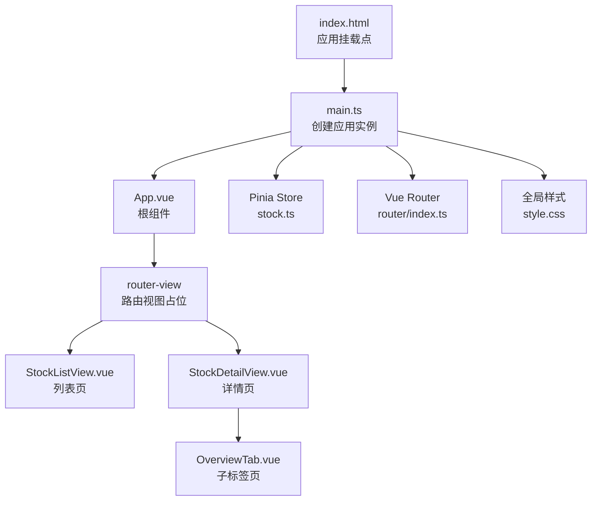
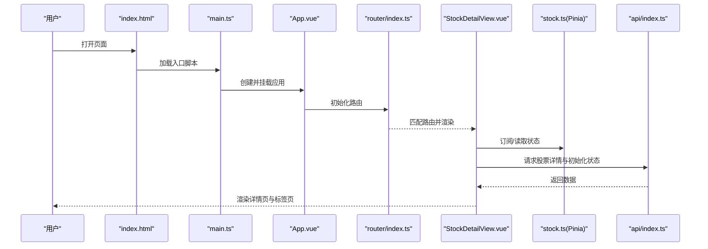
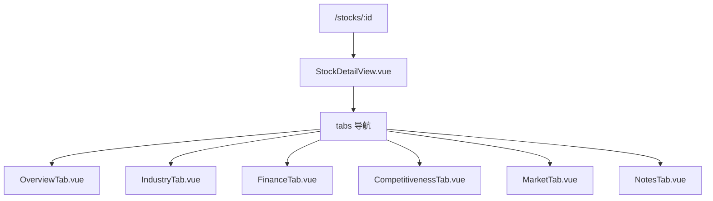
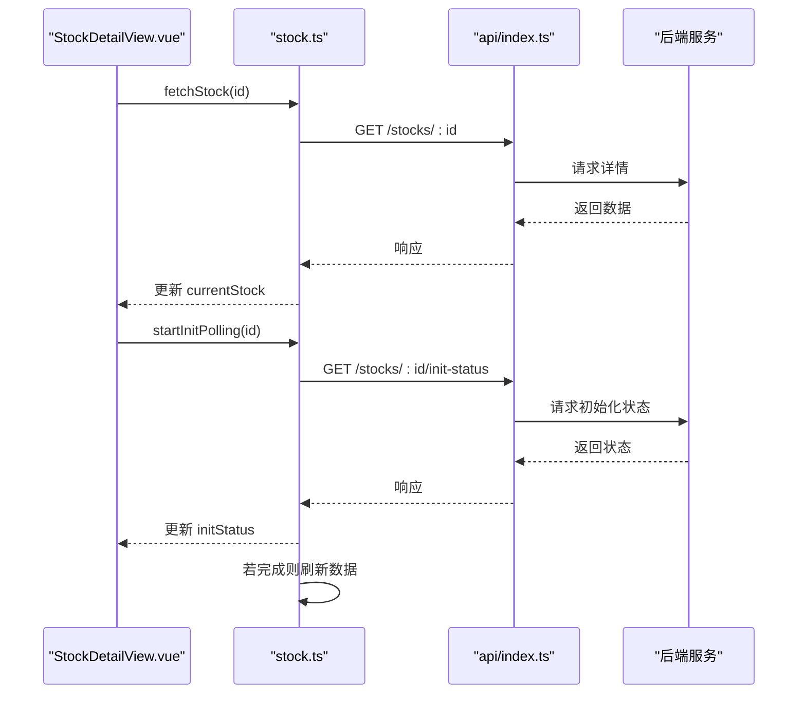
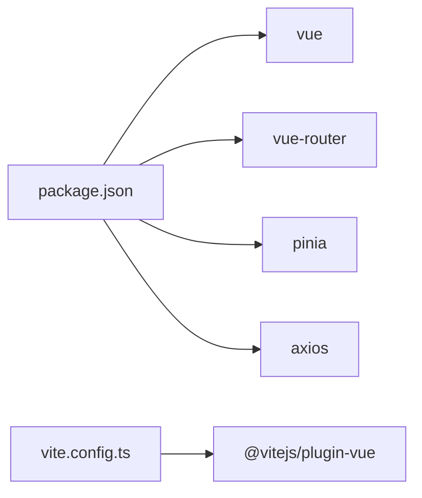

# 布局组件

<cite>
**本文引用的文件**
- [frontend/src/App.vue](file://frontend/src/App.vue)
- [frontend/src/main.ts](file://frontend/src/main.ts)
- [frontend/src/router/index.ts](file://frontend/src/router/index.ts)
- [frontend/src/style.css](file://frontend/src/style.css)
- [frontend/package.json](file://frontend/package.json)
- [frontend/src/views/StockListView.vue](file://frontend/src/views/StockListView.vue)
- [frontend/src/views/StockDetailView.vue](file://frontend/src/views/StockDetailView.vue)
- [frontend/src/stores/stock.ts](file://frontend/src/stores/stock.ts)
- [frontend/src/views/tabs/OverviewTab.vue](file://frontend/src/views/tabs/OverviewTab.vue)
- [frontend/src/api/stock.ts](file://frontend/src/api/stock.ts)
- [frontend/src/api/data.ts](file://frontend/src/api/data.ts)
- [frontend/src/api/index.ts](file://frontend/src/api/index.ts)
- [frontend/vite.config.ts](file://frontend/vite.config.ts)
- [frontend/index.html](file://frontend/index.html)
</cite>

## 目录
1. [简介](#简介)
2. [项目结构](#项目结构)
3. [核心组件](#核心组件)
4. [架构总览](#架构总览)
5. [详细组件分析](#详细组件分析)
6. [依赖分析](#依赖分析)
7. [性能考虑](#性能考虑)
8. [故障排查指南](#故障排查指南)
9. [结论](#结论)
10. [附录](#附录)

## 简介
本文件聚焦于前端布局组件的设计与实现，围绕应用的整体布局架构、页面容器设计、导航组件实现展开；同时说明路由系统与布局的集成方式、响应式布局策略、主题切换机制与样式系统设计、全局样式管理方式，并给出布局组件的可定制性、多屏幕适配方案与无障碍访问支持建议，最后提供最佳实践与性能优化建议。

## 项目结构
前端采用 Vue 3 + TypeScript + Pinia + Vue Router + Vite 的现代单页应用架构。入口通过 main.ts 创建应用实例，挂载到 index.html 的 #app 容器；App.vue 作为根组件，内部仅包含一个 router-view，用于承载路由视图。路由在 router/index.ts 中集中定义，包含股票列表页与详情页（含子标签页）两个主要区域。全局样式通过 style.css 统一管理，使用 CSS 变量实现主题色与间距等基础变量。

图表来源
- [frontend/index.html:1-14](file://frontend/index.html#L1-L14)
- [frontend/src/main.ts:1-11](file://frontend/src/main.ts#L1-L11)
- [frontend/src/App.vue:1-4](file://frontend/src/App.vue#L1-L4)
- [frontend/src/router/index.ts:1-28](file://frontend/src/router/index.ts#L1-L28)
- [frontend/src/views/StockListView.vue:1-102](file://frontend/src/views/StockListView.vue#L1-L102)
- [frontend/src/views/StockDetailView.vue:1-82](file://frontend/src/views/StockDetailView.vue#L1-L82)
- [frontend/src/views/tabs/OverviewTab.vue:1-86](file://frontend/src/views/tabs/OverviewTab.vue#L1-L86)
- [frontend/src/stores/stock.ts:1-80](file://frontend/src/stores/stock.ts#L1-L80)
- [frontend/src/style.css:1-163](file://frontend/src/style.css#L1-L163)

章节来源
- [frontend/src/main.ts:1-11](file://frontend/src/main.ts#L1-L11)
- [frontend/src/App.vue:1-4](file://frontend/src/App.vue#L1-L4)
- [frontend/src/router/index.ts:1-28](file://frontend/src/router/index.ts#L1-L28)
- [frontend/src/style.css:1-163](file://frontend/src/style.css#L1-L163)
- [frontend/index.html:1-14](file://frontend/index.html#L1-L14)

## 核心组件
- 根组件与挂载：App.vue 仅包含一个 router-view，负责渲染当前路由对应的视图；main.ts 负责创建应用实例、注册插件（Pinia、Router）、引入全局样式并挂载到 #app。
- 页面容器：所有页面均使用统一的 container 类包裹内容，配合 card 类实现卡片化布局，确保视觉一致性与间距控制。
- 导航组件：StockDetailView.vue 提供顶部面包屑与横向标签导航（tabs），结合 Vue Router 的命名路由与 router-link 实现导航跳转。
- 状态管理：Pinia Store（stock.ts）集中管理股票列表、当前股票、初始化状态与加载状态，并提供轮询逻辑以监控初始化进度。
- 全局样式：style.css 使用 CSS 变量定义主题色、背景、边框、圆角等基础变量，提供按钮、表格、标签等通用样式类。

章节来源
- [frontend/src/App.vue:1-4](file://frontend/src/App.vue#L1-L4)
- [frontend/src/main.ts:1-11](file://frontend/src/main.ts#L1-L11)
- [frontend/src/views/StockDetailView.vue:1-82](file://frontend/src/views/StockDetailView.vue#L1-L82)
- [frontend/src/views/StockListView.vue:1-102](file://frontend/src/views/StockListView.vue#L1-L102)
- [frontend/src/stores/stock.ts:1-80](file://frontend/src/stores/stock.ts#L1-L80)
- [frontend/src/style.css:1-163](file://frontend/src/style.css#L1-L163)

## 架构总览
下图展示从入口到视图渲染、状态管理与数据请求的整体流程：

图表来源
- [frontend/index.html:1-14](file://frontend/index.html#L1-L14)
- [frontend/src/main.ts:1-11](file://frontend/src/main.ts#L1-L11)
- [frontend/src/App.vue:1-4](file://frontend/src/App.vue#L1-L4)
- [frontend/src/router/index.ts:1-28](file://frontend/src/router/index.ts#L1-L28)
- [frontend/src/views/StockDetailView.vue:1-82](file://frontend/src/views/StockDetailView.vue#L1-L82)
- [frontend/src/stores/stock.ts:1-80](file://frontend/src/stores/stock.ts#L1-L80)
- [frontend/src/api/index.ts:1-18](file://frontend/src/api/index.ts#L1-L18)

## 详细组件分析

### 路由与布局集成
- 路由定义：router/index.ts 使用 history 模式，定义了股票列表与详情页两条主路径，并在详情页下嵌套多个子标签页（总览、产业分析、财务数据、竞争力、市场行情、投资笔记）。通过命名路由与 router-link，实现清晰的导航关系。
- 布局集成：App.vue 仅包含一个 router-view，StockDetailView.vue 作为详情页的容器，内部包含面包屑与 tabs 导航，再通过 router-view 嵌套子标签页视图。这种“父容器 + 子视图”的模式实现了布局与路由的解耦。

图表来源
- [frontend/src/router/index.ts:1-28](file://frontend/src/router/index.ts#L1-L28)
- [frontend/src/views/StockDetailView.vue:1-82](file://frontend/src/views/StockDetailView.vue#L1-L82)
- [frontend/src/views/tabs/OverviewTab.vue:1-86](file://frontend/src/views/tabs/OverviewTab.vue#L1-L86)

章节来源
- [frontend/src/router/index.ts:1-28](file://frontend/src/router/index.ts#L1-L28)
- [frontend/src/views/StockDetailView.vue:1-82](file://frontend/src/views/StockDetailView.vue#L1-L82)

### 页面容器与卡片化布局
- 容器与卡片：StockListView.vue 与 StockDetailView.vue 均使用 container 类包裹内容，内部用 card 类实现卡片化布局，提升信息密度与层次感。
- 表格与标签：通过统一的表格与标签样式类，保证数据展示的一致性与可读性；正负值颜色通过 CSS 类动态映射，增强信息传达。

章节来源
- [frontend/src/views/StockListView.vue:1-102](file://frontend/src/views/StockListView.vue#L1-L102)
- [frontend/src/views/StockDetailView.vue:1-82](file://frontend/src/views/StockDetailView.vue#L1-L82)
- [frontend/src/style.css:1-163](file://frontend/src/style.css#L1-L163)

### 导航组件实现
- 面包屑与标签：StockDetailView.vue 提供“返回列表”面包屑与横向 tabs 导航，使用 router-link 与命名路由进行跳转，激活态通过 CSS 类自动高亮。
- 子路由渲染：通过在父视图中放置 router-view，子标签页视图按需渲染，形成“详情页容器 + 多标签页”的复合布局。

章节来源
- [frontend/src/views/StockDetailView.vue:1-82](file://frontend/src/views/StockDetailView.vue#L1-L82)
- [frontend/src/router/index.ts:1-28](file://frontend/src/router/index.ts#L1-L28)

### 状态管理与数据流
- Pinia Store：stock.ts 定义了 stocks、currentStock、initStatus、loading 等状态，并提供 fetchStocks、addStock、deleteStock、fetchStock、startInitPolling、stopInitPolling 等方法。其中初始化轮询逻辑通过定时器周期性拉取初始化状态，完成后刷新数据。
- 数据接口：api/index.ts 封装 axios，设置基础 URL 与超时；api/stock.ts 与 api/data.ts 定义了股票与各类数据的接口类型与调用方法。

图表来源
- [frontend/src/views/StockDetailView.vue:1-82](file://frontend/src/views/StockDetailView.vue#L1-L82)
- [frontend/src/stores/stock.ts:1-80](file://frontend/src/stores/stock.ts#L1-L80)
- [frontend/src/api/index.ts:1-18](file://frontend/src/api/index.ts#L1-L18)
- [frontend/src/api/stock.ts:1-61](file://frontend/src/api/stock.ts#L1-L61)

章节来源
- [frontend/src/stores/stock.ts:1-80](file://frontend/src/stores/stock.ts#L1-L80)
- [frontend/src/api/stock.ts:1-61](file://frontend/src/api/stock.ts#L1-L61)
- [frontend/src/api/data.ts:1-169](file://frontend/src/api/data.ts#L1-L169)
- [frontend/src/api/index.ts:1-18](file://frontend/src/api/index.ts#L1-L18)

### 主题切换机制与样式系统
- CSS 变量主题：style.css 在 :root 中定义主题变量（如主色、危险/成功/警告色、背景、卡片背景、文字、边框、圆角等），页面通过 var() 引用，便于主题切换。
- 组件内联样式：部分组件使用内联样式进行局部微调，建议逐步迁移到类名或 CSS 变量，保持一致的主题控制面。
- 建议：新增主题切换时，优先修改 :root 变量值，避免破坏现有类名体系。

章节来源
- [frontend/src/style.css:1-163](file://frontend/src/style.css#L1-L163)

### 全局样式管理
- reset 与基础排版：对全局元素进行 margin/padding 重置与 box-sizing 设置，统一字体族、背景与文字颜色。
- 通用组件样式：提供按钮、输入框、表格、标签等通用类，减少重复样式编写。
- 响应式策略：当前未见媒体查询，建议在 container 或关键布局处增加断点，以适配移动端与平板。

章节来源
- [frontend/src/style.css:1-163](file://frontend/src/style.css#L1-L163)

### 可定制性与多屏幕适配
- 可定制性：通过 CSS 变量与类名组合，可在不改动组件结构的情况下调整主题与布局外观。
- 多屏幕适配：建议在 container 上增加最大宽度与左右留白，在关键卡片与表格上使用响应式网格或弹性布局，针对小屏设备调整字体大小与间距。

章节来源
- [frontend/src/style.css:28-32](file://frontend/src/style.css#L28-L32)

### 无障碍访问支持
- 当前实现：部分图标使用 role="presentation" 与 aria-hidden="true"，避免对读屏器造成干扰；链接与按钮具备基本语义。
- 建议：为关键交互元素补充可访问名称（aria-label），为表格添加表头语义（thead/th），为模态或加载状态提供 aria-live 区域提示。

章节来源
- [frontend/src/components/HelloWorld.vue:28-30](file://frontend/src/components/HelloWorld.vue#L28-L30)

## 依赖分析
- 运行时依赖：Vue 3、Vue Router、Pinia、Axios。
- 开发依赖：Vite、@vitejs/plugin-vue、TypeScript、Playwright 等。
- 插件与构建：vite.config.ts 仅启用 @vitejs/plugin-vue，构建脚本在 package.json 中定义。

图表来源
- [frontend/package.json:1-27](file://frontend/package.json#L1-L27)
- [frontend/vite.config.ts:1-8](file://frontend/vite.config.ts#L1-L8)

章节来源
- [frontend/package.json:1-27](file://frontend/package.json#L1-L27)
- [frontend/vite.config.ts:1-8](file://frontend/vite.config.ts#L1-L8)

## 性能考虑
- 路由懒加载：路由组件通过动态导入实现懒加载，减少首屏体积。
- 组件懒加载：详情页子标签页同样采用动态导入，按需加载，降低初始渲染压力。
- 列表渲染：StockListView.vue 使用 v-for 渲染表格行，建议在数据量大时引入虚拟滚动或分页。
- 轮询优化：初始化轮询间隔固定为 2 秒，建议根据业务场景允许配置或在后台标签页时暂停轮询。
- 样式体积：全局样式集中管理，建议在生产环境开启 CSS 压缩与 Tree-shaking。

章节来源
- [frontend/src/router/index.ts:1-28](file://frontend/src/router/index.ts#L1-L28)
- [frontend/src/views/StockDetailView.vue:1-82](file://frontend/src/views/StockDetailView.vue#L1-L82)
- [frontend/src/stores/stock.ts:43-58](file://frontend/src/stores/stock.ts#L43-L58)

## 故障排查指南
- 路由无法匹配：检查 router/index.ts 中路径与命名路由是否与组件引用一致；确认父视图包含 router-view。
- 数据未更新：确认 Pinia Store 的 fetchStock 与 startInitPolling 是否正确调用；检查 API 返回与错误拦截器日志。
- 样式异常：检查 style.css 中变量值与类名拼写；确认组件是否使用了正确的类名或内联样式覆盖。
- 构建问题：确认 vite.config.ts 插件配置与 package.json 脚本；清理 node_modules 与缓存后重试。

章节来源
- [frontend/src/router/index.ts:1-28](file://frontend/src/router/index.ts#L1-L28)
- [frontend/src/stores/stock.ts:1-80](file://frontend/src/stores/stock.ts#L1-L80)
- [frontend/src/api/index.ts:1-18](file://frontend/src/api/index.ts#L1-L18)
- [frontend/src/style.css:1-163](file://frontend/src/style.css#L1-L163)
- [frontend/package.json:1-27](file://frontend/package.json#L1-L27)

## 结论
该布局体系以“根组件 + 路由 + 容器 + 卡片 + 导航”的组合实现，结构清晰、职责明确。通过 CSS 变量与统一类名实现主题与样式管理，结合 Pinia 管理状态与 API 请求，形成完整的前端布局与数据流闭环。后续可在响应式适配、主题切换、无障碍完善与性能优化方面持续演进。

## 附录
- 最佳实践清单
  - 使用命名路由与 router-link，避免硬编码路径。
  - 将组件内联样式迁移至类名或 CSS 变量，统一主题控制。
  - 对长列表与复杂视图引入虚拟滚动或分页。
  - 在后台标签页时暂停轮询或降低频率。
  - 为关键交互与状态变化提供可访问性提示。
- 性能优化建议
  - 启用路由与组件懒加载，减少首屏资源。
  - 生产环境开启 CSS/JS 压缩与 Tree-shaking。
  - 对高频轮询与网络请求设置节流/防抖与错误重试。