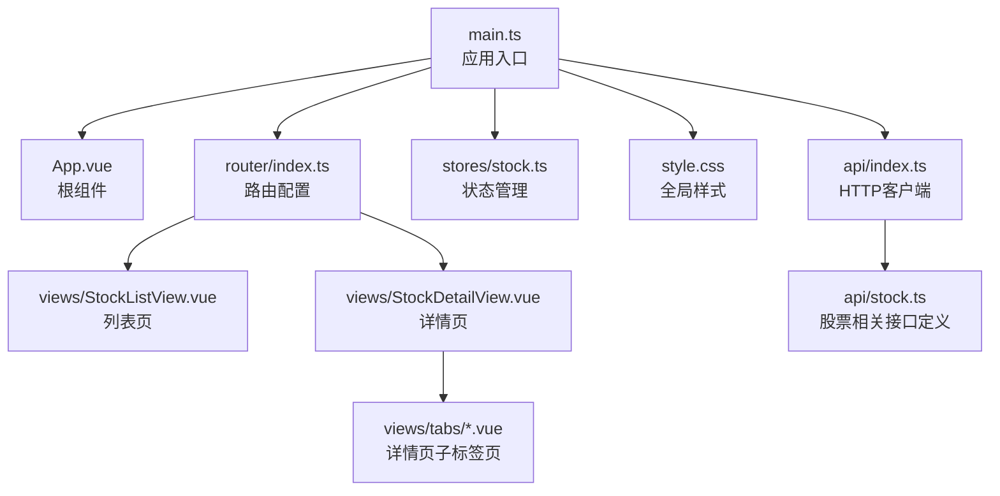
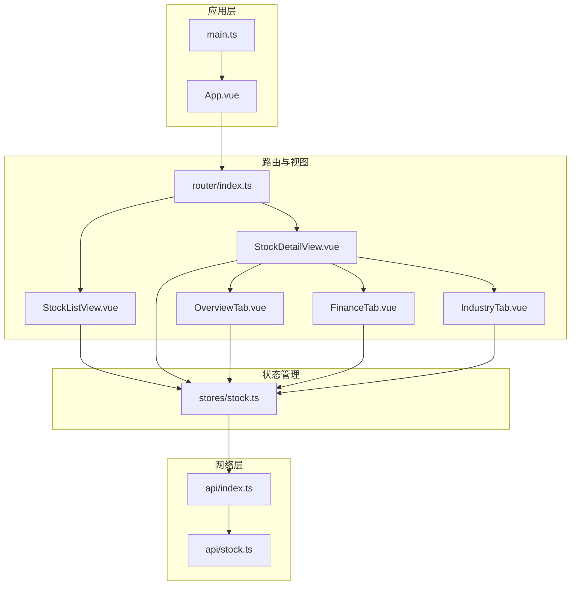
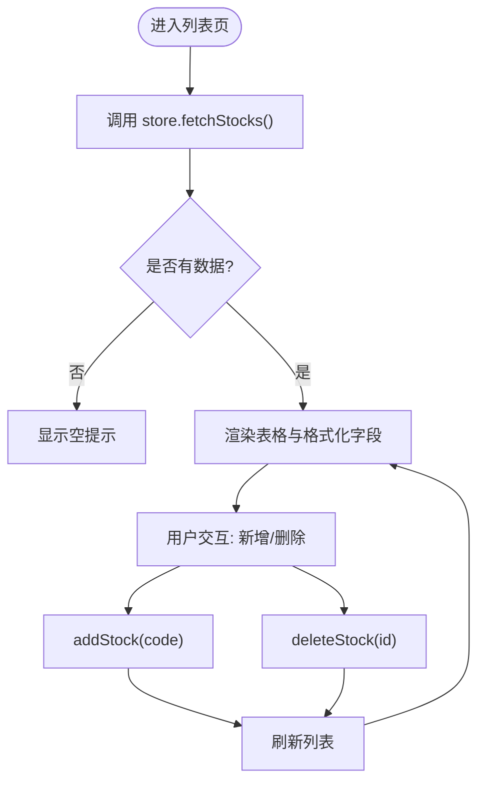
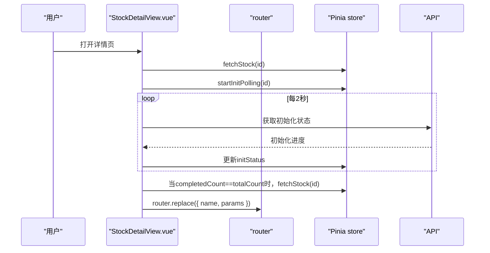
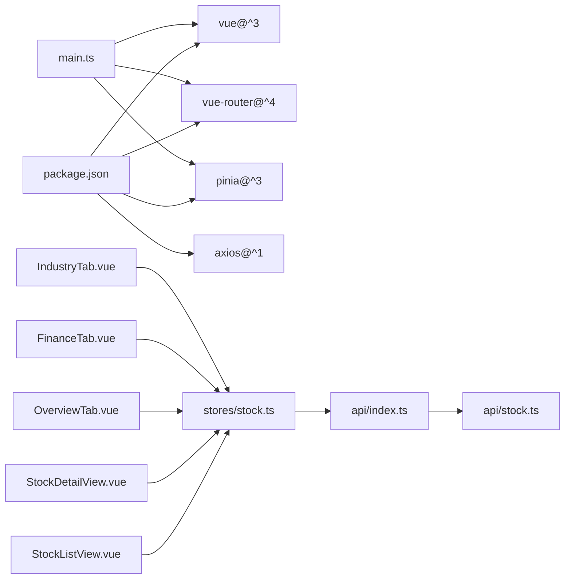

# 组件库设计

<cite>
**本文引用的文件**
- [frontend/src/main.ts](file://frontend/src/main.ts)
- [frontend/src/App.vue](file://frontend/src/App.vue)
- [frontend/package.json](file://frontend/package.json)
- [frontend/vite.config.ts](file://frontend/vite.config.ts)
- [frontend/src/style.css](file://frontend/src/style.css)
- [frontend/src/router/index.ts](file://frontend/src/router/index.ts)
- [frontend/src/stores/stock.ts](file://frontend/src/stores/stock.ts)
- [frontend/src/api/index.ts](file://frontend/src/api/index.ts)
- [frontend/src/api/stock.ts](file://frontend/src/api/stock.ts)
- [frontend/src/views/StockListView.vue](file://frontend/src/views/StockListView.vue)
- [frontend/src/views/StockDetailView.vue](file://frontend/src/views/StockDetailView.vue)
- [frontend/src/views/tabs/OverviewTab.vue](file://frontend/src/views/tabs/OverviewTab.vue)
- [frontend/src/views/tabs/FinanceTab.vue](file://frontend/src/views/tabs/FinanceTab.vue)
- [frontend/src/views/tabs/IndustryTab.vue](file://frontend/src/views/tabs/IndustryTab.vue)
- [frontend/src/components/HelloWorld.vue](file://frontend/src/components/HelloWorld.vue)
</cite>

## 目录
1. [引言](#引言)
2. [项目结构](#项目结构)
3. [核心组件](#核心组件)
4. [架构总览](#架构总览)
5. [详细组件分析](#详细组件分析)
6. [依赖分析](#依赖分析)
7. [性能考虑](#性能考虑)
8. [故障排查指南](#故障排查指南)
9. [结论](#结论)
10. [附录](#附录)

## 引言
本文件面向Vue组件库的设计与实现，围绕该仓库中的前端部分进行系统化梳理。内容涵盖组件设计原则、组件分类体系、组件复用策略；对核心组件的实现、属性（props）设计、事件（event）处理、插槽（slots）使用进行深入解析；解释生命周期管理、组件通信模式、组件状态管理；并给出样式封装、主题定制与响应式设计建议，最后提供组件开发规范与最佳实践。

## 项目结构
前端采用Vite + Vue 3 + TypeScript + Pinia + Vue Router的现代技术栈，整体结构清晰，按功能域划分：页面视图（views）、路由配置（router）、状态管理（stores）、API封装（api）、全局样式（style.css），以及示例组件（components）。入口在main.ts中创建应用实例并挂载，App.vue作为根组件承载路由视图。

图表来源
- [frontend/src/main.ts:1-11](file://frontend/src/main.ts#L1-L11)
- [frontend/src/App.vue:1-4](file://frontend/src/App.vue#L1-L4)
- [frontend/src/router/index.ts:1-28](file://frontend/src/router/index.ts#L1-L28)
- [frontend/src/stores/stock.ts:1-80](file://frontend/src/stores/stock.ts#L1-L80)
- [frontend/src/style.css:1-163](file://frontend/src/style.css#L1-L163)
- [frontend/src/api/index.ts:1-18](file://frontend/src/api/index.ts#L1-L18)
- [frontend/src/api/stock.ts:1-61](file://frontend/src/api/stock.ts#L1-L61)

章节来源
- [frontend/src/main.ts:1-11](file://frontend/src/main.ts#L1-L11)
- [frontend/src/App.vue:1-4](file://frontend/src/App.vue#L1-L4)
- [frontend/package.json:1-27](file://frontend/package.json#L1-L27)
- [frontend/vite.config.ts:1-8](file://frontend/vite.config.ts#L1-L8)

## 核心组件
本项目未提供独立的可复用组件库文件夹，但已具备完善的页面级组件与状态管理模块，可直接作为组件库的基础素材。核心能力包括：
- 列表页组件：负责展示股票清单、新增与删除操作、加载态与格式化显示。
- 详情页组件：负责展示个股基础信息、初始化进度条、标签页导航与数据刷新。
- 子标签页组件：分别承担总览、财务、产业分析等业务维度的数据展示与编辑。
- 状态管理：集中管理股票列表、当前股票、初始化状态与加载标志，并提供轮询控制。
- API层：统一的HTTP客户端与接口定义，便于扩展与维护。

章节来源
- [frontend/src/views/StockListView.vue:1-102](file://frontend/src/views/StockListView.vue#L1-L102)
- [frontend/src/views/StockDetailView.vue:1-82](file://frontend/src/views/StockDetailView.vue#L1-L82)
- [frontend/src/views/tabs/OverviewTab.vue:1-86](file://frontend/src/views/tabs/OverviewTab.vue#L1-L86)
- [frontend/src/views/tabs/FinanceTab.vue:1-77](file://frontend/src/views/tabs/FinanceTab.vue#L1-L77)
- [frontend/src/views/tabs/IndustryTab.vue:1-81](file://frontend/src/views/tabs/IndustryTab.vue#L1-L81)
- [frontend/src/stores/stock.ts:1-80](file://frontend/src/stores/stock.ts#L1-L80)
- [frontend/src/api/stock.ts:1-61](file://frontend/src/api/stock.ts#L1-L61)

## 架构总览
下图展示了从前端入口到页面视图、状态管理与API层的整体交互关系，体现“视图-状态-网络”的分层架构。

图表来源
- [frontend/src/main.ts:1-11](file://frontend/src/main.ts#L1-L11)
- [frontend/src/App.vue:1-4](file://frontend/src/App.vue#L1-L4)
- [frontend/src/router/index.ts:1-28](file://frontend/src/router/index.ts#L1-L28)
- [frontend/src/stores/stock.ts:1-80](file://frontend/src/stores/stock.ts#L1-L80)
- [frontend/src/api/index.ts:1-18](file://frontend/src/api/index.ts#L1-L18)
- [frontend/src/api/stock.ts:1-61](file://frontend/src/api/stock.ts#L1-L61)

## 详细组件分析

### 页面组件：StockListView（股票列表）
- 设计原则
  - 单一职责：仅负责列表渲染、新增与删除、加载态与格式化展示。
  - 可复用性：通过Pinia store暴露方法，供其他视图调用。
- 属性（props）
  - 无外部props，内部通过storeToRefs读取状态。
- 事件（events）
  - 用户交互事件：输入框回车、按钮点击、确认对话框。
- 插槽（slots）
  - 未使用具名/作用域插槽。
- 生命周期管理
  - onMounted触发首次拉取列表。
- 通信与状态
  - 使用Pinia store管理stocks、loading；通过store方法执行增删查。
- 响应式与样式
  - 使用内联样式与全局类名组合，响应式数据驱动UI更新。

图表来源
- [frontend/src/views/StockListView.vue:50-102](file://frontend/src/views/StockListView.vue#L50-L102)
- [frontend/src/stores/stock.ts:12-36](file://frontend/src/stores/stock.ts#L12-L36)

章节来源
- [frontend/src/views/StockListView.vue:1-102](file://frontend/src/views/StockListView.vue#L1-L102)
- [frontend/src/stores/stock.ts:1-80](file://frontend/src/stores/stock.ts#L1-L80)

### 页面组件：StockDetailView（股票详情）
- 设计原则
  - 负责详情页头部信息、初始化进度条、标签页导航与数据刷新。
  - 在初始化完成后自动刷新当前数据并重定向当前标签页以强制重新渲染。
- 属性（props）
  - 无外部props。
- 事件（events）
  - 导航事件：返回列表、标签页切换。
- 插槽（slots）
  - 未使用具名/作用域插槽。
- 生命周期管理
  - onMounted：根据路由参数获取当前股票并启动初始化轮询。
  - onUnmounted：停止轮询定时器。
  - watch：监听初始化状态，完成后刷新数据并重定向当前路由。
- 通信与状态
  - 通过Pinia store管理currentStock、initStatus；通过router.replace触发当前路由刷新。

图表来源
- [frontend/src/views/StockDetailView.vue:47-82](file://frontend/src/views/StockDetailView.vue#L47-L82)
- [frontend/src/stores/stock.ts:43-79](file://frontend/src/stores/stock.ts#L43-L79)
- [frontend/src/api/stock.ts:53-60](file://frontend/src/api/stock.ts#L53-L60)

章节来源
- [frontend/src/views/StockDetailView.vue:1-82](file://frontend/src/views/StockDetailView.vue#L1-L82)
- [frontend/src/stores/stock.ts:1-80](file://frontend/src/stores/stock.ts#L1-L80)

### 子标签页组件：OverviewTab（总览）
- 设计原则
  - 分块展示基本信息与估值指标，支持多列布局。
  - 按需加载最近利润表数据。
- 属性（props）
  - 无外部props。
- 事件（events）
  - 无交互事件。
- 插槽（slots）
  - 未使用具名/作用域插槽。
- 生命周期管理
  - onMounted：根据路由参数拉取收入数据。
- 通信与状态
  - 从Pinia store读取currentStock；本地ref存储收入数据。

章节来源
- [frontend/src/views/tabs/OverviewTab.vue:1-86](file://frontend/src/views/tabs/OverviewTab.vue#L1-L86)
- [frontend/src/stores/stock.ts:1-80](file://frontend/src/stores/stock.ts#L1-L80)

### 子标签页组件：FinanceTab（财务）
- 设计原则
  - 分三块展示利润表、财务摘要与股东数据，统一使用表格展示。
- 属性（props）
  - 无外部props。
- 事件（events）
  - 无交互事件。
- 插槽（slots）
  - 未使用具名/作用域插槽。
- 生命周期管理
  - onMounted：并行拉取收入、财务与股东数据。
- 通信与状态
  - 本地ref管理三类数据。

章节来源
- [frontend/src/views/tabs/FinanceTab.vue:1-77](file://frontend/src/views/tabs/FinanceTab.vue#L1-L77)

### 子标签页组件：IndustryTab（产业分析）
- 设计原则
  - 提供表单用于录入生命周期、上下游、政策影响与行业趋势。
  - 支持保存与错误提示。
- 属性（props）
  - 无外部props。
- 事件（events）
  - 保存按钮触发保存流程。
- 插槽（slots）
  - 未使用具名/作用域插槽。
- 生命周期管理
  - onMounted：根据路由参数拉取已有数据并填充表单。
- 通信与状态
  - 本地ref管理表单与保存状态；调用manual接口保存。

章节来源
- [frontend/src/views/tabs/IndustryTab.vue:1-81](file://frontend/src/views/tabs/IndustryTab.vue#L1-L81)

### 示例组件：HelloWorld（演示组件）
- 设计原则
  - 作为示例组件，展示图片、按钮与文本的基本用法。
- 属性（props）
  - 无外部props。
- 事件（events）
  - 点击按钮增加计数。
- 插槽（slots）
  - 未使用具名/作用域插槽。
- 生命周期管理
  - 未使用生命周期钩子。
- 通信与状态
  - 内部ref管理计数。

章节来源
- [frontend/src/components/HelloWorld.vue:1-94](file://frontend/src/components/HelloWorld.vue#L1-L94)

## 依赖分析
- 外部依赖
  - Vue 3、Pinia、Vue Router、Axios、TypeScript、Vite。
- 内部依赖
  - main.ts依赖router与pinia；views依赖stores与api；router懒加载各视图组件。
- 耦合与内聚
  - 视图与store松耦合，通过storeToRefs读取状态；API层集中管理HTTP请求，降低重复代码。

图表来源
- [frontend/package.json:11-25](file://frontend/package.json#L11-L25)
- [frontend/src/main.ts:1-11](file://frontend/src/main.ts#L1-L11)
- [frontend/src/stores/stock.ts:1-80](file://frontend/src/stores/stock.ts#L1-L80)
- [frontend/src/api/index.ts:1-18](file://frontend/src/api/index.ts#L1-L18)
- [frontend/src/api/stock.ts:1-61](file://frontend/src/api/stock.ts#L1-L61)

章节来源
- [frontend/package.json:1-27](file://frontend/package.json#L1-L27)
- [frontend/src/main.ts:1-11](file://frontend/src/main.ts#L1-L11)

## 性能考虑
- 路由懒加载
  - 通过动态导入实现路由级别的代码分割，减少首屏体积。
- 状态持久化与轮询
  - 初始化轮询采用定时器，注意在组件卸载时清理，避免内存泄漏。
- 表格渲染
  - 大量数据渲染时建议采用虚拟滚动或分页策略，提升渲染性能。
- 图片与图标
  - 使用SVG雪碧图（icons.svg）减少HTTP请求数量。
- 缓存策略
  - 对于不频繁变化的数据，可在store中加入缓存逻辑，避免重复请求。

## 故障排查指南
- API错误处理
  - 全局拦截器统一处理响应错误，打印错误信息并拒绝Promise，便于上层捕获。
- 初始化轮询异常
  - 轮询过程中若发生异常会停止定时器，确保资源释放。
- 用户交互反馈
  - 新增失败与保存失败时弹出提示，便于定位问题。
- 路由跳转异常
  - 切换标签页后若数据未刷新，可通过router.replace强制刷新当前路由。

章节来源
- [frontend/src/api/index.ts:8-15](file://frontend/src/api/index.ts#L8-L15)
- [frontend/src/stores/stock.ts:43-79](file://frontend/src/stores/stock.ts#L43-L79)
- [frontend/src/views/StockListView.vue:70-75](file://frontend/src/views/StockListView.vue#L70-L75)
- [frontend/src/views/tabs/IndustryTab.vue:74-79](file://frontend/src/views/tabs/IndustryTab.vue#L74-L79)

## 结论
本项目以页面组件为核心，结合Pinia状态管理与Axios API层，形成了清晰的前端架构。虽然未提供独立的可复用组件库文件夹，但现有组件已具备良好的可扩展性与可维护性。后续可在此基础上抽象通用组件（如表格、表单、弹窗、标签页容器等），并完善类型定义与文档，逐步构建标准化的组件库。

## 附录

### 组件设计原则
- 单一职责：每个组件聚焦一个功能领域。
- 可复用性：尽量通过props与事件解耦，便于在不同场景复用。
- 易测试：保持纯函数与简单状态，便于单元测试与集成测试。
- 可维护性：统一的命名规范、目录结构与开发约定。

### 组件分类体系
- 页面组件：StockListView、StockDetailView及其子标签页。
- 业务组件：基于页面组件进一步拆分的卡片、表格、表单等。
- 工具组件：待抽象的通用组件（如Pagination、Modal、Tag等）。

### 组件复用策略
- 抽象通用UI：将表格、表单、按钮、标签等抽象为可复用组件。
- Props规范化：统一props命名与默认值，增强可读性与可维护性。
- 事件与插槽：通过事件向外通知状态变化，通过插槽扩展内容。

### 核心组件实现要点
- 列表页：通过storeToRefs读取状态，使用本地ref管理表单与交互状态。
- 详情页：结合路由参数与store状态，实现初始化进度条与自动刷新。
- 子标签页：按业务维度拆分，避免单文件过长，提升可维护性。

### 属性（props）、事件（event）、插槽（slots）设计
- 属性：优先使用只读props，必要时提供受控与非受控两种模式。
- 事件：遵循onX命名约定，传递最小化数据，避免复杂对象。
- 插槽：提供默认插槽与具名插槽，满足灵活定制需求。

### 生命周期管理
- onMounted：发起数据请求与订阅。
- onUnmounted：清理定时器、订阅与事件监听。
- watch：监听store状态变化，触发副作用（如刷新数据）。

### 组件通信模式
- 父子通信：通过props传入数据，通过事件向上反馈。
- 兄弟/跨层级：通过Pinia store共享状态，避免深层传递。
- 路由通信：通过路由参数与查询参数传递轻量数据。

### 组件状态管理
- Pinia Store：集中管理应用状态，提供异步方法与计算属性。
- 本地状态：仅存放与组件生命周期强相关的状态（如表单输入）。

### 样式封装、主题定制与响应式设计
- 主题变量：通过CSS自定义属性实现主题色与间距的统一管理。
- 组件样式：优先使用全局类名（如card、btn、tabs），保证一致性。
- 响应式：使用媒体查询与flex/grid布局适配不同屏幕尺寸。

### 开发规范与最佳实践
- 目录结构：按功能域划分views、stores、api、components。
- 类型安全：使用TypeScript接口定义API响应与组件props。
- 命名规范：组件文件与导出命名一致，事件与方法命名语义明确。
- 文档与注释：为公共组件补充README与JSDoc，便于团队协作。