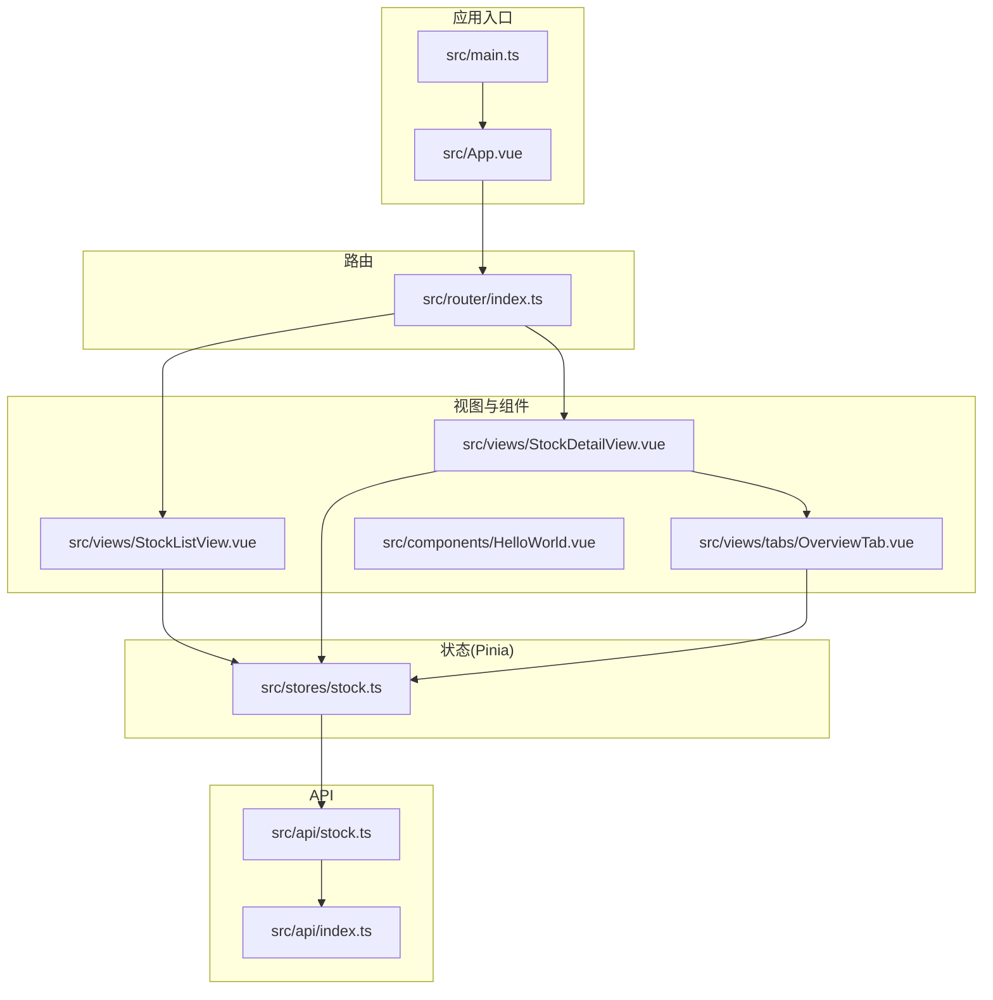
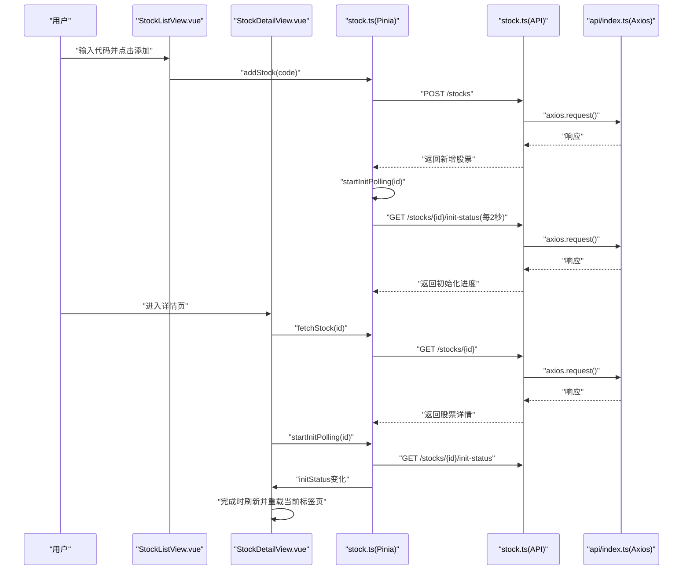
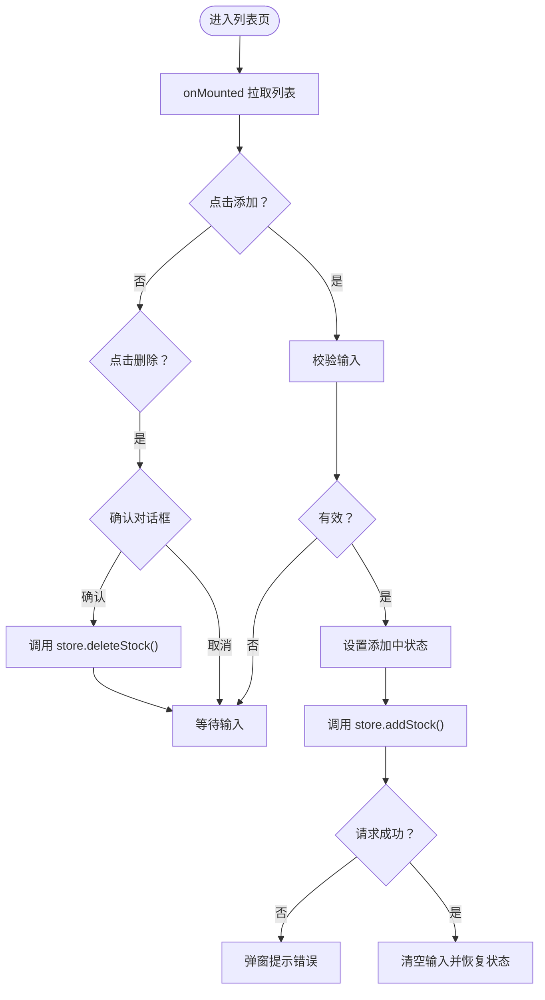
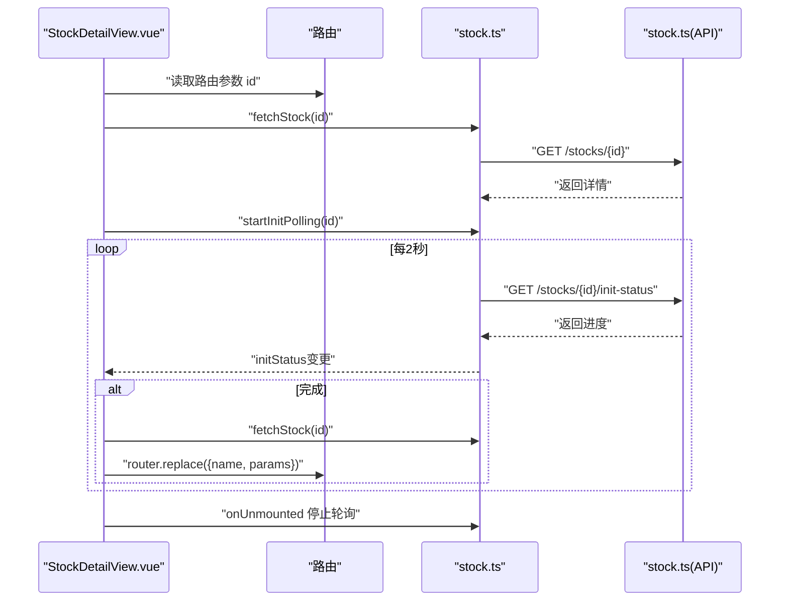
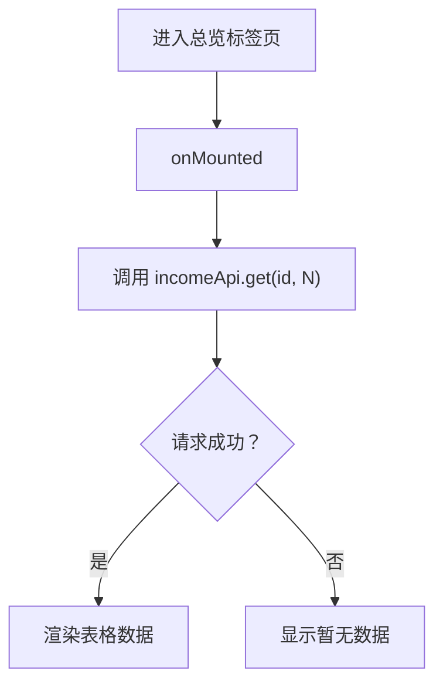
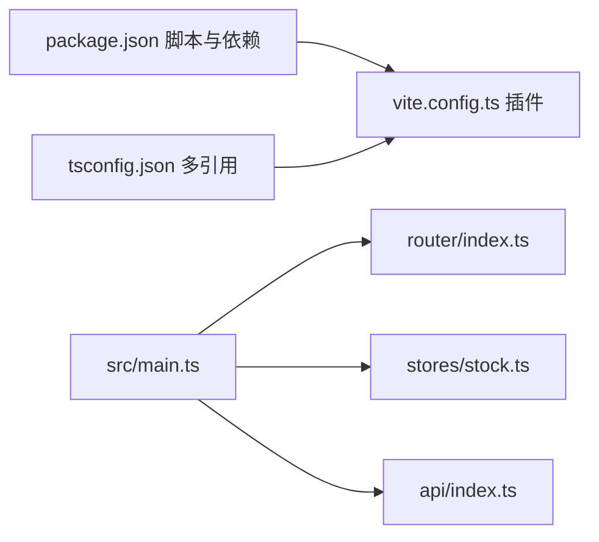
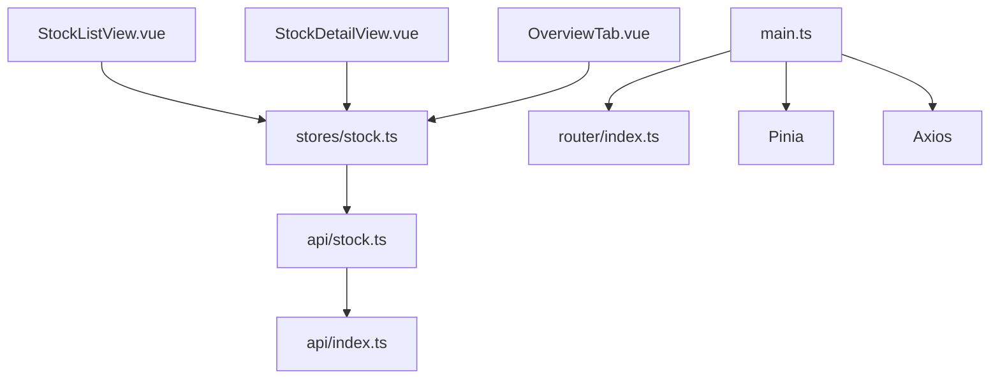

# 组件开发规范

<cite>
**本文引用的文件**
- [frontend/package.json](file://frontend/package.json)
- [frontend/vite.config.ts](file://frontend/vite.config.ts)
- [frontend/src/main.ts](file://frontend/src/main.ts)
- [frontend/src/App.vue](file://frontend/src/App.vue)
- [frontend/src/router/index.ts](file://frontend/src/router/index.ts)
- [frontend/src/stores/stock.ts](file://frontend/src/stores/stock.ts)
- [frontend/src/api/index.ts](file://frontend/src/api/index.ts)
- [frontend/src/api/stock.ts](file://frontend/src/api/stock.ts)
- [frontend/src/views/StockListView.vue](file://frontend/src/views/StockListView.vue)
- [frontend/src/views/StockDetailView.vue](file://frontend/src/views/StockDetailView.vue)
- [frontend/src/views/tabs/OverviewTab.vue](file://frontend/src/views/tabs/OverviewTab.vue)
- [frontend/src/components/HelloWorld.vue](file://frontend/src/components/HelloWorld.vue)
- [frontend/playwright.config.ts](file://frontend/playwright.config.ts)
- [frontend/tsconfig.json](file://frontend/tsconfig.json)
- [frontend/README.md](file://frontend/README.md)
</cite>

## 目录
1. [引言](#引言)
2. [项目结构](#项目结构)
3. [核心组件](#核心组件)
4. [架构总览](#架构总览)
5. [组件详细分析](#组件详细分析)
6. [依赖关系分析](#依赖关系分析)
7. [性能考虑](#性能考虑)
8. [故障排查指南](#故障排查指南)
9. [结论](#结论)
10. [附录](#附录)

## 引言
本规范面向Vue.js组件开发，结合现有前端工程（基于Vue 3 + TypeScript + Vite + Pinia + Vue Router）的实际实现，制定统一的组件开发标准流程、代码风格与命名约定，明确生命周期管理、状态管理模式与API集成方式，覆盖测试策略、文档编写与版本管理要求，并提供性能优化、内存泄漏防范与错误边界处理建议，以及工具链配置、调试技巧与发布流程。

## 项目结构
前端采用模块化组织：入口应用在根目录初始化，路由按页面拆分，组件按功能域划分，状态通过Pinia集中管理，API封装在独立模块，测试使用Playwright进行端到端验证。

**图表来源**
- [frontend/src/main.ts:1-11](file://frontend/src/main.ts#L1-L11)
- [frontend/src/App.vue:1-4](file://frontend/src/App.vue#L1-L4)
- [frontend/src/router/index.ts:1-28](file://frontend/src/router/index.ts#L1-L28)
- [frontend/src/stores/stock.ts:1-80](file://frontend/src/stores/stock.ts#L1-L80)
- [frontend/src/api/index.ts:1-18](file://frontend/src/api/index.ts#L1-L18)
- [frontend/src/api/stock.ts:1-61](file://frontend/src/api/stock.ts#L1-L61)
- [frontend/src/views/StockListView.vue:1-102](file://frontend/src/views/StockListView.vue#L1-L102)
- [frontend/src/views/StockDetailView.vue:1-82](file://frontend/src/views/StockDetailView.vue#L1-L82)
- [frontend/src/views/tabs/OverviewTab.vue:1-86](file://frontend/src/views/tabs/OverviewTab.vue#L1-L86)
- [frontend/src/components/HelloWorld.vue:1-94](file://frontend/src/components/HelloWorld.vue#L1-L94)

**章节来源**
- [frontend/src/main.ts:1-11](file://frontend/src/main.ts#L1-L11)
- [frontend/src/App.vue:1-4](file://frontend/src/App.vue#L1-L4)
- [frontend/src/router/index.ts:1-28](file://frontend/src/router/index.ts#L1-L28)
- [frontend/src/stores/stock.ts:1-80](file://frontend/src/stores/stock.ts#L1-L80)
- [frontend/src/api/index.ts:1-18](file://frontend/src/api/index.ts#L1-L18)
- [frontend/src/api/stock.ts:1-61](file://frontend/src/api/stock.ts#L1-L61)
- [frontend/src/views/StockListView.vue:1-102](file://frontend/src/views/StockListView.vue#L1-L102)
- [frontend/src/views/StockDetailView.vue:1-82](file://frontend/src/views/StockDetailView.vue#L1-L82)
- [frontend/src/views/tabs/OverviewTab.vue:1-86](file://frontend/src/views/tabs/OverviewTab.vue#L1-L86)
- [frontend/src/components/HelloWorld.vue:1-94](file://frontend/src/components/HelloWorld.vue#L1-L94)

## 核心组件
- 应用入口与全局注册：在入口文件中创建应用实例，安装Pinia与路由，挂载根组件。
- 路由系统：定义列表页与详情页路由，详情页内嵌多标签页子路由。
- 状态管理：以Pinia Store集中管理股票列表、当前股票、初始化状态与加载标志；提供轮询控制方法。
- API层：统一创建Axios实例，设置基础URL与超时，拦截器统一处理响应错误。
- 视图组件：列表页负责增删查与加载态展示；详情页负责初始化进度条与标签页导航；各标签页负责具体业务数据拉取与渲染。

**章节来源**
- [frontend/src/main.ts:1-11](file://frontend/src/main.ts#L1-L11)
- [frontend/src/router/index.ts:1-28](file://frontend/src/router/index.ts#L1-L28)
- [frontend/src/stores/stock.ts:1-80](file://frontend/src/stores/stock.ts#L1-L80)
- [frontend/src/api/index.ts:1-18](file://frontend/src/api/index.ts#L1-L18)
- [frontend/src/api/stock.ts:1-61](file://frontend/src/api/stock.ts#L1-L61)
- [frontend/src/views/StockListView.vue:1-102](file://frontend/src/views/StockListView.vue#L1-L102)
- [frontend/src/views/StockDetailView.vue:1-82](file://frontend/src/views/StockDetailView.vue#L1-L82)
- [frontend/src/views/tabs/OverviewTab.vue:1-86](file://frontend/src/views/tabs/OverviewTab.vue#L1-L86)

## 架构总览
下图展示从用户交互到数据流的端到端路径：用户在列表页添加股票，触发状态更新与轮询；进入详情页后根据初始化状态动态刷新数据并重载当前标签页。

**图表来源**
- [frontend/src/views/StockListView.vue:64-80](file://frontend/src/views/StockListView.vue#L64-L80)
- [frontend/src/views/StockDetailView.vue:61-80](file://frontend/src/views/StockDetailView.vue#L61-L80)
- [frontend/src/stores/stock.ts:22-58](file://frontend/src/stores/stock.ts#L22-L58)
- [frontend/src/api/stock.ts:53-60](file://frontend/src/api/stock.ts#L53-L60)
- [frontend/src/api/index.ts:1-18](file://frontend/src/api/index.ts#L1-L18)

## 组件详细分析

### 列表页组件（StockListView）
- 生命周期：在挂载时自动拉取股票列表。
- 用户交互：支持输入框回车或点击按钮添加新股票；删除时二次确认。
- 加载与错误：通过loading与异常捕获控制UI反馈；错误信息友好提示。
- 数据格式化：对价格、百分比、完成度进行格式化输出。

**图表来源**
- [frontend/src/views/StockListView.vue:60-80](file://frontend/src/views/StockListView.vue#L60-L80)

**章节来源**
- [frontend/src/views/StockListView.vue:1-102](file://frontend/src/views/StockListView.vue#L1-L102)

### 详情页组件（StockDetailView）
- 生命周期：挂载时读取路由参数，拉取当前股票并启动初始化轮询；卸载时停止轮询。
- 初始化进度：根据initStatus实时渲染进度条与步骤状态；完成后刷新数据并强制重载当前标签页。
- 路由联动：利用router.replace在同名路由下触发重新渲染。

**图表来源**
- [frontend/src/views/StockDetailView.vue:61-80](file://frontend/src/views/StockDetailView.vue#L61-L80)
- [frontend/src/stores/stock.ts:43-65](file://frontend/src/stores/stock.ts#L43-L65)
- [frontend/src/api/stock.ts:57-58](file://frontend/src/api/stock.ts#L57-L58)

**章节来源**
- [frontend/src/views/StockDetailView.vue:1-82](file://frontend/src/views/StockDetailView.vue#L1-L82)
- [frontend/src/stores/stock.ts:1-80](file://frontend/src/stores/stock.ts#L1-L80)
- [frontend/src/api/stock.ts:1-61](file://frontend/src/api/stock.ts#L1-L61)

### 标签页组件（OverviewTab）
- 数据拉取：在挂载时向收入API请求最近若干期利润数据。
- 渲染逻辑：网格布局展示基本信息与估值指标，表格展示利润表数据并按同比正负着色。

**图表来源**
- [frontend/src/views/tabs/OverviewTab.vue:58-64](file://frontend/src/views/tabs/OverviewTab.vue#L58-L64)

**章节来源**
- [frontend/src/views/tabs/OverviewTab.vue:1-86](file://frontend/src/views/tabs/OverviewTab.vue#L1-L86)

### 入口与全局配置
- 应用入口：创建应用、安装Pinia与路由、挂载根组件。
- 构建配置：Vite插件启用Vue单文件组件支持。
- 类型配置：多tsconfig引用，分别约束应用与Node环境。

**图表来源**
- [frontend/package.json:1-27](file://frontend/package.json#L1-L27)
- [frontend/vite.config.ts:1-8](file://frontend/vite.config.ts#L1-L8)
- [frontend/src/main.ts:1-11](file://frontend/src/main.ts#L1-L11)
- [frontend/tsconfig.json:1-8](file://frontend/tsconfig.json#L1-L8)

**章节来源**
- [frontend/package.json:1-27](file://frontend/package.json#L1-L27)
- [frontend/vite.config.ts:1-8](file://frontend/vite.config.ts#L1-L8)
- [frontend/src/main.ts:1-11](file://frontend/src/main.ts#L1-L11)
- [frontend/tsconfig.json:1-8](file://frontend/tsconfig.json#L1-L8)

## 依赖关系分析
- 组件耦合：视图组件依赖Pinia Store；Store依赖API模块；API模块依赖Axios实例。
- 路由耦合：详情页路由与标签页子路由强关联；标签页通过router-link与父路由联动。
- 工具链：Vite提供构建与开发服务器；Playwright用于端到端测试；TypeScript提供类型安全。

**图表来源**
- [frontend/src/views/StockListView.vue:50-56](file://frontend/src/views/StockListView.vue#L50-L56)
- [frontend/src/views/StockDetailView.vue:47-56](file://frontend/src/views/StockDetailView.vue#L47-L56)
- [frontend/src/views/tabs/OverviewTab.vue:45-54](file://frontend/src/views/tabs/OverviewTab.vue#L45-L54)
- [frontend/src/stores/stock.ts:1-80](file://frontend/src/stores/stock.ts#L1-L80)
- [frontend/src/api/stock.ts:1-61](file://frontend/src/api/stock.ts#L1-L61)
- [frontend/src/api/index.ts:1-18](file://frontend/src/api/index.ts#L1-L18)
- [frontend/src/main.ts:1-11](file://frontend/src/main.ts#L1-L11)
- [frontend/src/router/index.ts:1-28](file://frontend/src/router/index.ts#L1-L28)

**章节来源**
- [frontend/src/views/StockListView.vue:50-56](file://frontend/src/views/StockListView.vue#L50-L56)
- [frontend/src/views/StockDetailView.vue:47-56](file://frontend/src/views/StockDetailView.vue#L47-L56)
- [frontend/src/views/tabs/OverviewTab.vue:45-54](file://frontend/src/views/tabs/OverviewTab.vue#L45-L54)
- [frontend/src/stores/stock.ts:1-80](file://frontend/src/stores/stock.ts#L1-L80)
- [frontend/src/api/stock.ts:1-61](file://frontend/src/api/stock.ts#L1-L61)
- [frontend/src/api/index.ts:1-18](file://frontend/src/api/index.ts#L1-L18)
- [frontend/src/main.ts:1-11](file://frontend/src/main.ts#L1-L11)
- [frontend/src/router/index.ts:1-28](file://frontend/src/router/index.ts#L1-L28)

## 性能考虑
- 组件渲染优化
  - 使用响应式引用与storeToRefs避免不必要的深层解构，减少渲染抖动。
  - 在列表组件中对大表格使用虚拟滚动或分页（建议在后续迭代中引入）。
- 网络与轮询
  - 初始化轮询间隔固定为2秒，建议根据实际数据量与后端能力调整；在组件卸载时务必清理定时器（已在详情页实现）。
  - 对高频请求增加防抖/节流策略（如搜索、筛选）。
- 内存与资源
  - 在onUnmounted中统一停止轮询与订阅，避免内存泄漏。
  - 避免在组件内直接持有大型对象引用，必要时使用浅拷贝或惰性计算。
- 打包与缓存
  - 使用Vite默认的代码分割策略；将第三方库与业务代码分离。
  - 合理拆分路由级组件，利用动态导入实现懒加载。

[本节为通用指导，不直接分析特定文件，故无“章节来源”]

## 故障排查指南
- 错误拦截与日志
  - Axios响应拦截器统一记录错误并透传Promise，便于上层统一处理。
- 组件常见问题
  - 添加失败：检查输入校验与错误提示分支；确保finally中恢复状态。
  - 删除确认：确认二次确认对话框逻辑生效。
  - 初始化未完成：确认轮询是否在卸载时停止；确认完成条件判断。
- 测试与回归
  - 使用Playwright配置的WebServer启动本地服务，执行端到端用例；失败自动截图便于定位。

**章节来源**
- [frontend/src/api/index.ts:8-15](file://frontend/src/api/index.ts#L8-L15)
- [frontend/src/views/StockListView.vue:64-80](file://frontend/src/views/StockListView.vue#L64-L80)
- [frontend/src/views/StockDetailView.vue:67-69](file://frontend/src/views/StockDetailView.vue#L67-L69)
- [frontend/playwright.config.ts:18-23](file://frontend/playwright.config.ts#L18-L23)

## 结论
本规范总结了基于现有工程的组件开发实践：以Pinia集中状态、以Axios统一封装API、以路由驱动页面与标签页、以Vite+TypeScript保障开发体验与质量。建议在后续迭代中补充单元测试、组件文档与自动化发布流程，持续提升可维护性与交付效率。

[本节为总结性内容，不直接分析特定文件，故无“章节来源”]

## 附录

### 组件开发标准流程
- 需求评审 → 设计组件结构与接口 → 编写类型定义 → 实现组件与状态 → 编写API调用 → 单元/端到端测试 → 文档与注释 → 代码审查 → 发布与监控

[本节为流程性内容，不直接分析特定文件，故无“章节来源”]

### 代码风格与命名约定
- 文件命名：视图组件使用帕斯卡命名；工具函数与常量使用驼峰命名；API模块以领域命名。
- 组件导出：默认导出组件，命名与文件一致；store使用defineStore并以use前缀命名。
- 变量命名：props使用camelCase；事件回调以handle前缀；状态变量以ref声明并在模板中直接使用。

[本节为规范性内容，不直接分析特定文件，故无“章节来源”]

### 生命周期管理
- onMounted：首次数据拉取与订阅建立。
- onUnmounted：清理定时器、订阅与事件监听。
- watch：对关键状态变化做副作用处理（如初始化完成后的刷新与路由重载）。

**章节来源**
- [frontend/src/views/StockDetailView.vue:67-69](file://frontend/src/views/StockDetailView.vue#L67-L69)
- [frontend/src/views/StockDetailView.vue:71-80](file://frontend/src/views/StockDetailView.vue#L71-L80)

### 状态管理模式
- Pinia Store集中管理：列表、当前股票、初始化状态、加载标志；提供异步动作与轮询控制。
- 与组件解耦：通过storeToRefs在模板中直接消费状态，避免深层解构。

**章节来源**
- [frontend/src/stores/stock.ts:1-80](file://frontend/src/stores/stock.ts#L1-L80)

### API集成方式
- Axios实例：统一基础URL、超时与错误拦截。
- 接口定义：在API模块中集中声明请求方法与响应类型。
- 组件调用：在组件中注入store，通过store动作发起请求，避免在组件内直接调用API。

**章节来源**
- [frontend/src/api/index.ts:1-18](file://frontend/src/api/index.ts#L1-L18)
- [frontend/src/api/stock.ts:53-60](file://frontend/src/api/stock.ts#L53-L60)

### 测试策略
- 端到端测试：Playwright配置本地WebServer，设置超时与截图策略，按浏览器项目运行。
- 建议补充：为关键组件与API动作编写单元测试，覆盖边界与异常场景。

**章节来源**
- [frontend/playwright.config.ts:1-25](file://frontend/playwright.config.ts#L1-L25)

### 文档编写规范
- 组件文档：包含用途、属性、事件、插槽、示例与注意事项。
- API文档：统一在API模块中以接口形式声明入参与返回值，便于IDE提示与类型推断。
- README：简要说明技术栈与快速开始。

**章节来源**
- [frontend/README.md:1-6](file://frontend/README.md#L1-L6)
- [frontend/src/api/stock.ts:1-61](file://frontend/src/api/stock.ts#L1-L61)

### 版本管理要求
- 包版本：在package.json中统一管理依赖与脚本，遵循语义化版本。
- 构建产物：Vite构建生成dist目录，建议在CI中校验构建产物完整性。

**章节来源**
- [frontend/package.json:1-27](file://frontend/package.json#L1-L27)

### 组件开发工具链配置
- 构建与开发：Vite提供热更新与快速构建；TypeScript提供类型检查。
- 调试技巧：利用Vue DevTools查看组件树与状态；在API拦截器中打印请求/响应便于定位问题。
- 发布流程：本地预览后在CI中执行构建与测试，通过后部署至静态托管或容器镜像。

**章节来源**
- [frontend/vite.config.ts:1-8](file://frontend/vite.config.ts#L1-L8)
- [frontend/tsconfig.json:1-8](file://frontend/tsconfig.json#L1-L8)
- [frontend/src/api/index.ts:1-18](file://frontend/src/api/index.ts#L1-L18)