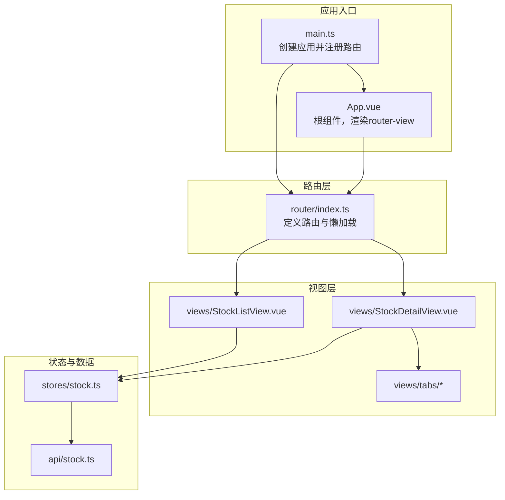
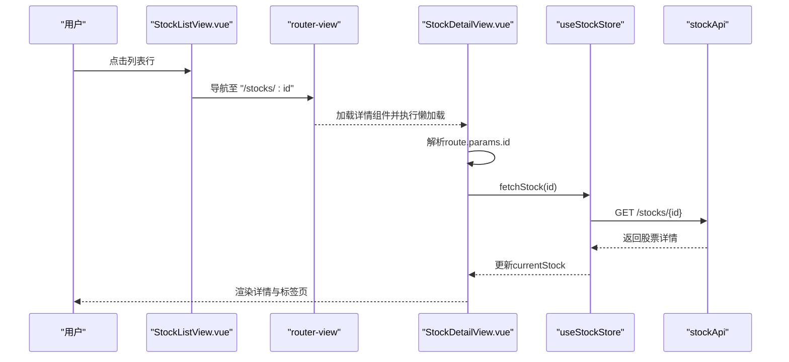
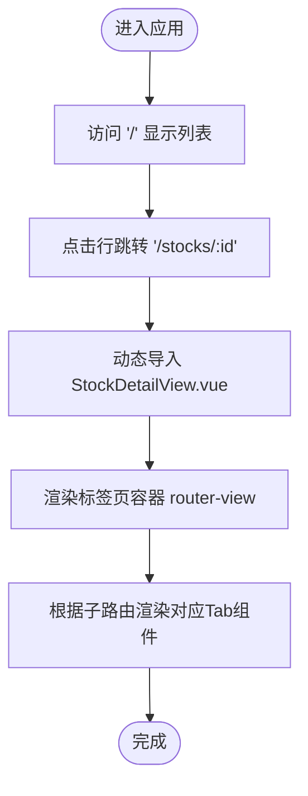
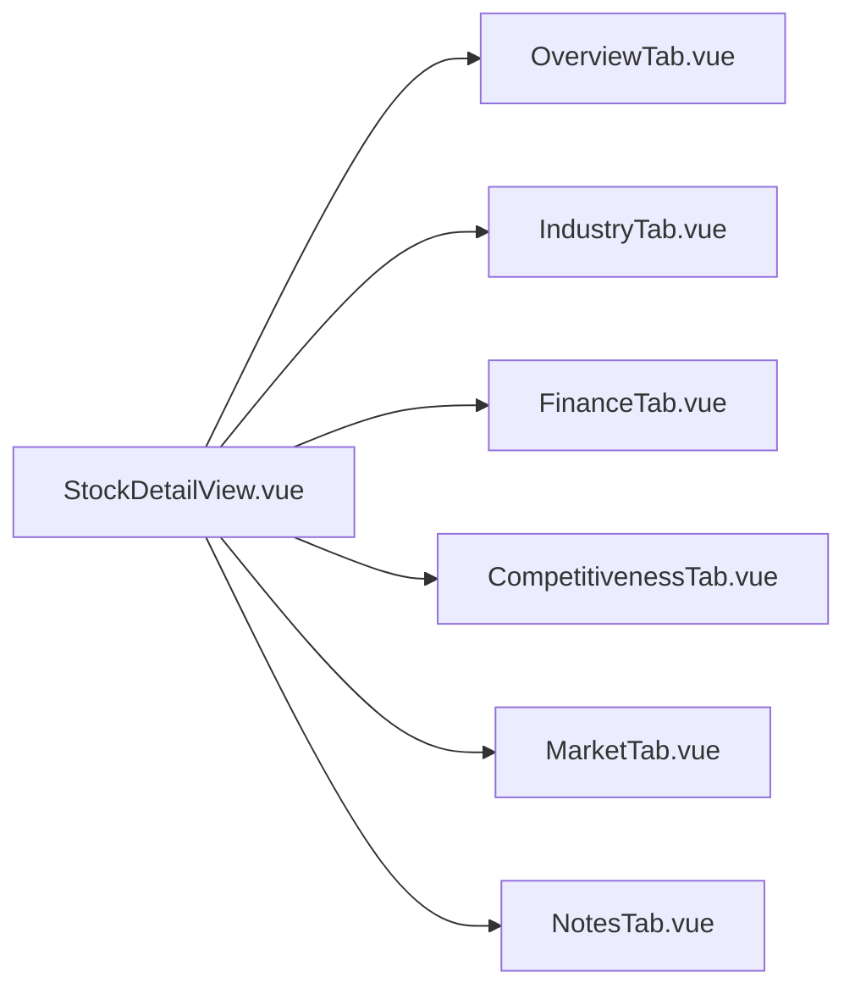
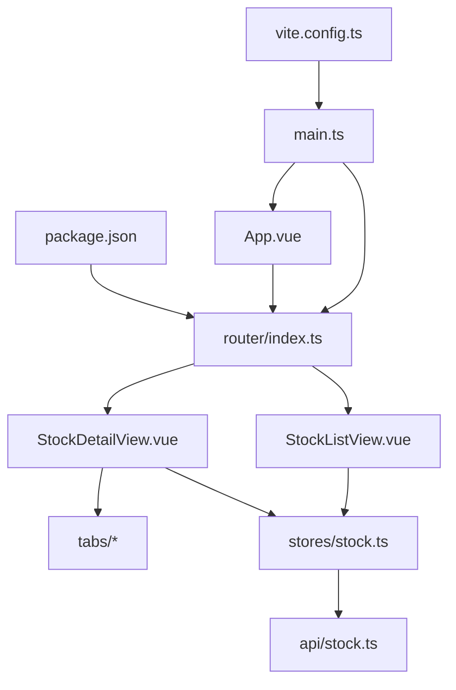

# 路由系统

<cite>
**本文引用的文件**
- [frontend/src/router/index.ts](file://frontend/src/router/index.ts)
- [frontend/src/main.ts](file://frontend/src/main.ts)
- [frontend/src/App.vue](file://frontend/src/App.vue)
- [frontend/src/views/StockListView.vue](file://frontend/src/views/StockListView.vue)
- [frontend/src/views/StockDetailView.vue](file://frontend/src/views/StockDetailView.vue)
- [frontend/src/views/tabs/OverviewTab.vue](file://frontend/src/views/tabs/OverviewTab.vue)
- [frontend/src/stores/stock.ts](file://frontend/src/stores/stock.ts)
- [frontend/src/api/stock.ts](file://frontend/src/api/stock.ts)
- [frontend/package.json](file://frontend/package.json)
- [frontend/vite.config.ts](file://frontend/vite.config.ts)
- [frontend/src/views/tabs/NotesTab.vue](file://frontend/src/views/tabs/NotesTab.vue)
</cite>

## 目录
1. [简介](#简介)
2. [项目结构](#项目结构)
3. [核心组件](#核心组件)
4. [架构总览](#架构总览)
5. [详细组件分析](#详细组件分析)
6. [依赖关系分析](#依赖关系分析)
7. [性能考虑](#性能考虑)
8. [故障排查指南](#故障排查指南)
9. [结论](#结论)
10. [附录](#附录)

## 简介
本文件面向Vue Router在前端项目中的使用与实践，围绕路由配置结构、导航守卫、路由懒加载、参数传递与查询字符串、路由元信息、嵌套路由、重定向与别名、权限控制、动态路由与缓存策略进行系统化说明，并结合现有代码示例给出可操作的设计模式与性能优化建议。

## 项目结构
前端采用Vue 3 + TypeScript + Vite技术栈，路由系统位于frontend/src/router/index.ts，应用通过main.ts挂载路由并注入Pinia状态管理；页面视图位于frontend/src/views及子目录，状态管理位于frontend/src/stores，API封装位于frontend/src/api。

图表来源
- [frontend/src/main.ts:1-11](file://frontend/src/main.ts#L1-L11)
- [frontend/src/App.vue:1-4](file://frontend/src/App.vue#L1-L4)
- [frontend/src/router/index.ts:1-28](file://frontend/src/router/index.ts#L1-L28)
- [frontend/src/views/StockListView.vue:1-102](file://frontend/src/views/StockListView.vue#L1-L102)
- [frontend/src/views/StockDetailView.vue:1-82](file://frontend/src/views/StockDetailView.vue#L1-L82)
- [frontend/src/stores/stock.ts:1-80](file://frontend/src/stores/stock.ts#L1-L80)
- [frontend/src/api/stock.ts:1-61](file://frontend/src/api/stock.ts#L1-L61)

章节来源
- [frontend/src/main.ts:1-11](file://frontend/src/main.ts#L1-L11)
- [frontend/src/App.vue:1-4](file://frontend/src/App.vue#L1-L4)
- [frontend/src/router/index.ts:1-28](file://frontend/src/router/index.ts#L1-L28)

## 核心组件
- 路由器实例：基于history模式，定义了股票列表页与股票详情页（含嵌套路由）。
- 视图组件：StockListView用于展示股票列表并跳转详情；StockDetailView负责渲染标签页容器并驱动子路由；各Tab组件承载具体业务内容。
- 状态管理：useStockStore统一管理股票列表、当前股票、初始化状态与轮询控制。
- API封装：stockApi提供列表、新增、删除、详情、初始化状态等接口。

章节来源
- [frontend/src/router/index.ts:1-28](file://frontend/src/router/index.ts#L1-L28)
- [frontend/src/views/StockListView.vue:1-102](file://frontend/src/views/StockListView.vue#L1-L102)
- [frontend/src/views/StockDetailView.vue:1-82](file://frontend/src/views/StockDetailView.vue#L1-L82)
- [frontend/src/stores/stock.ts:1-80](file://frontend/src/stores/stock.ts#L1-L80)
- [frontend/src/api/stock.ts:1-61](file://frontend/src/api/stock.ts#L1-L61)

## 架构总览
下图展示了从用户交互到数据加载的端到端流程，包括路由跳转、参数解析、视图渲染与状态更新。

图表来源
- [frontend/src/views/StockListView.vue:28-44](file://frontend/src/views/StockListView.vue#L28-L44)
- [frontend/src/router/index.ts:11-24](file://frontend/src/router/index.ts#L11-L24)
- [frontend/src/views/StockDetailView.vue:61-65](file://frontend/src/views/StockDetailView.vue#L61-L65)
- [frontend/src/stores/stock.ts:38-41](file://frontend/src/stores/stock.ts#L38-L41)
- [frontend/src/api/stock.ts:57-58](file://frontend/src/api/stock.ts#L57-L58)

## 详细组件分析

### 路由配置与懒加载
- 历史模式：使用HTML5 History模式，路径友好且利于SEO。
- 懒加载：通过动态导入实现按需加载组件，减少首屏体积。
- 嵌套路由：详情页作为父路由，子路由对应不同标签页，空路径默认渲染“总览”。
- 参数传递：通过路径参数:id在父子组件间传递，便于复用与缓存。

图表来源
- [frontend/src/router/index.ts:3-25](file://frontend/src/router/index.ts#L3-L25)
- [frontend/src/views/StockDetailView.vue:43](file://frontend/src/views/StockDetailView.vue#L43)

章节来源
- [frontend/src/router/index.ts:1-28](file://frontend/src/router/index.ts#L1-L28)
- [frontend/src/views/StockDetailView.vue:1-82](file://frontend/src/views/StockDetailView.vue#L1-L82)

### 导航守卫与权限控制
- 当前实现未显式声明全局前置/后置守卫或路由级守卫。若需要权限控制，可在router/index.ts中扩展beforeEach等钩子，结合用户态与路由元信息进行鉴权与重定向。
- 建议在路由元信息中加入角色/权限标识，配合全局守卫统一拦截与放行。

章节来源
- [frontend/src/router/index.ts:1-28](file://frontend/src/router/index.ts#L1-L28)

### 路由参数传递与查询字符串
- 路径参数：通过route.params.id在组件内读取，如StockDetailView与各Tab组件均使用该参数发起API请求。
- 查询字符串：可通过route.query读取URL查询参数，适合分页、筛选等场景；当前代码未见显式使用，可按需扩展。

章节来源
- [frontend/src/views/StockDetailView.vue:61-63](file://frontend/src/views/StockDetailView.vue#L61-L63)
- [frontend/src/views/tabs/OverviewTab.vue:58-64](file://frontend/src/views/tabs/OverviewTab.vue#L58-L64)
- [frontend/src/views/tabs/NotesTab.vue:43-49](file://frontend/src/views/tabs/NotesTab.vue#L43-L49)

### 路由元信息配置
- 可在routes数组项中添加meta字段，例如权限级别、标题、图标等，供导航菜单与守卫使用。
- 示例字段（概念性说明）：meta: { requiresAuth: true, title: '详情', icon: 'dashboard' }。

章节来源
- [frontend/src/router/index.ts:5-24](file://frontend/src/router/index.ts#L5-L24)

### 嵌套路由设计
- 父子组件：StockDetailView作为容器，内部通过router-view渲染子路由组件。
- 默认子路由：空路径子路由作为默认Tab，提升用户体验。
- 子路由命名：通过name属性在模板中使用router-link进行无硬编码跳转。

图表来源
- [frontend/src/router/index.ts:14-22](file://frontend/src/router/index.ts#L14-L22)
- [frontend/src/views/StockDetailView.vue:34-41](file://frontend/src/views/StockDetailView.vue#L34-L41)

章节来源
- [frontend/src/router/index.ts:11-24](file://frontend/src/router/index.ts#L11-L24)
- [frontend/src/views/StockDetailView.vue:1-82](file://frontend/src/views/StockDetailView.vue#L1-L82)

### 路由重定向与别名
- 重定向：可在routes中为旧路径添加redirect，将历史访问引导至新路径。
- 别名：为常用路径设置alias，提升可发现性与兼容性。
- 当前代码未见重定向与别名配置，可按需补充。

章节来源
- [frontend/src/router/index.ts:5-24](file://frontend/src/router/index.ts#L5-L24)

### 动态路由生成
- 可根据用户权限或后端返回的菜单配置动态拼装routes数组，再调用router.addRoute进行挂载。
- 建议将菜单数据与路由配置解耦，通过约定的字段映射生成路由表。

章节来源
- [frontend/src/router/index.ts:3-25](file://frontend/src/router/index.ts#L3-L25)

### 路由缓存策略
- 组件级缓存：利用keep-alive包裹router-view，避免重复渲染与二次请求。
- 状态级缓存：Pinia Store持久化（如结合插件）保存关键状态，减少重复拉取。
- 请求级缓存：对高频且不频繁变化的数据增加本地缓存与失效时间控制。

章节来源
- [frontend/src/App.vue:1-4](file://frontend/src/App.vue#L1-L4)
- [frontend/src/stores/stock.ts:1-80](file://frontend/src/stores/stock.ts#L1-L80)

## 依赖关系分析
- 应用启动：main.ts引入router并在应用实例上use；App.vue仅负责渲染router-view。
- 路由到视图：router/index.ts定义routes，视图组件通过动态导入实现懒加载。
- 视图到状态：各视图通过useStockStore与API交互，Store封装异步逻辑与轮询。
- 构建工具：vite.config.ts启用Vue插件，package.json声明vue与vue-router版本。

图表来源
- [frontend/src/main.ts:1-11](file://frontend/src/main.ts#L1-L11)
- [frontend/src/App.vue:1-4](file://frontend/src/App.vue#L1-L4)
- [frontend/src/router/index.ts:1-28](file://frontend/src/router/index.ts#L1-L28)
- [frontend/src/views/StockListView.vue:1-102](file://frontend/src/views/StockListView.vue#L1-L102)
- [frontend/src/views/StockDetailView.vue:1-82](file://frontend/src/views/StockDetailView.vue#L1-L82)
- [frontend/src/stores/stock.ts:1-80](file://frontend/src/stores/stock.ts#L1-L80)
- [frontend/src/api/stock.ts:1-61](file://frontend/src/api/stock.ts#L1-L61)
- [frontend/package.json:11-16](file://frontend/package.json#L11-L16)
- [frontend/vite.config.ts:1-8](file://frontend/vite.config.ts#L1-L8)

章节来源
- [frontend/src/main.ts:1-11](file://frontend/src/main.ts#L1-L11)
- [frontend/src/router/index.ts:1-28](file://frontend/src/router/index.ts#L1-L28)
- [frontend/src/stores/stock.ts:1-80](file://frontend/src/stores/stock.ts#L1-L80)
- [frontend/src/api/stock.ts:1-61](file://frontend/src/api/stock.ts#L1-L61)
- [frontend/package.json:11-16](file://frontend/package.json#L11-L16)
- [frontend/vite.config.ts:1-8](file://frontend/vite.config.ts#L1-L8)

## 性能考虑
- 路由懒加载：已通过动态导入实现，建议对大组件进一步拆分与代码分割。
- 组件缓存：在App.vue的router-view外层包裹keep-alive，减少重复渲染。
- 状态缓存：对不频繁变化的数据使用Pinia持久化或本地缓存，降低网络请求频次。
- 并发控制：在Store中对轮询与并发请求做节流/去抖，避免资源浪费。
- 预加载：对即将访问的路由预取关键数据，缩短白屏时间。

## 故障排查指南
- 路由无法跳转
  - 检查router-link的to是否匹配路由name或路径；确保router已正确注册。
  - 参考：[frontend/src/views/StockDetailView.vue:35-41](file://frontend/src/views/StockDetailView.vue#L35-L41)，[frontend/src/router/index.ts:11-24](file://frontend/src/router/index.ts#L11-L24)
- 参数为空或类型错误
  - 在组件中使用Number(route.params.id)转换；确保父组件传参正确。
  - 参考：[frontend/src/views/StockDetailView.vue:61-63](file://frontend/src/views/StockDetailView.vue#L61-L63)，[frontend/src/views/tabs/OverviewTab.vue:58-64](file://frontend/src/views/tabs/OverviewTab.vue#L58-L64)
- 初始化状态导致重复刷新
  - 使用router.replace强制刷新当前Tab，避免重复请求。
  - 参考：[frontend/src/views/StockDetailView.vue:71-80](file://frontend/src/views/StockDetailView.vue#L71-L80)
- 数据未更新
  - 确认Store中的轮询逻辑与状态变更触发；检查API响应结构。
  - 参考：[frontend/src/stores/stock.ts:43-58](file://frontend/src/stores/stock.ts#L43-L58)，[frontend/src/api/stock.ts:57-58](file://frontend/src/api/stock.ts#L57-L58)

章节来源
- [frontend/src/views/StockDetailView.vue:35-80](file://frontend/src/views/StockDetailView.vue#L35-L80)
- [frontend/src/views/tabs/OverviewTab.vue:58-64](file://frontend/src/views/tabs/OverviewTab.vue#L58-L64)
- [frontend/src/router/index.ts:11-24](file://frontend/src/router/index.ts#L11-L24)
- [frontend/src/stores/stock.ts:43-58](file://frontend/src/stores/stock.ts#L43-L58)
- [frontend/src/api/stock.ts:57-58](file://frontend/src/api/stock.ts#L57-L58)

## 结论
本项目基于Vue Router实现了清晰的列表-详情-标签页嵌套路由结构，配合Pinia与API封装形成了完整的数据流闭环。建议后续补充导航守卫、路由元信息、重定向与别名配置，并在keep-alive与状态持久化方面进一步优化，以满足更复杂的权限控制与性能需求。

## 附录
- 技术栈与版本
  - Vue: ^3.5.32
  - Vue Router: ^4.6.4
  - Pinia: ^3.0.4
  - Vite: ^8.0.4
- 构建与运行
  - 开发：npm run dev
  - 构建：npm run build
  - 预览：npm run preview

章节来源
- [frontend/package.json:11-25](file://frontend/package.json#L11-L25)
- [frontend/vite.config.ts:1-8](file://frontend/vite.config.ts#L1-L8)