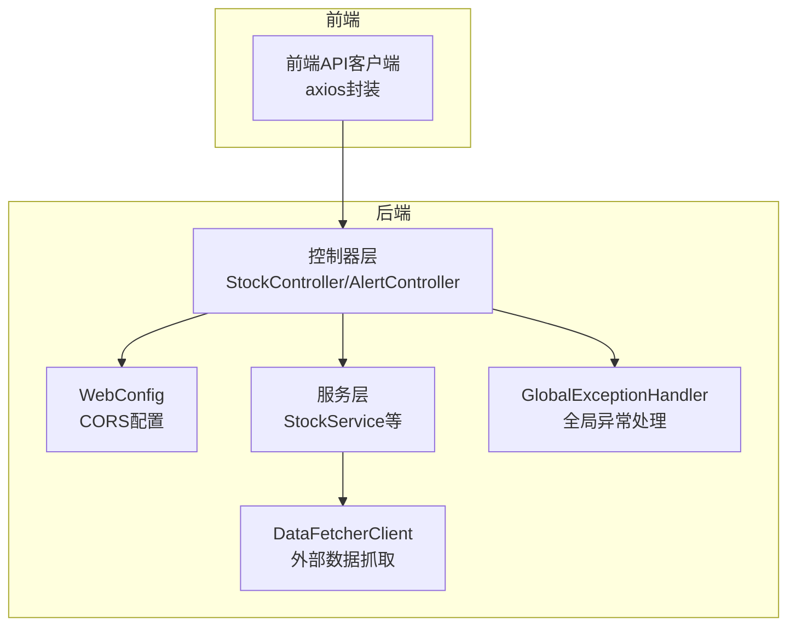
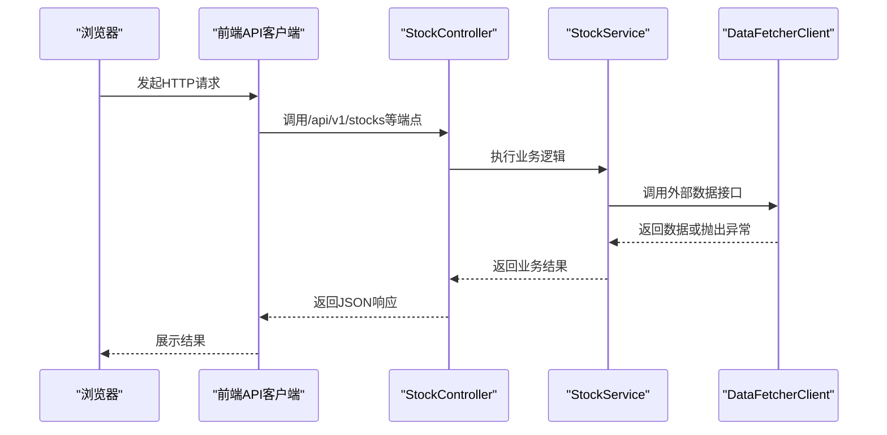
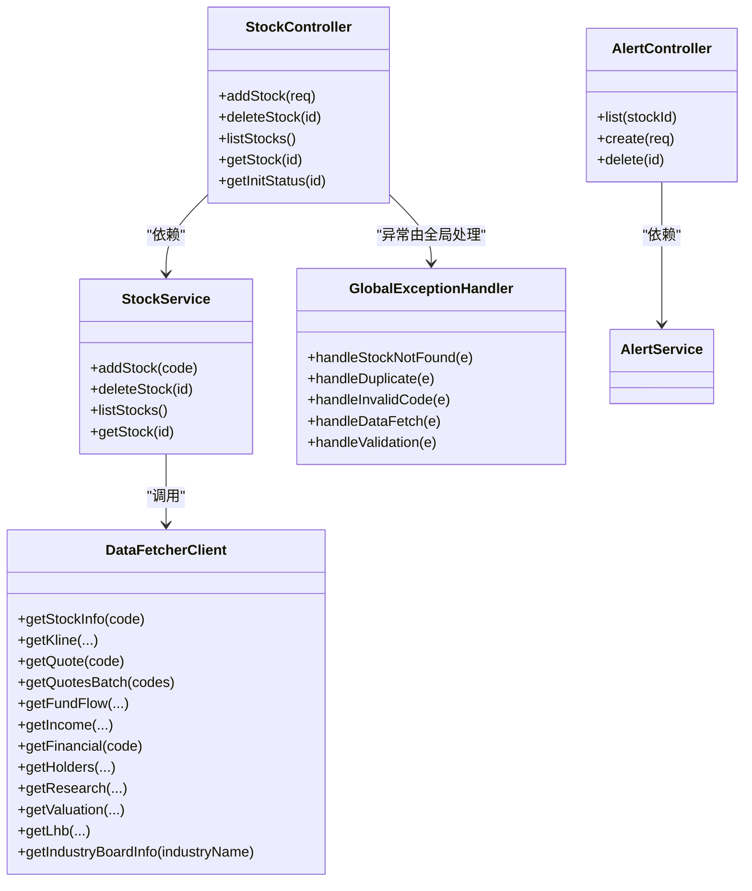

# REST API设计规范

<cite>
**本文档引用的文件**
- [GlobalExceptionHandler.java](file://backend/src/main/java/com/stock/exception/GlobalExceptionHandler.java)
- [ErrorResponse.java](file://backend/src/main/java/com/stock/exception/ErrorResponse.java)
- [WebConfig.java](file://backend/src/main/java/com/stock/config/WebConfig.java)
- [StockController.java](file://backend/src/main/java/com/stock/controller/StockController.java)
- [AlertController.java](file://backend/src/main/java/com/stock/controller/AlertController.java)
- [DataFetcherClient.java](file://backend/src/main/java/com/stock/client/DataFetcherClient.java)
- [RestTemplateConfig.java](file://backend/src/main/java/com/stock/config/RestTemplateConfig.java)
- [application.yml](file://backend/src/main/resources/application.yml)
- [AddStockRequest.java](file://backend/src/main/java/com/stock/dto/request/AddStockRequest.java)
- [StockResponse.java](file://backend/src/main/java/com/stock/dto/response/StockResponse.java)
- [StockService.java](file://backend/src/main/java/com/stock/service/StockService.java)
- [StockNotFoundException.java](file://backend/src/main/java/com/stock/exception/StockNotFoundException.java)
- [DuplicateStockException.java](file://backend/src/main/java/com/stock/exception/DuplicateStockException.java)
- [index.ts](file://frontend/src/api/index.ts)
- [high-level-design.md](file://system-planner/high-level-design.md)
</cite>

## 目录
1. [引言](#引言)
2. [项目结构](#项目结构)
3. [核心组件](#核心组件)
4. [架构总览](#架构总览)
5. [详细组件分析](#详细组件分析)
6. [依赖关系分析](#依赖关系分析)
7. [性能考虑](#性能考虑)
8. [故障排查指南](#故障排查指南)
9. [结论](#结论)
10. [附录](#附录)

## 引言
本文件基于现有代码库总结REST API设计规范，涵盖HTTP方法使用原则、URL命名规范、资源命名约定、请求响应格式、状态码使用、错误响应统一格式、CORS配置与跨域处理、请求参数验证机制、全局异常处理与自定义异常类型、API版本管理策略、安全认证集成方案、以及最佳实践与代码示例路径。

## 项目结构
后端采用Spring Boot MVC架构，控制器位于controller包，异常处理通过@ControllerAdvice集中处理，配置类负责CORS与客户端超时设置，服务层调用数据抓取客户端，前端通过axios封装统一的API客户端。

图表来源
- [WebConfig.java:1-15](file://backend/src/main/java/com/stock/config/WebConfig.java#L1-L15)
- [StockController.java:1-57](file://backend/src/main/java/com/stock/controller/StockController.java#L1-L57)
- [AlertController.java:1-40](file://backend/src/main/java/com/stock/controller/AlertController.java#L1-L40)
- [StockService.java:1-243](file://backend/src/main/java/com/stock/service/StockService.java#L1-L243)
- [DataFetcherClient.java:1-126](file://backend/src/main/java/com/stock/client/DataFetcherClient.java#L1-L126)
- [GlobalExceptionHandler.java:1-33](file://backend/src/main/java/com/stock/exception/GlobalExceptionHandler.java#L1-L33)

章节来源
- [WebConfig.java:1-15](file://backend/src/main/java/com/stock/config/WebConfig.java#L1-L15)
- [StockController.java:1-57](file://backend/src/main/java/com/stock/controller/StockController.java#L1-L57)
- [AlertController.java:1-40](file://backend/src/main/java/com/stock/controller/AlertController.java#L1-L40)
- [StockService.java:1-243](file://backend/src/main/java/com/stock/service/StockService.java#L1-L243)
- [DataFetcherClient.java:1-126](file://backend/src/main/java/com/stock/client/DataFetcherClient.java#L1-L126)
- [GlobalExceptionHandler.java:1-33](file://backend/src/main/java/com/stock/exception/GlobalExceptionHandler.java#L1-L33)

## 核心组件
- 控制器层：以@RestController注解定义REST端点，统一前缀/api/v1，按资源划分（如/stocks、/alerts）。
- 服务层：执行业务逻辑，进行参数校验、调用外部数据源、触发异步初始化流程。
- 异常处理：通过@ControllerAdvice集中捕获业务异常与参数校验异常，返回标准化错误响应。
- CORS配置：在WebMvcConfigurer中为/api/v1/**路径开放跨域访问。
- 前端API客户端：统一baseURL、超时与错误拦截。

章节来源
- [StockController.java:17-57](file://backend/src/main/java/com/stock/controller/StockController.java#L17-L57)
- [AlertController.java:13-40](file://backend/src/main/java/com/stock/controller/AlertController.java#L13-L40)
- [StockService.java:93-163](file://backend/src/main/java/com/stock/service/StockService.java#L93-L163)
- [GlobalExceptionHandler.java:7-31](file://backend/src/main/java/com/stock/exception/GlobalExceptionHandler.java#L7-L31)
- [WebConfig.java:6-13](file://backend/src/main/java/com/stock/config/WebConfig.java#L6-L13)
- [index.ts:1-17](file://frontend/src/api/index.ts#L1-L17)

## 架构总览
下图展示从浏览器到后端控制器、服务层与外部数据抓取服务的整体交互流程。

图表来源
- [StockController.java:29-55](file://backend/src/main/java/com/stock/controller/StockController.java#L29-L55)
- [StockService.java:94-163](file://backend/src/main/java/com/stock/service/StockService.java#L94-L163)
- [DataFetcherClient.java:26-99](file://backend/src/main/java/com/stock/client/DataFetcherClient.java#L26-L99)

## 详细组件分析

### HTTP方法使用原则
- 创建资源：POST /api/v1/stocks（新增股票）
- 读取资源：GET /api/v1/stocks（列表）、GET /api/v1/stocks/{id}（详情）
- 更新资源：未在示例中出现（建议使用PUT/PATCH）
- 删除资源：DELETE /api/v1/stocks/{id}
- 查询参数：GET /api/v1/alerts?stockId=...（条件查询）

章节来源
- [StockController.java:29-55](file://backend/src/main/java/com/stock/controller/StockController.java#L29-L55)
- [AlertController.java:23-38](file://backend/src/main/java/com/stock/controller/AlertController.java#L23-L38)

### URL命名规范与资源命名约定
- 版本前缀：/api/v1
- 资源复数形式：/stocks、/alerts
- 子资源：/stocks/{id}/init-status
- 参数命名：使用小写，单词间用短横线连接（如/stocks/{stockId}/kline），但当前实现使用路径变量{id}

章节来源
- [StockController.java:18](file://backend/src/main/java/com/stock/controller/StockController.java#L18)
- [AlertController.java:14](file://backend/src/main/java/com/stock/controller/AlertController.java#L14)
- [high-level-design.md:193-215](file://system-planner/high-level-design.md#L193-L215)

### 请求响应格式标准
- 成功响应：遵循DTO对象结构；列表接口返回数组；单条记录返回对象。
- 错误响应：统一为JSON对象，包含code、message、timestamp字段。

章节来源
- [StockResponse.java:1-25](file://backend/src/main/java/com/stock/dto/response/StockResponse.java#L1-L25)
- [ErrorResponse.java:3-7](file://backend/src/main/java/com/stock/exception/ErrorResponse.java#L3-L7)

### 状态码使用规范
- 200 OK：成功获取资源或更新成功
- 201 Created：创建成功（新增股票）
- 204 No Content：删除成功
- 400 Bad Request：参数校验失败或非法参数
- 404 Not Found：资源不存在
- 409 Conflict：资源冲突（重复添加）
- 503 Service Unavailable：外部数据源不可用

章节来源
- [StockController.java:33](file://backend/src/main/java/com/stock/controller/StockController.java#L33)
- [StockController.java:39](file://backend/src/main/java/com/stock/controller/StockController.java#L39)
- [GlobalExceptionHandler.java:11](file://backend/src/main/java/com/stock/exception/GlobalExceptionHandler.java#L11)
- [GlobalExceptionHandler.java:15](file://backend/src/main/java/com/stock/exception/GlobalExceptionHandler.java#L15)
- [GlobalExceptionHandler.java:19](file://backend/src/main/java/com/stock/exception/GlobalExceptionHandler.java#L19)
- [GlobalExceptionHandler.java:23](file://backend/src/main/java/com/stock/exception/GlobalExceptionHandler.java#L23)
- [GlobalExceptionHandler.java:30](file://backend/src/main/java/com/stock/exception/GlobalExceptionHandler.java#L30)

### 错误响应统一格式
- 结构：{ "code": 整数, "message": 字符串, "timestamp": 时间戳 }
- 全局异常处理器根据异常类型映射到对应HTTP状态码，并填充message与timestamp。

章节来源
- [ErrorResponse.java:3-7](file://backend/src/main/java/com/stock/exception/ErrorResponse.java#L3-L7)
- [GlobalExceptionHandler.java:9-31](file://backend/src/main/java/com/stock/exception/GlobalExceptionHandler.java#L9-L31)

### CORS配置与跨域处理
- 配置范围：/api/v1/**
- 允许来源：http://localhost:5173（开发环境）
- 允许方法：GET、POST、PUT、DELETE
- 允许头：*（开发环境）

章节来源
- [WebConfig.java:8-12](file://backend/src/main/java/com/stock/config/WebConfig.java#L8-L12)

### 请求参数验证机制
- 使用Jakarta Validation注解在DTO上声明约束（如@NotBlank、@Size、@Pattern）。
- 在控制器方法参数上使用@Valid启用校验。
- 全局异常处理器捕获MethodArgumentNotValidException并组装错误消息。

章节来源
- [AddStockRequest.java:7-9](file://backend/src/main/java/com/stock/dto/request/AddStockRequest.java#L7-L9)
- [StockController.java:30](file://backend/src/main/java/com/stock/controller/StockController.java#L30)
- [GlobalExceptionHandler.java:25-31](file://backend/src/main/java/com/stock/exception/GlobalExceptionHandler.java#L25-L31)

### 全局异常处理机制与自定义异常类型
- 自定义异常：StockNotFoundException、DuplicateStockException、InvalidStockCodeException、DataFetchException。
- 全局异常处理器：映射不同异常到相应HTTP状态码与错误响应体。
- 参数校验异常：统一收集字段级错误并拼接为消息。

章节来源
- [StockNotFoundException.java:1-6](file://backend/src/main/java/com/stock/exception/StockNotFoundException.java#L1-L6)
- [DuplicateStockException.java:1-5](file://backend/src/main/java/com/stock/exception/DuplicateStockException.java#L1-L5)
- [GlobalExceptionHandler.java:9-31](file://backend/src/main/java/com/stock/exception/GlobalExceptionHandler.java#L9-L31)

### API版本管理策略
- 当前版本：/api/v1
- 建议：未来升级时保持向后兼容，新增/删除端点时采用新版本号，避免破坏性变更。

章节来源
- [StockController.java:18](file://backend/src/main/java/com/stock/controller/StockController.java#L18)
- [AlertController.java:14](file://backend/src/main/java/com/stock/controller/AlertController.java#L14)

### 安全认证集成方案
- 当前实现未包含认证相关代码，建议在Spring Security基础上引入JWT或OAuth2，统一在WebMvcConfigurer之前添加过滤器链。

章节来源
- [WebConfig.java:6-13](file://backend/src/main/java/com/stock/config/WebConfig.java#L6-L13)

### 外部数据抓取与超时配置
- 数据抓取客户端通过RestTemplate调用/data-fetcher服务。
- RestTemplate配置了连接与读取超时时间。
- application.yml中定义了数据抓取服务地址与调度任务配置。

章节来源
- [DataFetcherClient.java:19-24](file://backend/src/main/java/com/stock/client/DataFetcherClient.java#L19-L24)
- [RestTemplateConfig.java:11-16](file://backend/src/main/java/com/stock/config/RestTemplateConfig.java#L11-L16)
- [application.yml:20-22](file://backend/src/main/resources/application.yml#L20-L22)

## 依赖关系分析

图表来源
- [StockController.java:21-27](file://backend/src/main/java/com/stock/controller/StockController.java#L21-L27)
- [AlertController.java:17-21](file://backend/src/main/java/com/stock/controller/AlertController.java#L17-L21)
- [StockService.java:51-91](file://backend/src/main/java/com/stock/service/StockService.java#L51-L91)
- [DataFetcherClient.java:15-24](file://backend/src/main/java/com/stock/client/DataFetcherClient.java#L15-L24)
- [GlobalExceptionHandler.java:7-31](file://backend/src/main/java/com/stock/exception/GlobalExceptionHandler.java#L7-L31)

## 性能考虑
- 异步初始化：在事务提交后触发数据初始化，避免阻塞主流程。
- 批量接口：提供批量行情接口，减少网络往返次数。
- 超时控制：合理设置连接与读取超时，防止慢调用拖垮服务。
- 缓存策略：建议对热点数据增加缓存层，降低数据库压力。

章节来源
- [StockService.java:145-160](file://backend/src/main/java/com/stock/service/StockService.java#L145-L160)
- [DataFetcherClient.java:48-57](file://backend/src/main/java/com/stock/client/DataFetcherClient.java#L48-L57)
- [RestTemplateConfig.java:11-16](file://backend/src/main/java/com/stock/config/RestTemplateConfig.java#L11-L16)

## 故障排查指南
- 参数校验失败：检查请求体是否符合DTO约束，查看400错误中的字段级消息。
- 资源不存在：确认路径变量或查询参数是否正确，核对数据库中是否存在该记录。
- 重复添加：确保股票代码唯一性，避免409冲突。
- 外部数据源异常：关注503错误，检查/data-fetcher服务可用性与网络连通性。
- CORS问题：确认前端请求域名与允许来源一致，且路径匹配/api/v1/**。

章节来源
- [GlobalExceptionHandler.java:9-31](file://backend/src/main/java/com/stock/exception/GlobalExceptionHandler.java#L9-L31)
- [WebConfig.java:8-12](file://backend/src/main/java/com/stock/config/WebConfig.java#L8-L12)
- [DataFetcherClient.java:112-124](file://backend/src/main/java/com/stock/client/DataFetcherClient.java#L112-L124)

## 结论
本项目遵循REST设计原则，实现了清晰的资源划分、统一的错误响应格式与CORS配置。通过全局异常处理与参数校验机制提升了API的健壮性。建议后续补充认证授权、版本演进策略与缓存优化，持续提升系统稳定性与可维护性。

## 附录

### HTTP方法与端点对照
- 新增股票：POST /api/v1/stocks
- 删除股票：DELETE /api/v1/stocks/{id}
- 获取股票列表：GET /api/v1/stocks
- 获取单只股票：GET /api/v1/stocks/{id}
- 获取初始化状态：GET /api/v1/stocks/{id}/init-status
- 获取预警列表：GET /api/v1/alerts?stockId=...
- 创建预警：POST /api/v1/alerts
- 删除预警：DELETE /api/v1/alerts/{id}

章节来源
- [StockController.java:29-55](file://backend/src/main/java/com/stock/controller/StockController.java#L29-L55)
- [AlertController.java:23-38](file://backend/src/main/java/com/stock/controller/AlertController.java#L23-L38)
- [high-level-design.md:193-215](file://system-planner/high-level-design.md#L193-L215)

### 错误响应示例路径
- 统一错误响应结构：[ErrorResponse.java:3-7](file://backend/src/main/java/com/stock/exception/ErrorResponse.java#L3-L7)
- 全局异常映射：[GlobalExceptionHandler.java:9-31](file://backend/src/main/java/com/stock/exception/GlobalExceptionHandler.java#L9-L31)

### CORS配置示例路径
- 开发环境CORS规则：[WebConfig.java:8-12](file://backend/src/main/java/com/stock/config/WebConfig.java#L8-L12)

### 参数校验示例路径
- DTO约束定义：[AddStockRequest.java:7-9](file://backend/src/main/java/com/stock/dto/request/AddStockRequest.java#L7-L9)
- 控制器启用校验：[StockController.java:30](file://backend/src/main/java/com/stock/controller/StockController.java#L30)

### 外部数据抓取示例路径
- 数据抓取客户端：[DataFetcherClient.java:26-99](file://backend/src/main/java/com/stock/client/DataFetcherClient.java#L26-L99)
- RestTemplate超时配置：[RestTemplateConfig.java:11-16](file://backend/src/main/java/com/stock/config/RestTemplateConfig.java#L11-L16)
- 应用配置（数据抓取地址）：[application.yml:20-22](file://backend/src/main/resources/application.yml#L20-L22)