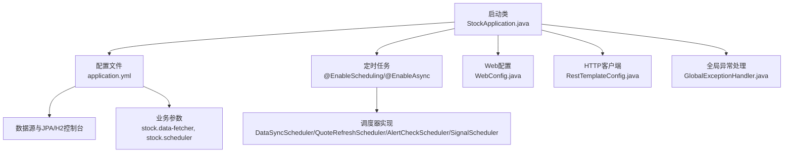
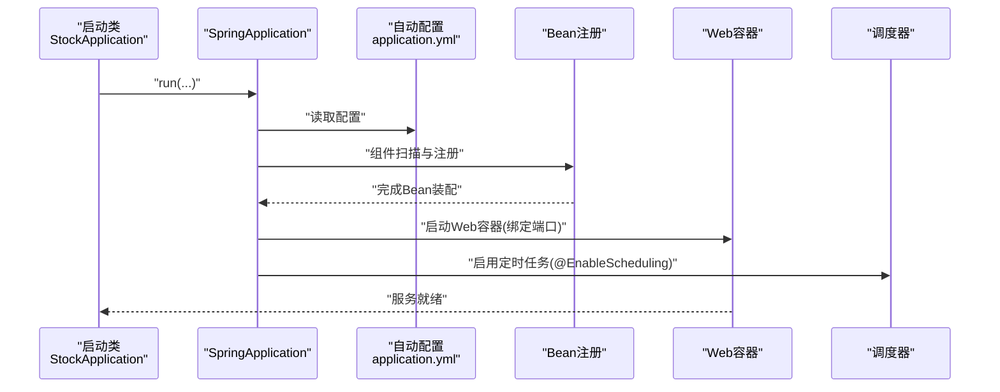
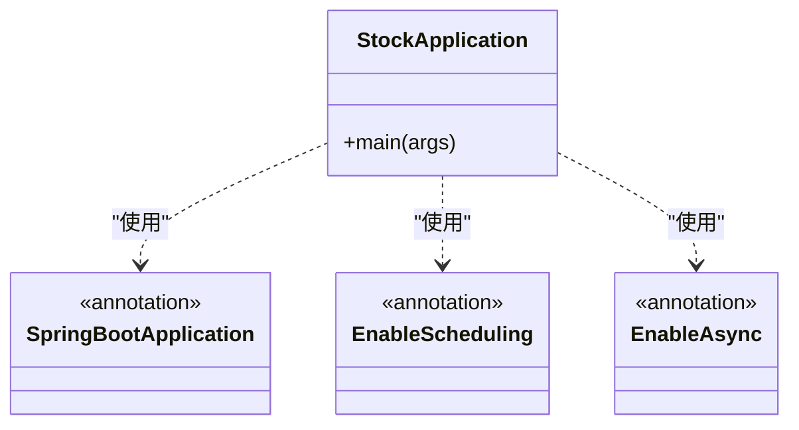
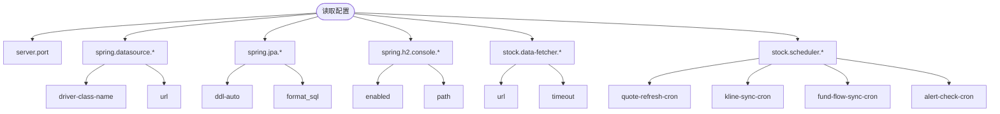
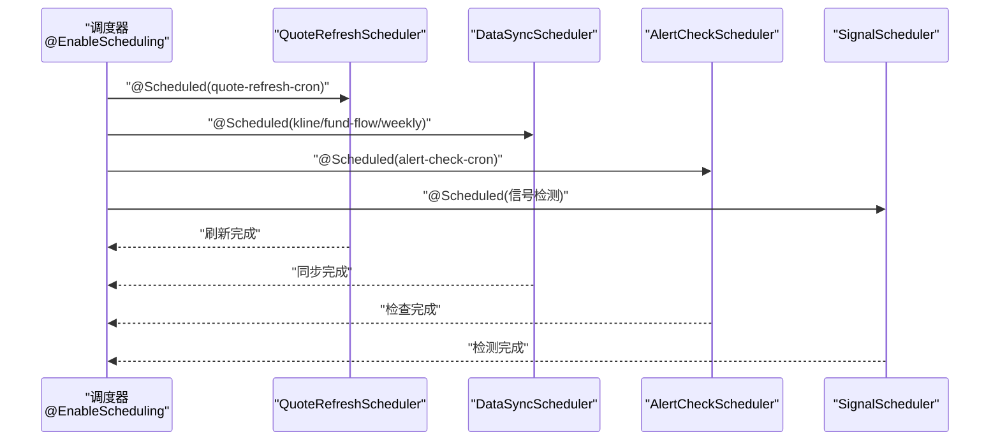
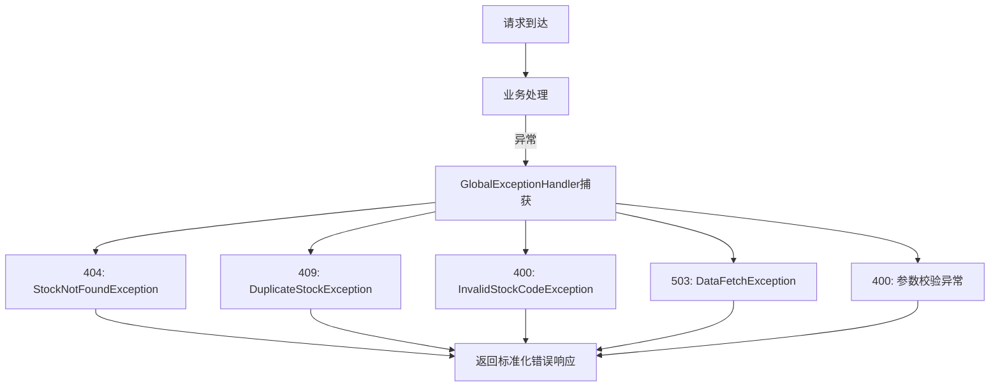
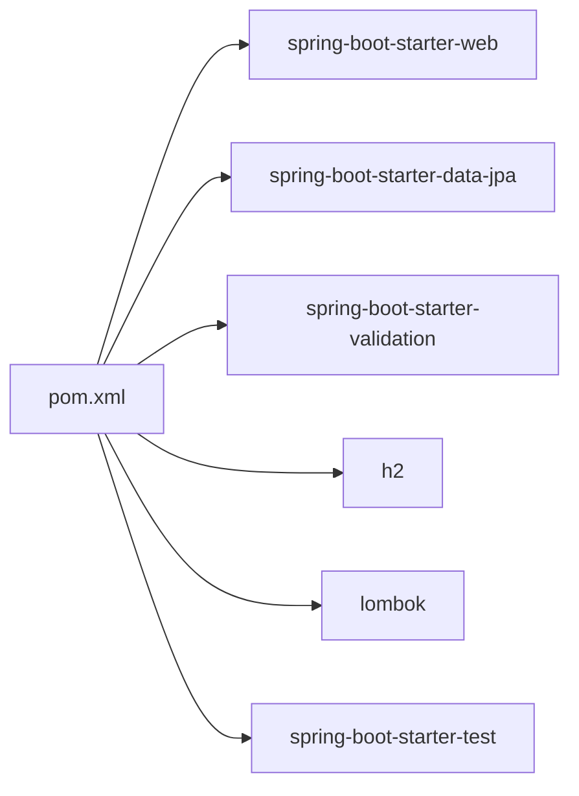

# Spring Boot应用配置

<cite>
**本文引用的文件**
- [StockApplication.java](file://backend/src/main/java/com/stock/StockApplication.java)
- [application.yml](file://backend/src/main/resources/application.yml)
- [pom.xml](file://backend/pom.xml)
- [DataSyncScheduler.java](file://backend/src/main/java/com/stock/scheduler/DataSyncScheduler.java)
- [QuoteRefreshScheduler.java](file://backend/src/main/java/com/stock/scheduler/QuoteRefreshScheduler.java)
- [AlertCheckScheduler.java](file://backend/src/main/java/com/stock/scheduler/AlertCheckScheduler.java)
- [SignalScheduler.java](file://backend/src/main/java/com/stock/scheduler/SignalScheduler.java)
- [RestTemplateConfig.java](file://backend/src/main/java/com/stock/config/RestTemplateConfig.java)
- [WebConfig.java](file://backend/src/main/java/com/stock/config/WebConfig.java)
- [GlobalExceptionHandler.java](file://backend/src/main/java/com/stock/exception/GlobalExceptionHandler.java)
- [application.yml（测试）](file://backend/src/test/resources/application.yml)
</cite>

## 目录
1. [简介](#简介)
2. [项目结构](#项目结构)
3. [核心组件](#核心组件)
4. [架构总览](#架构总览)
5. [详细组件分析](#详细组件分析)
6. [依赖关系分析](#依赖关系分析)
7. [性能考虑](#性能考虑)
8. [故障排查指南](#故障排查指南)
9. [结论](#结论)
10. [附录](#附录)

## 简介
本文件系统性梳理了Spring Boot应用在该仓库中的配置与运行机制，重点覆盖：
- @SpringBootApplication注解的作用与配置项
- @EnableScheduling与@EnableAsync的启用机制
- application.yml中数据库连接、服务器端口、日志与业务配置
- 应用启动流程、Bean注册机制与自动配置原理
- 最佳实践与常见配置场景

## 项目结构
后端采用标准Spring Boot目录结构，关键位置如下：
- 启动类位于 backend/src/main/java/com/stock/StockApplication.java
- 配置文件位于 backend/src/main/resources/application.yml
- 定时任务调度器位于 backend/src/main/java/com/stock/scheduler/
- Web与HTTP客户端配置位于 backend/src/main/java/com/stock/config/
- 全局异常处理位于 backend/src/main/java/com/stock/exception/



图表来源
- [StockApplication.java:1-16](file://backend/src/main/java/com/stock/StockApplication.java#L1-L16)
- [application.yml:1-28](file://backend/src/main/resources/application.yml#L1-L28)
- [DataSyncScheduler.java:1-238](file://backend/src/main/java/com/stock/scheduler/DataSyncScheduler.java#L1-L238)
- [QuoteRefreshScheduler.java:1-35](file://backend/src/main/java/com/stock/scheduler/QuoteRefreshScheduler.java#L1-L35)
- [AlertCheckScheduler.java:1-37](file://backend/src/main/java/com/stock/scheduler/AlertCheckScheduler.java#L1-L37)
- [SignalScheduler.java:1-125](file://backend/src/main/java/com/stock/scheduler/SignalScheduler.java#L1-L125)
- [WebConfig.java:1-14](file://backend/src/main/java/com/stock/config/WebConfig.java#L1-L14)
- [RestTemplateConfig.java:1-17](file://backend/src/main/java/com/stock/config/RestTemplateConfig.java#L1-L17)
- [GlobalExceptionHandler.java:1-33](file://backend/src/main/java/com/stock/exception/GlobalExceptionHandler.java#L1-L33)

章节来源
- [StockApplication.java:1-16](file://backend/src/main/java/com/stock/StockApplication.java#L1-L16)
- [application.yml:1-28](file://backend/src/main/resources/application.yml#L1-L28)

## 核心组件
- 启动类与注解
  - @SpringBootApplication：组合注解，启用自动配置、组件扫描与条件化配置，是应用入口。
  - @EnableScheduling：开启基于注解的定时任务支持。
  - @EnableAsync：开启基于注解的异步方法执行支持。
- 配置文件
  - server.port：服务监听端口。
  - spring.datasource与spring.jpa：数据源与JPA/Hibernate行为。
  - spring.h2.console：H2控制台开关与访问路径。
  - stock.data-fetcher：外部数据拉取服务地址与超时。
  - stock.scheduler：各定时任务的Cron表达式。
- 调度器
  - 数据同步、行情刷新、信号检测、告警检查等定时任务均通过@Scheduled驱动。
- Web与HTTP
  - WebConfig：CORS跨域配置。
  - RestTemplateConfig：HTTP客户端超时配置。
- 全局异常处理
  - GlobalExceptionHandler：统一异常响应格式。

章节来源
- [StockApplication.java:8-10](file://backend/src/main/java/com/stock/StockApplication.java#L8-L10)
- [application.yml:1-28](file://backend/src/main/resources/application.yml#L1-L28)
- [WebConfig.java:1-14](file://backend/src/main/java/com/stock/config/WebConfig.java#L1-L14)
- [RestTemplateConfig.java:1-17](file://backend/src/main/java/com/stock/config/RestTemplateConfig.java#L1-L17)
- [GlobalExceptionHandler.java:1-33](file://backend/src/main/java/com/stock/exception/GlobalExceptionHandler.java#L1-L33)

## 架构总览
Spring Boot启动流程与Bean注册机制（简化）：
- 启动类加载并触发SpringApplication.run
- 自动装配：根据依赖与条件注解加载对应自动配置
- 组件扫描：发现并注册@Component、@Configuration、@EnableScheduling等
- Bean生命周期：初始化、装配、暴露为可注入实例
- Web容器启动：绑定server.port，注册MVC组件与拦截器
- 定时任务线程池：基于@EnableScheduling启用调度器



图表来源
- [StockApplication.java:12-14](file://backend/src/main/java/com/stock/StockApplication.java#L12-L14)
- [application.yml:1-28](file://backend/src/main/resources/application.yml#L1-L28)

## 详细组件分析

### 启动类与注解解析
- @SpringBootApplication
  - 作用：启用自动配置、组件扫描与条件化配置，通常用于应用主类。
  - 影响：使Spring Boot能够自动发现并注册配置类、调度器、Web组件等。
- @EnableScheduling
  - 作用：开启基于@Scheduled的定时任务功能。
  - 行为：注册TaskScheduler与@Scheduled方法的扫描与调度。
- @EnableAsync
  - 作用：开启基于@Async的异步方法执行。
  - 行为：注册TaskExecutor与@Async方法的异步调度。



图表来源
- [StockApplication.java:8-10](file://backend/src/main/java/com/stock/StockApplication.java#L8-L10)

章节来源
- [StockApplication.java:8-10](file://backend/src/main/java/com/stock/StockApplication.java#L8-L10)

### application.yml配置详解
- 服务器端口
  - server.port：应用监听端口，默认8080。
- 数据库与JPA
  - spring.datasource.url：数据源URL；开发环境使用H2文件数据库。
  - spring.datasource.driver-class-name：H2驱动。
  - spring.jpa.hibernate.ddl-auto：Hibernate DDL策略，此处为update。
  - spring.jpa.properties.hibernate.format_sql：格式化SQL输出。
- H2控制台
  - spring.h2.console.enabled：H2控制台开关。
  - spring.h2.console.path：H2控制台访问路径。
- 业务配置
  - stock.data-fetcher.url：外部数据拉取服务地址。
  - stock.data-fetcher.timeout：HTTP请求超时时间。
  - stock.scheduler.quote-refresh-cron：行情刷新Cron。
  - stock.scheduler.kline-sync-cron：K线同步Cron。
  - stock.scheduler.fund-flow-sync-cron：资金流同步Cron。
  - stock.scheduler.alert-check-cron：告警检查Cron。



图表来源
- [application.yml:1-28](file://backend/src/main/resources/application.yml#L1-L28)

章节来源
- [application.yml:1-28](file://backend/src/main/resources/application.yml#L1-L28)

### 定时任务与调度器
- @EnableScheduling已启用，调度器通过@Component注册并使用@Scheduled驱动。
- 典型调度器：
  - DataSyncScheduler：周期性同步K线、资金流、估值与研究、周报等数据，并计算技术指标。
  - QuoteRefreshScheduler：按Cron刷新所有股票报价。
  - AlertCheckScheduler：按Cron检查未触发的价提醒。
  - SignalScheduler：按规则检测买卖信号并去重保存。



图表来源
- [QuoteRefreshScheduler.java:24](file://backend/src/main/java/com/stock/scheduler/QuoteRefreshScheduler.java#L24)
- [DataSyncScheduler.java:54](file://backend/src/main/java/com/stock/scheduler/DataSyncScheduler.java#L54)
- [AlertCheckScheduler.java:26](file://backend/src/main/java/com/stock/scheduler/AlertCheckScheduler.java#L26)
- [SignalScheduler.java:39](file://backend/src/main/java/com/stock/scheduler/SignalScheduler.java#L39)

章节来源
- [DataSyncScheduler.java:1-238](file://backend/src/main/java/com/stock/scheduler/DataSyncScheduler.java#L1-L238)
- [QuoteRefreshScheduler.java:1-35](file://backend/src/main/java/com/stock/scheduler/QuoteRefreshScheduler.java#L1-L35)
- [AlertCheckScheduler.java:1-37](file://backend/src/main/java/com/stock/scheduler/AlertCheckScheduler.java#L1-L37)
- [SignalScheduler.java:1-125](file://backend/src/main/java/com/stock/scheduler/SignalScheduler.java#L1-L125)

### Web与HTTP客户端配置
- WebConfig：为/api/v1/**开放CORS，允许本地前端访问。
- RestTemplateConfig：设置连接与读取超时，便于外部数据拉取。

```mermaid
classDiagram
class WebConfig {
+addCorsMappings(registry)
}
class RestTemplateConfig {
+restTemplate(builder)
}
class RestTemplate {
+getForObject(url, responseType)
+postForObject(url, request, responseType)
}
WebConfig --> "CORS配置" : "注册"
RestTemplateConfig --> RestTemplate : "创建Bean"
```

图表来源
- [WebConfig.java:1-14](file://backend/src/main/java/com/stock/config/WebConfig.java#L1-L14)
- [RestTemplateConfig.java:1-17](file://backend/src/main/java/com/stock/config/RestTemplateConfig.java#L1-L17)

章节来源
- [WebConfig.java:1-14](file://backend/src/main/java/com/stock/config/WebConfig.java#L1-L14)
- [RestTemplateConfig.java:1-17](file://backend/src/main/java/com/stock/config/RestTemplateConfig.java#L1-L17)

### 全局异常处理
- GlobalExceptionHandler：集中处理业务异常与参数校验异常，返回标准化错误响应。



图表来源
- [GlobalExceptionHandler.java:1-33](file://backend/src/main/java/com/stock/exception/GlobalExceptionHandler.java#L1-L33)

章节来源
- [GlobalExceptionHandler.java:1-33](file://backend/src/main/java/com/stock/exception/GlobalExceptionHandler.java#L1-L33)

## 依赖关系分析
- Maven依赖要点
  - spring-boot-starter-web：Web层依赖
  - spring-boot-starter-data-jpa：JPA与数据库访问
  - spring-boot-starter-validation：参数校验
  - h2：内存/文件数据库
  - lombok：简化实体与配置类
  - 测试starter：单元测试支持



图表来源
- [pom.xml:23-56](file://backend/pom.xml#L23-L56)

章节来源
- [pom.xml:1-103](file://backend/pom.xml#L1-L103)

## 性能考虑
- 定时任务并发与频率
  - 建议为不同任务设置独立线程池或合理间隔，避免相互阻塞。
  - 对外部数据拉取增加重试与熔断策略，降低失败影响。
- 数据库与事务
  - 使用批量写入减少事务开销；对高频查询建立索引。
  - 控制DDL策略在生产环境改为更保守模式。
- HTTP客户端
  - 设置合理的连接与读取超时，避免长时间阻塞。
  - 对外部接口增加限流与降级逻辑。

## 故障排查指南
- 启动失败
  - 检查server.port是否被占用；确认JPA/H2配置正确。
- 定时任务不执行
  - 确认@Scheduled表达式有效且时区一致；检查@EnableScheduling是否生效。
- 数据同步异常
  - 查看调度器日志，定位具体异常点；核对stock.data-fetcher.url与网络连通性。
- 前端跨域问题
  - 确认WebConfig中CORS配置与前端域名一致。

章节来源
- [application.yml:1-28](file://backend/src/main/resources/application.yml#L1-L28)
- [application.yml（测试）:1-27](file://backend/src/test/resources/application.yml#L1-L27)
- [DataSyncScheduler.java:54-82](file://backend/src/main/java/com/stock/scheduler/DataSyncScheduler.java#L54-L82)
- [QuoteRefreshScheduler.java:24-33](file://backend/src/main/java/com/stock/scheduler/QuoteRefreshScheduler.java#L24-L33)
- [WebConfig.java:8-13](file://backend/src/main/java/com/stock/config/WebConfig.java#L8-L13)

## 结论
本项目通过简洁的配置与清晰的模块划分，实现了从Web接入、数据同步到定时任务与异常处理的完整闭环。建议在生产环境中进一步完善线程池隔离、外部依赖熔断、数据库DDL策略与日志分级，以提升稳定性与可观测性。

## 附录
- 开发与测试配置差异
  - 测试环境使用内存数据库与更短的DDL策略，便于快速回滚与隔离。
  - 测试环境禁用H2控制台，避免不必要的暴露。

章节来源
- [application.yml（测试）:1-27](file://backend/src/test/resources/application.yml#L1-L27)