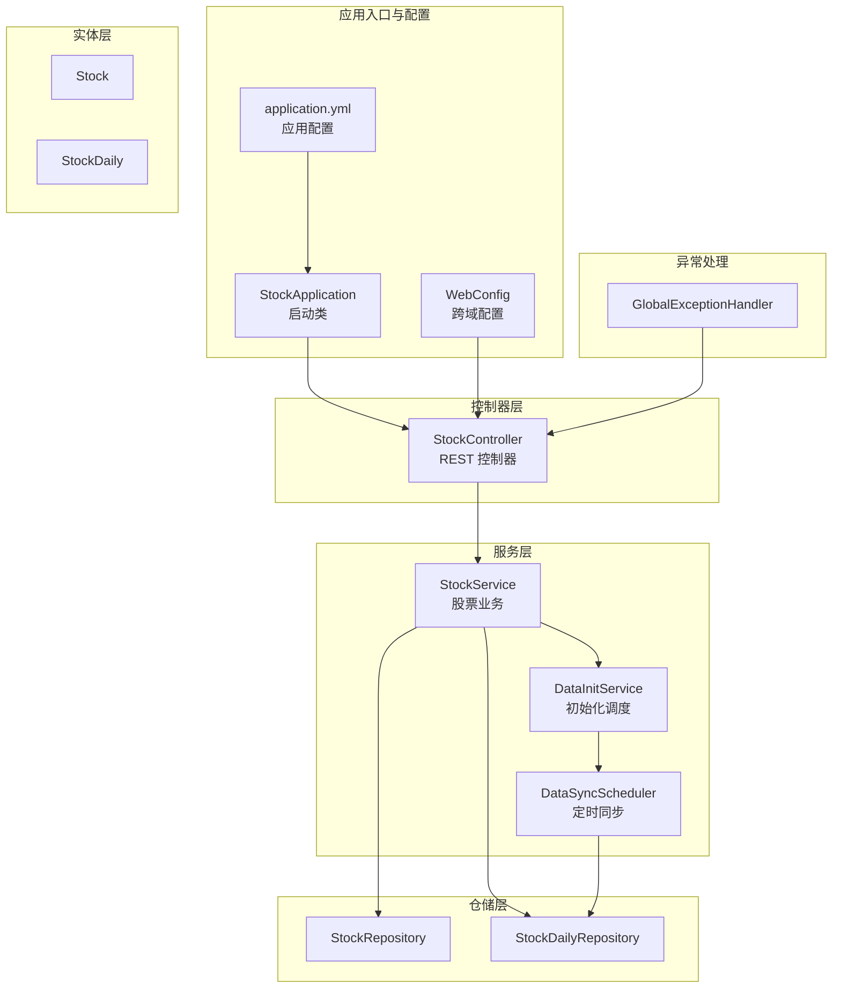
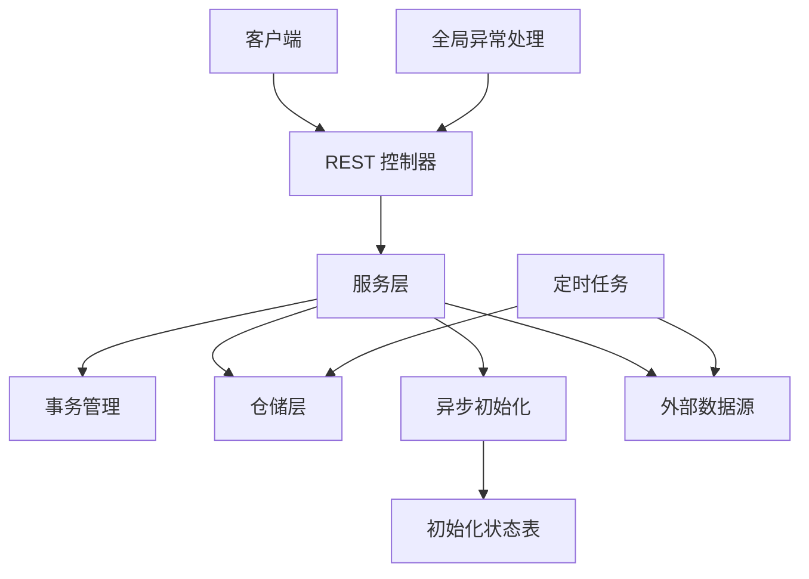
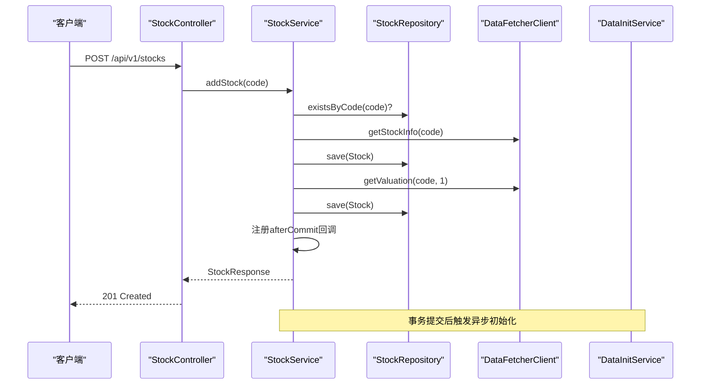
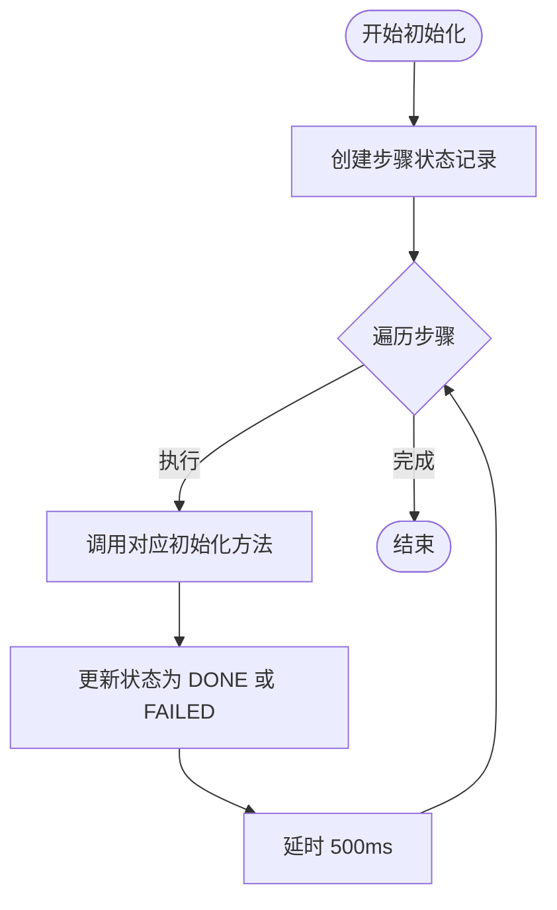
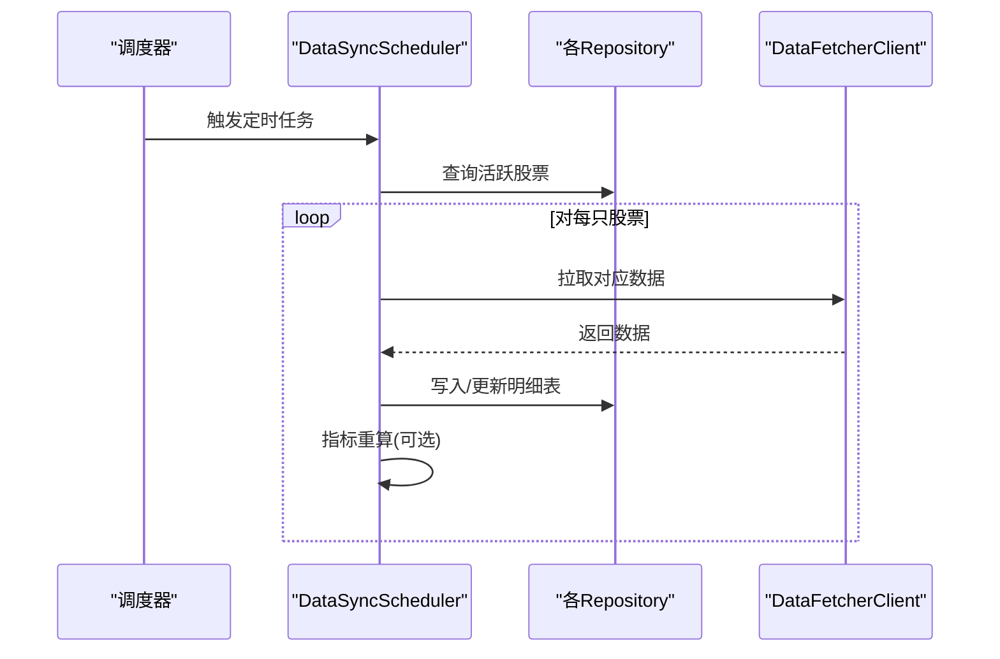
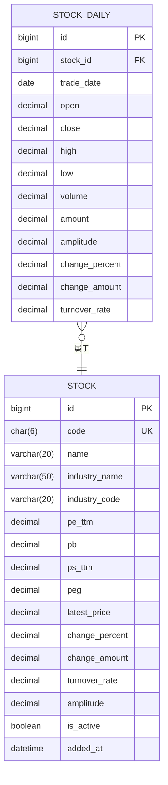
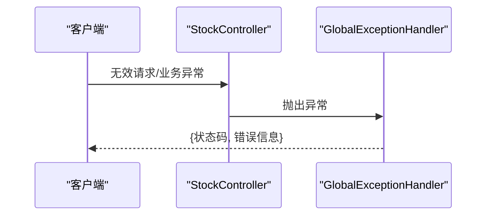
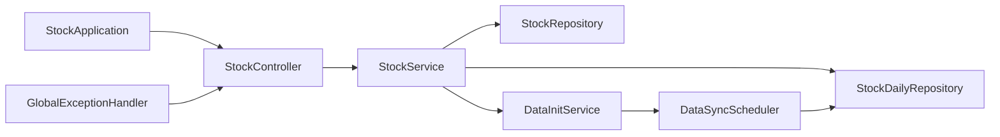

# 后端服务详解

<cite>
**本文引用的文件**
- [StockApplication.java](file://backend/src/main/java/com/stock/StockApplication.java)
- [WebConfig.java](file://backend/src/main/java/com/stock/config/WebConfig.java)
- [application.yml](file://backend/src/main/resources/application.yml)
- [StockController.java](file://backend/src/main/java/com/stock/controller/StockController.java)
- [AddStockRequest.java](file://backend/src/main/java/com/stock/dto/request/AddStockRequest.java)
- [StockResponse.java](file://backend/src/main/java/com/stock/dto/response/StockResponse.java)
- [InitStatusResponse.java](file://backend/src/main/java/com/stock/dto/response/InitStatusResponse.java)
- [StockService.java](file://backend/src/main/java/com/stock/service/StockService.java)
- [DataInitService.java](file://backend/src/main/java/com/stock/service/DataInitService.java)
- [DataSyncScheduler.java](file://backend/src/main/java/com/stock/scheduler/DataSyncScheduler.java)
- [StockRepository.java](file://backend/src/main/java/com/stock/repository/StockRepository.java)
- [StockDailyRepository.java](file://backend/src/main/java/com/stock/repository/StockDailyRepository.java)
- [Stock.java](file://backend/src/main/java/com/stock/entity/Stock.java)
- [StockDaily.java](file://backend/src/main/java/com/stock/entity/StockDaily.java)
- [GlobalExceptionHandler.java](file://backend/src/main/java/com/stock/exception/GlobalExceptionHandler.java)
- [pom.xml](file://backend/pom.xml)
</cite>

## 目录
1. [简介](#简介)
2. [项目结构](#项目结构)
3. [核心组件](#核心组件)
4. [架构总览](#架构总览)
5. [详细组件分析](#详细组件分析)
6. [依赖关系分析](#依赖关系分析)
7. [性能考量](#性能考量)
8. [故障排查指南](#故障排查指南)
9. [结论](#结论)
10. [附录：API 接口文档](#附录api-接口文档)

## 简介
本项目为一个基于 Spring Boot 的股票数据与分析系统后端服务，采用分层架构（控制器层、服务层、仓储层）与 JPA/Hibernate 进行数据持久化，结合 Spring Scheduler 实现定时同步任务，并通过统一异常处理机制提供一致的错误响应。系统支持股票基础信息管理、初始化状态查询、多维度财务与行情数据的定时同步与指标计算。

## 项目结构
后端模块位于 backend 目录，主要由以下层次构成：
- 应用入口与配置：启动类、Web 跨域配置、应用配置
- 控制器层：REST API 入口，负责请求接收与响应封装
- DTO 层：请求与响应的数据传输对象
- 服务层：业务逻辑封装、事务控制、异步初始化调度
- 仓储层：基于 Spring Data JPA 的 Repository 接口
- 实体层：JPA 实体映射
- 定时任务：基于 Cron 表达式的周期性数据同步与指标重算
- 异常处理：全局异常处理器

**图表来源**
- [StockApplication.java:1-16](file://backend/src/main/java/com/stock/StockApplication.java#L1-L16)
- [WebConfig.java:1-15](file://backend/src/main/java/com/stock/config/WebConfig.java#L1-L15)
- [application.yml:1-28](file://backend/src/main/resources/application.yml#L1-L28)
- [StockController.java:1-57](file://backend/src/main/java/com/stock/controller/StockController.java#L1-L57)
- [StockService.java:1-243](file://backend/src/main/java/com/stock/service/StockService.java#L1-L243)
- [DataInitService.java:1-101](file://backend/src/main/java/com/stock/service/DataInitService.java#L1-L101)
- [DataSyncScheduler.java:1-238](file://backend/src/main/java/com/stock/scheduler/DataSyncScheduler.java#L1-L238)
- [StockRepository.java:1-18](file://backend/src/main/java/com/stock/repository/StockRepository.java#L1-L18)
- [StockDailyRepository.java:1-24](file://backend/src/main/java/com/stock/repository/StockDailyRepository.java#L1-L24)
- [Stock.java:1-86](file://backend/src/main/java/com/stock/entity/Stock.java#L1-L86)
- [StockDaily.java:1-60](file://backend/src/main/java/com/stock/entity/StockDaily.java#L1-L60)
- [GlobalExceptionHandler.java:1-33](file://backend/src/main/java/com/stock/exception/GlobalExceptionHandler.java#L1-L33)

**章节来源**
- [StockApplication.java:1-16](file://backend/src/main/java/com/stock/StockApplication.java#L1-L16)
- [WebConfig.java:1-15](file://backend/src/main/java/com/stock/config/WebConfig.java#L1-L15)
- [application.yml:1-28](file://backend/src/main/resources/application.yml#L1-L28)

## 核心组件
- 启动类与调度：启用调度与异步，作为应用入口
- 跨域配置：开放 /api/v1/** 的 GET/POST/PUT/DELETE 请求
- 数据源与 JPA：H2 文件数据库，自动更新 DDL
- 控制器：提供股票增删查列表、初始化状态查询等接口
- 服务层：封装业务规则、事务边界、异步初始化触发
- 仓储层：基于 JPA 的 CRUD 与自定义查询
- 定时任务：按工作日与周期同步 K 线、资金流、财务与研究等数据，并重算指标
- 全局异常处理：对常见业务异常与参数校验异常进行统一响应

**章节来源**
- [StockApplication.java:1-16](file://backend/src/main/java/com/stock/StockApplication.java#L1-L16)
- [WebConfig.java:1-15](file://backend/src/main/java/com/stock/config/WebConfig.java#L1-L15)
- [application.yml:1-28](file://backend/src/main/resources/application.yml#L1-L28)
- [StockController.java:1-57](file://backend/src/main/java/com/stock/controller/StockController.java#L1-L57)
- [StockService.java:1-243](file://backend/src/main/java/com/stock/service/StockService.java#L1-L243)
- [DataInitService.java:1-101](file://backend/src/main/java/com/stock/service/DataInitService.java#L1-L101)
- [DataSyncScheduler.java:1-238](file://backend/src/main/java/com/stock/scheduler/DataSyncScheduler.java#L1-L238)
- [StockRepository.java:1-18](file://backend/src/main/java/com/stock/repository/StockRepository.java#L1-L18)
- [StockDailyRepository.java:1-24](file://backend/src/main/java/com/stock/repository/StockDailyRepository.java#L1-L24)
- [GlobalExceptionHandler.java:1-33](file://backend/src/main/java/com/stock/exception/GlobalExceptionHandler.java#L1-L33)

## 架构总览
系统采用经典的三层架构与分层解耦：
- 控制器层：接收 HTTP 请求，调用服务层，返回标准响应或无内容
- 服务层：聚合多个仓储操作，保证业务一致性；在事务内执行；通过事务提交后的回调触发异步初始化
- 仓储层：面向实体的持久化抽象，提供常用查询与自定义查询
- 定时任务：独立于请求线程，批量拉取外部数据并写入数据库
- 异常处理：集中捕获业务异常与参数校验异常，返回统一的错误响应结构

**图表来源**
- [StockController.java:1-57](file://backend/src/main/java/com/stock/controller/StockController.java#L1-L57)
- [StockService.java:1-243](file://backend/src/main/java/com/stock/service/StockService.java#L1-L243)
- [DataInitService.java:1-101](file://backend/src/main/java/com/stock/service/DataInitService.java#L1-L101)
- [DataSyncScheduler.java:1-238](file://backend/src/main/java/com/stock/scheduler/DataSyncScheduler.java#L1-L238)
- [GlobalExceptionHandler.java:1-33](file://backend/src/main/java/com/stock/exception/GlobalExceptionHandler.java#L1-L33)

## 详细组件分析

### 控制器层：StockController
职责与实现要点：
- 统一前缀 /api/v1/stocks
- 提供新增、删除、列表、详情、初始化状态查询接口
- 使用 ResponseEntity 返回标准状态码与响应体
- 参数校验通过 @Valid 与 DTO 配合完成

接口清单（见“附录：API 接口文档”）

**章节来源**
- [StockController.java:1-57](file://backend/src/main/java/com/stock/controller/StockController.java#L1-L57)
- [AddStockRequest.java:1-10](file://backend/src/main/java/com/stock/dto/request/AddStockRequest.java#L1-L10)
- [StockResponse.java:1-25](file://backend/src/main/java/com/stock/dto/response/StockResponse.java#L1-L25)
- [InitStatusResponse.java:1-12](file://backend/src/main/java/com/stock/dto/response/InitStatus.java#L1-L12)

### 服务层：StockService
职责与实现要点：
- 事务边界：新增与删除均在 @Transactional 中执行
- 新增流程：校验代码格式 → 检查重复 → 外部获取股票信息 → 保存 Stock → 可选估值回填 → 注册事务提交后回调触发异步初始化
- 删除流程：级联删除多张明细表数据 → 删除竞争与行业分析记录 → 删除主表记录
- 查询流程：列表聚合完整性评分；详情返回完整字段集

**图表来源**
- [StockController.java:29-34](file://backend/src/main/java/com/stock/controller/StockController.java#L29-L34)
- [StockService.java:93-163](file://backend/src/main/java/com/stock/service/StockService.java#L93-L163)
- [StockRepository.java:10-18](file://backend/src/main/java/com/stock/repository/StockRepository.java#L10-L18)

**章节来源**
- [StockService.java:1-243](file://backend/src/main/java/com/stock/service/StockService.java#L1-L243)

### 初始化服务：DataInitService
职责与实现要点：
- 异步初始化：在 StockService 事务提交后触发
- 步骤编排：估值、K 线、资金流、利润表、资产负债表、股东、研报、指标
- 状态跟踪：每步维护 InitStatus 记录，支持查询进度

**图表来源**
- [DataInitService.java:42-71](file://backend/src/main/java/com/stock/service/DataInitService.java#L42-L71)

**章节来源**
- [DataInitService.java:1-101](file://backend/src/main/java/com/stock/service/DataInitService.java#L1-L101)

### 定时同步：DataSyncScheduler
职责与实现要点：
- 工作日定时同步：K 线、资金流、日度估值与研报、周频财务与股东数据
- 指标重算：按周对近一年日线数据重新计算技术指标
- 事务注解：每个同步方法在事务中执行，确保写入一致性

**图表来源**
- [DataSyncScheduler.java:54-161](file://backend/src/main/java/com/stock/scheduler/DataSyncScheduler.java#L54-L161)

**章节来源**
- [DataSyncScheduler.java:1-238](file://backend/src/main/java/com/stock/scheduler/DataSyncScheduler.java#L1-L238)

### 仓储层与实体映射
- StockRepository：提供按代码查询、存在性检查、激活状态筛选
- StockDailyRepository：提供区间查询、最新交易日查询、最大交易日查询、按股票删除
- Stock 实体：包含市值、PE/PB/PS/PEG、涨跌幅、成交量、换手率等字段
- StockDaily 实体：日线行情，含唯一约束 stock_id+trade_date

**图表来源**
- [Stock.java:1-86](file://backend/src/main/java/com/stock/entity/Stock.java#L1-L86)
- [StockDaily.java:1-60](file://backend/src/main/java/com/stock/entity/StockDaily.java#L1-L60)
- [StockRepository.java:10-18](file://backend/src/main/java/com/stock/repository/StockRepository.java#L10-L18)
- [StockDailyRepository.java:13-23](file://backend/src/main/java/com/stock/repository/StockDailyRepository.java#L13-L23)

**章节来源**
- [StockRepository.java:1-18](file://backend/src/main/java/com/stock/repository/StockRepository.java#L1-L18)
- [StockDailyRepository.java:1-24](file://backend/src/main/java/com/stock/repository/StockDailyRepository.java#L1-L24)
- [Stock.java:1-86](file://backend/src/main/java/com/stock/entity/Stock.java#L1-L86)
- [StockDaily.java:1-60](file://backend/src/main/java/com/stock/entity/StockDaily.java#L1-L60)

### 异常处理机制
- 全局异常处理器集中处理：股票不存在、重复股票、无效代码、数据抓取失败、参数校验失败
- 统一错误响应结构：包含状态码与消息
- 参数校验异常会将字段名与默认消息拼接为可读字符串

**图表来源**
- [GlobalExceptionHandler.java:9-31](file://backend/src/main/java/com/stock/exception/GlobalExceptionHandler.java#L9-L31)

**章节来源**
- [GlobalExceptionHandler.java:1-33](file://backend/src/main/java/com/stock/exception/GlobalExceptionHandler.java#L1-L33)

## 依赖关系分析
- 启动类启用调度与异步，使定时任务与异步初始化可用
- 控制器依赖服务层；服务层依赖多个仓储与外部客户端
- 定时任务依赖仓储与外部客户端，定期刷新数据
- 全局异常处理器对控制器层进行横切增强

**图表来源**
- [StockApplication.java:8-10](file://backend/src/main/java/com/stock/StockApplication.java#L8-L10)
- [StockController.java:1-57](file://backend/src/main/java/com/stock/controller/StockController.java#L1-L57)
- [StockService.java:1-243](file://backend/src/main/java/com/stock/service/StockService.java#L1-L243)
- [DataInitService.java:1-101](file://backend/src/main/java/com/stock/service/DataInitService.java#L1-L101)
- [DataSyncScheduler.java:1-238](file://backend/src/main/java/com/stock/scheduler/DataSyncScheduler.java#L1-L238)
- [GlobalExceptionHandler.java:1-33](file://backend/src/main/java/com/stock/exception/GlobalExceptionHandler.java#L1-L33)

**章节来源**
- [pom.xml:23-55](file://backend/pom.xml#L23-L55)

## 性能考量
- 事务边界：新增与删除在事务内执行，避免中间态；异步初始化在事务提交后触发，确保可见性
- 批量写入：定时任务对日线、资金流等数据采用批量保存
- 延时策略：初始化与定时任务间歇性 sleep，降低外部接口压力
- 查询优化：仓储提供按日期范围与最新记录查询，减少不必要的全表扫描
- 缓存与索引：建议对高频查询字段建立索引（如 stock_id+trade_date），并根据实际访问模式评估缓存策略

[本节为通用性能建议，不直接分析具体文件]

## 故障排查指南
- 新增失败（400/409/404）：检查请求体中的代码格式、是否重复、外部数据源是否可达
- 删除失败（404）：确认股票 ID 是否存在
- 初始化卡住：查看初始化状态表中各步骤状态，定位失败步骤
- 定时任务未执行：确认调度 Cron 配置与服务器时区设置
- 跨域问题：确认前端地址与允许方法配置

**章节来源**
- [GlobalExceptionHandler.java:1-33](file://backend/src/main/java/com/stock/exception/GlobalExceptionHandler.java#L1-L33)
- [DataInitService.java:73-84](file://backend/src/main/java/com/stock/service/DataInitService.java#L73-L84)
- [application.yml:23-28](file://backend/src/main/resources/application.yml#L23-L28)

## 结论
该后端服务以清晰的分层架构与 JPA/Hibernate 实现了股票数据的增删查与多维数据的定时同步，配合统一异常处理与跨域配置，提供了稳定可靠的 REST API。通过事务与异步初始化的组合，既保证了业务一致性，又提升了用户体验。后续可在查询性能、缓存策略与监控告警方面进一步优化。

[本节为总结性内容，不直接分析具体文件]

## 附录：API 接口文档

- 基础路径
  - 前缀：/api/v1/stocks
  - 跨域：允许来源 http://localhost:5173，允许方法 GET/POST/PUT/DELETE

- 新增股票
  - 方法：POST
  - 路径：/api/v1/stocks
  - 请求体：AddStockRequest（6 位纯数字）
  - 成功响应：201 Created，Body：StockResponse
  - 失败响应：400（无效代码）、409（重复代码）、503（数据抓取失败）

- 删除股票
  - 方法：DELETE
  - 路径：/api/v1/stocks/{id}
  - 路径参数：id（Long）
  - 成功响应：204 No Content
  - 失败响应：404（股票不存在）

- 列出股票
  - 方法：GET
  - 路径：/api/v1/stocks
  - 成功响应：200 OK，Body：StockListItemResponse 数组
  - 备注：包含完整性评分字段

- 获取股票详情
  - 方法：GET
  - 路径：/api/v1/stocks/{id}
  - 路径参数：id（Long）
  - 成功响应：200 OK，Body：StockResponse
  - 失败响应：404（股票不存在）

- 获取初始化状态
  - 方法：GET
  - 路径：/api/v1/stocks/{id}/init-status
  - 路径参数：id（Long）
  - 成功响应：200 OK，Body：InitStatusResponse
  - 字段说明：包含步骤列表、已完成数量、总数

- 统一错误响应
  - 结构：{ 状态码, 错误信息 }
  - 示例场景：参数校验失败（400）、股票不存在（404）、重复添加（409）、外部数据不可用（503）

**章节来源**
- [WebConfig.java:8-13](file://backend/src/main/java/com/stock/config/WebConfig.java#L8-L13)
- [StockController.java:29-55](file://backend/src/main/java/com/stock/controller/StockController.java#L29-L55)
- [AddStockRequest.java:1-10](file://backend/src/main/java/com/stock/dto/request/AddStockRequest.java#L1-L10)
- [StockResponse.java:1-25](file://backend/src/main/java/com/stock/dto/response/StockResponse.java#L1-L25)
- [InitStatusResponse.java:1-12](file://backend/src/main/java/com/stock/dto/response/InitStatusResponse.java#L1-L12)
- [GlobalExceptionHandler.java:9-31](file://backend/src/main/java/com/stock/exception/GlobalExceptionHandler.java#L9-L31)