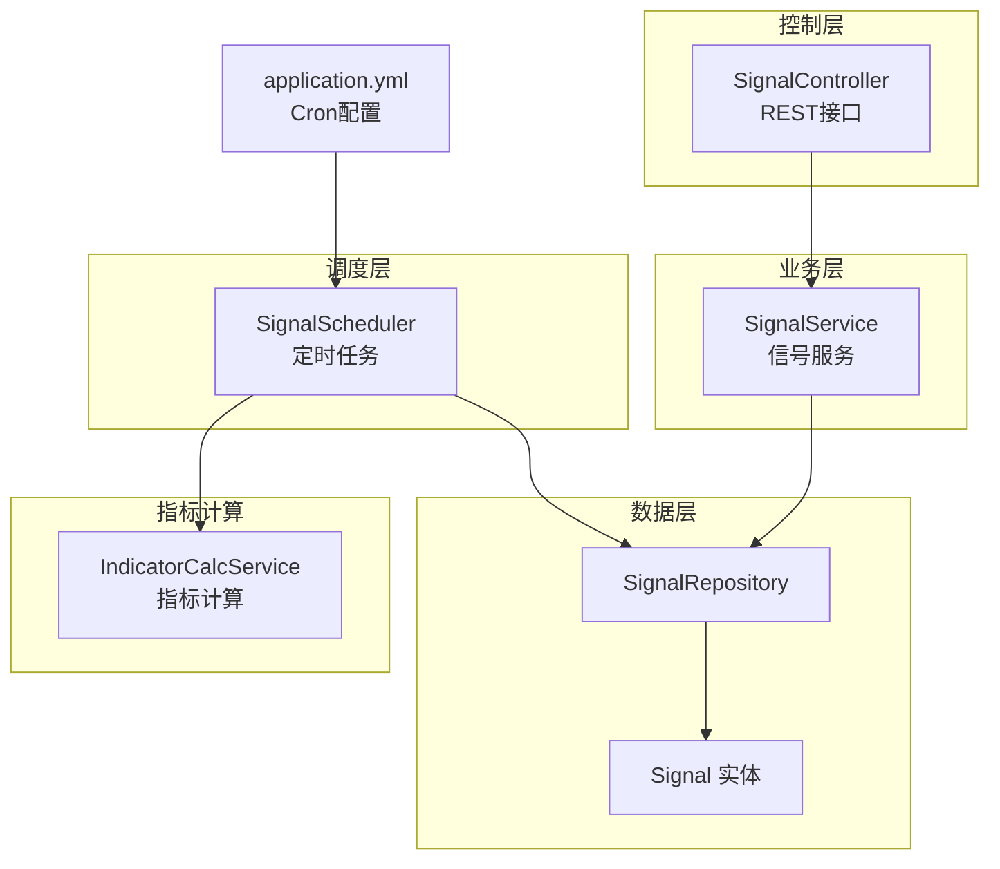
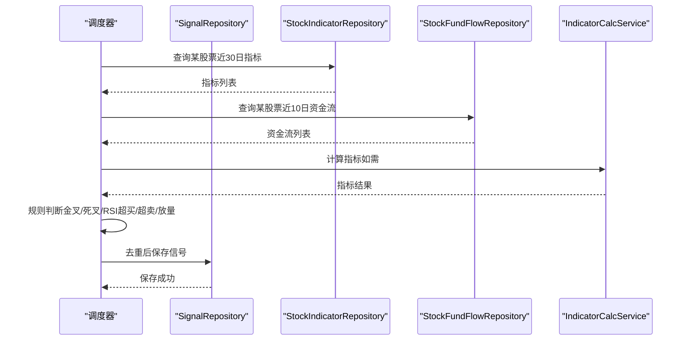
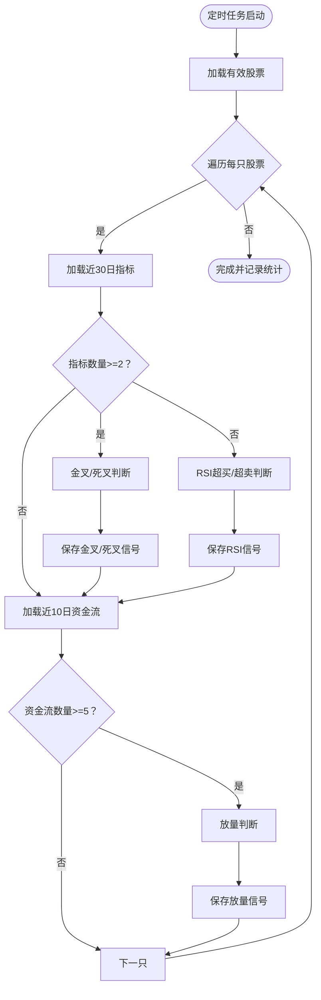
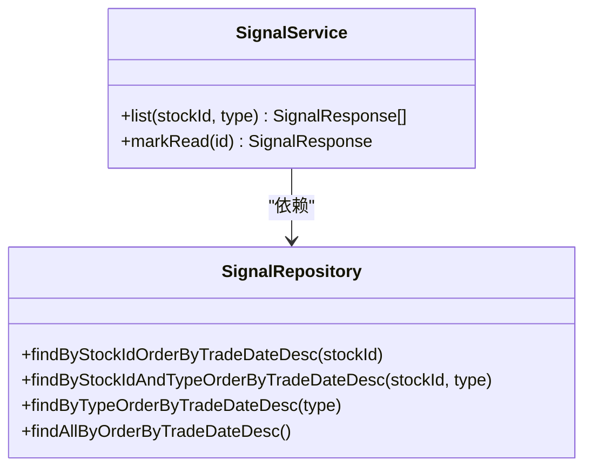
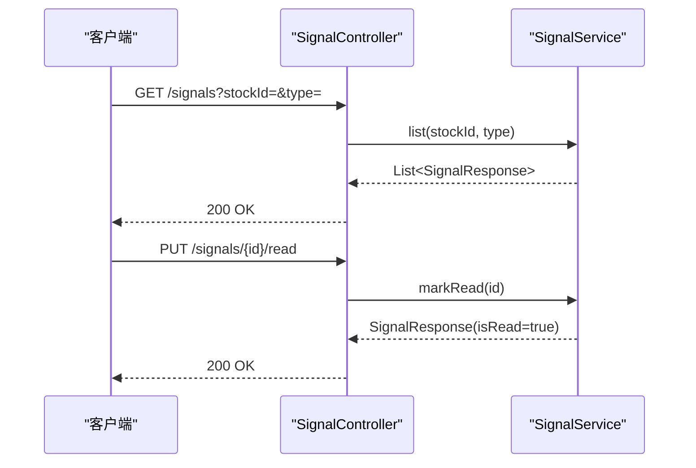
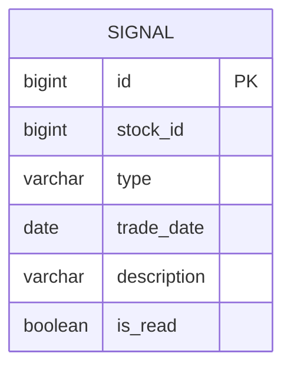
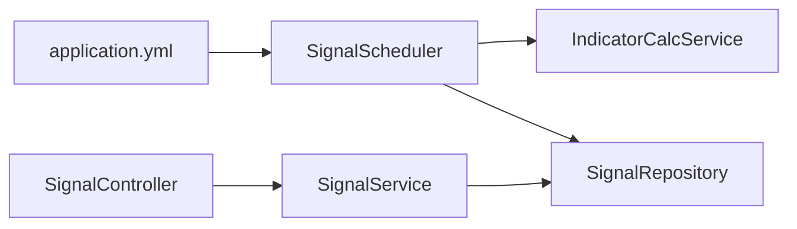

# 信号生成调度器

<cite>
**本文引用的文件**
- [SignalScheduler.java](file://backend/src/main/java/com/stock/scheduler/SignalScheduler.java)
- [SignalService.java](file://backend/src/main/java/com/stock/service/SignalService.java)
- [SignalController.java](file://backend/src/main/java/com/stock/controller/SignalController.java)
- [Signal.java](file://backend/src/main/java/com/stock/entity/Signal.java)
- [SignalRepository.java](file://backend/src/main/java/com/stock/repository/SignalRepository.java)
- [IndicatorCalcService.java](file://backend/src/main/java/com/stock/service/IndicatorCalcService.java)
- [application.yml](file://backend/src/main/resources/application.yml)
- [SignalControllerTest.java](file://backend/src/test/java/com/stock/controller/SignalControllerTest.java)
- [IndicatorCalcServiceTest.java](file://backend/src/test/java/com/stock/service/IndicatorCalcServiceTest.java)
</cite>

## 目录
1. [引言](#引言)
2. [项目结构](#项目结构)
3. [核心组件](#核心组件)
4. [架构总览](#架构总览)
5. [详细组件分析](#详细组件分析)
6. [依赖分析](#依赖分析)
7. [性能考虑](#性能考虑)
8. [故障排查指南](#故障排查指南)
9. [结论](#结论)
10. [附录](#附录)

## 引言
本文件面向“信号生成调度器”的技术实现，聚焦于技术信号的定时计算机制、指标计算触发条件、信号生成规则、时间窗口配置，以及与指标计算服务的协作关系。文档还涵盖信号数据的存储策略、历史信号的维护机制、计算准确性保证、计算资源优化与并发控制策略，并给出配置参数、质量评估指标、异常处理机制、验证方法与性能监控方案。

## 项目结构
围绕信号生成调度器的相关模块主要分布在以下层次：
- 调度层：SignalScheduler（基于Spring Scheduled定时任务）
- 业务层：SignalService（信号列表与标记已读）
- 控制层：SignalController（REST接口）
- 数据模型与仓储：Signal实体与SignalRepository
- 指标计算：IndicatorCalcService（技术指标批量计算）
- 配置：application.yml（定时任务Cron表达式）

图表来源
- [SignalScheduler.java:39-108](file://backend/src/main/java/com/stock/scheduler/SignalScheduler.java#L39-L108)
- [SignalService.java:21-43](file://backend/src/main/java/com/stock/service/SignalService.java#L21-L43)
- [SignalController.java:19-28](file://backend/src/main/java/com/stock/controller/SignalController.java#L19-L28)
- [Signal.java:15-35](file://backend/src/main/java/com/stock/entity/Signal.java#L15-L35)
- [SignalRepository.java:9-20](file://backend/src/main/java/com/stock/repository/SignalRepository.java#L9-L20)
- [IndicatorCalcService.java:15-64](file://backend/src/main/java/com/stock/service/IndicatorCalcService.java#L15-L64)
- [application.yml:23-27](file://backend/src/main/resources/application.yml#L23-L27)

章节来源
- [SignalScheduler.java:1-125](file://backend/src/main/java/com/stock/scheduler/SignalScheduler.java#L1-L125)
- [SignalService.java:1-51](file://backend/src/main/java/com/stock/service/SignalService.java#L1-L51)
- [SignalController.java:1-30](file://backend/src/main/java/com/stock/controller/SignalController.java#L1-L30)
- [Signal.java:1-36](file://backend/src/main/java/com/stock/entity/Signal.java#L1-L36)
- [SignalRepository.java:1-21](file://backend/src/main/java/com/stock/repository/SignalRepository.java#L1-L21)
- [IndicatorCalcService.java:1-210](file://backend/src/main/java/com/stock/service/IndicatorCalcService.java#L1-L210)
- [application.yml:1-28](file://backend/src/main/resources/application.yml#L1-L28)

## 核心组件
- SignalScheduler：负责在工作日固定时间扫描所有有效股票，基于最近交易日的指标与资金流数据生成信号，并去重保存。
- SignalService：提供信号查询与标记已读能力，支持按股票或类型过滤。
- SignalController：对外暴露REST接口，供前端或外部系统调用。
- Signal实体与仓储：定义信号字段、索引与查询方法，支撑信号的持久化与检索。
- IndicatorCalcService：批量计算多周期均线、MACD、RSI、KDJ、布林带等指标，为调度器提供输入数据。

章节来源
- [SignalScheduler.java:24-123](file://backend/src/main/java/com/stock/scheduler/SignalScheduler.java#L24-L123)
- [SignalService.java:15-49](file://backend/src/main/java/com/stock/service/SignalService.java#L15-L49)
- [SignalController.java:13-28](file://backend/src/main/java/com/stock/controller/SignalController.java#L13-L28)
- [Signal.java:15-35](file://backend/src/main/java/com/stock/entity/Signal.java#L15-L35)
- [SignalRepository.java:9-20](file://backend/src/main/java/com/stock/repository/SignalRepository.java#L9-L20)
- [IndicatorCalcService.java:15-64](file://backend/src/main/java/com/stock/service/IndicatorCalcService.java#L15-L64)

## 架构总览
信号生成调度器采用“定时任务驱动 + 指标计算 + 信号落库”的分层架构。调度器在每日15:50（工作日）执行，遍历有效股票，拉取近N日指标与资金流，依据预设规则生成信号并去重入库；业务层提供查询与标记接口；控制层通过REST暴露能力；配置文件集中管理Cron表达式。

图表来源
- [SignalScheduler.java:41-108](file://backend/src/main/java/com/stock/scheduler/SignalScheduler.java#L41-L108)
- [IndicatorCalcService.java:15-64](file://backend/src/main/java/com/stock/service/IndicatorCalcService.java#L15-L64)

## 详细组件分析

### SignalScheduler：定时信号检测与生成
- 定时策略：工作日15:50执行一次，避免与行情刷新冲突。
- 输入数据：
  - 指标：按股票ID查询最近30个交易日的多周期均线与RSI。
  - 资金流：按股票ID查询最近10个交易日的主力净流入/出。
- 触发条件与规则：
  - 金叉/死叉：MA5由下至上/下至上穿越MA20。
  - RSI超买/超卖：RSI>70或RSI<30。
  - 放量：当日主力净额绝对值超过近N日均值的阈值倍数。
- 去重策略：同一股票、同类型、同交易日仅保留一条记录。
- 并发与事务：使用@Transactional包裹整个扫描过程，确保一致性；单线程逐只股票处理，避免并发竞争。
- 错误处理：捕获单只股票处理异常并记录告警日志，不影响整体调度。

图表来源
- [SignalScheduler.java:41-108](file://backend/src/main/java/com/stock/scheduler/SignalScheduler.java#L41-L108)

章节来源
- [SignalScheduler.java:39-123](file://backend/src/main/java/com/stock/scheduler/SignalScheduler.java#L39-L123)

### SignalService：信号查询与标记
- 列表查询：支持按股票ID、信号类型或全量查询，按交易日倒序返回。
- 标记已读：根据ID查找信号并更新状态，抛出未找到异常时进行错误处理。

图表来源
- [SignalService.java:21-43](file://backend/src/main/java/com/stock/service/SignalService.java#L21-L43)
- [SignalRepository.java:11-17](file://backend/src/main/java/com/stock/repository/SignalRepository.java#L11-L17)

章节来源
- [SignalService.java:13-49](file://backend/src/main/java/com/stock/service/SignalService.java#L13-L49)

### SignalController：REST接口
- GET /api/v1/signals：支持按股票ID或类型过滤。
- PUT /api/v1/signals/{id}/read：标记信号为已读。

图表来源
- [SignalController.java:19-28](file://backend/src/main/java/com/stock/controller/SignalController.java#L19-L28)
- [SignalService.java:21-43](file://backend/src/main/java/com/stock/service/SignalService.java#L21-L43)

章节来源
- [SignalController.java:9-29](file://backend/src/main/java/com/stock/controller/SignalController.java#L9-L29)

### Signal实体与仓储：数据模型与查询
- 字段：股票ID、信号类型、交易日、描述、是否已读。
- 索引与查询：提供按股票ID、类型、全量的倒序查询，便于快速检索与展示。
- 删除：支持按股票ID删除信号，用于历史清理或重算场景。

图表来源
- [Signal.java:15-35](file://backend/src/main/java/com/stock/entity/Signal.java#L15-L35)
- [SignalRepository.java:11-19](file://backend/src/main/java/com/stock/repository/SignalRepository.java#L11-L19)

章节来源
- [Signal.java:10-35](file://backend/src/main/java/com/stock/entity/Signal.java#L10-L35)
- [SignalRepository.java:9-20](file://backend/src/main/java/com/stock/repository/SignalRepository.java#L9-L20)

### 与IndicatorCalcService的协作
- 调度器直接从数据库读取已计算好的指标，避免重复计算；若需要实时计算，可调用IndicatorCalcService进行批量指标计算。
- 指标覆盖：MA5/10/20/60、MACD、RSI、KDJ、布林带，满足常见技术分析需求。
- 时间窗口：调度器默认使用最近30日指标与10日资金流，确保信号具备足够的统计基础。

章节来源
- [SignalScheduler.java:48-84](file://backend/src/main/java/com/stock/scheduler/SignalScheduler.java#L48-L84)
- [IndicatorCalcService.java:15-64](file://backend/src/main/java/com/stock/service/IndicatorCalcService.java#L15-L64)

## 依赖分析
- 耦合关系：SignalScheduler依赖仓库与IndicatorCalcService；SignalService依赖SignalRepository；SignalController依赖SignalService。
- 外部依赖：Spring Scheduled、JPA/Hibernate、H2数据库（开发环境）。
- 配置依赖：application.yml中的Cron表达式决定调度频率。

图表来源
- [SignalScheduler.java:24-37](file://backend/src/main/java/com/stock/scheduler/SignalScheduler.java#L24-L37)
- [SignalService.java:15-19](file://backend/src/main/java/com/stock/service/SignalService.java#L15-L19)
- [SignalController.java:13-17](file://backend/src/main/java/com/stock/controller/SignalController.java#L13-L17)
- [application.yml:23-27](file://backend/src/main/resources/application.yml#L23-L27)

章节来源
- [SignalScheduler.java:24-37](file://backend/src/main/java/com/stock/scheduler/SignalScheduler.java#L24-L37)
- [SignalService.java:15-19](file://backend/src/main/java/com/stock/service/SignalService.java#L15-L19)
- [SignalController.java:13-17](file://backend/src/main/java/com/stock/controller/SignalController.java#L13-L17)
- [application.yml:23-27](file://backend/src/main/resources/application.yml#L23-L27)

## 性能考虑
- 计算资源优化
  - 批量查询：对每只股票一次性拉取所需时间窗口内的指标与资金流，减少多次往返。
  - 单线程扫描：逐只股票顺序处理，避免锁竞争与事务冲突。
  - 去重入库：先查后存，避免重复写入。
- 并发控制策略
  - 使用@Transactional包裹整个扫描流程，保证原子性。
  - Spring Scheduled默认单实例执行，避免多节点重复计算。
- 时间窗口与数据规模
  - 默认30日指标+10日资金流，兼顾信号时效性与稳定性。
  - 若数据量增长，建议分批处理或引入分页游标以降低内存压力。
- 存储与索引
  - 建议在stock_id、type、trade_date上建立复合索引，加速查询与去重判断。
- 监控与告警
  - 记录每次调度的处理数量与耗时，异常时输出告警日志。

[本节为通用性能建议，不直接分析具体文件]

## 故障排查指南
- 常见问题
  - 信号未生成：检查定时任务是否启用、工作日是否正确、股票是否激活、指标数据是否充足。
  - 重复信号：确认去重逻辑是否生效，数据库中是否存在相同股票/类型/日期的记录。
  - 接口异常：核对SignalController与SignalService的参数绑定与异常处理。
- 日志与监控
  - 关注调度器日志中的开始/结束与异常信息。
  - 在application.yml中开启SQL格式化与H2控制台，便于调试。
- 测试验证
  - 使用SignalControllerTest验证接口行为。
  - 使用IndicatorCalcServiceTest验证指标计算的边界条件与正确性。

章节来源
- [SignalControllerTest.java:40-60](file://backend/src/test/java/com/stock/controller/SignalControllerTest.java#L40-L60)
- [IndicatorCalcServiceTest.java:41-81](file://backend/src/test/java/com/stock/service/IndicatorCalcServiceTest.java#L41-L81)
- [application.yml:8-17](file://backend/src/main/resources/application.yml#L8-L17)

## 结论
信号生成调度器通过明确的时间窗口、严格的去重策略与清晰的规则集，实现了稳定的技术信号生成。结合IndicatorCalcService提供的标准化指标，系统能够在保证准确性的同时，兼顾性能与可维护性。建议后续引入更细粒度的监控与索引优化，以支撑更大规模的数据与更高的吞吐需求。

[本节为总结性内容，不直接分析具体文件]

## 附录

### 配置参数
- 定时任务Cron
  - 信号检测：application.yml中配置工作日15:50执行。
  - 行情刷新、K线同步、资金流同步、预警检查等其他任务的Cron也集中在此文件。
- 数据源与JPA
  - H2数据库与SQL格式化配置，便于本地开发与调试。

章节来源
- [application.yml:23-27](file://backend/src/main/resources/application.yml#L23-L27)
- [application.yml:4-17](file://backend/src/main/resources/application.yml#L4-L17)

### 信号生成规则清单
- 金叉：MA5由下至上穿越MA20
- 死叉：MA5由上至下穿越MA20
- RSI超买：RSI高于阈值
- RSI超卖：RSI低于阈值
- 放量：主力净流入/出显著放大

章节来源
- [SignalScheduler.java:55-102](file://backend/src/main/java/com/stock/scheduler/SignalScheduler.java#L55-L102)

### 数据模型与查询方法
- Signal实体字段与默认值
- SignalRepository提供的查询方法：按股票、按类型、全量倒序

章节来源
- [Signal.java:15-35](file://backend/src/main/java/com/stock/entity/Signal.java#L15-L35)
- [SignalRepository.java:11-19](file://backend/src/main/java/com/stock/repository/SignalRepository.java#L11-L19)

### 验证方法与质量评估
- 单元测试
  - 指标计算：验证空数据返回空结果、MA窗口边界、BOLL可用性等。
  - 控制器：验证接口返回结构与状态码。
- 集成测试
  - 模拟调度器扫描流程，校验信号生成与去重逻辑。
- 质量评估指标
  - 信号覆盖率（生成信号数/有效股票数）
  - 重复率（重复信号数/生成信号总数）
  - 准确性（回测胜率、盈亏比，需结合回测模块）

章节来源
- [IndicatorCalcServiceTest.java:41-81](file://backend/src/test/java/com/stock/service/IndicatorCalcServiceTest.java#L41-L81)
- [SignalControllerTest.java:40-60](file://backend/src/test/java/com/stock/controller/SignalControllerTest.java#L40-L60)