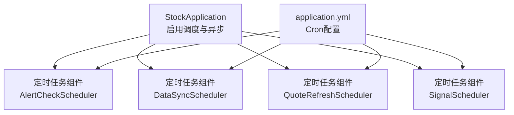
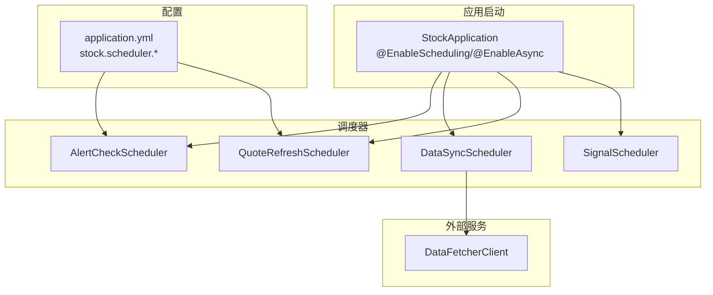

# 定时任务系统

<cite>
**本文引用的文件**
- [StockApplication.java](file://backend/src/main/java/com/stock/StockApplication.java)
- [application.yml](file://backend/src/main/resources/application.yml)
- [AlertCheckScheduler.java](file://backend/src/main/java/com/stock/scheduler/AlertCheckScheduler.java)
- [DataSyncScheduler.java](file://backend/src/main/java/com/stock/scheduler/DataSyncScheduler.java)
- [QuoteRefreshScheduler.java](file://backend/src/main/java/com/stock/scheduler/QuoteRefreshScheduler.java)
- [SignalScheduler.java](file://backend/src/main/java/com/stock/scheduler/SignalScheduler.java)
- [GlobalExceptionHandler.java](file://backend/src/main/java/com/stock/exception/GlobalExceptionHandler.java)
- [detailed-design.md](file://system-planner/detailed-design.md)
</cite>

## 目录
1. [简介](#简介)
2. [项目结构](#项目结构)
3. [核心组件](#核心组件)
4. [架构总览](#架构总览)
5. [详细组件分析](#详细组件分析)
6. [依赖分析](#依赖分析)
7. [性能考虑](#性能考虑)
8. [故障排除指南](#故障排除指南)
9. [结论](#结论)
10. [附录](#附录)

## 简介
本文件面向股票交易系统的定时任务子系统，系统性阐述@EnableScheduling注解的启用机制、@Scheduled注解的使用方式与Cron表达式规则，详解任务执行策略与并发控制现状，给出典型任务的调度配置示例与实现要点，并补充失败处理、重试策略、监控告警建议、性能优化与资源管理方案，以及测试与故障排除方法。

## 项目结构
定时任务相关代码位于后端模块的scheduler包中，配合全局配置文件进行统一调度配置。核心入口为应用启动类启用调度能力，各定时任务以@Component形式注册，使用@Scheduled注解声明执行计划。

图表来源
- [StockApplication.java:1-16](file://backend/src/main/java/com/stock/StockApplication.java#L1-L16)
- [application.yml:19-28](file://backend/src/main/resources/application.yml#L19-L28)

章节来源
- [StockApplication.java:1-16](file://backend/src/main/java/com/stock/StockApplication.java#L1-L16)
- [application.yml:19-28](file://backend/src/main/resources/application.yml#L19-L28)

## 核心组件
- 启动类启用机制
  - 应用启动类同时启用调度与异步能力，确保@Scheduled与异步任务可用。
- 定时任务组件
  - AlertCheckScheduler：周期性检查价格预警是否满足阈值条件。
  - DataSyncScheduler：多类型数据的增量/全量同步与技术指标重算。
  - QuoteRefreshScheduler：刷新股票实时行情。
  - SignalScheduler：基于技术指标与资金流检测买卖信号。
- 配置中心
  - application.yml集中定义各任务的Cron表达式，便于统一调整与运维。

章节来源
- [StockApplication.java:8-11](file://backend/src/main/java/com/stock/StockApplication.java#L8-L11)
- [AlertCheckScheduler.java:16-52](file://backend/src/main/java/com/stock/scheduler/AlertCheckScheduler.java#L16-L52)
- [DataSyncScheduler.java:19-238](file://backend/src/main/java/com/stock/scheduler/DataSyncScheduler.java#L19-L238)
- [QuoteRefreshScheduler.java:14-35](file://backend/src/main/java/com/stock/scheduler/QuoteRefreshScheduler.java#L14-L35)
- [SignalScheduler.java:22-125](file://backend/src/main/java/com/stock/scheduler/SignalScheduler.java#L22-L125)
- [application.yml:23-27](file://backend/src/main/resources/application.yml#L23-L27)

## 架构总览
定时任务系统采用Spring Scheduling提供的基于注解的调度框架，结合配置文件集中管理Cron表达式，形成“配置驱动”的任务编排模式。任务在各自的时间点被触发，执行业务逻辑并记录日志；异常通过全局异常处理器进行统一处理。

图表来源
- [StockApplication.java:8-11](file://backend/src/main/java/com/stock/StockApplication.java#L8-L11)
- [application.yml:23-27](file://backend/src/main/resources/application.yml#L23-L27)
- [AlertCheckScheduler.java:26](file://backend/src/main/java/com/stock/scheduler/AlertCheckScheduler.java#L26)
- [DataSyncScheduler.java:54](file://backend/src/main/java/com/stock/scheduler/DataSyncScheduler.java#L54)
- [QuoteRefreshScheduler.java:24](file://backend/src/main/java/com/stock/scheduler/QuoteRefreshScheduler.java#L24)
- [SignalScheduler.java:39](file://backend/src/main/java/com/stock/scheduler/SignalScheduler.java#L39)

## 详细组件分析

### 启用机制与注解使用
- @EnableScheduling
  - 在应用启动类上启用调度能力，使容器扫描并注册带有@Scheduled的任务。
- @Scheduled
  - 在任务方法上声明执行计划，支持Cron表达式或固定频率等模式。
- 并发控制现状
  - 当前各任务未显式声明并发控制参数，默认单线程串行执行；如需并发，请在@Scheduled中设置相应属性。

章节来源
- [StockApplication.java:8-11](file://backend/src/main/java/com/stock/StockApplication.java#L8-L11)
- [AlertCheckScheduler.java:26](file://backend/src/main/java/com/stock/scheduler/AlertCheckScheduler.java#L26)
- [DataSyncScheduler.java:54](file://backend/src/main/java/com/stock/scheduler/DataSyncScheduler.java#L54)
- [QuoteRefreshScheduler.java:24](file://backend/src/main/java/com/stock/scheduler/QuoteRefreshScheduler.java#L24)
- [SignalScheduler.java:39](file://backend/src/main/java/com/stock/scheduler/SignalScheduler.java#L39)

### Cron表达式规则与配置
- 通用格式
  - 秒 分 时 日 月 周 年（可选）
- 业务配置示例
  - 行情刷新：每工作日9:00起每隔5分钟一次
  - K线同步：工作日15:30执行
  - 资金流同步：工作日16:00执行
  - 预警检查：每工作日9:00起每分钟一次
- 可读性与维护性
  - 将Cron表达式集中于配置文件，便于运维调整与版本化管理。

章节来源
- [application.yml:23-27](file://backend/src/main/resources/application.yml#L23-L27)
- [detailed-design.md:1075-1114](file://system-planner/detailed-design.md#L1075-L1114)

### 任务执行策略
- AlertCheckScheduler
  - 事务性执行，遍历未触发的预警，按阈值比较决定是否触发并持久化。
- DataSyncScheduler
  - 多任务组合：K线、资金流、日度数据、周度数据、指标重算；对每个活跃股票执行增量/全量同步，并在异常时记录警告日志。
- QuoteRefreshScheduler
  - 刷新所有股票行情，记录更新与失败统计，异常时记录错误日志。
- SignalScheduler
  - 基于最近30天技术指标检测金叉/死叉与RSI超买超卖，基于最近10天主力资金流检测放量异动，避免重复写入信号。

章节来源
- [AlertCheckScheduler.java:27-50](file://backend/src/main/java/com/stock/scheduler/AlertCheckScheduler.java#L27-L50)
- [DataSyncScheduler.java:54-236](file://backend/src/main/java/com/stock/scheduler/DataSyncScheduler.java#L54-L236)
- [QuoteRefreshScheduler.java:24-33](file://backend/src/main/java/com/stock/scheduler/QuoteRefreshScheduler.java#L24-L33)
- [SignalScheduler.java:40-108](file://backend/src/main/java/com/stock/scheduler/SignalScheduler.java#L40-L108)

### 并发控制机制
- 现状
  - 各任务未显式声明并发控制参数，Spring默认单线程串行执行，避免了跨任务竞争与一致性问题。
- 建议
  - 若业务允许且资源充足，可在@Scheduled中开启并发控制参数以提升吞吐；否则保持串行更易维护。

章节来源
- [AlertCheckScheduler.java:27](file://backend/src/main/java/com/stock/scheduler/AlertCheckScheduler.java#L27)
- [DataSyncScheduler.java:54](file://backend/src/main/java/com/stock/scheduler/DataSyncScheduler.java#L54)
- [QuoteRefreshScheduler.java:24](file://backend/src/main/java/com/stock/scheduler/QuoteRefreshScheduler.java#L24)
- [SignalScheduler.java:40](file://backend/src/main/java/com/stock/scheduler/SignalScheduler.java#L40)

### 具体任务实现示例与配置
- 行情刷新
  - 方法：refreshQuotes
  - 触发：工作日9:00起每5分钟
  - 关键点：记录更新/失败计数，异常记录错误日志
- 数据同步
  - 方法：syncKline/syncFundFlow/syncDailyData/syncWeeklyData/recalcIndicators
  - 触发：工作日15:30/16:00/18:00/每周日2:00/工作日15:45
  - 关键点：逐股票增量同步，异常捕获并记录警告
- 预警检查
  - 方法：checkAlerts
  - 触发：工作日每分钟
  - 关键点：事务性处理，按阈值比较触发
- 信号检测
  - 方法：detectSignals
  - 触发：工作日15:50
  - 关键点：避免重复信号，写入信号表

章节来源
- [application.yml:24-27](file://backend/src/main/resources/application.yml#L24-L27)
- [QuoteRefreshScheduler.java:24-33](file://backend/src/main/java/com/stock/scheduler/QuoteRefreshScheduler.java#L24-L33)
- [DataSyncScheduler.java:54-236](file://backend/src/main/java/com/stock/scheduler/DataSyncScheduler.java#L54-L236)
- [AlertCheckScheduler.java:26-50](file://backend/src/main/java/com/stock/scheduler/AlertCheckScheduler.java#L26-L50)
- [SignalScheduler.java:39-108](file://backend/src/main/java/com/stock/scheduler/SignalScheduler.java#L39-L108)

### 任务执行失败处理与重试策略
- 失败处理现状
  - 各任务内部使用try/catch捕获异常，记录警告或错误日志，避免中断后续流程。
- 重试策略建议
  - 对幂等性任务（如增量同步）可引入指数退避重试或消息队列补偿。
  - 对非幂等任务应谨慎重试，优先采用补偿机制（如人工干预或补数据脚本）。
- 监控告警
  - 建议对接日志系统与告警平台，针对连续失败、执行时间异常延长等事件触发告警。

章节来源
- [DataSyncScheduler.java:78-81](file://backend/src/main/java/com/stock/scheduler/DataSyncScheduler.java#L78-L81)
- [DataSyncScheduler.java:113-116](file://backend/src/main/java/com/stock/scheduler/DataSyncScheduler.java#L113-L116)
- [DataSyncScheduler.java:157-160](file://backend/src/main/java/com/stock/scheduler/DataSyncScheduler.java#L157-L160)
- [DataSyncScheduler.java:210-213](file://backend/src/main/java/com/stock/scheduler/DataSyncScheduler.java#L210-L213)
- [QuoteRefreshScheduler.java:30-32](file://backend/src/main/java/com/stock/scheduler/QuoteRefreshScheduler.java#L30-L32)
- [AlertCheckScheduler.java:30-50](file://backend/src/main/java/com/stock/scheduler/AlertCheckScheduler.java#L30-L50)
- [SignalScheduler.java:103-105](file://backend/src/main/java/com/stock/scheduler/SignalScheduler.java#L103-L105)

### 性能优化与资源管理
- I/O与网络
  - 控制对外部接口的调用频率与并发，适当增加请求间隔（如已通过Thread.sleep实现），避免触发限流。
- 数据库
  - 使用批量插入与事务边界控制，减少往返次数；对高频任务采用分页/分批处理。
- 日志与可观测性
  - 仅在必要时输出详细日志，避免影响性能；为关键路径埋点，记录耗时与吞吐。
- 并发与线程池
  - 当前为单线程串行；若需提升吞吐，可自定义TaskScheduler与线程池，但需评估一致性与锁竞争。

章节来源
- [DataSyncScheduler.java:77-77](file://backend/src/main/java/com/stock/scheduler/DataSyncScheduler.java#L77-L77)
- [DataSyncScheduler.java:112-112](file://backend/src/main/java/com/stock/scheduler/DataSyncScheduler.java#L112-L112)
- [DataSyncScheduler.java:156-156](file://backend/src/main/java/com/stock/scheduler/DataSyncScheduler.java#L156-L156)
- [DataSyncScheduler.java:209-209](file://backend/src/main/java/com/stock/scheduler/DataSyncScheduler.java#L209-L209)

### 测试方法与故障排除
- 单元测试
  - 建议对任务中的核心业务逻辑（如信号判定、阈值比较）进行单元测试，模拟输入数据验证输出。
- 集成测试
  - 在测试环境启动完整应用，验证Cron配置与任务执行顺序；使用Mock外部服务返回稳定数据。
- 故障排除
  - 检查配置文件中的Cron是否正确解析；查看任务日志定位异常点；确认数据库连接与事务边界。
- 全局异常处理
  - 虽为Web层异常处理，但可借鉴其思路在任务中统一包装与记录异常信息。

章节来源
- [GlobalExceptionHandler.java:7-32](file://backend/src/main/java/com/stock/exception/GlobalExceptionHandler.java#L7-L32)

## 依赖分析
定时任务组件之间无直接耦合，均通过Spring容器注入所需服务与仓库，遵循单一职责原则。外部依赖主要为数据获取客户端与数据库访问层。

```mermaid
graph TB
ACS["AlertCheckScheduler"] --> AR["PriceAlertRepository"]
ACS --> SR["StockRepository"]
DSS["DataSyncScheduler"] --> SCR["StockRepository"]
DSS --> SDR["StockDailyRepository"]
DSS --> SFR["StockFundFlowRepository"]
DSS --> SIR["StockIncomeRepository"]
DSS --> SFrR["StockFinancialRepository"]
DSS --> SHR["StockHolderRepository"]
DSS --> SSR["StockResearchRepository"]
DSS --> SIR2["StockIndicatorRepository"]
DSS --> DF["DataFetcherClient"]
DSS --> ICS["IndicatorCalcService"]
QRS["QuoteRefreshScheduler"] --> QS["QuoteService"]
QRS --> SR
SGS["SignalScheduler"] --> SR
SGS --> SIR2
SGS --> SFR
SGS --> SigR["SignalRepository"]
```

图表来源
- [AlertCheckScheduler.java:18-24](file://backend/src/main/java/com/stock/scheduler/AlertCheckScheduler.java#L18-L24)
- [DataSyncScheduler.java:21-52](file://backend/src/main/java/com/stock/scheduler/DataSyncScheduler.java#L21-L52)
- [QuoteRefreshScheduler.java:16-22](file://backend/src/main/java/com/stock/scheduler/QuoteRefreshScheduler.java#L16-L22)
- [SignalScheduler.java:24-37](file://backend/src/main/java/com/stock/scheduler/SignalScheduler.java#L24-L37)

## 性能考虑
- 批处理与分片
  - 对大量股票的任务采用分批处理，避免一次性加载过多数据导致内存压力。
- 缓存与去重
  - 对重复计算结果进行缓存；对已存在的信号/记录进行去重判断，减少写入开销。
- 调度粒度与资源配比
  - 根据服务器资源与外部接口限制合理设置Cron，避免高峰期资源争抢。
- 监控与告警
  - 建立执行耗时、失败率、吞吐量等指标，及时发现性能瓶颈。

## 故障排除指南
- 任务未执行
  - 确认应用已启用调度；检查Cron表达式是否正确；核对系统时间与时区。
- 任务执行异常
  - 查看任务日志中的异常堆栈；对网络/数据库异常进行重试或补偿。
- 数据不一致
  - 检查事务边界与保存顺序；对关键写入操作增加幂等校验。
- 外部接口限流
  - 降低调用频率或增加延迟；对批量请求进行分页处理。

## 结论
本定时任务系统通过@EnableScheduling与@Scheduled注解实现配置驱动的调度，结合application.yml集中管理Cron表达式，具备良好的可维护性。当前为单线程串行执行，保证了简单与稳定；在业务增长与资源允许的情况下，可引入并发控制与补偿机制，进一步提升吞吐与可靠性。

## 附录

### Cron表达式速查
- 位置：秒 分 时 日 月 周 年
- 示例含义
  - "0 */5 9-11,13-15 * * MON-FRI"：工作日9:00起每5分钟一次
  - "0 30 15 * * MON-FRI"：工作日15:30
  - "0 0 16 * * MON-FRI"：工作日16:00
  - "0 0 18 * * MON-FRI"：工作日18:00
  - "0 0 2 ? * SUN"：每周日2:00
  - "0 45 15 * * MON-FRI"：工作日15:45
  - "0 */1 9-11,13-15 * * MON-FRI"：工作日每分钟

章节来源
- [application.yml:23-27](file://backend/src/main/resources/application.yml#L23-L27)