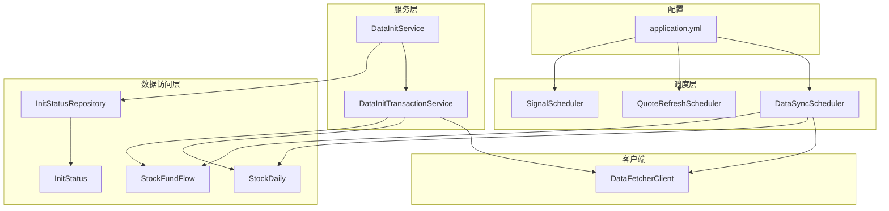
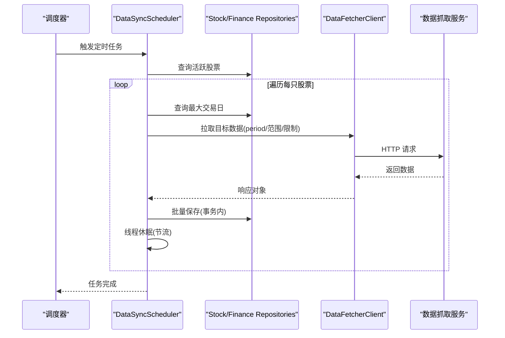
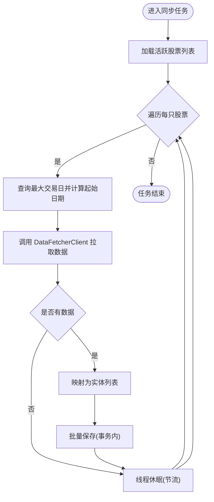
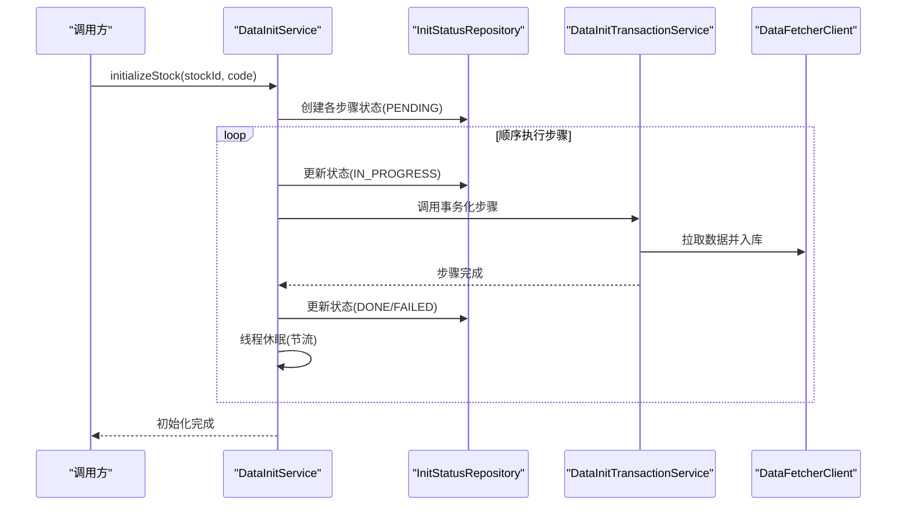
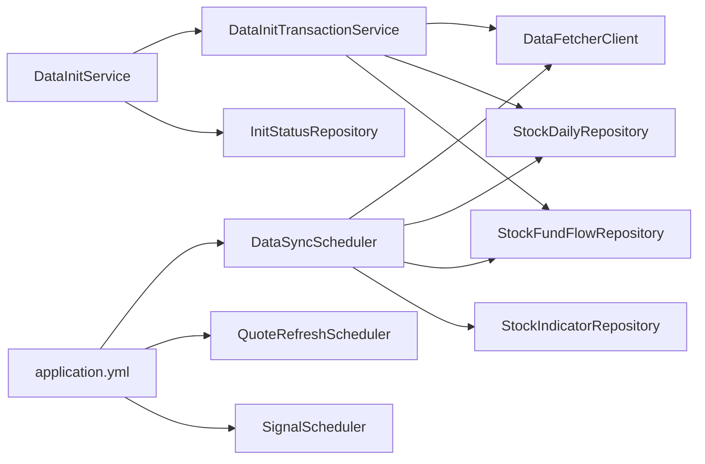

# 数据同步调度器

<cite>
**本文引用的文件**
- [DataSyncScheduler.java](file://backend/src/main/java/com/stock/scheduler/DataSyncScheduler.java)
- [DataInitService.java](file://backend/src/main/java/com/stock/service/DataInitService.java)
- [DataInitTransactionService.java](file://backend/src/main/java/com/stock/service/DataInitTransactionService.java)
- [DataFetcherClient.java](file://backend/src/main/java/com/stock/client/DataFetcherClient.java)
- [application.yml](file://backend/src/main/resources/application.yml)
- [StockDaily.java](file://backend/src/main/java/com/stock/entity/StockDaily.java)
- [StockFundFlow.java](file://backend/src/main/java/com/stock/entity/StockFundFlow.java)
- [InitStatus.java](file://backend/src/main/java/com/stock/entity/InitStatus.java)
- [InitStatusRepository.java](file://backend/src/main/java/com/stock/repository/InitStatusRepository.java)
- [DataFetchException.java](file://backend/src/main/java/com/stock/exception/DataFetchException.java)
- [detailed-design.md](file://system-planner/detailed-design.md)
</cite>

## 目录
1. [简介](#简介)
2. [项目结构](#项目结构)
3. [核心组件](#核心组件)
4. [架构总览](#架构总览)
5. [详细组件分析](#详细组件分析)
6. [依赖关系分析](#依赖关系分析)
7. [性能考量](#性能考量)
8. [故障排查指南](#故障排查指南)
9. [结论](#结论)
10. [附录](#附录)

## 简介
本文件面向“数据同步调度器”的技术文档，聚焦于定时同步股票数据的实现机制，涵盖以下主题：
- 定时同步策略：基于 cron 的分时任务设计与执行节奏
- 数据获取频率控制：按日/周/月维度的增量与全量同步策略
- 批量数据处理：逐股票遍历、批量入库与事务边界
- 与 DataInitService 的协作：初始化流程与状态管理
- 错误处理与重试：异常捕获、失败记录与幂等性保障
- 数据一致性：唯一约束、删除后全量写入、事务包裹
- 配置参数与监控：cron 表达式、超时、日志与状态查询
- 测试与调试：单元测试与集成测试建议

## 项目结构
围绕数据同步调度器的关键文件组织如下：
- 调度层：DataSyncScheduler（定时任务入口）
- 数据获取层：DataFetcherClient（统一调用外部数据源）
- 初始化服务：DataInitService（异步初始化）、DataInitTransactionService（事务化步骤）
- 实体与仓储：StockDaily、StockFundFlow 等（持久化模型）
- 配置：application.yml（定时任务 cron、数据源地址）
- 异常：DataFetchException（数据拉取异常）

**图表来源**
- [DataSyncScheduler.java:1-238](file://backend/src/main/java/com/stock/scheduler/DataSyncScheduler.java#L1-L238)
- [DataInitService.java:1-101](file://backend/src/main/java/com/stock/service/DataInitService.java#L1-L101)
- [DataInitTransactionService.java:1-152](file://backend/src/main/java/com/stock/service/DataInitTransactionService.java#L1-L152)
- [DataFetcherClient.java:1-126](file://backend/src/main/java/com/stock/client/DataFetcherClient.java#L1-L126)
- [application.yml:1-28](file://backend/src/main/resources/application.yml#L1-L28)
- [StockDaily.java:1-60](file://backend/src/main/java/com/stock/entity/StockDaily.java#L1-L60)
- [StockFundFlow.java:1-66](file://backend/src/main/java/com/stock/entity/StockFundFlow.java#L1-L66)
- [InitStatus.java:1-30](file://backend/src/main/java/com/stock/entity/InitStatus.java#L1-L30)
- [InitStatusRepository.java:1-18](file://backend/src/main/java/com/stock/repository/InitStatusRepository.java#L1-L18)

**章节来源**
- [DataSyncScheduler.java:1-238](file://backend/src/main/java/com/stock/scheduler/DataSyncScheduler.java#L1-L238)
- [DataInitService.java:1-101](file://backend/src/main/java/com/stock/service/DataInitService.java#L1-L101)
- [DataInitTransactionService.java:1-152](file://backend/src/main/java/com/stock/service/DataInitTransactionService.java#L1-L152)
- [DataFetcherClient.java:1-126](file://backend/src/main/java/com/stock/client/DataFetcherClient.java#L1-L126)
- [application.yml:1-28](file://backend/src/main/resources/application.yml#L1-L28)
- [StockDaily.java:1-60](file://backend/src/main/java/com/stock/entity/StockDaily.java#L1-L60)
- [StockFundFlow.java:1-66](file://backend/src/main/java/com/stock/entity/StockFundFlow.java#L1-L66)
- [InitStatus.java:1-30](file://backend/src/main/java/com/stock/entity/InitStatus.java#L1-L30)
- [InitStatusRepository.java:1-18](file://backend/src/main/java/com/stock/repository/InitStatusRepository.java#L1-L18)

## 核心组件
- DataSyncScheduler：负责各类周期性数据同步任务，包含日线、资金流、估值/研报、周频财务/利润/股东、技术指标重算等。
- DataFetcherClient：封装对数据抓取服务的 REST 调用，统一封装异常与空响应处理。
- DataInitService/DataInitTransactionService：提供异步初始化流程，按步骤顺序执行并记录状态；事务化步骤避免自调用导致的事务失效。
- 实体与仓储：StockDaily、StockFundFlow 等实体定义了唯一约束，确保同股票同日期不重复；仓储提供最大日期查询与批量保存能力。
- 配置：application.yml 提供定时任务 cron 表达式、数据源地址与超时设置。

**章节来源**
- [DataSyncScheduler.java:1-238](file://backend/src/main/java/com/stock/scheduler/DataSyncScheduler.java#L1-L238)
- [DataFetcherClient.java:1-126](file://backend/src/main/java/com/stock/client/DataFetcherClient.java#L1-L126)
- [DataInitService.java:1-101](file://backend/src/main/java/com/stock/service/DataInitService.java#L1-L101)
- [DataInitTransactionService.java:1-152](file://backend/src/main/java/com/stock/service/DataInitTransactionService.java#L1-L152)
- [StockDaily.java:1-60](file://backend/src/main/java/com/stock/entity/StockDaily.java#L1-L60)
- [StockFundFlow.java:1-66](file://backend/src/main/java/com/stock/entity/StockFundFlow.java#L1-L66)
- [application.yml:1-28](file://backend/src/main/resources/application.yml#L1-L28)

## 架构总览
调度器通过 Spring Scheduled 注解驱动，按不同时间粒度执行同步任务。每个任务会：
- 查询活跃股票列表
- 计算起始日期（基于已存在数据的最大交易日进行增量）
- 调用 DataFetcherClient 拉取数据
- 将 DTO 映射为实体并批量入库
- 在事务边界内执行，保证原子性
- 对个别任务使用 Thread.sleep 进行节流，避免接口限流或资源竞争

**图表来源**
- [DataSyncScheduler.java:54-82](file://backend/src/main/java/com/stock/scheduler/DataSyncScheduler.java#L54-L82)
- [DataSyncScheduler.java:84-117](file://backend/src/main/java/com/stock/scheduler/DataSyncScheduler.java#L84-L117)
- [DataSyncScheduler.java:119-161](file://backend/src/main/java/com/stock/scheduler/DataSyncScheduler.java#L119-L161)
- [DataSyncScheduler.java:163-214](file://backend/src/main/java/com/stock/scheduler/DataSyncScheduler.java#L163-L214)
- [DataSyncScheduler.java:216-236](file://backend/src/main/java/com/stock/scheduler/DataSyncScheduler.java#L216-L236)
- [DataFetcherClient.java:31-93](file://backend/src/main/java/com/stock/client/DataFetcherClient.java#L31-L93)

## 详细组件分析

### DataSyncScheduler：定时同步调度器
- 任务类型与频率
  - 日线同步：工作日 15:30 执行，按日增量同步
  - 资金流同步：工作日 16:00 执行，近 90 条增量
  - 日常数据同步：工作日 18:00 执行，包含估值更新与研报去重插入
  - 周频同步：每周日 2:00 执行，覆盖利润、财务、股东数据的全量替换
  - 指标重算：工作日 15:45 执行，基于最近一年日线计算技术指标并全量替换
- 增量策略
  - 通过查询各表最大交易日 + 1 作为起点，避免重复与遗漏
  - 资金流在返回后按起始日期再次过滤，确保仅入库新增数据
- 批量处理
  - 使用流式映射为实体列表，再一次性 saveAll，减少数据库往返
- 事务与节流
  - 每个任务方法标注事务，保证单次任务内的原子性
  - 每支股票处理后 sleep 500ms，降低对外部接口的压力
- 错误处理
  - 捕获异常并记录告警日志，不影响其他股票的处理

**图表来源**
- [DataSyncScheduler.java:54-82](file://backend/src/main/java/com/stock/scheduler/DataSyncScheduler.java#L54-L82)
- [DataSyncScheduler.java:84-117](file://backend/src/main/java/com/stock/scheduler/DataSyncScheduler.java#L84-L117)
- [DataSyncScheduler.java:119-161](file://backend/src/main/java/com/stock/scheduler/DataSyncScheduler.java#L119-L161)
- [DataSyncScheduler.java:163-214](file://backend/src/main/java/com/stock/scheduler/DataSyncScheduler.java#L163-L214)
- [DataSyncScheduler.java:216-236](file://backend/src/main/java/com/stock/scheduler/DataSyncScheduler.java#L216-L236)

**章节来源**
- [DataSyncScheduler.java:54-82](file://backend/src/main/java/com/stock/scheduler/DataSyncScheduler.java#L54-L82)
- [DataSyncScheduler.java:84-117](file://backend/src/main/java/com/stock/scheduler/DataSyncScheduler.java#L84-L117)
- [DataSyncScheduler.java:119-161](file://backend/src/main/java/com/stock/scheduler/DataSyncScheduler.java#L119-L161)
- [DataSyncScheduler.java:163-214](file://backend/src/main/java/com/stock/scheduler/DataSyncScheduler.java#L163-L214)
- [DataSyncScheduler.java:216-236](file://backend/src/main/java/com/stock/scheduler/DataSyncScheduler.java#L216-L236)

### DataInitService 与 DataInitTransactionService：初始化流程与状态管理
- 初始化流程
  - 为每只股票预先创建多个初始化步骤的状态记录（PENDING）
  - 顺序执行各步骤，每步完成后更新状态为 DONE 或 FAILED
  - 步骤间以 500ms 间隔进行节流
- 事务化执行
  - 将事务性操作委托给 DataInitTransactionService，避免自调用导致的事务失效
- 状态查询
  - 提供初始化状态查询接口，返回各步骤状态与完成进度

**图表来源**
- [DataInitService.java:42-71](file://backend/src/main/java/com/stock/service/DataInitService.java#L42-L71)
- [DataInitService.java:73-84](file://backend/src/main/java/com/stock/service/DataInitService.java#L73-L84)
- [DataInitTransactionService.java:35-48](file://backend/src/main/java/com/stock/service/DataInitTransactionService.java#L35-L48)
- [DataInitTransactionService.java:67-82](file://backend/src/main/java/com/stock/service/DataInitTransactionService.java#L67-L82)
- [DataInitTransactionService.java:84-94](file://backend/src/main/java/com/stock/service/DataInitTransactionService.java#L84-L94)
- [DataInitTransactionService.java:96-109](file://backend/src/main/java/com/stock/service/DataInitTransactionService.java#L96-L109)
- [DataInitTransactionService.java:111-123](file://backend/src/main/java/com/stock/service/DataInitTransactionService.java#L111-L123)
- [DataInitTransactionService.java:125-139](file://backend/src/main/java/com/stock/service/DataInitTransactionService.java#L125-L139)
- [DataInitTransactionService.java:141-150](file://backend/src/main/java/com/stock/service/DataInitTransactionService.java#L141-L150)

**章节来源**
- [DataInitService.java:17-71](file://backend/src/main/java/com/stock/service/DataInitService.java#L17-L71)
- [DataInitService.java:73-84](file://backend/src/main/java/com/stock/service/DataInitService.java#L73-L84)
- [DataInitTransactionService.java:35-150](file://backend/src/main/java/com/stock/service/DataInitTransactionService.java#L35-L150)
- [InitStatus.java:11-29](file://backend/src/main/java/com/stock/entity/InitStatus.java#L11-L29)
- [InitStatusRepository.java:10-17](file://backend/src/main/java/com/stock/repository/InitStatusRepository.java#L10-L17)

### DataFetcherClient：统一数据获取客户端
- 统一基地址与超时配置来源于 application.yml
- 对外暴露多类数据接口（日线、资金流、财务、研报、估值等），内部统一封装异常
- 当响应为空时抛出 DataFetchException，便于上层识别“空结果”场景

**章节来源**
- [DataFetcherClient.java:19-24](file://backend/src/main/java/com/stock/client/DataFetcherClient.java#L19-L24)
- [DataFetcherClient.java:112-124](file://backend/src/main/java/com/stock/client/DataFetcherClient.java#L112-L124)
- [application.yml:19-22](file://backend/src/main/resources/application.yml#L19-L22)

### 数据一致性与实体模型
- 唯一约束
  - stock_daily：stock_id + trade_date 唯一
  - stock_fund_flow：stock_id + trade_date 唯一
  - init_status：stock_id + step_name 唯一
- 全量替换策略
  - 周频同步（利润、财务、股东）先删除旧数据，再批量写入，确保与最新数据一致
- 增量策略
  - 日线、资金流、日常数据采用“查询最大日期 + 1”进行增量同步，并在返回后再次按起始日期过滤

**章节来源**
- [StockDaily.java:15-17](file://backend/src/main/java/com/stock/entity/StockDaily.java#L15-L17)
- [StockFundFlow.java:15-17](file://backend/src/main/java/com/stock/entity/StockFundFlow.java#L15-L17)
- [InitStatus.java:12-14](file://backend/src/main/java/com/stock/entity/InitStatus.java#L12-L14)
- [DataSyncScheduler.java:177-178](file://backend/src/main/java/com/stock/scheduler/DataSyncScheduler.java#L177-L178)
- [DataSyncScheduler.java:192-194](file://backend/src/main/java/com/stock/scheduler/DataSyncScheduler.java#L192-L194)
- [DataSyncScheduler.java:205-208](file://backend/src/main/java/com/stock/scheduler/DataSyncScheduler.java#L205-L208)

## 依赖关系分析
- 调度器依赖仓库与客户端，通过查询活跃股票、调用外部接口、批量入库实现同步
- 初始化服务通过状态仓储记录步骤状态，事务化步骤确保数据正确落库
- 配置集中于 application.yml，便于统一管理与环境切换

**图表来源**
- [DataSyncScheduler.java:21-51](file://backend/src/main/java/com/stock/scheduler/DataSyncScheduler.java#L21-L51)
- [DataInitService.java:19-40](file://backend/src/main/java/com/stock/service/DataInitService.java#L19-L40)
- [DataInitTransactionService.java:24-33](file://backend/src/main/java/com/stock/service/DataInitTransactionService.java#L24-L33)
- [application.yml:23-27](file://backend/src/main/resources/application.yml#L23-L27)

**章节来源**
- [DataSyncScheduler.java:21-51](file://backend/src/main/java/com/stock/scheduler/DataSyncScheduler.java#L21-L51)
- [DataInitService.java:19-40](file://backend/src/main/java/com/stock/service/DataInitService.java#L19-L40)
- [DataInitTransactionService.java:24-33](file://backend/src/main/java/com/stock/service/DataInitTransactionService.java#L24-L33)
- [application.yml:23-27](file://backend/src/main/resources/application.yml#L23-L27)

## 性能考量
- 批量入库：使用 saveAll 减少数据库往返，提升吞吐
- 事务边界：每个任务方法开启事务，保证单次执行的原子性
- 节流控制：每支股票处理后 sleep 500ms，避免外部接口限流与资源争用
- 增量策略：基于最大日期计算起始点，减少无效请求与入库量
- 全量替换：周频任务先删除再写入，避免历史冗余，简化查询逻辑
- 配置优化：可通过调整 cron 与 sleep 时间平衡实时性与系统负载

[本节为通用性能建议，无需特定文件引用]

## 故障排查指南
- 外部接口异常
  - DataFetcherClient 在空响应或调用异常时抛出 DataFetchException，需检查数据抓取服务可用性与网络连通性
- 数据为空
  - 若返回为空，调度器会记录告警日志但不会中断后续股票处理；可检查数据源是否支持该股票或时间段
- 并发与事务
  - 同步任务本身已标注事务；若出现自调用导致事务失效问题，初始化流程通过独立事务服务解决
- 状态查询
  - 初始化状态可通过 DataInitService 的状态查询接口查看，定位失败步骤
- 日志与监控
  - 关注调度器日志中“开始/完成/失败”信息，结合业务指标（入库条数、耗时）进行监控

**章节来源**
- [DataFetchException.java:1-6](file://backend/src/main/java/com/stock/exception/DataFetchException.java#L1-L6)
- [DataFetcherClient.java:112-124](file://backend/src/main/java/com/stock/client/DataFetcherClient.java#L112-L124)
- [DataSyncScheduler.java:78-80](file://backend/src/main/java/com/stock/scheduler/DataSyncScheduler.java#L78-L80)
- [DataInitService.java:60-63](file://backend/src/main/java/com/stock/service/DataInitService.java#L60-L63)
- [DataInitService.java:73-84](file://backend/src/main/java/com/stock/service/DataInitService.java#L73-L84)

## 结论
数据同步调度器通过清晰的任务分层与稳健的错误处理机制，实现了对日线、资金流、估值/研报、周频财务/利润/股东以及技术指标的自动化维护。配合初始化服务的状态管理与事务化步骤，确保了数据的一致性与可追溯性。通过合理的节流与增量策略，兼顾了系统的稳定性与性能。

[本节为总结性内容，无需特定文件引用]

## 附录

### 配置参数与监控指标
- 定时任务 cron
  - 行情刷新：由 QuoteRefreshScheduler 使用配置项
  - 日线同步：由 DataSyncScheduler 使用配置项
  - 资金流同步：由 DataSyncScheduler 使用配置项
  - 资讯/预警检查：由其他调度器使用配置项
- 数据源配置
  - 数据抓取服务地址与超时
- 监控指标建议
  - 每个任务的执行次数、成功/失败计数、平均耗时、入库条数
  - 外部接口调用成功率与延迟分布
  - 初始化状态进度与失败步骤统计

**章节来源**
- [application.yml:19-27](file://backend/src/main/resources/application.yml#L19-L27)
- [detailed-design.md:1073-1117](file://system-planner/detailed-design.md#L1073-L1117)

### 测试方法与调试技巧
- 单元测试
  - 使用 Mockito 模拟仓库与客户端，验证调度器在不同返回情况下的行为
  - 验证初始化服务的状态更新与异常分支
- 集成测试
  - 启动数据抓取服务与数据库，执行完整同步流程，观察入库与状态变化
- 调试技巧
  - 临时缩短 cron 或增加日志级别，快速定位异常步骤
  - 在关键节点断点（如映射实体、saveAll 前后）检查数据完整性
  - 使用 H2 控制台查看中间状态与唯一约束冲突

[本节为通用测试与调试建议，无需特定文件引用]