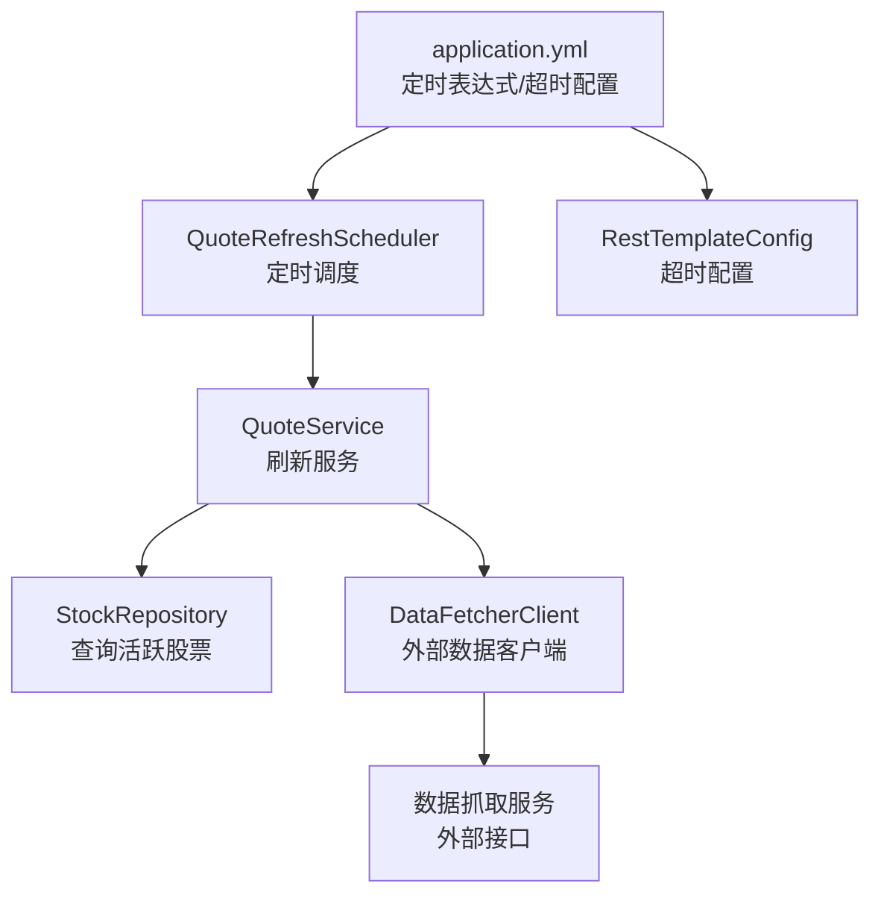
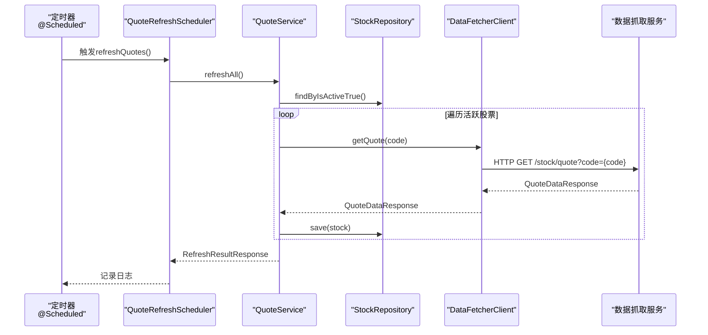
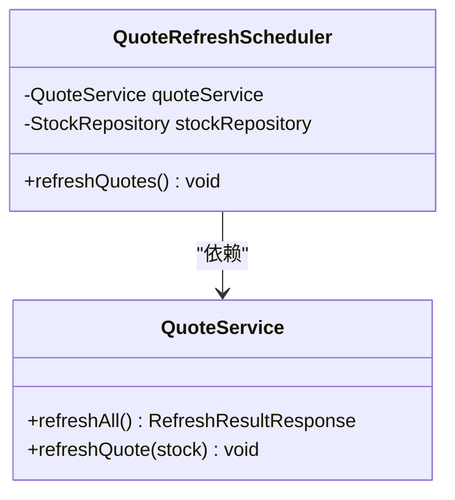
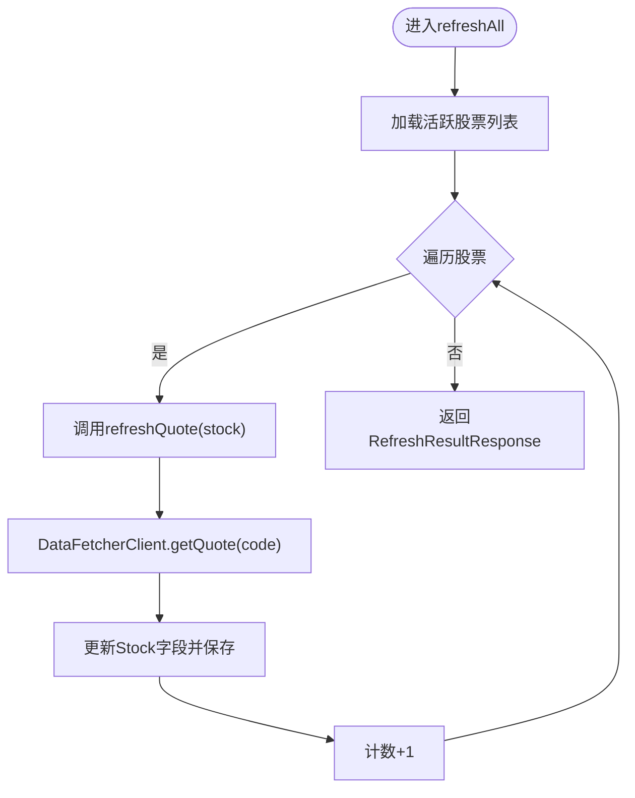
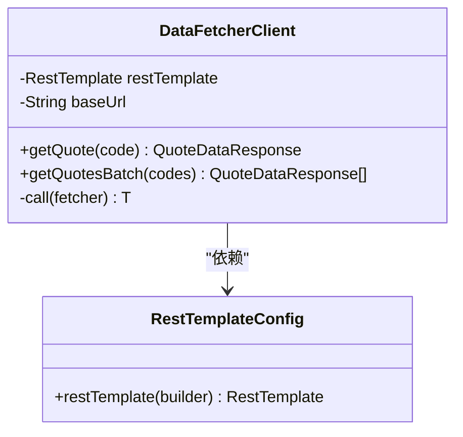
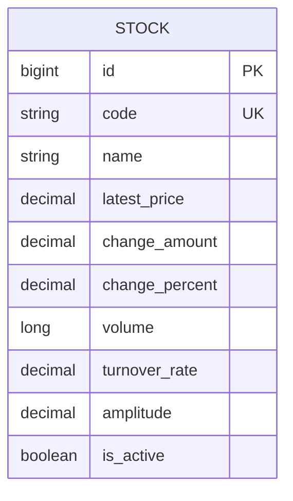
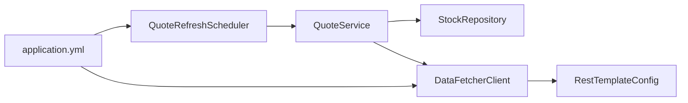

# 行情刷新调度器

<cite>
**本文档引用的文件**
- [QuoteRefreshScheduler.java](file://backend/src/main/java/com/stock/scheduler/QuoteRefreshScheduler.java)
- [QuoteService.java](file://backend/src/main/java/com/stock/service/QuoteService.java)
- [DataFetcherClient.java](file://backend/src/main/java/com/stock/client/DataFetcherClient.java)
- [application.yml](file://backend/src/main/resources/application.yml)
- [BatchQuoteRequest.java](file://backend/src/main/java/com/stock/dto/fetcher/BatchQuoteRequest.java)
- [RefreshResultResponse.java](file://backend/src/main/java/com/stock/dto/response/RefreshResultResponse.java)
- [Stock.java](file://backend/src/main/java/com/stock/entity/Stock.java)
- [StockRepository.java](file://backend/src/main/java/com/stock/repository/StockRepository.java)
- [RestTemplateConfig.java](file://backend/src/main/java/com/stock/config/RestTemplateConfig.java)
- [DataFetchException.java](file://backend/src/main/java/com/stock/exception/DataFetchException.java)
- [DataSyncScheduler.java](file://backend/src/main/java/com/stock/scheduler/DataSyncScheduler.java)
- [QuoteDataResponse.java](file://backend/src/main/java/com/stock/dto/fetcher/QuoteDataResponse.java)
- [quote.ts](file://frontend/src/api/quote.ts)
</cite>

## 目录
1. [简介](#简介)
2. [项目结构](#项目结构)
3. [核心组件](#核心组件)
4. [架构总览](#架构总览)
5. [详细组件分析](#详细组件分析)
6. [依赖关系分析](#依赖关系分析)
7. [性能考虑](#性能考虑)
8. [故障排查指南](#故障排查指南)
9. [结论](#结论)
10. [附录](#附录)

## 简介
本文件面向“行情刷新调度器”的技术实现，系统性阐述实时行情数据的定时刷新机制，包括刷新频率配置、批量请求优化策略；详细说明与QuoteService的集成方式、数据缓存策略与内存管理；阐述行情数据的时效性保证、网络异常处理、数据质量监控；并提供刷新任务的性能优化建议、资源使用统计与故障诊断方法，以及测试验证与监控告警配置。

## 项目结构
围绕行情刷新调度器的关键模块与文件组织如下：
- 定时调度：QuoteRefreshScheduler（基于Spring @Scheduled）
- 业务服务：QuoteService（封装刷新逻辑与事务）
- 数据访问：StockRepository（查询活跃股票列表）
- 外部数据源客户端：DataFetcherClient（封装RestTemplate调用）
- 配置：application.yml（定时表达式、数据源、超时等）
- 实体与DTO：Stock、QuoteDataResponse、RefreshResultResponse
- 基础设施：RestTemplateConfig（连接/读取超时）

图表来源
- [QuoteRefreshScheduler.java:24-33](file://backend/src/main/java/com/stock/scheduler/QuoteRefreshScheduler.java#L24-L33)
- [QuoteService.java:64-82](file://backend/src/main/java/com/stock/service/QuoteService.java#L64-L82)
- [StockRepository.java:16](file://backend/src/main/java/com/stock/repository/StockRepository.java#L16)
- [DataFetcherClient.java:43-46](file://backend/src/main/java/com/stock/client/DataFetcherClient.java#L43-L46)
- [application.yml:23-27](file://backend/src/main/resources/application.yml#L23-L27)
- [RestTemplateConfig.java:10-16](file://backend/src/main/java/com/stock/config/RestTemplateConfig.java#L10-L16)

章节来源
- [QuoteRefreshScheduler.java:1-35](file://backend/src/main/java/com/stock/scheduler/QuoteRefreshScheduler.java#L1-L35)
- [application.yml:19-28](file://backend/src/main/resources/application.yml#L19-L28)

## 核心组件
- 定时调度器：负责按配置的cron表达式周期性触发行情刷新任务，记录成功/失败计数与明细。
- 刷新服务：遍历活跃股票，逐个从外部数据源拉取最新行情并更新数据库。
- 数据客户端：封装HTTP调用，统一异常转换为DataFetchException，并支持批量行情接口。
- 数据模型：Stock实体存储最新价格、涨跌额、涨跌幅、成交量、换手率、振幅等字段；RefreshResultResponse用于汇总刷新结果。
- 配置中心：application.yml集中管理定时表达式与数据抓取服务地址；RestTemplateConfig统一设置连接/读取超时。

章节来源
- [QuoteRefreshScheduler.java:24-33](file://backend/src/main/java/com/stock/scheduler/QuoteRefreshScheduler.java#L24-L33)
- [QuoteService.java:64-96](file://backend/src/main/java/com/stock/service/QuoteService.java#L64-L96)
- [DataFetcherClient.java:43-57](file://backend/src/main/java/com/stock/client/DataFetcherClient.java#L43-L57)
- [Stock.java:62-78](file://backend/src/main/java/com/stock/entity/Stock.java#L62-L78)
- [RefreshResultResponse.java:5-11](file://backend/src/main/java/com/stock/dto/response/RefreshResultResponse.java#L5-L11)
- [application.yml:23-27](file://backend/src/main/resources/application.yml#L23-L27)
- [RestTemplateConfig.java:10-16](file://backend/src/main/java/com/stock/config/RestTemplateConfig.java#L10-L16)

## 架构总览
行情刷新调度器采用“定时任务驱动 + 服务层聚合 + 外部数据源”的分层架构。调度器仅负责触发，具体的数据拉取与落库由服务层完成；服务层通过数据客户端访问外部数据源，异常统一转换为DataFetchException；最终将结果写入数据库并返回刷新统计。

图表来源
- [QuoteRefreshScheduler.java:24-33](file://backend/src/main/java/com/stock/scheduler/QuoteRefreshScheduler.java#L24-L33)
- [QuoteService.java:64-96](file://backend/src/main/java/com/stock/service/QuoteService.java#L64-L96)
- [StockRepository.java:16](file://backend/src/main/java/com/stock/repository/StockRepository.java#L16)
- [DataFetcherClient.java:43-46](file://backend/src/main/java/com/stock/client/DataFetcherClient.java#L43-L46)

## 详细组件分析

### 组件A：QuoteRefreshScheduler（定时调度器）
- 角色定位：Spring @Scheduled驱动的定时任务入口，负责周期性触发行情刷新。
- 关键行为：
  - 读取配置项${stock.scheduler.quote-refresh-cron}作为调度周期。
  - 调用QuoteService.refreshAll()执行批量刷新。
  - 记录成功/失败计数与明细到日志。
- 异常处理：捕获并记录异常，避免中断调度。
- 与QuoteService集成：通过构造注入获得QuoteService实例，解耦调度与业务。

图表来源
- [QuoteRefreshScheduler.java:19-33](file://backend/src/main/java/com/stock/scheduler/QuoteRefreshScheduler.java#L19-L33)
- [QuoteService.java:64-96](file://backend/src/main/java/com/stock/service/QuoteService.java#L64-L96)

章节来源
- [QuoteRefreshScheduler.java:24-33](file://backend/src/main/java/com/stock/scheduler/QuoteRefreshScheduler.java#L24-L33)
- [application.yml:24](file://backend/src/main/resources/application.yml#L24)

### 组件B：QuoteService（行情刷新服务）
- 角色定位：业务层核心，负责遍历活跃股票并刷新行情数据。
- 关键行为：
  - refreshAll()：查询活跃股票列表，逐个调用refreshQuote()，统计更新/失败数量与明细。
  - refreshQuote(stock)：调用DataFetcherClient.getQuote()获取最新行情，更新Stock实体对应字段并持久化。
  - getQuote(stockId)：按需获取单只股票行情，若缓存缺失则尝试刷新。
- 事务性：使用@Transactional确保刷新过程的原子性。
- 错误处理：对单只股票刷新失败进行捕获与记录，不影响整体流程。

图表来源
- [QuoteService.java:64-82](file://backend/src/main/java/com/stock/service/QuoteService.java#L64-L82)
- [QuoteService.java:84-96](file://backend/src/main/java/com/stock/service/QuoteService.java#L84-L96)
- [DataFetcherClient.java:43-46](file://backend/src/main/java/com/stock/client/DataFetcherClient.java#L43-L46)

章节来源
- [QuoteService.java:64-96](file://backend/src/main/java/com/stock/service/QuoteService.java#L64-L96)
- [StockRepository.java:16](file://backend/src/main/java/com/stock/repository/StockRepository.java#L16)

### 组件C：DataFetcherClient（数据抓取客户端）
- 角色定位：封装对外部数据源的HTTP访问，屏蔽参数拼装与异常转换。
- 关键能力：
  - 单只行情：getQuote(code) -> /stock/quote?code={code}
  - 批量行情：getQuotesBatch(codes) -> POST /stock/quotes/batch（当前代码未在调度中直接使用）
  - 统一异常：内部call()方法将底层异常包装为DataFetchException
- 配置来源：baseUrl来自${stock.data-fetcher.url}，默认http://localhost:5001
- 超时控制：通过RestTemplateConfig设置连接/读取超时

图表来源
- [DataFetcherClient.java:19-24](file://backend/src/main/java/com/stock/client/DataFetcherClient.java#L19-L24)
- [DataFetcherClient.java:43-57](file://backend/src/main/java/com/stock/client/DataFetcherClient.java#L43-L57)
- [RestTemplateConfig.java:10-16](file://backend/src/main/java/com/stock/config/RestTemplateConfig.java#L10-L16)

章节来源
- [DataFetcherClient.java:43-57](file://backend/src/main/java/com/stock/client/DataFetcherClient.java#L43-L57)
- [application.yml:20-22](file://backend/src/main/resources/application.yml#L20-L22)
- [RestTemplateConfig.java:10-16](file://backend/src/main/java/com/stock/config/RestTemplateConfig.java#L10-L16)

### 组件D：数据模型与DTO
- Stock实体：包含最新价、涨跌额、涨跌幅、成交量、换手率、振幅等字段，用于缓存与展示。
- QuoteDataResponse：外部数据源返回的行情数据结构。
- RefreshResultResponse：刷新任务的汇总结果，包含updated、failed与details。

图表来源
- [Stock.java:62-78](file://backend/src/main/java/com/stock/entity/Stock.java#L62-L78)

章节来源
- [Stock.java:62-78](file://backend/src/main/java/com/stock/entity/Stock.java#L62-L78)
- [QuoteDataResponse.java:7-21](file://backend/src/main/java/com/stock/dto/fetcher/QuoteDataResponse.java#L7-L21)
- [RefreshResultResponse.java:5-11](file://backend/src/main/java/com/stock/dto/response/RefreshResultResponse.java#L5-L11)

### 组件E：配置与超时
- 定时表达式：${stock.scheduler.quote-refresh-cron}默认每工作日9:00-11:59与13:00-15:59，每5分钟一次。
- 数据抓取服务地址：${stock.data-fetcher.url}默认http://localhost:5001
- 超时配置：连接超时5秒，读取超时15秒（RestTemplateConfig）

章节来源
- [application.yml:23-27](file://backend/src/main/resources/application.yml#L23-L27)
- [application.yml:20-22](file://backend/src/main/resources/application.yml#L20-L22)
- [RestTemplateConfig.java:10-16](file://backend/src/main/java/com/stock/config/RestTemplateConfig.java#L10-L16)

## 依赖关系分析
- 耦合度：QuoteRefreshScheduler仅依赖QuoteService，低耦合高内聚。
- 外部依赖：DataFetcherClient依赖RestTemplate与外部数据源URL。
- 数据依赖：QuoteService依赖StockRepository与DataFetcherClient。
- 循环依赖：未发现循环依赖。

图表来源
- [QuoteRefreshScheduler.java:19-22](file://backend/src/main/java/com/stock/scheduler/QuoteRefreshScheduler.java#L19-L22)
- [QuoteService.java:22-28](file://backend/src/main/java/com/stock/service/QuoteService.java#L22-L28)
- [DataFetcherClient.java:17-24](file://backend/src/main/java/com/stock/client/DataFetcherClient.java#L17-L24)
- [application.yml:23-27](file://backend/src/main/resources/application.yml#L23-L27)

章节来源
- [QuoteRefreshScheduler.java:19-22](file://backend/src/main/java/com/stock/scheduler/QuoteRefreshScheduler.java#L19-L22)
- [QuoteService.java:22-28](file://backend/src/main/java/com/stock/service/QuoteService.java#L22-L28)
- [DataFetcherClient.java:17-24](file://backend/src/main/java/com/stock/client/DataFetcherClient.java#L17-L24)

## 性能考虑
- 刷新频率优化
  - 当前配置为每5分钟一次，适合盘中高频场景；可根据数据源限流与延迟要求调整。
  - 可引入动态调度：根据任务耗时自适应调整间隔或并发批次大小。
- 批量请求优化
  - DataFetcherClient已提供批量接口getQuotesBatch，但调度器当前未使用；建议在后续版本启用批量接口以降低HTTP开销与网络往返时间。
  - 批量大小建议：结合数据源限制与内存占用，建议每次20只以内（参考数据抓取服务端限制）。
- 并发与限流
  - 当前逐个刷新，可考虑线程池并发刷新，但需注意数据源限流与数据库写入压力。
  - 建议增加令牌桶/漏桶限流，避免瞬时峰值导致外部接口限流或数据库写入阻塞。
- 缓存与内存管理
  - Stock实体缓存在JVM堆中，建议结合Redis做二级缓存，减少数据库压力与热点查询延迟。
  - 对于高频读取场景，可引入本地缓存（如Caffeine），设置合理TTL与淘汰策略。
- I/O与超时
  - RestTemplate连接/读取超时已配置，建议根据网络状况与数据源响应时间微调。
  - 增加重试与熔断策略，避免单点故障扩大。
- 监控与统计
  - 记录刷新耗时、成功率、失败原因分布，便于容量规划与性能优化。
  - 建议埋点统计：任务开始/结束时间、每个股票刷新耗时、外部接口耗时、数据库写入耗时。

## 故障排查指南
- 常见问题与定位
  - 外部数据源不可达：检查${stock.data-fetcher.url}与网络连通性；查看DataFetchException错误信息。
  - 刷新失败：查看QuoteRefreshScheduler日志中的failed计数与details；逐个排查失败股票代码。
  - 数据库写入异常：确认StockRepository.save()是否抛出异常；检查数据库连接与DDL策略。
  - 超时问题：调整RestTemplateConfig的连接/读取超时；评估外部接口限流策略。
- 日志与告警
  - 调度器日志：INFO记录开始与完成，ERROR记录异常。
  - 刷新结果：updated/failed计数与details可用于告警阈值设置。
- 诊断步骤
  - 临时关闭调度，手动调用QuoteService.refreshAll()观察异常堆栈。
  - 使用curl或Postman直连外部数据源接口，验证返回格式与限流策略。
  - 检查StockRepository中活跃股票数量与latestPrice字段更新情况。

章节来源
- [DataFetchException.java:1-6](file://backend/src/main/java/com/stock/exception/DataFetchException.java#L1-L6)
- [QuoteRefreshScheduler.java:30-32](file://backend/src/main/java/com/stock/scheduler/QuoteRefreshScheduler.java#L30-L32)
- [QuoteService.java:75-79](file://backend/src/main/java/com/stock/service/QuoteService.java#L75-L79)

## 结论
行情刷新调度器通过定时任务驱动、服务层聚合与外部数据源客户端协作，实现了稳定高效的实时行情刷新。当前实现具备清晰的职责划分与完善的异常处理；建议在后续版本引入批量请求、并发控制、二级缓存与更细粒度的监控告警，以进一步提升性能与可靠性。

## 附录

### 刷新频率与配置
- 默认定时表达式：每工作日9:00-11:59与13:00-15:59，每5分钟一次。
- 可通过修改application.yml中的stock.scheduler.quote-refresh-cron进行调整。

章节来源
- [application.yml:24](file://backend/src/main/resources/application.yml#L24)

### 与前端的集成
- 前端可通过quoteApi.get与quoteApi.refresh调用后端接口获取与刷新行情。
- 后端返回的QuoteResponse包含价格、涨跌、成交量、换手率、振幅与updatedAt等字段，isStale用于标识数据新鲜度。

章节来源
- [quote.ts:20-23](file://frontend/src/api/quote.ts#L20-L23)
- [QuoteService.java:45-61](file://backend/src/main/java/com/stock/service/QuoteService.java#L45-L61)

### 数据质量监控建议
- 指标采集：刷新成功率、平均耗时、失败原因分布、外部接口RTT。
- 告警阈值：失败率超过阈值、刷新耗时持续升高、外部接口错误率上升。
- 周期性校验：定期比对Stock.latestPrice与外部接口最新报价，确保一致性。

### 测试验证建议
- 单元测试：Mock DataFetcherClient与StockRepository，验证QuoteService.refreshAll()的行为与异常分支。
- 集成测试：启动外部数据抓取服务，验证DataFetcherClient.getQuote与批量接口。
- 压力测试：模拟大量活跃股票，评估数据库写入与外部接口限流影响。