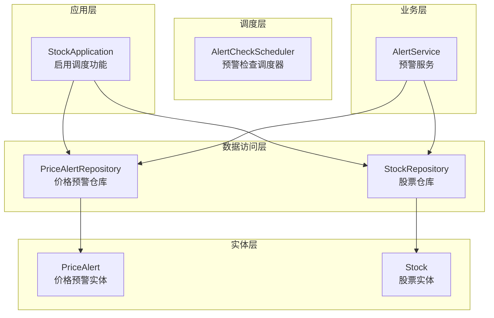
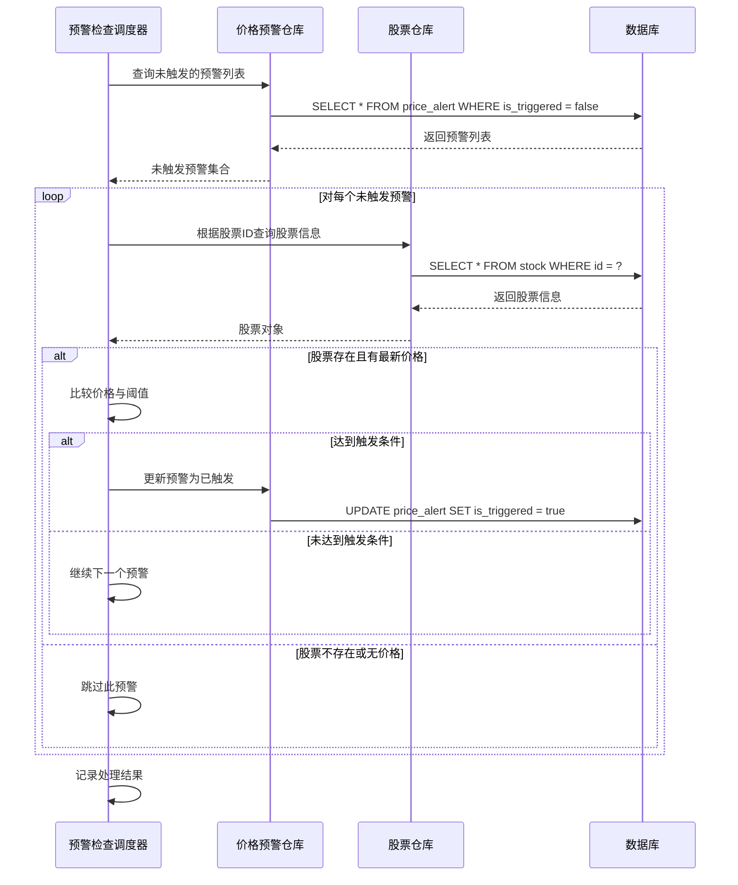
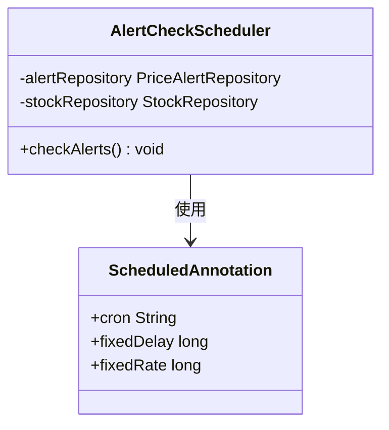
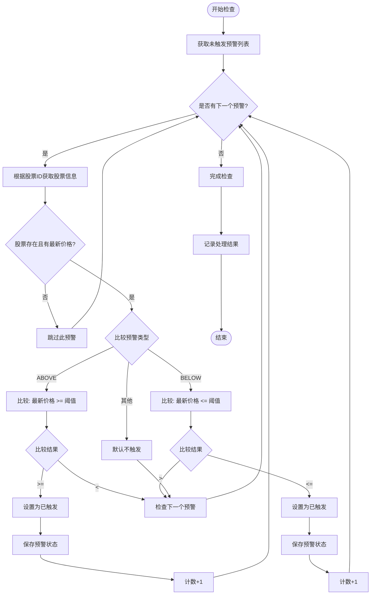
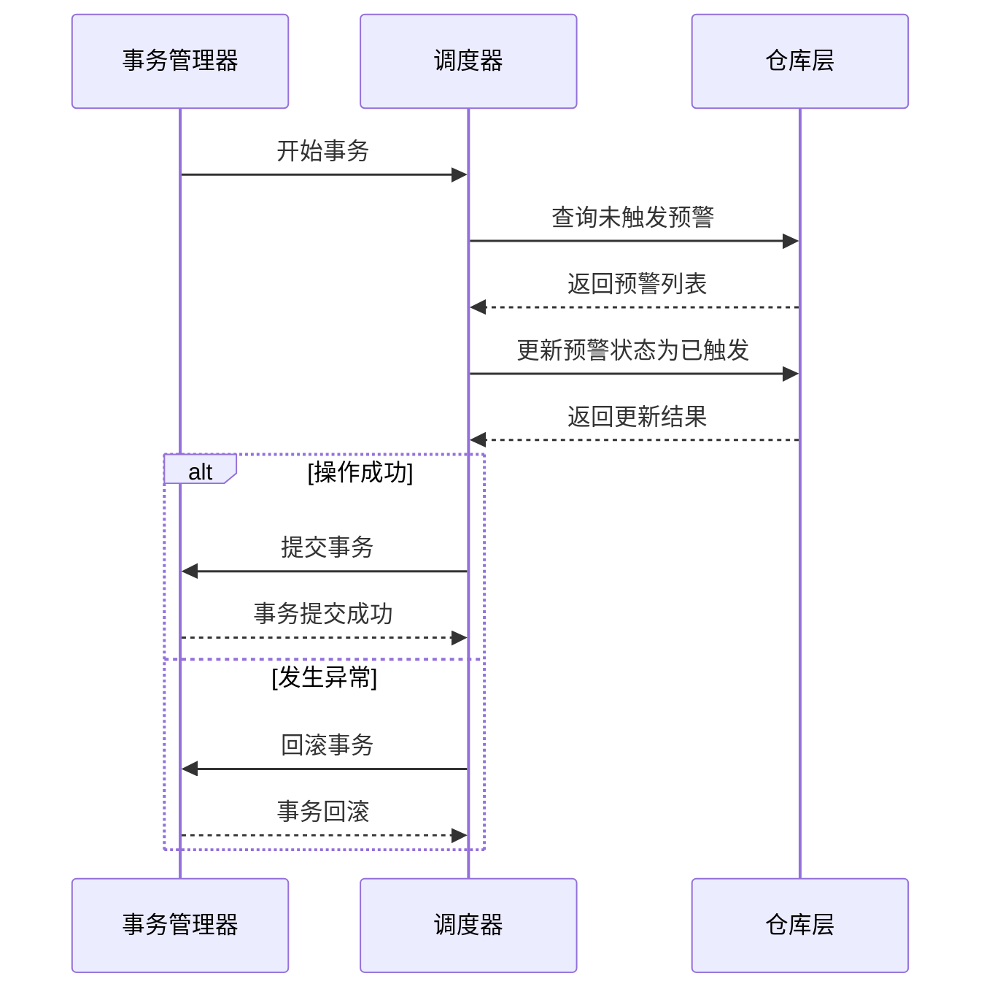
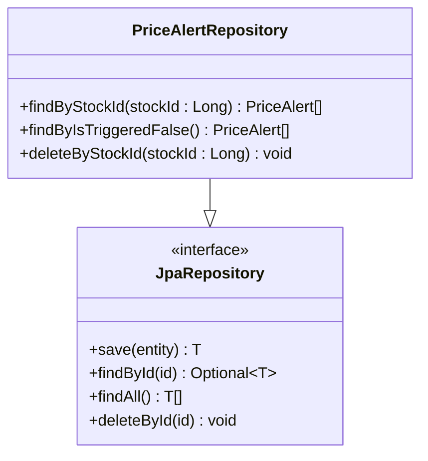
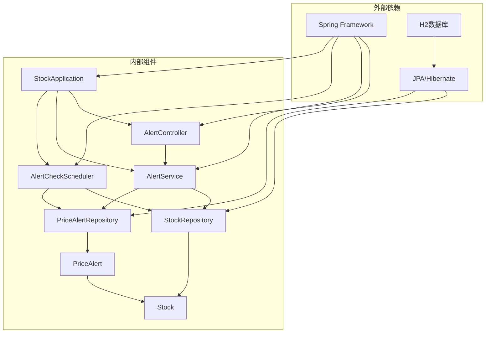
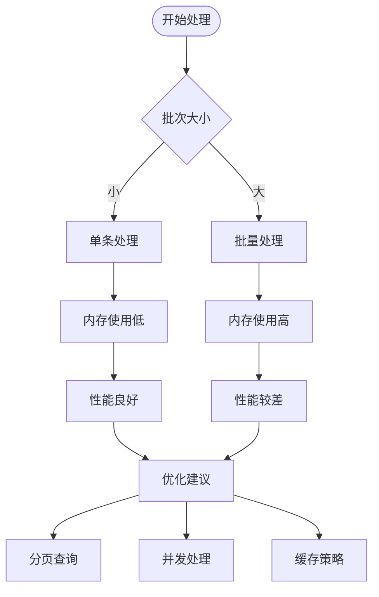
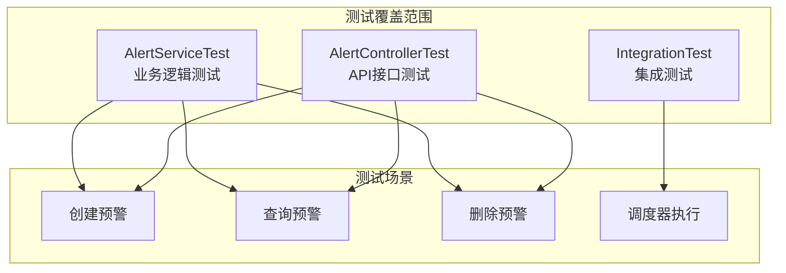

# 预警检查调度器

<cite>
**本文档引用的文件**
- [AlertCheckScheduler.java](file://backend/src/main/java/com/stock/scheduler/AlertCheckScheduler.java)
- [AlertService.java](file://backend/src/main/java/com/stock/service/AlertService.java)
- [PriceAlertRepository.java](file://backend/src/main/java/com/stock/repository/PriceAlertRepository.java)
- [application.yml](file://backend/src/main/resources/application.yml)
- [PriceAlert.java](file://backend/src/main/java/com/stock/entity/PriceAlert.java)
- [Stock.java](file://backend/src/main/java/com/stock/entity/Stock.java)
- [AlertController.java](file://backend/src/main/java/com/stock/controller/AlertController.java)
- [StockApplication.java](file://backend/src/main/java/com/stock/StockApplication.java)
- [AlertServiceTest.java](file://backend/src/test/java/com/stock/service/AlertServiceTest.java)
- [AlertControllerTest.java](file://backend/src/test/java/com/stock/controller/AlertControllerTest.java)
</cite>

## 目录
1. [简介](#简介)
2. [项目结构](#项目结构)
3. [核心组件](#核心组件)
4. [架构概览](#架构概览)
5. [详细组件分析](#详细组件分析)
6. [依赖关系分析](#依赖关系分析)
7. [性能考虑](#性能考虑)
8. [故障排除指南](#故障排除指南)
9. [结论](#结论)

## 简介

预警检查调度器是股票交易系统中的关键组件，负责定期检查用户设置的价格预警条件。该系统通过Spring框架的@Scheduled注解实现定时任务调度，使用Cron表达式控制执行频率，并通过事务性操作确保数据一致性。

系统支持两种预警类型：
- ABOVE：股价达到或超过阈值时触发
- BELOW：股价达到或低于阈值时触发

## 项目结构

预警检查调度器位于后端服务的scheduler包中，与数据访问层、业务逻辑层和控制器层形成清晰的分层架构。

**图表来源**
- [StockApplication.java:8-10](file://backend/src/main/java/com/stock/StockApplication.java#L8-L10)
- [AlertCheckScheduler.java:16-24](file://backend/src/main/java/com/stock/scheduler/AlertCheckScheduler.java#L16-L24)

**章节来源**
- [StockApplication.java:1-16](file://backend/src/main/java/com/stock/StockApplication.java#L1-L16)
- [AlertCheckScheduler.java:1-52](file://backend/src/main/java/com/stock/scheduler/AlertCheckScheduler.java#L1-L52)

## 核心组件

### 调度器组件

预警检查调度器是系统的核心执行组件，负责：
- 定时扫描未触发的预警
- 获取股票最新价格
- 执行阈值比较逻辑
- 更新预警状态

### 数据模型

系统使用两个核心实体：
- **PriceAlert**：存储预警配置信息（股票ID、类型、阈值、触发状态）
- **Stock**：存储股票基本信息和实时价格

**章节来源**
- [AlertCheckScheduler.java:18-24](file://backend/src/main/java/com/stock/scheduler/AlertCheckScheduler.java#L18-L24)
- [PriceAlert.java:16-36](file://backend/src/main/java/com/stock/entity/PriceAlert.java#L16-L36)
- [Stock.java:17-85](file://backend/src/main/java/com/stock/entity/Stock.java#L17-L85)

## 架构概览

预警检查调度器采用分层架构设计，实现了关注点分离和职责明确划分。

**图表来源**
- [AlertCheckScheduler.java:26-50](file://backend/src/main/java/com/stock/scheduler/AlertCheckScheduler.java#L26-L50)
- [PriceAlertRepository.java:11-13](file://backend/src/main/java/com/stock/repository/PriceAlertRepository.java#L11-L13)

## 详细组件分析

### @Scheduled注解与Cron表达式配置

#### 注解使用方式

调度器使用@Scheduled注解标记checkAlerts方法，实现定时执行：

**图表来源**
- [AlertCheckScheduler.java:26-27](file://backend/src/main/java/com/stock/scheduler/AlertCheckScheduler.java#L26-L27)

#### Cron表达式配置机制

Cron表达式通过Spring配置属性注入，使用占位符语法：

| 字段 | 允许值 | 描述 |
|------|--------|------|
| 秒 | 0-59 | 秒 |
| 分钟 | 0-59 | 分钟 |
| 小时 | 0-23 | 小时 |
| 日期 | 1-31 | 日期 |
| 月份 | 1-12 | 月份 |
| 星期 | 0-7 | 星期（0和7都表示周日） |

**配置示例**：
- `"0 */1 9-11,13-15 * * MON-FRI"` - 工作日9:01-11:59和13:01-15:59每分钟执行一次
- `"0 0 10 * * MON-FRI"` - 工作日上午10:00执行
- `"0 0 15 * * MON-FRI"` - 工作日下午15:00执行

**章节来源**
- [AlertCheckScheduler.java:26](file://backend/src/main/java/com/stock/scheduler/AlertCheckScheduler.java#L26)
- [application.yml:27](file://backend/src/main/resources/application.yml#L27)

### 预警检查核心逻辑

#### 预警类型判断逻辑

系统支持两种预警类型，分别对应不同的比较逻辑：

**图表来源**
- [AlertCheckScheduler.java:37-47](file://backend/src/main/java/com/stock/scheduler/AlertCheckScheduler.java#L37-L47)

#### 事务性执行重要性

调度器使用@Transactional注解确保操作的原子性：

**图表来源**
- [AlertCheckScheduler.java:27](file://backend/src/main/java/com/stock/scheduler/AlertCheckScheduler.java#L27)

**章节来源**
- [AlertCheckScheduler.java:28-49](file://backend/src/main/java/com/stock/scheduler/AlertCheckScheduler.java#L28-L49)

### 数据访问层设计

#### 价格预警仓库接口

仓库层提供了专门的查询方法：

**图表来源**
- [PriceAlertRepository.java:9-16](file://backend/src/main/java/com/stock/repository/PriceAlertRepository.java#L9-L16)

**章节来源**
- [PriceAlertRepository.java:11-13](file://backend/src/main/java/com/stock/repository/PriceAlertRepository.java#L11-L13)

### 日志记录策略

调度器实现了完整的日志记录机制：

| 日志级别 | 记录内容 | 触发时机 |
|----------|----------|----------|
| INFO | 开始预警检查 | 调度器启动时 |
| INFO | 预警检查完成及触发数量 | 调度器结束时 |
| WARN | 跳过无价格的预警 | 股票无最新价格时 |
| ERROR | 数据库操作异常 | 事务执行失败时 |

**章节来源**
- [AlertCheckScheduler.java:29](file://backend/src/main/java/com/stock/scheduler/AlertCheckScheduler.java#L29)
- [AlertCheckScheduler.java:49](file://backend/src/main/java/com/stock/scheduler/AlertCheckScheduler.java#L49)

## 依赖关系分析

### 组件依赖图

**图表来源**
- [StockApplication.java:3-10](file://backend/src/main/java/com/stock/StockApplication.java#L3-L10)
- [AlertCheckScheduler.java:3-6](file://backend/src/main/java/com/stock/scheduler/AlertCheckScheduler.java#L3-L6)

### 关键依赖关系

1. **调度器依赖**：AlertCheckScheduler依赖PriceAlertRepository和StockRepository进行数据访问
2. **服务层依赖**：AlertService提供业务逻辑封装，便于单元测试和复用
3. **配置依赖**：application.yml提供Cron表达式配置，支持运行时修改
4. **实体依赖**：PriceAlert和Stock实体定义了数据模型和关系映射

**章节来源**
- [AlertCheckScheduler.java:18-24](file://backend/src/main/java/com/stock/scheduler/AlertCheckScheduler.java#L18-L24)
- [AlertService.java:18-24](file://backend/src/main/java/com/stock/service/AlertService.java#L18-L24)

## 性能考虑

### 批量处理优化

当前实现采用逐条处理的方式，对于大量预警的情况可能影响性能。建议的优化方案：

1. **批量查询优化**：使用分页查询避免一次性加载过多数据
2. **并发处理**：使用@Async注解实现异步处理多个预警
3. **缓存策略**：缓存股票价格减少数据库查询次数
4. **索引优化**：在price_alert表上建立合适的索引

### 内存使用优化

### 数据库性能优化

1. **查询优化**：使用索引优化WHERE条件查询
2. **连接池配置**：合理配置数据库连接池参数
3. **事务隔离**：使用适当的事务隔离级别
4. **监控指标**：监控慢查询和高负载情况

## 故障排除指南

### 常见问题诊断

#### 调度器不执行

**症状**：预警检查从未执行
**排查步骤**：
1. 检查@EnableScheduling注解是否正确配置
2. 验证Cron表达式格式是否正确
3. 确认应用是否正常启动
4. 查看日志中是否有调度器启动信息

**章节来源**
- [StockApplication.java:9](file://backend/src/main/java/com/stock/StockApplication.java#L9)
- [application.yml:27](file://backend/src/main/resources/application.yml#L27)

#### 预警未触发

**症状**：设置的预警条件满足但未触发
**排查步骤**：
1. 检查股票是否有最新价格
2. 验证阈值比较逻辑是否正确
3. 确认预警类型设置是否正确
4. 查看数据库中预警状态是否更新

**章节来源**
- [AlertCheckScheduler.java:35-47](file://backend/src/main/java/com/stock/scheduler/AlertCheckScheduler.java#L35-L47)

#### 数据库连接问题

**症状**：调度器执行时报数据库连接错误
**排查步骤**：
1. 检查数据库连接字符串配置
2. 验证数据库服务是否正常运行
3. 查看连接池配置参数
4. 监控数据库性能指标

**章节来源**
- [application.yml:5-8](file://backend/src/main/resources/application.yml#L5-L8)

### 单元测试验证

系统提供了完整的单元测试覆盖：

**图表来源**
- [AlertServiceTest.java:25-84](file://backend/src/test/java/com/stock/service/AlertServiceTest.java#L25-L84)
- [AlertControllerTest.java:26-72](file://backend/src/test/java/com/stock/controller/AlertControllerTest.java#L26-L72)

**章节来源**
- [AlertServiceTest.java:34-77](file://backend/src/test/java/com/stock/service/AlertServiceTest.java#L34-L77)
- [AlertControllerTest.java:43-71](file://backend/src/test/java/com/stock/controller/AlertControllerTest.java#L43-L71)

## 结论

预警检查调度器是一个设计良好的定时任务组件，具有以下特点：

### 优势
1. **清晰的架构分层**：各层职责明确，便于维护和扩展
2. **灵活的配置机制**：通过Cron表达式实现灵活的时间控制
3. **完整的事务管理**：确保数据一致性和操作原子性
4. **完善的日志记录**：提供完整的执行过程跟踪
5. **充分的测试覆盖**：保证代码质量和可靠性

### 改进建议
1. **性能优化**：考虑批量处理和并发执行以提高效率
2. **监控增强**：添加更详细的性能指标和告警机制
3. **错误处理**：增强异常处理和重试机制
4. **配置管理**：提供动态配置更新能力

该调度器为股票交易系统提供了可靠的预警功能基础，通过合理的架构设计和配置管理，能够满足生产环境的稳定运行需求。