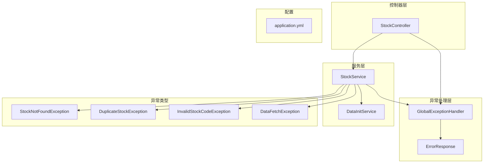
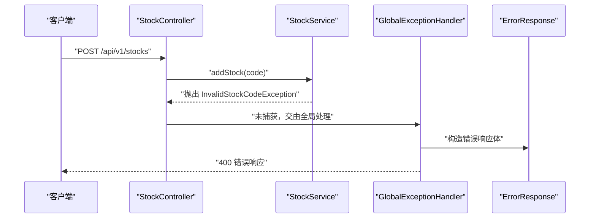
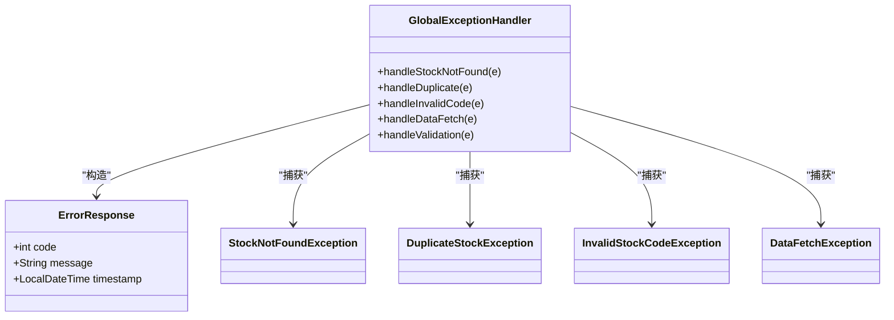
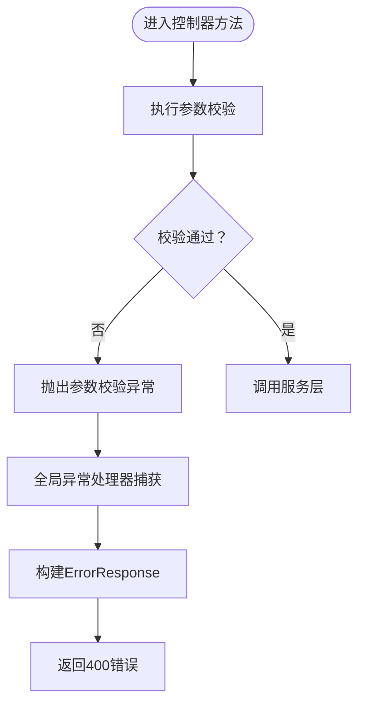
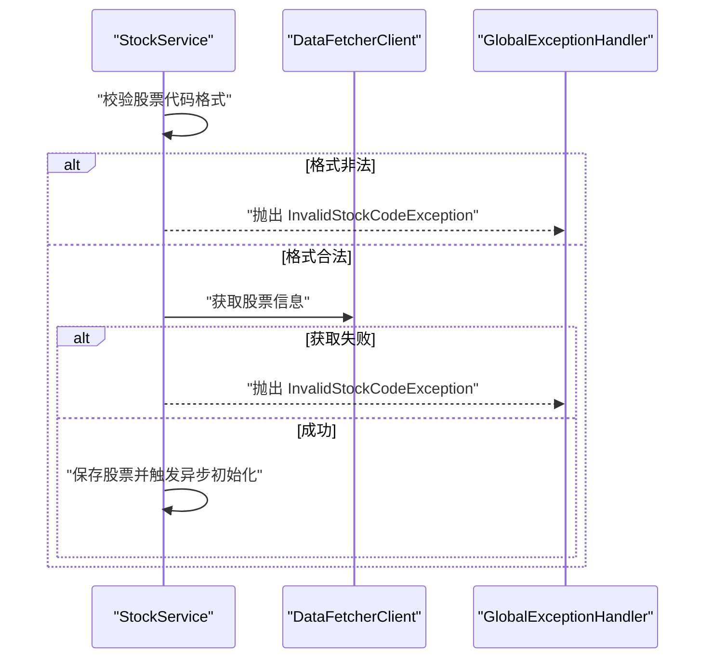
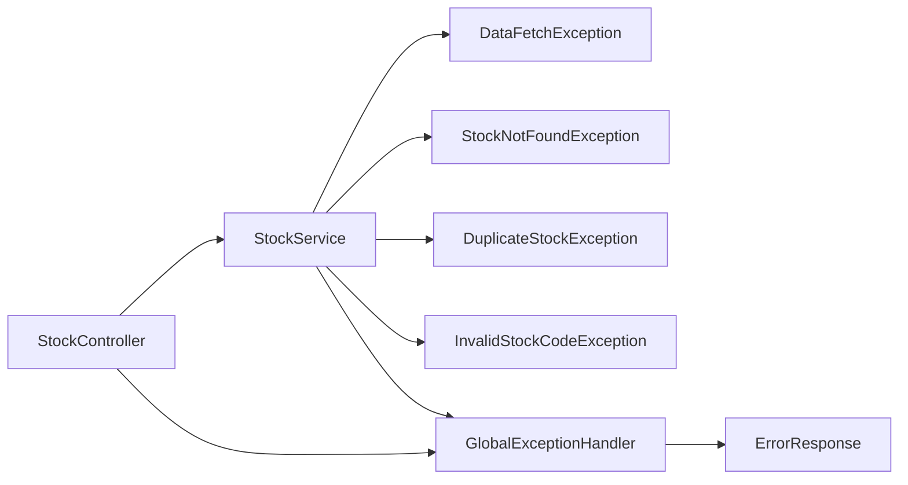

# 异常处理机制

<cite>
**本文引用的文件**
- [GlobalExceptionHandler.java](file://backend/src/main/java/com/stock/exception/GlobalExceptionHandler.java)
- [ErrorResponse.java](file://backend/src/main/java/com/stock/exception/ErrorResponse.java)
- [DataFetchException.java](file://backend/src/main/java/com/stock/exception/DataFetchException.java)
- [DuplicateStockException.java](file://backend/src/main/java/com/stock/exception/DuplicateStockException.java)
- [InvalidStockCodeException.java](file://backend/src/main/java/com/stock/exception/InvalidStockCodeException.java)
- [StockNotFoundException.java](file://backend/src/main/java/com/stock/exception/StockNotFoundException.java)
- [StockController.java](file://backend/src/main/java/com/stock/controller/StockController.java)
- [StockService.java](file://backend/src/main/java/com/stock/service/StockService.java)
- [DataInitService.java](file://backend/src/main/java/com/stock/service/DataInitService.java)
- [AddStockRequest.java](file://backend/src/main/java/com/stock/dto/request/AddStockRequest.java)
- [application.yml](file://backend/src/main/resources/application.yml)
- [StockControllerTest.java](file://backend/src/test/java/com/stock/controller/StockControllerTest.java)
</cite>

## 目录
1. [简介](#简介)
2. [项目结构](#项目结构)
3. [核心组件](#核心组件)
4. [架构总览](#架构总览)
5. [详细组件分析](#详细组件分析)
6. [依赖分析](#依赖分析)
7. [性能考量](#性能考量)
8. [故障排查指南](#故障排查指南)
9. [结论](#结论)
10. [附录](#附录)

## 简介
本文件系统化梳理后端模块中的异常处理机制，覆盖以下主题：
- Spring @ExceptionHandler 的使用与全局异常处理器设计模式
- 自定义异常类的定义方法与职责划分
- 参数校验异常的统一处理
- 错误响应体结构与错误码标准化思路
- 不同类型异常的处理策略与示例路径
- 异常信息安全性与敏感信息过滤建议
- 异常监控与日志记录策略、性能影响评估
- 最佳实践与常见陷阱

## 项目结构
后端采用分层架构：控制器层负责请求入口与参数校验；服务层承载业务逻辑与异常抛出；异常处理层通过全局异常处理器统一转换为标准响应；数据访问层由仓库接口支撑。

图表来源
- [StockController.java:17-57](file://backend/src/main/java/com/stock/controller/StockController.java#L17-L57)
- [StockService.java:93-163](file://backend/src/main/java/com/stock/service/StockService.java#L93-L163)
- [DataInitService.java:42-71](file://backend/src/main/java/com/stock/service/DataInitService.java#L42-L71)
- [GlobalExceptionHandler.java:7-32](file://backend/src/main/java/com/stock/exception/GlobalExceptionHandler.java#L7-L32)
- [ErrorResponse.java:3-7](file://backend/src/main/java/com/stock/exception/ErrorResponse.java#L3-L7)
- [application.yml:19-28](file://backend/src/main/resources/application.yml#L19-L28)

章节来源
- [StockController.java:17-57](file://backend/src/main/java/com/stock/controller/StockController.java#L17-L57)
- [StockService.java:93-163](file://backend/src/main/java/com/stock/service/StockService.java#L93-L163)
- [GlobalExceptionHandler.java:7-32](file://backend/src/main/java/com/stock/exception/GlobalExceptionHandler.java#L7-L32)
- [application.yml:19-28](file://backend/src/main/resources/application.yml#L19-L28)

## 核心组件
- 全局异常处理器：集中捕获业务与参数校验异常，统一返回标准化错误响应。
- 错误响应体：包含状态码、消息与时间戳，默认构造器自动填充当前时间。
- 自定义异常类：按领域划分（如股票不存在、重复、无效代码、数据抓取失败），便于分类处理与语义化表达。
- 控制器与服务：控制器负责参数校验与HTTP状态映射；服务负责业务断言与异常抛出。

章节来源
- [GlobalExceptionHandler.java:7-32](file://backend/src/main/java/com/stock/exception/GlobalExceptionHandler.java#L7-L32)
- [ErrorResponse.java:3-7](file://backend/src/main/java/com/stock/exception/ErrorResponse.java#L3-L7)
- [StockController.java:30-34](file://backend/src/main/java/com/stock/controller/StockController.java#L30-L34)
- [StockService.java:95-105](file://backend/src/main/java/com/stock/service/StockService.java#L95-L105)

## 架构总览
全局异常处理器通过@ControllerAdvice对控制器与服务层抛出的异常进行拦截，并根据异常类型映射到统一的错误响应体。参数校验异常由Spring MVC自动收集字段级错误，统一转为人类可读的消息。

图表来源
- [StockController.java:30-34](file://backend/src/main/java/com/stock/controller/StockController.java#L30-L34)
- [StockService.java:95-97](file://backend/src/main/java/com/stock/service/StockService.java#L95-L97)
- [GlobalExceptionHandler.java:25-31](file://backend/src/main/java/com/stock/exception/GlobalExceptionHandler.java#L25-L31)
- [ErrorResponse.java:3-7](file://backend/src/main/java/com/stock/exception/ErrorResponse.java#L3-L7)

## 详细组件分析

### 全局异常处理器（@ControllerAdvice）
- 职责：集中处理业务异常与参数校验异常，返回标准化错误响应。
- 处理策略：
  - 股票不存在：映射至404，携带错误码与消息。
  - 重复股票：映射至409，提示重复。
  - 无效股票代码：映射至400，提示格式或有效性问题。
  - 数据抓取失败：映射至503，提示外部数据源不可用。
  - 参数校验失败：聚合所有字段错误，拼接为“字段: 错误消息”的形式，映射至400。
- 返回值：统一使用ErrorResponse，包含状态码、消息与时间戳。

图表来源
- [GlobalExceptionHandler.java:7-32](file://backend/src/main/java/com/stock/exception/GlobalExceptionHandler.java#L7-L32)
- [ErrorResponse.java:3-7](file://backend/src/main/java/com/stock/exception/ErrorResponse.java#L3-L7)
- [StockNotFoundException.java:1-6](file://backend/src/main/java/com/stock/exception/StockNotFoundException.java#L1-L6)
- [DuplicateStockException.java:1-5](file://backend/src/main/java/com/stock/exception/DuplicateStockException.java#L1-L5)
- [InvalidStockCodeException.java:1-5](file://backend/src/main/java/com/stock/exception/InvalidStockCodeException.java#L1-L5)
- [DataFetchException.java:1-6](file://backend/src/main/java/com/stock/exception/DataFetchException.java#L1-L6)

章节来源
- [GlobalExceptionHandler.java:7-32](file://backend/src/main/java/com/stock/exception/GlobalExceptionHandler.java#L7-L32)
- [ErrorResponse.java:3-7](file://backend/src/main/java/com/stock/exception/ErrorResponse.java#L3-L7)

### 错误响应体（ErrorResponse）
- 结构：包含状态码、消息与时间戳；默认构造器自动填充当前时间。
- 用途：作为全局异常处理器的标准输出载体，确保前后端一致的错误契约。

章节来源
- [ErrorResponse.java:3-7](file://backend/src/main/java/com/stock/exception/ErrorResponse.java#L3-L7)

### 自定义异常类
- StockNotFoundException：用于查询不存在的股票资源时抛出。
- DuplicateStockException：用于添加已存在的股票时抛出。
- InvalidStockCodeException：用于股票代码格式或有效性不满足要求时抛出。
- DataFetchException：用于外部数据抓取失败时抛出。
- 设计要点：异常类聚焦单一职责，消息中包含可读性良好的上下文信息，便于统一处理与前端展示。

章节来源
- [StockNotFoundException.java:1-6](file://backend/src/main/java/com/stock/exception/StockNotFoundException.java#L1-L6)
- [DuplicateStockException.java:1-5](file://backend/src/main/java/com/stock/exception/DuplicateStockException.java#L1-L5)
- [InvalidStockCodeException.java:1-5](file://backend/src/main/java/com/stock/exception/InvalidStockCodeException.java#L1-L5)
- [DataFetchException.java:1-6](file://backend/src/main/java/com/stock/exception/DataFetchException.java#L1-L6)

### 参数校验与控制器集成
- 控制器层使用@Valid对接口参数进行校验，结合全局异常处理器统一处理校验失败。
- 请求体示例：添加股票请求体需满足6位纯数字格式，否则触发参数校验异常。

图表来源
- [StockController.java:30-34](file://backend/src/main/java/com/stock/controller/StockController.java#L30-L34)
- [AddStockRequest.java:7-9](file://backend/src/main/java/com/stock/dto/request/AddStockRequest.java#L7-L9)
- [GlobalExceptionHandler.java:25-31](file://backend/src/main/java/com/stock/exception/GlobalExceptionHandler.java#L25-L31)

章节来源
- [StockController.java:30-34](file://backend/src/main/java/com/stock/controller/StockController.java#L30-L34)
- [AddStockRequest.java:7-9](file://backend/src/main/java/com/stock/dto/request/AddStockRequest.java#L7-L9)
- [GlobalExceptionHandler.java:25-31](file://backend/src/main/java/com/stock/exception/GlobalExceptionHandler.java#L25-L31)

### 服务层异常抛出策略
- 业务前置检查：如股票代码格式校验、重复性检查等，不符合条件直接抛出自定义异常。
- 外部依赖失败：如无法获取股票信息或估值数据，抛出对应异常，交由全局处理器统一处理。
- 事务提交后异步初始化：在事务完成后触发异步初始化流程，异常以日志告警形式记录，不影响主流程返回。

图表来源
- [StockService.java:95-105](file://backend/src/main/java/com/stock/service/StockService.java#L95-L105)
- [StockService.java:131-143](file://backend/src/main/java/com/stock/service/StockService.java#L131-L143)
- [GlobalExceptionHandler.java:17-24](file://backend/src/main/java/com/stock/exception/GlobalExceptionHandler.java#L17-L24)

章节来源
- [StockService.java:95-105](file://backend/src/main/java/com/stock/service/StockService.java#L95-L105)
- [StockService.java:131-143](file://backend/src/main/java/com/stock/service/StockService.java#L131-L143)

### 异步初始化与异常隔离
- 初始化步骤逐一执行，每个步骤失败仅记录日志并标记为失败，不影响其他步骤继续执行。
- 步骤间存在短暂延迟，降低对外部系统的瞬时压力。

章节来源
- [DataInitService.java:42-71](file://backend/src/main/java/com/stock/service/DataInitService.java#L42-L71)

## 依赖分析
- 控制器依赖服务层；服务层依赖仓库与外部客户端；全局异常处理器独立于业务，仅依赖异常类型与响应体。
- 参数校验异常由Spring MVC自动触发，无需在控制器中显式try/catch。

图表来源
- [StockController.java:17-57](file://backend/src/main/java/com/stock/controller/StockController.java#L17-L57)
- [StockService.java:93-163](file://backend/src/main/java/com/stock/service/StockService.java#L93-L163)
- [GlobalExceptionHandler.java:7-32](file://backend/src/main/java/com/stock/exception/GlobalExceptionHandler.java#L7-L32)
- [ErrorResponse.java:3-7](file://backend/src/main/java/com/stock/exception/ErrorResponse.java#L3-L7)

## 性能考量
- 全局异常处理本身开销极低，主要成本在于异常对象创建与序列化。
- 参数校验异常在控制器层即可短路返回，减少后续调用链开销。
- 异步初始化步骤采用顺序执行与延迟，避免瞬时并发冲击外部系统。
- 建议：
  - 对高频异常（如参数校验）尽量在入口层快速失败。
  - 将耗时的外部调用放入异步任务，避免阻塞主线程。
  - 在生产环境开启必要的采样日志，避免过多异常堆栈刷屏。

## 故障排查指南
- 如遇400错误且消息为“字段: 错误消息”形式，检查请求体是否符合AddStockRequest约束。
- 如遇404错误，确认资源ID或代码是否存在。
- 如遇409错误，确认是否重复添加同一股票。
- 如遇503错误，检查数据抓取服务可用性与超时配置。
- 日志定位：
  - 服务层对外部调用失败会记录警告日志，便于追踪异常来源。
  - 异步初始化步骤失败会记录步骤名与错误消息，便于定位具体环节。

章节来源
- [StockService.java:141-143](file://backend/src/main/java/com/stock/service/StockService.java#L141-L143)
- [DataInitService.java:60-63](file://backend/src/main/java/com/stock/service/DataInitService.java#L60-L63)
- [application.yml:20-22](file://backend/src/main/resources/application.yml#L20-L22)

## 结论
该系统通过@ControllerAdvice实现了统一的异常处理与标准化响应，配合自定义异常类与参数校验，形成清晰的错误处理闭环。异步初始化与日志策略进一步提升了系统的稳定性与可观测性。建议在生产环境中完善错误码与国际化支持，并加强敏感信息过滤与审计日志。

## 附录

### 错误码标准化设计建议
- 统一错误码范围：如4xx用于客户端错误（参数、资源不存在、冲突），5xx用于服务端错误（外部依赖不可用）。
- 可扩展性：为每类异常预留错误码区间，便于未来新增异常类型而不破坏兼容性。
- 文档化：将错误码与异常类型映射关系纳入API文档，便于前后端协作。

### 异常信息安全性与敏感信息过滤
- 避免在错误消息中泄露内部实现细节、数据库结构、路径等敏感信息。
- 对异常堆栈仅在调试级别输出，生产环境仅保留摘要信息。
- 对外部系统错误进行脱敏处理，避免暴露第三方服务的内部错误细节。

### 国际化支持建议
- 使用消息键替代硬编码消息，结合Locale选择语言包。
- 在全局异常处理器中注入MessageSource，按区域动态生成错误消息。
- 保持错误码稳定，消息变更不影响调用方契约。

### 监控与日志策略
- 指标采集：统计各类型异常发生次数、响应时间分布、外部依赖失败率。
- 日志分级：区分INFO/WARN/ERROR，设置合理的采样率与保留周期。
- 告警阈值：针对高频异常与外部依赖失败设置阈值告警，缩短故障恢复时间。