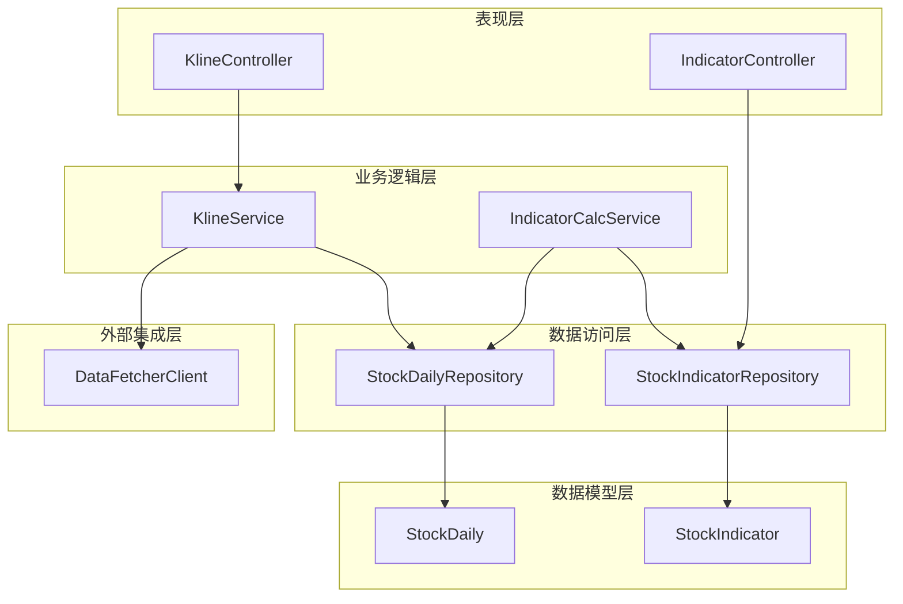
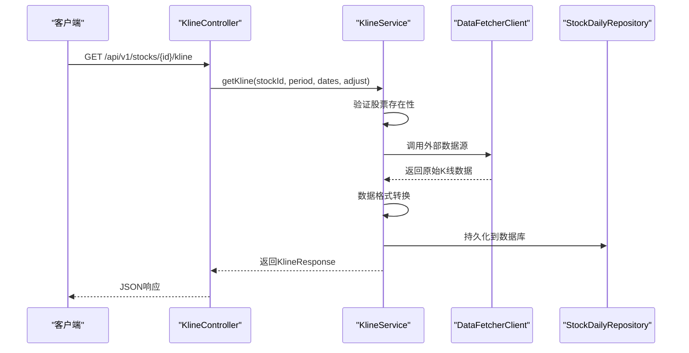
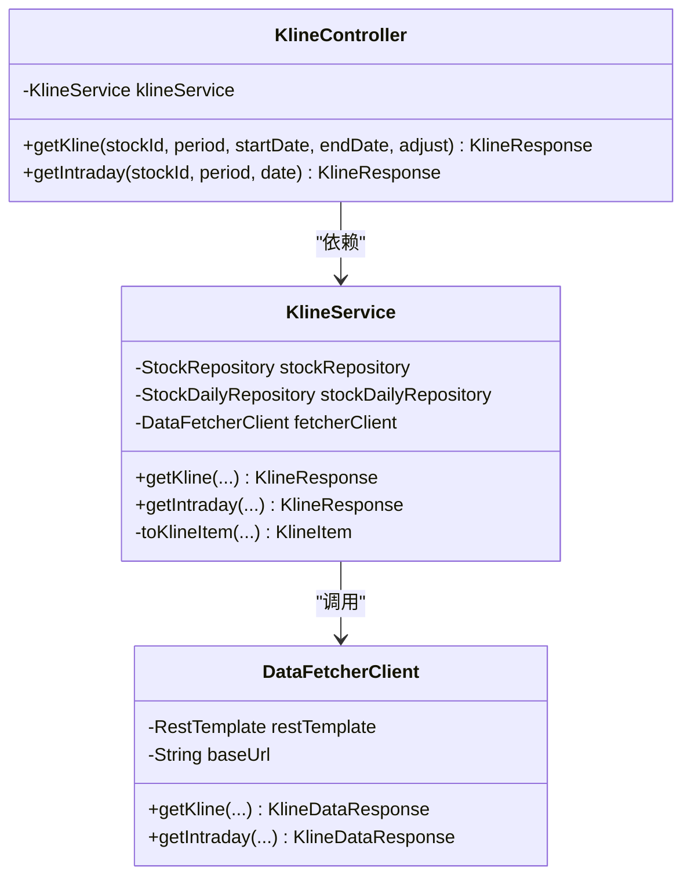
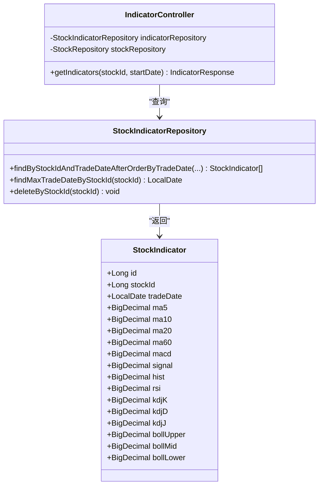
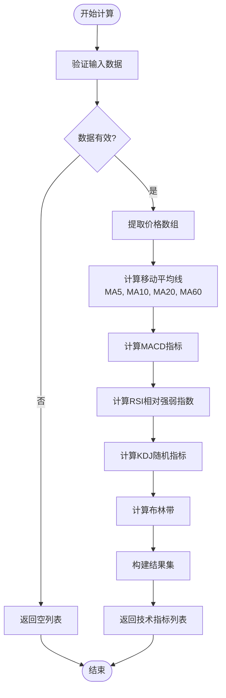
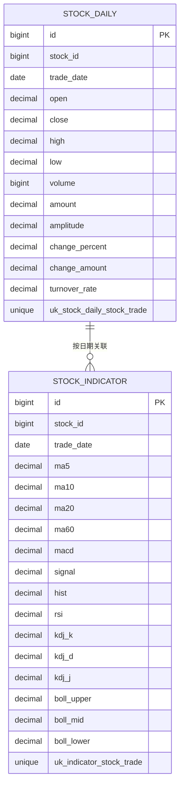
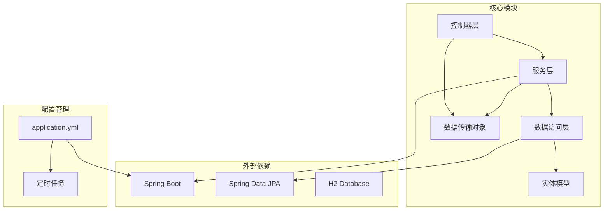

# K线与技术指标控制器

<cite>
**本文档引用的文件**
- [KlineController.java](file://backend/src/main/java/com/stock/controller/KlineController.java)
- [IndicatorController.java](file://backend/src/main/java/com/stock/controller/IndicatorController.java)
- [KlineService.java](file://backend/src/main/java/com/stock/service/KlineService.java)
- [IndicatorCalcService.java](file://backend/src/main/java/com/stock/service/IndicatorCalcService.java)
- [DataFetcherClient.java](file://backend/src/main/java/com/stock/client/DataFetcherClient.java)
- [StockDailyRepository.java](file://backend/src/main/java/com/stock/repository/StockDailyRepository.java)
- [StockIndicatorRepository.java](file://backend/src/main/java/com/stock/repository/StockIndicatorRepository.java)
- [StockDaily.java](file://backend/src/main/java/com/stock/entity/StockDaily.java)
- [StockIndicator.java](file://backend/src/main/java/com/stock/entity/StockIndicator.java)
- [KlineDataItem.java](file://backend/src/main/java/com/stock/dto/fetcher/KlineDataItem.java)
- [KlineDataResponse.java](file://backend/src/main/java/com/stock/dto/fetcher/KlineDataResponse.java)
- [KlineItem.java](file://backend/src/main/java/com/stock/dto/response/KlineItem.java)
- [KlineResponse.java](file://backend/src/main/java/com/stock/dto/response/KlineResponse.java)
- [application.yml](file://backend/src/main/resources/application.yml)
</cite>

## 目录
1. [引言](#引言)
2. [项目结构](#项目结构)
3. [核心组件](#核心组件)
4. [架构概览](#架构概览)
5. [详细组件分析](#详细组件分析)
6. [依赖关系分析](#依赖关系分析)
7. [性能考虑](#性能考虑)
8. [故障排除指南](#故障排除指南)
9. [结论](#结论)

## 引言

本文档深入分析了股票交易系统的K线与技术指标控制器实现，重点涵盖以下方面：

- K线数据获取流程：从外部数据源抓取到内部存储的完整链路
- 技术指标计算引擎：包含移动平均线(MA)、MACD、RSI、KDJ、布林带(BOLL)等核心算法
- 图表数据生成API设计：RESTful接口规范与响应格式
- 数据存储格式：数据库schema与实体映射关系
- 高频数据处理策略：批量同步、增量更新与缓存机制
- 性能优化策略：算法复杂度分析与执行效率提升方案

该系统采用分层架构设计，通过控制器层、服务层、数据访问层的清晰分离，实现了高内聚低耦合的模块化结构。

## 项目结构

系统采用经典的三层架构模式，主要分为四个层次：

**图表来源**
- [KlineController.java:1-36](file://backend/src/main/java/com/stock/controller/KlineController.java#L1-L36)
- [IndicatorController.java:1-48](file://backend/src/main/java/com/stock/controller/IndicatorController.java#L1-L48)
- [KlineService.java:1-67](file://backend/src/main/java/com/stock/service/KlineService.java#L1-L67)
- [IndicatorCalcService.java:1-210](file://backend/src/main/java/com/stock/service/IndicatorCalcService.java#L1-L210)

**章节来源**
- [KlineController.java:1-36](file://backend/src/main/java/com/stock/controller/KlineController.java#L1-L36)
- [IndicatorController.java:1-48](file://backend/src/main/java/com/stock/controller/IndicatorController.java#L1-L48)
- [application.yml:1-28](file://backend/src/main/resources/application.yml#L1-L28)

## 核心组件

### 控制器层

控制器层负责HTTP请求处理和响应封装，提供RESTful API接口。

**KlineController功能特性：**
- 支持日线、周线、月线等多种周期查询
- 支持前复权、后复权等数据调整方式
- 支持当日盘中数据获取
- 参数验证与默认值处理

**IndicatorController功能特性：**
- 基于日期范围的技术指标查询
- 自动股票存在性验证
- 统一的指标数据格式输出
- 时间序列数据排序保证

**章节来源**
- [KlineController.java:20-34](file://backend/src/main/java/com/stock/controller/KlineController.java#L20-L34)
- [IndicatorController.java:27-46](file://backend/src/main/java/com/stock/controller/IndicatorController.java#L27-L46)

### 服务层

服务层实现核心业务逻辑，包含数据转换、算法计算和业务规则处理。

**KlineService职责：**
- 股票代码验证与查询
- 外部数据源调用
- 数据格式转换
- 错误处理与异常抛出

**IndicatorCalcService职责：**
- 多种技术指标的批量计算
- 算法精度控制与数值格式化
- 时间序列数据对齐
- 性能优化的数组操作

**章节来源**
- [KlineService.java:30-59](file://backend/src/main/java/com/stock/service/KlineService.java#L30-L59)
- [IndicatorCalcService.java:15-64](file://backend/src/main/java/com/stock/service/IndicatorCalcService.java#L15-L64)

## 架构概览

系统采用微服务架构风格，通过明确的职责分离实现松耦合设计：

**图表来源**
- [KlineController.java:20-27](file://backend/src/main/java/com/stock/controller/KlineController.java#L20-L27)
- [KlineService.java:30-44](file://backend/src/main/java/com/stock/service/KlineService.java#L30-L44)
- [DataFetcherClient.java:31-35](file://backend/src/main/java/com/stock/client/DataFetcherClient.java#L31-L35)

**章节来源**
- [DataFetcherClient.java:1-126](file://backend/src/main/java/com/stock/client/DataFetcherClient.java#L1-L126)
- [StockDailyRepository.java:1-24](file://backend/src/main/java/com/stock/repository/StockDailyRepository.java#L1-L24)

## 详细组件分析

### K线控制器分析

KlineController作为K线数据的统一入口点，提供了灵活的查询接口：

**图表来源**
- [KlineController.java:10-36](file://backend/src/main/java/com/stock/controller/KlineController.java#L10-L36)
- [KlineService.java:17-67](file://backend/src/main/java/com/stock/service/KlineService.java#L17-L67)
- [DataFetcherClient.java:14-126](file://backend/src/main/java/com/stock/client/DataFetcherClient.java#L14-L126)

**API设计特点：**
- 统一的RESTful路径设计：`/api/v1/stocks/{stockId}/kline`
- 灵活的参数组合支持
- 默认值设置确保接口稳定性
- 类型安全的日期格式处理

**章节来源**
- [KlineController.java:1-36](file://backend/src/main/java/com/stock/controller/KlineController.java#L1-L36)

### 技术指标控制器分析

IndicatorController专注于技术分析数据的查询与展示：

**图表来源**
- [IndicatorController.java:15-48](file://backend/src/main/java/com/stock/controller/IndicatorController.java#L15-L48)
- [StockIndicatorRepository.java:12-21](file://backend/src/main/java/com/stock/repository/StockIndicatorRepository.java#L12-L21)
- [StockIndicator.java:18-72](file://backend/src/main/java/com/stock/entity/StockIndicator.java#L18-L72)

**数据查询策略：**
- 自动股票存在性检查
- 6个月时间窗口默认值
- 按交易日期升序排列
- 统一的指标数据格式

**章节来源**
- [IndicatorController.java:1-48](file://backend/src/main/java/com/stock/controller/IndicatorController.java#L1-L48)

### 技术指标算法实现

IndicatorCalcService实现了多种经典技术分析指标的计算：

**图表来源**
- [IndicatorCalcService.java:15-64](file://backend/src/main/java/com/stock/service/IndicatorCalcService.java#L15-L64)

**算法复杂度分析：**

1. **移动平均线(MA)计算**
   - 时间复杂度：O(n×p)，其中n为交易日数量，p为均线周期
   - 空间复杂度：O(n)
   - 优化策略：使用滑动窗口减少重复计算

2. **MACD指标计算**
   - 时间复杂度：O(n)
   - 使用指数移动平均(EMA)递推公式
   - Alpha系数预计算避免重复运算

3. **RSI指标计算**
   - 时间复杂度：O(n)
   - 使用平滑公式替代简单平均
   - 初始期处理特殊逻辑

4. **KDJ指标计算**
   - 时间复杂度：O(n×k)，其中k为寻找周期(通常为9)
   - 滑动窗口最大最小值查找
   - EMA权重系数递推计算

5. **布林带计算**
   - 时间复杂度：O(n×m)，其中m为20日周期
   - 标准差计算包含平方根运算
   - 20日均线与标准差的批量计算

**章节来源**
- [IndicatorCalcService.java:66-204](file://backend/src/main/java/com/stock/service/IndicatorCalcService.java#L66-L204)

### 数据存储与格式

系统采用关系型数据库存储K线和指标数据，通过JPA实体映射实现：

**图表来源**
- [StockDaily.java:18-60](file://backend/src/main/java/com/stock/entity/StockDaily.java#L18-L60)
- [StockIndicator.java:18-72](file://backend/src/main/java/com/stock/entity/StockIndicator.java#L18-L72)

**数据类型设计：**
- 价格字段使用decimal(10,4)确保精度
- 成交量使用bigint类型
- 金额字段使用decimal(20,4)支持大额数据
- 日期字段使用LocalDate类型

**章节来源**
- [StockDaily.java:1-60](file://backend/src/main/java/com/stock/entity/StockDaily.java#L1-L60)
- [StockIndicator.java:1-72](file://backend/src/main/java/com/stock/entity/StockIndicator.java#L1-L72)

### 外部数据集成

DataFetcherClient作为外部数据源的统一接口：

**支持的API端点：**
- `/stock/kline` - 获取历史K线数据
- `/stock/intraday` - 获取盘中数据
- `/stock/quote` - 获取实时报价
- `/stock/quotes/batch` - 批量获取报价

**数据格式转换：**
- 外部响应对象转换为内部DTO
- 字段映射与类型转换
- 空值处理与默认值设置

**章节来源**
- [DataFetcherClient.java:31-57](file://backend/src/main/java/com/stock/client/DataFetcherClient.java#L31-L57)

## 依赖关系分析

系统各组件间的依赖关系呈现清晰的层次结构：

**图表来源**
- [application.yml:1-28](file://backend/src/main/resources/application.yml#L1-L28)

**关键依赖特性：**
- Spring Boot自动配置简化开发
- JPA提供ORM功能支持
- H2内存数据库便于测试
- 定时任务调度系统数据同步

**章节来源**
- [application.yml:1-28](file://backend/src/main/resources/application.yml#L1-L28)

## 性能考虑

### 算法性能优化

1. **时间复杂度优化**
   - 移动平均线使用滑动窗口技术
   - MACD计算采用递推公式避免重复指数运算
   - RSI使用平滑公式减少循环次数

2. **空间复杂度优化**
   - 所有指标计算使用数组批量处理
   - 避免创建中间临时对象
   - 合理的BigDecimal精度控制

3. **缓存策略**
   - 预计算常用指标值
   - 结果集按日期排序便于后续查询
   - 内存中的计算结果可被多次复用

### 数据库性能优化

1. **索引设计**
   - 股票ID+交易日期复合唯一索引
   - 交易日期单独索引支持范围查询
   - 查询条件字段建立适当索引

2. **查询优化**
   - 使用原生SQL查询提高性能
   - 批量插入减少数据库往返
   - 分页查询避免大数据集加载

3. **连接池配置**
   - 合理的连接数配置
   - 连接超时时间设置
   - 连接泄漏检测

### 系统监控与调优

**定时任务配置：**
- 股价刷新：每5分钟工作时间执行
- K线数据同步：交易日15:30执行
- 资金流向同步：交易日16:00执行
- 告警检查：每1分钟工作时间执行

**性能监控指标：**
- API响应时间统计
- 数据库查询性能监控
- 内存使用情况跟踪
- GC性能分析

## 故障排除指南

### 常见问题诊断

**1. 数据获取失败**
- 检查DataFetcherClient配置URL
- 验证网络连接状态
- 查看外部数据源可用性
- 检查请求超时设置

**2. 计算结果异常**
- 验证输入数据完整性
- 检查BigDecimal精度设置
- 确认算法参数正确性
- 排查边界条件处理

**3. 数据库连接问题**
- 检查H2数据库配置
- 验证连接池设置
- 查看数据库日志
- 确认表结构完整性

**章节来源**
- [DataFetcherClient.java:112-124](file://backend/src/main/java/com/stock/client/DataFetcherClient.java#L112-L124)

### 错误处理策略

系统采用分层错误处理机制：

1. **控制器层**：捕获业务异常，返回标准化错误响应
2. **服务层**：进行数据验证和业务规则检查
3. **数据访问层**：处理数据库操作异常
4. **全局异常处理器**：统一处理未捕获异常

**异常类型分类：**
- 股票不存在异常：StockNotFoundException
- 数据获取异常：DataFetchException  
- 重复股票异常：DuplicateStockException
- 无效股票代码异常：InvalidStockCodeException

**章节来源**
- [application.yml:19-28](file://backend/src/main/resources/application.yml#L19-L28)

## 结论

本系统通过精心设计的分层架构和高效的算法实现，成功构建了一个功能完整的K线与技术指标分析平台。主要优势包括：

**架构优势：**
- 清晰的职责分离和模块化设计
- 灵活的API接口设计
- 完善的错误处理机制

**技术优势：**
- 多种技术指标的精确计算
- 高效的数据处理算法
- 合理的性能优化策略

**扩展性考虑：**
- 支持新的技术指标添加
- 可配置的参数设置
- 灵活的存储方案

未来可以进一步优化的方向包括：引入分布式缓存、实现指标计算的并行化、增加更多的技术分析工具、完善实时数据推送机制等。