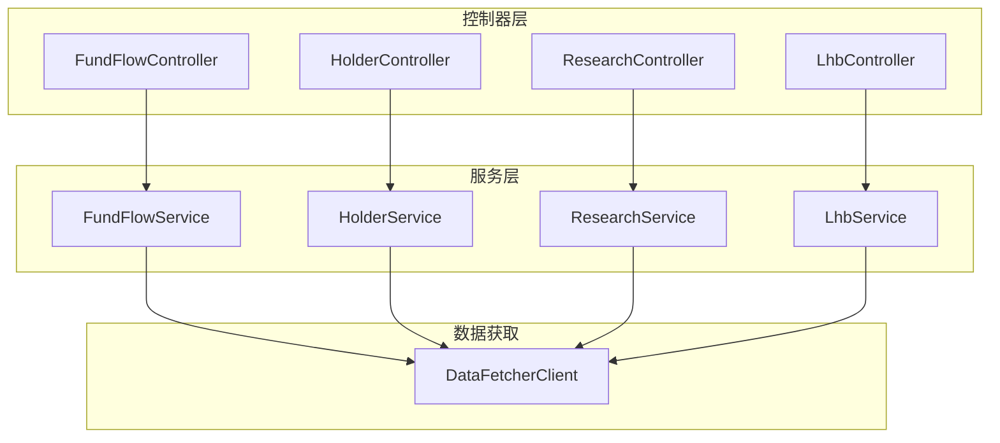
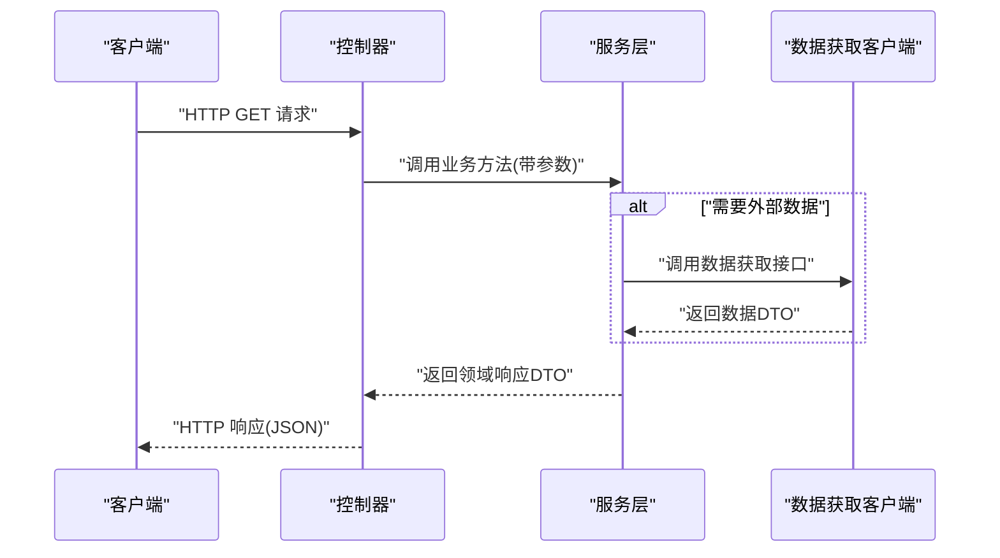
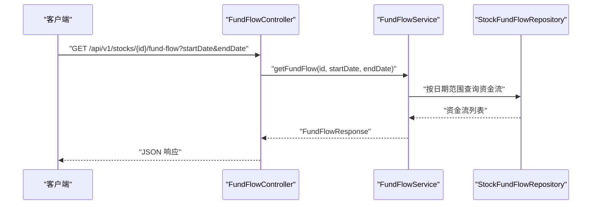
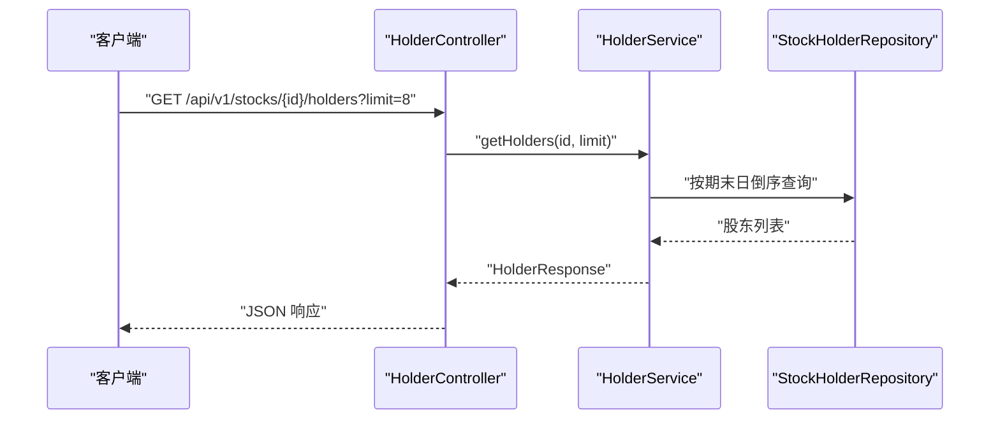
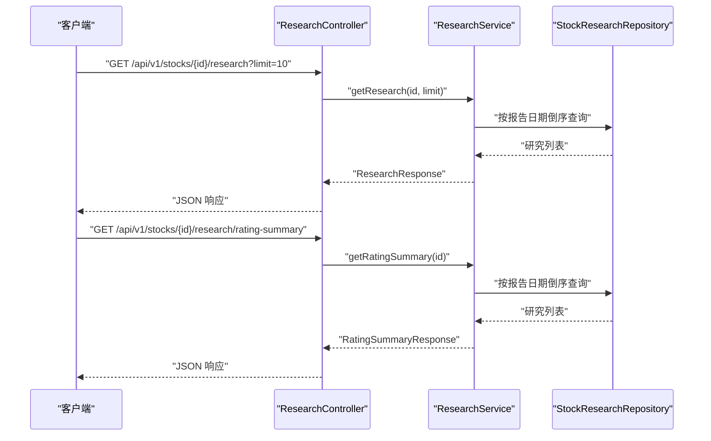
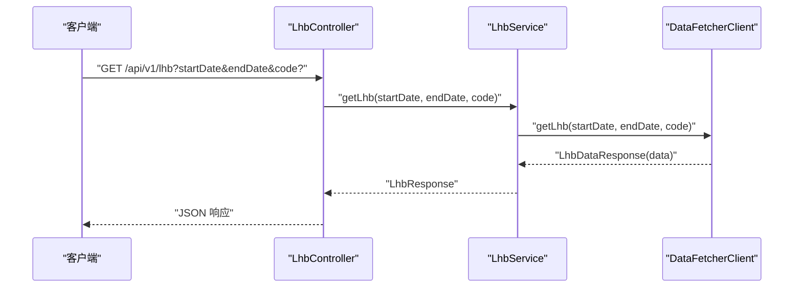
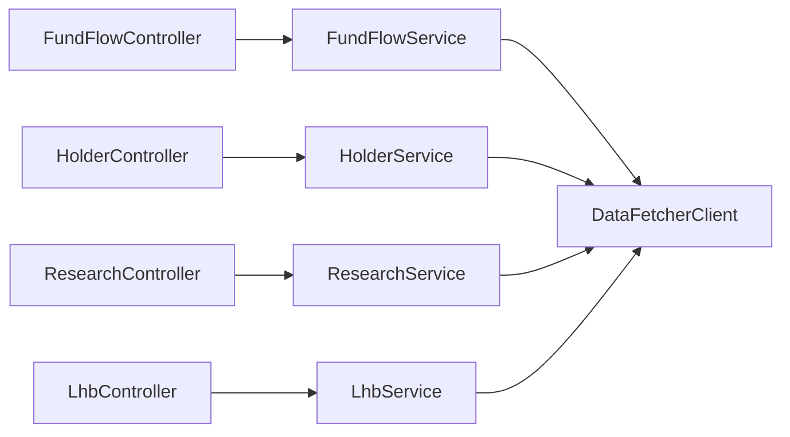

# 其他专业控制器

<cite>
**本文引用的文件**
- [FundFlowController.java](file://backend/src/main/java/com/stock/controller/FundFlowController.java)
- [HolderController.java](file://backend/src/main/java/com/stock/controller/HolderController.java)
- [ResearchController.java](file://backend/src/main/java/com/stock/controller/ResearchController.java)
- [LhbController.java](file://backend/src/main/java/com/stock/controller/LhbController.java)
- [FundFlowService.java](file://backend/src/main/java/com/stock/service/FundFlowService.java)
- [HolderService.java](file://backend/src/main/java/com/stock/service/HolderService.java)
- [ResearchService.java](file://backend/src/main/java/com/stock/service/ResearchService.java)
- [LhbService.java](file://backend/src/main/java/com/stock/service/LhbService.java)
- [DataFetcherClient.java](file://backend/src/main/java/com/stock/client/DataFetcherClient.java)
- [FundFlowDataResponse.java](file://backend/src/main/java/com/stock/dto/fetcher/FundFlowDataResponse.java)
- [HolderDataResponse.java](file://backend/src/main/java/com/stock/dto/fetcher/HolderDataResponse.java)
- [ResearchDataResponse.java](file://backend/src/main/java/com/stock/dto/fetcher/ResearchDataResponse.java)
- [LhbDataResponse.java](file://backend/src/main/java/com/stock/dto/fetcher/LhbDataResponse.java)
- [FundFlowResponse.java](file://backend/src/main/java/com/stock/dto/response/FundFlowResponse.java)
- [HolderResponse.java](file://backend/src/main/java/com/stock/dto/response/HolderResponse.java)
- [ResearchResponse.java](file://backend/src/main/java/com/stock/dto/response/ResearchResponse.java)
- [LhbResponse.java](file://backend/src/main/java/com/stock/dto/response/LhbResponse.java)
</cite>

## 目录
1. [引言](#引言)
2. [项目结构](#项目结构)
3. [核心组件](#核心组件)
4. [架构总览](#架构总览)
5. [详细组件分析](#详细组件分析)
6. [依赖分析](#依赖分析)
7. [性能考虑](#性能考虑)
8. [故障排查指南](#故障排查指南)
9. [结论](#结论)
10. [附录](#附录)

## 引言
本文件聚焦于系统中的四类专业分析控制器：资金流向（FundFlowController）、股东结构（HolderController）、研究报告（ResearchController）、龙虎榜（LhbController）。文档从控制器层到服务层、再到数据获取客户端的完整链路进行剖析，覆盖数据获取流程、数据清洗与转换、统计分析方法、专业术语处理、数据准确性验证与异常过滤机制，并给出并发处理、缓存与性能监控的最佳实践建议。

## 项目结构
- 控制器层：负责接收请求参数、调用服务层并返回标准化响应。
- 服务层：封装业务逻辑，执行查询、聚合与计算，必要时调用数据获取客户端。
- 数据获取客户端：统一访问外部数据源，屏蔽网络与序列化细节。
- DTO 层：定义请求/响应的数据结构，确保前后端契约清晰。

图表来源
- [FundFlowController.java:10-26](file://backend/src/main/java/com/stock/controller/FundFlowController.java#L10-L26)
- [HolderController.java:7-22](file://backend/src/main/java/com/stock/controller/HolderController.java#L7-L22)
- [ResearchController.java:8-28](file://backend/src/main/java/com/stock/controller/ResearchController.java#L8-L28)
- [LhbController.java:7-23](file://backend/src/main/java/com/stock/controller/LhbController.java#L7-L23)
- [FundFlowService.java:14-49](file://backend/src/main/java/com/stock/service/FundFlowService.java#L14-L49)
- [HolderService.java:13-41](file://backend/src/main/java/com/stock/service/HolderService.java#L13-L41)
- [ResearchService.java:16-86](file://backend/src/main/java/com/stock/service/ResearchService.java#L16-L86)
- [LhbService.java:11-39](file://backend/src/main/java/com/stock/service/LhbService.java#L11-L39)
- [DataFetcherClient.java:14-125](file://backend/src/main/java/com/stock/client/DataFetcherClient.java#L14-L125)

章节来源
- [FundFlowController.java:1-27](file://backend/src/main/java/com/stock/controller/FundFlowController.java#L1-L27)
- [HolderController.java:1-23](file://backend/src/main/java/com/stock/controller/HolderController.java#L1-L23)
- [ResearchController.java:1-29](file://backend/src/main/java/com/stock/controller/ResearchController.java#L1-L29)
- [LhbController.java:1-24](file://backend/src/main/java/com/stock/controller/LhbController.java#L1-L24)

## 核心组件
- 资金流向控制器与服务：支持按日期范围或默认近三个月查询，映射为统一响应结构；对空结果进行安全处理。
- 股东结构控制器与服务：按期末日倒序查询，支持限制返回条数；映射为统一响应结构。
- 研究报告控制器与服务：支持限制返回条数；提供评级汇总统计，包含共识目标价计算。
- 龙虎榜控制器与服务：通过数据获取客户端拉取，支持按代码过滤；对空数据进行兜底处理。

章节来源
- [FundFlowController.java:10-26](file://backend/src/main/java/com/stock/controller/FundFlowController.java#L10-L26)
- [FundFlowService.java:25-49](file://backend/src/main/java/com/stock/service/FundFlowService.java#L25-L49)
- [HolderController.java:7-22](file://backend/src/main/java/com/stock/controller/HolderController.java#L7-L22)
- [HolderService.java:24-41](file://backend/src/main/java/com/stock/service/HolderService.java#L24-L41)
- [ResearchController.java:8-28](file://backend/src/main/java/com/stock/controller/ResearchController.java#L8-L28)
- [ResearchService.java:27-86](file://backend/src/main/java/com/stock/service/ResearchService.java#L27-L86)
- [LhbController.java:7-23](file://backend/src/main/java/com/stock/controller/LhbController.java#L7-L23)
- [LhbService.java:20-39](file://backend/src/main/java/com/stock/service/LhbService.java#L20-L39)

## 架构总览
下图展示四类专业控制器的请求-处理-响应路径，以及与数据获取客户端的关系。

图表来源
- [FundFlowController.java:20-25](file://backend/src/main/java/com/stock/controller/FundFlowController.java#L20-L25)
- [HolderController.java:17-21](file://backend/src/main/java/com/stock/controller/HolderController.java#L17-L21)
- [ResearchController.java:18-27](file://backend/src/main/java/com/stock/controller/ResearchController.java#L18-L27)
- [LhbController.java:17-22](file://backend/src/main/java/com/stock/controller/LhbController.java#L17-L22)
- [FundFlowService.java:25-49](file://backend/src/main/java/com/stock/service/FundFlowService.java#L25-L49)
- [HolderService.java:24-41](file://backend/src/main/java/com/stock/service/HolderService.java#L24-L41)
- [ResearchService.java:27-86](file://backend/src/main/java/com/stock/service/ResearchService.java#L27-L86)
- [LhbService.java:20-39](file://backend/src/main/java/com/stock/service/LhbService.java#L20-L39)
- [DataFetcherClient.java:59-99](file://backend/src/main/java/com/stock/client/DataFetcherClient.java#L59-L99)

## 详细组件分析

### 资金流向（FundFlowController / FundFlowService）
- 控制器职责
  - 接收股票标识与可选日期范围参数，转发给服务层。
  - 返回统一的资金流响应结构。
- 服务层职责
  - 参数校验与边界处理：若未提供日期范围，默认回溯近三个月。
  - 查询与映射：将数据库记录映射为资金流明细项。
  - 异常处理：当股票不存在时抛出领域异常。
- 数据获取链路
  - 当前服务直接查询数据库，不涉及外部数据源。
- 数据清洗与统计
  - 按交易日排序输出，便于前端绘制时间序列。
  - 未见额外统计计算，主要为字段映射与裁剪。
- 专业术语处理
  - 净买额、净占比、大单/中单/小单等字段按命名规范直接映射。
- 准确性验证与异常过滤
  - 通过存在性检查避免空结果导致的空指针。
  - 日期范围边界使用当前日期与固定跨度，保证稳定性。
- 并发与性能
  - 建议在服务层增加缓存（如基于股票+日期范围的键），并结合数据库索引优化查询。

图表来源
- [FundFlowController.java:20-25](file://backend/src/main/java/com/stock/controller/FundFlowController.java#L20-L25)
- [FundFlowService.java:25-49](file://backend/src/main/java/com/stock/service/FundFlowService.java#L25-L49)

章节来源
- [FundFlowController.java:10-26](file://backend/src/main/java/com/stock/controller/FundFlowController.java#L10-L26)
- [FundFlowService.java:14-51](file://backend/src/main/java/com/stock/service/FundFlowService.java#L14-L51)
- [FundFlowResponse.java:5-8](file://backend/src/main/java/com/stock/dto/response/FundFlowResponse.java#L5-L8)

### 股东结构（HolderController / HolderService）
- 控制器职责
  - 接收股票标识与限制条数参数，转发给服务层。
- 服务层职责
  - 按期末日倒序查询股东数据，支持限制返回数量。
  - 字段映射为统一的股东结构响应项。
  - 股票存在性校验与异常处理。
- 数据获取链路
  - 直接查询数据库，不涉及外部数据源。
- 数据清洗与统计
  - 未见聚合统计，主要为字段映射与截断。
- 专业术语处理
  - 期末日、股东总数、户均持股、平均持股市值等字段按命名规范映射。
- 准确性验证与异常过滤
  - 存在性检查与列表截断，避免超界与空结果。
- 并发与性能
  - 建议增加基于股票ID的缓存，设置合理过期时间以平衡实时性与性能。

图表来源
- [HolderController.java:17-21](file://backend/src/main/java/com/stock/controller/HolderController.java#L17-L21)
- [HolderService.java:24-41](file://backend/src/main/java/com/stock/service/HolderService.java#L24-L41)

章节来源
- [HolderController.java:7-22](file://backend/src/main/java/com/stock/controller/HolderController.java#L7-L22)
- [HolderService.java:13-43](file://backend/src/main/java/com/stock/service/HolderService.java#L13-L43)
- [HolderResponse.java:5-8](file://backend/src/main/java/com/stock/dto/response/HolderResponse.java#L5-L8)

### 研究报告（ResearchController / ResearchService）
- 控制器职责
  - 提供研究报告列表与评级汇总两个端点。
- 服务层职责
  - 研究报告列表：按报告日期倒序，支持限制条数。
  - 评级汇总：统计“买入/增持/中性/减持/卖出”频次，计算共识目标价（PE×EPS 的加权平均）。
  - 专业术语处理：对评级文本进行中文关键词匹配与归类。
  - 异常处理：股票存在性校验。
- 数据获取链路
  - 直接查询数据库，不涉及外部数据源。
- 数据清洗与统计
  - 评级文本清洗（去空白）后进行关键词匹配，提升兼容性。
  - 共识目标价计算采用加权方式，权重为 PE×EPS，避免零值 EPS 导致的无效计算。
- 准确性验证与异常过滤
  - 对空评级与空预测值进行跳过处理，保证统计稳健性。
- 并发与性能
  - 建议对“评级汇总”结果进行缓存，热点股票可设置较短过期时间。

图表来源
- [ResearchController.java:18-27](file://backend/src/main/java/com/stock/controller/ResearchController.java#L18-L27)
- [ResearchService.java:27-86](file://backend/src/main/java/com/stock/service/ResearchService.java#L27-L86)

章节来源
- [ResearchController.java:8-28](file://backend/src/main/java/com/stock/controller/ResearchController.java#L8-L28)
- [ResearchService.java:16-88](file://backend/src/main/java/com/stock/service/ResearchService.java#L16-L88)
- [ResearchResponse.java:5-8](file://backend/src/main/java/com/stock/dto/response/ResearchResponse.java#L5-L8)

### 龙虎榜（LhbController / LhbService）
- 控制器职责
  - 接收起止日期与可选股票代码，转发给服务层。
- 服务层职责
  - 调用数据获取客户端获取原始数据，进行字段映射与过滤。
  - 支持按代码过滤，返回统一响应。
- 数据获取链路
  - 通过数据获取客户端访问外部数据源，封装网络调用与异常处理。
- 数据清洗与统计
  - 对空数据进行兜底处理，避免空列表引发问题。
  - 未见进一步统计计算。
- 准确性验证与异常过滤
  - 客户端统一捕获网络与反序列化异常，抛出自定义异常。
  - 服务层对空数据进行安全处理。
- 并发与性能
  - 建议对外部接口调用增加连接池与超时配置，同时在服务层增加缓存与限流策略。

图表来源
- [LhbController.java:17-22](file://backend/src/main/java/com/stock/controller/LhbController.java#L17-L22)
- [LhbService.java:20-39](file://backend/src/main/java/com/stock/service/LhbService.java#L20-L39)
- [DataFetcherClient.java:95-99](file://backend/src/main/java/com/stock/client/DataFetcherClient.java#L95-L99)

章节来源
- [LhbController.java:7-23](file://backend/src/main/java/com/stock/controller/LhbController.java#L7-L23)
- [LhbService.java:11-39](file://backend/src/main/java/com/stock/service/LhbService.java#L11-L39)
- [LhbResponse.java:5-7](file://backend/src/main/java/com/stock/dto/response/LhbResponse.java#L5-L7)
- [DataFetcherClient.java:14-125](file://backend/src/main/java/com/stock/client/DataFetcherClient.java#L14-L125)

## 依赖分析
- 控制器层仅依赖对应的服务层，职责单一，耦合度低。
- 服务层对仓储层与股票存在性校验有直接依赖，部分服务还依赖数据获取客户端。
- 数据获取客户端统一封装外部调用，提供统一异常处理与空值保护。
- DTO 层作为契约层，避免控制器与服务层直接暴露实体类。

图表来源
- [FundFlowController.java:14-18](file://backend/src/main/java/com/stock/controller/FundFlowController.java#L14-L18)
- [HolderController.java:11-15](file://backend/src/main/java/com/stock/controller/HolderController.java#L11-L15)
- [ResearchController.java:12-16](file://backend/src/main/java/com/stock/controller/ResearchController.java#L12-L16)
- [LhbController.java:11-15](file://backend/src/main/java/com/stock/controller/LhbController.java#L11-L15)
- [FundFlowService.java:17-23](file://backend/src/main/java/com/stock/service/FundFlowService.java#L17-L23)
- [HolderService.java:16-22](file://backend/src/main/java/com/stock/service/HolderService.java#L16-L22)
- [ResearchService.java:19-25](file://backend/src/main/java/com/stock/service/ResearchService.java#L19-L25)
- [LhbService.java:14-18](file://backend/src/main/java/com/stock/service/LhbService.java#L14-L18)
- [DataFetcherClient.java:17-24](file://backend/src/main/java/com/stock/client/DataFetcherClient.java#L17-L24)

章节来源
- [FundFlowController.java:1-27](file://backend/src/main/java/com/stock/controller/FundFlowController.java#L1-L27)
- [HolderController.java:1-23](file://backend/src/main/java/com/stock/controller/HolderController.java#L1-L23)
- [ResearchController.java:1-29](file://backend/src/main/java/com/stock/controller/ResearchController.java#L1-L29)
- [LhbController.java:1-24](file://backend/src/main/java/com/stock/controller/LhbController.java#L1-L24)
- [FundFlowService.java:1-51](file://backend/src/main/java/com/stock/service/FundFlowService.java#L1-L51)
- [HolderService.java:1-43](file://backend/src/main/java/com/stock/service/HolderService.java#L1-L43)
- [ResearchService.java:1-88](file://backend/src/main/java/com/stock/service/ResearchService.java#L1-L88)
- [LhbService.java:1-40](file://backend/src/main/java/com/stock/service/LhbService.java#L1-L40)
- [DataFetcherClient.java:1-126](file://backend/src/main/java/com/stock/client/DataFetcherClient.java#L1-L126)

## 性能考虑
- 缓存策略
  - 对高频查询（如评级汇总、近期资金流、近期研究报告）增加本地缓存或Redis缓存，设置合理TTL。
  - 缓存键建议包含股票ID与时间维度（如最近N天），避免脏读。
- 并发控制
  - 使用信号量或限流器限制外部数据源调用并发度，防止雪崩效应。
  - 对内部查询增加数据库连接池与超时配置，避免阻塞。
- 监控与可观测性
  - 统计各控制器的QPS、P95/P99延迟与错误率。
  - 记录外部数据源调用耗时与失败原因，便于定位瓶颈。
- 数据库优化
  - 为资金流、股东、研究报告等表建立合适的索引（如股票ID+日期）。
  - 对分页查询使用覆盖索引，减少回表。

## 故障排查指南
- 常见异常
  - 股票不存在：由服务层抛出领域异常，需检查股票ID是否正确。
  - 外部数据为空：客户端会抛出自定义异常，需检查数据源可用性与参数格式。
  - 空响应：服务层对空数据进行兜底处理，仍建议记录日志以便追踪。
- 排查步骤
  - 检查控制器入参（日期范围、limit、代码）是否符合预期。
  - 查看服务层是否存在性校验与边界处理逻辑。
  - 对外部接口调用，确认URL、超时与重试策略配置。
  - 关注异常处理器是否正确捕获并返回标准错误格式。

章节来源
- [FundFlowService.java:26-28](file://backend/src/main/java/com/stock/service/FundFlowService.java#L26-L28)
- [HolderService.java:25-27](file://backend/src/main/java/com/stock/service/HolderService.java#L25-L27)
- [ResearchService.java:49-51](file://backend/src/main/java/com/stock/service/ResearchService.java#L49-L51)
- [LhbService.java:20-39](file://backend/src/main/java/com/stock/service/LhbService.java#L20-L39)
- [DataFetcherClient.java:112-124](file://backend/src/main/java/com/stock/client/DataFetcherClient.java#L112-L124)

## 结论
四类专业控制器在架构上保持一致的分层设计：控制器负责参数与路由，服务层负责业务与数据处理，数据获取客户端负责外部集成。资金流、股东结构与研究报告主要依赖数据库查询，龙虎榜通过客户端访问外部数据。建议在现有基础上完善缓存、限流与监控体系，以提升高并发场景下的稳定性与性能表现。

## 附录
- 专业术语速览
  - 资金流向：主力净流入/净占比、大单/中单/小单净额与占比。
  - 股东结构：期末日、股东总数、户均持股、平均持股市值、合计持股比例。
  - 研究报告：评级（买入/增持/中性/减持/卖出）、机构名称、报告日期、目标价/PE预测、行业与PDF链接。
  - 龙虎榜：涨跌幅、净买入金额、买入/卖出金额、换手率、上榜原因与说明。