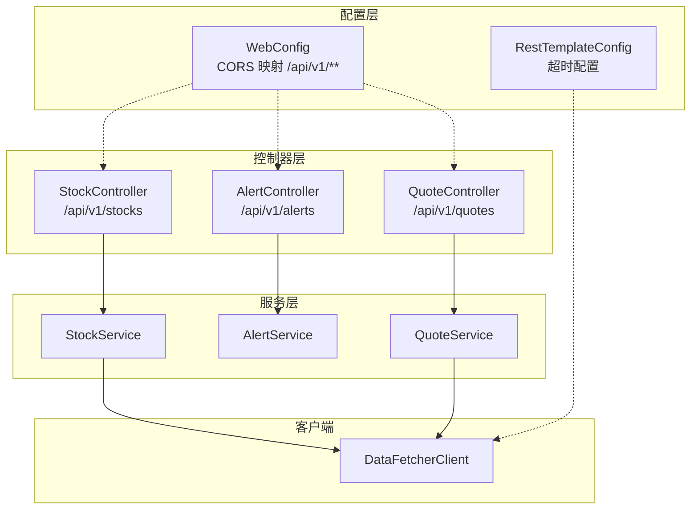
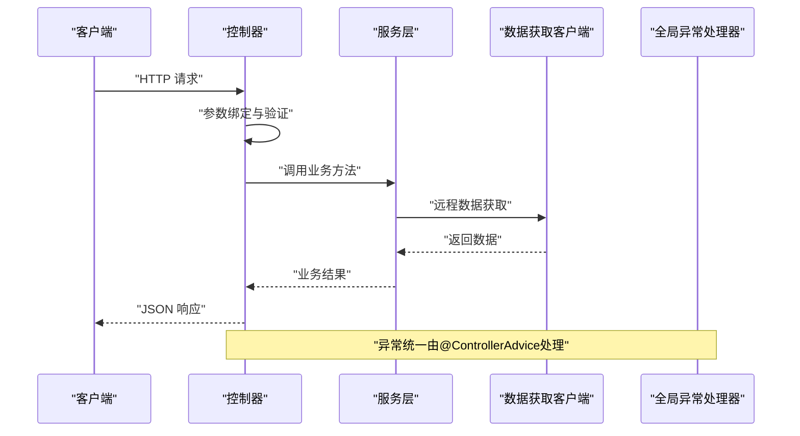
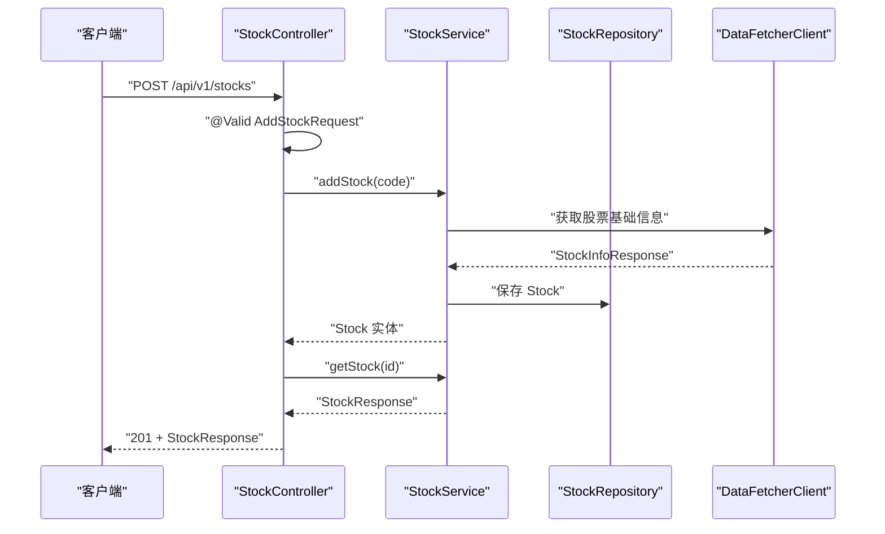
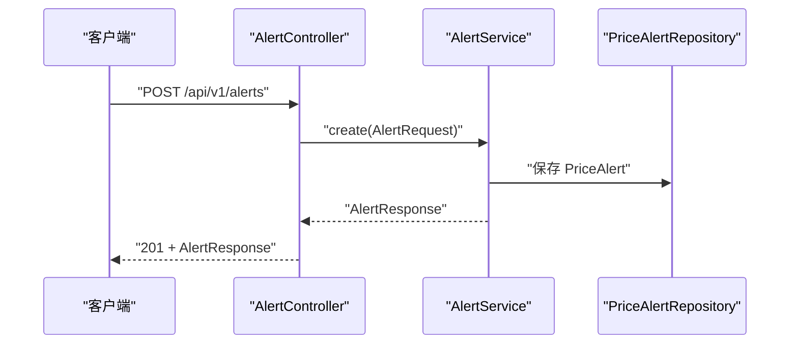
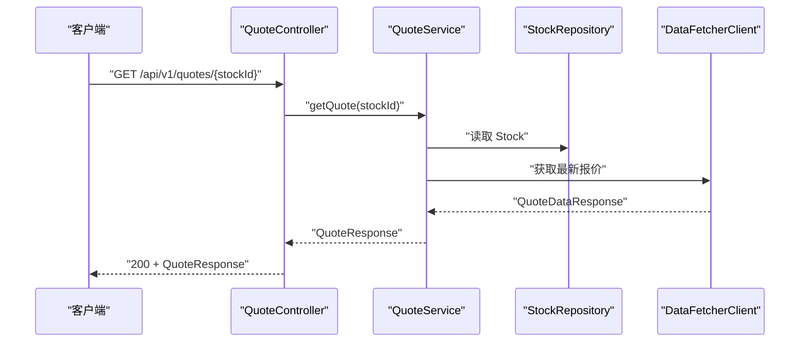
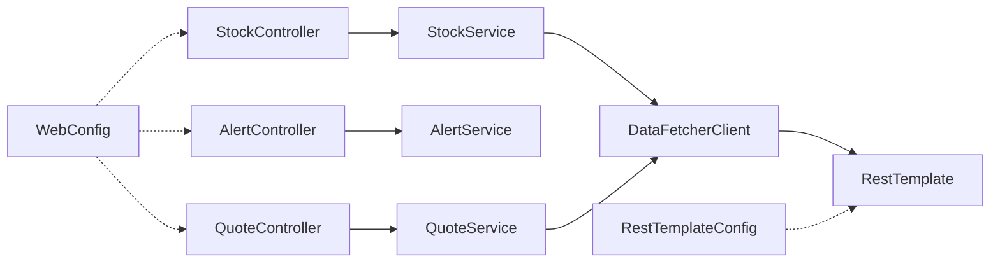
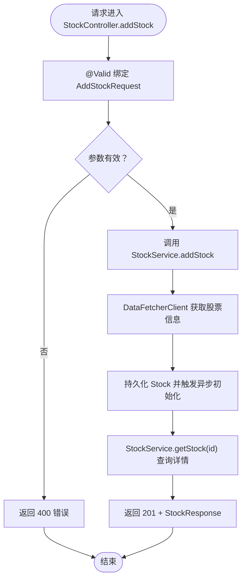

# 控制器层实现

<cite>
**本文引用的文件**
- [StockController.java](file://backend/src/main/java/com/stock/controller/StockController.java)
- [AlertController.java](file://backend/src/main/java/com/stock/controller/AlertController.java)
- [QuoteController.java](file://backend/src/main/java/com/stock/controller/QuoteController.java)
- [WebConfig.java](file://backend/src/main/java/com/stock/config/WebConfig.java)
- [RestTemplateConfig.java](file://backend/src/main/java/com/stock/config/RestTemplateConfig.java)
- [AddStockRequest.java](file://backend/src/main/java/com/stock/dto/request/AddStockRequest.java)
- [StockResponse.java](file://backend/src/main/java/com/stock/dto/response/StockResponse.java)
- [StockService.java](file://backend/src/main/java/com/stock/service/StockService.java)
- [AlertService.java](file://backend/src/main/java/com/stock/service/AlertService.java)
- [QuoteService.java](file://backend/src/main/java/com/stock/service/QuoteService.java)
- [DataFetcherClient.java](file://backend/src/main/java/com/stock/client/DataFetcherClient.java)
- [GlobalExceptionHandler.java](file://backend/src/main/java/com/stock/exception/GlobalExceptionHandler.java)
- [StockControllerTest.java](file://backend/src/test/java/com/stock/controller/StockControllerTest.java)
- [AlertControllerTest.java](file://backend/src/test/java/com/stock/controller/AlertControllerTest.java)
- [StockApplication.java](file://backend/src/main/java/com/stock/StockApplication.java)
- [application.yml](file://backend/src/main/resources/application.yml)
</cite>

## 目录
1. [引言](#引言)
2. [项目结构](#项目结构)
3. [核心组件](#核心组件)
4. [架构总览](#架构总览)
5. [详细组件分析](#详细组件分析)
6. [依赖分析](#依赖分析)
7. [性能考虑](#性能考虑)
8. [故障排查指南](#故障排查指南)
9. [结论](#结论)
10. [附录](#附录)

## 引言
本文件聚焦于后端控制器层的实现细节，系统性阐述以下主题：
- @RestController 与 @RequestMapping 的使用方式与路径映射策略
- 控制器方法的参数绑定（路径变量、查询参数、请求体）与验证
- 请求体解析与响应数据格式化（JSON）
- 控制器与服务层的交互模式与依赖注入机制
- 典型 API 的处理流程与示例
- 单元测试策略与编写方法
- 性能优化建议与常见问题解决方案

## 项目结构
控制器层位于 backend/src/main/java/com/stock/controller，采用按功能域分层的组织方式：每个业务模块对应一个控制器类，统一通过 @RestController 声明 REST 接口，并在类级别使用 @RequestMapping 定义版本化的基础路径。

图表来源
- [StockController.java:17-56](file://backend/src/main/java/com/stock/controller/StockController.java#L17-L56)
- [AlertController.java:13-39](file://backend/src/main/java/com/stock/controller/AlertController.java#L13-L39)
- [QuoteController.java:8-27](file://backend/src/main/java/com/stock/controller/QuoteController.java#L8-L27)
- [WebConfig.java:6-14](file://backend/src/main/java/com/stock/config/WebConfig.java#L6-L14)
- [RestTemplateConfig.java:9-17](file://backend/src/main/java/com/stock/config/RestTemplateConfig.java#L9-L17)
- [StockService.java:28-91](file://backend/src/main/java/com/stock/service/StockService.java#L28-L91)
- [AlertService.java:15-24](file://backend/src/main/java/com/stock/service/AlertService.java#L15-L24)
- [QuoteService.java:18-28](file://backend/src/main/java/com/stock/service/QuoteService.java#L18-L28)
- [DataFetcherClient.java:14-24](file://backend/src/main/java/com/stock/client/DataFetcherClient.java#L14-L24)

章节来源
- [StockController.java:17-56](file://backend/src/main/java/com/stock/controller/StockController.java#L17-L56)
- [AlertController.java:13-39](file://backend/src/main/java/com/stock/controller/AlertController.java#L13-L39)
- [QuoteController.java:8-27](file://backend/src/main/java/com/stock/controller/QuoteController.java#L8-L27)
- [WebConfig.java:6-14](file://backend/src/main/java/com/stock/config/WebConfig.java#L6-L14)
- [RestTemplateConfig.java:9-17](file://backend/src/main/java/com/stock/config/RestTemplateConfig.java#L9-L17)

## 核心组件
- 控制器注解与路径映射
  - @RestController：声明该类为 REST 控制器，返回值默认序列化为 JSON
  - @RequestMapping：定义版本化基础路径，如 /api/v1/stocks、/api/v1/alerts、/api/v1/quotes
- 参数绑定与验证
  - @PathVariable：从路径中提取 ID 等标识符
  - @RequestParam：从查询字符串解析可选参数
  - @RequestBody + @Valid：解析请求体并进行 Bean 验证（如 AddStockRequest 的长度与格式校验）
- 响应封装
  - 使用 ResponseEntity 封装状态码与响应体；常用 201、204、200
  - 返回类型为 DTO 记录类，确保前后端契约清晰

章节来源
- [StockController.java:17-56](file://backend/src/main/java/com/stock/controller/StockController.java#L17-L56)
- [AlertController.java:13-39](file://backend/src/main/java/com/stock/controller/AlertController.java#L13-L39)
- [QuoteController.java:8-27](file://backend/src/main/java/com/stock/controller/QuoteController.java#L8-L27)
- [AddStockRequest.java:7-9](file://backend/src/main/java/com/stock/dto/request/AddStockRequest.java#L7-L9)

## 架构总览
控制器层负责接收 HTTP 请求，完成参数绑定与验证，随后调用服务层执行业务逻辑，并将结果以标准 JSON 响应返回。异常由全局异常处理器统一捕获并转换为标准化错误响应。

图表来源
- [StockController.java:29-55](file://backend/src/main/java/com/stock/controller/StockController.java#L29-L55)
- [AlertController.java:23-38](file://backend/src/main/java/com/stock/controller/AlertController.java#L23-L38)
- [QuoteController.java:18-26](file://backend/src/main/java/com/stock/controller/QuoteController.java#L18-L26)
- [StockService.java:93-163](file://backend/src/main/java/com/stock/service/StockService.java#L93-L163)
- [AlertService.java:26-61](file://backend/src/main/java/com/stock/service/AlertService.java#L26-L61)
- [QuoteService.java:30-96](file://backend/src/main/java/com/stock/service/QuoteService.java#L30-L96)
- [GlobalExceptionHandler.java:7-32](file://backend/src/main/java/com/stock/exception/GlobalExceptionHandler.java#L7-L32)

## 详细组件分析

### 股票控制器 StockController
职责与接口
- 新增股票：POST /api/v1/stocks，请求体为 AddStockRequest，返回 201 与 StockResponse
- 删除股票：DELETE /api/v1/stocks/{id}，返回 204
- 列表股票：GET /api/v1/stocks，返回列表
- 查询单只股票：GET /api/v1/stocks/{id}，返回 StockResponse
- 获取初始化状态：GET /api/v1/stocks/{id}/init-status，返回 InitStatusResponse

参数绑定与验证
- @RequestBody + @Valid：对 AddStockRequest 进行非空、长度与格式校验
- @PathVariable：从路径提取 Long 类型的 id
- 返回值类型均为 DTO 记录类，确保字段一致

依赖注入与服务交互
- 通过构造函数注入 StockService 与 DataInitService
- 新增股票流程：调用 StockService.addStock 后再查询详情返回

图表来源
- [StockController.java:29-34](file://backend/src/main/java/com/stock/controller/StockController.java#L29-L34)
- [StockService.java:93-163](file://backend/src/main/java/com/stock/service/StockService.java#L93-L163)
- [DataFetcherClient.java:26-29](file://backend/src/main/java/com/stock/client/DataFetcherClient.java#L26-L29)

章节来源
- [StockController.java:17-56](file://backend/src/main/java/com/stock/controller/StockController.java#L17-L56)
- [StockController.java:29-34](file://backend/src/main/java/com/stock/controller/StockController.java#L29-L34)
- [StockService.java:93-163](file://backend/src/main/java/com/stock/service/StockService.java#L93-L163)
- [AddStockRequest.java:7-9](file://backend/src/main/java/com/stock/dto/request/AddStockRequest.java#L7-L9)
- [StockResponse.java:7-24](file://backend/src/main/java/com/stock/dto/response/StockResponse.java#L7-L24)

### 价格提醒控制器 AlertController
职责与接口
- 列出提醒：GET /api/v1/alerts?stockId={id}，返回列表
- 创建提醒：POST /api/v1/alerts，返回 201
- 删除提醒：DELETE /api/v1/alerts/{id}，返回 204

参数绑定与验证
- @RequestParam(required=false) Long stockId：可选查询参数
- @RequestBody + @Valid：对 AlertRequest 进行验证

服务交互
- 调用 AlertService.list/create/delete

图表来源
- [AlertController.java:23-32](file://backend/src/main/java/com/stock/controller/AlertController.java#L23-L32)
- [AlertService.java:41-56](file://backend/src/main/java/com/stock/service/AlertService.java#L41-L56)

章节来源
- [AlertController.java:13-39](file://backend/src/main/java/com/stock/controller/AlertController.java#L13-L39)
- [AlertService.java:26-61](file://backend/src/main/java/com/stock/service/AlertService.java#L26-L61)

### 实时行情控制器 QuoteController
职责与接口
- 获取行情：GET /api/v1/quotes/{stockId}
- 批量刷新：POST /api/v1/quotes/refresh

参数绑定
- @PathVariable Long stockId
- 无请求体参数

服务交互
- 调用 QuoteService.getQuote/refreshAll

图表来源
- [QuoteController.java:18-21](file://backend/src/main/java/com/stock/controller/QuoteController.java#L18-L21)
- [QuoteService.java:30-61](file://backend/src/main/java/com/stock/service/QuoteService.java#L30-L61)
- [DataFetcherClient.java:43-46](file://backend/src/main/java/com/stock/client/DataFetcherClient.java#L43-L46)

章节来源
- [QuoteController.java:8-27](file://backend/src/main/java/com/stock/controller/QuoteController.java#L8-L27)
- [QuoteService.java:30-96](file://backend/src/main/java/com/stock/service/QuoteService.java#L30-L96)

## 依赖分析
- 控制器到服务层
  - StockController 依赖 StockService 与 DataInitService
  - AlertController 依赖 AlertService
  - QuoteController 依赖 QuoteService
- 服务层到客户端
  - StockService 与 QuoteService 依赖 DataFetcherClient
- 客户端到外部数据源
  - DataFetcherClient 通过 RestTemplate 访问 http://localhost:5001
- 配置与跨域
  - WebConfig 对 /api/v1/** 开启 CORS
  - RestTemplateConfig 设置连接与读取超时

图表来源
- [StockController.java:21-27](file://backend/src/main/java/com/stock/controller/StockController.java#L21-L27)
- [AlertController.java:17-21](file://backend/src/main/java/com/stock/controller/AlertController.java#L17-L21)
- [QuoteController.java:12-16](file://backend/src/main/java/com/stock/controller/QuoteController.java#L12-L16)
- [StockService.java:47-48](file://backend/src/main/java/com/stock/service/StockService.java#L47-L48)
- [QuoteService.java:22-23](file://backend/src/main/java/com/stock/service/QuoteService.java#L22-L23)
- [DataFetcherClient.java:17-24](file://backend/src/main/java/com/stock/client/DataFetcherClient.java#L17-L24)
- [WebConfig.java:8-12](file://backend/src/main/java/com/stock/config/WebConfig.java#L8-L12)
- [RestTemplateConfig.java:10-16](file://backend/src/main/java/com/stock/config/RestTemplateConfig.java#L10-L16)

章节来源
- [StockController.java:21-27](file://backend/src/main/java/com/stock/controller/StockController.java#L21-L27)
- [AlertController.java:17-21](file://backend/src/main/java/com/stock/controller/AlertController.java#L17-L21)
- [QuoteController.java:12-16](file://backend/src/main/java/com/stock/controller/QuoteController.java#L12-L16)
- [StockService.java:47-48](file://backend/src/main/java/com/stock/service/StockService.java#L47-L48)
- [QuoteService.java:22-23](file://backend/src/main/java/com/stock/service/QuoteService.java#L22-L23)
- [DataFetcherClient.java:17-24](file://backend/src/main/java/com/stock/client/DataFetcherClient.java#L17-L24)
- [WebConfig.java:8-12](file://backend/src/main/java/com/stock/config/WebConfig.java#L8-L12)
- [RestTemplateConfig.java:10-16](file://backend/src/main/java/com/stock/config/RestTemplateConfig.java#L10-L16)

## 性能考虑
- 异步初始化与事务同步
  - 在新增股票成功提交后，通过事务同步回调触发异步初始化，避免并发读取未落库数据
- 批量刷新与错误隔离
  - 批量刷新行情时逐个处理并记录明细，失败不影响整体流程
- 超时控制
  - RestTemplateConfig 设置连接与读取超时，防止阻塞影响接口可用性
- 缓存与回源
  - 若缓存缺失，先尝试回源获取，再回写缓存，减少重复调用

章节来源
- [StockService.java:145-160](file://backend/src/main/java/com/stock/service/StockService.java#L145-L160)
- [QuoteService.java:63-82](file://backend/src/main/java/com/stock/service/QuoteService.java#L63-L82)
- [RestTemplateConfig.java:10-16](file://backend/src/main/java/com/stock/config/RestTemplateConfig.java#L10-L16)

## 故障排查指南
- 统一异常处理
  - 全局异常处理器将业务异常映射为标准化错误响应，包括 404、409、400、503 等
- 常见问题定位
  - 参数校验失败：检查 @Valid 与字段约束（如 AddStockRequest 的长度与正则）
  - 股票代码无效或重复：查看 StockService 中的异常抛出点
  - 数据获取失败：确认 DataFetcherClient 的远端地址与可达性
  - CORS 问题：确认 WebConfig 的映射范围与允许的方法/头

章节来源
- [GlobalExceptionHandler.java:7-32](file://backend/src/main/java/com/stock/exception/GlobalExceptionHandler.java#L7-L32)
- [StockService.java:95-105](file://backend/src/main/java/com/stock/service/StockService.java#L95-L105)
- [DataFetcherClient.java:19-20](file://backend/src/main/java/com/stock/client/DataFetcherClient.java#L19-L20)
- [WebConfig.java:8-12](file://backend/src/main/java/com/stock/config/WebConfig.java#L8-L12)

## 结论
控制器层通过明确的路径映射、严格的参数绑定与验证、以及与服务层清晰的职责划分，实现了高内聚、低耦合的 REST 接口设计。配合全局异常处理与配置层的跨域与超时设置，整体具备良好的可维护性与稳定性。建议在后续迭代中持续完善测试覆盖与监控埋点，以进一步提升可观测性与可靠性。

## 附录

### 控制器与服务交互模式与依赖注入
- 构造函数注入：所有控制器均通过构造函数注入所需服务，保证不可变性与可测试性
- 事务边界：服务层使用 @Transactional 包裹数据库操作，确保一致性
- 异步初始化：通过 TransactionSynchronizationManager 注册 afterCommit 回调，保障异步任务可见性

章节来源
- [StockController.java:24-27](file://backend/src/main/java/com/stock/controller/StockController.java#L24-L27)
- [AlertController.java:19-21](file://backend/src/main/java/com/stock/controller/AlertController.java#L19-L21)
- [QuoteController.java:14-16](file://backend/src/main/java/com/stock/controller/QuoteController.java#L14-L16)
- [StockService.java:93-163](file://backend/src/main/java/com/stock/service/StockService.java#L93-L163)

### 测试策略与编写方法
- 单元测试
  - 使用 MockMvc 对控制器进行端到端测试，模拟 HTTP 请求与响应
  - 使用 @Mock 注入服务依赖，@InjectMocks 创建被测控制器实例
  - 断言状态码与 JSONPath 字段，确保响应结构正确
- 示例场景
  - 列表股票：验证返回列表结构与关键字段
  - 新增股票：验证 201 状态与响应体字段
  - 查询单只股票：验证响应体字段
  - 删除股票：验证 204 状态
  - 获取初始化状态：验证聚合状态字段

章节来源
- [StockControllerTest.java:30-115](file://backend/src/test/java/com/stock/controller/StockControllerTest.java#L30-L115)
- [AlertControllerTest.java:25-72](file://backend/src/test/java/com/stock/controller/AlertControllerTest.java#L25-L72)

### API 请求处理流程图（新增股票）

图表来源
- [StockController.java:29-34](file://backend/src/main/java/com/stock/controller/StockController.java#L29-L34)
- [StockService.java:93-163](file://backend/src/main/java/com/stock/service/StockService.java#L93-L163)
- [DataFetcherClient.java:26-29](file://backend/src/main/java/com/stock/client/DataFetcherClient.java#L26-L29)