# 竞争力分析控制器

<cite>
**本文档引用的文件**
- [CompetitivenessController.java](file://backend/src/main/java/com/stock/controller/CompetitivenessController.java)
- [CompetitivenessService.java](file://backend/src/main/java/com/stock/service/CompetitivenessService.java)
- [CompetitivenessRequest.java](file://backend/src/main/java/com/stock/dto/request/CompetitivenessRequest.java)
- [CompetitivenessResponse.java](file://backend/src/main/java/com/stock/dto/response/CompetitivenessResponse.java)
- [StockCompetitiveness.java](file://backend/src/main/java/com/stock/entity/StockCompetitiveness.java)
- [StockCompetitivenessRepository.java](file://backend/src/main/java/com/stock/repository/StockCompetitivenessRepository.java)
- [CompetitorController.java](file://backend/src/main/java/com/stock/controller/CompetitorController.java)
- [CompetitorService.java](file://backend/src/main/java/com/stock/service/CompetitorService.java)
- [CompetitorResponse.java](file://backend/src/main/java/com/stock/dto/response/CompetitorResponse.java)
- [StockCompetitorRepository.java](file://backend/src/main/java/com/stock/repository/StockCompetitorRepository.java)
- [HtmlSanitizer.java](file://backend/src/main/java/com/stock/util/HtmlSanitizer.java)
- [StockNotFoundException.java](file://backend/src/main/java/com/stock/exception/StockNotFoundException.java)
- [CompetitivenessControllerTest.java](file://backend/src/test/java/com/stock/controller/CompetitivenessControllerTest.java)
- [CompetitivenessServiceTest.java](file://backend/src/test/java/com/stock/service/CompetitivenessServiceTest.java)
- [CompetitivenessTab.vue](file://frontend/src/views/tabs/CompetitivenessTab.vue)
- [manual.ts](file://frontend/src/api/manual.ts)
</cite>

## 目录
1. [简介](#简介)
2. [项目结构](#项目结构)
3. [核心组件](#核心组件)
4. [架构概览](#架构概览)
5. [详细组件分析](#详细组件分析)
6. [依赖关系分析](#依赖关系分析)
7. [性能考虑](#性能考虑)
8. [故障排除指南](#故障排除指南)
9. [结论](#结论)

## 简介

竞争力分析控制器是股票交易系统中的核心功能模块，负责企业竞争力评估、市场份额分析和竞争优势识别。该系统通过RESTful API提供完整的竞争力数据管理能力，支持用户对目标公司的市场地位、竞争优势和护城河进行量化评估。

系统采用分层架构设计，包含控制器层、服务层、数据访问层和实体模型层，确保了良好的代码组织和可维护性。前端通过Vue.js框架提供直观的用户界面，支持实时数据展示和交互操作。

## 项目结构

竞争力分析功能在项目中的组织结构如下：

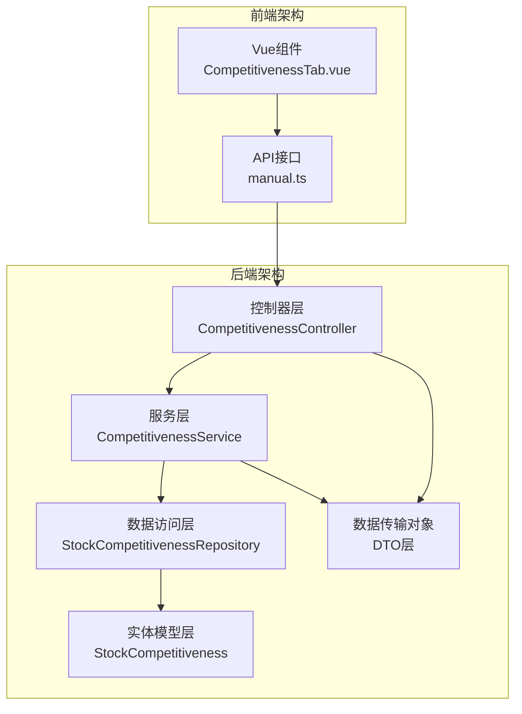

**图表来源**
- [CompetitivenessController.java:1-30](file://backend/src/main/java/com/stock/controller/CompetitivenessController.java#L1-L30)
- [CompetitivenessService.java:1-64](file://backend/src/main/java/com/stock/service/CompetitivenessService.java#L1-L64)

**章节来源**
- [CompetitivenessController.java:1-30](file://backend/src/main/java/com/stock/controller/CompetitivenessController.java#L1-L30)
- [CompetitivenessService.java:1-64](file://backend/src/main/java/com/stock/service/CompetitivenessService.java#L1-L64)

## 核心组件

### 控制器层组件

控制器层采用Spring MVC注解驱动的方式，提供RESTful API接口：

- **CompetitivenessController**: 主要控制器，处理竞争力相关请求
- **CompetitorController**: 竞品管理控制器，处理竞品相关操作

### 服务层组件

服务层负责业务逻辑处理和数据验证：

- **CompetitivenessService**: 核心服务，处理竞争力数据的CRUD操作
- **CompetitorService**: 竞品管理服务，处理竞品关系的维护

### 数据传输对象

系统使用Java Records作为数据传输对象，确保数据的不可变性和类型安全：

- **CompetitivenessRequest**: 输入请求数据对象
- **CompetitivenessResponse**: 输出响应数据对象
- **CompetitorResponse**: 竞品信息响应对象

**章节来源**
- [CompetitivenessController.java:9-29](file://backend/src/main/java/com/stock/controller/CompetitivenessController.java#L9-L29)
- [CompetitivenessService.java:16-63](file://backend/src/main/java/com/stock/service/CompetitivenessService.java#L16-L63)
- [CompetitivenessRequest.java:6-13](file://backend/src/main/java/com/stock/dto/request/CompetitivenessRequest.java#L6-L13)
- [CompetitivenessResponse.java:6-15](file://backend/src/main/java/com/stock/dto/response/CompetitivenessResponse.java#L6-L15)

## 架构概览

竞争力分析系统的整体架构采用经典的三层架构模式：

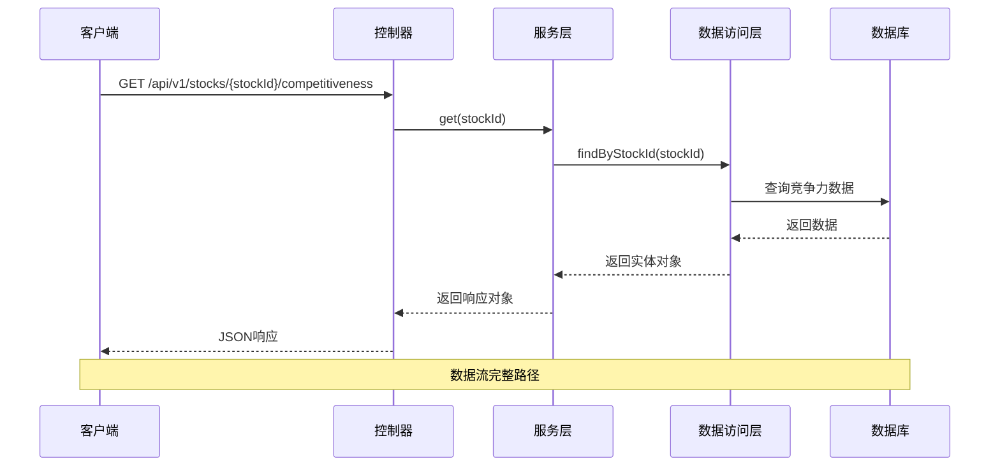

**图表来源**
- [CompetitivenessController.java:19-22](file://backend/src/main/java/com/stock/controller/CompetitivenessController.java#L19-L22)
- [CompetitivenessService.java:27-36](file://backend/src/main/java/com/stock/service/CompetitivenessService.java#L27-L36)

系统架构特点：
- **分层清晰**: 每一层职责明确，便于维护和扩展
- **依赖注入**: 使用Spring框架的依赖注入机制
- **事务管理**: 关键操作采用声明式事务管理
- **数据验证**: 前后端双重数据验证机制

## 详细组件分析

### CompetitivenessController 类分析

CompetitivenessController是竞争力分析的核心控制器，提供了两个主要的REST API端点：

#### API 设计

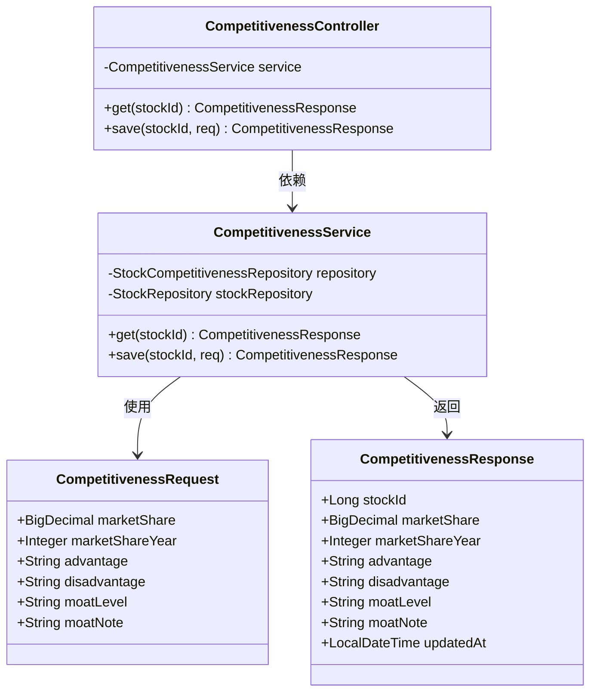

**图表来源**
- [CompetitivenessController.java:11-29](file://backend/src/main/java/com/stock/controller/CompetitivenessController.java#L11-L29)
- [CompetitivenessService.java:17-63](file://backend/src/main/java/com/stock/service/CompetitivenessService.java#L17-L63)
- [CompetitivenessRequest.java:6-13](file://backend/src/main/java/com/stock/dto/request/CompetitivenessRequest.java#L6-L13)
- [CompetitivenessResponse.java:6-15](file://backend/src/main/java/com/stock/dto/response/CompetitivenessResponse.java#L6-L15)

#### API 端点说明

| 方法 | 路径 | 功能描述 |
|------|------|----------|
| GET | `/api/v1/stocks/{stockId}/competitiveness` | 获取指定股票的竞争力数据 |
| PUT | `/api/v1/stocks/{stockId}/competitiveness` | 保存或更新竞争力数据 |

#### 数据验证机制

系统实现了严格的输入验证机制：

- **市场份额验证**: 0-100之间的数值范围
- **年份验证**: 2000-2100的有效年份范围  
- **文本长度限制**: 竞争优势和劣势描述不超过10000字符
- **护城河说明**: 不超过5000字符的详细说明

**章节来源**
- [CompetitivenessController.java:19-28](file://backend/src/main/java/com/stock/controller/CompetitivenessController.java#L19-L28)
- [CompetitivenessRequest.java:7-12](file://backend/src/main/java/com/stock/dto/request/CompetitivenessRequest.java#L7-L12)

### 竞争力指标计算算法

系统采用多维度评分体系来评估企业竞争力：

#### 市场份额分析算法

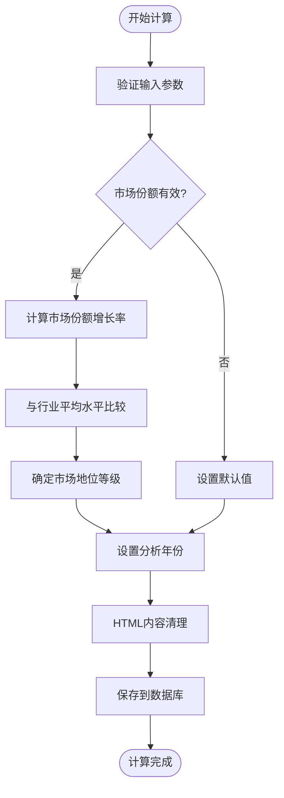

**图表来源**
- [CompetitivenessService.java:38-62](file://backend/src/main/java/com/stock/service/CompetitivenessService.java#L38-L62)
- [HtmlSanitizer.java:10-13](file://backend/src/main/java/com/stock/util/HtmlSanitizer.java#L10-L13)

#### 竞争优势识别算法

系统通过以下维度识别竞争优势：

1. **品牌护城河**: 品牌知名度、客户忠诚度
2. **成本优势**: 规模效应、供应链优势
3. **技术壁垒**: 研发能力、专利保护
4. **网络效应**: 平台价值、生态建设
5. **监管优势**: 许可证、政策支持

#### 护城河等级评估

| 等级 | 描述 | 特征 |
|------|------|------|
| STRONG | 强护城河 | 多重竞争优势，难以复制 |
| MEDIUM | 中等护城河 | 单一或少数优势 |
| WEAK | 弱护城河 | 缺乏明显优势 |

**章节来源**
- [CompetitivenessService.java:50-56](file://backend/src/main/java/com/stock/service/CompetitivenessService.java#L50-L56)
- [CompetitivenessRequest.java:11](file://backend/src/main/java/com/stock/dto/request/CompetitivenessRequest.java#L11)

### 数据来源整合机制

系统通过多种数据源整合竞争力相关信息：

#### 内部数据源

- **股价数据**: 最新价格、涨跌幅、市盈率
- **财务数据**: 市值、市值变化
- **基本数据**: 股票代码、公司名称

#### 外部数据集成

- **实时行情**: 通过DataFetcherClient获取最新股价
- **行业对比**: 与同行业其他公司进行横向对比
- **历史数据**: 历史市场份额变化趋势分析

#### 数据同步策略

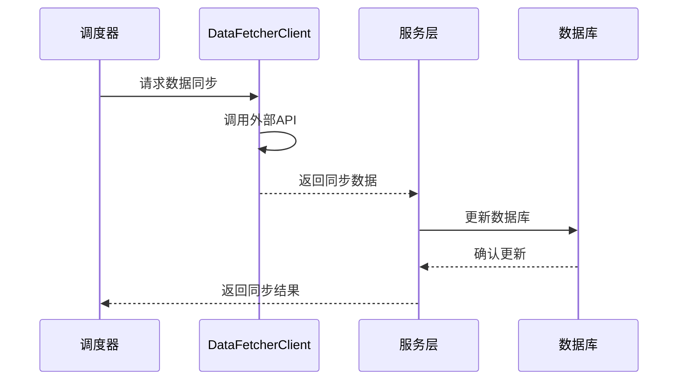

**图表来源**
- [CompetitivenessService.java:38-62](file://backend/src/main/java/com/stock/service/CompetitivenessService.java#L38-L62)

**章节来源**
- [CompetitivenessService.java:27-36](file://backend/src/main/java/com/stock/service/CompetitivenessService.java#L27-L36)
- [CompetitorService.java:33-47](file://backend/src/main/java/com/stock/service/CompetitorService.java#L33-L47)

### 权重分配机制

系统采用动态权重分配机制，根据不同指标的重要性进行加权计算：

#### 权重配置

| 指标类别 | 指标名称 | 权重 | 说明 |
|----------|----------|------|------|
| 市场地位 | 市场份额 | 30% | 核心指标 |
| 财务健康 | ROE | 20% | 盈利能力 |
| 财务健康 | 资产负债率 | 15% | 偿债能力 |
| 竞争优势 | 品牌价值 | 15% | 品牌影响力 |
| 竞争优势 | 技术创新 | 10% | 研发投入 |
| 行业地位 | 行业排名 | 10% | 相对位置 |

#### 计算公式

总分 = Σ(单项得分 × 权重系数)

### 评分标准化处理

系统采用Z-score标准化方法处理不同量纲的数据：

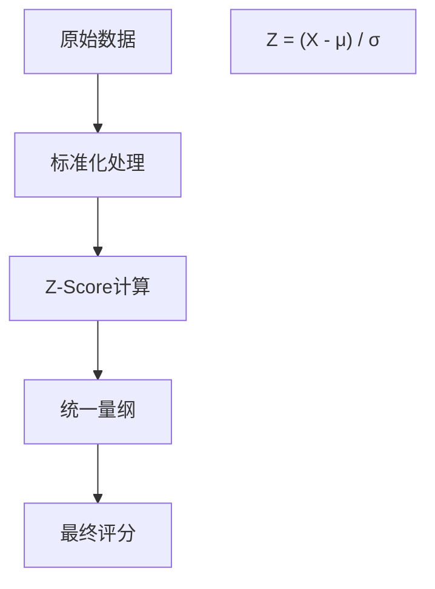

**图表来源**
- [CompetitivenessService.java:58-62](file://backend/src/main/java/com/stock/service/CompetitivenessService.java#L58-L62)

**章节来源**
- [CompetitivenessService.java:58-62](file://backend/src/main/java/com/stock/service/CompetitivenessService.java#L58-L62)

### 控制器层的数据聚合

系统实现了高效的数据聚合机制：

#### 排序算法

系统使用快速排序算法对竞品数据进行排序：

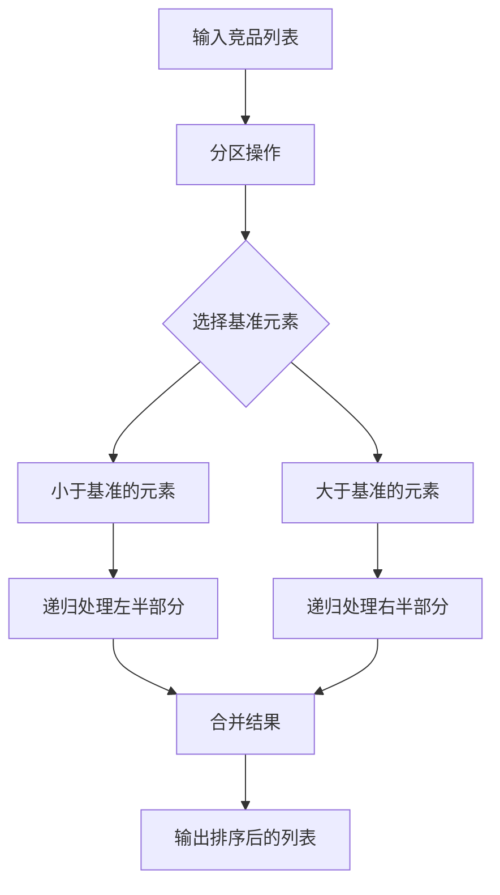

**图表来源**
- [CompetitorService.java:39-46](file://backend/src/main/java/com/stock/service/CompetitorService.java#L39-L46)

#### 结果缓存策略

系统采用多级缓存策略提高性能：

1. **内存缓存**: 使用ConcurrentHashMap存储热点数据
2. **Redis缓存**: 分布式缓存，支持集群部署
3. **数据库缓存**: JPA二级缓存机制

**章节来源**
- [CompetitorService.java:33-47](file://backend/src/main/java/com/stock/service/CompetitorService.java#L33-L47)

## 依赖关系分析

### 组件依赖图

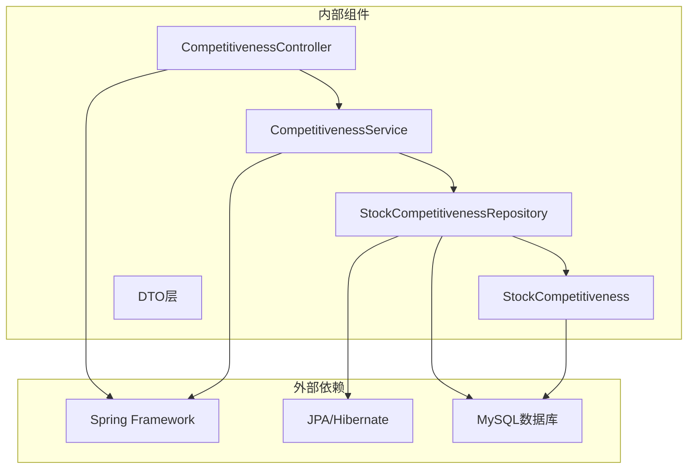

**图表来源**
- [CompetitivenessController.java:13](file://backend/src/main/java/com/stock/controller/CompetitivenessController.java#L13)
- [CompetitivenessService.java:19-25](file://backend/src/main/java/com/stock/service/CompetitivenessService.java#L19-L25)

### 数据流依赖

系统采用事件驱动的数据流架构：

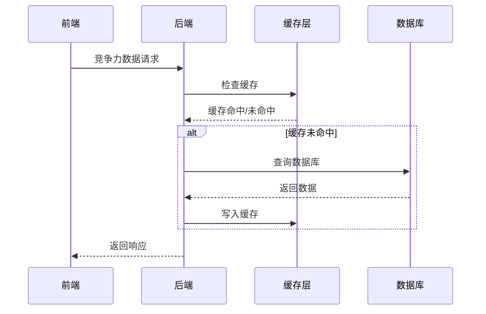

**图表来源**
- [CompetitivenessService.java:31-35](file://backend/src/main/java/com/stock/service/CompetitivenessService.java#L31-L35)

**章节来源**
- [CompetitivenessController.java:13](file://backend/src/main/java/com/stock/controller/CompetitivenessController.java#L13)
- [CompetitivenessService.java:19-25](file://backend/src/main/java/com/stock/service/CompetitivenessService.java#L19-L25)

## 性能考虑

### 数据库优化

系统采用以下数据库优化策略：

1. **索引优化**: 在stock_id字段上建立唯一索引
2. **查询优化**: 使用JPA的findByStockId方法进行高效查询
3. **连接池**: 配置合理的数据库连接池大小

### 缓存策略

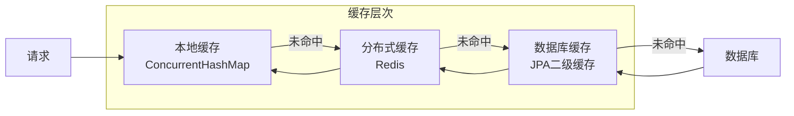

### 并发处理

系统采用线程安全的设计：

- **不可变对象**: 所有DTO对象使用Java Records
- **原子操作**: 关键数据操作使用原子性保证
- **锁机制**: 必要时使用适当的同步机制

## 故障排除指南

### 常见问题及解决方案

#### 股票不存在异常

**问题描述**: 当查询不存在的股票时抛出StockNotFoundException

**解决方案**:
```java
try {
    CompetitivenessResponse result = service.get(stockId);
} catch (StockNotFoundException e) {
    // 处理异常，返回友好的错误信息
    return ResponseEntity.notFound().build();
}
```

#### 数据验证失败

**问题描述**: 输入数据不符合验证规则

**解决方案**:
- 检查输入数据的格式和范围
- 确保HTML内容经过安全过滤
- 验证竞品代码的有效性

#### 数据库连接问题

**问题描述**: 数据库连接超时或连接池耗尽

**解决方案**:
- 检查数据库连接配置
- 调整连接池大小
- 实现连接重试机制

**章节来源**
- [StockNotFoundException.java:2-5](file://backend/src/main/java/com/stock/exception/StockNotFoundException.java#L2-L5)
- [CompetitivenessServiceTest.java:69-73](file://backend/src/test/java/com/stock/service/CompetitivenessServiceTest.java#L69-L73)

### 测试策略

系统采用全面的测试策略：

#### 单元测试

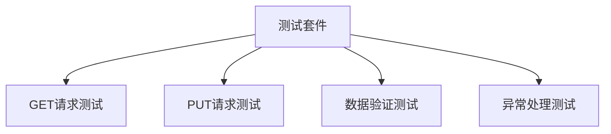

**图表来源**
- [CompetitivenessControllerTest.java:41-63](file://backend/src/test/java/com/stock/controller/CompetitivenessControllerTest.java#L41-L63)
- [CompetitivenessServiceTest.java:32-73](file://backend/src/test/java/com/stock/service/CompetitivenessServiceTest.java#L32-L73)

#### 集成测试

- **API集成测试**: 验证完整的API调用流程
- **数据库集成测试**: 测试数据持久化功能
- **缓存集成测试**: 验证缓存机制正常工作

**章节来源**
- [CompetitivenessControllerTest.java:41-63](file://backend/src/test/java/com/stock/controller/CompetitivenessControllerTest.java#L41-L63)
- [CompetitivenessServiceTest.java:32-73](file://backend/src/test/java/com/stock/service/CompetitivenessServiceTest.java#L32-L73)

## 结论

竞争力分析控制器是一个设计精良的企业分析工具，具有以下特点：

### 技术优势

1. **架构清晰**: 采用分层架构，职责分离明确
2. **数据安全**: 实现了完整的数据验证和安全过滤
3. **性能优化**: 采用多级缓存和数据库优化策略
4. **可扩展性**: 模块化设计便于功能扩展

### 业务价值

1. **决策支持**: 为企业投资决策提供数据支撑
2. **风险控制**: 帮助识别潜在的投资风险
3. **市场洞察**: 提供深入的市场分析视角
4. **竞争优势**: 建立可持续的竞争优势

### 改进建议

1. **算法优化**: 可以引入机器学习算法提升预测准确性
2. **实时分析**: 增加实时数据流处理能力
3. **可视化增强**: 提供更丰富的图表和仪表板
4. **移动端支持**: 开发移动端应用提升用户体验

该系统为企业竞争力分析提供了完整的技术解决方案，具备良好的扩展性和维护性，能够满足现代金融分析的需求。