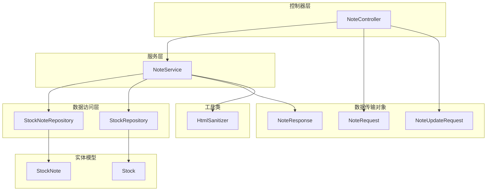
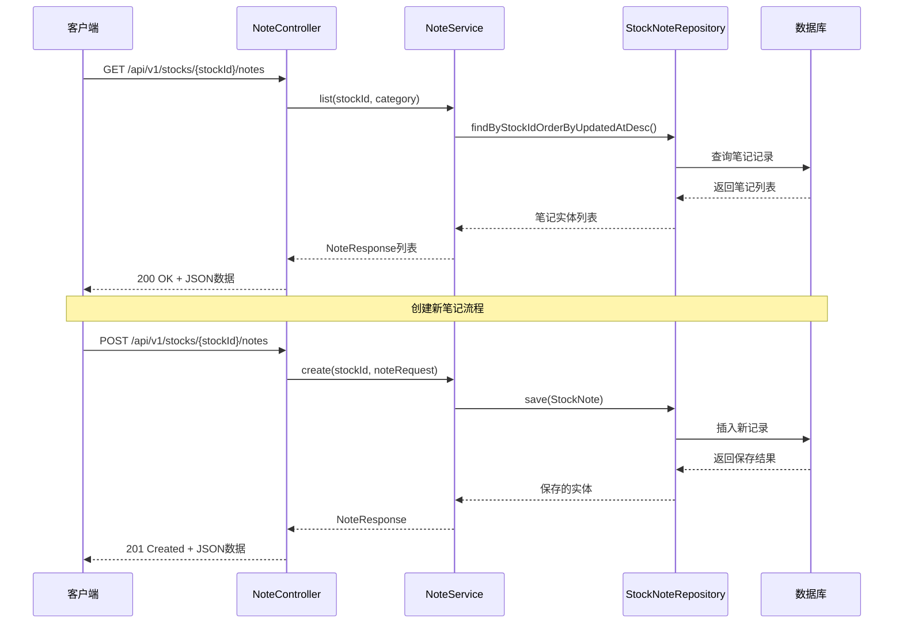
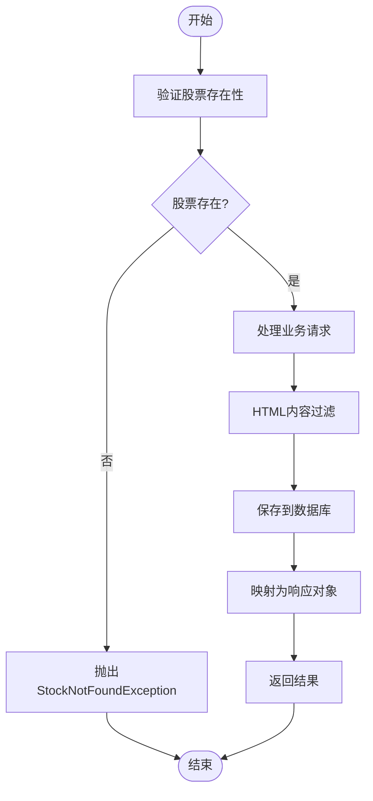
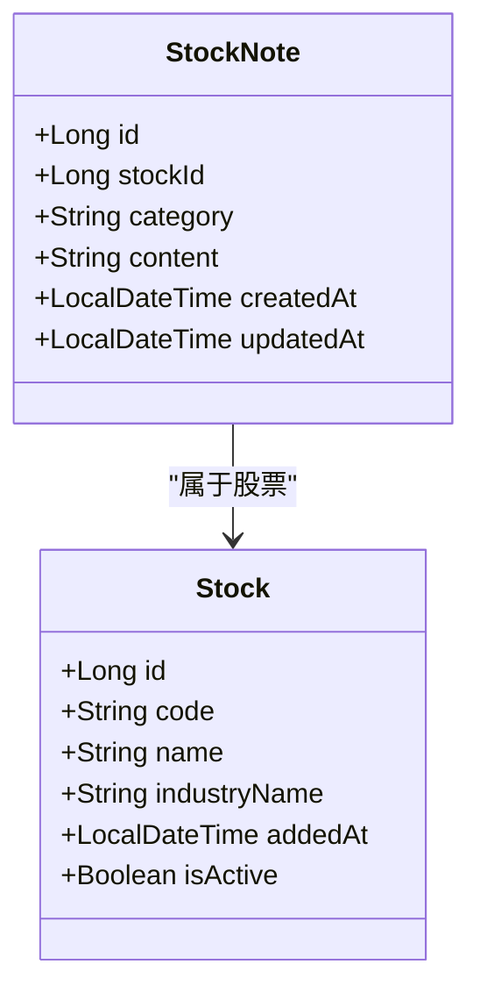
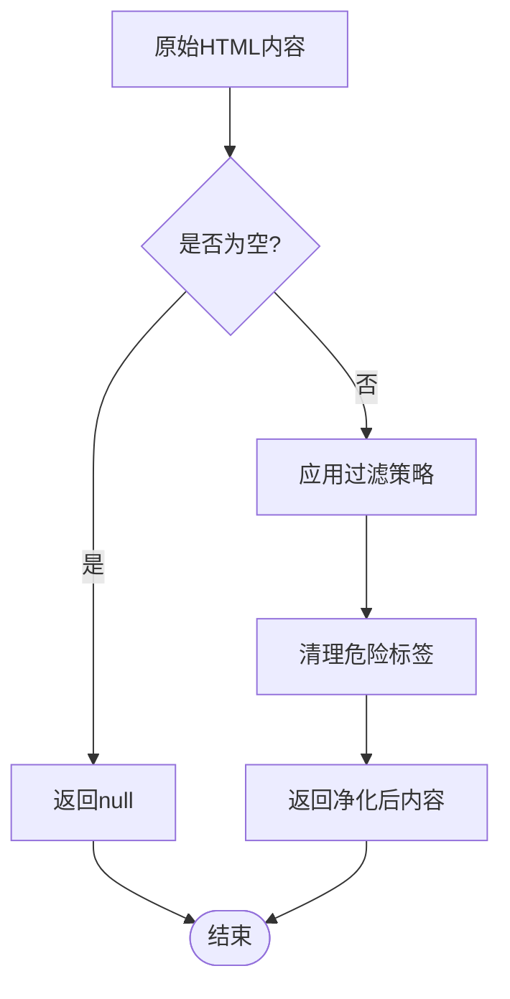
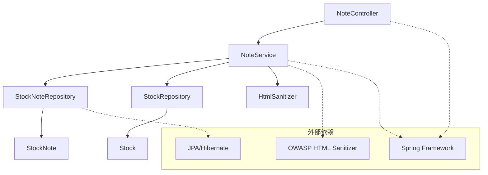
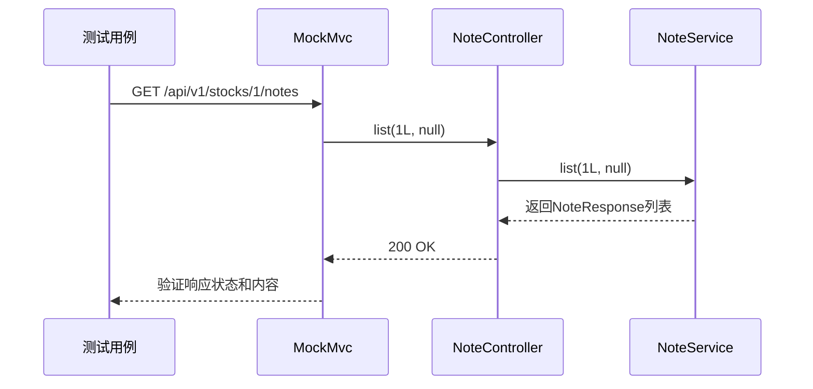

# 笔记管理控制器

<cite>
**本文档引用的文件**
- [NoteController.java](file://backend/src/main/java/com/stock/controller/NoteController.java)
- [NoteService.java](file://backend/src/main/java/com/stock/service/NoteService.java)
- [StockNote.java](file://backend/src/main/java/com/stock/entity/StockNote.java)
- [NoteRequest.java](file://backend/src/main/java/com/stock/dto/request/NoteRequest.java)
- [NoteUpdateRequest.java](file://backend/src/main/java/com/stock/dto/request/NoteUpdateRequest.java)
- [NoteResponse.java](file://backend/src/main/java/com/stock/dto/response/NoteResponse.java)
- [StockNoteRepository.java](file://backend/src/main/java/com/stock/repository/StockNoteRepository.java)
- [StockRepository.java](file://backend/src/main/java/com/stock/repository/StockRepository.java)
- [HtmlSanitizer.java](file://backend/src/main/java/com/stock/util/HtmlSanitizer.java)
- [StockNotFoundException.java](file://backend/src/main/java/com/stock/exception/StockNotFoundException.java)
- [GlobalExceptionHandler.java](file://backend/src/main/java/com/stock/exception/GlobalExceptionHandler.java)
- [NoteControllerTest.java](file://backend/src/test/java/com/stock/controller/NoteControllerTest.java)
</cite>

## 目录
1. [简介](#简介)
2. [项目结构](#项目结构)
3. [核心组件](#核心组件)
4. [架构概览](#架构概览)
5. [详细组件分析](#详细组件分析)
6. [依赖关系分析](#依赖关系分析)
7. [性能考虑](#性能考虑)
8. [故障排除指南](#故障排除指南)
9. [结论](#结论)
10. [附录](#附录)

## 简介

笔记管理控制器是股票交易系统中的重要组成部分，负责管理用户对特定股票的笔记信息。该系统提供了完整的CRUD（创建、读取、更新、删除）操作，支持笔记内容的分类管理和搜索过滤功能。系统特别注重安全性，实现了HTML内容过滤机制以防止XSS攻击，并支持富文本格式的内容存储。

## 项目结构

笔记管理功能在Spring Boot后端应用中采用标准的分层架构设计：



**图表来源**
- [NoteController.java:14-22](file://backend/src/main/java/com/stock/controller/NoteController.java#L14-L22)
- [NoteService.java:17-26](file://backend/src/main/java/com/stock/service/NoteService.java#L17-L26)
- [StockNoteRepository.java:9-16](file://backend/src/main/java/com/stock/repository/StockNoteRepository.java#L9-L16)
- [StockRepository.java:10-17](file://backend/src/main/java/com/stock/repository/StockRepository.java#L10-L17)

**章节来源**
- [NoteController.java:1-51](file://backend/src/main/java/com/stock/controller/NoteController.java#L1-L51)
- [NoteService.java:1-79](file://backend/src/main/java/com/stock/service/NoteService.java#L1-L79)

## 核心组件

### 控制器层

NoteController是RESTful API的入口点，提供以下核心功能：
- 股票笔记列表查询（支持分类过滤）
- 新笔记创建
- 现有笔记更新
- 笔记删除操作

### 服务层

NoteService负责业务逻辑处理，包括：
- 股票存在性验证
- 笔记数据的创建、更新和删除
- HTML内容安全过滤
- 数据库事务管理

### 数据模型

StockNote实体定义了笔记的数据库结构，支持：
- 分类字段（最大20字符）
- 大文本内容存储（使用LOB类型）
- 时间戳跟踪（创建和更新时间）

**章节来源**
- [NoteController.java:24-49](file://backend/src/main/java/com/stock/controller/NoteController.java#L24-L49)
- [NoteService.java:28-72](file://backend/src/main/java/com/stock/service/NoteService.java#L28-L72)
- [StockNote.java:14-36](file://backend/src/main/java/com/stock/entity/StockNote.java#L14-L36)

## 架构概览

系统采用经典的MVC架构模式，通过依赖注入实现松耦合设计：



**图表来源**
- [NoteController.java:24-35](file://backend/src/main/java/com/stock/controller/NoteController.java#L24-L35)
- [NoteService.java:28-55](file://backend/src/main/java/com/stock/service/NoteService.java#L28-L55)
- [StockNoteRepository.java:11-13](file://backend/src/main/java/com/stock/repository/StockNoteRepository.java#L11-L13)

**章节来源**
- [NoteController.java:14-50](file://backend/src/main/java/com/stock/controller/NoteController.java#L14-L50)
- [NoteService.java:17-79](file://backend/src/main/java/com/stock/service/NoteService.java#L17-L79)

## 详细组件分析

### NoteController 类分析

NoteController实现了RESTful API规范，提供四个主要端点：

#### API端点设计

| 方法 | 端点 | 功能描述 | 请求参数 | 响应状态 |
|------|------|----------|----------|----------|
| GET | `/api/v1/stocks/{stockId}/notes` | 获取股票笔记列表 | `category` (可选) | 200 OK |
| POST | `/api/v1/stocks/{stockId}/notes` | 创建新笔记 | NoteRequest | 201 Created |
| PUT | `/api/v1/stocks/{stockId}/notes/{id}` | 更新现有笔记 | NoteUpdateRequest | 200 OK |
| DELETE | `/api/v1/stocks/{stockId}/notes/{id}` | 删除笔记 | 无 | 204 No Content |

#### 权限验证和数据校验

控制器层使用Spring Validation进行参数校验：
- 使用`@Valid`注解启用请求体验证
- `@NotBlank`确保必需字段不为空
- `@Size`限制内容长度（1-10000字符）
- `@PathVariable`提取路径参数并进行类型转换

**章节来源**
- [NoteController.java:24-49](file://backend/src/main/java/com/stock/controller/NoteController.java#L24-L49)
- [NoteRequest.java:6-9](file://backend/src/main/java/com/stock/dto/request/NoteRequest.java#L6-L9)
- [NoteUpdateRequest.java:6-8](file://backend/src/main/java/com/stock/dto/request/NoteUpdateRequest.java#L6-L8)

### NoteService 类分析

NoteService是业务逻辑的核心实现：

#### 业务流程



**图表来源**
- [NoteService.java:40-66](file://backend/src/main/java/com/stock/service/NoteService.java#L40-L66)
- [HtmlSanitizer.java:10-13](file://backend/src/main/java/com/stock/util/HtmlSanitizer.java#L10-L13)

#### 关键特性

1. **事务管理**：所有写操作使用`@Transactional`注解确保数据一致性
2. **安全过滤**：集成OWASP HTML Sanitizer进行内容净化
3. **时间戳管理**：自动设置创建和更新时间
4. **错误处理**：统一的异常处理机制

**章节来源**
- [NoteService.java:17-79](file://backend/src/main/java/com/stock/service/NoteService.java#L17-L79)
- [HtmlSanitizer.java:5-14](file://backend/src/main/java/com/stock/util/HtmlSanitizer.java#L5-L14)

### 数据模型设计

#### StockNote 实体

StockNote实体采用JPA注解定义数据库映射：



**图表来源**
- [StockNote.java:15-36](file://backend/src/main/java/com/stock/entity/StockNote.java#L15-L36)
- [Stock.java:17-85](file://backend/src/main/java/com/stock/entity/Stock.java#L17-L85)

#### 字段约束和索引

| 字段名 | 类型 | 约束 | 描述 |
|--------|------|------|------|
| id | BIGINT | 主键, 自增 | 笔记唯一标识 |
| stock_id | BIGINT | 非空 | 关联的股票ID |
| category | VARCHAR(20) | 非空 | 笔记分类标签 |
| content | TEXT | 非空, LOB | 笔记内容 |
| created_at | TIMESTAMP | 可空 | 创建时间 |
| updated_at | TIMESTAMP | 可空 | 最后更新时间 |

**章节来源**
- [StockNote.java:17-35](file://backend/src/main/java/com/stock/entity/StockNote.java#L17-L35)
- [StockNoteRepository.java:9-16](file://backend/src/main/java/com/stock/repository/StockNoteRepository.java#L9-L16)

### HTML内容过滤机制

系统实现了基于OWASP HTML Sanitizer的安全内容过滤：

#### 允许的HTML元素

| 元素类型 | 允许的标签 | 用途 |
|----------|------------|------|
| 文本格式化 | `b`, `i`, `strong`, `em` | 粗体、斜体等样式 |
| 段落结构 | `p`, `br` | 段落和换行符 |
| 列表格式 | `ul`, `ol`, `li` | 无序/有序列表项 |

#### 过滤流程



**图表来源**
- [HtmlSanitizer.java:10-13](file://backend/src/main/java/com/stock/util/HtmlSanitizer.java#L10-L13)

**章节来源**
- [HtmlSanitizer.java:1-15](file://backend/src/main/java/com/stock/util/HtmlSanitizer.java#L1-L15)

## 依赖关系分析

系统采用依赖注入和分层架构，各组件之间的依赖关系清晰：



**图表来源**
- [NoteController.java:18-22](file://backend/src/main/java/com/stock/controller/NoteController.java#L18-L22)
- [NoteService.java:20-26](file://backend/src/main/java/com/stock/service/NoteService.java#L20-L26)
- [HtmlSanitizer.java:2-8](file://backend/src/main/java/com/stock/util/HtmlSanitizer.java#L2-L8)

### 组件耦合度分析

- **低耦合**：控制器与服务层通过接口分离
- **高内聚**：每个组件职责明确，功能单一
- **依赖方向**：自上而下依赖，避免循环依赖

**章节来源**
- [NoteController.java:14-22](file://backend/src/main/java/com/stock/controller/NoteController.java#L14-L22)
- [NoteService.java:17-26](file://backend/src/main/java/com/stock/service/NoteService.java#L17-L26)

## 性能考虑

### 数据库优化

1. **查询优化**：使用JPA方法命名约定实现高效查询
2. **索引策略**：按`stock_id`和`updated_at`建立复合索引
3. **批量操作**：支持按分类过滤减少查询范围

### 缓存策略

虽然当前实现未包含缓存层，但建议：
- 对热门股票的笔记列表添加Redis缓存
- 设置合理的过期时间（5-10分钟）
- 实现缓存失效策略

### 异步处理

对于大量数据操作，可以考虑：
- 使用异步任务处理批量导入
- 实现消息队列处理非关键操作

## 故障排除指南

### 常见异常处理

系统通过全局异常处理器统一处理各种异常情况：

| 异常类型 | HTTP状态码 | 错误信息 | 处理建议 |
|----------|------------|----------|----------|
| StockNotFoundException | 404 Not Found | 股票不存在 | 验证股票ID有效性 |
| MethodArgumentNotValidException | 400 Bad Request | 参数验证失败 | 检查请求格式 |
| DuplicateStockException | 409 Conflict | 股票已存在 | 检查重复添加 |
| DataFetchException | 503 Service Unavailable | 数据获取失败 | 检查数据源连接 |

### 测试覆盖

单元测试确保核心功能正常运行：



**图表来源**
- [NoteControllerTest.java:40-58](file://backend/src/test/java/com/stock/controller/NoteControllerTest.java#L40-L58)

**章节来源**
- [GlobalExceptionHandler.java:9-31](file://backend/src/main/java/com/stock/exception/GlobalExceptionHandler.java#L9-L31)
- [NoteControllerTest.java:1-60](file://backend/src/test/java/com/stock/controller/NoteControllerTest.java#L1-L60)

## 结论

笔记管理控制器实现了完整的股票笔记管理系统，具有以下特点：

### 技术优势
- **安全性**：内置HTML内容过滤，有效防止XSS攻击
- **可扩展性**：模块化设计，易于功能扩展
- **可靠性**：完善的异常处理和数据校验机制
- **性能**：合理的数据库设计和查询优化

### 功能完整性
- 支持完整的CRUD操作
- 提供分类管理和搜索过滤
- 实现富文本内容支持
- 包含时间戳追踪

### 改进建议
1. 添加用户权限验证
2. 实现笔记版本控制
3. 增加全文搜索功能
4. 添加笔记分享机制

## 附录

### API使用示例

#### 获取笔记列表
```bash
GET /api/v1/stocks/{stockId}/notes?category=INVEST_LOGIC
```

#### 创建新笔记
```bash
POST /api/v1/stocks/{stockId}/notes
Content-Type: application/json

{
    "category": "INVEST_LOGIC",
    "content": "<p>这是一个<strong>富文本</strong>内容</p>"
}
```

#### 更新笔记
```bash
PUT /api/v1/stocks/{stockId}/notes/{id}
Content-Type: application/json

{
    "content": "<p>更新后的内容</p>"
}
```

### 最佳实践建议

1. **安全性**：始终使用HTML过滤器处理用户输入
2. **性能**：合理使用分页和过滤条件
3. **用户体验**：提供实时预览和自动保存功能
4. **数据备份**：定期备份重要笔记数据
5. **权限控制**：实现多用户隔离和访问控制