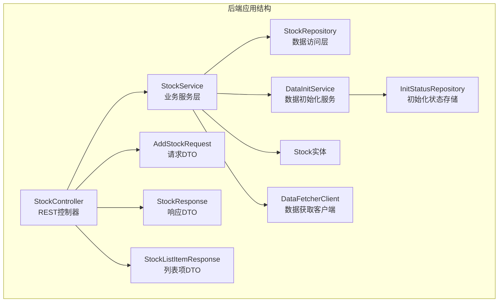
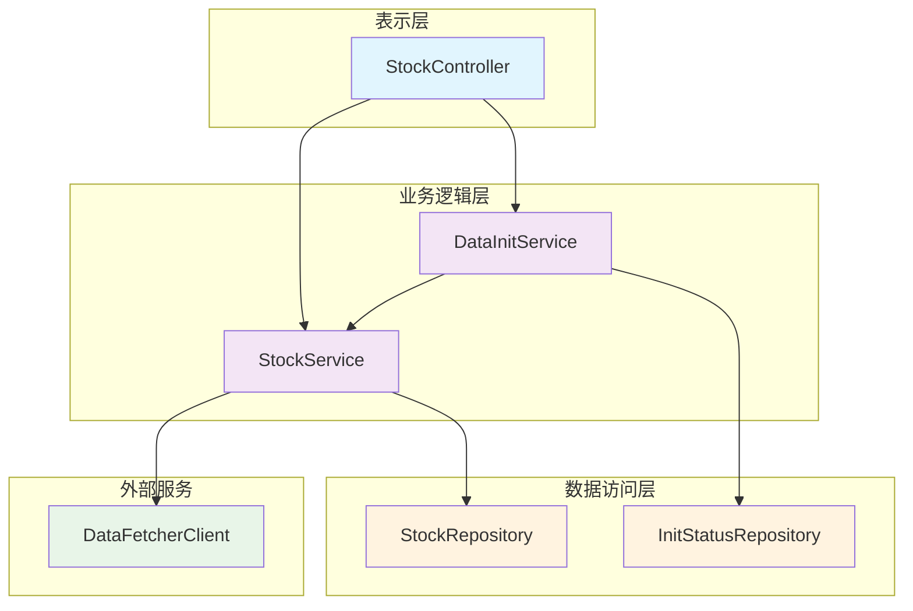
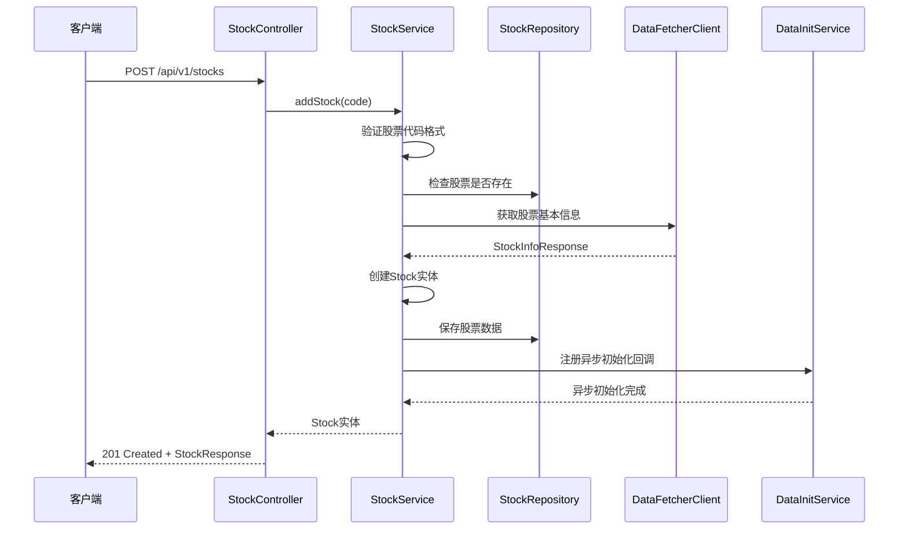
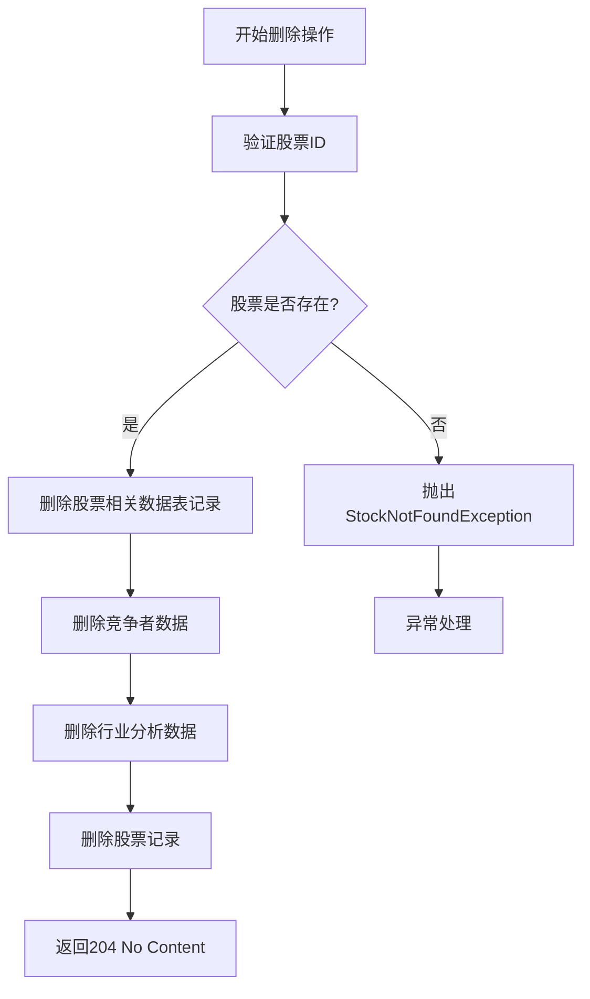
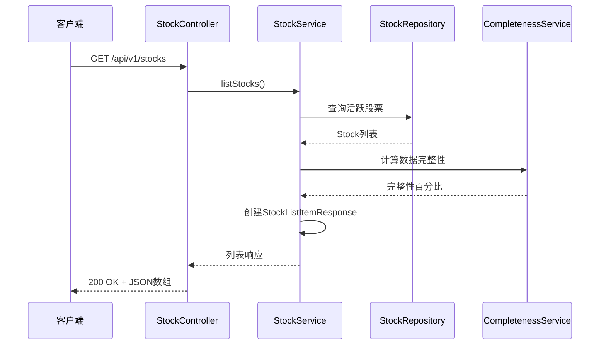
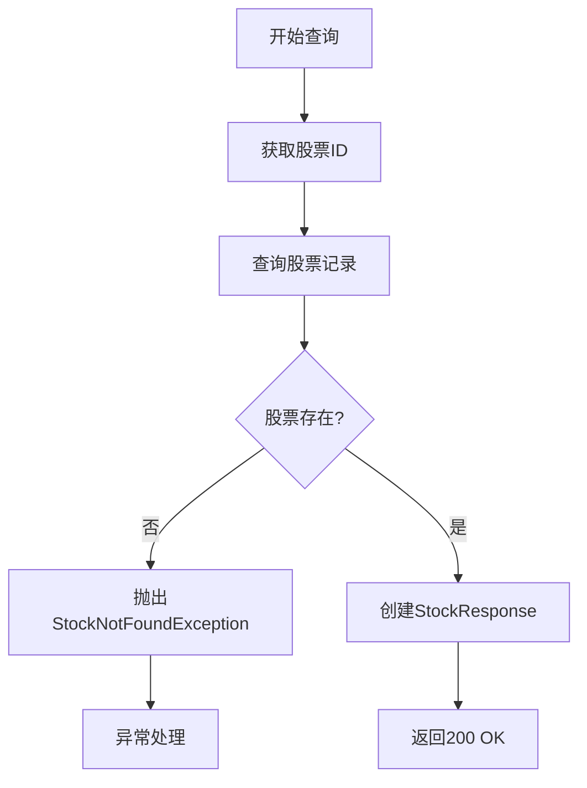
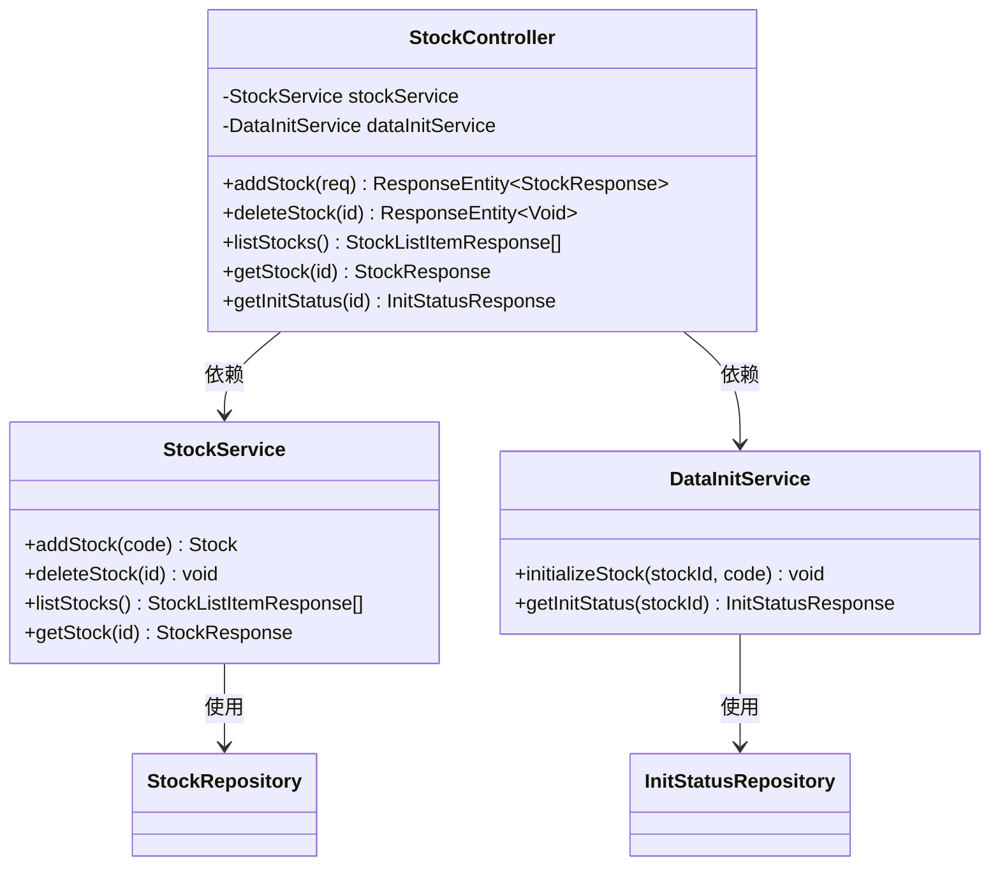
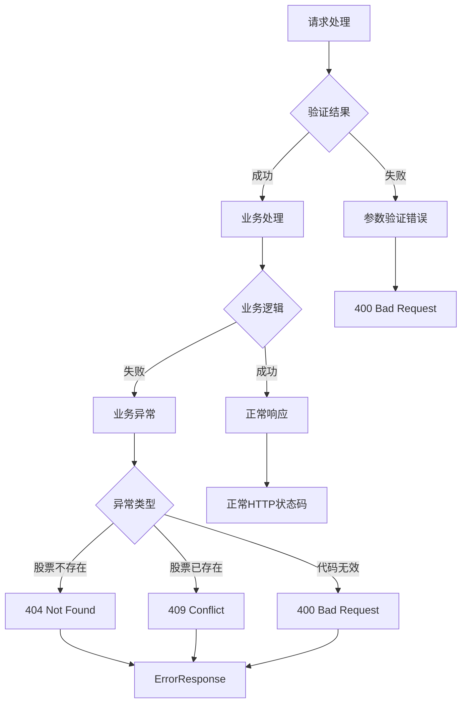

# 股票管理控制器

<cite>
**本文档引用的文件**
- [StockController.java](file://backend/src/main/java/com/stock/controller/StockController.java)
- [StockService.java](file://backend/src/main/java/com/stock/service/StockService.java)
- [AddStockRequest.java](file://backend/src/main/java/com/stock/dto/request/AddStockRequest.java)
- [StockResponse.java](file://backend/src/main/java/com/stock/dto/response/StockResponse.java)
- [StockListItemResponse.java](file://backend/src/main/java/com/stock/dto/response/StockListItemResponse.java)
- [Stock.java](file://backend/src/main/java/com/stock/entity/Stock.java)
- [StockRepository.java](file://backend/src/main/java/com/stock/repository/StockRepository.java)
- [DataInitService.java](file://backend/src/main/java/com/stock/service/DataInitService.java)
- [InitStatusResponse.java](file://backend/src/main/java/com/stock/dto/response/InitStatusResponse.java)
- [StepStatus.java](file://backend/src/main/java/com/stock/dto/response/StepStatus.java)
- [DuplicateStockException.java](file://backend/src/main/java/com/stock/exception/DuplicateStockException.java)
- [InvalidStockCodeException.java](file://backend/src/main/java/com/stock/exception/InvalidStockCodeException.java)
- [StockNotFoundException.java](file://backend/src/main/java/com/stock/exception/StockNotFoundException.java)
- [GlobalExceptionHandler.java](file://backend/src/main/java/com/stock/exception/GlobalExceptionHandler.java)
- [WebConfig.java](file://backend/src/main/java/com/stock/config/WebConfig.java)
- [application.yml](file://backend/src/main/resources/application.yml)
- [StockControllerTest.java](file://backend/src/test/java/com/stock/controller/StockControllerTest.java)
- [StockApplication.java](file://backend/src/main/java/com/stock/StockApplication.java)
</cite>

## 目录
1. [简介](#简介)
2. [项目结构](#项目结构)
3. [核心组件](#核心组件)
4. [架构概览](#架构概览)
5. [详细组件分析](#详细组件分析)
6. [依赖关系分析](#依赖关系分析)
7. [性能考虑](#性能考虑)
8. [故障排除指南](#故障排除指南)
9. [结论](#结论)

## 简介

股票管理控制器是股票交易系统的核心REST API组件，负责管理股票数据的增删查操作。该控制器实现了完整的股票生命周期管理功能，包括股票添加、删除、列表查询和详情获取。通过Spring Boot框架构建，采用分层架构设计，确保了系统的可维护性和扩展性。

本控制器特别注重数据完整性和用户体验，提供了异步初始化机制来处理复杂的股票数据同步，同时通过严格的输入验证和错误处理确保系统的稳定性。

## 项目结构

股票管理控制器位于后端服务的controller包中，采用标准的Spring Boot项目结构：



**图表来源**
- [StockController.java:17-56](file://backend/src/main/java/com/stock/controller/StockController.java#L17-L56)
- [StockService.java:28-91](file://backend/src/main/java/com/stock/service/StockService.java#L28-L91)

**章节来源**
- [StockController.java:1-57](file://backend/src/main/java/com/stock/controller/StockController.java#L1-L57)
- [StockService.java:1-243](file://backend/src/main/java/com/stock/service/StockService.java#L1-L243)

## 核心组件

### StockController 类

StockController是股票管理的主要REST控制器，采用@RestController注解标识，提供统一的API接口。该类通过构造函数注入的方式依赖StockService和DataInitService，体现了依赖注入的设计原则。

控制器的主路径为"/api/v1/stocks"，所有子路径都基于此前缀构建。控制器实现了四个主要的HTTP端点，分别对应股票的增删查操作。

**章节来源**
- [StockController.java:17-56](file://backend/src/main/java/com/stock/controller/StockController.java#L17-L56)

### 请求参数验证机制

系统采用了多层次的参数验证机制：

1. **Bean Validation注解**：在AddStockRequest中使用@NotBlank、@Size和@Pattern注解确保股票代码的格式正确性
2. **运行时验证**：在StockService中进行额外的业务逻辑验证
3. **Spring MVC验证**：通过@Valid注解启用自动参数验证

**章节来源**
- [AddStockRequest.java:7-9](file://backend/src/main/java/com/stock/dto/request/AddStockRequest.java#L7-L9)
- [StockService.java:94-105](file://backend/src/main/java/com/stock/service/StockService.java#L94-L105)

### 响应数据格式化

系统使用Java Records作为DTO（数据传输对象），提供了类型安全的数据传输机制。每个响应DTO都包含了精确的数据类型定义，确保前后端数据交换的一致性。

**章节来源**
- [StockResponse.java:7-25](file://backend/src/main/java/com/stock/dto/response/StockResponse.java#L7-L25)
- [StockListItemResponse.java:6-23](file://backend/src/main/java/com/stock/dto/response/StockListItemResponse.java#L6-L23)

## 架构概览

股票管理控制器采用经典的三层架构模式，实现了清晰的关注点分离：



**图表来源**
- [StockController.java:21-27](file://backend/src/main/java/com/stock/controller/StockController.java#L21-L27)
- [StockService.java:51-91](file://backend/src/main/java/com/stock/service/StockService.java#L51-L91)
- [DataInitService.java:34-40](file://backend/src/main/java/com/stock/service/DataInitService.java#L34-L40)

## 详细组件分析

### REST API端点设计

#### 添加股票端点
- **HTTP方法**：POST
- **路径**：/api/v1/stocks
- **请求体**：AddStockRequest（JSON格式）
- **响应**：StockResponse，状态码201 Created
- **验证**：@Valid注解启用参数验证

#### 删除股票端点
- **HTTP方法**：DELETE
- **路径**：/api/v1/stocks/{id}
- **路径参数**：Long类型的股票ID
- **响应**：空内容，状态码204 No Content

#### 股票列表端点
- **HTTP方法**：GET
- **路径**：/api/v1/stocks
- **响应**：StockListItemResponse列表
- **业务逻辑**：查询活跃状态的股票并计算数据完整性

#### 股票详情端点
- **HTTP方法**：GET
- **路径**：/api/v1/stocks/{id}
- **路径参数**：Long类型的股票ID
- **响应**：StockResponse

#### 初始化状态端点
- **HTTP方法**：GET
- **路径**：/api/v1/stocks/{id}/init-status
- **路径参数**：Long类型的股票ID
- **响应**：InitStatusResponse

**章节来源**
- [StockController.java:29-55](file://backend/src/main/java/com/stock/controller/StockController.java#L29-L55)

### 核心方法实现逻辑

#### addStock 方法分析

addStock方法实现了完整的股票添加流程：



**图表来源**
- [StockController.java:30-34](file://backend/src/main/java/com/stock/controller/StockController.java#L30-L34)
- [StockService.java:94-163](file://backend/src/main/java/com/stock/service/StockService.java#L94-L163)

该方法的关键特性包括：
1. **严格的数据验证**：确保股票代码格式正确且唯一
2. **外部数据集成**：从数据获取器获取实时股票信息
3. **事务性操作**：使用@Transactional确保数据一致性
4. **异步初始化**：在事务提交后触发数据初始化流程

**章节来源**
- [StockController.java:30-34](file://backend/src/main/java/com/stock/controller/StockController.java#L30-L34)
- [StockService.java:94-163](file://backend/src/main/java/com/stock/service/StockService.java#L94-L163)

#### deleteStock 方法分析

deleteStock方法实现了安全的股票删除机制：



**图表来源**
- [StockController.java:37-40](file://backend/src/main/java/com/stock/controller/StockController.java#L37-L40)
- [StockService.java:165-189](file://backend/src/main/java/com/stock/service/StockService.java#L165-L189)

该方法的特点：
1. **级联删除**：删除股票相关的所有数据
2. **条件删除**：对某些关联表进行条件性删除
3. **异常处理**：对不存在的股票抛出404错误

**章节来源**
- [StockController.java:37-40](file://backend/src/main/java/com/stock/controller/StockController.java#L37-L40)
- [StockService.java:165-189](file://backend/src/main/java/com/stock/service/StockService.java#L165-L189)

#### listStocks 方法分析

listStocks方法提供了股票列表查询功能：



**图表来源**
- [StockController.java:42-45](file://backend/src/main/java/com/stock/controller/StockController.java#L42-L45)
- [StockService.java:191-213](file://backend/src/main/java/com/stock/service/StockService.java#L191-L213)

**章节来源**
- [StockController.java:42-45](file://backend/src/main/java/com/stock/controller/StockController.java#L42-L45)
- [StockService.java:191-213](file://backend/src/main/java/com/stock/service/StockService.java#L191-L213)

#### getStock 方法分析

getStock方法实现了股票详情查询：



**图表来源**
- [StockController.java:47-50](file://backend/src/main/java/com/stock/controller/StockController.java#L47-L50)
- [StockService.java:215-236](file://backend/src/main/java/com/stock/service/StockService.java#L215-L236)

**章节来源**
- [StockController.java:47-50](file://backend/src/main/java/com/stock/controller/StockController.java#L47-L50)
- [StockService.java:215-236](file://backend/src/main/java/com/stock/service/StockService.java#L215-L236)

### 数据模型关系

```mermaid
erDiagram
STOCK {
bigint id PK
varchar code UK
varchar name
varchar industry_name
varchar industry_code
decimal pe_ttm
decimal pb
decimal ps_ttm
decimal peg
datetime added_at
boolean is_active
}
INIT_STATUS {
bigint id PK
bigint stock_id FK
varchar step_name
varchar status
}
STOCK ||--o{ INIT_STATUS : contains
note for STOCK """
股票基本信息表
包含股票代码、名称、行业分类
市值、估值指标等财务数据
"""
```

**图表来源**
- [Stock.java:18-85](file://backend/src/main/java/com/stock/entity/Stock.java#L18-L85)
- [StockRepository.java:10-17](file://backend/src/main/java/com/stock/repository/StockRepository.java#L10-L17)

**章节来源**
- [Stock.java:1-86](file://backend/src/main/java/com/stock/entity/Stock.java#L1-L86)

## 依赖关系分析

### 控制器层依赖

StockController通过构造函数注入依赖，展示了良好的依赖注入实践：



**图表来源**
- [StockController.java:21-27](file://backend/src/main/java/com/stock/controller/StockController.java#L21-L27)
- [StockService.java:51-91](file://backend/src/main/java/com/stock/service/StockService.java#L51-L91)
- [DataInitService.java:34-40](file://backend/src/main/java/com/stock/service/DataInitService.java#L34-L40)

### 外部依赖配置

系统配置了多个外部依赖和服务：

| 组件 | 配置位置 | 用途 |
|------|----------|------|
| 数据源 | application.yml | H2数据库连接配置 |
| 数据获取器 | application.yml | 远程数据服务地址 |
| 调度器 | application.yml | 定时任务配置 |
| CORS | WebConfig | 跨域资源共享设置 |

**章节来源**
- [application.yml:4-28](file://backend/src/main/resources/application.yml#L4-L28)
- [WebConfig.java:6-14](file://backend/src/main/java/com/stock/config/WebConfig.java#L6-L14)

## 性能考虑

### 异步初始化机制

系统采用了异步初始化策略来提升用户体验：

1. **事务后执行**：使用TransactionSynchronizationManager确保在事务提交后再触发初始化
2. **步骤化处理**：将初始化过程分解为8个独立步骤，每个步骤独立执行
3. **延迟控制**：步骤间添加500ms延迟，避免过度请求外部服务

### 缓存和优化策略

1. **数据完整性计算**：在查询列表时才计算数据完整性，避免重复计算
2. **批量操作**：删除操作采用批量删除策略，减少数据库往返
3. **懒加载**：初始化状态查询按需加载，避免不必要的数据传输

## 故障排除指南

### 常见错误类型和处理

系统通过全局异常处理器提供统一的错误响应：



**图表来源**
- [GlobalExceptionHandler.java:7-32](file://backend/src/main/java/com/stock/exception/GlobalExceptionHandler.java#L7-L32)

### 错误处理策略

1. **参数验证错误**：返回400状态码，包含详细的字段验证信息
2. **业务逻辑错误**：根据具体异常类型返回相应的HTTP状态码
3. **系统异常**：捕获未处理的异常并返回500状态码

**章节来源**
- [GlobalExceptionHandler.java:1-33](file://backend/src/main/java/com/stock/exception/GlobalExceptionHandler.java#L1-L33)

### API调用示例

基于测试用例提供的实际调用示例：

#### 添加股票
```bash
curl -X POST "http://localhost:8080/api/v1/stocks" \
  -H "Content-Type: application/json" \
  -d '{"code":"600519"}'
```

#### 获取股票列表
```bash
curl -X GET "http://localhost:8080/api/v1/stocks"
```

#### 获取股票详情
```bash
curl -X GET "http://localhost:8080/api/v1/stocks/1"
```

#### 删除股票
```bash
curl -X DELETE "http://localhost:8080/api/v1/stocks/1"
```

#### 获取初始化状态
```bash
curl -X GET "http://localhost:8080/api/v1/stocks/1/init-status"
```

**章节来源**
- [StockControllerTest.java:51-114](file://backend/src/test/java/com/stock/controller/StockControllerTest.java#L51-L114)

## 结论

股票管理控制器展现了现代Spring Boot应用的最佳实践，通过清晰的分层架构、严格的参数验证、完善的异常处理和异步处理机制，构建了一个稳定可靠的股票数据管理系统。

该控制器的主要优势包括：

1. **架构清晰**：遵循分层架构原则，职责分离明确
2. **数据安全**：多重验证机制确保数据完整性
3. **用户体验**：异步初始化避免阻塞用户操作
4. **可维护性**：依赖注入和接口抽象提高了代码可维护性
5. **扩展性**：模块化设计便于功能扩展和修改

通过合理的错误处理和状态码使用，系统为前端提供了清晰的反馈机制，有助于构建更好的用户界面和交互体验。