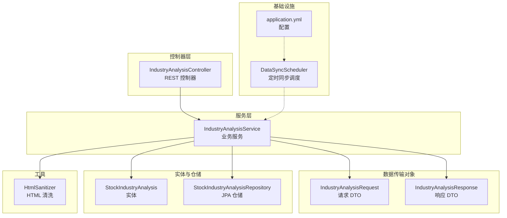
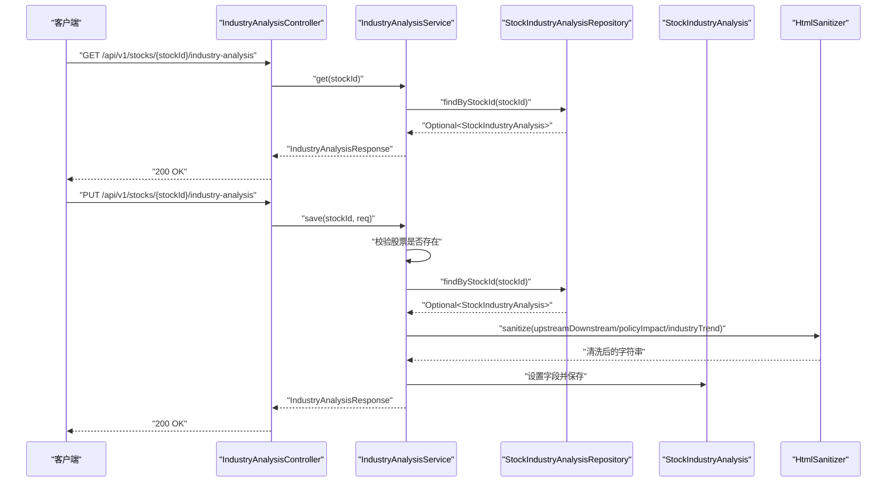
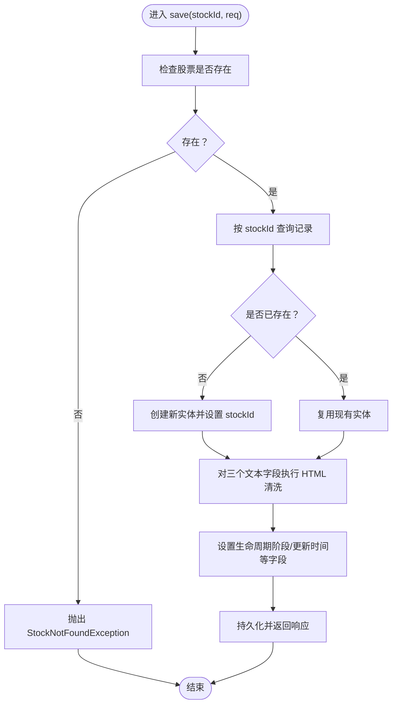
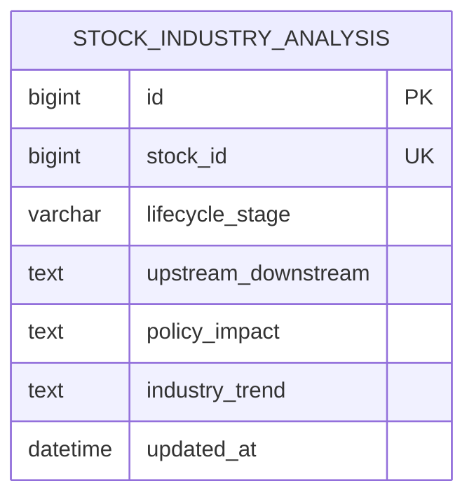
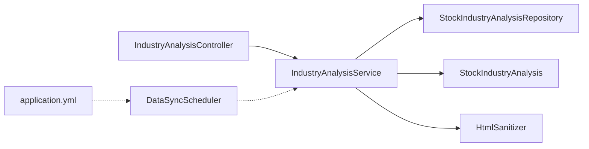

# 行业分析控制器

<cite>
**本文引用的文件**
- [IndustryAnalysisController.java](file://backend/src/main/java/com/stock/controller/IndustryAnalysisController.java)
- [IndustryAnalysisService.java](file://backend/src/main/java/com/stock/service/IndustryAnalysisService.java)
- [IndustryAnalysisRequest.java](file://backend/src/main/java/com/stock/dto/request/IndustryAnalysisRequest.java)
- [IndustryAnalysisResponse.java](file://backend/src/main/java/com/stock/dto/response/IndustryAnalysisResponse.java)
- [StockIndustryAnalysis.java](file://backend/src/main/java/com/stock/entity/StockIndustryAnalysis.java)
- [StockIndustryAnalysisRepository.java](file://backend/src/main/java/com/stock/repository/StockIndustryAnalysisRepository.java)
- [HtmlSanitizer.java](file://backend/src/main/java/com/stock/util/HtmlSanitizer.java)
- [DataSyncScheduler.java](file://backend/src/main/java/com/stock/scheduler/DataSyncScheduler.java)
- [application.yml](file://backend/src/main/resources/application.yml)
- [IndustryAnalysisServiceTest.java](file://backend/src/test/java/com/stock/service/IndustryAnalysisServiceTest.java)
</cite>

## 目录
1. [简介](#简介)
2. [项目结构](#项目结构)
3. [核心组件](#核心组件)
4. [架构总览](#架构总览)
5. [详细组件分析](#详细组件分析)
6. [依赖分析](#依赖分析)
7. [性能考虑](#性能考虑)
8. [故障排查指南](#故障排查指南)
9. [结论](#结论)
10. [附录](#附录)

## 简介
本文件面向“行业分析控制器”的技术文档，聚焦 IndustryAnalysisController 类的实现与扩展能力说明。当前代码库中，行业分析功能以“个股维度”的行业分析内容为核心：支持对单只股票的生命周期阶段、上下游关系、政策影响、行业趋势等信息进行增删改查。该控制器通过服务层完成数据校验、持久化与返回封装，并在实体层定义了唯一约束与字段结构。

需要特别说明的是：当前实现并未包含“行业分类”“行业对比分析”“行业动态查询”“行业数据聚合算法”“行业排名计算”“行业趋势分析”“行业画像生成”等更广泛的“行业维度”分析能力。这些能力若需实现，应在现有“个股维度”基础上进行扩展（例如新增行业维度实体、服务与控制器），并在数据同步与计算调度层面增加相应策略。

## 项目结构
行业分析相关模块位于后端 Java 工程的 controller、service、dto、entity、repository、util 层，并由测试用例覆盖关键行为。

图表来源
- [IndustryAnalysisController.java:1-30](file://backend/src/main/java/com/stock/controller/IndustryAnalysisController.java#L1-L30)
- [IndustryAnalysisService.java:1-61](file://backend/src/main/java/com/stock/service/IndustryAnalysisService.java#L1-L61)
- [IndustryAnalysisRequest.java:1-12](file://backend/src/main/java/com/stock/dto/request/IndustryAnalysisRequest.java#L1-L12)
- [IndustryAnalysisResponse.java:1-13](file://backend/src/main/java/com/stock/dto/response/IndustryAnalysisResponse.java#L1-L13)
- [StockIndustryAnalysis.java:1-44](file://backend/src/main/java/com/stock/entity/StockIndustryAnalysis.java#L1-L44)
- [StockIndustryAnalysisRepository.java:1-13](file://backend/src/main/java/com/stock/repository/StockIndustryAnalysisRepository.java#L1-L13)
- [HtmlSanitizer.java:1-15](file://backend/src/main/java/com/stock/util/HtmlSanitizer.java#L1-L15)
- [DataSyncScheduler.java:1-238](file://backend/src/main/java/com/stock/scheduler/DataSyncScheduler.java#L1-L238)
- [application.yml:1-28](file://backend/src/main/resources/application.yml#L1-L28)

章节来源
- [IndustryAnalysisController.java:1-30](file://backend/src/main/java/com/stock/controller/IndustryAnalysisController.java#L1-L30)
- [IndustryAnalysisService.java:1-61](file://backend/src/main/java/com/stock/service/IndustryAnalysisService.java#L1-L61)
- [StockIndustryAnalysis.java:1-44](file://backend/src/main/java/com/stock/entity/StockIndustryAnalysis.java#L1-L44)
- [StockIndustryAnalysisRepository.java:1-13](file://backend/src/main/java/com/stock/repository/StockIndustryAnalysisRepository.java#L1-L13)
- [IndustryAnalysisRequest.java:1-12](file://backend/src/main/java/com/stock/dto/request/IndustryAnalysisRequest.java#L1-L12)
- [IndustryAnalysisResponse.java:1-13](file://backend/src/main/java/com/stock/dto/response/IndustryAnalysisResponse.java#L1-L13)
- [HtmlSanitizer.java:1-15](file://backend/src/main/java/com/stock/util/HtmlSanitizer.java#L1-L15)
- [DataSyncScheduler.java:1-238](file://backend/src/main/java/com/stock/scheduler/DataSyncScheduler.java#L1-L238)
- [application.yml:1-28](file://backend/src/main/resources/application.yml#L1-L28)

## 核心组件
- 控制器层：IndustryAnalysisController 提供 GET/PUT 接口，路径为 /api/v1/stocks/{stockId}/industry-analysis，分别用于读取与保存个股的行业分析内容。
- 服务层：IndustryAnalysisService 负责业务逻辑，包括存在性校验、实体映射、HTML 内容清洗、事务性保存与返回封装。
- 数据传输对象：IndustryAnalysisRequest 定义输入字段及长度限制；IndustryAnalysisResponse 定义输出字段。
- 实体与仓储：StockIndustryAnalysis 定义表结构与唯一约束；StockIndustryAnalysisRepository 提供按 stockId 查询的能力。
- 工具：HtmlSanitizer 对输入文本进行白名单过滤，防止注入与不安全 HTML。
- 基础设施：DataSyncScheduler 提供定时数据同步与指标重算，为行业分析提供底层数据基础。

章节来源
- [IndustryAnalysisController.java:19-28](file://backend/src/main/java/com/stock/controller/IndustryAnalysisController.java#L19-L28)
- [IndustryAnalysisService.java:27-59](file://backend/src/main/java/com/stock/service/IndustryAnalysisService.java#L27-L59)
- [IndustryAnalysisRequest.java:6-11](file://backend/src/main/java/com/stock/dto/request/IndustryAnalysisRequest.java#L6-L11)
- [IndustryAnalysisResponse.java:5-12](file://backend/src/main/java/com/stock/dto/response/IndustryAnalysisResponse.java#L5-L12)
- [StockIndustryAnalysis.java:14-42](file://backend/src/main/java/com/stock/entity/StockIndustryAnalysis.java#L14-L42)
- [StockIndustryAnalysisRepository.java:11](file://backend/src/main/java/com/stock/repository/StockIndustryAnalysisRepository.java#L11)
- [HtmlSanitizer.java:6-13](file://backend/src/main/java/com/stock/util/HtmlSanitizer.java#L6-L13)

## 架构总览
下图展示从控制器到服务、仓储与实体的整体交互流程，以及与数据同步调度的关系。

图表来源
- [IndustryAnalysisController.java:19-28](file://backend/src/main/java/com/stock/controller/IndustryAnalysisController.java#L19-L28)
- [IndustryAnalysisService.java:27-59](file://backend/src/main/java/com/stock/service/IndustryAnalysisService.java#L27-L59)
- [StockIndustryAnalysisRepository.java:11](file://backend/src/main/java/com/stock/repository/StockIndustryAnalysisRepository.java#L11)
- [HtmlSanitizer.java:10-13](file://backend/src/main/java/com/stock/util/HtmlSanitizer.java#L10-L13)

## 详细组件分析

### 控制器层：IndustryAnalysisController
- 路径绑定：/api/v1/stocks/{stockId}/industry-analysis
- 方法：
  - GET：根据 stockId 返回行业分析结果。
  - PUT：接收 IndustryAnalysisRequest，保存行业分析内容。
- 参数校验：使用 Jakarta Bean Validation 注解对请求体进行参数校验。
- 异常处理：由全局异常处理器统一处理（未在本文件内定义）。

章节来源
- [IndustryAnalysisController.java:9-28](file://backend/src/main/java/com/stock/controller/IndustryAnalysisController.java#L9-L28)

### 服务层：IndustryAnalysisService
- 查询逻辑：
  - 校验股票是否存在，否则抛出 StockNotFoundException。
  - 按 stockId 查询行业分析记录，若不存在则返回空字段的响应对象。
- 保存逻辑（事务性）：
  - 校验股票是否存在。
  - 若记录不存在则新建实体并设置 stockId。
  - 使用 HtmlSanitizer 对上游下游、政策影响、行业趋势字段进行清洗。
  - 设置更新时间并持久化，返回 IndustryAnalysisResponse。
- 复杂度与性能：
  - 查询为 O(1)（基于唯一索引）。
  - 保存涉及一次查询、一次写入与一次清洗，整体为 O(1)。

图表来源
- [IndustryAnalysisService.java:37-59](file://backend/src/main/java/com/stock/service/IndustryAnalysisService.java#L37-L59)
- [HtmlSanitizer.java:10-13](file://backend/src/main/java/com/stock/util/HtmlSanitizer.java#L10-L13)

章节来源
- [IndustryAnalysisService.java:27-59](file://backend/src/main/java/com/stock/service/IndustryAnalysisService.java#L27-L59)

### 数据传输对象：IndustryAnalysisRequest 与 IndustryAnalysisResponse
- IndustryAnalysisRequest：
  - lifecycleStage：非空字符串，长度有限制。
  - upstreamDownstream/policyImpact/industryTrend：可选，最大长度限制。
- IndustryAnalysisResponse：
  - 字段与请求一致，外加 updatedAt 更新时间。

章节来源
- [IndustryAnalysisRequest.java:6-11](file://backend/src/main/java/com/stock/dto/request/IndustryAnalysisRequest.java#L6-L11)
- [IndustryAnalysisResponse.java:5-12](file://backend/src/main/java/com/stock/dto/response/IndustryAnalysisResponse.java#L5-L12)

### 实体与仓储：StockIndustryAnalysis 与 StockIndustryAnalysisRepository
- 实体特性：
  - 表名：stock_industry_analysis。
  - 唯一约束：stock_id 唯一。
  - 字段：生命周期阶段、上游下游、政策影响、行业趋势（LOB）、更新时间。
- 仓储接口：
  - findByStockId：按 stockId 查询唯一记录。

图表来源
- [StockIndustryAnalysis.java:14-42](file://backend/src/main/java/com/stock/entity/StockIndustryAnalysis.java#L14-L42)

章节来源
- [StockIndustryAnalysis.java:14-42](file://backend/src/main/java/com/stock/entity/StockIndustryAnalysis.java#L14-L42)
- [StockIndustryAnalysisRepository.java:11](file://backend/src/main/java/com/stock/repository/StockIndustryAnalysisRepository.java#L11)

### 工具：HtmlSanitizer
- 采用 OWASP HTML 白名单策略，允许有限标签（段落、换行、列表、强调等），其余标签会被移除或转义。
- 作用：保障返回内容安全，避免 XSS 风险。

章节来源
- [HtmlSanitizer.java:6-13](file://backend/src/main/java/com/stock/util/HtmlSanitizer.java#L6-L13)

### 基础设施：DataSyncScheduler 与配置
- DataSyncScheduler：
  - 定时同步日线、资金流、估值与研报、财务与利润、股东等数据。
  - 指标重算：基于近一年日线重新计算技术指标并入库。
- 配置：
  - 数据源、JPA、H2 控制台。
  - 数据抓取器地址与超时。
  - 各类定时任务的 Cron 表达式。

章节来源
- [DataSyncScheduler.java:54-236](file://backend/src/main/java/com/stock/scheduler/DataSyncScheduler.java#L54-L236)
- [application.yml:19-28](file://backend/src/main/resources/application.yml#L19-L28)

### 测试：IndustryAnalysisServiceTest
- 场景覆盖：
  - 无数据时查询返回空字段响应。
  - 新建保存成功并返回正确生命周期阶段。
  - 股票不存在时保存抛出 StockNotFoundException。

章节来源
- [IndustryAnalysisServiceTest.java:31-59](file://backend/src/test/java/com/stock/service/IndustryAnalysisServiceTest.java#L31-L59)

## 依赖分析
- 控制器依赖服务层，服务层依赖仓储与实体，同时依赖 HtmlSanitizer 进行内容清洗。
- DataSyncScheduler 作为外部数据来源，为行业分析提供基础数据支撑。
- application.yml 提供调度与数据源配置。

图表来源
- [IndustryAnalysisController.java:13-17](file://backend/src/main/java/com/stock/controller/IndustryAnalysisController.java#L13-L17)
- [IndustryAnalysisService.java:19-25](file://backend/src/main/java/com/stock/service/IndustryAnalysisService.java#L19-L25)
- [StockIndustryAnalysisRepository.java:9-12](file://backend/src/main/java/com/stock/repository/StockIndustryAnalysisRepository.java#L9-L12)
- [HtmlSanitizer.java:10-13](file://backend/src/main/java/com/stock/util/HtmlSanitizer.java#L10-L13)
- [DataSyncScheduler.java:32-51](file://backend/src/main/java/com/stock/scheduler/DataSyncScheduler.java#L32-L51)
- [application.yml:19-28](file://backend/src/main/resources/application.yml#L19-L28)

## 性能考虑
- 查询性能：按 stock_id 的唯一查询具备 O(1) 复杂度，建议保持该索引与唯一约束。
- 写入性能：单条记录保存，事务内完成，开销极低。
- 文本清洗：HtmlSanitizer 在保存前执行，建议对大文本分块处理或异步化以避免阻塞。
- 并发控制：服务层方法未显式加锁，但 JPA 仓储与数据库唯一约束可保证幂等写入。
- 缓存策略：当前未见缓存实现，可在高频读场景引入 Redis 缓存（如按 stockId 缓存响应），注意失效与一致性。
- 异常恢复：DataSyncScheduler 对每个股票循环同步并捕获异常，避免单点失败影响整体；建议为行业分析相关数据也增加类似保护与重试策略。

## 故障排查指南
- 常见问题与定位：
  - 股票不存在：保存时抛出 StockNotFoundException，检查 stockId 是否有效。
  - 输入为空：若上游下游/政策影响/行业趋势为空，响应对应字段亦为空。
  - HTML 注入风险：确保输入经 HtmlSanitizer 清洗后再入库。
  - 数据未更新：确认 DataSyncScheduler 的定时任务是否正常运行，检查 application.yml 中的 Cron 配置。
- 日志与监控：
  - DataSyncScheduler 使用 SLF4J 记录同步进度与异常，便于排查。
  - 建议在控制器与服务层增加关键路径的日志埋点，便于追踪请求链路。

章节来源
- [IndustryAnalysisService.java:28-41](file://backend/src/main/java/com/stock/service/IndustryAnalysisService.java#L28-L41)
- [DataSyncScheduler.java:78-115](file://backend/src/main/java/com/stock/scheduler/DataSyncScheduler.java#L78-L115)
- [application.yml:23-28](file://backend/src/main/resources/application.yml#L23-L28)

## 结论
当前实现提供了“个股维度”的行业分析能力，接口简洁、职责清晰，具备良好的可维护性。若需扩展至“行业维度”的综合分析（如行业分类、对比、趋势、画像等），建议在现有架构上新增行业实体与服务层，并完善定时同步与计算调度策略，同时配套缓存与并发控制方案以提升性能与稳定性。

## 附录
- API 设计要点
  - GET /api/v1/stocks/{stockId}/industry-analysis：读取个股行业分析。
  - PUT /api/v1/stocks/{stockId}/industry-analysis：保存个股行业分析。
- 数据准确性与一致性
  - 唯一约束保证每只股票仅有一条行业分析记录。
  - 保存前进行 HTML 清洗，降低 XSS 风险。
  - 定时同步与指标重算为分析提供最新数据基础。
- 性能优化建议
  - 引入缓存（Redis）以减少重复查询。
  - 对大文本清洗与批量写入进行异步化或分批处理。
  - 为高频接口增加限流与熔断策略。
- 并发控制与异常恢复
  - 利用数据库唯一约束与事务保证幂等写入。
  - 参考 DataSyncScheduler 的异常捕获与日志记录模式，增强行业分析相关流程的可观测性。