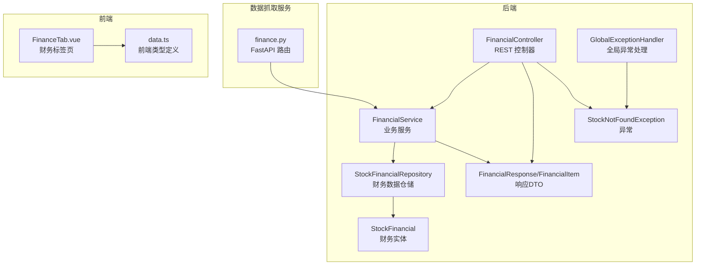
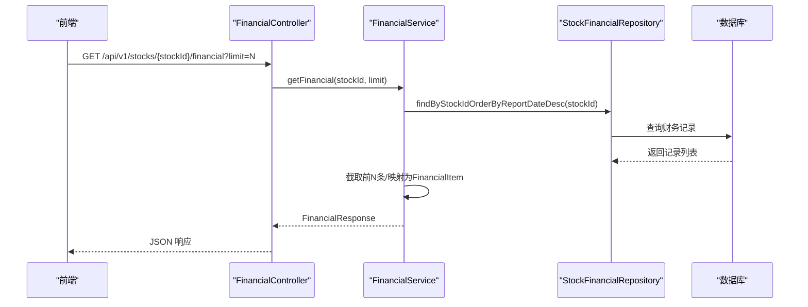
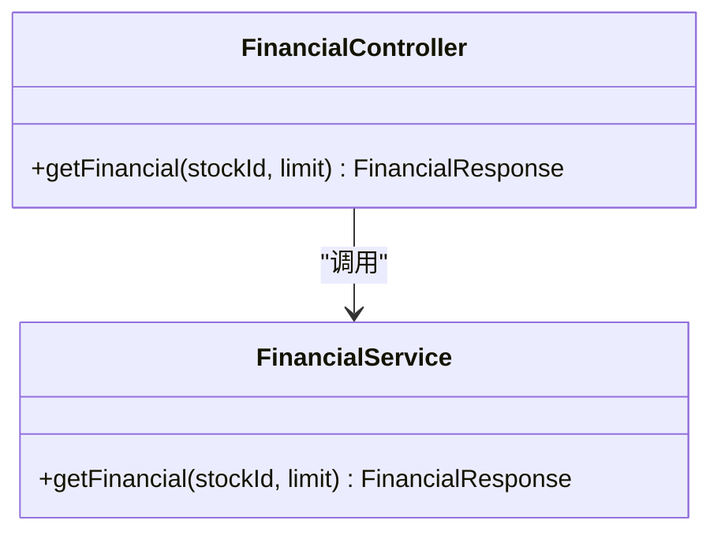
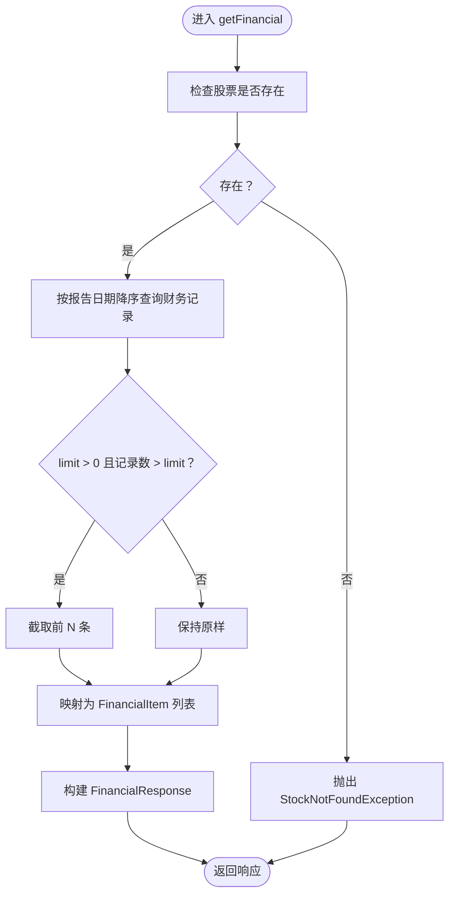
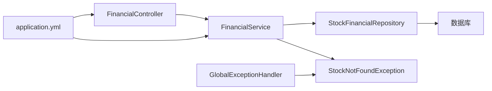

# 财务分析控制器

<cite>
**本文引用的文件**
- [FinancialController.java](file://backend/src/main/java/com/stock/controller/FinancialController.java)
- [FinancialService.java](file://backend/src/main/java/com/stock/service/FinancialService.java)
- [StockFinancialRepository.java](file://backend/src/main/java/com/stock/repository/StockFinancialRepository.java)
- [StockFinancial.java](file://backend/src/main/java/com/stock/entity/StockFinancial.java)
- [FinancialResponse.java](file://backend/src/main/java/com/stock/dto/response/FinancialResponse.java)
- [FinancialItem.java](file://backend/src/main/java/com/stock/dto/response/FinancialItem.java)
- [FinancialDataResponse.java](file://backend/src/main/java/com/stock/dto/fetcher/FinancialDataResponse.java)
- [FinancialDataItem.java](file://backend/src/main/java/com/stock/dto/fetcher/FinancialDataItem.java)
- [StockNotFoundException.java](file://backend/src/main/java/com/stock/exception/StockNotFoundException.java)
- [GlobalExceptionHandler.java](file://backend/src/main/java/com/stock/exception/GlobalExceptionHandler.java)
- [application.yml](file://backend/src/main/resources/application.yml)
- [finance.py](file://data-fetcher/routers/finance.py)
- [FinanceTab.vue](file://frontend/src/views/tabs/FinanceTab.vue)
- [data.ts](file://frontend/src/api/data.ts)
</cite>

## 目录
1. [简介](#简介)
2. [项目结构](#项目结构)
3. [核心组件](#核心组件)
4. [架构总览](#架构总览)
5. [详细组件分析](#详细组件分析)
6. [依赖分析](#依赖分析)
7. [性能考虑](#性能考虑)
8. [故障排查指南](#故障排查指南)
9. [结论](#结论)
10. [附录](#附录)

## 简介
本文件面向财务分析控制器的实现与使用，聚焦于 FinancialController 类的设计与职责，涵盖财务数据查询、财务报表展示、财务指标计算的 API 设计思路；深入解析资产负债表、利润表、现金流量表数据的获取与格式化逻辑；解释财务数据的时间序列分析、同比环比计算、趋势预测方法；并提供数据可视化建议与性能优化策略，包含控制器层的数据缓存、分页查询与错误处理机制。

## 项目结构
财务分析相关模块位于后端 Java 工程的 controller、service、repository、entity、dto 层，并通过独立的数据抓取服务提供原始财务数据。前端通过 Vue 组件消费财务数据并进行展示。

**图表来源**
- [FinancialController.java:1-23](file://backend/src/main/java/com/stock/controller/FinancialController.java#L1-L23)
- [FinancialService.java:1-45](file://backend/src/main/java/com/stock/service/FinancialService.java#L1-L45)
- [StockFinancialRepository.java:1-15](file://backend/src/main/java/com/stock/repository/StockFinancialRepository.java#L1-L15)
- [StockFinancial.java:1-72](file://backend/src/main/java/com/stock/entity/StockFinancial.java#L1-L72)
- [FinancialResponse.java:1-9](file://backend/src/main/java/com/stock/dto/response/FinancialResponse.java#L1-L9)
- [FinancialItem.java:1-22](file://backend/src/main/java/com/stock/dto/response/FinancialItem.java#L1-L22)
- [StockNotFoundException.java:1-6](file://backend/src/main/java/com/stock/exception/StockNotFoundException.java#L1-L6)
- [GlobalExceptionHandler.java:1-33](file://backend/src/main/java/com/stock/exception/GlobalExceptionHandler.java#L1-L33)
- [finance.py:1-148](file://data-fetcher/routers/finance.py#L1-L148)
- [FinanceTab.vue:1-26](file://frontend/src/views/tabs/FinanceTab.vue#L1-L26)
- [data.ts:1-56](file://frontend/src/api/data.ts#L1-L56)

**章节来源**
- [FinancialController.java:1-23](file://backend/src/main/java/com/stock/controller/FinancialController.java#L1-L23)
- [FinancialService.java:1-45](file://backend/src/main/java/com/stock/service/FinancialService.java#L1-L45)
- [StockFinancialRepository.java:1-15](file://backend/src/main/java/com/stock/repository/StockFinancialRepository.java#L1-L15)
- [StockFinancial.java:1-72](file://backend/src/main/java/com/stock/entity/StockFinancial.java#L1-L72)
- [FinancialResponse.java:1-9](file://backend/src/main/java/com/stock/dto/response/FinancialResponse.java#L1-L9)
- [FinancialItem.java:1-22](file://backend/src/main/java/com/stock/dto/response/FinancialItem.java#L1-L22)
- [StockNotFoundException.java:1-6](file://backend/src/main/java/com/stock/exception/StockNotFoundException.java#L1-L6)
- [GlobalExceptionHandler.java:1-33](file://backend/src/main/java/com/stock/exception/GlobalExceptionHandler.java#L1-L33)
- [finance.py:1-148](file://data-fetcher/routers/finance.py#L1-L148)
- [FinanceTab.vue:1-26](file://frontend/src/views/tabs/FinanceTab.vue#L1-L26)
- [data.ts:1-56](file://frontend/src/api/data.ts#L1-L56)

## 核心组件
- 控制器层：提供 REST 接口，接收股票标识与分页参数，委派给服务层处理。
- 服务层：校验股票存在性，查询财务数据，映射为响应 DTO。
- 仓储层：基于 JPA 的财务数据查询与删除。
- 实体层：财务指标字段的持久化模型。
- DTO 层：对外响应的数据传输对象。
- 异常与全局处理：对缺失股票等异常进行统一处理。
- 数据抓取服务：提供财务摘要、利润表、估值等数据的抓取与格式化。
- 前端展示：财务标签页表格展示与类型约束。

**章节来源**
- [FinancialController.java:1-23](file://backend/src/main/java/com/stock/controller/FinancialController.java#L1-L23)
- [FinancialService.java:1-45](file://backend/src/main/java/com/stock/service/FinancialService.java#L1-L45)
- [StockFinancialRepository.java:1-15](file://backend/src/main/java/com/stock/repository/StockFinancialRepository.java#L1-L15)
- [StockFinancial.java:1-72](file://backend/src/main/java/com/stock/entity/StockFinancial.java#L1-L72)
- [FinancialResponse.java:1-9](file://backend/src/main/java/com/stock/dto/response/FinancialResponse.java#L1-L9)
- [FinancialItem.java:1-22](file://backend/src/main/java/com/stock/dto/response/FinancialItem.java#L1-L22)
- [StockNotFoundException.java:1-6](file://backend/src/main/java/com/stock/exception/StockNotFoundException.java#L1-L6)
- [GlobalExceptionHandler.java:1-33](file://backend/src/main/java/com/stock/exception/GlobalExceptionHandler.java#L1-L33)
- [finance.py:1-148](file://data-fetcher/routers/finance.py#L1-L148)
- [FinanceTab.vue:1-26](file://frontend/src/views/tabs/FinanceTab.vue#L1-L26)
- [data.ts:1-56](file://frontend/src/api/data.ts#L1-L56)

## 架构总览
财务分析控制器遵循典型的三层架构：控制器负责请求接入与参数校验，服务层封装业务逻辑与数据转换，仓储层负责数据持久化访问。数据抓取服务提供外部数据源，前端通过类型安全的接口消费数据。

**图表来源**
- [FinancialController.java:17-21](file://backend/src/main/java/com/stock/controller/FinancialController.java#L17-L21)
- [FinancialService.java:24-43](file://backend/src/main/java/com/stock/service/FinancialService.java#L24-L43)
- [StockFinancialRepository.java:11-11](file://backend/src/main/java/com/stock/repository/StockFinancialRepository.java#L11-L11)

## 详细组件分析

### 控制器层：FinancialController
- 职责：暴露 REST 接口，接收路径参数 stockId 与查询参数 limit，默认返回最近 N 条财务记录。
- 参数：stockId（路径变量）、limit（默认 8，表示返回记录数量上限）。
- 返回：FinancialResponse，包含 stockId 与 data 列表。
- 依赖注入：构造函数注入 FinancialService。

**图表来源**
- [FinancialController.java:1-23](file://backend/src/main/java/com/stock/controller/FinancialController.java#L1-L23)
- [FinancialService.java:1-45](file://backend/src/main/java/com/stock/service/FinancialService.java#L1-L45)

**章节来源**
- [FinancialController.java:17-21](file://backend/src/main/java/com/stock/controller/FinancialController.java#L17-L21)

### 服务层：FinancialService
- 股票存在性校验：若股票不存在，抛出 StockNotFoundException。
- 数据查询：按报告日期降序查询该股票的所有财务记录。
- 分页截取：若 limit > 0 且记录数超过 limit，则截取前 N 条。
- 映射转换：将 StockFinancial 列表映射为 FinancialItem 列表，构造 FinancialResponse 返回。

**图表来源**
- [FinancialService.java:24-43](file://backend/src/main/java/com/stock/service/FinancialService.java#L24-L43)

**章节来源**
- [FinancialService.java:24-43](file://backend/src/main/java/com/stock/service/FinancialService.java#L24-L43)

### 仓储层：StockFinancialRepository
- 方法：按 stockId 查询并按报告日期降序排序；按 stockId 删除记录。
- 作用：支撑服务层的查询与清理操作。

**章节来源**
- [StockFinancialRepository.java:11-13](file://backend/src/main/java/com/stock/repository/StockFinancialRepository.java#L11-L13)

### 实体层：StockFinancial
- 字段：包含 EPS、ROE、资产负债率、存货周转率、流动比率、速动比率、期间费用率等关键财务指标，以及报告日期、股票标识等。
- 约束：stock_id 与 report_date 组合唯一，避免重复记录。
- 精度：数值字段采用高精度 BigDecimal，保证财务计算准确性。

**章节来源**
- [StockFinancial.java:15-71](file://backend/src/main/java/com/stock/entity/StockFinancial.java#L15-L71)

### DTO 层：FinancialResponse 与 FinancialItem
- FinancialResponse：包含 stockId 与 data 列表。
- FinancialItem：包含报告期与各项财务指标，用于前端展示。

**章节来源**
- [FinancialResponse.java:5-8](file://backend/src/main/java/com/stock/dto/response/FinancialResponse.java#L5-L8)
- [FinancialItem.java:5-21](file://backend/src/main/java/com/stock/dto/response/FinancialItem.java#L5-L21)

### 数据抓取服务：finance.py
- 财务摘要接口：从 AKShare 获取财务摘要，按报告期转置为垂直结构，映射中文指标到英文字段名。
- 利润表接口：从数据中心获取收入表，按报告期排序，返回标准结构。
- 错误处理：统一捕获异常并返回 503 错误码。

**章节来源**
- [finance.py:43-118](file://data-fetcher/routers/finance.py#L43-L118)
- [finance.py:14-40](file://data-fetcher/routers/finance.py#L14-L40)

### 前端展示：FinanceTab.vue 与 data.ts
- 类型定义：FinancialItem 定义了报告期与各项财务指标的字段。
- 展示逻辑：利润表与财务摘要分别以表格形式展示，支持同比、比率等格式化显示。

**章节来源**
- [FinanceTab.vue:20-26](file://frontend/src/views/tabs/FinanceTab.vue#L20-L26)
- [data.ts:41-56](file://frontend/src/api/data.ts#L41-L56)

## 依赖分析
- 控制器依赖服务层，服务层依赖仓储层与股票仓储，仓储层依赖数据库。
- 异常处理通过全局异常处理器集中处理 StockNotFoundException 等业务异常。
- 配置文件 application.yml 中定义了数据源、JPA、H2 控制台与数据抓取服务地址等。

**图表来源**
- [FinancialController.java:1-23](file://backend/src/main/java/com/stock/controller/FinancialController.java#L1-L23)
- [FinancialService.java:1-45](file://backend/src/main/java/com/stock/service/FinancialService.java#L1-L45)
- [StockFinancialRepository.java:1-15](file://backend/src/main/java/com/stock/repository/StockFinancialRepository.java#L1-L15)
- [StockNotFoundException.java:1-6](file://backend/src/main/java/com/stock/exception/StockNotFoundException.java#L1-L6)
- [GlobalExceptionHandler.java:1-33](file://backend/src/main/java/com/stock/exception/GlobalExceptionHandler.java#L1-L33)
- [application.yml:1-28](file://backend/src/main/resources/application.yml#L1-L28)

**章节来源**
- [application.yml:19-22](file://backend/src/main/resources/application.yml#L19-L22)

## 性能考虑
- 查询优化
  - 使用按报告日期降序的索引查询，减少排序开销。
  - 限制返回条数（limit），避免一次性加载过多历史数据。
- 缓存策略
  - 对高频查询的财务摘要结果进行短期缓存（如 Redis），设置合理过期时间，降低数据库压力。
  - 对前端展示的财务表格数据进行本地缓存，结合 ETag 或 Last-Modified 实现条件请求。
- 分页与批处理
  - 控制器已支持 limit 参数；可扩展 offset/size 实现分页，避免超大数据集一次性传输。
  - 后端可按季度或年度聚合统计，减少明细数据量。
- 计算优化
  - 财务指标计算尽量在入库时预计算，或在定时任务中批量更新，避免请求时实时计算。
  - 对同比、环比计算采用滑动窗口与增量更新，减少重复计算。
- 可视化与前端优化
  - 前端仅渲染可视区域内的行，使用虚拟滚动提升大表格性能。
  - 将趋势线、柱状图等可视化数据按时间粒度聚合，减少渲染节点。
- 数据抓取与同步
  - 数据抓取服务设置合理的超时与重试策略，避免阻塞主请求。
  - 对抓取失败的数据进行队列化重试，保障数据完整性。

[本节为通用性能建议，不直接分析具体文件，故无“章节来源”]

## 故障排查指南
- 股票不存在
  - 现象：返回 404，消息包含股票标识。
  - 处理：检查股票 ID 是否正确，确认股票是否已初始化。
- 数据抓取异常
  - 现象：数据抓取服务返回 503，提示抓取失败。
  - 处理：检查数据抓取服务地址与网络连通性，查看服务日志定位异常。
- 参数校验异常
  - 现象：参数非法返回 400，包含字段与错误信息。
  - 处理：核对请求参数类型与范围，确保符合接口规范。
- 数据库连接问题
  - 现象：查询失败或 H2 控制台不可用。
  - 处理：检查 application.yml 中的数据库配置与 H2 控制台启用状态。

**章节来源**
- [GlobalExceptionHandler.java:9-31](file://backend/src/main/java/com/stock/exception/GlobalExceptionHandler.java#L9-L31)
- [StockNotFoundException.java:1-6](file://backend/src/main/java/com/stock/exception/StockNotFoundException.java#L1-L6)
- [application.yml:4-17](file://backend/src/main/resources/application.yml#L4-L17)

## 结论
财务分析控制器通过清晰的分层设计实现了财务数据的查询与展示：控制器负责参数接入与响应封装，服务层完成数据校验与映射，仓储层提供高效查询能力。配合数据抓取服务与前端展示组件，形成完整的财务分析链路。建议在生产环境中引入缓存、分页与预计算等优化手段，持续提升性能与用户体验。

[本节为总结性内容，不直接分析具体文件，故无“章节来源”]

## 附录

### API 设计要点
- 资产负债表、利润表、现金流量表
  - 当前控制器返回财务摘要指标；如需资产负债表与现金流量表，可在数据抓取服务中新增对应路由，并在后端 DTO 与实体中扩展相应字段。
- 时间序列分析与同比环比
  - 在服务层或定时任务中按报告期生成同比、环比序列，前端以折线图展示趋势。
- 趋势预测
  - 基于历史时间序列采用移动平均、指数平滑或机器学习方法进行短期预测，预测结果作为额外字段返回前端可视化。

[本节为概念性说明，不直接分析具体文件，故无“章节来源”]