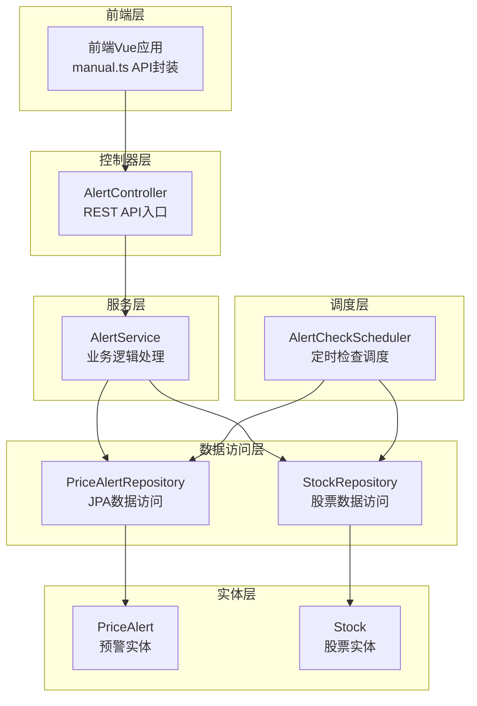
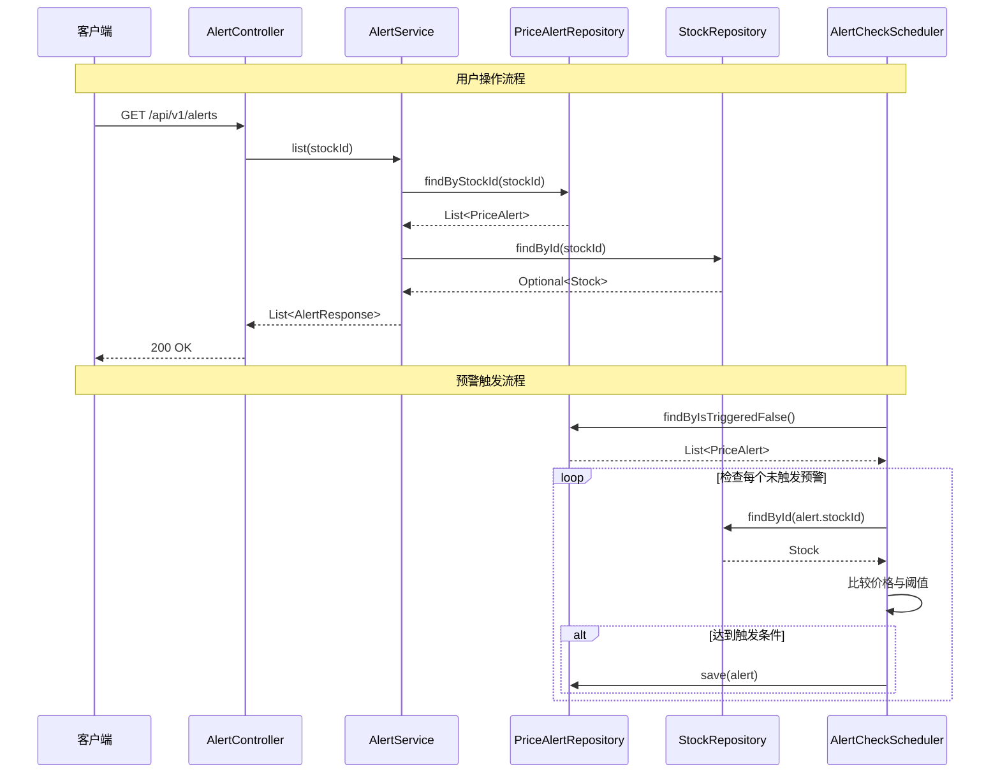
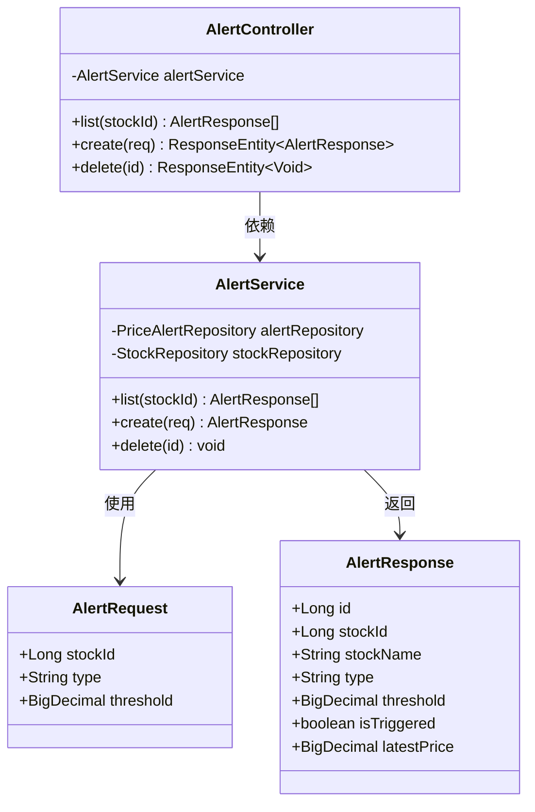
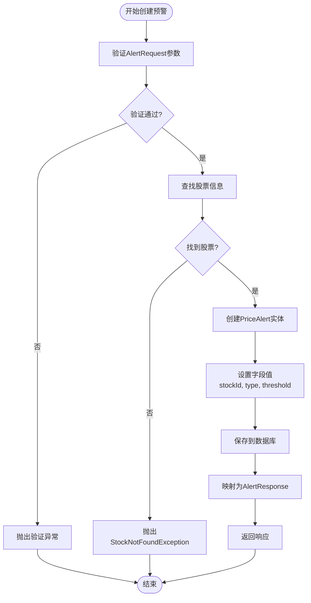
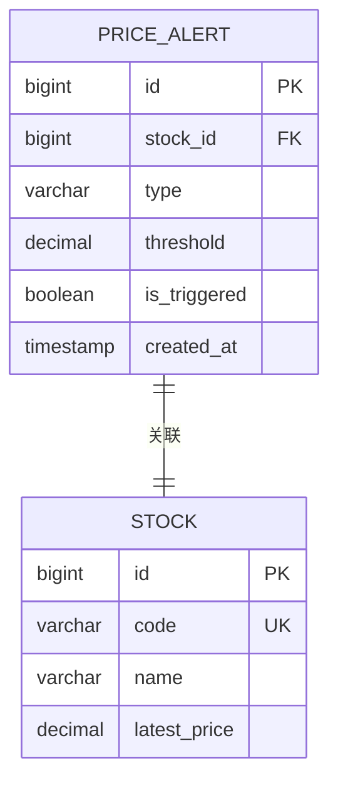
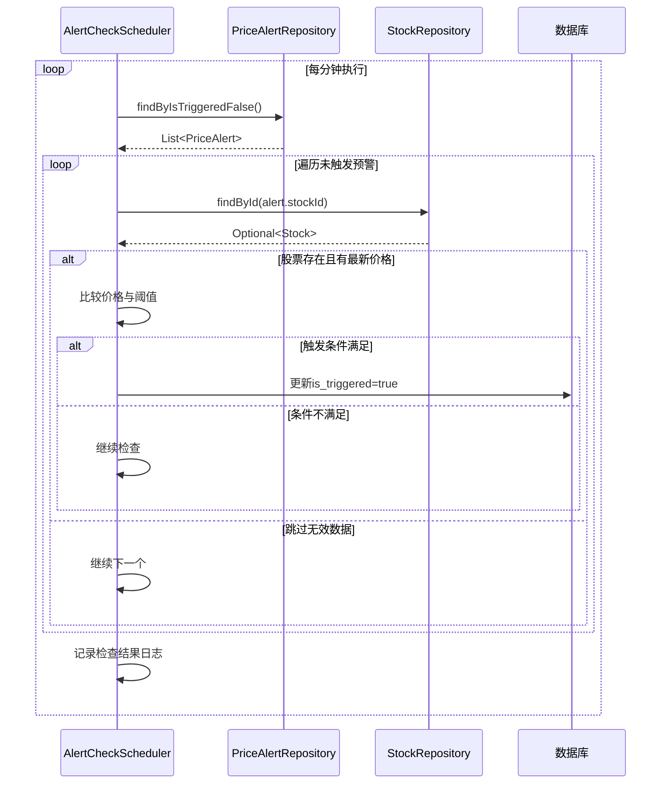
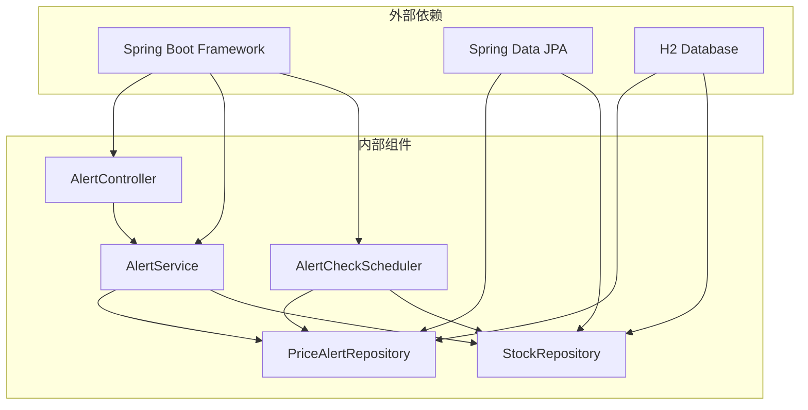

# 预警管理控制器

<cite>
**本文档引用的文件**
- [AlertController.java](file://backend/src/main/java/com/stock/controller/AlertController.java)
- [AlertService.java](file://backend/src/main/java/com/stock/service/AlertService.java)
- [AlertRequest.java](file://backend/src/main/java/com/stock/dto/request/AlertRequest.java)
- [AlertResponse.java](file://backend/src/main/java/com/stock/dto/response/AlertResponse.java)
- [PriceAlert.java](file://backend/src/main/java/com/stock/entity/PriceAlert.java)
- [Stock.java](file://backend/src/main/java/com/stock/entity/Stock.java)
- [PriceAlertRepository.java](file://backend/src/main/java/com/stock/repository/PriceAlertRepository.java)
- [AlertCheckScheduler.java](file://backend/src/main/java/com/stock/scheduler/AlertCheckScheduler.java)
- [application.yml](file://backend/src/main/resources/application.yml)
- [GlobalExceptionHandler.java](file://backend/src/main/java/com/stock/exception/GlobalExceptionHandler.java)
- [AlertControllerTest.java](file://backend/src/test/java/com/stock/controller/AlertControllerTest.java)
- [AlertServiceTest.java](file://backend/src/test/java/com/stock/service/AlertServiceTest.java)
- [manual.ts](file://frontend/src/api/manual.ts)
</cite>

## 目录
1. [简介](#简介)
2. [项目结构](#项目结构)
3. [核心组件](#核心组件)
4. [架构概览](#架构概览)
5. [详细组件分析](#详细组件分析)
6. [依赖分析](#依赖分析)
7. [性能考虑](#性能考虑)
8. [故障排除指南](#故障排除指南)
9. [结论](#结论)
10. [附录](#附录)

## 简介

预警管理控制器是股票交易系统中的关键组件，负责管理价格预警的完整生命周期。该系统实现了基于Spring Boot的企业级应用架构，采用分层设计模式，包括控制器层、服务层、数据访问层和调度层。

系统支持两种类型的预警规则：价格高于阈值（ABOVE）和价格低于阈值（BELOW），通过定时调度器自动检查市场数据并触发相应的预警通知。预警状态管理确保每条预警只触发一次，避免重复通知。

## 项目结构

预警管理系统在整体项目中位于后端模块的controller包下，采用标准的MVC架构模式：



**图表来源**
- [AlertController.java:13-39](file://backend/src/main/java/com/stock/controller/AlertController.java#L13-L39)
- [AlertService.java:15-62](file://backend/src/main/java/com/stock/service/AlertService.java#L15-L62)
- [AlertCheckScheduler.java:14-51](file://backend/src/main/java/com/stock/scheduler/AlertCheckScheduler.java#L14-L51)

**章节来源**
- [AlertController.java:1-40](file://backend/src/main/java/com/stock/controller/AlertController.java#L1-L40)
- [AlertService.java:1-63](file://backend/src/main/java/com/stock/service/AlertService.java#L1-L63)
- [AlertCheckScheduler.java:1-52](file://backend/src/main/java/com/stock/scheduler/AlertCheckScheduler.java#L1-L52)

## 核心组件

### 控制器层组件

AlertController作为REST API的唯一入口点，提供了完整的预警管理功能：

- **列表查询**：支持按股票ID过滤的预警列表查询
- **创建预警**：基于AlertRequest DTO创建新的价格预警
- **删除预警**：移除指定ID的预警规则

### 服务层组件

AlertService负责处理业务逻辑，包括数据验证、业务规则检查和数据转换：

- **预警列表**：查询所有或特定股票的预警信息
- **预警创建**：验证股票存在性并保存预警规则
- **预警删除**：安全删除指定ID的预警

### 数据模型组件

系统使用精简的DTO模式，避免了传统POJO的样板代码：

- **AlertRequest**：输入验证的数据传输对象
- **AlertResponse**：输出响应的数据传输对象
- **PriceAlert**：数据库持久化实体
- **Stock**：关联的股票信息实体

**章节来源**
- [AlertController.java:23-38](file://backend/src/main/java/com/stock/controller/AlertController.java#L23-L38)
- [AlertService.java:26-61](file://backend/src/main/java/com/stock/service/AlertService.java#L26-L61)
- [AlertRequest.java:6-10](file://backend/src/main/java/com/stock/dto/request/AlertRequest.java#L6-L10)
- [AlertResponse.java:5-13](file://backend/src/main/java/com/stock/dto/response/AlertResponse.java#L5-L13)

## 架构概览

预警管理系统采用分层架构设计，确保关注点分离和代码可维护性：



**图表来源**
- [AlertController.java:23-38](file://backend/src/main/java/com/stock/controller/AlertController.java#L23-L38)
- [AlertService.java:26-56](file://backend/src/main/java/com/stock/service/AlertService.java#L26-L56)
- [AlertCheckScheduler.java:26-50](file://backend/src/main/java/com/stock/scheduler/AlertCheckScheduler.java#L26-L50)

## 详细组件分析

### AlertController 类分析

AlertController是一个轻量级的REST控制器，专注于提供清晰的API接口：



**图表来源**
- [AlertController.java:15-39](file://backend/src/main/java/com/stock/controller/AlertController.java#L15-L39)
- [AlertService.java:16-24](file://backend/src/main/java/com/stock/service/AlertService.java#L16-L24)
- [AlertRequest.java:6-10](file://backend/src/main/java/com/stock/dto/request/AlertRequest.java#L6-L10)
- [AlertResponse.java:5-13](file://backend/src/main/java/com/stock/dto/response/AlertResponse.java#L5-L13)

#### API 设计规范

控制器层遵循RESTful设计原则，提供标准化的HTTP接口：

| 方法 | 路径 | 功能 | 请求体 | 响应码 |
|------|------|------|--------|--------|
| GET | `/api/v1/alerts` | 查询预警列表 | 无 | 200 |
| POST | `/api/v1/alerts` | 创建新预警 | AlertRequest | 201 |
| DELETE | `/api/v1/alerts/{id}` | 删除预警 | 无 | 204 |

**章节来源**
- [AlertController.java:23-38](file://backend/src/main/java/com/stock/controller/AlertController.java#L23-L38)

### AlertService 业务逻辑分析

AlertService实现了完整的业务规则处理，包括数据验证和错误处理：



**图表来源**
- [AlertService.java:41-56](file://backend/src/main/java/com/stock/service/AlertService.java#L41-L56)

#### 数据验证策略

服务层实现了多层次的数据验证：

1. **参数验证**：使用Bean Validation注解确保数据完整性
2. **业务规则验证**：检查股票是否存在且有效
3. **数据类型验证**：确保阈值为正数

**章节来源**
- [AlertService.java:42-56](file://backend/src/main/java/com/stock/service/AlertService.java#L42-L56)
- [AlertRequest.java:7-9](file://backend/src/main/java/com/stock/dto/request/AlertRequest.java#L7-L9)

### PriceAlert 实体模型分析

PriceAlert实体设计简洁高效，支持完整的预警生命周期管理：



**图表来源**
- [PriceAlert.java:16-36](file://backend/src/main/java/com/stock/entity/PriceAlert.java#L16-L36)
- [Stock.java:17-85](file://backend/src/main/java/com/stock/entity/Stock.java#L17-L85)

#### 数据模型特点

- **主键设计**：使用自增ID确保唯一性
- **外键约束**：通过stock_id关联股票信息
- **状态字段**：is_triggered跟踪预警触发状态
- **时间戳**：记录预警创建时间

**章节来源**
- [PriceAlert.java:22-32](file://backend/src/main/java/com/stock/entity/PriceAlert.java#L22-L32)
- [PriceAlertRepository.java:9-16](file://backend/src/main/java/com/stock/repository/PriceAlertRepository.java#L9-L16)

### AlertCheckScheduler 调度机制分析

定时调度器实现了高效的预警检查机制：



**图表来源**
- [AlertCheckScheduler.java:26-50](file://backend/src/main/java/com/stock/scheduler/AlertCheckScheduler.java#L26-L50)

#### 调度策略优化

- **Cron表达式**：仅在交易时间内执行（9:00-15:00，周一至周五）
- **批量查询**：使用JPA方法查询未触发的预警
- **增量处理**：避免重复检查已触发的预警

**章节来源**
- [AlertCheckScheduler.java:26-50](file://backend/src/main/java/com/stock/scheduler/AlertCheckScheduler.java#L26-L50)
- [application.yml:27](file://backend/src/main/resources/application.yml#L27)

## 依赖分析

预警管理系统各组件之间的依赖关系清晰明确：



**图表来源**
- [AlertController.java:3-9](file://backend/src/main/java/com/stock/controller/AlertController.java#L3-L9)
- [AlertService.java:5-9](file://backend/src/main/java/com/stock/service/AlertService.java#L5-L9)
- [AlertCheckScheduler.java:5-6](file://backend/src/main/java/com/stock/scheduler/AlertCheckScheduler.java#L5-L6)

### 关键依赖特性

- **Spring Boot自动配置**：简化了依赖注入和配置管理
- **JPA持久化**：提供了类型安全的数据库访问
- **H2内存数据库**：支持开发和测试环境的快速部署

**章节来源**
- [AlertController.java:17-21](file://backend/src/main/java/com/stock/controller/AlertController.java#L17-L21)
- [AlertService.java:18-24](file://backend/src/main/java/com/stock/service/AlertService.java#L18-L24)

## 性能考虑

### 查询优化策略

1. **索引设计**：为price_alert表的stock_id字段建立索引
2. **批量查询**：使用JPA的findByIsTriggeredFalse()方法
3. **延迟加载**：避免不必要的关联数据加载

### 内存管理

- **流式处理**：使用Java Stream API进行内存友好的数据处理
- **及时释放**：确保数据库连接和事务在完成后正确关闭

### 并发控制

- **事务隔离**：使用@Transactional注解确保数据一致性
- **乐观锁**：通过版本字段防止并发更新冲突

## 故障排除指南

### 常见问题及解决方案

#### 1. 预警未触发问题

**症状**：创建的预警在价格达到阈值时未触发

**排查步骤**：
1. 检查调度器配置是否正确
2. 验证股票的latestPrice字段是否有值
3. 确认预警类型和阈值设置是否合理

**配置检查**：
```yaml
stock:
  scheduler:
    alert-check-cron: "0 */1 9-11,13-15 * * MON-FRI"
```

#### 2. API调用失败问题

**症状**：POST /api/v1/alerts返回400错误

**可能原因**：
- stockId为空或不存在
- type字段格式不正确
- threshold值小于0.01

**解决方案**：
1. 验证请求参数格式
2. 检查股票ID的有效性
3. 确认阈值范围设置

#### 3. 数据库连接问题

**症状**：应用启动时出现数据库连接错误

**排查步骤**：
1. 检查application.yml中的数据库配置
2. 验证H2数据库服务状态
3. 确认数据库文件权限

**章节来源**
- [GlobalExceptionHandler.java:9-31](file://backend/src/main/java/com/stock/exception/GlobalExceptionHandler.java#L9-L31)
- [AlertControllerTest.java:43-71](file://backend/src/test/java/com/stock/controller/AlertControllerTest.java#L43-L71)

### 调试工具和技巧

1. **日志分析**：查看AlertCheckScheduler的日志输出
2. **数据库监控**：使用H2 Console检查数据状态
3. **API测试**：使用Postman验证REST接口功能

## 结论

预警管理控制器展现了现代企业级应用的最佳实践，通过清晰的分层架构、完善的错误处理机制和高效的性能优化策略，为股票交易系统提供了可靠的预警功能。

系统的主要优势包括：
- **模块化设计**：各组件职责明确，易于维护和扩展
- **数据一致性**：通过事务管理和验证机制确保数据完整性
- **性能优化**：合理的查询策略和索引设计提升了系统响应速度
- **可测试性**：完整的单元测试和集成测试覆盖关键业务场景

未来可以考虑的功能增强包括：预警通知机制集成、多条件复合预警规则、预警历史统计分析等。

## 附录

### API 使用示例

#### 创建价格预警
```json
POST /api/v1/alerts
{
    "stockId": 1,
    "type": "ABOVE",
    "threshold": 1700.00
}
```

#### 查询预警列表
```json
GET /api/v1/alerts?stockId=1
```

#### 删除预警规则
```json
DELETE /api/v1/alerts/1
```

### 配置参数说明

| 参数名 | 默认值 | 描述 |
|--------|--------|------|
| stock.scheduler.alert-check-cron | 0 */1 9-11,13-15 * * MON-FRI | 预警检查调度周期 |
| stock.data-fetcher.url | http://localhost:5001 | 数据获取服务地址 |
| server.port | 8080 | 应用服务端口 |