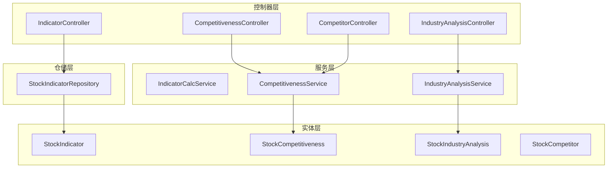
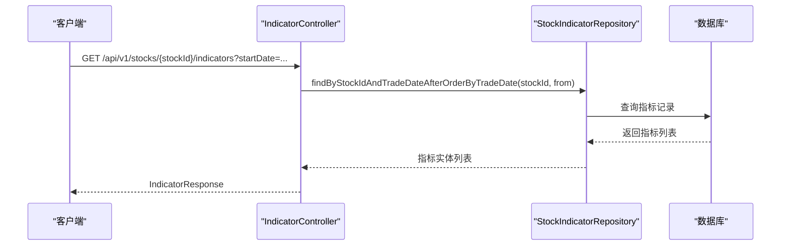
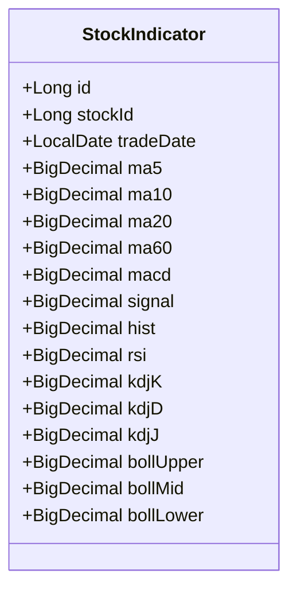
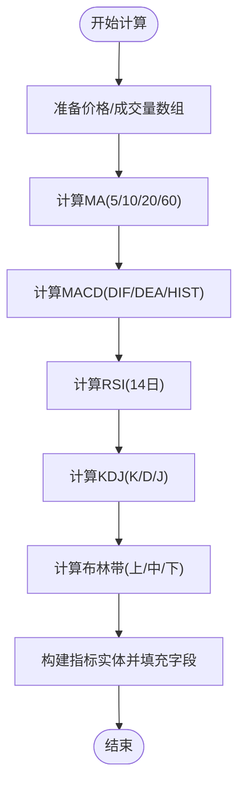
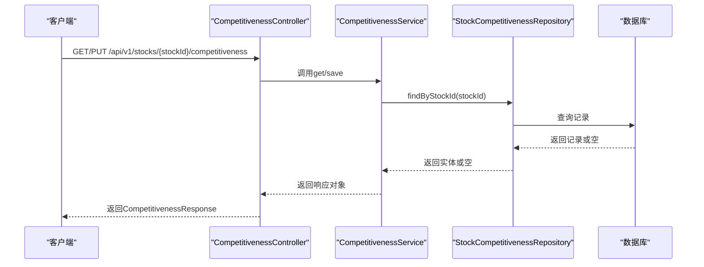
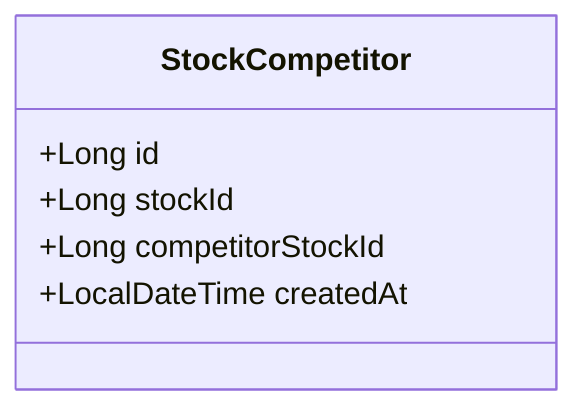
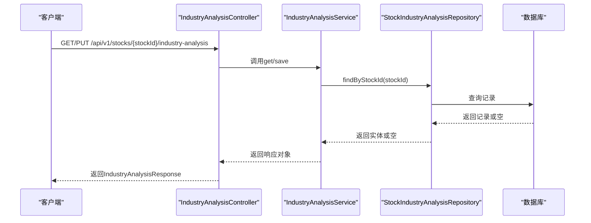
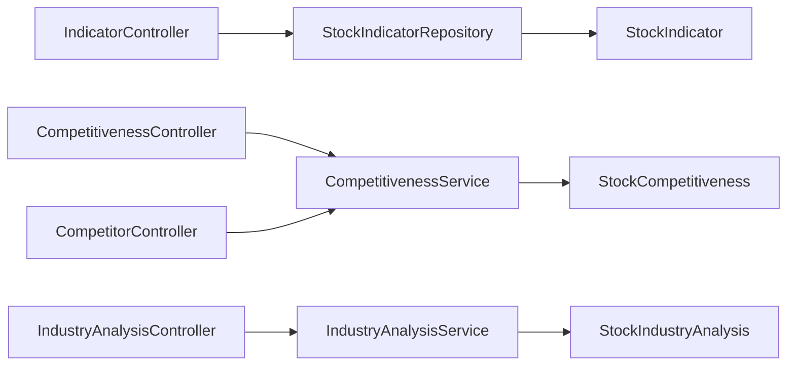

# 分析功能实体

<cite>
**本文引用的文件**
- [StockIndicator.java](file://backend/src/main/java/com/stock/entity/StockIndicator.java)
- [StockCompetitiveness.java](file://backend/src/main/java/com/stock/entity/StockCompetitiveness.java)
- [StockCompetitor.java](file://backend/src/main/java/com/stock/entity/StockCompetitor.java)
- [StockIndustryAnalysis.java](file://backend/src/main/java/com/stock/entity/StockIndustryAnalysis.java)
- [IndicatorCalcService.java](file://backend/src/main/java/com/stock/service/IndicatorCalcService.java)
- [CompetitivenessService.java](file://backend/src/main/java/com/stock/service/CompetitivenessService.java)
- [IndustryAnalysisService.java](file://backend/src/main/java/com/stock/service/IndustryAnalysisService.java)
- [StockIndicatorRepository.java](file://backend/src/main/java/com/stock/repository/StockIndicatorRepository.java)
- [IndicatorController.java](file://backend/src/main/java/com/stock/controller/IndicatorController.java)
- [CompetitivenessController.java](file://backend/src/main/java/com/stock/controller/CompetitivenessController.java)
- [IndustryAnalysisController.java](file://backend/src/main/java/com/stock/controller/IndustryAnalysisController.java)
- [CompetitorController.java](file://backend/src/main/java/com/stock/controller/CompetitorController.java)
- [CompetitivenessRequest.java](file://backend/src/main/java/com/stock/dto/request/CompetitivenessRequest.java)
- [IndustryAnalysisRequest.java](file://backend/src/main/java/com/stock/dto/request/IndustryAnalysisRequest.java)
- [CompetitivenessResponse.java](file://backend/src/main/java/com/stock/dto/response/CompetitivenessResponse.java)
- [IndustryAnalysisResponse.java](file://backend/src/main/java/com/stock/dto/response/IndustryAnalysisResponse.java)
</cite>

## 目录
1. [引言](#引言)
2. [项目结构](#项目结构)
3. [核心组件](#核心组件)
4. [架构总览](#架构总览)
5. [详细组件分析](#详细组件分析)
6. [依赖分析](#依赖分析)
7. [性能考虑](#性能考虑)
8. [故障排查指南](#故障排查指南)
9. [结论](#结论)
10. [附录](#附录)

## 引言
本文件聚焦于分析功能实体，围绕以下目标展开：深入解析StockIndicator技术指标实体的设计模式与计算逻辑；说明StockCompetitiveness竞争力实体的评分算法与比较维度；解释StockCompetitor竞争对手实体的关联关系与数据同步机制；分析StockIndustryAnalysis行业分析实体的数据来源与分析方法；并提供技术指标的缓存策略、性能优化方案、数据更新频率控制，以及分析结果的存储结构与查询优化建议。

## 项目结构
后端采用分层架构（控制器-服务-仓储-实体），分析相关模块位于com.stock包下，分别对应controller、service、repository、entity四个层次，并通过DTO进行请求/响应封装。

图表来源
- [IndicatorController.java:15-48](file://backend/src/main/java/com/stock/controller/IndicatorController.java#L15-L48)
- [CompetitivenessController.java:9-30](file://backend/src/main/java/com/stock/controller/CompetitivenessController.java#L9-L30)
- [IndustryAnalysisController.java:9-30](file://backend/src/main/java/com/stock/controller/IndustryAnalysisController.java#L9-L30)
- [CompetitorController.java:12-41](file://backend/src/main/java/com/stock/controller/CompetitorController.java#L12-L41)
- [IndicatorCalcService.java:12-210](file://backend/src/main/java/com/stock/service/IndicatorCalcService.java#L12-L210)
- [CompetitivenessService.java:16-64](file://backend/src/main/java/com/stock/service/CompetitivenessService.java#L16-L64)
- [IndustryAnalysisService.java:16-61](file://backend/src/main/java/com/stock/service/IndustryAnalysisService.java#L16-L61)
- [StockIndicatorRepository.java:12-21](file://backend/src/main/java/com/stock/repository/StockIndicatorRepository.java#L12-L21)
- [StockIndicator.java:18-72](file://backend/src/main/java/com/stock/entity/StockIndicator.java#L18-L72)
- [StockCompetitiveness.java:18-51](file://backend/src/main/java/com/stock/entity/StockCompetitiveness.java#L18-L51)
- [StockIndustryAnalysis.java:17-44](file://backend/src/main/java/com/stock/entity/StockIndustryAnalysis.java#L17-L44)
- [StockCompetitor.java:17-32](file://backend/src/main/java/com/stock/entity/StockCompetitor.java#L17-L32)

章节来源
- [IndicatorController.java:15-48](file://backend/src/main/java/com/stock/controller/IndicatorController.java#L15-L48)
- [CompetitivenessController.java:9-30](file://backend/src/main/java/com/stock/controller/CompetitivenessController.java#L9-L30)
- [IndustryAnalysisController.java:9-30](file://backend/src/main/java/com/stock/controller/IndustryAnalysisController.java#L9-L30)
- [CompetitorController.java:12-41](file://backend/src/main/java/com/stock/controller/CompetitorController.java#L12-L41)

## 核心组件
- 技术指标实体StockIndicator：定义多周期均线、MACD、RSI、KDJ、布林带等指标字段，使用精度为10位、小数4位的BigDecimal存储，唯一约束保证按股票+交易日去重。
- 竞争力实体StockCompetitiveness：记录市场份额、年份、优劣势、护城河等级与说明、更新时间等，唯一约束保证每只股票仅有一条记录。
- 行业分析实体StockIndustryAnalysis：记录生命周期阶段、上下游影响、政策影响、行业趋势、更新时间等，唯一约束保证每只股票仅有一条记录。
- 竞争对手实体StockCompetitor：记录股票与其竞争对手的配对关系，唯一约束保证同一配对不重复。

章节来源
- [StockIndicator.java:18-72](file://backend/src/main/java/com/stock/entity/StockIndicator.java#L18-L72)
- [StockCompetitiveness.java:18-51](file://backend/src/main/java/com/stock/entity/StockCompetitiveness.java#L18-L51)
- [StockIndustryAnalysis.java:17-44](file://backend/src/main/java/com/stock/entity/StockIndustryAnalysis.java#L17-L44)
- [StockCompetitor.java:17-32](file://backend/src/main/java/com/stock/entity/StockCompetitor.java#L17-L32)

## 架构总览
分析功能由“控制器-服务-仓储-实体”四层构成，控制器负责HTTP接口与参数校验，服务层实现业务逻辑与数据持久化，仓储层提供数据库访问能力，实体层映射表结构。

图表来源
- [IndicatorController.java:27-46](file://backend/src/main/java/com/stock/controller/IndicatorController.java#L27-L46)
- [StockIndicatorRepository.java:14-17](file://backend/src/main/java/com/stock/repository/StockIndicatorRepository.java#L14-L17)

章节来源
- [IndicatorController.java:15-48](file://backend/src/main/java/com/stock/controller/IndicatorController.java#L15-L48)
- [StockIndicatorRepository.java:12-21](file://backend/src/main/java/com/stock/repository/StockIndicatorRepository.java#L12-L21)

## 详细组件分析

### StockIndicator 技术指标实体与计算服务
- 设计模式
  - 实体采用JPA注解映射表结构，使用唯一约束避免重复数据。
  - 计算服务采用纯函数式设计，输入历史日线数据，输出同长度的指标序列，便于批量入库。
- 计算逻辑
  - 周期均线：支持5/10/20/60日均线，缺失前序周期的值以null表示。
  - MACD：基于指数加权移动平均计算DIF、DEA与柱状图，平滑系数来自经典参数。
  - RSI：采用14日相对强弱指标，初始值设为50，后续用平滑公式迭代。
  - KDJ：基于9日RSV与K、D的指数平滑，J=3K−2D。
  - 布林带：20日中轨与标准差，上下轨=中轨±2倍标准差。
- 数据类型与精度
  - 所有数值使用BigDecimal，统一保留4位小数，避免浮点误差累积。
- 关键路径
  - 控制器调用仓储查询指定股票与起始日期后的指标记录。
  - 服务层将日线数据转换为指标序列，逐条填充实体并持久化。

图表来源
- [StockIndicator.java:18-72](file://backend/src/main/java/com/stock/entity/StockIndicator.java#L18-L72)

图表来源
- [IndicatorCalcService.java:15-64](file://backend/src/main/java/com/stock/service/IndicatorCalcService.java#L15-L64)
- [IndicatorCalcService.java:66-204](file://backend/src/main/java/com/stock/service/IndicatorCalcService.java#L66-L204)

章节来源
- [StockIndicator.java:18-72](file://backend/src/main/java/com/stock/entity/StockIndicator.java#L18-L72)
- [IndicatorCalcService.java:12-210](file://backend/src/main/java/com/stock/service/IndicatorCalcService.java#L12-L210)
- [StockIndicatorRepository.java:12-21](file://backend/src/main/java/com/stock/repository/StockIndicatorRepository.java#L12-L21)
- [IndicatorController.java:27-46](file://backend/src/main/java/com/stock/controller/IndicatorController.java#L27-L46)

### StockCompetitiveness 竞争力实体与评分算法
- 评分维度
  - 市场份额：取值范围0~100，用于衡量相对规模。
  - 市场份额年份：基准年份，便于跨年度对比。
  - 优劣势：文本描述公司核心优势与劣势。
  - 护城河：等级标识（如“深/宽/浅”等），结合说明文字形成综合评价。
- 保存流程
  - 先校验股票存在性，再按stockId查找或新建实体，写入字段并更新时间戳，最后持久化返回。
  - 文本内容经HTML净化处理，防止注入风险。
- 查询流程
  - 若存在则返回完整信息，否则返回空值占位对象。

图表来源
- [CompetitivenessController.java:19-28](file://backend/src/main/java/com/stock/controller/CompetitivenessController.java#L19-L28)
- [CompetitivenessService.java:27-62](file://backend/src/main/java/com/stock/service/CompetitivenessService.java#L27-L62)
- [CompetitivenessRequest.java:6-13](file://backend/src/main/java/com/stock/dto/request/CompetitivenessRequest.java#L6-L13)
- [CompetitivenessResponse.java:6-15](file://backend/src/main/java/com/stock/dto/response/CompetitivenessResponse.java#L6-L15)

章节来源
- [StockCompetitiveness.java:18-51](file://backend/src/main/java/com/stock/entity/StockCompetitiveness.java#L18-L51)
- [CompetitivenessService.java:16-64](file://backend/src/main/java/com/stock/service/CompetitivenessService.java#L16-L64)
- [CompetitivenessController.java:9-30](file://backend/src/main/java/com/stock/controller/CompetitivenessController.java#L9-L30)
- [CompetitivenessRequest.java:6-13](file://backend/src/main/java/com/stock/dto/request/CompetitivenessRequest.java#L6-L13)
- [CompetitivenessResponse.java:6-15](file://backend/src/main/java/com/stock/dto/response/CompetitivenessResponse.java#L6-L15)

### StockCompetitor 竞争对手实体与数据同步
- 关联关系
  - 一对多：单个股票可关联多个竞争对手，使用唯一约束确保配对不重复。
  - 创建时记录创建时间，便于追踪新增关系的时间点。
- 同步机制
  - 提供增删接口，新增时根据对手股票代码解析并持久化；删除时按主键移除配对。
  - 建议在后台任务中定期比对公开信息源，自动补充或清理异常配对，保持数据一致性。

图表来源
- [StockCompetitor.java:17-32](file://backend/src/main/java/com/stock/entity/StockCompetitor.java#L17-L32)

章节来源
- [StockCompetitor.java:17-32](file://backend/src/main/java/com/stock/entity/StockCompetitor.java#L17-L32)
- [CompetitorController.java:12-41](file://backend/src/main/java/com/stock/controller/CompetitorController.java#L12-L41)

### StockIndustryAnalysis 行业分析实体与分析方法
- 维度要素
  - 生命周期阶段：描述行业所处阶段（导入、成长、成熟、衰退）。
  - 上下游影响：分析上游资源与下游需求变化对行业的影响。
  - 政策影响：梳理政策导向与监管变化带来的机遇与挑战。
  - 行业趋势：总结技术、市场、消费等层面的趋势。
- 写入流程
  - 校验股票存在性，按stockId查找或新建实体，写入字段并更新时间戳，持久化返回。
  - 文本内容经HTML净化处理，保障安全性。
- 查询流程
  - 存在则返回全部字段，否则返回空值占位对象。

图表来源
- [IndustryAnalysisController.java:19-28](file://backend/src/main/java/com/stock/controller/IndustryAnalysisController.java#L19-L28)
- [IndustryAnalysisService.java:27-59](file://backend/src/main/java/com/stock/service/IndustryAnalysisService.java#L27-L59)
- [IndustryAnalysisRequest.java:6-11](file://backend/src/main/java/com/stock/dto/request/IndustryAnalysisRequest.java#L6-L11)
- [IndustryAnalysisResponse.java:5-12](file://backend/src/main/java/com/stock/dto/response/IndustryAnalysisResponse.java#L5-L12)

章节来源
- [StockIndustryAnalysis.java:17-44](file://backend/src/main/java/com/stock/entity/StockIndustryAnalysis.java#L17-L44)
- [IndustryAnalysisService.java:16-61](file://backend/src/main/java/com/stock/service/IndustryAnalysisService.java#L16-L61)
- [IndustryAnalysisController.java:9-30](file://backend/src/main/java/com/stock/controller/IndustryAnalysisController.java#L9-L30)
- [IndustryAnalysisRequest.java:6-11](file://backend/src/main/java/com/stock/dto/request/IndustryAnalysisRequest.java#L6-L11)
- [IndustryAnalysisResponse.java:5-12](file://backend/src/main/java/com/stock/dto/response/IndustryAnalysisResponse.java#L5-L12)

## 依赖分析
- 控制器依赖服务层，服务层依赖仓储层与实体模型。
- 仓储层基于JPA，提供按股票与日期范围的查询、最大日期查询与按股票清空等能力。
- 实体间无直接Java依赖，通过唯一约束与外键约束在数据库层面建立关系。

图表来源
- [IndicatorController.java:19-25](file://backend/src/main/java/com/stock/controller/IndicatorController.java#L19-L25)
- [CompetitivenessController.java:13-17](file://backend/src/main/java/com/stock/controller/CompetitivenessController.java#L13-L17)
- [IndustryAnalysisController.java:13-17](file://backend/src/main/java/com/stock/controller/IndustryAnalysisController.java#L13-L17)
- [CompetitorController.java:16-20](file://backend/src/main/java/com/stock/controller/CompetitorController.java#L16-L20)
- [StockIndicatorRepository.java:12-21](file://backend/src/main/java/com/stock/repository/StockIndicatorRepository.java#L12-L21)
- [StockCompetitiveness.java:18-51](file://backend/src/main/java/com/stock/entity/StockCompetitiveness.java#L18-L51)
- [StockIndustryAnalysis.java:17-44](file://backend/src/main/java/com/stock/entity/StockIndustryAnalysis.java#L17-L44)
- [StockIndicator.java:18-72](file://backend/src/main/java/com/stock/entity/StockIndicator.java#L18-L72)

章节来源
- [StockIndicatorRepository.java:12-21](file://backend/src/main/java/com/stock/repository/StockIndicatorRepository.java#L12-L21)

## 性能考虑
- 指标计算
  - 时间复杂度：MA/RSI/KDJ/BOLL均为O(n)，MACD为O(n)，整体为O(n)。
  - 空间复杂度：需要O(n)额外数组存储中间结果。
  - 优化建议
    - 使用流式批处理：将日线数据分批传入计算，减少内存峰值。
    - 预分配数组：避免多次扩容，提升数组操作效率。
    - 平滑参数常量化：将系数提取为常量，减少重复构造。
- 缓存策略
  - 按股票+交易日范围缓存指标查询结果，设置合理TTL（如10分钟）。
  - 对高频访问的短期窗口（如最近3个月）启用本地缓存（如Caffeine）。
- 数据更新频率
  - 指标：每日收盘后触发计算与入库，避免重复计算。
  - 竞争力/行业分析：按需更新，设置版本号或更新时间戳，前端轮询或WebSocket推送变更。
- 查询优化
  - 在stock_id与trade_date组合上建立索引，加速范围查询。
  - 使用投影查询仅返回必要字段，减少网络与序列化开销。
  - 对长文本字段（优劣势、说明）采用延迟加载或分页展示。

## 故障排查指南
- 常见问题
  - 股票不存在：控制器层抛出“股票不存在”异常，检查stockId是否正确。
  - 数据重复：唯一约束冲突时需先清理旧数据或更新而非插入。
  - 数值异常：BigDecimal除法需设置精度与舍入模式，避免除零与精度丢失。
- 排查步骤
  - 核对请求参数范围与格式（日期、数值区间）。
  - 查看仓储查询SQL与索引使用情况，确认查询计划。
  - 检查服务层事务边界，确保读写一致性。
  - 关注HTML净化日志，定位潜在注入风险。

章节来源
- [IndicatorController.java:30-32](file://backend/src/main/java/com/stock/controller/IndicatorController.java#L30-L32)
- [CompetitivenessController.java:19-22](file://backend/src/main/java/com/stock/controller/CompetitivenessController.java#L19-L22)
- [IndustryAnalysisController.java:19-22](file://backend/src/main/java/com/stock/controller/IndustryAnalysisController.java#L19-L22)
- [StockIndicatorRepository.java:16-17](file://backend/src/main/java/com/stock/repository/StockIndicatorRepository.java#L16-L17)

## 结论
本分析功能以清晰的分层架构实现，StockIndicator通过严谨的数学公式完成多指标计算，StockCompetitiveness与StockIndustryAnalysis提供结构化的定性分析入口，StockCompetitor支撑竞品关系管理。通过合理的缓存与查询优化，可在保证数据准确性的同时满足高性能需求。

## 附录
- 存储结构要点
  - 指标表：按stock_id+trade_date唯一，支持范围查询与最大日期查询。
  - 竞争力表：按stock_id唯一，便于快速读取与更新。
  - 行业分析表：按stock_id唯一，适合一次性读取。
  - 竞争对手表：按(stock_id, competitor_stock_id)唯一，支持关系增删。
- 查询建议
  - 指标：按stock_id与trade_date范围查询，必要时增加tradeDate升序索引。
  - 竞争力/行业分析：按stock_id查询，更新时写入updatedAt便于增量同步。