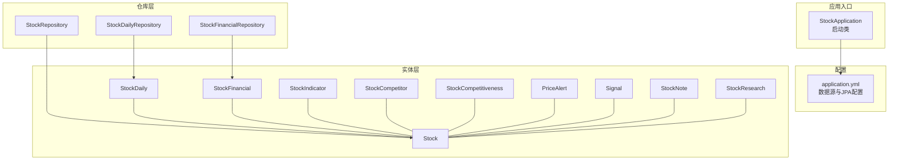
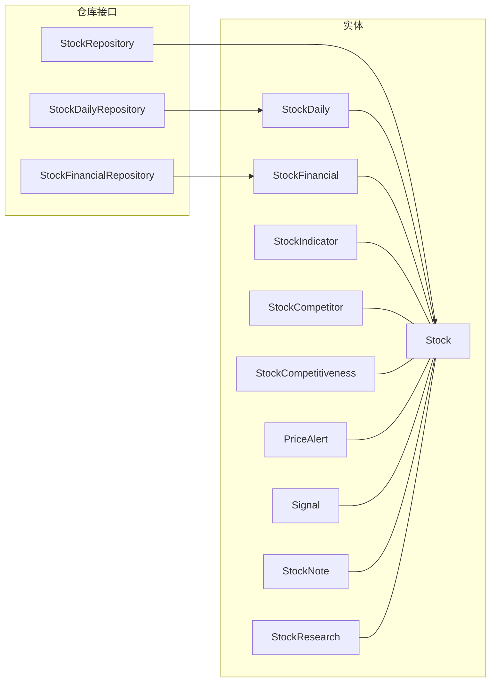
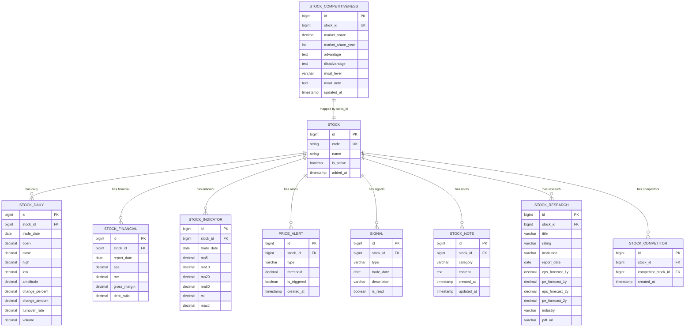
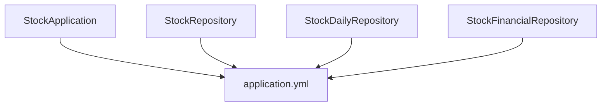

# 数据模型设计

<cite>
**本文引用的文件**
- [Stock.java](file://backend/src/main/java/com/stock/entity/Stock.java)
- [StockDaily.java](file://backend/src/main/java/com/stock/entity/StockDaily.java)
- [StockFinancial.java](file://backend/src/main/java/com/stock/entity/StockFinancial.java)
- [StockCompetitor.java](file://backend/src/main/java/com/stock/entity/StockCompetitor.java)
- [PriceAlert.java](file://backend/src/main/java/com/stock/entity/PriceAlert.java)
- [StockIndicator.java](file://backend/src/main/java/com/stock/entity/StockIndicator.java)
- [StockNote.java](file://backend/src/main/java/com/stock/entity/StockNote.java)
- [StockResearch.java](file://backend/src/main/java/com/stock/entity/StockResearch.java)
- [Signal.java](file://backend/src/main/java/com/stock/entity/Signal.java)
- [StockCompetitiveness.java](file://backend/src/main/java/com/stock/entity/StockCompetitiveness.java)
- [StockRepository.java](file://backend/src/main/java/com/stock/repository/StockRepository.java)
- [StockDailyRepository.java](file://backend/src/main/java/com/stock/repository/StockDailyRepository.java)
- [StockFinancialRepository.java](file://backend/src/main/java/com/stock/repository/StockFinancialRepository.java)
- [StockApplication.java](file://backend/src/main/java/com/stock/StockApplication.java)
- [application.yml](file://backend/src/main/resources/application.yml)
</cite>

## 目录
1. [简介](#简介)
2. [项目结构](#项目结构)
3. [核心组件](#核心组件)
4. [架构总览](#架构总览)
5. [详细组件分析](#详细组件分析)
6. [依赖分析](#依赖分析)
7. [性能考虑](#性能考虑)
8. [故障排查指南](#故障排查指南)
9. [结论](#结论)
10. [附录](#附录)

## 简介
本文件围绕股票交易系统后端的数据模型设计进行系统化技术说明，重点覆盖以下主题：
- JPA 注解使用：实体声明、表映射、字段映射与索引约束
- 主键与外键设计：自增主键策略、唯一约束与业务键
- 复杂关系建模：一对多、一对一、多对多（通过中间表）的映射思路
- 审计字段与软删除：统一时间戳与状态字段的设计
- 生命周期回调与审计字段：结合 Spring Data JPA 的扩展能力
- 性能优化：索引、查询方式、批量操作与缓存策略
- 数据迁移与版本兼容：基于 Hibernate DDL 自动化的演进策略

## 项目结构
后端采用标准 Spring Boot 结构，数据层由 JPA 实体与 Spring Data JPA 仓库组成，配合 H2 内嵌数据库与自动 DDL 更新策略。

图表来源
- [StockApplication.java:1-16](file://backend/src/main/java/com/stock/StockApplication.java#L1-L16)
- [application.yml:1-28](file://backend/src/main/resources/application.yml#L1-L28)
- [Stock.java:1-86](file://backend/src/main/java/com/stock/entity/Stock.java#L1-L86)
- [StockDaily.java:1-60](file://backend/src/main/java/com/stock/entity/StockDaily.java#L1-L60)
- [StockFinancial.java:1-72](file://backend/src/main/java/com/stock/entity/StockFinancial.java#L1-L72)
- [StockIndicator.java:1-72](file://backend/src/main/java/com/stock/entity/StockIndicator.java#L1-L72)
- [StockCompetitor.java:1-32](file://backend/src/main/java/com/stock/entity/StockCompetitor.java#L1-L32)
- [StockCompetitiveness.java:1-51](file://backend/src/main/java/com/stock/entity/StockCompetitiveness.java#L1-L51)
- [PriceAlert.java:1-37](file://backend/src/main/java/com/stock/entity/PriceAlert.java#L1-L37)
- [Signal.java:1-36](file://backend/src/main/java/com/stock/entity/Signal.java#L1-L36)
- [StockNote.java:1-37](file://backend/src/main/java/com/stock/entity/StockNote.java#L1-L37)
- [StockResearch.java:1-55](file://backend/src/main/java/com/stock/entity/StockResearch.java#L1-L55)
- [StockRepository.java:1-18](file://backend/src/main/java/com/stock/repository/StockRepository.java#L1-L18)
- [StockDailyRepository.java:1-24](file://backend/src/main/java/com/stock/repository/StockDailyRepository.java#L1-L24)
- [StockFinancialRepository.java:1-15](file://backend/src/main/java/com/stock/repository/StockFinancialRepository.java#L1-L15)

章节来源
- [StockApplication.java:1-16](file://backend/src/main/java/com/stock/StockApplication.java#L1-L16)
- [application.yml:1-28](file://backend/src/main/resources/application.yml#L1-L28)

## 核心组件
本节概述各实体的核心字段与映射策略，并总结主键、唯一约束与审计字段的使用模式。

- 股票基础信息（Stock）
  - 主键：自增 Long id
  - 唯一键：code（唯一、非空）
  - 审计字段：addedAt（创建时间），isActive（软删除/启用状态）
  - 字段类型：字符串、数值、日期时间、精度控制（BigDecimal）

- 日线行情（StockDaily）
  - 主键：自增 Long id
  - 唯一约束：(stock_id, trade_date)，避免重复交易日记录
  - 字段类型：开盘/收盘/最高/最低价、成交量、成交额、涨跌幅等

- 财务指标（StockFinancial）
  - 主键：自增 Long id
  - 唯一约束：(stock_id, report_date)，按报告期去重
  - 字段类型：财务比率、盈利能力、偿债能力等指标

- 技术指标（StockIndicator）
  - 主键：自增 Long id
  - 唯一约束：(stock_id, trade_date)，按交易日去重
  - 字段类型：均线、MACD、RSI、KDJ、布林带上下轨等

- 竞争对手（StockCompetitor）
  - 主键：自增 Long id
  - 唯一约束：(stock_id, competitor_stock_id)，防止重复关系
  - 审计字段：createdAt

- 竞争力画像（StockCompetitiveness）
  - 主键：自增 Long id
  - 唯一约束：stock_id（一对一）
  - 字段类型：市场份额、护城河等级与说明、更新时间

- 价格提醒（PriceAlert）
  - 主键：自增 Long id
  - 字段类型：提醒类型、阈值、触发状态、创建时间

- 信号（Signal）
  - 主键：自增 Long id
  - 字段类型：信号类型、交易日、描述、已读状态

- 股票笔记（StockNote）
  - 主键：自增 Long id
  - 字段类型：分类、内容（TEXT）、创建/更新时间

- 研究报告（StockResearch）
  - 主键：自增 Long id
  - 字段类型：标题、评级、机构、报告日期、EPS/PE 预测、行业、PDF 链接

章节来源
- [Stock.java:1-86](file://backend/src/main/java/com/stock/entity/Stock.java#L1-L86)
- [StockDaily.java:1-60](file://backend/src/main/java/com/stock/entity/StockDaily.java#L1-L60)
- [StockFinancial.java:1-72](file://backend/src/main/java/com/stock/entity/StockFinancial.java#L1-L72)
- [StockIndicator.java:1-72](file://backend/src/main/java/com/stock/entity/StockIndicator.java#L1-L72)
- [StockCompetitor.java:1-32](file://backend/src/main/java/com/stock/entity/StockCompetitor.java#L1-L32)
- [StockCompetitiveness.java:1-51](file://backend/src/main/java/com/stock/entity/StockCompetitiveness.java#L1-L51)
- [PriceAlert.java:1-37](file://backend/src/main/java/com/stock/entity/PriceAlert.java#L1-L37)
- [Signal.java:1-36](file://backend/src/main/java/com/stock/entity/Signal.java#L1-L36)
- [StockNote.java:1-37](file://backend/src/main/java/com/stock/entity/StockNote.java#L1-L37)
- [StockResearch.java:1-55](file://backend/src/main/java/com/stock/entity/StockResearch.java#L1-L55)

## 架构总览
下图展示实体与仓库之间的关系，以及典型查询路径。

图表来源
- [StockRepository.java:1-18](file://backend/src/main/java/com/stock/repository/StockRepository.java#L1-L18)
- [StockDailyRepository.java:1-24](file://backend/src/main/java/com/stock/repository/StockDailyRepository.java#L1-L24)
- [StockFinancialRepository.java:1-15](file://backend/src/main/java/com/stock/repository/StockFinancialRepository.java#L1-L15)
- [Stock.java:1-86](file://backend/src/main/java/com/stock/entity/Stock.java#L1-L86)
- [StockDaily.java:1-60](file://backend/src/main/java/com/stock/entity/StockDaily.java#L1-L60)
- [StockFinancial.java:1-72](file://backend/src/main/java/com/stock/entity/StockFinancial.java#L1-L72)
- [StockIndicator.java:1-72](file://backend/src/main/java/com/stock/entity/StockIndicator.java#L1-L72)
- [StockCompetitor.java:1-32](file://backend/src/main/java/com/stock/entity/StockCompetitor.java#L1-L32)
- [StockCompetitiveness.java:1-51](file://backend/src/main/java/com/stock/entity/StockCompetitiveness.java#L1-L51)
- [PriceAlert.java:1-37](file://backend/src/main/java/com/stock/entity/PriceAlert.java#L1-L37)
- [Signal.java:1-36](file://backend/src/main/java/com/stock/entity/Signal.java#L1-L36)
- [StockNote.java:1-37](file://backend/src/main/java/com/stock/entity/StockNote.java#L1-L37)
- [StockResearch.java:1-55](file://backend/src/main/java/com/stock/entity/StockResearch.java#L1-L55)

## 详细组件分析

### 实体注解与字段映射
- @Entity：声明为持久化实体
- @Table：指定表名；部分实体通过 uniqueConstraints 定义复合唯一索引
- @Column：字段映射，支持长度、精度、小数位、是否可空、默认值等
- @Lob：大文本字段映射（如 TEXT 类型）
- @Id + @GeneratedValue：主键生成策略（IDENTITY）
- 审计字段：created_at/updated_at/added_at 等统一命名风格

章节来源
- [Stock.java:1-86](file://backend/src/main/java/com/stock/entity/Stock.java#L1-L86)
- [StockDaily.java:1-60](file://backend/src/main/java/com/stock/entity/StockDaily.java#L1-L60)
- [StockFinancial.java:1-72](file://backend/src/main/java/com/stock/entity/StockFinancial.java#L1-L72)
- [StockIndicator.java:1-72](file://backend/src/main/java/com/stock/entity/StockIndicator.java#L1-L72)
- [StockCompetitor.java:1-32](file://backend/src/main/java/com/stock/entity/StockCompetitor.java#L1-L32)
- [StockCompetitiveness.java:1-51](file://backend/src/main/java/com/stock/entity/StockCompetitiveness.java#L1-L51)
- [PriceAlert.java:1-37](file://backend/src/main/java/com/stock/entity/PriceAlert.java#L1-L37)
- [Signal.java:1-36](file://backend/src/main/java/com/stock/entity/Signal.java#L1-L36)
- [StockNote.java:1-37](file://backend/src/main/java/com/stock/entity/StockNote.java#L1-L37)
- [StockResearch.java:1-55](file://backend/src/main/java/com/stock/entity/StockResearch.java#L1-L55)

### 主键生成策略
- 统一使用 IDENTITY 策略，适用于 MySQL、PostgreSQL、H2 等数据库的自增列
- 对于分布式或高并发场景，可考虑序列（SEQUENCE）或应用侧分配策略以提升可移植性

章节来源
- [Stock.java:19-21](file://backend/src/main/java/com/stock/entity/Stock.java#L19-L21)
- [StockDaily.java:20-22](file://backend/src/main/java/com/stock/entity/StockDaily.java#L20-L22)
- [StockFinancial.java:20-22](file://backend/src/main/java/com/stock/entity/StockFinancial.java#L20-L22)
- [StockIndicator.java:20-22](file://backend/src/main/java/com/stock/entity/StockIndicator.java#L20-L22)
- [StockCompetitor.java:19-21](file://backend/src/main/java/com/stock/entity/StockCompetitor.java#L19-L21)
- [StockCompetitiveness.java:20-22](file://backend/src/main/java/com/stock/entity/StockCompetitiveness.java#L20-L22)
- [PriceAlert.java:18-20](file://backend/src/main/java/com/stock/entity/PriceAlert.java#L18-L20)
- [Signal.java:17-19](file://backend/src/main/java/com/stock/entity/Signal.java#L17-L19)
- [StockNote.java:17-19](file://backend/src/main/java/com/stock/entity/StockNote.java#L17-L19)
- [StockResearch.java:18-20](file://backend/src/main/java/com/stock/entity/StockResearch.java#L18-L20)

### 外键关系与唯一约束
- 一对多：Stock → StockDaily/StockFinancial/StockIndicator/PriceAlert/Signal/StockNote/StockResearch
- 一对一：Stock → StockCompetitiveness（通过 stock_id 唯一约束）
- 多对多：Stock ↔ Stock（通过 StockCompetitor 中间表）
- 复合唯一：StockDaily、StockFinancial、StockIndicator 在 (stock_id, date) 上唯一

章节来源
- [StockDaily.java:15-17](file://backend/src/main/java/com/stock/entity/StockDaily.java#L15-L17)
- [StockFinancial.java:15-17](file://backend/src/main/java/com/stock/entity/StockFinancial.java#L15-L17)
- [StockIndicator.java:15-17](file://backend/src/main/java/com/stock/entity/StockIndicator.java#L15-L17)
- [StockCompetitor.java:14-16](file://backend/src/main/java/com/stock/entity/StockCompetitor.java#L14-L16)
- [StockCompetitiveness.java:15-17](file://backend/src/main/java/com/stock/entity/StockCompetitiveness.java#L15-L17)

### 索引与查询优化
- 唯一约束即隐式索引：(stock_id, trade_date)、(stock_id, report_date)、(stock_id, competitor_stock_id)
- 业务查询接口：
  - 按股票代码查询：StockRepository.findByCode
  - 按活跃状态查询：StockRepository.findByIsActiveTrue
  - 按日期范围查询日线：StockDailyRepository.findByStockIdAndTradeDateBetweenOrderByTradeDate
  - 获取最新交易日：StockDailyRepository.findTopByStockIdOrderByTradeDateDesc
  - 查询最大交易日：StockDailyRepository.findMaxTradeDateByStockId
  - 按股票删除相关记录：StockDailyRepository.deleteByStockId、StockFinancialRepository.deleteByStockId

章节来源
- [StockRepository.java:10-17](file://backend/src/main/java/com/stock/repository/StockRepository.java#L10-L17)
- [StockDailyRepository.java:13-23](file://backend/src/main/java/com/stock/repository/StockDailyRepository.java#L13-L23)
- [StockFinancialRepository.java:9-14](file://backend/src/main/java/com/stock/repository/StockFinancialRepository.java#L9-L14)

### 审计字段与软删除
- 统一命名：addedAt、createdAt、updatedAt
- 软删除：isActive 字段用于逻辑删除，默认启用；查询时可通过 isActive 过滤
- 建议：在查询层默认过滤 isActive=true，必要时提供软删除专用查询接口

章节来源
- [Stock.java:80-84](file://backend/src/main/java/com/stock/entity/Stock.java#L80-L84)
- [StockCompetitor.java:29-30](file://backend/src/main/java/com/stock/entity/StockCompetitor.java#L29-L30)
- [StockNote.java:31-35](file://backend/src/main/java/com/stock/entity/StockNote.java#L31-L35)

### 复杂关系映射示例
- 一对一：StockCompetitiveness(stock_id 唯一) 映射到 Stock
- 多对多：Stock 与 Stock 通过 StockCompetitor 关联，中间表含 created_at 审计
- 一对多：Stock 与 StockDaily/StockFinancial/StockIndicator/PriceAlert/Signal/StockNote/StockResearch

图表来源
- [Stock.java:1-86](file://backend/src/main/java/com/stock/entity/Stock.java#L1-L86)
- [StockDaily.java:1-60](file://backend/src/main/java/com/stock/entity/StockDaily.java#L1-L60)
- [StockFinancial.java:1-72](file://backend/src/main/java/com/stock/entity/StockFinancial.java#L1-L72)
- [StockIndicator.java:1-72](file://backend/src/main/java/com/stock/entity/StockIndicator.java#L1-L72)
- [StockCompetitor.java:1-32](file://backend/src/main/java/com/stock/entity/StockCompetitor.java#L1-L32)
- [StockCompetitiveness.java:1-51](file://backend/src/main/java/com/stock/entity/StockCompetitiveness.java#L1-L51)
- [PriceAlert.java:1-37](file://backend/src/main/java/com/stock/entity/PriceAlert.java#L1-L37)
- [Signal.java:1-36](file://backend/src/main/java/com/stock/entity/Signal.java#L1-L36)
- [StockNote.java:1-37](file://backend/src/main/java/com/stock/entity/StockNote.java#L1-L37)
- [StockResearch.java:1-55](file://backend/src/main/java/com/stock/entity/StockResearch.java#L1-L55)

### JPA 生命周期回调与审计字段
- 审计字段：created_at/updated_at/added_at 统一命名，便于全局审计
- 回调建议：若需自动填充审计字段，可在实体上添加 @PrePersist/@PreUpdate 或使用 Spring Data Auditing（需配置审计注解与实体字段匹配）
- 当前实现：通过业务层设置 addedAt/createdAt/updatedAt，保持简单直接

章节来源
- [Stock.java:80-84](file://backend/src/main/java/com/stock/entity/Stock.java#L80-L84)
- [StockCompetitor.java:29-30](file://backend/src/main/java/com/stock/entity/StockCompetitor.java#L29-L30)
- [StockNote.java:31-35](file://backend/src/main/java/com/stock/entity/StockNote.java#L31-L35)

### 软删除机制
- 使用 Boolean isActive 字段标识启用/禁用
- 查询层默认过滤 isActive=true，确保返回有效数据
- 删除流程：更新 isActive=false 或物理删除（视业务需求）

章节来源
- [Stock.java:83-84](file://backend/src/main/java/com/stock/entity/Stock.java#L83-L84)

### 实体类设计最佳实践
- 字段命名：采用下划线风格与数据库一致，便于 SQL 对应
- 精度控制：金额、比率、涨跌幅统一使用 BigDecimal，并设置 precision/scale
- 唯一键：业务键（如 code、(stock_id, trade_date)）必须建立唯一约束
- 大字段：长文本使用 @Lob 映射为 TEXT，避免过长的 VARCHAR
- 审计字段：统一命名与赋值策略，减少跨模块差异

章节来源
- [Stock.java:23-27](file://backend/src/main/java/com/stock/entity/Stock.java#L23-L27)
- [StockDaily.java:27-28](file://backend/src/main/java/com/stock/entity/StockDaily.java#L27-L28)
- [StockFinancial.java:27-28](file://backend/src/main/java/com/stock/entity/StockFinancial.java#L27-L28)
- [StockIndicator.java:27-28](file://backend/src/main/java/com/stock/entity/StockIndicator.java#L27-L28)
- [StockNote.java:27-29](file://backend/src/main/java/com/stock/entity/StockNote.java#L27-L29)

## 依赖分析
- 应用启动：StockApplication 启用调度与异步任务
- 数据源：H2 文件数据库，JPA 自动 DDL 更新（update）
- 实体与仓库：仓库接口继承 JpaRepository，天然具备 CRUD 与分页排序能力
- 查询扩展：通过 @Query 与命名参数实现复杂查询

图表来源
- [StockApplication.java:1-16](file://backend/src/main/java/com/stock/StockApplication.java#L1-L16)
- [application.yml:1-28](file://backend/src/main/resources/application.yml#L1-L28)
- [StockRepository.java:1-18](file://backend/src/main/java/com/stock/repository/StockRepository.java#L1-L18)
- [StockDailyRepository.java:1-24](file://backend/src/main/java/com/stock/repository/StockDailyRepository.java#L1-L24)
- [StockFinancialRepository.java:1-15](file://backend/src/main/java/com/stock/repository/StockFinancialRepository.java#L1-L15)

章节来源
- [StockApplication.java:1-16](file://backend/src/main/java/com/stock/StockApplication.java#L1-L16)
- [application.yml:1-28](file://backend/src/main/resources/application.yml#L1-L28)

## 性能考虑
- 索引策略
  - 复合唯一索引：(stock_id, trade_date)、(stock_id, report_date)、(stock_id, competitor_stock_id)
  - 单列索引：stock_id、trade_date、report_date 等高频过滤字段
- 查询优化
  - 使用 @Query 与命名参数，避免 N+1 查询
  - 分页查询：利用 JpaRepository 的 Pageable 接口
  - 批量删除：通过仓库接口 deleteByStockId 清理历史数据
- 数值精度
  - BigDecimal 的 precision/scale 控制存储与计算精度，避免浮点误差
- 缓存建议
  - 对热点股票与指标结果引入缓存（Redis/Memcached），降低数据库压力
- 并发与事务
  - 高并发写入时，优先使用数据库自增主键与唯一约束保证一致性
  - 对批量导入场景，使用事务块与批量刷洗（flush/flush clear）提升吞吐

## 故障排查指南
- 数据库连接问题
  - 检查 application.yml 中的 datasource.url 与 driver-class-name
  - 确认 H2 控制台可用：/h2-console
- DDL 自动更新
  - ddl-auto: update 可能导致表结构变更，生产环境建议改为 validate 或手动迁移
- 查询异常
  - 确认 @Query 语句与实体属性名称一致
  - 检查命名参数 @Param 是否匹配
- 唯一约束冲突
  - 插入前检查唯一键是否存在，或捕获唯一约束异常并回滚事务
- 审计字段缺失
  - 确保业务层正确设置 addedAt/createdAt/updatedAt

章节来源
- [application.yml:4-17](file://backend/src/main/resources/application.yml#L4-L17)
- [StockDailyRepository.java:19-20](file://backend/src/main/java/com/stock/repository/StockDailyRepository.java#L19-L20)

## 结论
本数据模型以 Stock 为核心，围绕日线、财务、技术指标、研究与信号等维度构建了清晰的一对多关系，并通过复合唯一约束保障数据完整性。统一的审计字段与软删除策略提升了可维护性。建议在生产环境中引入显式的审计回调、缓存与更严格的迁移策略，以进一步增强一致性与性能。

## 附录
- 数据迁移与版本兼容
  - 开发阶段：使用 ddl-auto: update 快速迭代
  - 测试阶段：导出 schema 并比对差异，确保迁移脚本幂等
  - 生产阶段：禁止自动 DDL，采用 Flyway/Liquibase 管理迁移脚本，先创建新列/索引，再迁移数据，最后删除旧列
- 版本兼容性
  - 新增字段建议可空并提供默认值
  - 删除字段时保留映射但标记废弃，逐步清理
  - 对 ENUM/JSON 字段，提供向后兼容的解析策略